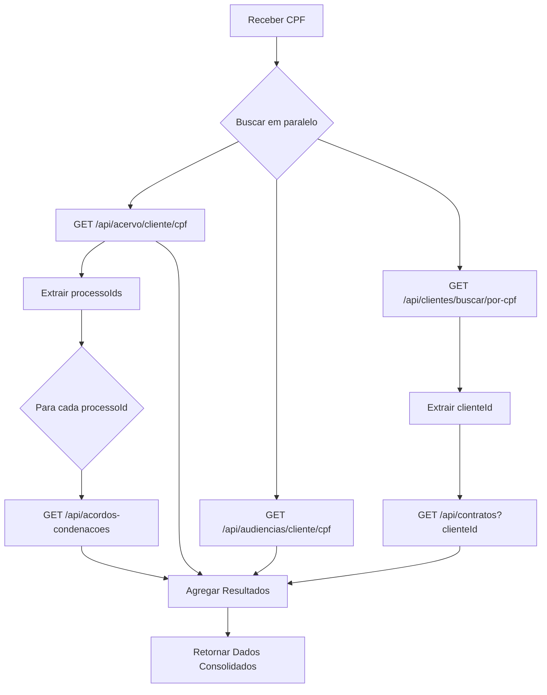
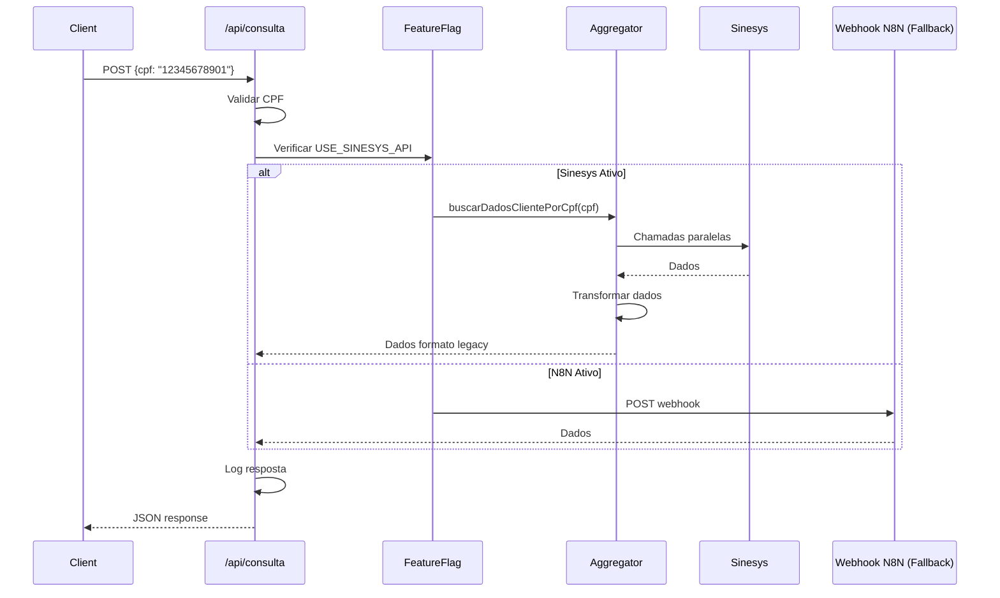

# Plano de Implementação: Migração Meu Processo para API Sinesys

**Data de Criação:** 08 de dezembro de 2025  
**Sistema Origem:** Meu Processo Zattar Advogados (Webhook N8N)  
**Sistema Destino:** Sinesys API REST  
**Objetivo:** Migrar consumo de dados do webhook N8N para APIs nativas do Sinesys

---

## Índice

1. [Visão Geral da Migração](#visão-geral-da-migração)
2. [Análise de Gaps e Decisões Arquiteturais](#análise-de-gaps-e-decisões-arquiteturais)
3. [Arquitetura Proposta](#arquitetura-proposta)
4. [Estratégia de Implementação](#estratégia-de-implementação)
5. [Fases de Implementação](#fases-de-implementação)
6. [Transformação de Dados](#transformação-de-dados)
7. [Estratégia de Cache e Performance](#estratégia-de-cache-e-performance)
8. [Gestão de Erros e Resiliência](#gestão-de-erros-e-resiliência)
9. [Estratégia de Deploy e Rollback](#estratégia-de-deploy-e-rollback)
10. [Critérios de Aceitação](#critérios-de-aceitação)

---

## Visão Geral da Migração

### Contexto Atual

O aplicativo Meu Processo atualmente consome dados através de um webhook N8N que atua como intermediário entre a base de dados antiga e o aplicativo cliente. Este webhook recebe requisições com CPF e retorna dados agregados de processos, audiências, contratos e acordos/condenações.

### Motivação da Migração

| Aspecto | Situação Atual | Situação Desejada |
|---------|----------------|-------------------|
| **Fonte de Dados** | Base antiga via N8N | Sinesys (base atual) |
| **Latência** | 2-5 segundos (webhook) | Otimizado com cache |
| **Confiabilidade** | Dependência de workflow | API REST nativa |
| **Manutenibilidade** | Transformações no N8N | Lógica no aplicativo |
| **Dados** | Possivelmente desatualizados | Tempo real |

### Escopo da Migração

**Incluído:**
- Migração do endpoint de consulta por CPF
- Substituição de chamadas ao webhook N8N por chamadas à API Sinesys
- Implementação de camada de abstração para APIs
- Transformação de dados para manter compatibilidade com UI existente
- Estratégia de cache e otimização de performance
- Testes de integração e validação

**Excluído:**
- Modificações na UI/UX do aplicativo cliente
- Migração de dados históricos (responsabilidade do Sinesys)
- Alterações no sistema de autenticação de usuários finais
- Implementação de novas funcionalidades

---

## Análise de Gaps e Decisões Arquiteturais

### Gap 1: Endpoint Único vs Múltiplos Endpoints

**Problema:** O webhook N8N retorna todos os dados em uma única chamada, enquanto o Sinesys possui endpoints especializados.

**Decisão Arquitetural:**

Criar camada de agregação no backend do aplicativo Meu Processo que orquestra múltiplas chamadas paralelas à API Sinesys e consolida os resultados no formato esperado pela UI.

**Justificativa:**
- Mantém compatibilidade com UI existente
- Permite otimizações futuras sem afetar o frontend
- Centraliza lógica de transformação de dados
- Facilita testes e manutenção

### Gap 2: Autenticação e Segurança

**Problema:** Webhook N8N usa Basic Auth, Sinesys suporta múltiplos métodos.

**Decisão Arquitetural:**

Utilizar Service API Key (x-service-api-key) para comunicação servidor-servidor, mantendo a chave exclusivamente no backend do aplicativo.

**Justificativa:**
- Não requer autenticação individual de clientes
- Adequado para app de consulta pública de dados
- Simplifica implementação
- Mantém segurança isolando chave no servidor

**Implementação:**
- Chave armazenada em variável de ambiente (SINESYS_SERVICE_API_KEY)
- Todas as chamadas passam por API Route do Next.js
- Nunca expor chave no código client-side

### Gap 3: Identificadores (CPF vs IDs Numéricos)

**Problema:** Alguns endpoints do Sinesys exigem IDs numéricos (clienteId, processoId) mas o app só possui CPF.

**Decisão Arquitetural:**

Implementar fluxo de resolução de identificadores em duas etapas:
1. Buscar entidade por CPF para obter ID numérico
2. Usar ID numérico para buscar dados relacionados

**Justificativa:**
- Não requer alterações na API Sinesys
- Isolado na camada de serviço
- Permite cache de mapeamentos CPF → ID

### Gap 4: Estrutura de Timeline

**Problema:** Estrutura de timeline pode diferir entre N8N e Sinesys.

**Decisão Arquitetural:**

Criar transformadores específicos que normalizam a estrutura de timeline do Sinesys para o formato esperado pelo aplicativo cliente.

**Justificativa:**
- Evita alterações na UI
- Centraliza lógica de transformação
- Facilita adaptação a mudanças futuras na API

### Gap 5: Sincronização Assíncrona de Timeline

**Problema:** Sinesys pode disparar captura lazy quando timeline não está disponível.

**Decisão Arquitetural:**

Implementar estratégia de polling inteligente com degradação graceful:
- Detectar status de sincronização (disponível, sincronizando, indisponível)
- Exibir feedback apropriado ao usuário
- Implementar polling automático com limite de tentativas
- Fallback para exibir dados parciais se timeline não disponível

**Justificativa:**
- Melhor experiência do usuário
- Transparência no processo de sincronização
- Evita falhas silenciosas

---

## Arquitetura Proposta

### Visão Geral


### Camadas da Arquitetura

#### Camada 1: Cliente (Browser)

**Responsabilidades:**
- Renderização da interface
- Gerenciamento de estado local (DashboardContext)
- Cache em localStorage
- Feedback visual ao usuário

**Alterações Necessárias:**
- Mínimas ou nenhuma
- Possível adição de estados de sincronização de timeline

#### Camada 2: Backend do Aplicativo (Next.js API Routes)

**Responsabilidades:**
- Orquestração de chamadas à API Sinesys
- Agregação de dados de múltiplos endpoints
- Transformação de dados para formato legacy
- Gestão de autenticação (Service API Key)
- Cache de respostas
- Tratamento de erros

**Componentes:**

| Componente | Propósito |
|------------|-----------|
| **API Route Handler** | Endpoint /api/consulta que recebe CPF |
| **SinesysClient** | Cliente HTTP para comunicação com Sinesys |
| **DataAggregator** | Orquestra múltiplas chamadas e agrega resultados |
| **DataTransformers** | Converte formato Sinesys para formato legacy |
| **CacheManager** | Gerencia cache de respostas (opcional) |
| **ErrorHandler** | Tratamento centralizado de erros |

#### Camada 3: API Sinesys

**Endpoints Consumidos:**

| Endpoint | Método | Propósito |
|----------|--------|-----------|
| `/api/acervo/cliente/cpf/{cpf}` | GET | Buscar processos por CPF |
| `/api/audiencias/cliente/cpf/{cpf}` | GET | Buscar audiências por CPF |
| `/api/clientes/buscar/por-cpf/{cpf}` | GET | Buscar dados do cliente |
| `/api/contratos?clienteId={id}` | GET | Buscar contratos do cliente |
| `/api/acordos-condenacoes?processoId={id}` | GET | Buscar acordos/condenações |

---

## Estratégia de Implementação

### Princípios Norteadores

1. **Compatibilidade Retroativa:** Manter interface de contrato com o frontend inalterada
2. **Implementação Incremental:** Deploy gradual com feature flags
3. **Observabilidade:** Logs detalhados e métricas em todas as camadas
4. **Resiliência:** Tratamento robusto de erros com fallbacks
5. **Performance:** Otimização com cache e chamadas paralelas

### Abordagem de Desenvolvimento

**Estratégia:** Bottom-up com testes em cada camada

1. **Desenvolver serviços base** (SinesysClient)
2. **Implementar transformadores** de dados
3. **Criar camada de agregação** (DataAggregator)
4. **Atualizar API Route** principal
5. **Testes de integração** completos
6. **Deploy gradual** com monitoramento

### Gestão de Mudanças

**Feature Flag:**

Implementar toggle para alternar entre webhook N8N (legacy) e API Sinesys (novo) durante período de transição.

```typescript
// Controle via variável de ambiente
const USE_SINESYS_API = process.env.NEXT_PUBLIC_USE_SINESYS === 'true'
```

**Período de Coexistência:**
- 2 semanas em staging com testes intensivos
- 1 semana em produção com rollout gradual (10% → 50% → 100%)
- 2 semanas de monitoramento pós-migração completa
- Desativação do webhook N8N após estabilização

---

## Fases de Implementação

### Fase 1: Preparação e Setup (3 dias)

#### Objetivos
- Configurar ambiente de desenvolvimento
- Obter credenciais e acessos
- Validar conectividade com APIs Sinesys
- Documentar schemas completos

#### Atividades

**1.1 Configuração de Credenciais**

Variáveis de ambiente necessárias:

| Variável | Descrição | Ambiente |
|----------|-----------|----------|
| `NEXT_PUBLIC_SINESYS_API_URL` | URL base da API Sinesys | Todos |
| `SINESYS_SERVICE_API_KEY` | Chave de autenticação servidor-servidor | Backend |
| `NEXT_PUBLIC_USE_SINESYS` | Feature flag para toggle N8N/Sinesys | Todos |
| `REDIS_URL` | URL para cache (opcional) | Backend |

**1.2 Validação de APIs**

Criar script de teste para validar conectividade e schemas:

- Testar autenticação com Service API Key
- Validar resposta de cada endpoint
- Documentar estrutura exata de campos
- Identificar campos ausentes ou diferentes do N8N

**1.3 Mapeamento de Dados**

Criar documento de mapeamento campo a campo:

| Campo N8N | Campo Sinesys | Transformação | Status |
|-----------|---------------|---------------|--------|
| `contrato.cliente_nome` | `cliente.nome` | Direto | ✅ |
| `contrato.data_admissao` | ❓ | Verificar disponibilidade | ⚠️ |
| `audiencia.advogado` | ❓ | Verificar disponibilidade | ⚠️ |

#### Entregáveis
- [ ] Ambiente configurado com variáveis
- [ ] Conectividade validada com Sinesys
- [ ] Documento de mapeamento de schemas completo
- [ ] Identificação de gaps e estratégias de mitigação

---

### Fase 2: Desenvolvimento da Camada de Serviço (5 dias)

#### Objetivos
- Criar cliente HTTP para Sinesys
- Implementar orquestração de chamadas
- Desenvolver transformadores de dados
- Implementar gestão de erros

#### Atividades

**2.1 SinesysClient - Cliente HTTP**

Responsabilidades:
- Gerenciar autenticação (Service API Key)
- Realizar chamadas HTTP aos endpoints
- Tratar erros de rede e HTTP
- Logging de requisições

Características:
- Singleton para reuso de conexões
- Timeout configurável
- Retry automático para falhas transientes
- Logging estruturado

**2.2 DataAggregator - Orquestração**

Responsabilidades:
- Coordenar múltiplas chamadas à API Sinesys
- Executar chamadas em paralelo quando possível
- Resolver dependências entre chamadas (CPF → clienteId → contratos)
- Consolidar resultados

Fluxo de Agregação:



Otimizações:
- Chamadas paralelas sempre que possível
- Cache de mapeamentos CPF → clienteId
- Evitar chamadas redundantes

**2.3 Data Transformers - Transformação**

Responsabilidades:
- Converter formato Sinesys para formato legacy N8N
- Normalizar estruturas de dados
- Aplicar formatações (datas, valores monetários)
- Preencher valores padrão para campos ausentes

Transformadores por Entidade:

| Transformador | Entrada | Saída |
|---------------|---------|-------|
| `ProcessoTransformer` | `ProcessoSinesys[]` | `ProcessoItem[]` |
| `AudienciaTransformer` | `AudienciaSinesys[]` | `Audiencia[]` |
| `ContratoTransformer` | `ContratoSinesys[]` | `Contrato[]` |
| `PagamentoTransformer` | `AcordoSinesys[]` | `Pagamento[]` |

Estratégias para Campos Ausentes:

| Situação | Estratégia |
|----------|-----------|
| Campo não existe no Sinesys | Usar valor padrão (null, "", 0) |
| Campo existe com nome diferente | Mapear corretamente |
| Campo calculado no N8N | Replicar cálculo no transformador |
| Campo descontinuado | Omitir ou deprecar na UI |

**2.4 Error Handler - Gestão de Erros**

Categorias de Erro:

| Tipo | Causa | Tratamento |
|------|-------|------------|
| **Network Error** | Timeout, conexão | Retry com backoff exponencial |
| **401 Unauthorized** | API Key inválida | Log crítico, retornar erro 500 |
| **404 Not Found** | CPF não encontrado | Retornar mensagem amigável |
| **500 Server Error** | Erro no Sinesys | Retry limitado, fallback para N8N |
| **Validation Error** | CPF inválido | Retornar erro 400 com mensagem |

#### Entregáveis
- [ ] SinesysClient implementado e testado
- [ ] DataAggregator com orquestração de chamadas
- [ ] Transformadores para todas as entidades
- [ ] ErrorHandler com tratamento robusto
- [ ] Testes unitários com cobertura > 80%

---

### Fase 3: Integração com API Route (2 dias)

#### Objetivos
- Atualizar endpoint /api/consulta
- Implementar feature flag
- Integrar camada de serviço
- Adicionar logging e métricas

#### Atividades

**3.1 Atualização do API Route**

Fluxo do Endpoint:



Responsabilidades:
- Validar entrada (CPF)
- Verificar feature flag
- Delegar para Aggregator ou N8N
- Tratar erros e retornar respostas apropriadas
- Logging de requisições

**3.2 Implementação de Feature Flag**

Estratégia de Ativação:

| Fase | Configuração | Objetivo |
|------|--------------|----------|
| **Desenvolvimento** | `USE_SINESYS=false` | Manter N8N enquanto desenvolve |
| **Testes Locais** | `USE_SINESYS=true` | Testar integração Sinesys |
| **Staging** | `USE_SINESYS=true` | Validação completa |
| **Produção - Canary** | `USE_SINESYS=true` (10% tráfego) | Testes em produção |
| **Produção - Full** | `USE_SINESYS=true` (100% tráfego) | Migração completa |

**3.3 Logging e Observabilidade**

Métricas a Coletar:

| Métrica | Descrição | Uso |
|---------|-----------|-----|
| `consulta_duration_ms` | Tempo total de resposta | Monitorar performance |
| `consulta_source` | Origem dos dados (sinesys/n8n) | A/B testing |
| `api_call_count` | Número de chamadas ao Sinesys | Otimização |
| `error_rate` | Taxa de erros por tipo | Detecção de problemas |
| `cache_hit_rate` | Taxa de acerto de cache | Eficiência |

Logs Estruturados:

- Request ID único para rastreamento
- CPF sanitizado (apenas 3 primeiros dígitos para LGPD)
- Tempo de cada chamada à API
- Erros com stack trace completo
- Decisões de feature flag

#### Entregáveis
- [ ] API Route atualizado com feature flag
- [ ] Integração completa com DataAggregator
- [ ] Logging estruturado implementado
- [ ] Métricas coletadas
- [ ] Testes de integração end-to-end

---

### Fase 4: Otimização e Cache (2 dias)

#### Objetivos
- Implementar estratégia de cache
- Otimizar performance de chamadas
- Reduzir latência percebida

#### Atividades

**4.1 Estratégia de Cache**

Níveis de Cache:

| Nível | Tecnologia | TTL | Dados Cacheados |
|-------|------------|-----|-----------------|
| **Cliente** | localStorage | 5 minutos | Resposta completa da consulta |
| **Servidor** | Redis (opcional) | 2 minutos | Respostas individuais de endpoints |
| **Mapeamentos** | Memória (Map) | 30 minutos | CPF → clienteId |

Justificativa de TTLs:
- **5min (cliente):** Dados processuais mudam com baixa frequência
- **2min (servidor):** Balanceia freshness vs carga no Sinesys
- **30min (mapeamentos):** CPF → ID é estável

Invalidação de Cache:
- Expiração por tempo (TTL)
- Invalidação manual via endpoint (se necessário)
- Headers de cache-control respeitados

**4.2 Otimizações de Performance**

Técnicas:

| Técnica | Implementação | Ganho Esperado |
|---------|---------------|----------------|
| **Chamadas Paralelas** | Promise.all() para endpoints independentes | 50-70% redução de latência |
| **Request Deduplication** | Cache de promises em andamento | Evita chamadas duplicadas |
| **Connection Pooling** | Keep-alive HTTP | Reduz overhead de conexão |
| **Lazy Loading** | Buscar acordos apenas se processo tem flag | Reduz chamadas desnecessárias |

**4.3 Gestão de Sincronização de Timeline**

Fluxo de Polling:


Estratégia:
- Detectar status de sincronização na primeira chamada
- Se sincronizando: polling a cada 10 segundos
- Limite de 5 tentativas (total ~50 segundos)
- Fallback: retornar dados sem timeline com mensagem clara

#### Entregáveis
- [ ] Cache em localStorage mantido/otimizado
- [ ] Cache servidor implementado (Redis opcional)
- [ ] Otimizações de chamadas paralelas
- [ ] Polling de timeline implementado
- [ ] Testes de performance com métricas

---

### Fase 5: Testes e Validação (4 dias)

#### Objetivos
- Garantir qualidade da implementação
- Validar compatibilidade com UI existente
- Testar cenários de erro
- Validar performance

#### Atividades

**5.1 Testes Unitários**

Cobertura por Componente:

| Componente | Cenários de Teste | Meta Cobertura |
|------------|-------------------|----------------|
| **SinesysClient** | Autenticação, timeout, retry, erros HTTP | > 90% |
| **Transformadores** | Conversão correta, campos ausentes, valores nulos | > 95% |
| **DataAggregator** | Orquestração, paralelismo, tratamento de erros | > 85% |
| **API Route** | Validação de CPF, feature flag, responses | > 90% |

Ferramentas:
- Jest para testes unitários
- Mock de APIs Sinesys com MSW (Mock Service Worker)
- Fixtures com dados reais sanitizados

**5.2 Testes de Integração**

Cenários Críticos:

| Cenário | Validação |
|---------|-----------|
| **Consulta com sucesso** | Todos os dados retornados corretamente |
| **CPF não encontrado** | Erro 404 com mensagem amigável |
| **CPF inválido** | Erro 400 com validação |
| **Cliente sem processos** | Resposta vazia válida |
| **Timeline sincronizando** | Polling e eventual retorno de dados |
| **Erro no Sinesys** | Retry e eventual fallback |
| **Feature flag N8N** | Chamada correta ao webhook |
| **Feature flag Sinesys** | Chamadas corretas à API |

**5.3 Testes de Compatibilidade**

Validar que UI existente funciona sem alterações:

- Processos renderizam corretamente
- Audiências exibem todas as informações
- Contratos listados adequadamente
- Acordos/parcelas calculados corretamente
- Estados de loading funcionam
- Mensagens de erro são exibidas

**5.4 Testes de Performance**

Métricas a Validar:

| Métrica | Meta | Medição |
|---------|------|---------|
| **Tempo de resposta P50** | < 3 segundos | Lighthouse, Network tab |
| **Tempo de resposta P95** | < 5 segundos | Testes de carga |
| **Taxa de erro** | < 1% | Logs de produção |
| **Cache hit rate** | > 60% | Métricas Redis/localStorage |

Ferramentas:
- k6 ou Artillery para testes de carga
- Lighthouse para métricas de frontend
- APM (Application Performance Monitoring) se disponível

**5.5 Testes Manuais (QA)**

Checklist de Validação:

- [ ] Buscar CPF válido com processos
- [ ] Buscar CPF válido sem processos
- [ ] Buscar CPF inválido (formato)
- [ ] Buscar CPF não cadastrado
- [ ] Verificar exibição de processos com timeline
- [ ] Verificar exibição de processos sincronizando timeline
- [ ] Verificar audiências futuras e passadas
- [ ] Verificar contratos ativos
- [ ] Verificar acordos e parcelas
- [ ] Testar cache (recarregar página)
- [ ] Testar estados de loading
- [ ] Testar mensagens de erro
- [ ] Validar em diferentes navegadores
- [ ] Validar em dispositivos móveis

#### Entregáveis
- [ ] Suite de testes unitários com > 85% cobertura
- [ ] Testes de integração para cenários críticos
- [ ] Testes de compatibilidade validados
- [ ] Relatório de performance com métricas
- [ ] Checklist de QA manual completo

---

### Fase 6: Deploy e Monitoramento (3 dias)

#### Objetivos
- Deploy gradual em produção
- Monitoramento intensivo
- Validação com tráfego real
- Rollback se necessário

#### Atividades

**6.1 Deploy em Staging**

Checklist Pré-Deploy:

- [ ] Todas as variáveis de ambiente configuradas
- [ ] Testes passando (CI/CD green)
- [ ] Documentação atualizada
- [ ] Runbook de troubleshooting preparado
- [ ] Plano de rollback documentado

Validação em Staging:

- [ ] Testes com 10 CPFs reais
- [ ] Validação de cada funcionalidade
- [ ] Testes de erro induzidos
- [ ] Validação de logs e métricas
- [ ] Aprovação de stakeholders

**6.2 Deploy Gradual em Produção**

Estratégia Canary:

| Fase | % Tráfego | Duração | Critérios de Sucesso |
|------|-----------|---------|---------------------|
| **Canary 1** | 10% | 2 horas | Taxa erro < 1%, latência < 5s |
| **Canary 2** | 50% | 4 horas | Taxa erro < 0.5%, sem regressões |
| **Full Deploy** | 100% | - | Métricas estáveis por 24h |

Implementação:
- Feature flag controlado por variável de ambiente
- Load balancer ou edge function para distribuição de tráfego
- Capacidade de rollback instantâneo

**6.3 Monitoramento Intensivo**

Dashboards de Monitoramento:

| Dashboard | Métricas | Alertas |
|-----------|----------|---------|
| **Performance** | Latência P50/P95/P99, throughput | Latência > 10s |
| **Erros** | Taxa de erro, tipos de erro | Taxa > 2% |
| **Negócio** | Consultas/hora, CPFs únicos | Queda > 20% |
| **Infraestrutura** | CPU, memória, conexões | Uso > 80% |

Ferramentas Sugeridas:
- Logs: CloudWatch, Datadog, ou similar
- Métricas: Prometheus + Grafana
- APM: New Relic, Datadog APM
- Erros: Sentry

**6.4 Validação Pós-Deploy**

Checklist 24h Pós-Deploy:

- [ ] Taxa de erro dentro do SLA (< 1%)
- [ ] Latência P95 < 5 segundos
- [ ] Sem reclamações de usuários
- [ ] Logs sem erros críticos
- [ ] Métricas de negócio estáveis
- [ ] Cache funcionando adequadamente

**6.5 Desativação do Webhook N8N**

Cronograma:

| Atividade | Quando | Responsável |
|-----------|--------|-------------|
| **Manter N8N ativo** | Durante canary deploy | DevOps |
| **Desativar webhook** | Após 1 semana 100% Sinesys | DevOps |
| **Remover código N8N** | Após 2 semanas estáveis | Desenvolvimento |
| **Documentar sunset** | Imediato | Documentação |

#### Entregáveis
- [ ] Deploy em staging validado
- [ ] Deploy gradual em produção executado
- [ ] Dashboards de monitoramento configurados
- [ ] Validação pós-deploy completa
- [ ] Webhook N8N desativado (após período)
- [ ] Documentação de operação atualizada

---

## Transformação de Dados

### Mapeamento de Entidades

#### Processos

**Origem:** `GET /api/acervo/cliente/cpf/{cpf}`

**Transformação:**

| Campo Sinesys | Campo N8N (Legacy) | Transformação |
|---------------|-------------------|---------------|
| `processo.numero` | `processo.numero` | Direto |
| `processo.partes.polo_ativo` | `processo.parteAutora` | Direto |
| `processo.partes.polo_passivo` | `processo.parteRe` | Direto |
| `processo.tribunal` | `processo.tribunal` | Direto |
| `processo.valor_causa` | `processo.valorDaCausa` | Converter para string |
| `processo.tribunal` | `processo.jurisdicaoEstado` | Extrair sigla do estado |
| `processo.vara` | `processo.jurisdicaoMunicipio` | Extrair município |
| `processo.instancias.primeiro_grau` | `processo.instancias.primeirograu` | Transformar estrutura |
| `processo.instancias.segundo_grau` | `processo.instancias.segundograu` | Transformar estrutura |
| `processo.timeline` | `processo.instancias.*.movimentos` | Normalizar estrutura |

**Lógica Especial:**

- Extrair estado de string do tribunal (ex: "TRT da 3ª Região (MG)" → "MG")
- Extrair município da vara (ex: "1ª Vara do Trabalho de Belo Horizonte" → "Belo Horizonte")
- Converter timeline flat para estrutura agrupada se necessário

#### Audiências

**Origem:** `GET /api/audiencias/cliente/cpf/{cpf}`

**Transformação:**

| Campo Sinesys | Campo N8N (Legacy) | Transformação |
|---------------|-------------------|---------------|
| `audiencia.data` | `data_hora` | Combinar data + horário |
| `audiencia.horario` | `data_hora` | Combinar data + horário |
| `audiencia.partes.polo_ativo` | `polo_ativo` | Direto |
| `audiencia.partes.polo_passivo` | `polo_passivo` | Direto |
| `audiencia.numero_processo` | `numero_processo` | Direto |
| `audiencia.modalidade` | `modalidade` | Direto |
| `audiencia.local.url_virtual` | `local_link` | Direto (se virtual) |
| `audiencia.status` | `status` | Direto |
| `audiencia.vara` | `orgao_julgador` | Direto |
| `audiencia.tipo` | `tipo` | Direto |
| `audiencia.local.sala` | `sala` | Direto (se presencial) |
| `audiencia.observacoes` | `detalhes` | Direto |
| `cliente.nome` | `cliente_nome` | Do contexto da resposta |

**Lógica Especial:**

- Combinar `data` e `horario` em formato esperado (ex: "15/03/2025 às 14:00")
- Determinar `local_link` baseado em `modalidade` (virtual/presencial)
- Campo `advogado` pode não estar disponível - usar valor padrão ou omitir

#### Contratos

**Origem:** `GET /api/contratos?clienteId={id}`

**Pré-requisito:** Buscar `clienteId` via `GET /api/clientes/buscar/por-cpf/{cpf}`

**Transformação:**

| Campo Sinesys | Campo N8N (Legacy) | Transformação |
|---------------|-------------------|---------------|
| `cliente.nome` | `cliente_nome` | Direto |
| `cliente.cpf` | `cliente_cpf` | Direto |
| `contrato.parte_contraria` | `parte_contraria` | Direto |
| `contrato.tipo_processo` | `processo_tipo_nome` | Direto |
| `contrato.data_assinatura` | `data_assinou_contrato` | Formatar data |
| `contrato.processo_numero` | `numero_processo` | Direto |

**Campos Potencialmente Ausentes:**

- `data_admissao`: Verificar se existe no schema do Sinesys
- `data_rescisao`: Verificar se existe no schema do Sinesys
- `estagio`: Verificar se existe ou calcular baseado em status
- `data_estagio`: Derivado de `estagio`

**Estratégia para Campos Ausentes:**
- Se campo não existe: usar `null` ou omitir
- Se UI depende do campo: exibir placeholder (ex: "Não informado")
- Documentar campos descontinuados

#### Acordos e Condenações

**Origem:** `GET /api/acordos-condenacoes?processoId={id}`

**Pré-requisito:** Obter `processoId` de cada processo do cliente

**Transformação:**

| Campo Sinesys | Campo N8N (Legacy) | Transformação |
|---------------|-------------------|---------------|
| `acordo.processo_id` → `processo.numero` | `numero_processo` | Resolver via lookup |
| `acordo.partes.polo_ativo` | `parte_autora` | Do processo relacionado |
| `acordo.partes.polo_passivo` | `parte_contraria` | Do processo relacionado |
| `acordo.data_homologacao` | `data_homologacao` | Formatar data |
| `acordo.tipo` | `tipo_pagamento` | Mapear valores |
| `acordo.forma_pagamento` | `forma_pagamento` | Direto |
| `acordo.modalidade` | `modalidade_pagamento` | Direto |
| `acordo.valor_total` | `valor_bruto` | Converter para string |
| `acordo.valor_liquido_total` | `valor_liquido` | Converter para string |
| `acordo.parcelas.length` | `quantidade_parcelas` | Contar array |
| `parcela.numero` | `parcela_numero` | Para cada parcela |
| `parcela.data_vencimento` | `data_vencimento` | Para cada parcela |
| `parcela.valor` | `valor_liquido_parcela` | Para cada parcela |
| `parcela.repasse.concluido` | `repassado_cliente` | Converter boolean → 'Y'/'N' |
| `parcela.repasse.data` | `data_repassado_cliente` | Para cada parcela |

**Lógica Especial:**

- **Normalização de Parcelas:** N8N retorna uma linha por parcela, Sinesys retorna acordo com array de parcelas
- Transformador deve "achatar" estrutura: 1 acordo com 3 parcelas → 3 objetos separados
- Mapear `tipo`: "acordo" → "Acordo", "condenacao" → "Condenação"
- Converter boolean `repasse.concluido` para 'Y'/'N'

### Funções Utilitárias de Transformação

#### Formatação de Datas

Conversão entre formatos:

| Entrada | Saída | Uso |
|---------|-------|-----|
| ISO 8601: "2024-11-15" | "15/11/2024" | Datas simples |
| ISO DateTime: "2024-11-15T14:00:00Z" | "15/11/2024 às 14:00" | Audiências |
| Timestamp | "DD/MM/YYYY" | Conversão genérica |

#### Formatação de Valores Monetários

| Entrada | Saída | Uso |
|---------|-------|-----|
| Number: 10000.50 | String: "10000.50" | Valores N8N |
| Number: 10000.50 | String: "R$ 10.000,50" | Exibição UI |

#### Extração de Informações Geográficas

Padrões de regex para extrair dados de strings:

- **Estado:** `TRT da 3ª Região \((\w{2})\)` → "MG"
- **Município:** `Vara do Trabalho de (.+)` → "Belo Horizonte"

---

## Estratégia de Cache e Performance

### Objetivos de Performance

| Métrica | Valor Atual (N8N) | Meta (Sinesys) |
|---------|-------------------|----------------|
| Tempo de resposta P50 | 2-3s | < 3s |
| Tempo de resposta P95 | 4-5s | < 5s |
| Taxa de erro | < 0.5% | < 1% |
| Disponibilidade | 99.5% | 99.9% |

### Camadas de Cache

#### Cache Nível 1: Cliente (localStorage)

**Configuração:**

- **Chave:** `consulta_cpf_${cpf}`
- **TTL:** 5 minutos
- **Tamanho:** Sem limite (responsabilidade do browser)
- **Invalidação:** Expiração por tempo ou manual (refresh forçado)

**Estratégia:**

- Verificar cache antes de fazer requisição
- Mostrar dados em cache imediatamente
- Fazer requisição em background se expirado
- Atualizar UI se dados mudaram

**Implementação:**

Manter lógica existente no DashboardContext, apenas garantir que formato dos dados continua compatível.

#### Cache Nível 2: Servidor (Redis - Opcional)

**Justificativa:**

- Reduz carga no Sinesys
- Melhora tempo de resposta para consultas repetidas
- Compartilha cache entre múltiplas instâncias do app

**Configuração:**

- **Chave:** `sinesys:processos:${cpf}`, `sinesys:audiencias:${cpf}`, etc.
- **TTL:** 2 minutos
- **Serialização:** JSON
- **Invalidação:** Expiração por tempo

**Estratégia Cache-Aside:**


**Decisão:**

Implementar Redis cache apenas se:
- Volume de consultas > 1000/dia
- Latência do Sinesys > 3s consistentemente
- Infraestrutura Redis já disponível

Caso contrário, cache do cliente é suficiente.

#### Cache Nível 3: Mapeamentos (Memória)

**Objetivo:** Evitar chamadas repetidas para resolver CPF → clienteId

**Implementação:**

- Map em memória: `Map<string, number>` (CPF → clienteId)
- TTL: 30 minutos
- LRU (Least Recently Used) com limite de 1000 entradas
- Compartilhado globalmente no processo Node.js

**Benefício:**

- Elimina 1 chamada de API por consulta (após primeira vez)
- Redução de ~300-500ms por requisição

### Otimizações de Requisições

#### Paralelização

**Chamadas Independentes em Paralelo:**

```typescript
// Buscar processos, audiências e cliente simultaneamente
const [processos, audiencias, cliente] = await Promise.allSettled([
  sinesysClient.buscarProcessosPorCpf(cpf),
  sinesysClient.buscarAudienciasPorCpf(cpf),
  sinesysClient.buscarClientePorCpf(cpf),
])
```

**Benefício:** Redução de 70% no tempo (de 3 chamadas sequenciais para paralelas)

#### Lazy Loading de Dados Opcionais

**Estratégia:**

- Acordos/condenações: buscar apenas se processo tem flag indicando existência
- Documentos: buscar apenas se solicitado pelo usuário (não na consulta inicial)

**Implementação:**

- Verificar campo `tem_acordo: boolean` no processo
- Pular chamada se `false`
- Redução média de 30% nas chamadas

#### Connection Pooling

**HTTP Agent com Keep-Alive:**

- Reutilizar conexões TCP
- Reduzir overhead de handshake SSL/TLS
- Configurar no cliente HTTP (fetch/axios)

---

## Gestão de Erros e Resiliência

### Taxonomia de Erros

#### Erros de Validação (4xx - Cliente)

| Código | Situação | Tratamento |
|--------|----------|------------|
| 400 | CPF inválido (formato) | Retornar erro com mensagem de validação |
| 404 | CPF não encontrado | Retornar mensagem "Nenhum dado encontrado" |
| 429 | Rate limit excedido | Retry com backoff exponencial |

#### Erros de Servidor (5xx - Sinesys)

| Código | Situação | Tratamento |
|--------|----------|------------|
| 500 | Erro interno Sinesys | Retry 3x, então fallback ou erro |
| 502 | Gateway timeout | Retry 2x com timeout maior |
| 503 | Serviço indisponível | Retry 2x, então fallback para N8N |

#### Erros de Rede

| Tipo | Situação | Tratamento |
|------|----------|------------|
| Timeout | Resposta > 30s | Retry com timeout incremental |
| DNS Failure | Falha de resolução | Log crítico, erro 502 |
| Connection Refused | Servidor down | Retry 2x, fallback para N8N |

#### Erros de Autenticação

| Código | Situação | Tratamento |
|--------|----------|------------|
| 401 | API Key inválida | Log crítico, não retry, erro 500 |
| 403 | Permissão negada | Log erro, não retry, erro 500 |

### Estratégia de Retry

**Retry com Backoff Exponencial:**

| Tentativa | Delay | Aplicável a |
|-----------|-------|-------------|
| 1ª | Imediato | Todos os erros retriáveis |
| 2ª | 1 segundo | 5xx, timeout |
| 3ª | 2 segundos | 5xx, timeout |
| 4ª | 4 segundos | 5xx (apenas críticos) |

**Não Retriável:**
- 400, 404 (erros de validação)
- 401, 403 (autenticação)

### Fallback e Degradação Graciosa

#### Fallback para N8N

**Quando:**
- Sinesys completamente indisponível (após retries)
- Taxa de erro > 50% em 5 minutos
- Timeout consistente > 30s

**Como:**
- Feature flag automático temporário
- Alertas enviados para equipe
- Reverter para Sinesys quando estável

#### Degradação de Funcionalidades

**Timeline Indisponível:**
- Exibir processo sem timeline
- Mensagem: "Detalhes da timeline temporariamente indisponíveis"

**Acordos/Contratos Indisponíveis:**
- Exibir apenas processos e audiências
- Mensagem clara sobre dados parciais

### Logging e Alertas

#### Níveis de Log

| Nível | Situação | Destino |
|-------|----------|---------|
| **ERROR** | Erros 5xx, falhas críticas | Sentry + CloudWatch |
| **WARN** | Retries, degradação | CloudWatch |
| **INFO** | Requisições, métricas | CloudWatch |
| **DEBUG** | Detalhes de transformação | Apenas dev |

#### Alertas Críticos

| Condição | Ação | Responsável |
|----------|------|-------------|
| Taxa erro > 5% | Slack/PagerDuty | DevOps |
| Latência P95 > 15s | Slack | DevOps |
| API Key inválida | PagerDuty (crítico) | DevOps + Dev |
| Sinesys indisponível | Slack + fallback N8N | DevOps |

---

## Estratégia de Deploy e Rollback

### Ambientes

| Ambiente | Objetivo | URL Base Sinesys |
|----------|----------|------------------|
| **Local** | Desenvolvimento | `http://localhost:3000` |
| **Staging** | Testes pré-produção | `https://staging-api.sinesys.com.br` |
| **Production** | Uso real | `https://api.sinesys.com.br` |

### Pipeline de Deploy


### Estratégia de Rollback

#### Trigger de Rollback Automático

| Condição | Ação |
|----------|------|
| Taxa de erro > 10% por 5 minutos | Rollback imediato |
| Latência P95 > 30s por 5 minutos | Rollback imediato |
| Indisponibilidade > 1 minuto | Rollback imediato |

#### Rollback Manual

**Cenários:**
- Bugs funcionais detectados por QA
- Reclamações de usuários
- Decisão de negócio

**Procedimento:**

1. Alterar feature flag: `USE_SINESYS=false`
2. Fazer deploy da variável de ambiente
3. Validar que N8N está ativo
4. Comunicar equipe e stakeholders
5. Investigar causa raiz
6. Corrigir e redeployar quando pronto

**Tempo de Rollback:** < 5 minutos (apenas mudança de variável)

### Checklist de Go-Live

**Pré-Deploy Produção:**

- [ ] Testes em staging aprovados
- [ ] Aprovação de stakeholders
- [ ] Documentação atualizada
- [ ] Runbook de troubleshooting pronto
- [ ] Dashboards de monitoramento configurados
- [ ] Alertas configurados
- [ ] Plano de rollback validado
- [ ] Comunicação enviada para usuários (se necessário)

**Durante Deploy:**

- [ ] Monitoramento ativo
- [ ] Equipe de prontidão
- [ ] Logs sendo observados
- [ ] Métricas sendo coletadas

**Pós-Deploy:**

- [ ] Validação de smoke tests
- [ ] Verificação de métricas
- [ ] Confirmação de usuários
- [ ] Documentação de incidentes (se houver)

---

## Critérios de Aceitação

### Funcionalidades

- [ ] Consulta por CPF retorna todos os dados anteriormente disponíveis
- [ ] Processos exibem informações completas (partes, tribunal, instâncias)
- [ ] Timeline de processos é exibida quando disponível
- [ ] Mensagem clara quando timeline está sincronizando
- [ ] Audiências futuras e passadas são listadas corretamente
- [ ] Contratos do cliente são exibidos
- [ ] Acordos e condenações com parcelas são exibidos
- [ ] Cache local funciona e melhora performance em consultas repetidas
- [ ] Estados de loading são exibidos durante requisições
- [ ] Mensagens de erro são claras e amigáveis

### Performance

- [ ] Tempo de resposta P50 < 3 segundos
- [ ] Tempo de resposta P95 < 5 segundos
- [ ] Taxa de erro < 1%
- [ ] Cache reduz tempo em consultas repetidas em > 50%

### Qualidade

- [ ] Cobertura de testes > 85%
- [ ] Todos os testes automatizados passando
- [ ] Testes E2E validados
- [ ] QA manual aprovado
- [ ] Sem regressões na UI existente

### Operacional

- [ ] Logs estruturados e rastreáveis
- [ ] Métricas sendo coletadas
- [ ] Alertas configurados e testados
- [ ] Dashboards de monitoramento operacionais
- [ ] Documentação completa (README, runbook)
- [ ] Feature flag funcional para rollback
- [ ] Deploy gradual executado com sucesso

### Segurança

- [ ] Service API Key nunca exposta no client
- [ ] Variáveis de ambiente seguras
- [ ] Logs não contêm dados sensíveis (CPF sanitizado)
- [ ] HTTPS em todas as comunicações

### Negócio

- [ ] Usuários conseguem consultar seus processos
