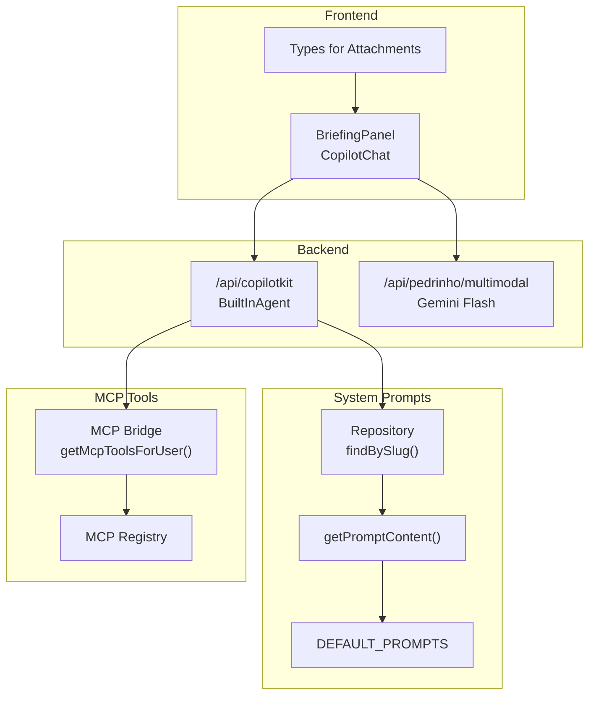
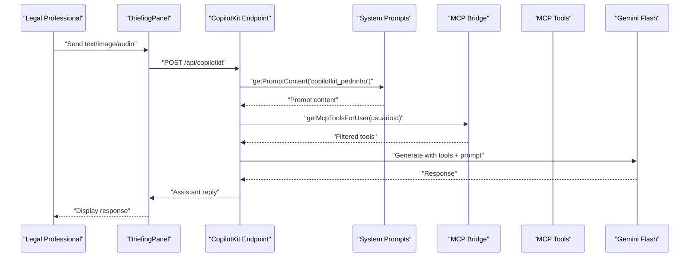
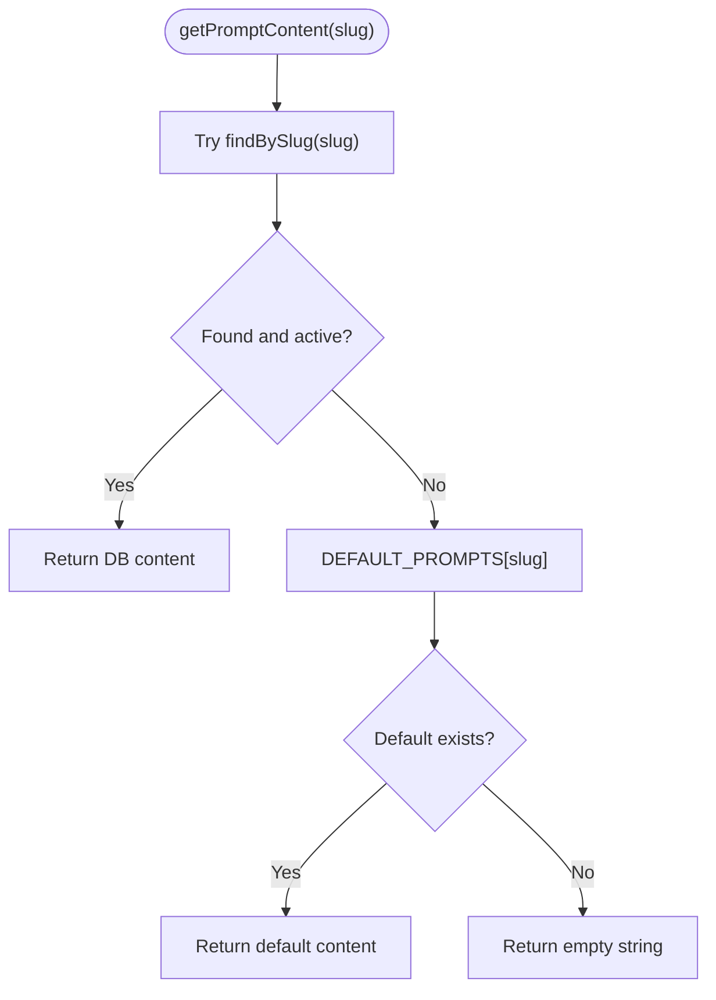
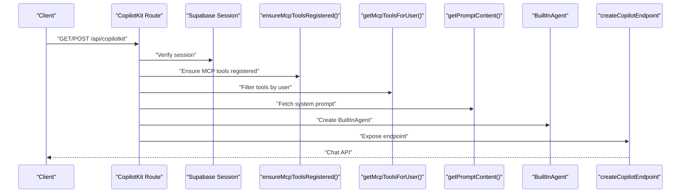
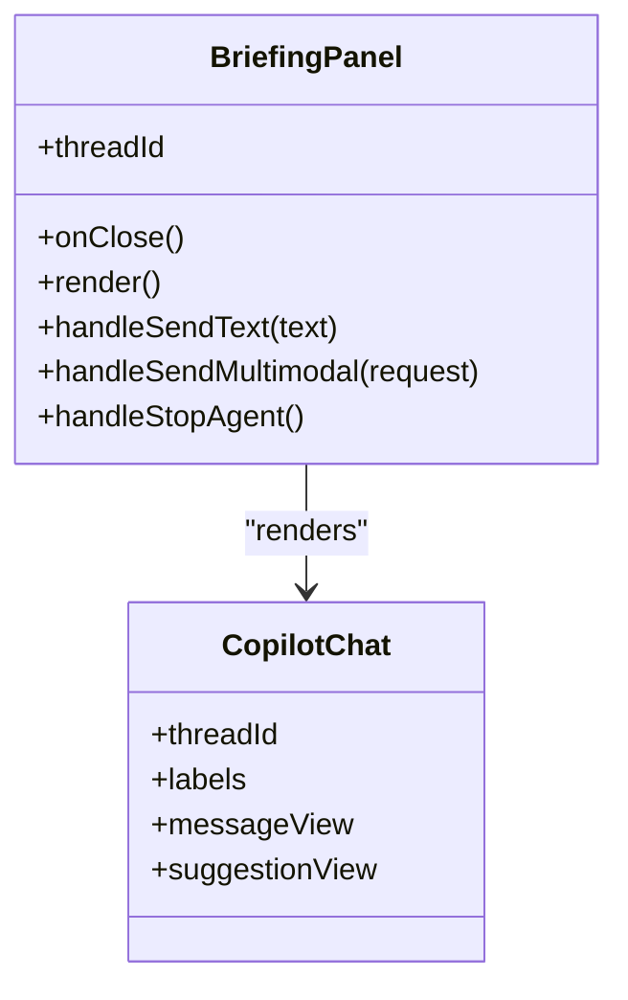
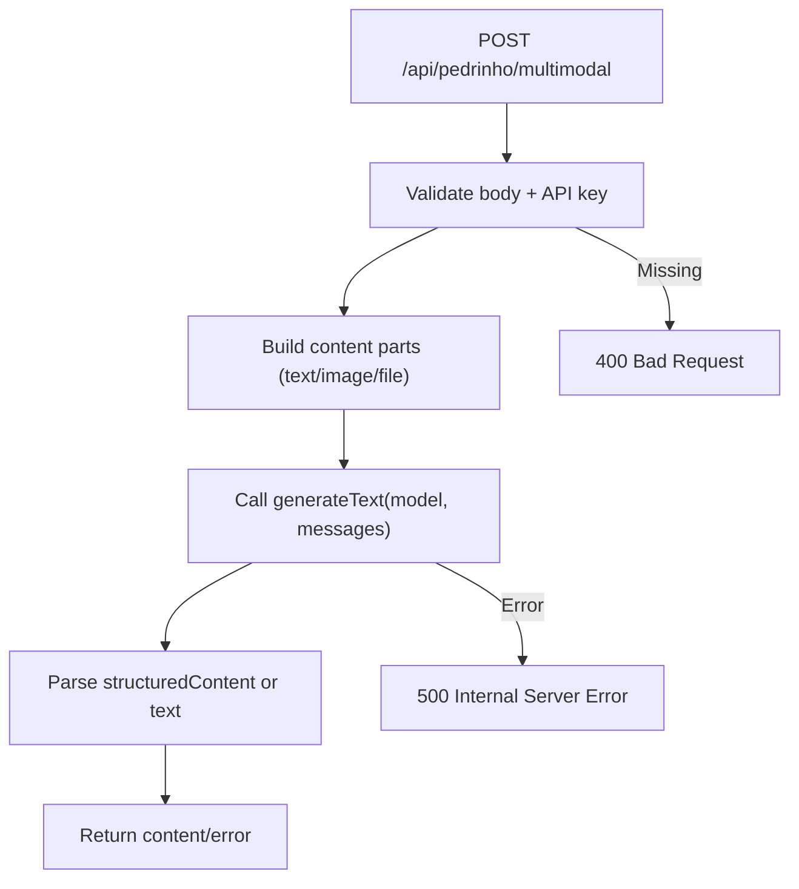
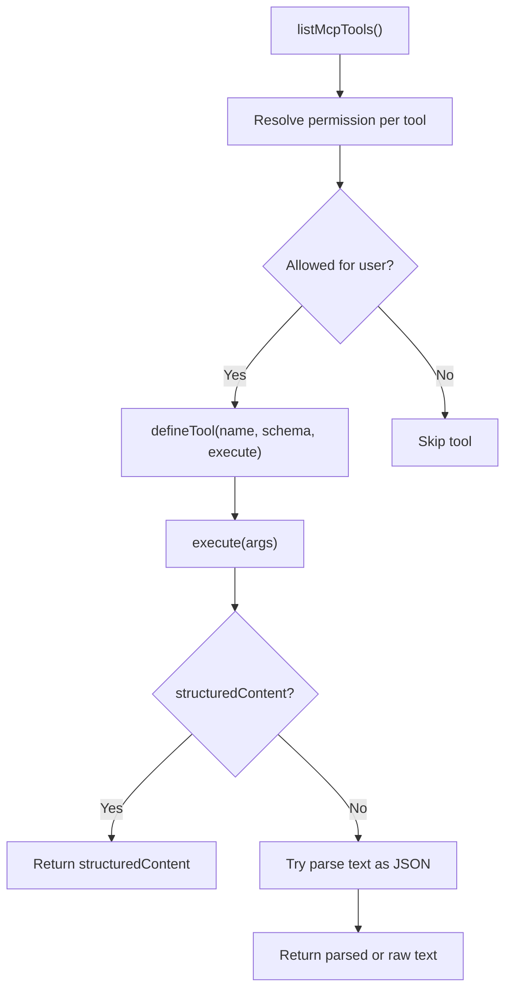
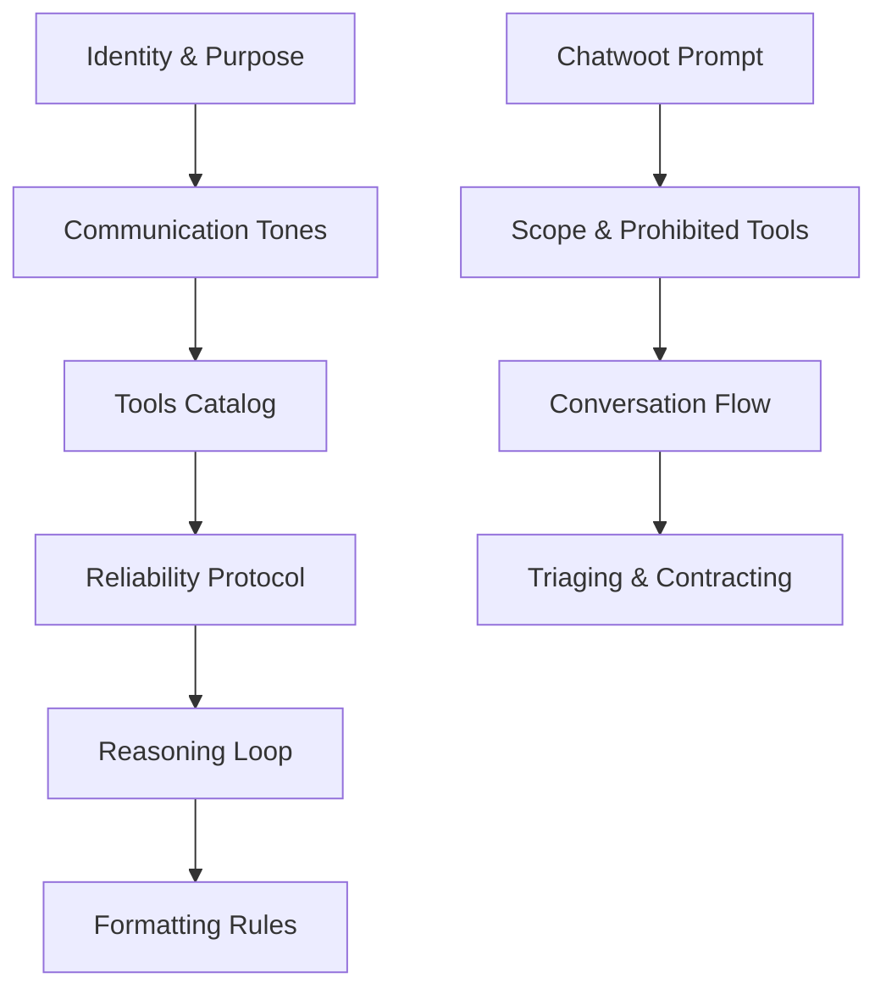
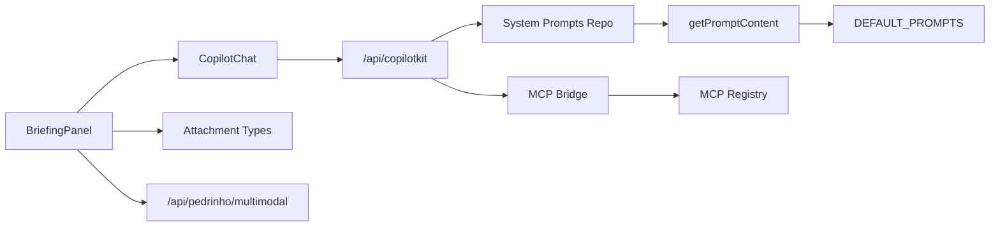

# AI Assistant (Pedrinho)

<cite>
**Referenced Files in This Document**
- [defaults.ts](file://src/lib/system-prompts/defaults.ts)
- [domain.ts](file://src/lib/system-prompts/domain.ts)
- [get-prompt.ts](file://src/lib/system-prompts/get-prompt.ts)
- [repository.ts](file://src/lib/system-prompts/repository.ts)
- [briefing-panel.tsx](file://src/components/layout/pedrinho-agent/briefing-panel.tsx)
- [types.ts](file://src/components/layout/pedrinho-agent/types.ts)
- [route.ts](file://src/app/api/pedrinho/multimodal/route.ts)
- [route.ts](file://src/app/api/copilotkit/[[...copilotkit]]/route.ts)
- [mcp-bridge.ts](file://src/lib/copilotkit/mcp-bridge.ts)
- [types.ts](file://src/lib/mcp/types.ts)
- [system-prompt-pedrinho.md](file://docs/chatwoot/system-prompt-pedrinho.md)
</cite>

## Table of Contents
1. [Introduction](#introduction)
2. [Project Structure](#project-structure)
3. [Core Components](#core-components)
4. [Architecture Overview](#architecture-overview)
5. [Detailed Component Analysis](#detailed-component-analysis)
6. [Dependency Analysis](#dependency-analysis)
7. [Performance Considerations](#performance-considerations)
8. [Troubleshooting Guide](#troubleshooting-guide)
9. [Conclusion](#conclusion)
10. [Appendices](#appendices)

## Introduction
This document describes the AI Assistant (Pedrinho) integration using the CopilotKit framework. It explains how the assistant is architected, how conversations are managed, and how natural language processing is applied within a legal domain. It documents the system prompts registry, role-based conversations, and context preservation across sessions. It also covers integration with legal domain knowledge, document analysis workflows, and automated case processing. Practical examples illustrate AI-assisted legal research, document summarization, and workflow recommendations. Finally, it provides conversational AI best practices, prompt engineering for legal contexts, and user experience optimization tailored for legal professionals.

## Project Structure
Pedrinho’s integration spans UI components, backend APIs, system prompts, and MCP tooling:
- UI: A sidebar chat panel powered by CopilotKit v2 integrates with a thread-aware chat experience.
- Backend: An API endpoint routes requests to a per-request agent configured with user-specific tools and system prompts.
- System prompts: A registry-backed system manages prompt slugs, categories, and fallback defaults.
- MCP bridge: Converts registered MCP tools into CopilotKit-compatible tools, applying permission-based filtering.
- Multimodal processing: A dedicated route handles text, images, and audio attachments for document analysis and transcription.

**Diagram sources**
- [briefing-panel.tsx:178-204](file://src/components/layout/pedrinho-agent/briefing-panel.tsx#L178-L204)
- [route.ts:86-118](file://src/app/api/copilotkit/[[...copilotkit]]/route.ts#L86-L118)
- [route.ts:8-81](file://src/app/api/pedrinho/multimodal/route.ts#L8-L81)
- [repository.ts:58-75](file://src/lib/system-prompts/repository.ts#L58-L75)
- [get-prompt.ts:22-47](file://src/lib/system-prompts/get-prompt.ts#L22-L47)
- [defaults.ts:90-230](file://src/lib/system-prompts/defaults.ts#L90-L230)
- [mcp-bridge.ts:128-205](file://src/lib/copilotkit/mcp-bridge.ts#L128-L205)

**Section sources**
- [briefing-panel.tsx:1-248](file://src/components/layout/pedrinho-agent/briefing-panel.tsx#L1-L248)
- [route.ts:1-121](file://src/app/api/copilotkit/[[...copilotkit]]/route.ts#L1-L121)
- [route.ts:1-82](file://src/app/api/pedrinho/multimodal/route.ts#L1-L82)
- [repository.ts:1-195](file://src/lib/system-prompts/repository.ts#L1-L195)
- [get-prompt.ts:1-48](file://src/lib/system-prompts/get-prompt.ts#L1-L48)
- [defaults.ts:1-230](file://src/lib/system-prompts/defaults.ts#L1-L230)
- [mcp-bridge.ts:1-206](file://src/lib/copilotkit/mcp-bridge.ts#L1-L206)

## Core Components
- System prompts registry: Manages prompt slugs, categories, and fallback defaults. Provides server-only retrieval with database-first precedence and hardcoded fallback.
- CopilotKit agent endpoint: Creates a per-request agent with user-specific tools, system prompt, and constrained steps.
- UI chat panel: Presents a resizable, thread-aware chat with custom message and suggestion views, plus multimodal input.
- MCP bridge: Registers and filters MCP tools by user permissions, converting them into CopilotKit tools.
- Multimodal route: Processes text, images, and audio attachments using Gemini Flash, returning parsed or raw text responses.

**Section sources**
- [domain.ts:1-106](file://src/lib/system-prompts/domain.ts#L1-L106)
- [repository.ts:1-195](file://src/lib/system-prompts/repository.ts#L1-L195)
- [get-prompt.ts:1-48](file://src/lib/system-prompts/get-prompt.ts#L1-L48)
- [defaults.ts:90-230](file://src/lib/system-prompts/defaults.ts#L90-L230)
- [route.ts:86-118](file://src/app/api/copilotkit/[[...copilotkit]]/route.ts#L86-L118)
- [briefing-panel.tsx:178-204](file://src/components/layout/pedrinho-agent/briefing-panel.tsx#L178-L204)
- [mcp-bridge.ts:128-205](file://src/lib/copilotkit/mcp-bridge.ts#L128-L205)
- [route.ts:8-81](file://src/app/api/pedrinho/multimodal/route.ts#L8-L81)

## Architecture Overview
Pedrinho’s architecture combines a UI chat panel with a serverless agent runtime. The agent is created per request, ensuring role-based tool availability and prompt customization. The system prompts registry guarantees robustness by falling back to hardcoded defaults when database entries are missing. MCP tools are dynamically filtered by user permissions and exposed to the agent as CopilotKit tools.

**Diagram sources**
- [briefing-panel.tsx:55-74](file://src/components/layout/pedrinho-agent/briefing-panel.tsx#L55-L74)
- [route.ts:86-118](file://src/app/api/copilotkit/[[...copilotkit]]/route.ts#L86-L118)
- [get-prompt.ts:22-47](file://src/lib/system-prompts/get-prompt.ts#L22-L47)
- [mcp-bridge.ts:128-205](file://src/lib/copilotkit/mcp-bridge.ts#L128-L205)

## Detailed Component Analysis

### System Prompts Registry
The registry defines prompt categories, schemas, and built-in slugs. It retrieves content from the database first, falling back to hardcoded defaults. This ensures continuity when prompts are missing or inactive.

**Diagram sources**
- [get-prompt.ts:22-47](file://src/lib/system-prompts/get-prompt.ts#L22-L47)
- [repository.ts:58-75](file://src/lib/system-prompts/repository.ts#L58-L75)
- [defaults.ts:90-230](file://src/lib/system-prompts/defaults.ts#L90-L230)

**Section sources**
- [domain.ts:1-106](file://src/lib/system-prompts/domain.ts#L1-L106)
- [repository.ts:1-195](file://src/lib/system-prompts/repository.ts#L1-L195)
- [get-prompt.ts:1-48](file://src/lib/system-prompts/get-prompt.ts#L1-L48)
- [defaults.ts:90-230](file://src/lib/system-prompts/defaults.ts#L90-L230)

### CopilotKit Agent Endpoint
The endpoint initializes MCP tools once, authenticates the user, filters tools by permission, selects the Pedrinho system prompt, and creates a BuiltInAgent with a token limit and step count. It exposes a CopilotKit endpoint for chat interactions.

**Diagram sources**
- [route.ts:1-121](file://src/app/api/copilotkit/[[...copilotkit]]/route.ts#L1-L121)
- [mcp-bridge.ts:48-53](file://src/lib/copilotkit/mcp-bridge.ts#L48-L53)
- [mcp-bridge.ts:128-205](file://src/lib/copilotkit/mcp-bridge.ts#L128-L205)
- [get-prompt.ts:22-47](file://src/lib/system-prompts/get-prompt.ts#L22-L47)

**Section sources**
- [route.ts:1-121](file://src/app/api/copilotkit/[[...copilotkit]]/route.ts#L1-L121)
- [mcp-bridge.ts:1-206](file://src/lib/copilotkit/mcp-bridge.ts#L1-L206)
- [get-prompt.ts:1-48](file://src/lib/system-prompts/get-prompt.ts#L1-L48)

### UI Chat Panel (BriefingPanel)
The BriefingPanel renders a CopilotChat component with custom labels, message and suggestion views, and thread management. It supports sending text and multimodal content, and integrates with a resizing hook for responsive UX.

**Diagram sources**
- [briefing-panel.tsx:15-38](file://src/components/layout/pedrinho-agent/briefing-panel.tsx#L15-L38)
- [briefing-panel.tsx:178-204](file://src/components/layout/pedrinho-agent/briefing-panel.tsx#L178-L204)

**Section sources**
- [briefing-panel.tsx:1-248](file://src/components/layout/pedrinho-agent/briefing-panel.tsx#L1-L248)

### Multimodal Processing Route
The multimodal route accepts text and attachments, builds a multipart content payload, and queries Gemini Flash. It returns parsed JSON when available or raw text otherwise, and handles errors gracefully.

**Diagram sources**
- [route.ts:8-81](file://src/app/api/pedrinho/multimodal/route.ts#L8-L81)
- [types.ts:20-33](file://src/components/layout/pedrinho-agent/types.ts#L20-L33)

**Section sources**
- [route.ts:1-82](file://src/app/api/pedrinho/multimodal/route.ts#L1-L82)
- [types.ts:1-61](file://src/components/layout/pedrinho-agent/types.ts#L1-L61)

### MCP Tool Filtering and Execution
The MCP bridge registers tools, resolves permissions, and converts them into CopilotKit tools. It distinguishes destructive tools and surfaces warnings. Execution returns structured content when available or parses text results.

**Diagram sources**
- [mcp-bridge.ts:128-205](file://src/lib/copilotkit/mcp-bridge.ts#L128-L205)
- [types.ts:10-31](file://src/lib/mcp/types.ts#L10-L31)

**Section sources**
- [mcp-bridge.ts:1-206](file://src/lib/copilotkit/mcp-bridge.ts#L1-L206)
- [types.ts:1-152](file://src/lib/mcp/types.ts#L1-L152)

### Role-Based Conversations and Legal Context
Pedrinho’s system prompt establishes identity, tone, tools catalog, reliability protocol, reasoning loop, and formatting rules. A separate Chatwoot prompt governs conversational flows for customer service scenarios, including triage, identification, and contract generation.

**Diagram sources**
- [defaults.ts:90-230](file://src/lib/system-prompts/defaults.ts#L90-L230)
- [system-prompt-pedrinho.md:1-215](file://docs/chatwoot/system-prompt-pedrinho.md#L1-L215)

**Section sources**
- [defaults.ts:90-230](file://src/lib/system-prompts/defaults.ts#L90-L230)
- [system-prompt-pedrinho.md:1-215](file://docs/chatwoot/system-prompt-pedrinho.md#L1-L215)

## Dependency Analysis
The following diagram highlights key dependencies among components:

**Diagram sources**
- [briefing-panel.tsx:178-204](file://src/components/layout/pedrinho-agent/briefing-panel.tsx#L178-L204)
- [route.ts:86-118](file://src/app/api/copilotkit/[[...copilotkit]]/route.ts#L86-L118)
- [repository.ts:58-75](file://src/lib/system-prompts/repository.ts#L58-L75)
- [get-prompt.ts:22-47](file://src/lib/system-prompts/get-prompt.ts#L22-L47)
- [defaults.ts:90-230](file://src/lib/system-prompts/defaults.ts#L90-L230)
- [mcp-bridge.ts:128-205](file://src/lib/copilotkit/mcp-bridge.ts#L128-L205)
- [route.ts:8-81](file://src/app/api/pedrinho/multimodal/route.ts#L8-L81)

**Section sources**
- [briefing-panel.tsx:1-248](file://src/components/layout/pedrinho-agent/briefing-panel.tsx#L1-L248)
- [route.ts:1-121](file://src/app/api/copilotkit/[[...copilotkit]]/route.ts#L1-L121)
- [repository.ts:1-195](file://src/lib/system-prompts/repository.ts#L1-L195)
- [get-prompt.ts:1-48](file://src/lib/system-prompts/get-prompt.ts#L1-L48)
- [defaults.ts:1-230](file://src/lib/system-prompts/defaults.ts#L1-L230)
- [mcp-bridge.ts:1-206](file://src/lib/copilotkit/mcp-bridge.ts#L1-L206)
- [route.ts:1-82](file://src/app/api/pedrinho/multimodal/route.ts#L1-L82)

## Performance Considerations
- Token and step limits: The agent is configured with bounded steps and a maximum output token limit to control latency and cost.
- Permission filtering: MCP tools are filtered per user to reduce unnecessary tool calls and improve response quality.
- Attachment handling: Multimodal processing validates content parts and enforces file size and count limits to prevent resource exhaustion.
- Database fallback: Prompt retrieval falls back to hardcoded defaults to avoid downtime when the database is unavailable.

[No sources needed since this section provides general guidance]

## Troubleshooting Guide
Common issues and resolutions:
- Missing API key: The multimodal route returns a 503 when the Google Generative AI API key is not configured.
- Empty or invalid request: The multimodal route returns 400 for missing content or attachments.
- Tool execution errors: MCP tool execution wraps errors and returns a structured message; inspect the error field for details.
- Prompt retrieval failures: The system prompts utility logs warnings and falls back to defaults when database queries fail.

**Section sources**
- [route.ts:9-25](file://src/app/api/pedrinho/multimodal/route.ts#L9-L25)
- [mcp-bridge.ts:170-202](file://src/lib/copilotkit/mcp-bridge.ts#L170-L202)
- [get-prompt.ts:29-46](file://src/lib/system-prompts/get-prompt.ts#L29-L46)

## Conclusion
Pedrinho leverages CopilotKit to deliver a powerful, role-aware legal assistant integrated with the ZattarOS ecosystem. Its architecture ensures secure, permission-based tool access, robust prompt management, and seamless multimodal processing. By combining a strong system prompt, MCP tooling, and a thread-aware UI, Pedrinho enables legal professionals to perform research, analyze documents, and automate case workflows efficiently and confidently.

[No sources needed since this section summarizes without analyzing specific files]

## Appendices

### Practical Examples
- AI-assisted legal research: Use the agent to search processes, timelines, and parties via MCP tools, then synthesize findings into concise summaries.
- Document summarization: Upload PDFs or images; the multimodal route transcribes audio and extracts key information from visuals for quick review.
- Workflow recommendations: Leverage the tools catalog to propose next steps for case management, scheduling, and document generation.

[No sources needed since this section provides general guidance]

### Best Practices for Legal Conversations
- Maintain strict adherence to facts: Use the reliability protocol to cite laws, jurisprudence, and regulations explicitly.
- Preserve tone consistency: Switch between casual and formal tones depending on the task while keeping legal precision.
- Encourage feedback: End complex answers with a prompt for clarification or adjustments.

[No sources needed since this section provides general guidance]