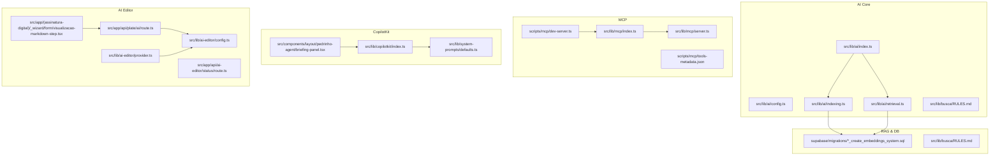
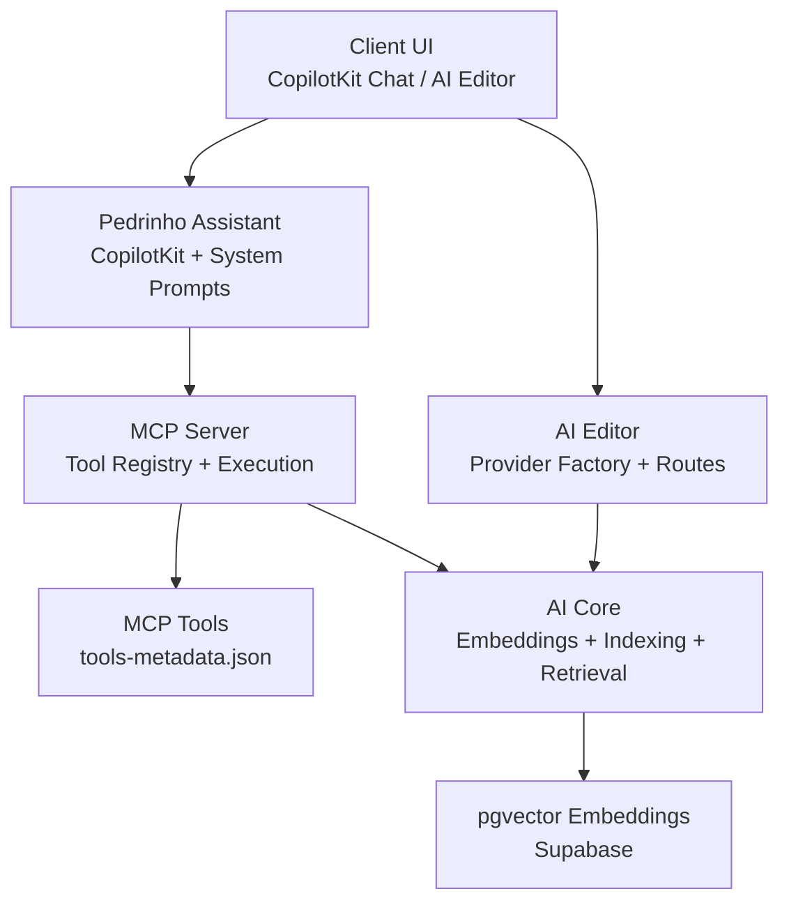
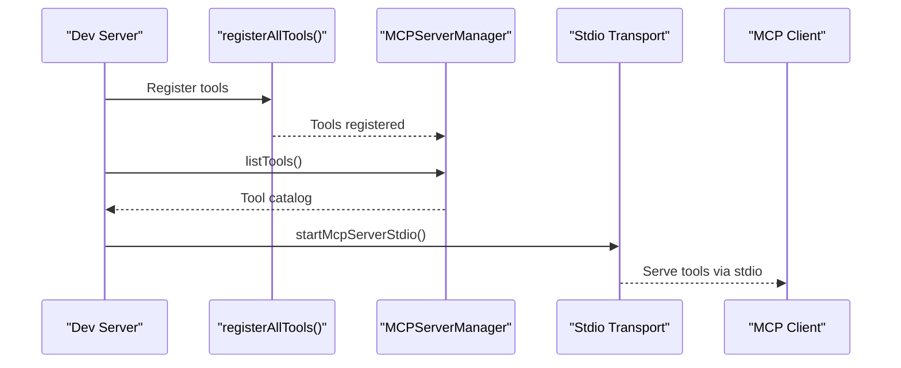
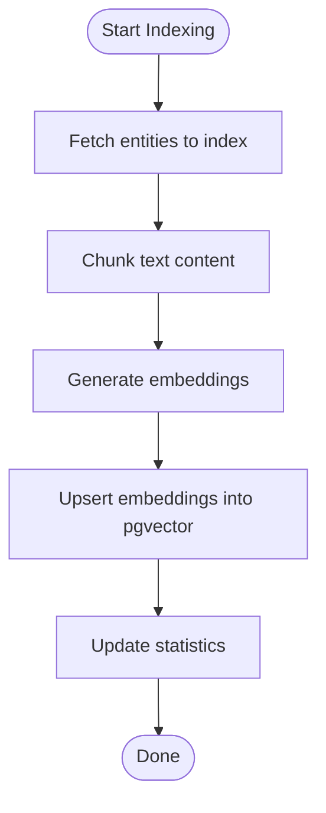
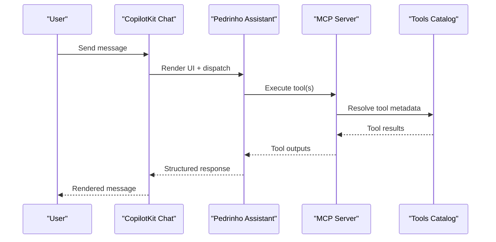
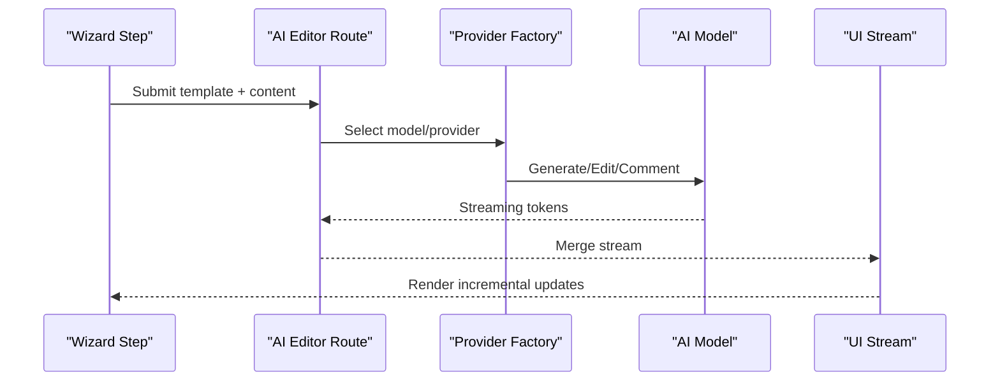
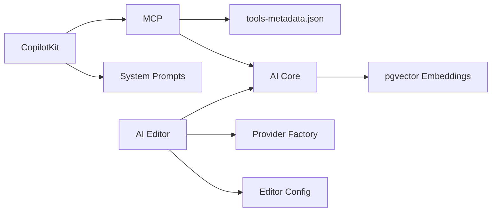

# AI Integration and Features

<cite>
**Referenced Files in This Document**
- [index.ts](file://src/lib/ai/index.ts)
- [index.ts](file://src/lib/ai/config.ts)
- [index.ts](file://src/lib/ai/indexing.ts)
- [index.ts](file://src/lib/ai/retrieval.ts)
- [RULES.md](file://src/lib/busca/RULES.md)
- [index.ts](file://src/lib/copilotkit/index.ts)
- [index.ts](file://src/lib/mcp/index.ts)
- [server.ts](file://src/lib/mcp/server.ts)
- [dev-server.ts](file://scripts/mcp/dev-server.ts)
- [tools-metadata.json](file://scripts/mcp/tools-metadata.json)
- [20251216132616_create_embeddings_system.sql](file://supabase/migrations/20251216132616_create_embeddings_system.sql)
- [20251212000000_create_embeddings_system.sql](file://supabase/migrations/20251212000000_create_embeddings_system.sql)
- [index.ts](file://src/lib/ai-editor/config.ts)
- [provider.ts](file://src/lib/ai-editor/provider.ts)
- [defaults.ts](file://src/lib/system-prompts/defaults.ts)
- [route.ts](file://src/app/api/plate/ai/route.ts)
- [route.ts](file://src/app/api/ai-editor/status/route.ts)
- [visualizacao-markdown-step.tsx](file://src/app/(assinatura-digital)/_wizard/form/visualizacao-markdown-step.tsx)
- [briefing-panel.tsx](file://src/components/layout/pedrinho-agent/briefing-panel.tsx)
- [20260326200000_create_copilotkit_runs.sql](file://supabase/migrations/20260326200000_create_copilotkit_runs.sql)
</cite>

## Table of Contents
1. [Introduction](#introduction)
2. [Project Structure](#project-structure)
3. [Core Components](#core-components)
4. [Architecture Overview](#architecture-overview)
5. [Detailed Component Analysis](#detailed-component-analysis)
6. [Dependency Analysis](#dependency-analysis)
7. [Performance Considerations](#performance-considerations)
8. [Troubleshooting Guide](#troubleshooting-guide)
9. [Conclusion](#conclusion)
10. [Appendices](#appendices)

## Introduction
This document explains the AI integration and features in ZattarOS, focusing on:
- Model Context Protocol (MCP) implementation for AI agent tooling and orchestration
- Retrieval-Augmented Generation (RAG) using pgvector embeddings for legal document processing
- AI Assistant (Pedrinho) integration via CopilotKit and system prompts
- Real-time AI collaboration features and AI editor capabilities
- Practical examples of AI-assisted legal research, document analysis, and workflow automation
- AI model configuration, performance optimization, and security considerations for legal data processing

## Project Structure
ZattarOS organizes AI features across dedicated libraries and server-side routes:
- AI core library exports embedding, indexing, retrieval, summarization, and editor services
- MCP module exposes server, registry, and utilities for tool registration and execution
- CopilotKit integrates system prompts and actions for AI assistants
- RAG relies on Supabase migrations enabling pgvector and embedding tables
- AI editor configuration and provider factory support multiple AI gateways
- Frontend components integrate CopilotKit chat panels and AI editor workflows

**Diagram sources**
- [index.ts:1-76](file://src/lib/ai/index.ts#L1-L76)
- [index.ts:1-200](file://src/lib/ai/config.ts#L1-L200)
- [index.ts:220-263](file://src/lib/ai/indexing.ts#L220-L263)
- [index.ts:1-200](file://src/lib/ai/retrieval.ts#L1-L200)
- [RULES.md:56-125](file://src/lib/busca/RULES.md#L56-L125)
- [index.ts:1-57](file://src/lib/mcp/index.ts#L1-L57)
- [server.ts:452-506](file://src/lib/mcp/server.ts#L452-L506)
- [dev-server.ts:1-61](file://scripts/mcp/dev-server.ts#L1-L61)
- [tools-metadata.json:1-800](file://scripts/mcp/tools-metadata.json#L1-L800)
- [20251216132616_create_embeddings_system.sql:1-54](file://supabase/migrations/20251216132616_create_embeddings_system.sql#L1-L54)
- [20251212000000_create_embeddings_system.sql:1-54](file://supabase/migrations/20251212000000_create_embeddings_system.sql#L1-L54)
- [index.ts:1-78](file://src/lib/ai-editor/config.ts#L1-L78)
- [provider.ts:1-56](file://src/lib/ai-editor/provider.ts#L1-L56)
- [defaults.ts:90-200](file://src/lib/system-prompts/defaults.ts#L90-L200)
- [route.ts:225-271](file://src/app/api/plate/ai/route.ts#L225-L271)
- [route.ts:1-200](file://src/app/api/ai-editor/status/route.ts#L1-L200)
- [visualizacao-markdown-step.tsx](file://src/app/(assinatura-digital)/_wizard/form/visualizacao-markdown-step.tsx#L248-L289)

**Section sources**
- [index.ts:1-76](file://src/lib/ai/index.ts#L1-L76)
- [index.ts:1-57](file://src/lib/mcp/index.ts#L1-L57)
- [index.ts:1-23](file://src/lib/copilotkit/index.ts#L1-L23)
- [index.ts:1-78](file://src/lib/ai-editor/config.ts#L1-L78)

## Core Components
- AI Core Library: Provides embedding generation, batch processing, indexing, semantic search, hybrid retrieval, summarization, and domain-specific services. It also exposes actions and components for RAG chat.
- MCP Module: Offers server initialization, tool registration, execution, and utilities for converting actions into MCP tools. Includes a development server script to bootstrap tools and connect via stdio.
- CopilotKit Integration: Centralizes system prompts and actions for AI assistants, including Pedrinho’s personality and tool catalog.
- RAG Infrastructure: Uses Supabase migrations to enable pgvector and create unified embedding tables with HNSW indices and pre-filtering indexes. Includes caching and performance guidelines.
- AI Editor: Manages configuration and provider selection across multiple AI gateways, with route handlers orchestrating generation/edit/comment workflows and a wizard step for document rendering.

**Section sources**
- [index.ts:1-76](file://src/lib/ai/index.ts#L1-L76)
- [index.ts:1-57](file://src/lib/mcp/index.ts#L1-L57)
- [index.ts:1-23](file://src/lib/copilotkit/index.ts#L1-L23)
- [20251216132616_create_embeddings_system.sql:1-54](file://supabase/migrations/20251216132616_create_embeddings_system.sql#L1-L54)
- [index.ts:1-78](file://src/lib/ai-editor/config.ts#L1-L78)

## Architecture Overview
The AI architecture integrates three pillars:
- MCP-based tooling for agent workflows and server actions exposure
- RAG pipeline leveraging pgvector for legal document embeddings and semantic search
- AI Assistant and Editor for real-time collaboration and document generation

**Diagram sources**
- [briefing-panel.tsx:178-204](file://src/components/layout/pedrinho-agent/briefing-panel.tsx#L178-L204)
- [server.ts:452-506](file://src/lib/mcp/server.ts#L452-L506)
- [tools-metadata.json:1-800](file://scripts/mcp/tools-metadata.json#L1-L800)
- [index.ts:1-76](file://src/lib/ai/index.ts#L1-L76)
- [20251216132616_create_embeddings_system.sql:1-54](file://supabase/migrations/20251216132616_create_embeddings_system.sql#L1-L54)
- [provider.ts:1-56](file://src/lib/ai-editor/provider.ts#L1-L56)

## Detailed Component Analysis

### MCP Implementation and Tool Orchestration
- Server and Manager: Singleton server manager exposes registration, execution, listing, and stdio startup for local development.
- Tool Registration: Tools are registered centrally and described in metadata, enabling discovery and client-side usage.
- Development Server: Script registers all tools, lists them grouped by feature, and starts stdio transport for testing with MCP clients.

**Diagram sources**
- [dev-server.ts:21-55](file://scripts/mcp/dev-server.ts#L21-L55)
- [server.ts:452-506](file://src/lib/mcp/server.ts#L452-L506)

**Section sources**
- [server.ts:452-506](file://src/lib/mcp/server.ts#L452-L506)
- [dev-server.ts:1-61](file://scripts/mcp/dev-server.ts#L1-L61)
- [tools-metadata.json:1-800](file://scripts/mcp/tools-metadata.json#L1-L800)

### RAG System with pgvector Embeddings
- Database Schema: Migration enables pgvector extension and creates a unified embeddings table with entity-type scoping, parent relationships, flexible metadata, and audit fields.
- Indices: HNSW cosine index for fast vector similarity, plus pre-filtering GIN and B-tree indexes for filtering and performance.
- Row Level Security: Policy grants service role full access to embeddings.
- Indexing Pipeline: Indexing service supports chunking, embedding generation, metadata enrichment, and batch operations with concurrency limits and delays.
- Search Rules: Defines indexing lifecycle, metadata structure, supported filters, caching strategy, and performance constraints.

**Diagram sources**
- [20251216132616_create_embeddings_system.sql:1-54](file://supabase/migrations/20251216132616_create_embeddings_system.sql#L1-L54)
- [index.ts:220-263](file://src/lib/ai/indexing.ts#L220-L263)
- [RULES.md:56-125](file://src/lib/busca/RULES.md#L56-L125)

**Section sources**
- [20251216132616_create_embeddings_system.sql:1-54](file://supabase/migrations/20251216132616_create_embeddings_system.sql#L1-L54)
- [20251212000000_create_embeddings_system.sql:1-54](file://supabase/migrations/20251212000000_create_embeddings_system.sql#L1-L54)
- [index.ts:220-263](file://src/lib/ai/indexing.ts#L220-L263)
- [RULES.md:56-125](file://src/lib/busca/RULES.md#L56-L125)

### AI Assistant (Pedrinho) Integration
- System Prompt: Pedrinho’s personality, tool catalog, reliability protocols, reasoning algorithm, and formatting rules are defined in defaults.
- Chat Panel: CopilotKit chat wrapper renders assistant/user messages and suggestions with theme-aware styling.
- Permissions and Tool Catalog: Assistant surfaces only tools permitted for the current user and enforces destructive action confirmation.

**Diagram sources**
- [defaults.ts:90-200](file://src/lib/system-prompts/defaults.ts#L90-L200)
- [briefing-panel.tsx:178-204](file://src/components/layout/pedrinho-agent/briefing-panel.tsx#L178-L204)
- [tools-metadata.json:1-800](file://scripts/mcp/tools-metadata.json#L1-L800)

**Section sources**
- [defaults.ts:90-200](file://src/lib/system-prompts/defaults.ts#L90-L200)
- [briefing-panel.tsx:178-204](file://src/components/layout/pedrinho-agent/briefing-panel.tsx#L178-L204)
- [tools-metadata.json:1-800](file://scripts/mcp/tools-metadata.json#L1-L800)

### AI Editor Capabilities and Document Generation
- Configuration: Reads integration settings from DB with in-memory cache and falls back to environment variables.
- Provider Factory: Creates AI SDK providers (Gateway, OpenAI, OpenRouter, Anthropic, Google) based on configuration.
- Route Orchestration: Route handler selects model and tool choice based on edit type, prepares messages, and streams UI updates.
- Template Processing: Wizard step processes markdown with selected template, clears cache on change, and disables navigation until ready.

**Diagram sources**
- [index.ts:21-57](file://src/lib/ai-editor/config.ts#L21-L57)
- [provider.ts:18-55](file://src/lib/ai-editor/provider.ts#L18-L55)
- [route.ts:225-271](file://src/app/api/plate/ai/route.ts#L225-L271)
- [visualizacao-markdown-step.tsx](file://src/app/(assinatura-digital)/_wizard/form/visualizacao-markdown-step.tsx#L248-L289)

**Section sources**
- [index.ts:1-78](file://src/lib/ai-editor/config.ts#L1-L78)
- [provider.ts:1-56](file://src/lib/ai-editor/provider.ts#L1-L56)
- [route.ts:225-271](file://src/app/api/plate/ai/route.ts#L225-L271)
- [visualizacao-markdown-step.tsx](file://src/app/(assinatura-digital)/_wizard/form/visualizacao-markdown-step.tsx#L248-L289)

### Practical Examples
- AI-assisted legal research: Use Pedrinho to search processes, parties, and timelines; leverage MCP tools to list financial entries, manage contracts, and show visual summaries.
- Document analysis: Use AI editor to generate clauses, rewrite selections, and add jurisdictional comments; combine with RAG to retrieve similar documents and citations.
- Workflow automation: Trigger MCP tools for bulk operations (e.g., confirm/cancel financial entries) and orchestrate AI-assisted document creation with templates.

[No sources needed since this section aggregates usage patterns without analyzing specific files]

## Dependency Analysis
- AI Core depends on Supabase for embeddings and retrieval; uses chunking and extraction services.
- MCP depends on tool metadata and server manager; development server wires registry and transport.
- CopilotKit depends on system prompts and actions; integrates with chat UI.
- AI Editor depends on configuration and provider factory; routes depend on AI core services.

**Diagram sources**
- [index.ts:1-76](file://src/lib/ai/index.ts#L1-L76)
- [20251216132616_create_embeddings_system.sql:1-54](file://supabase/migrations/20251216132616_create_embeddings_system.sql#L1-L54)
- [index.ts:1-57](file://src/lib/mcp/index.ts#L1-L57)
- [tools-metadata.json:1-800](file://scripts/mcp/tools-metadata.json#L1-L800)
- [index.ts:1-23](file://src/lib/copilotkit/index.ts#L1-L23)
- [defaults.ts:90-200](file://src/lib/system-prompts/defaults.ts#L90-L200)
- [index.ts:1-78](file://src/lib/ai-editor/config.ts#L1-L78)
- [provider.ts:1-56](file://src/lib/ai-editor/provider.ts#L1-L56)

**Section sources**
- [index.ts:1-76](file://src/lib/ai/index.ts#L1-L76)
- [index.ts:1-57](file://src/lib/mcp/index.ts#L1-L57)
- [index.ts:1-23](file://src/lib/copilotkit/index.ts#L1-L23)
- [index.ts:1-78](file://src/lib/ai-editor/config.ts#L1-L78)

## Performance Considerations
- Vector Indexing: HNSW with cosine distance for fast similarity; pre-filtering indices improve recall speed.
- Batch Processing: Controlled concurrency and delays during reindexing to avoid overload.
- Caching: Embedding cache with TTL reduces repeated generation costs.
- Limits: Max results and token context caps to maintain responsiveness.
- Storage Extraction: PDF.js-based text extraction integrated into indexing pipeline.

**Section sources**
- [20251216132616_create_embeddings_system.sql:33-46](file://supabase/migrations/20251216132616_create_embeddings_system.sql#L33-L46)
- [index.ts:220-263](file://src/lib/ai/indexing.ts#L220-L263)
- [RULES.md:88-118](file://src/lib/busca/RULES.md#L88-L118)

## Troubleshooting Guide
- MCP Development Server: Ensure environment variables are loaded and tools are registered before connecting via stdio.
- Tool Availability: Confirm tool metadata and permissions; Pedrinho surfaces only permitted tools.
- AI Editor Configuration: Validate provider, API key, and model IDs; fallback to environment variables if DB config is missing.
- RAG Indexing: Check embedding table existence and indices; verify chunking and caching behavior.

**Section sources**
- [dev-server.ts:14-55](file://scripts/mcp/dev-server.ts#L14-L55)
- [tools-metadata.json:1-800](file://scripts/mcp/tools-metadata.json#L1-L800)
- [index.ts:21-57](file://src/lib/ai-editor/config.ts#L21-L57)
- [20251216132616_create_embeddings_system.sql:1-54](file://supabase/migrations/20251216132616_create_embeddings_system.sql#L1-L54)

## Conclusion
ZattarOS integrates AI through a robust MCP-based tooling layer, a scalable RAG system powered by pgvector, and a configurable AI editor with CopilotKit-driven assistants. These components collectively enable secure, efficient, and reliable AI-assisted legal workflows, from research and document analysis to real-time collaboration and automated generation.

## Appendices
- Database runs tracking: Supabase migration for CopilotKit runs table supports audit and analytics of AI interactions.

**Section sources**
- [20260326200000_create_copilotkit_runs.sql:1-200](file://supabase/migrations/20260326200000_create_copilotkit_runs.sql#L1-L200)