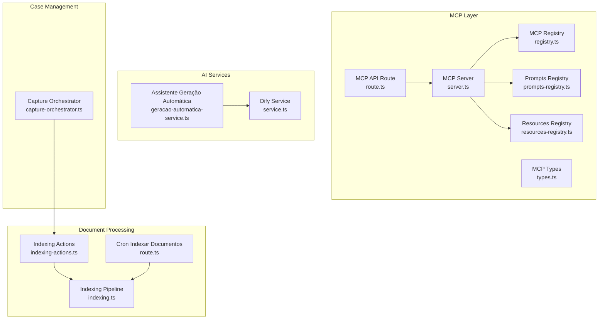
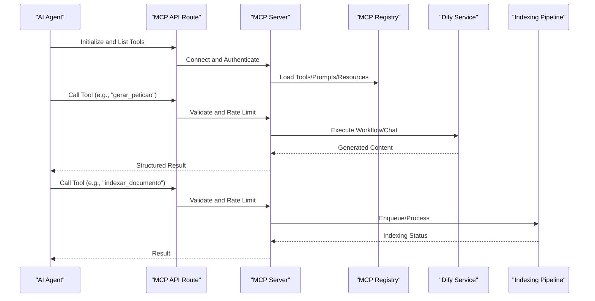
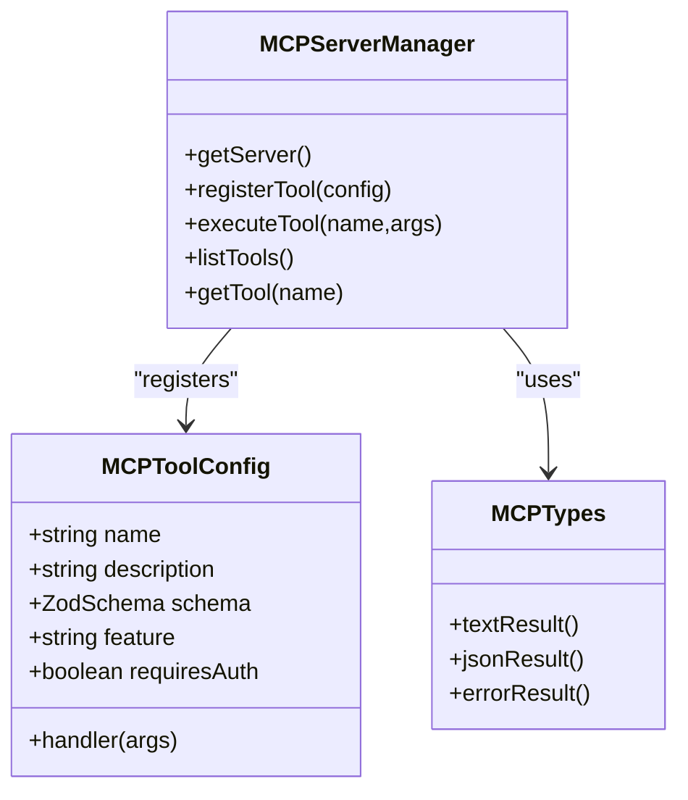
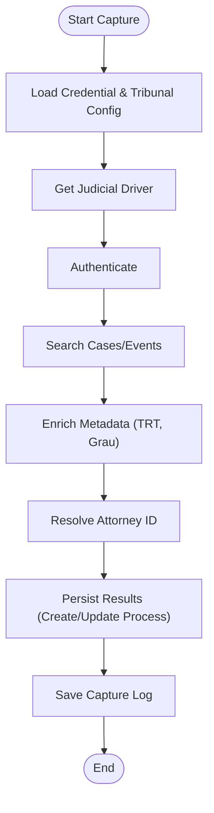
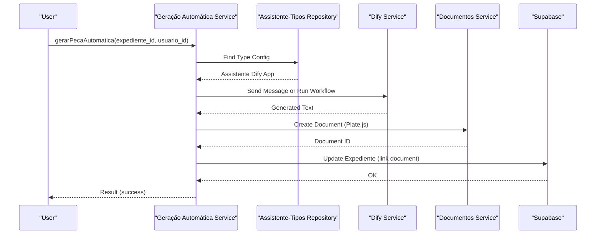
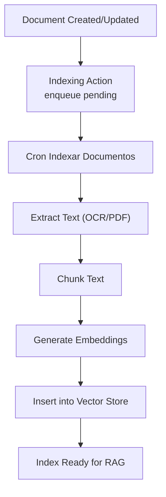
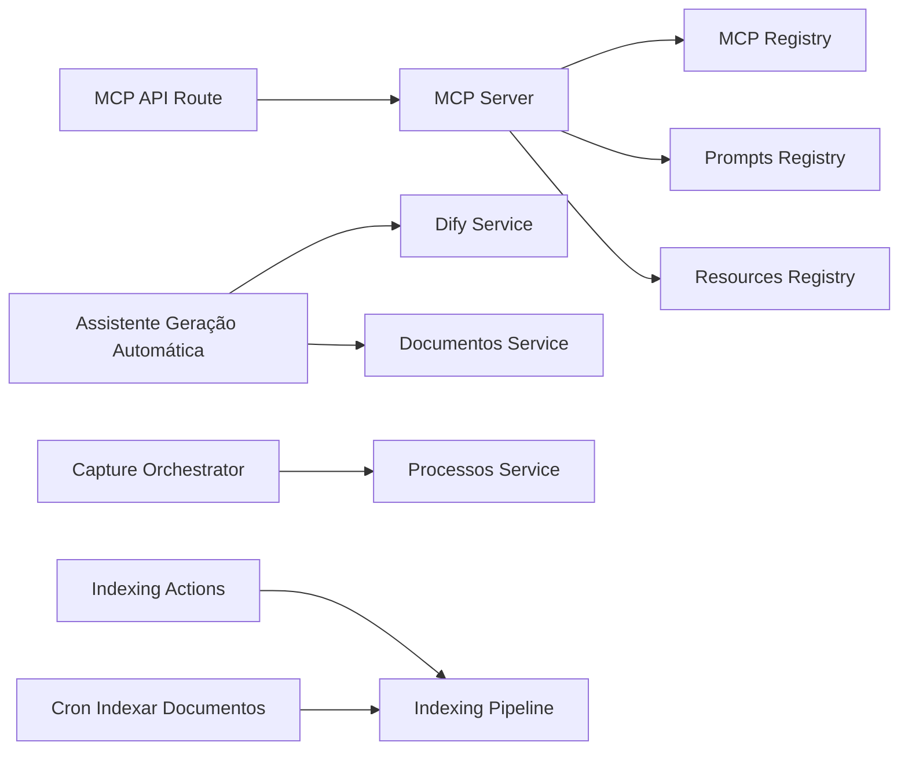

# AI Workflows and Automation

<cite>
**Referenced Files in This Document**
- [registry.ts](file://src/lib/mcp/registry.ts)
- [server.ts](file://src/lib/mcp/server.ts)
- [route.ts](file://src/app/api/mcp/route.ts)
- [types.ts](file://src/lib/mcp/types.ts)
- [prompts-registry.ts](file://src/lib/mcp/prompts-registry.ts)
- [resources-registry.ts](file://src/lib/mcp/resources-registry.ts)
- [geracao-automatica-service.ts](file://src/app/(authenticated)/assistentes/geracao-automatica-service.ts)
- [service.ts](file://src/lib/dify/service.ts)
- [capture-orchestrator.ts](file://src/app/(authenticated)/captura/services/capture-orchestrator.ts)
- [indexing-actions.ts](file://src/app/(authenticated)/processos/actions/indexing-actions.ts)
- [route.ts](file://src/app/api/cron/indexar-documentos/route.ts)
- [indexing.ts](file://src/lib/ai/indexing.ts)
- [README.md](file://src/app/(authenticated)/assistentes/README.md)
- [RULES.md](file://src/app/(authenticated)/processos/RULES.md)
- [RULES.md](file://src/app/(authenticated)/documentos/RULES.md)
</cite>

## Table of Contents
1. [Introduction](#introduction)
2. [Project Structure](#project-structure)
3. [Core Components](#core-components)
4. [Architecture Overview](#architecture-overview)
5. [Detailed Component Analysis](#detailed-component-analysis)
6. [Dependency Analysis](#dependency-analysis)
7. [Performance Considerations](#performance-considerations)
8. [Troubleshooting Guide](#troubleshooting-guide)
9. [Conclusion](#conclusion)

## Introduction
This document explains the AI workflows and automation systems in ZattarOS, focusing on:
- Workflow orchestration using MCP tools
- Automated legal process handling
- Intelligent task routing
- Integration between AI services (Dify), workflow triggers, and conditional processing logic
- Automation of repetitive legal tasks, document processing pipelines, and case management workflows
- Practical examples of AI-powered case assignment, document categorization, and automated compliance checking
- Workflow monitoring, error handling strategies, and performance optimization for complex AI workflows

## Project Structure
ZattarOS implements AI automation through three pillars:
- MCP (Model Context Protocol) server exposing tools, prompts, and resources
- Dify integration for AI generation and workflows
- Background indexing and capture orchestration for legal document processing



**Diagram sources**
- [server.ts:1-507](file://src/lib/mcp/server.ts#L1-L507)
- [registry.ts:1-163](file://src/lib/mcp/registry.ts#L1-L163)
- [route.ts:1-437](file://src/app/api/mcp/route.ts#L1-L437)
- [prompts-registry.ts:1-386](file://src/lib/mcp/prompts-registry.ts#L1-L386)
- [resources-registry.ts:1-294](file://src/lib/mcp/resources-registry.ts#L1-L294)
- [types.ts:1-152](file://src/lib/mcp/types.ts#L1-L152)
- [service.ts:1-1140](file://src/lib/dify/service.ts#L1-L1140)
- [geracao-automatica-service.ts](file://src/app/(authenticated)/assistentes/geracao-automatica-service.ts#L1-L322)
- [indexing-actions.ts](file://src/app/(authenticated)/processos/actions/indexing-actions.ts#L1-L112)
- [indexing.ts:1-373](file://src/lib/ai/indexing.ts#L1-L373)
- [route.ts:1-40](file://src/app/api/cron/indexar-documentos/route.ts#L1-L40)
- [capture-orchestrator.ts](file://src/app/(authenticated)/captura/services/capture-orchestrator.ts#L1-L208)

**Section sources**
- [registry.ts:1-163](file://src/lib/mcp/registry.ts#L1-L163)
- [server.ts:1-507](file://src/lib/mcp/server.ts#L1-L507)
- [route.ts:1-437](file://src/app/api/mcp/route.ts#L1-L437)

## Core Components
- MCP Server and Registry: Centralized tool discovery and execution, with caching and rate limiting.
- MCP API Route: SSE-based endpoint implementing JSON-RPC 2.0 for MCP communication.
- Prompts and Resources: Structured prompts for legal analysis and RAG, plus typed resources for domain entities.
- Dify Service: Unified client for chat, workflows, datasets, and annotations.
- Assistente Geração Automática: Orchestration of AI-driven document generation linked to case types.
- Capture Orchestrator: End-to-end legal data capture pipeline integrating with case management.
- Indexing Pipeline: Batched, chunked semantic indexing for retrieval augmented generation (RAG).

**Section sources**
- [types.ts:1-152](file://src/lib/mcp/types.ts#L1-L152)
- [prompts-registry.ts:1-386](file://src/lib/mcp/prompts-registry.ts#L1-L386)
- [resources-registry.ts:1-294](file://src/lib/mcp/resources-registry.ts#L1-L294)
- [service.ts:1-1140](file://src/lib/dify/service.ts#L1-L1140)
- [geracao-automatica-service.ts](file://src/app/(authenticated)/assistentes/geracao-automatica-service.ts#L1-L322)
- [capture-orchestrator.ts](file://src/app/(authenticated)/captura/services/capture-orchestrator.ts#L1-L208)
- [indexing.ts:1-373](file://src/lib/ai/indexing.ts#L1-L373)

## Architecture Overview
The system exposes a unified MCP interface for AI agents to query legal data, trigger workflows, and access contextual resources. AI generation is powered by Dify, while document processing leverages background indexing and capture orchestration.



**Diagram sources**
- [route.ts:1-437](file://src/app/api/mcp/route.ts#L1-L437)
- [server.ts:1-507](file://src/lib/mcp/server.ts#L1-L507)
- [registry.ts:1-163](file://src/lib/mcp/registry.ts#L1-L163)
- [service.ts:1-1140](file://src/lib/dify/service.ts#L1-L1140)
- [indexing.ts:1-373](file://src/lib/ai/indexing.ts#L1-L373)

## Detailed Component Analysis

### MCP Orchestration and Tool Registry
- Tool Registration: The registry orchestrates registration of 230+ tools across 34 modules (e.g., Processos, Partes, Contratos, Financeiro, Chat, Documentos, Expedientes, Audiências, Obrigações, RH, Dashboard, Busca Semântica, Captura, Usuários, Acervo, Assistentes, Cargos, Advogados, Perícias, Assinatura Digital, Tarefas, Chatwoot, Dify, Admin, Calendar, Tipos de Expedientes, Notificações, Agenda, Endereços, Notas, Project Management, Peças Jurídicas, Entrevistas Trabalhistas, E-mail).
- Server Handlers: The MCP server implements handlers for tools, resources, and prompts, with Zod-based schema validation and structured logging.
- API Endpoint: The MCP route supports initialization, tool listing (with caching), tool execution, and rate limiting/quota enforcement.



**Diagram sources**
- [server.ts:1-507](file://src/lib/mcp/server.ts#L1-L507)
- [types.ts:1-152](file://src/lib/mcp/types.ts#L1-L152)

**Section sources**
- [registry.ts:1-163](file://src/lib/mcp/registry.ts#L1-L163)
- [server.ts:1-507](file://src/lib/mcp/server.ts#L1-L507)
- [route.ts:1-437](file://src/app/api/mcp/route.ts#L1-L437)
- [types.ts:1-152](file://src/lib/mcp/types.ts#L1-L152)

### Legal Case Management and Capture Orchestration
- Capture Orchestrator: Provides a polymorphic driver-based flow for authenticating, fetching, enriching, and persisting legal data (processes, audiencias) into the case management system. It integrates with process creation and logs outcomes.
- Rules and Workflows: Business rules define creation/update flows, status mapping, and unified views across instances.



**Diagram sources**
- [capture-orchestrator.ts](file://src/app/(authenticated)/captura/services/capture-orchestrator.ts#L1-L208)
- [RULES.md](file://src/app/(authenticated)/processos/RULES.md#L40-L79)

**Section sources**
- [capture-orchestrator.ts](file://src/app/(authenticated)/captura/services/capture-orchestrator.ts#L1-L208)
- [RULES.md](file://src/app/(authenticated)/processos/RULES.md#L40-L79)

### AI-Powered Document Generation and Case Assignment
- Assistente Geração Automática: Automatically generates legal documents for expedientes by:
  - Resolving configured Dify apps per type
  - Extracting required inputs from Dify metadata
  - Preparing context from expediente/process data
  - Executing chat or workflow
  - Creating documents and linking them to expedientes
- Dify Service: Unified client supporting chat, workflows, datasets, annotations, and retrieval.



**Diagram sources**
- [geracao-automatica-service.ts](file://src/app/(authenticated)/assistentes/geracao-automatica-service.ts#L1-L322)
- [service.ts:1-1140](file://src/lib/dify/service.ts#L1-L1140)
- [README.md](file://src/app/(authenticated)/assistentes/README.md#L1-L34)

**Section sources**
- [geracao-automatica-service.ts](file://src/app/(authenticated)/assistentes/geracao-automatica-service.ts#L1-L322)
- [service.ts:1-1140](file://src/lib/dify/service.ts#L1-L1140)
- [README.md](file://src/app/(authenticated)/assistentes/README.md#L1-L34)

### Document Processing Pipelines and Semantic Indexing
- Indexing Actions: Enqueue documents for asynchronous background indexing after creation or updates.
- Indexing Pipeline: Chunking, embedding generation, and batched insertion into the vector store.
- Cron Job: Periodic indexer processes pending documents and handles extraction and metadata enrichment.



**Diagram sources**
- [indexing-actions.ts](file://src/app/(authenticated)/processos/actions/indexing-actions.ts#L1-L112)
- [route.ts:1-40](file://src/app/api/cron/indexar-documentos/route.ts#L1-L40)
- [indexing.ts:1-373](file://src/lib/ai/indexing.ts#L1-L373)
- [RULES.md](file://src/app/(authenticated)/documentos/RULES.md#L54-L116)

**Section sources**
- [indexing-actions.ts](file://src/app/(authenticated)/processos/actions/indexing-actions.ts#L1-L112)
- [route.ts:1-40](file://src/app/api/cron/indexar-documentos/route.ts#L1-L40)
- [indexing.ts:1-373](file://src/lib/ai/indexing.ts#L1-L373)
- [RULES.md](file://src/app/(authenticated)/documentos/RULES.md#L54-L116)

### Prompts and Resources for Legal Workflows
- Prompts Registry: Provides structured prompts for legal analysis, petition generation, RAG-backed answers, document summarization, and financial analysis.
- Resources Registry: Exposes typed resources for processes, clients, contracts, expedientes, audiencias, and financial entries, enabling agents to retrieve contextual data.

```mermaid
classDiagram
class PromptsRegistry {
+registerAllPrompts()
+register "analisar_processo"
+register "gerar_peticao"
+register "buscar_com_contexto"
+register "resumir_documento"
+register "analisar_financeiro"
+register "assistente_juridico"
}
class ResourcesRegistry {
+registerAllResources()
+register "synthropic : //documentos/{id}"
+register "synthropic : //processos/{id}"
+register "synthropic : //clientes/{id}"
+register "synthropic : //contratos/{id}"
+register "synthropic : //expedientes/{id}"
+register "synthropic : //audiencias/{id}"
+register "synthropic : //lancamentos/{id}"
+register "synthropic : //processos"
+register "synthropic : //clientes"
}
```

**Diagram sources**
- [prompts-registry.ts:1-386](file://src/lib/mcp/prompts-registry.ts#L1-L386)
- [resources-registry.ts:1-294](file://src/lib/mcp/resources-registry.ts#L1-L294)

**Section sources**
- [prompts-registry.ts:1-386](file://src/lib/mcp/prompts-registry.ts#L1-L386)
- [resources-registry.ts:1-294](file://src/lib/mcp/resources-registry.ts#L1-L294)

## Dependency Analysis
- MCP Server depends on:
  - Registry for tool discovery
  - Prompts and Resources registries for prompt and resource resolution
  - Types for schema validation and result formatting
- MCP API Route depends on:
  - Authentication and rate-limiting utilities
  - Server Manager for tool execution
  - Caching for tool lists and schemas
- Assistente Geração Automática depends on:
  - Dify Service for chat/workflow execution
  - Documentos Service for content creation
  - Repository for type-to-assistant mapping
- Capture Orchestrator depends on:
  - Judicial drivers for authentication and data retrieval
  - Process creation service for persistence
- Indexing Pipeline depends on:
  - Chunking and embedding utilities
  - Vector store for persistence



**Diagram sources**
- [route.ts:1-437](file://src/app/api/mcp/route.ts#L1-L437)
- [server.ts:1-507](file://src/lib/mcp/server.ts#L1-L507)
- [registry.ts:1-163](file://src/lib/mcp/registry.ts#L1-L163)
- [prompts-registry.ts:1-386](file://src/lib/mcp/prompts-registry.ts#L1-L386)
- [resources-registry.ts:1-294](file://src/lib/mcp/resources-registry.ts#L1-L294)
- [geracao-automatica-service.ts](file://src/app/(authenticated)/assistentes/geracao-automatica-service.ts#L1-L322)
- [service.ts:1-1140](file://src/lib/dify/service.ts#L1-L1140)
- [capture-orchestrator.ts](file://src/app/(authenticated)/captura/services/capture-orchestrator.ts#L1-L208)
- [indexing-actions.ts](file://src/app/(authenticated)/processos/actions/indexing-actions.ts#L1-L112)
- [indexing.ts:1-373](file://src/lib/ai/indexing.ts#L1-L373)
- [route.ts:1-40](file://src/app/api/cron/indexar-documentos/route.ts#L1-L40)

**Section sources**
- [route.ts:1-437](file://src/app/api/mcp/route.ts#L1-L437)
- [server.ts:1-507](file://src/lib/mcp/server.ts#L1-L507)
- [geracao-automatica-service.ts](file://src/app/(authenticated)/assistentes/geracao-automatica-service.ts#L1-L322)
- [capture-orchestrator.ts](file://src/app/(authenticated)/captura/services/capture-orchestrator.ts#L1-L208)
- [indexing-actions.ts](file://src/app/(authenticated)/processos/actions/indexing-actions.ts#L1-L112)

## Performance Considerations
- Asynchronous Indexing: Queue documents for background processing to avoid blocking UI and API latency.
- Batched Embedding Generation: Process embeddings in controlled batches to reduce I/O and improve throughput.
- Rate Limiting and Quotas: Enforce tiered limits per IP/user and per-tool quotas to protect downstream services.
- Caching: Cache tool schemas and tool lists to minimize repeated conversions and lookups.
- Concurrency Control: Limit concurrent operations during heavy reindexing or batched ingestion.
- Chunking Strategy: Use intelligent separators and overlaps to balance recall and performance.

[No sources needed since this section provides general guidance]

## Troubleshooting Guide
- MCP Tool Not Found: Verify tool registration and that the registry was initialized before requests.
- Authentication Failures: Confirm service API keys, JWT, or session-based auth; check tier-based rate limits.
- Dify Execution Errors: Inspect workflow/chat responses and logs; validate app configuration and inputs.
- Indexing Failures: Review batch errors, embedding generation failures, and vector store connectivity.
- Capture Errors: Validate tribunal credentials, driver availability, and persistence outcomes.

**Section sources**
- [route.ts:1-437](file://src/app/api/mcp/route.ts#L1-L437)
- [server.ts:1-507](file://src/lib/mcp/server.ts#L1-L507)
- [service.ts:1-1140](file://src/lib/dify/service.ts#L1-L1140)
- [indexing.ts:1-373](file://src/lib/ai/indexing.ts#L1-L373)
- [capture-orchestrator.ts](file://src/app/(authenticated)/captura/services/capture-orchestrator.ts#L1-L208)

## Conclusion
ZattarOS integrates MCP-based tooling, Dify-powered AI generation, and robust document processing to automate legal workflows. The system’s modular architecture enables scalable automation of case assignment, document categorization, and compliance checks, while maintaining strong monitoring, error handling, and performance controls.