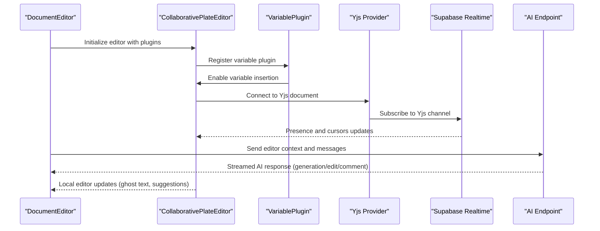
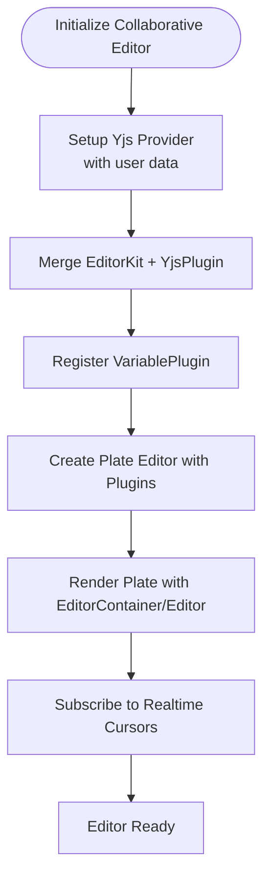
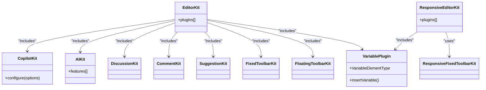
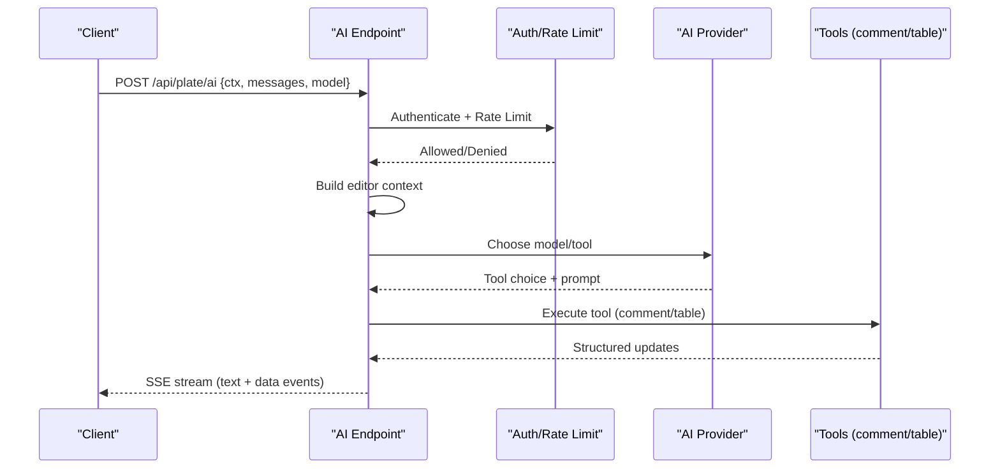
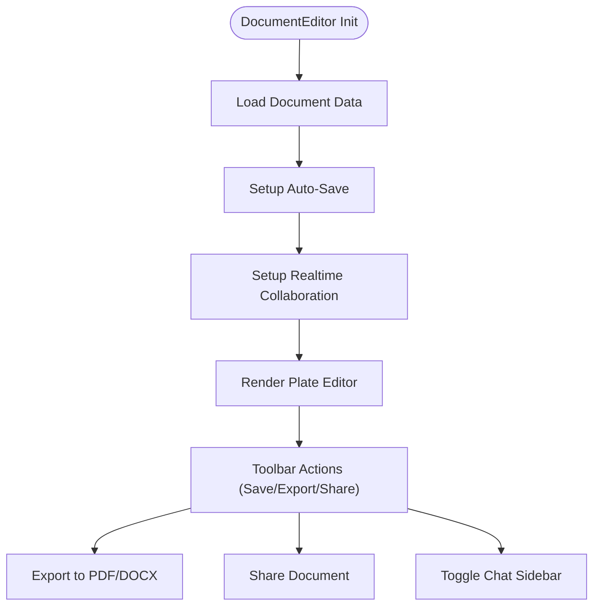
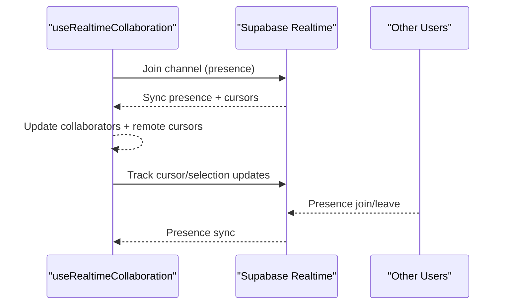
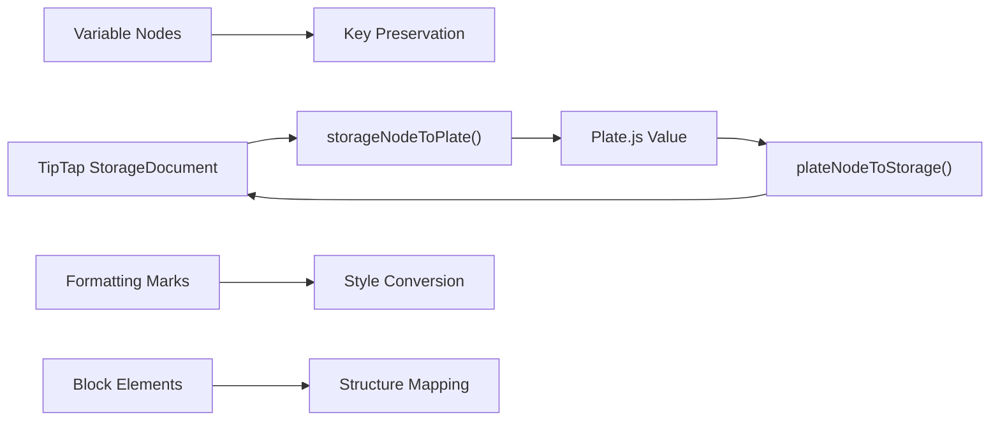
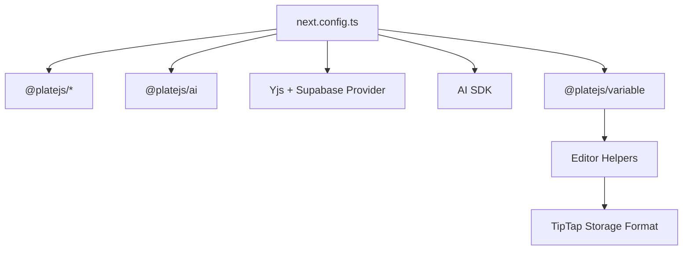

# AI-Assisted Document Editor

<cite>
**Referenced Files in This Document**
- [collaborative-plate-editor.tsx](file://src/components/editor/plate/collaborative-plate-editor.tsx)
- [copilot-kit.tsx](file://src/components/editor/plate/copilot-kit.tsx)
- [editor-kit.tsx](file://src/components/editor/plate/editor-kit.tsx)
- [responsive-editor-kit.tsx](file://src/components/editor/plate/responsive-editor-kit.tsx)
- [document-editor.tsx](file://src/app/(authenticated)/documentos/components/document-editor.tsx)
- [route.ts](file://src/app/api/plate/ai/route.ts)
- [use-realtime-collaboration.ts](file://src/hooks/use-realtime-collaboration.ts)
- [config.ts](file://src/lib/ai-editor/config.ts)
- [system-prompt.ts](file://src/lib/copilotkit/system-prompt.ts)
- [variable-plugin.tsx](file://src/components/editor/plate/variable-plugin.tsx)
- [RichTextEditor.tsx](file://src/app/(authenticated)/assinatura-digital/components/editor/RichTextEditor.tsx)
- [TemplateTextoEditor.tsx](file://src/app/(authenticated)/assinatura-digital/components/editor/template-texto/TemplateTextoEditor.tsx)
- [editor-helpers.ts](file://src/app/(authenticated)/assinatura-digital/components/editor/editor-helpers.ts)
- [types.ts](file://src/app/(authenticated)/assinatura-digital/components/editor/template-texto/types.ts)
- [next.config.ts](file://next.config.ts)
</cite>

## Update Summary
**Changes Made**
- Added comprehensive VariablePlugin integration for dynamic variable insertion in templates
- Enhanced template generation logic with bidirectional conversion between TipTap storage format and Plate.js Value structures
- Updated editor architecture to support advanced template processing with variable substitution
- Improved document editor capabilities with variable-aware content generation and validation

## Table of Contents
1. [Introduction](#introduction)
2. [Project Structure](#project-structure)
3. [Core Components](#core-components)
4. [Architecture Overview](#architecture-overview)
5. [Detailed Component Analysis](#detailed-component-analysis)
6. [Variable Plugin System](#variable-plugin-system)
7. [Template Generation Engine](#template-generation-engine)
8. [Bidirectional Storage Conversion](#bidirectional-storage-conversion)
9. [Dependency Analysis](#dependency-analysis)
10. [Performance Considerations](#performance-considerations)
11. [Troubleshooting Guide](#troubleshooting-guide)
12. [Conclusion](#conclusion)
13. [Appendices](#appendices)

## Introduction
This document describes the AI-assisted document editing system built with Plate.js and CopilotKit, now enhanced with advanced variable management and template generation capabilities. The system features a rich text editor architecture with AI-powered content generation, collaborative editing features, and sophisticated template processing with dynamic variable substitution. It covers the integration of real-time collaboration with legal document workflows, advanced editor plugins, AI suggestions integration, and comprehensive template systems with bidirectional storage format conversion.

## Project Structure
The editor system is organized around Plate.js as the core rich text engine, extended with AI, collaboration, and variable management plugins. The main building blocks are:
- Editor kits that aggregate Plate.js plugins for AI, CopilotKit, collaboration, formatting, parsing, and variable handling
- A collaborative editor component that wires Plate.js with Yjs and Supabase Realtime for conflict-free synchronization and live cursors
- An AI endpoint that orchestrates AI tools and streaming responses tailored for legal document editing
- A document editor shell that integrates auto-save, export, sharing, and chat alongside the Plate editor
- Advanced template editors with variable insertion and bidirectional storage format conversion
- Variable plugin system for dynamic content substitution in legal documents

```mermaid
graph TB
subgraph "Editor Layer"
DK["DocumentEditor<br/>(document-editor.tsx)"]
PE["Plate Editor<br/>(collaborative-plate-editor.tsx)"]
EK["EditorKit<br/>(editor-kit.tsx)"]
R_EK["ResponsiveEditorKit<br/>(responsive-editor-kit.tsx)"]
CK["CopilotKit<br/>(copilot-kit.tsx)"]
VP["VariablePlugin<br/>(variable-plugin.tsx)"]
end
subgraph "Template System"
TE["Template Editors<br/>(TemplateTextoEditor.tsx)"]
RE["Rich Text Editor<br/>(RichTextEditor.tsx)"]
EH["Editor Helpers<br/>(editor-helpers.ts)"]
VT["Variable Types<br/>(types.ts)"]
end
subgraph "AI & Collaboration"
AI_API["AI Endpoint<br/>(route.ts)"]
RTC["Realtime Collaboration Hook<br/>(use-realtime-collaboration.ts)"]
YJS["Yjs + Supabase Provider"]
END
subgraph "System Prompts"
SYS["CopilotKit System Prompt<br/>(system-prompt.ts)"]
CFG["AI Editor Config<br/>(config.ts)"]
end
DK --> PE
PE --> EK
EK --> CK
EK --> VP
PE --> YJS
DK --> RTC
DK --> AI_API
AI_API --> CFG
CK --> SYS
TE --> EH
RE --> EH
EH --> VT
```

**Diagram sources**
- [document-editor.tsx:1-396](file://src/app/(authenticated)/documentos/components/document-editor.tsx#L1-L396)
- [collaborative-plate-editor.tsx:1-220](file://src/components/editor/plate/collaborative-plate-editor.tsx#L1-L220)
- [editor-kit.tsx:1-96](file://src/components/editor/plate/editor-kit.tsx#L1-L96)
- [responsive-editor-kit.tsx:1-101](file://src/components/editor/plate/responsive-editor-kit.tsx#L1-L101)
- [copilot-kit.tsx:1-75](file://src/components/editor/plate/copilot-kit.tsx#L1-L75)
- [variable-plugin.tsx:1-56](file://src/components/editor/plate/variable-plugin.tsx#L1-L56)
- [TemplateTextoEditor.tsx:1-169](file://src/app/(authenticated)/assinatura-digital/components/editor/template-texto/TemplateTextoEditor.tsx#L1-L169)
- [RichTextEditor.tsx:1-306](file://src/app/(authenticated)/assinatura-digital/components/editor/RichTextEditor.tsx#L1-L306)
- [editor-helpers.ts:1-358](file://src/app/(authenticated)/assinatura-digital/components/editor/editor-helpers.ts#L1-L358)
- [types.ts:1-119](file://src/app/(authenticated)/assinatura-digital/components/editor/template-texto/types.ts#L1-L119)
- [route.ts:1-432](file://src/app/api/plate/ai/route.ts#L1-L432)
- [use-realtime-collaboration.ts:1-244](file://src/hooks/use-realtime-collaboration.ts#L1-L244)
- [system-prompt.ts:1-33](file://src/lib/copilotkit/system-prompt.ts#L1-L33)
- [config.ts:1-78](file://src/lib/ai-editor/config.ts#L1-L78)

**Section sources**
- [document-editor.tsx:1-396](file://src/app/(authenticated)/documentos/components/document-editor.tsx#L1-L396)
- [collaborative-plate-editor.tsx:1-220](file://src/components/editor/plate/collaborative-plate-editor.tsx#L1-L220)
- [editor-kit.tsx:1-96](file://src/components/editor/plate/editor-kit.tsx#L1-L96)
- [responsive-editor-kit.tsx:1-101](file://src/components/editor/plate/responsive-editor-kit.tsx#L1-L101)
- [copilot-kit.tsx:1-75](file://src/components/editor/plate/copilot-kit.tsx#L1-L75)
- [variable-plugin.tsx:1-56](file://src/components/editor/plate/variable-plugin.tsx#L1-L56)
- [TemplateTextoEditor.tsx:1-169](file://src/app/(authenticated)/assinatura-digital/components/editor/template-texto/TemplateTextoEditor.tsx#L1-L169)
- [RichTextEditor.tsx:1-306](file://src/app/(authenticated)/assinatura-digital/components/editor/RichTextEditor.tsx#L1-L306)
- [editor-helpers.ts:1-358](file://src/app/(authenticated)/assinatura-digital/components/editor/editor-helpers.ts#L1-L358)
- [types.ts:1-119](file://src/app/(authenticated)/assinatura-digital/components/editor/template-texto/types.ts#L1-L119)
- [route.ts:1-432](file://src/app/api/plate/ai/route.ts#L1-L432)
- [use-realtime-collaboration.ts:1-244](file://src/hooks/use-realtime-collaboration.ts#L1-L244)
- [system-prompt.ts:1-33](file://src/lib/copilotkit/system-prompt.ts#L1-L33)
- [config.ts:1-78](file://src/lib/ai-editor/config.ts#L1-L78)

## Core Components
- Collaborative Plate Editor: Integrates Plate.js with Yjs and Supabase Realtime for collaborative editing and live cursors.
- Editor Kits: Centralized plugin configurations aggregating AI, CopilotKit, formatting, collaboration, parsers, and variable management.
- AI Endpoint: Orchestrates AI tools and streaming responses for generation, editing, and commenting on legal content.
- Document Editor Shell: Provides toolbar, auto-save, export, share, and chat integration around the Plate editor.
- Realtime Collaboration Hook: Manages presence, cursors, and broadcast updates for collaborative sessions.
- AI Editor Config: Loads and caches AI provider configuration from the database with environment variable fallback.
- CopilotKit System Prompt: Defines the assistant's persona and UI labels for CopilotKit.
- Variable Plugin System: Advanced variable insertion and management for dynamic content substitution.
- Template Generation Engine: Bidirectional conversion between TipTap storage format and Plate.js Value structures.
- Enhanced Template Editors: Specialized editors for legal document templates with variable-aware processing.

**Section sources**
- [collaborative-plate-editor.tsx:42-220](file://src/components/editor/plate/collaborative-plate-editor.tsx#L42-L220)
- [editor-kit.tsx:41-96](file://src/components/editor/plate/editor-kit.tsx#L41-L96)
- [route.ts:99-297](file://src/app/api/plate/ai/route.ts#L99-L297)
- [document-editor.tsx:80-396](file://src/app/(authenticated)/documentos/components/document-editor.tsx#L80-L396)
- [use-realtime-collaboration.ts:53-242](file://src/hooks/use-realtime-collaboration.ts#L53-L242)
- [config.ts:21-78](file://src/lib/ai-editor/config.ts#L21-L78)
- [system-prompt.ts:16-33](file://src/lib/copilotkit/system-prompt.ts#L16-L33)
- [variable-plugin.tsx:18-56](file://src/components/editor/plate/variable-plugin.tsx#L18-L56)
- [editor-helpers.ts:227-355](file://src/app/(authenticated)/assinatura-digital/components/editor/editor-helpers.ts#L227-L355)

## Architecture Overview
The system combines Plate.js with AI, collaboration, and variable management layers:
- Editor rendering and plugins are configured via EditorKit and CopilotKit, now enhanced with VariablePlugin.
- Collaborative editing is powered by Yjs and Supabase Realtime, exposing remote cursors and selections.
- AI features are exposed through an API route that selects tools and models based on context and selection.
- The document editor shell coordinates UI actions (save, export, share) and integrates chat.
- Advanced template processing supports dynamic variable substitution with bidirectional storage format conversion.
- Variable plugin system enables sophisticated content generation with placeholder replacement.



**Diagram sources**
- [document-editor.tsx:80-396](file://src/app/(authenticated)/documentos/components/document-editor.tsx#L80-L396)
- [collaborative-plate-editor.tsx:87-151](file://src/components/editor/plate/collaborative-plate-editor.tsx#L87-L151)
- [variable-plugin.tsx:38-56](file://src/components/editor/plate/variable-plugin.tsx#L38-L56)
- [route.ts:99-297](file://src/app/api/plate/ai/route.ts#L99-L297)
- [use-realtime-collaboration.ts:88-181](file://src/hooks/use-realtime-collaboration.ts#L88-L181)

## Detailed Component Analysis

### Collaborative Plate Editor
- Purpose: Provide a Plate.js editor with real-time collaboration via Yjs and Supabase Realtime.
- Key behaviors:
  - Creates a Yjs provider with user data for cursors and colors.
  - Merges EditorKit with YjsPlugin to enable collaborative editing.
  - Exposes connection and sync status callbacks.
  - Includes a non-collaborative SimplePlateEditor for offline scenarios.



**Diagram sources**
- [collaborative-plate-editor.tsx:87-151](file://src/components/editor/plate/collaborative-plate-editor.tsx#L87-L151)
- [collaborative-plate-editor.tsx:153-186](file://src/components/editor/plate/collaborative-plate-editor.tsx#L153-L186)
- [variable-plugin.tsx:38-56](file://src/components/editor/plate/variable-plugin.tsx#L38-L56)

**Section sources**
- [collaborative-plate-editor.tsx:42-220](file://src/components/editor/plate/collaborative-plate-editor.tsx#L42-L220)

### Editor Kits (EditorKit and ResponsiveEditorKit)
- Purpose: Aggregate Plate.js plugins into cohesive editor configurations.
- Features included:
  - AI and CopilotKit for AI-assisted writing and suggestions.
  - Formatting and block elements (lists, tables, media, math, links, mentions).
  - Collaboration plugins (comments, discussions, suggestions).
  - Editing aids (autoformat, slash menu, exit break, drag-and-drop).
  - Parsers (DOCX, Markdown).
  - UI toolbars (fixed and floating, responsive fixed toolbar).
  - **Enhanced**: VariablePlugin for dynamic content substitution.



**Diagram sources**
- [editor-kit.tsx:41-96](file://src/components/editor/plate/editor-kit.tsx#L41-L96)
- [responsive-editor-kit.tsx:47-97](file://src/components/editor/plate/responsive-editor-kit.tsx#L47-L97)
- [copilot-kit.tsx:12-75](file://src/components/editor/plate/copilot-kit.tsx#L12-L75)
- [variable-plugin.tsx:38-56](file://src/components/editor/plate/variable-plugin.tsx#L38-L56)

**Section sources**
- [editor-kit.tsx:1-96](file://src/components/editor/plate/editor-kit.tsx#L1-L96)
- [responsive-editor-kit.tsx:1-101](file://src/components/editor/plate/responsive-editor-kit.tsx#L1-L101)
- [copilot-kit.tsx:1-75](file://src/components/editor/plate/copilot-kit.tsx#L1-L75)
- [variable-plugin.tsx:1-56](file://src/components/editor/plate/variable-plugin.tsx#L1-L56)

### AI Endpoint for Plate Editor
- Purpose: Provide AI-driven editing features (generate, edit, comment) with streaming responses.
- Key behaviors:
  - Authenticates requests and applies rate limiting.
  - Builds editor context from the request payload.
  - Selects appropriate tool/model based on selection and context.
  - Streams markdown-compatible chunks and emits structured data events (comments, table updates).
  - Supports fallback configuration via environment variables.



**Diagram sources**
- [route.ts:99-297](file://src/app/api/plate/ai/route.ts#L99-L297)
- [route.ts:315-431](file://src/app/api/plate/ai/route.ts#L315-L431)

**Section sources**
- [route.ts:99-297](file://src/app/api/plate/ai/route.ts#L99-L297)
- [route.ts:315-431](file://src/app/api/plate/ai/route.ts#L315-L431)

### Document Editor Shell
- Purpose: Orchestrate the editor UI, auto-save, export, share, and chat.
- Key behaviors:
  - Lazy-loads the Plate editor for performance.
  - Integrates auto-save with debounced persistence.
  - Exposes export to PDF/DOCX and version history.
  - Manages real-time collaboration presence and cursors.
  - Conditionally renders a chat sidebar.



**Diagram sources**
- [document-editor.tsx:80-396](file://src/app/(authenticated)/documentos/components/document-editor.tsx#L80-L396)

**Section sources**
- [document-editor.tsx:80-396](file://src/app/(authenticated)/documentos/components/document-editor.tsx#L80-L396)

### Realtime Collaboration Hook
- Purpose: Manage presence, cursors, and broadcast updates for collaborative sessions.
- Key behaviors:
  - Tracks user presence with cursor and selection data.
  - Subscribes to Supabase Realtime presence and broadcast channels.
  - Emits updates for collaborators and remote cursors.
  - Provides methods to update cursor/selection and broadcast content changes.



**Diagram sources**
- [use-realtime-collaboration.ts:88-181](file://src/hooks/use-realtime-collaboration.ts#L88-L181)

**Section sources**
- [use-realtime-collaboration.ts:53-242](file://src/hooks/use-realtime-collaboration.ts#L53-L242)

### AI Editor Configuration and System Prompts
- AI Editor Config:
  - Loads configuration from the database with a 1-minute cache.
  - Falls back to environment variables if DB is not configured.
  - Provides a method to invalidate cache.
- CopilotKit System Prompt:
  - Defines the assistant persona and UI labels for CopilotKit.
  - Exposes a static system prompt for client-side usage and a runtime URL for server-side integration.

**Section sources**
- [config.ts:21-78](file://src/lib/ai-editor/config.ts#L21-L78)
- [system-prompt.ts:16-33](file://src/lib/copilotkit/system-prompt.ts#L16-L33)

## Variable Plugin System
**Updated** Enhanced with comprehensive variable management capabilities for dynamic content substitution in legal documents.

The VariablePlugin system provides sophisticated variable insertion and management for legal document templates:

### VariablePlugin Implementation
- Purpose: Enable dynamic variable insertion with visual placeholders and seamless content generation
- Key features:
  - Custom element type 'variable' for placeholder representation
  - Inline void elements that render as styled spans with variable syntax
  - Insertion function for programmatic variable placement
  - Bidirectional conversion between variable nodes and storage format

```mermaid
classDiagram
class VariablePlugin {
+key : "variable"
+node : {
+isElement : true
+isInline : true
+isVoid : true
+component : VariableElementComponent
+}
+insertVariable(editor, key)
}
class VariableElementComponent {
+render() : JSX.Element
+data-variable-key attribute
+styled visual representation
}
class VariableElementType {
+type : "variable"
+key : string
+children : [{text : string}]
}
VariablePlugin --> VariableElementComponent : "uses"
VariablePlugin --> VariableElementType : "defines"
```

**Diagram sources**
- [variable-plugin.tsx:18-56](file://src/components/editor/plate/variable-plugin.tsx#L18-L56)

### Variable Management in Template Editors
- RichTextEditor integration:
  - Combines VariablePlugin with basic formatting and collaboration features
  - Provides variable insertion popover with categorized variable options
  - Converts between TipTap storage format and Plate.js Value structures
  - Generates template strings with variable placeholders

- TemplateTextoEditor features:
  - Mention-based variable insertion with '@' trigger
  - Predefined variable categories (cliente, segmento, sistema, formulario, contrato)
  - Visual variable insertion helper with keyboard shortcuts
  - Automatic variable grouping and categorization

**Section sources**
- [variable-plugin.tsx:1-56](file://src/components/editor/plate/variable-plugin.tsx#L1-L56)
- [RichTextEditor.tsx:66-100](file://src/app/(authenticated)/assinatura-digital/components/editor/RichTextEditor.tsx#L66-L100)
- [TemplateTextoEditor.tsx:46-68](file://src/app/(authenticated)/assinatura-digital/components/editor/template-texto/TemplateTextoEditor.tsx#L46-L68)
- [types.ts:59-93](file://src/app/(authenticated)/assinatura-digital/components/editor/template-texto/types.ts#L59-L93)

## Template Generation Engine
**Updated** Enhanced with bidirectional conversion between TipTap storage format and Plate.js Value structures for seamless template processing.

The template generation engine provides comprehensive support for legal document templates with dynamic variable substitution:

### Bidirectional Storage Conversion
- Purpose: Enable seamless conversion between TipTap-compatible JSON storage format and Plate.js Value structures
- Key capabilities:
  - Convert TipTap StorageDocument to Plate.js Value for editor rendering
  - Convert Plate.js Value to StorageDocument for database persistence
  - Handle variable nodes with proper key preservation
  - Maintain formatting and structural integrity across conversions



**Diagram sources**
- [editor-helpers.ts:229-355](file://src/app/(authenticated)/assinatura-digital/components/editor/editor-helpers.ts#L229-L355)

### Template Processing Functions
- tiptapJsonToPlateValue: Converts TipTap storage format to Plate.js Value for editor initialization
- plateValueToTiptapJson: Converts Plate.js Value to TipTap storage format for persistence
- Variable-aware conversion: Properly handles variable nodes with key attributes
- Markdown integration: Supports markdown processing with variable extraction and validation

**Section sources**
- [editor-helpers.ts:227-355](file://src/app/(authenticated)/assinatura-digital/components/editor/editor-helpers.ts#L227-L355)
- [editor-helpers.ts:109-197](file://src/app/(authenticated)/assinatura-digital/components/editor/editor-helpers.ts#L109-L197)

## Dependency Analysis
- External libraries and plugins are declared in Next.js configuration for proper bundling and tree-shaking.
- The editor relies on Plate.js ecosystem packages, CopilotKit for AI assistance, and VariablePlugin for dynamic content management.
- Real-time collaboration depends on Supabase client and Yjs provider.
- AI orchestration depends on the AI SDK and a configurable provider.
- Template processing depends on bidirectional conversion utilities for storage format compatibility.



**Diagram sources**
- [next.config.ts:221-242](file://next.config.ts#L221-L242)
- [variable-plugin.tsx:1-56](file://src/components/editor/plate/variable-plugin.tsx#L1-L56)
- [editor-helpers.ts:1-358](file://src/app/(authenticated)/assinatura-digital/components/editor/editor-helpers.ts#L1-L358)

**Section sources**
- [next.config.ts:221-242](file://next.config.ts#L221-L242)
- [variable-plugin.tsx:1-56](file://src/components/editor/plate/variable-plugin.tsx#L1-L56)
- [editor-helpers.ts:1-358](file://src/app/(authenticated)/assinatura-digital/components/editor/editor-helpers.ts#L1-L358)

## Performance Considerations
- Lazy-load the Plate editor to reduce initial bundle size.
- Debounce auto-save to avoid frequent writes.
- Use caching for AI configuration to minimize database queries.
- Stream AI responses to keep UI responsive during long generations.
- Optimize exports by preferring visual capture for complex layouts, with text fallbacks.
- **Enhanced**: Variable plugin performance with efficient DOM rendering and minimal re-renders.
- **Enhanced**: Template conversion optimization with memoized conversion functions and batch processing.

## Troubleshooting Guide
- AI endpoint returns unauthorized or missing API key:
  - Ensure AI editor configuration is present in the database or environment variables are set.
- Rate limit exceeded:
  - The endpoint enforces per-identifier rate limits; verify tier and retry-after headers.
- Collaborative editor not connecting:
  - Verify Supabase credentials and network connectivity; check connection callbacks.
- AI suggestions not appearing:
  - Confirm CopilotKit is included in EditorKit and the system prompt is configured.
- **New**: Variable plugin issues:
  - Verify VariablePlugin is registered in EditorKit and insertVariable function is accessible.
  - Check variable keys are properly formatted and exist in the variable registry.
- **New**: Template conversion errors:
  - Ensure storage format follows TipTap specification with proper node structure.
  - Verify variable nodes have required 'key' attributes in storage format.

**Section sources**
- [config.ts:21-78](file://src/lib/ai-editor/config.ts#L21-L78)
- [route.ts:113-133](file://src/app/api/plate/ai/route.ts#L113-L133)
- [collaborative-plate-editor.tsx:135-138](file://src/components/editor/plate/collaborative-plate-editor.tsx#L135-L138)
- [copilot-kit.tsx:14-73](file://src/components/editor/plate/copilot-kit.tsx#L14-L73)
- [variable-plugin.tsx:38-56](file://src/components/editor/plate/variable-plugin.tsx#L38-L56)
- [editor-helpers.ts:227-355](file://src/app/(authenticated)/assinatura-digital/components/editor/editor-helpers.ts#L227-L355)

## Conclusion
The AI-assisted document editor leverages Plate.js for rich text editing, CopilotKit for AI suggestions, and Supabase Realtime with Yjs for collaborative editing. The enhanced system now includes sophisticated variable management through VariablePlugin, comprehensive template generation with bidirectional storage format conversion, and advanced legal document processing capabilities. The AI endpoint provides contextual generation, editing, and commenting capabilities tailored for legal documents. The document editor shell integrates autosave, export, sharing, and chat, while the realtime hook ensures smooth collaboration. With careful configuration, performance optimizations, and the new variable management system, the platform supports efficient legal document workflows with dynamic content generation and template processing.

## Appendices

### Practical Examples
- AI-assisted contract drafting:
  - Use the editor with CopilotKit enabled to receive contextual suggestions.
  - Trigger AI generation via the AI endpoint with a focused selection or empty selection to choose a tool.
- Legal document analysis:
  - Use the comment tool to annotate sections with legal insights; streamed comments update progressively.
- Content refinement:
  - Apply edits to selected content or tables; the endpoint chooses appropriate models and tools automatically.
- **New**: Dynamic template creation:
  - Use VariablePlugin to insert dynamic placeholders in templates with visual representation.
  - Leverage bidirectional conversion for seamless template persistence and editing.
  - Utilize categorized variable insertion for systematic content generation in legal documents.