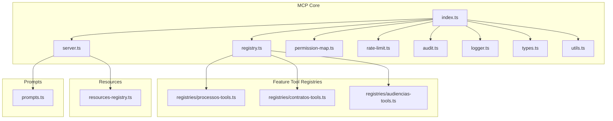
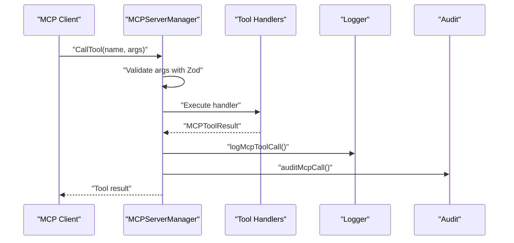
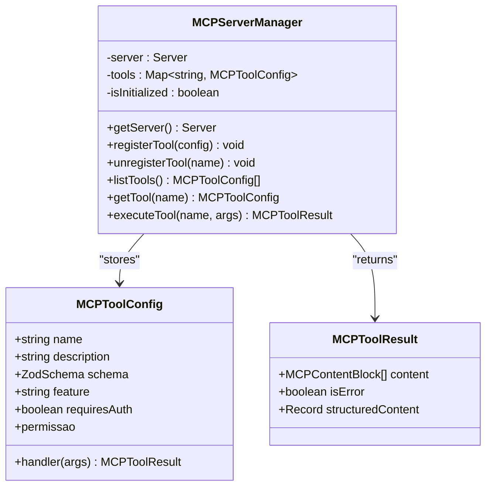
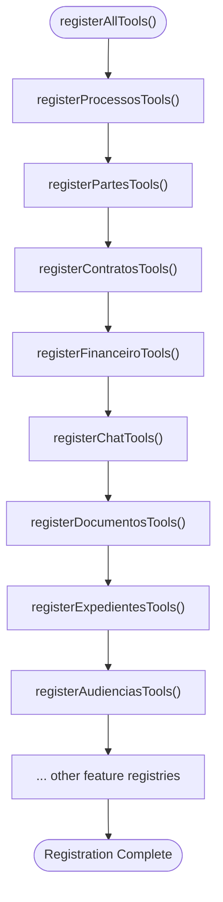
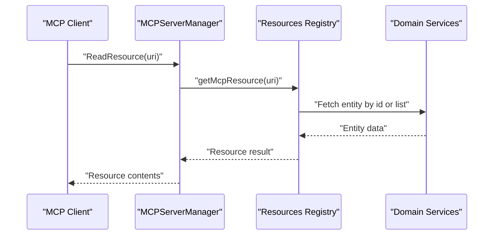
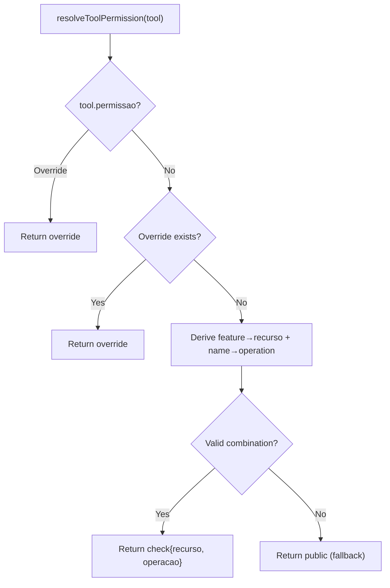
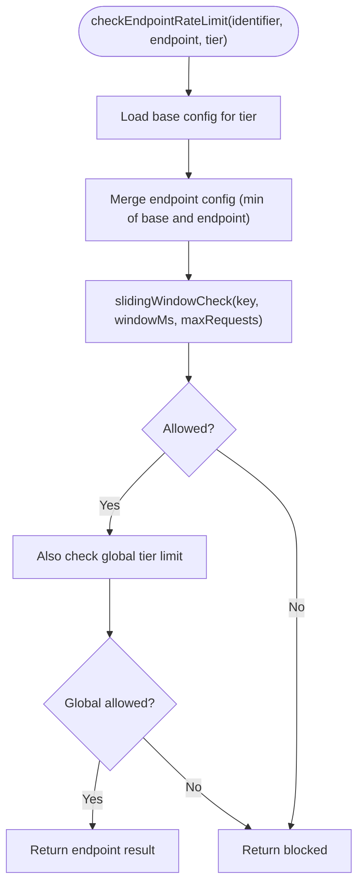
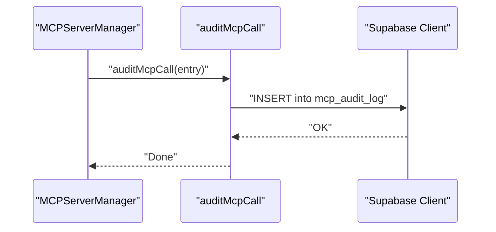
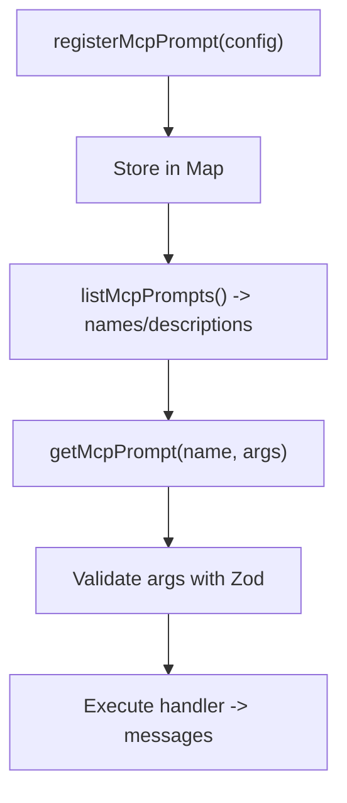
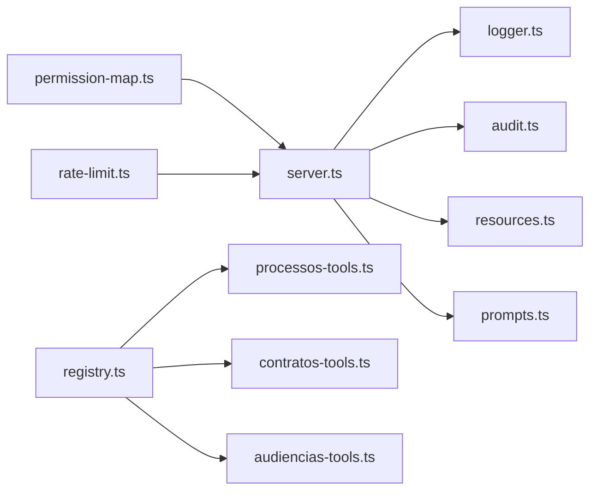

# Model Context Protocol (MCP)

<cite>
**Referenced Files in This Document**
- [index.ts](file://src/lib/mcp/index.ts)
- [server.ts](file://src/lib/mcp/server.ts)
- [registry.ts](file://src/lib/mcp/registry.ts)
- [resources-registry.ts](file://src/lib/mcp/resources-registry.ts)
- [permission-map.ts](file://src/lib/mcp/permission-map.ts)
- [processos-tools.ts](file://src/lib/mcp/registries/processos-tools.ts)
- [contratos-tools.ts](file://src/lib/mcp/registries/contratos-tools.ts)
- [audiencias-tools.ts](file://src/lib/mcp/registries/audiencias-tools.ts)
- [prompts.ts](file://src/lib/mcp/prompts.ts)
- [rate-limit.ts](file://src/lib/mcp/rate-limit.ts)
- [audit.ts](file://src/lib/mcp/audit.ts)
- [logger.ts](file://src/lib/mcp/logger.ts)
- [types.ts](file://src/lib/mcp/types.ts)
- [utils.ts](file://src/lib/mcp/utils.ts)
- [node_mcp_server.md](file://.agents/skills/mcp-builder/reference/node_mcp_server.md)
</cite>

## Table of Contents
1. [Introduction](#introduction)
2. [Project Structure](#project-structure)
3. [Core Components](#core-components)
4. [Architecture Overview](#architecture-overview)
5. [Detailed Component Analysis](#detailed-component-analysis)
6. [Dependency Analysis](#dependency-analysis)
7. [Performance Considerations](#performance-considerations)
8. [Troubleshooting Guide](#troubleshooting-guide)
9. [Conclusion](#conclusion)

## Introduction
This document describes the Model Context Protocol (MCP) implementation in ZattarOS. It explains the MCP server architecture, tool registration system, resource management, permission mapping, rate limiting, and audit logging. It also provides practical examples of tool invocation, prompt management, and integration patterns with external AI models, while ensuring protocol compliance, security, and performance optimization.

## Project Structure
The MCP implementation is organized under src/lib/mcp with modular tool registries grouped by feature domains (processos, contratos, audiencias, etc.), a server manager, permission mapping, rate limiting, auditing, and logging utilities.

**Diagram sources**
- [index.ts:1-57](file://src/lib/mcp/index.ts#L1-L57)
- [server.ts:1-507](file://src/lib/mcp/server.ts#L1-L507)
- [registry.ts:1-163](file://src/lib/mcp/registry.ts#L1-L163)
- [resources-registry.ts:1-294](file://src/lib/mcp/resources-registry.ts#L1-L294)
- [prompts.ts:1-121](file://src/lib/mcp/prompts.ts#L1-L121)
- [permission-map.ts:1-239](file://src/lib/mcp/permission-map.ts#L1-L239)
- [rate-limit.ts:1-408](file://src/lib/mcp/rate-limit.ts#L1-L408)
- [audit.ts:1-271](file://src/lib/mcp/audit.ts#L1-L271)
- [logger.ts:1-306](file://src/lib/mcp/logger.ts#L1-L306)
- [types.ts:1-152](file://src/lib/mcp/types.ts#L1-L152)
- [utils.ts:1-248](file://src/lib/mcp/utils.ts#L1-L248)

**Section sources**
- [index.ts:1-57](file://src/lib/mcp/index.ts#L1-L57)
- [server.ts:1-507](file://src/lib/mcp/server.ts#L1-L507)
- [registry.ts:1-163](file://src/lib/mcp/registry.ts#L1-L163)

## Core Components
- Server Manager: Singleton MCP server with handlers for tools, resources, and prompts. Implements request routing, validation, logging, and audit.
- Tool Registry Orchestrator: Central registry that imports and invokes individual feature registries.
- Feature Tool Registries: Per-domain tool registrations (processos, contratos, audiencias, etc.) using Zod schemas and handlers.
- Resources Registry: URI-based resource exposure for documents, processes, clients, contracts, expedientes, audiencias, and financial entries.
- Permission Mapping: Automatic derivation of permission requirements from tool names and features, with explicit overrides.
- Rate Limiting: Sliding window implementation with Redis, per-tier and per-tool limits.
- Audit & Logging: Structured logging and persistent audit trail with metrics and statistics.
- Types & Utilities: Strong typing for MCP tool configs/results, helpers for formatting and conversion.

**Section sources**
- [server.ts:48-450](file://src/lib/mcp/server.ts#L48-L450)
- [registry.ts:82-142](file://src/lib/mcp/registry.ts#L82-L142)
- [resources-registry.ts:16-294](file://src/lib/mcp/resources-registry.ts#L16-L294)
- [permission-map.ts:186-239](file://src/lib/mcp/permission-map.ts#L186-L239)
- [rate-limit.ts:108-215](file://src/lib/mcp/rate-limit.ts#L108-L215)
- [audit.ts:47-146](file://src/lib/mcp/audit.ts#L47-L146)
- [logger.ts:40-306](file://src/lib/mcp/logger.ts#L40-L306)
- [types.ts:10-152](file://src/lib/mcp/types.ts#L10-L152)
- [utils.ts:12-83](file://src/lib/mcp/utils.ts#L12-L83)

## Architecture Overview
The MCP server exposes three capability areas: tools, resources, and prompts. Requests are validated via Zod schemas, executed with structured logging and audit, and optionally rate-limited. Permissions are derived automatically but can be overridden per tool.

**Diagram sources**
- [server.ts:107-188](file://src/lib/mcp/server.ts#L107-L188)
- [logger.ts:49-68](file://src/lib/mcp/logger.ts#L49-L68)
- [audit.ts:47-69](file://src/lib/mcp/audit.ts#L47-L69)

**Section sources**
- [server.ts:81-293](file://src/lib/mcp/server.ts#L81-L293)

## Detailed Component Analysis

### MCP Server Manager
- Responsibilities:
  - Initialize and expose a single MCP Server instance.
  - Register request handlers for tools, resources, and prompts.
  - Convert Zod schemas to JSON Schema for tool introspection.
  - Manage tool registry map and lifecycle.
  - Integrate logging, audit, and timing for all operations.
- Key behaviors:
  - Tool handler validates arguments, executes handler, logs, audits, and returns standardized results.
  - Resource handler resolves URIs and returns content with proper MIME types.
  - Prompt handler resolves named prompts with validated arguments.

**Diagram sources**
- [server.ts:48-450](file://src/lib/mcp/server.ts#L48-L450)
- [types.ts:10-41](file://src/lib/mcp/types.ts#L10-L41)

**Section sources**
- [server.ts:48-450](file://src/lib/mcp/server.ts#L48-L450)
- [types.ts:10-41](file://src/lib/mcp/types.ts#L10-L41)

### Tool Registration System
- Registry orchestration:
  - Central registry imports and invokes per-feature registries in a deterministic order.
  - Prevents duplicate registration with a flag guard.
- Feature registries:
  - Each module registers tools with Zod schemas, handlers, and descriptive metadata.
  - Examples:
    - Processos tools: list, search by CPF/CNPJ/number.
    - Contratos tools: list, create, update, client lookup.
    - Audiencias tools: list, status update, type list, search by CPF/CNPJ/process number.

**Diagram sources**
- [registry.ts:95-142](file://src/lib/mcp/registry.ts#L95-L142)

**Section sources**
- [registry.ts:82-142](file://src/lib/mcp/registry.ts#L82-L142)
- [processos-tools.ts:22-202](file://src/lib/mcp/registries/processos-tools.ts#L22-L202)
- [contratos-tools.ts:20-170](file://src/lib/mcp/registries/contratos-tools.ts#L20-L170)
- [audiencias-tools.ts:22-267](file://src/lib/mcp/registries/audiencias-tools.ts#L22-L267)

### Resource Management
- Resources are exposed via URI templates with handlers that fetch and return structured content.
- Supported resources include documents, processes, clients, contracts, expedientes, audiencias, and financial entries.
- Handlers perform authentication checks and return JSON results with metadata.

**Diagram sources**
- [server.ts:206-244](file://src/lib/mcp/server.ts#L206-L244)
- [resources-registry.ts:16-294](file://src/lib/mcp/resources-registry.ts#L16-L294)

**Section sources**
- [server.ts:194-244](file://src/lib/mcp/server.ts#L194-L244)
- [resources-registry.ts:16-294](file://src/lib/mcp/resources-registry.ts#L16-L294)

### Permission Mapping System
- Derives permissions from:
  - Explicit override in tool definition.
  - Central overrides for special cases (Chatwoot, Dify, Financeiro).
  - Convention: feature → resource + tool name → operation.
- Fallback: public for unknown combinations.

**Diagram sources**
- [permission-map.ts:202-239](file://src/lib/mcp/permission-map.ts#L202-L239)

**Section sources**
- [permission-map.ts:186-239](file://src/lib/mcp/permission-map.ts#L186-L239)

### Rate Limiting Mechanism
- Sliding window algorithm using Redis Sorted Sets.
- Tiers: anonymous, authenticated, service.
- Endpoint-specific and tool-specific overrides.
- Fail-open by default for availability; configurable via environment.

**Diagram sources**
- [rate-limit.ts:220-264](file://src/lib/mcp/rate-limit.ts#L220-L264)
- [rate-limit.ts:108-163](file://src/lib/mcp/rate-limit.ts#L108-L163)

**Section sources**
- [rate-limit.ts:108-264](file://src/lib/mcp/rate-limit.ts#L108-L264)

### Audit Logging and Metrics
- Persistent audit log stored in Supabase with sanitization.
- Structured logging with Pino for operational visibility.
- Usage statistics and cleanup utilities.

**Diagram sources**
- [audit.ts:47-69](file://src/lib/mcp/audit.ts#L47-L69)
- [logger.ts:49-68](file://src/lib/mcp/logger.ts#L49-L68)

**Section sources**
- [audit.ts:47-146](file://src/lib/mcp/audit.ts#L47-L146)
- [logger.ts:49-137](file://src/lib/mcp/logger.ts#L49-L137)

### Prompt Management
- Prompts are registered as named templates with Zod argument schemas.
- Execution returns structured messages for LLM consumption.
- Helpers simplify creation of system/user prompt pairs.

**Diagram sources**
- [prompts.ts:46-86](file://src/lib/mcp/prompts.ts#L46-L86)

**Section sources**
- [prompts.ts:14-121](file://src/lib/mcp/prompts.ts#L14-L121)

### Practical Examples

- Tool Invocation
  - List processes with filters and pagination.
  - Search processes by client CPF/CNPJ.
  - Search process by CNJ number.
  - Create/update contracts and list by client.

- Prompt Usage
  - Use registered prompts to generate system/user message sequences for AI workflows.

- Resource Access
  - Retrieve a specific process, client, contract, audiência, or financial entry via URI templates.

- Integration with External AI Models
  - Use prompts to construct contextual messages.
  - Expose resources for efficient data retrieval.
  - Apply rate limiting and enforce permissions.

**Section sources**
- [processos-tools.ts:34-201](file://src/lib/mcp/registries/processos-tools.ts#L34-L201)
- [contratos-tools.ts:34-169](file://src/lib/mcp/registries/contratos-tools.ts#L34-L169)
- [audiencias-tools.ts:35-266](file://src/lib/mcp/registries/audiencias-tools.ts#L35-L266)
- [prompts.ts:71-86](file://src/lib/mcp/prompts.ts#L71-L86)
- [resources-registry.ts:23-294](file://src/lib/mcp/resources-registry.ts#L23-L294)

## Dependency Analysis
- Internal dependencies:
  - server.ts depends on logger.ts, audit.ts, resources.ts, prompts.ts for logging, audit, and capability handlers.
  - registry.ts orchestrates feature registries and guards against duplicates.
  - permission-map.ts integrates with the permission system for validation.
  - rate-limit.ts integrates with Redis for sliding window enforcement.
- External dependencies:
  - MCP SDK for server and transport.
  - Zod for schema validation.
  - Supabase for audit persistence.
  - Redis client for rate limiting.

**Diagram sources**
- [server.ts:18-27](file://src/lib/mcp/server.ts#L18-L27)
- [registry.ts:44-80](file://src/lib/mcp/registry.ts#L44-L80)
- [permission-map.ts:14-15](file://src/lib/mcp/permission-map.ts#L14-L15)
- [rate-limit.ts:11-12](file://src/lib/mcp/rate-limit.ts#L11-L12)

**Section sources**
- [server.ts:18-27](file://src/lib/mcp/server.ts#L18-L27)
- [registry.ts:44-80](file://src/lib/mcp/registry.ts#L44-L80)

## Performance Considerations
- Use sliding window rate limiting to prevent spikes while maintaining availability.
- Prefer resource URIs for bulk or repeated reads to minimize tool overhead.
- Validate inputs early with Zod to reduce downstream processing costs.
- Log and audit selectively; leverage structured logs for observability without impacting latency.
- Cache frequently accessed data where appropriate and supported by domain logic.

## Troubleshooting Guide
- Tool not found:
  - Verify tool registration and that registerAllTools() was called.
  - Check server handlers for tool listing and execution.

- Permission denied:
  - Review permission mapping logic and overrides.
  - Confirm user has required resource:operation permissions.

- Rate limit exceeded:
  - Inspect tier and endpoint-specific limits.
  - Check Redis connectivity and sliding window keys.

- Audit and logs:
  - Query audit logs for detailed traces.
  - Use structured logs for quick diagnosis of failures.

**Section sources**
- [server.ts:112-188](file://src/lib/mcp/server.ts#L112-L188)
- [permission-map.ts:202-239](file://src/lib/mcp/permission-map.ts#L202-L239)
- [rate-limit.ts:172-215](file://src/lib/mcp/rate-limit.ts#L172-L215)
- [audit.ts:74-146](file://src/lib/mcp/audit.ts#L74-L146)
- [logger.ts:49-137](file://src/lib/mcp/logger.ts#L49-L137)

## Conclusion
ZattarOS MCP implementation provides a robust, secure, and observable framework for exposing domain capabilities to AI agents. The modular registry pattern scales across feature domains, while permission mapping, rate limiting, and audit/logging ensure security and compliance. Structured prompts and resources streamline integration with external AI models, and the architecture supports performance optimization through validation, caching, and efficient logging.