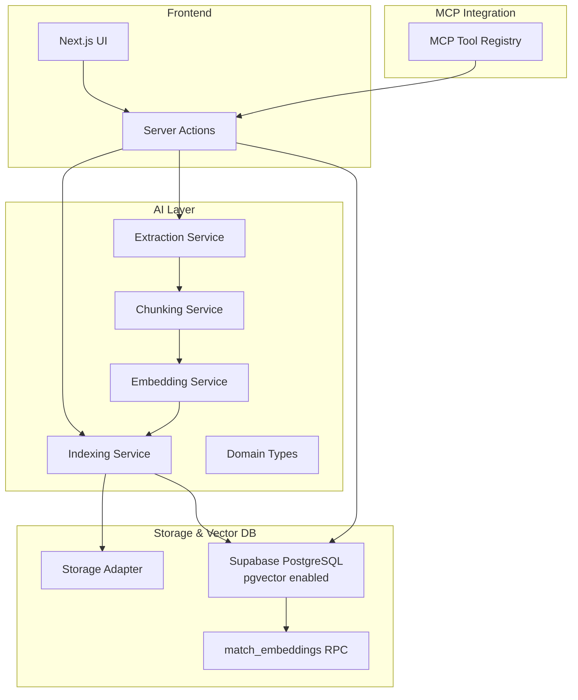
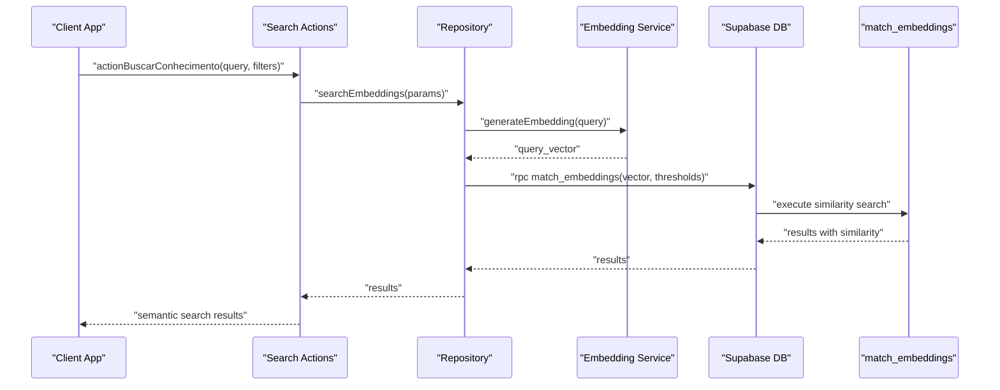
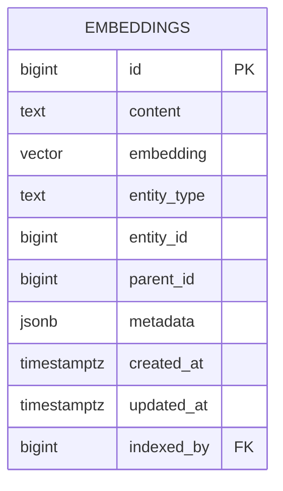
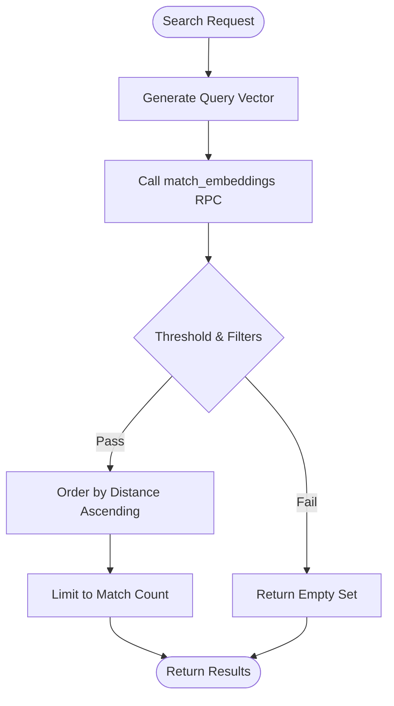
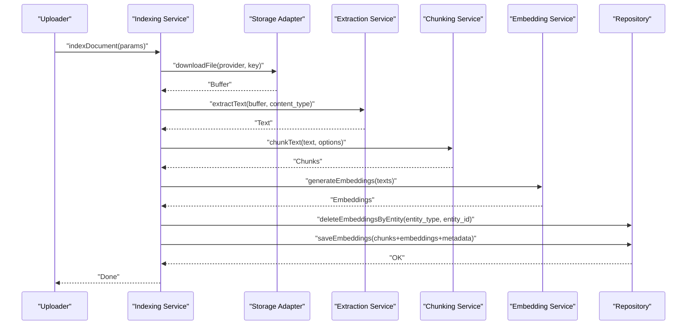
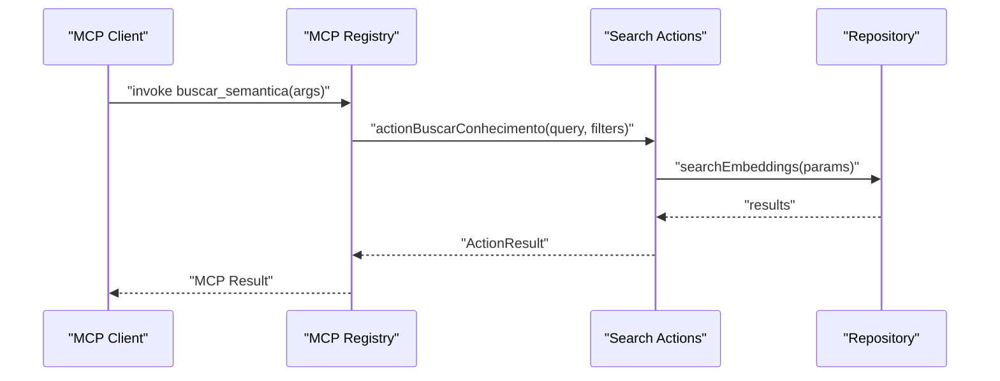
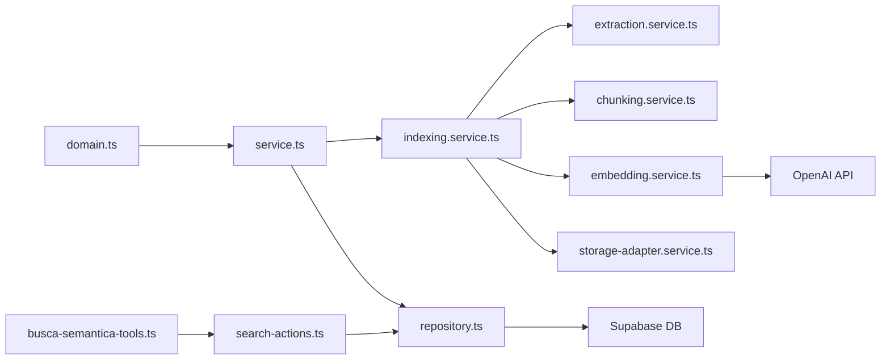

# RAG and Embeddings System

<cite>
**Referenced Files in This Document**
- [20251212000000_create_embeddings_system.sql](file://supabase/migrations/20251212000000_create_embeddings_system.sql)
- [20251216132616_create_embeddings_system.sql](file://supabase/migrations/20251216132616_create_embeddings_system.sql)
- [00000000000001_production_schema.sql](file://supabase/migrations/00000000000001_production_schema.sql)
- [domain.ts](file://src/lib/ai/domain.ts)
- [repository.ts](file://src/lib/ai/repository.ts)
- [service.ts](file://src/lib/ai/service.ts)
- [indexing.service.ts](file://src/lib/ai/services/indexing.service.ts)
- [extraction.service.ts](file://src/lib/ai/services/extraction.service.ts)
- [chunking.service.ts](file://src/lib/ai/services/chunking.service.ts)
- [embedding.service.ts](file://src/lib/ai/services/embedding.service.ts)
- [storage-adapter.service.ts](file://src/lib/ai/services/storage-adapter.service.ts)
- [search-actions.ts](file://src/lib/ai/actions/search-actions.ts)
- [busca-semantica-tools.ts](file://src/lib/mcp/registries/busca-semantica-tools.ts)
- [index-existing-documents.ts](file://scripts/ai/index-existing-documents.ts)
- [AGENTS.md](file://docs/architecture/AGENTS.md)
</cite>

## Table of Contents
1. [Introduction](#introduction)
2. [Project Structure](#project-structure)
3. [Core Components](#core-components)
4. [Architecture Overview](#architecture-overview)
5. [Detailed Component Analysis](#detailed-component-analysis)
6. [Dependency Analysis](#dependency-analysis)
7. [Performance Considerations](#performance-considerations)
8. [Troubleshooting Guide](#troubleshooting-guide)
9. [Conclusion](#conclusion)
10. [Appendices](#appendices)

## Introduction
This document explains the Retrieval-Augmented Generation (RAG) system and embeddings implementation using pgvector in the project. It covers the end-to-end document embedding pipeline, similarity search algorithms, and semantic retrieval mechanisms tailored for legal documents. It also documents the embeddings table schema, vector indexing strategies, query optimization techniques, and integration with the Model Context Protocol (MCP) tools. Practical examples demonstrate legal research workflows, document similarity matching, and AI-powered case analysis. Guidance is included for performance tuning with large document collections, memory management for embeddings, and security considerations for sensitive legal data.

## Project Structure
The RAG system spans client-side and server-side layers:
- Frontend and server actions orchestrate user queries and MCP tool invocations.
- AI services handle document ingestion, chunking, embedding generation, and persistence.
- Supabase stores embeddings in a unified table with vector and JSONB metadata, and exposes a vector similarity function.
- MCP tools expose semantic search capabilities to external clients.

**Diagram sources**
- [AGENTS.md:122-156](file://docs/architecture/AGENTS.md#L122-L156)
- [domain.ts:1-70](file://src/lib/ai/domain.ts#L1-L70)
- [repository.ts:1-107](file://src/lib/ai/repository.ts#L1-L107)
- [service.ts:1-59](file://src/lib/ai/service.ts#L1-L59)
- [indexing.service.ts:1-245](file://src/lib/ai/services/indexing.service.ts#L1-L245)
- [extraction.service.ts:1-175](file://src/lib/ai/services/extraction.service.ts#L1-L175)
- [chunking.service.ts:1-118](file://src/lib/ai/services/chunking.service.ts#L1-L118)
- [embedding.service.ts:1-107](file://src/lib/ai/services/embedding.service.ts#L1-L107)
- [storage-adapter.service.ts:1-93](file://src/lib/ai/services/storage-adapter.service.ts#L1-L93)
- [busca-semantica-tools.ts:1-53](file://src/lib/mcp/registries/busca-semantica-tools.ts#L1-L53)

**Section sources**
- [AGENTS.md:122-156](file://docs/architecture/AGENTS.md#L122-L156)

## Core Components
- Embeddings table schema and vector indexing: Defines the unified embeddings table, vector dimensionality, entity categorization, and indices for efficient pre-filtering and similarity search.
- Similarity search function: Implements cosine distance-based similarity with optional filters for entity type, parent, and metadata.
- AI ingestion pipeline: Downloads files, extracts text, chunks content, generates embeddings, and persists aligned vectors with metadata.
- Search orchestration: Converts queries to vectors, invokes the similarity function, and returns ranked results with provenance metadata.
- MCP tool registration: Exposes semantic search as an MCP tool with authentication and typed parameters.

**Section sources**
- [20251212000000_create_embeddings_system.sql:1-104](file://supabase/migrations/20251212000000_create_embeddings_system.sql#L1-L104)
- [20251216132616_create_embeddings_system.sql:1-105](file://supabase/migrations/20251216132616_create_embeddings_system.sql#L1-L105)
- [00000000000001_production_schema.sql:2467-2493](file://supabase/migrations/00000000000001_production_schema.sql#L2467-L2493)
- [domain.ts:1-70](file://src/lib/ai/domain.ts#L1-L70)
- [repository.ts:1-107](file://src/lib/ai/repository.ts#L1-L107)
- [service.ts:1-59](file://src/lib/ai/service.ts#L1-L59)
- [indexing.service.ts:1-245](file://src/lib/ai/services/indexing.service.ts#L1-L245)
- [extraction.service.ts:1-175](file://src/lib/ai/services/extraction.service.ts#L1-L175)
- [chunking.service.ts:1-118](file://src/lib/ai/services/chunking.service.ts#L1-L118)
- [embedding.service.ts:1-107](file://src/lib/ai/services/embedding.service.ts#L1-L107)
- [storage-adapter.service.ts:1-93](file://src/lib/ai/services/storage-adapter.service.ts#L1-L93)
- [busca-semantica-tools.ts:1-53](file://src/lib/mcp/registries/busca-semantica-tools.ts#L1-L53)

## Architecture Overview
The system integrates file ingestion, text extraction, chunking, vector generation, and pgvector similarity search behind a typed API and MCP tools.

**Diagram sources**
- [search-actions.ts:1-98](file://src/lib/ai/actions/search-actions.ts#L1-L98)
- [repository.ts:21-41](file://src/lib/ai/repository.ts#L21-L41)
- [embedding.service.ts:100-106](file://src/lib/ai/services/embedding.service.ts#L100-L106)
- [20251216132616_create_embeddings_system.sql:56-96](file://supabase/migrations/20251216132616_create_embeddings_system.sql#L56-L96)

## Detailed Component Analysis

### Embeddings Table Schema and Indices
- Table: public.embeddings
  - Columns: id, content, embedding (vector), entity_type, entity_id, parent_id, metadata, timestamps, indexed_by.
  - Constraints: entity_type enum includes legal/document/process-related categories; foreign key on indexed_by; RLS enabled.
- Indices:
  - HNSW vector index with cosine ops for fast similarity search.
  - Pre-filtering indices: entity_type + entity_id, parent_id, metadata GIN, created_at.
- Function: match_embeddings
  - Computes cosine distance similarity, applies threshold, optional filters, and limits results.

**Diagram sources**
- [20251212000000_create_embeddings_system.sql:9-31](file://supabase/migrations/20251212000000_create_embeddings_system.sql#L9-L31)
- [20251216132616_create_embeddings_system.sql:9-31](file://supabase/migrations/20251216132616_create_embeddings_system.sql#L9-L31)

**Section sources**
- [20251212000000_create_embeddings_system.sql:1-104](file://supabase/migrations/20251212000000_create_embeddings_system.sql#L1-L104)
- [20251216132616_create_embeddings_system.sql:1-105](file://supabase/migrations/20251216132616_create_embeddings_system.sql#L1-L105)
- [00000000000001_production_schema.sql:2467-2493](file://supabase/migrations/00000000000001_production_schema.sql#L2467-L2493)

### Similarity Search Algorithm and Filters
- Distance metric: Cosine distance via vector_cosine_ops.
- Threshold filtering: Only results above a configurable similarity threshold are returned.
- Optional filters:
  - Entity type to constrain search scope (e.g., process-related vs. general documents).
  - Parent ID to restrict results to a specific parent entity (e.g., a specific process).
  - Metadata containment to target specific attributes.
- Ordering and limiting: Results ordered by distance ascending and limited by match_count.

**Diagram sources**
- [repository.ts:21-41](file://src/lib/ai/repository.ts#L21-L41)
- [20251216132616_create_embeddings_system.sql:56-96](file://supabase/migrations/20251216132616_create_embeddings_system.sql#L56-L96)

**Section sources**
- [repository.ts:21-41](file://src/lib/ai/repository.ts#L21-L41)
- [20251216132616_create_embeddings_system.sql:56-96](file://supabase/migrations/20251216132616_create_embeddings_system.sql#L56-L96)

### Document Embedding Pipeline
End-to-end ingestion and indexing:
- Storage provider selection and download.
- Content-type validation and text extraction.
- Chunking with overlap preservation and paragraph-aware segmentation.
- Filtering of empty chunks to maintain alignment.
- Batch embedding generation with OpenAI API.
- Deletion of prior embeddings for the same entity.
- Batch insert of aligned chunks and embeddings with metadata.

**Diagram sources**
- [indexing.service.ts:58-153](file://src/lib/ai/services/indexing.service.ts#L58-L153)
- [storage-adapter.service.ts:6-34](file://src/lib/ai/services/storage-adapter.service.ts#L6-L34)
- [extraction.service.ts:92-132](file://src/lib/ai/services/extraction.service.ts#L92-L132)
- [chunking.service.ts:17-94](file://src/lib/ai/services/chunking.service.ts#L17-L94)
- [embedding.service.ts:45-98](file://src/lib/ai/services/embedding.service.ts#L45-L98)
- [repository.ts:4-19](file://src/lib/ai/repository.ts#L4-L19)

**Section sources**
- [indexing.service.ts:58-153](file://src/lib/ai/services/indexing.service.ts#L58-L153)
- [storage-adapter.service.ts:1-93](file://src/lib/ai/services/storage-adapter.service.ts#L1-L93)
- [extraction.service.ts:1-175](file://src/lib/ai/services/extraction.service.ts#L1-L175)
- [chunking.service.ts:1-118](file://src/lib/ai/services/chunking.service.ts#L1-L118)
- [embedding.service.ts:1-107](file://src/lib/ai/services/embedding.service.ts#L1-L107)
- [repository.ts:1-107](file://src/lib/ai/repository.ts#L1-L107)

### Semantic Retrieval Mechanisms for Legal Documents
- Legal document types: The entity_type enum supports categories relevant to legal practice (e.g., documents, process pieces, process updates, contracts, agendas, digital signatures).
- Parent scoping: parent_id enables narrowing results to a specific legal matter (e.g., a process), improving contextual relevance.
- Metadata enrichment: metadata JSONB captures chunk indices and character offsets, enabling precise provenance and citation.
- Threshold tuning: match_threshold balances precision and recall; higher thresholds reduce noise but risk missing relevant content.

**Section sources**
- [domain.ts:3-12](file://src/lib/ai/domain.ts#L3-L12)
- [20251216132616_create_embeddings_system.sql:17-22](file://supabase/migrations/20251216132616_create_embeddings_system.sql#L17-L22)
- [indexing.service.ts:131-146](file://src/lib/ai/services/indexing.service.ts#L131-L146)

### MCP Integration and Tools
- Tool registration: The MCP registry exposes a semantic search tool with:
  - Name: buscar_semantica
  - Description: Performs semantic search across office knowledge, documents, and processes.
  - Parameters: query, limite (max results), contextos (entity types).
  - Authentication: Requires authenticated calls.
- Invocation: The tool delegates to server actions that call the search pipeline and return structured results.

**Diagram sources**
- [busca-semantica-tools.ts:17-52](file://src/lib/mcp/registries/busca-semantica-tools.ts#L17-L52)
- [search-actions.ts:7-39](file://src/lib/ai/actions/search-actions.ts#L7-L39)
- [repository.ts:21-41](file://src/lib/ai/repository.ts#L21-L41)

**Section sources**
- [busca-semantica-tools.ts:1-53](file://src/lib/mcp/registries/busca-semantica-tools.ts#L1-L53)
- [search-actions.ts:1-98](file://src/lib/ai/actions/search-actions.ts#L1-L98)

### Practical Examples
- Legal research workflow:
  - Upload a PDF or DOCX of a legal precedent or contract.
  - The system extracts text, chunks it, generates embeddings, and persists them.
  - A researcher asks a question like “What are the key obligations in labor lawsuits?”
  - The system converts the query to a vector, runs match_embeddings, and returns top-k results with metadata for citation.
- Document similarity matching:
  - Compare two legal documents by generating embeddings for representative chunks and computing cosine similarity.
- AI-powered case analysis:
  - Use the MCP tool to analyze a specific process, focusing on risks, strategy, deadlines, or general insights, leveraging retrieved context to inform conclusions.

[No sources needed since this section provides general guidance]

## Dependency Analysis
- Internal dependencies:
  - domain.ts defines shared types for embeddings, indexing, and search.
  - service.ts orchestrates repository calls for search, indexing, and counts.
  - repository.ts coordinates Supabase client interactions and RPC calls.
  - indexing.service.ts depends on extraction, chunking, embedding, and storage adapters.
  - embedding.service.ts depends on OpenAI API and environment configuration.
  - busca-semantica-tools.ts depends on search-actions.ts for execution.
- External dependencies:
  - pgvector extension for vector operations.
  - OpenAI Embeddings API for vector generation.
  - Storage providers (Backblaze B2, Supabase Storage) for file downloads.

**Diagram sources**
- [domain.ts:1-70](file://src/lib/ai/domain.ts#L1-L70)
- [service.ts:1-59](file://src/lib/ai/service.ts#L1-L59)
- [repository.ts:1-107](file://src/lib/ai/repository.ts#L1-L107)
- [indexing.service.ts:1-245](file://src/lib/ai/services/indexing.service.ts#L1-L245)
- [extraction.service.ts:1-175](file://src/lib/ai/services/extraction.service.ts#L1-L175)
- [chunking.service.ts:1-118](file://src/lib/ai/services/chunking.service.ts#L1-L118)
- [embedding.service.ts:1-107](file://src/lib/ai/services/embedding.service.ts#L1-L107)
- [storage-adapter.service.ts:1-93](file://src/lib/ai/services/storage-adapter.service.ts#L1-L93)
- [busca-semantica-tools.ts:1-53](file://src/lib/mcp/registries/busca-semantica-tools.ts#L1-L53)
- [search-actions.ts:1-98](file://src/lib/ai/actions/search-actions.ts#L1-L98)

**Section sources**
- [domain.ts:1-70](file://src/lib/ai/domain.ts#L1-L70)
- [service.ts:1-59](file://src/lib/ai/service.ts#L1-L59)
- [repository.ts:1-107](file://src/lib/ai/repository.ts#L1-L107)
- [indexing.service.ts:1-245](file://src/lib/ai/services/indexing.service.ts#L1-L245)
- [extraction.service.ts:1-175](file://src/lib/ai/services/extraction.service.ts#L1-L175)
- [chunking.service.ts:1-118](file://src/lib/ai/services/chunking.service.ts#L1-L118)
- [embedding.service.ts:1-107](file://src/lib/ai/services/embedding.service.ts#L1-L107)
- [storage-adapter.service.ts:1-93](file://src/lib/ai/services/storage-adapter.service.ts#L1-L93)
- [busca-semantica-tools.ts:1-53](file://src/lib/mcp/registries/busca-semantica-tools.ts#L1-L53)
- [search-actions.ts:1-98](file://src/lib/ai/actions/search-actions.ts#L1-L98)

## Performance Considerations
- Vector indexing:
  - HNSW with cosine ops ensures fast similarity search; ensure adequate memory for index size.
  - Pre-filtering indices (entity_type+entity_id, parent_id, metadata GIN) reduce candidate sets before vector search.
- Batch operations:
  - Embedding generation batches up to 2048 texts per request; ingestion pipeline batches inserts to avoid oversized payloads.
- Chunking strategy:
  - Optimal chunk size and overlap balance semantic coherence and recall; adjust chunkSize and chunkOverlap based on corpus characteristics.
- Query optimization:
  - Use match_threshold and match_count to control result quality and latency.
  - Filter by entity_type and parent_id to narrow scope and leverage pre-filtering indices.
- Scaling:
  - Parallelize indexing across documents with controlled concurrency.
  - Consider rate limits and backoff for OpenAI API.

[No sources needed since this section provides general guidance]

## Troubleshooting Guide
- Missing OPENAI_API_KEY:
  - Symptom: Embedding generation fails.
  - Resolution: Set OPENAI_API_KEY in environment.
- Empty or unsupported content types:
  - Symptom: Indexing skips documents.
  - Resolution: Verify content_type support and ensure extracted text length exceeds minimum threshold.
- Misaligned chunks and embeddings:
  - Symptom: Length mismatch errors during save.
  - Resolution: Ensure all chunks are non-empty before generating embeddings.
- RPC errors:
  - Symptom: Search returns error.
  - Resolution: Check match_embeddings parameters and Supabase connectivity.
- MCP tool failures:
  - Symptom: Tool invocation returns error.
  - Resolution: Confirm authentication, parameter validation, and server action success.

**Section sources**
- [embedding.service.ts:9-12](file://src/lib/ai/services/embedding.service.ts#L9-L12)
- [indexing.service.ts:65-74](file://src/lib/ai/services/indexing.service.ts#L65-L74)
- [indexing.service.ts:120-125](file://src/lib/ai/services/indexing.service.ts#L120-L125)
- [repository.ts:36-38](file://src/lib/ai/repository.ts#L36-L38)
- [busca-semantica-tools.ts:47-49](file://src/lib/mcp/registries/busca-semantica-tools.ts#L47-L49)

## Conclusion
The RAG system integrates robust ingestion, chunking, and embedding workflows with pgvector-powered similarity search and MCP tooling. The unified embeddings schema, targeted indices, and flexible filters enable precise, scalable semantic retrieval for legal documents. By tuning thresholds, leveraging pre-filtering, and optimizing chunking and batching, teams can achieve high-quality, low-latency legal research and case analysis experiences.

[No sources needed since this section summarizes without analyzing specific files]

## Appendices

### Embeddings Table Schema Reference
- Columns:
  - id: autoincrement primary key
  - content: text chunk
  - embedding: vector(1536)
  - entity_type: enum of legal/document/process categories
  - entity_id: identifier within entity_type
  - parent_id: optional parent entity (e.g., process)
  - metadata: JSONB with chunk_index and char offsets
  - created_at/updated_at: timestamps
  - indexed_by: user who indexed
- Indices:
  - HNSW vector cosine index
  - entity_type + entity_id
  - parent_id
  - metadata GIN
  - created_at

**Section sources**
- [20251212000000_create_embeddings_system.sql:9-46](file://supabase/migrations/20251212000000_create_embeddings_system.sql#L9-L46)
- [20251216132616_create_embeddings_system.sql:9-46](file://supabase/migrations/20251216132616_create_embeddings_system.sql#L9-L46)

### Retroactive Indexing Script
- Purpose: Batch index existing documents with concurrency control and progress reporting.
- Features: Dry-run mode, skip already indexed, batch processing, and summary statistics.

**Section sources**
- [index-existing-documents.ts:168-260](file://scripts/ai/index-existing-documents.ts#L168-L260)