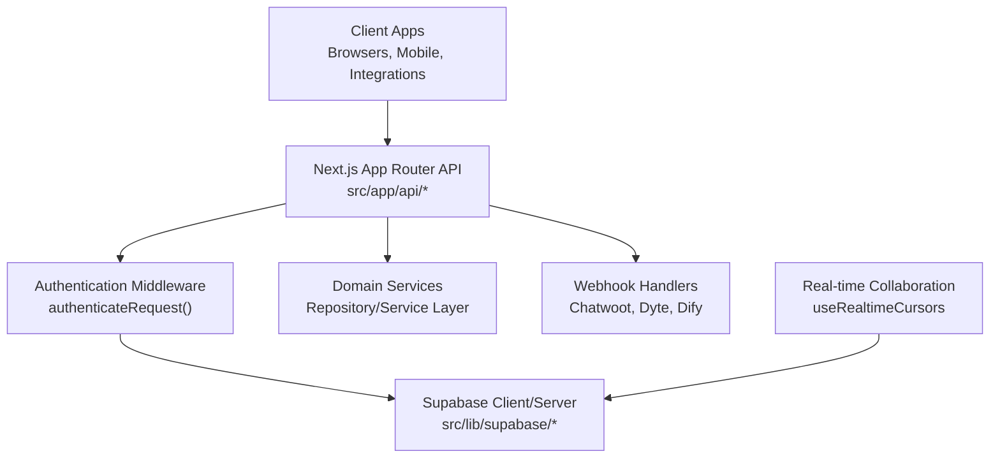
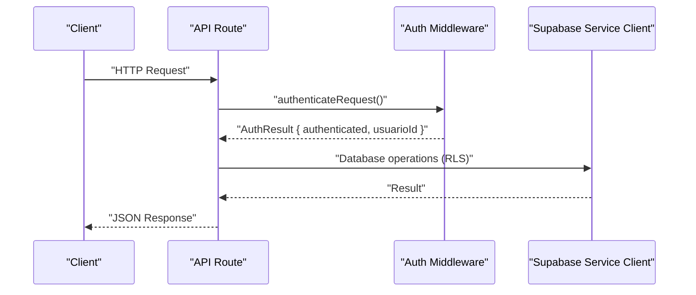
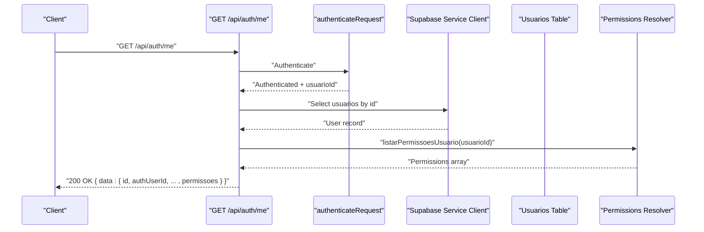
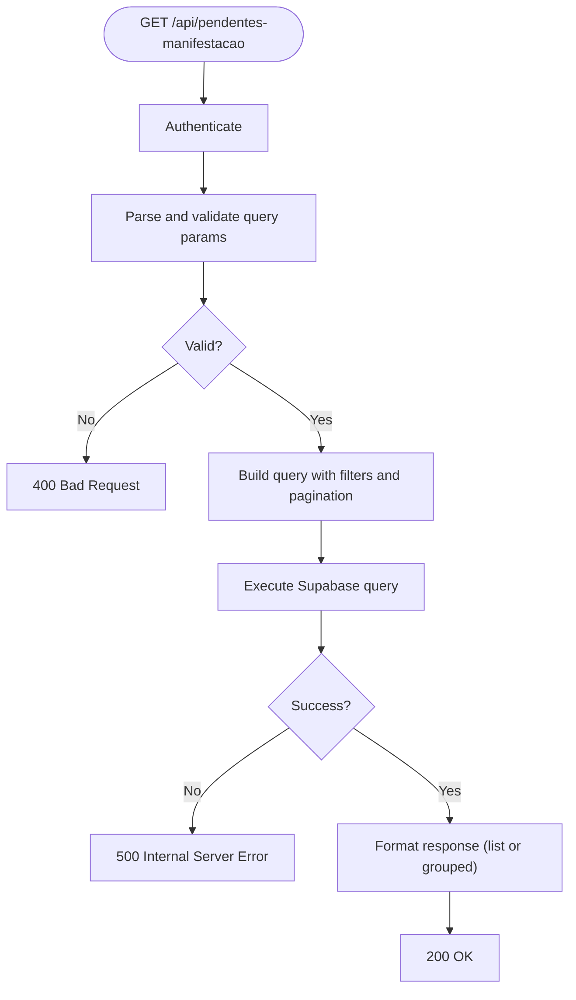
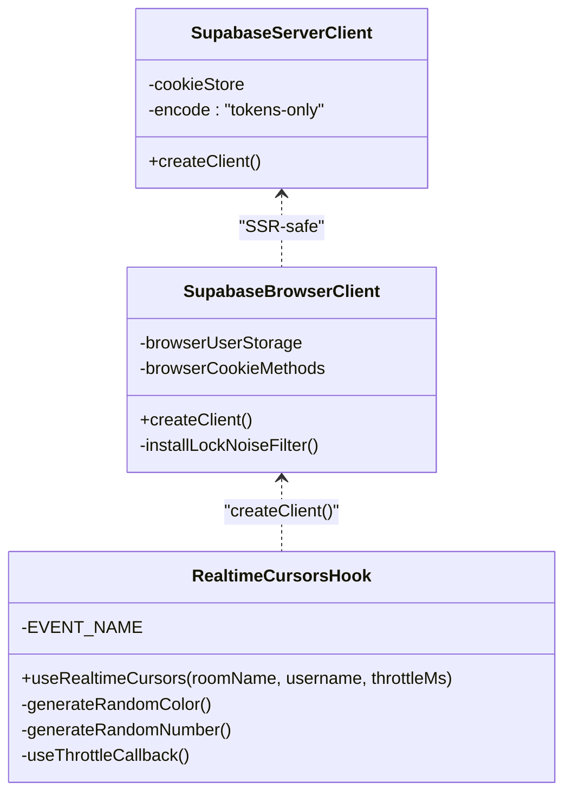
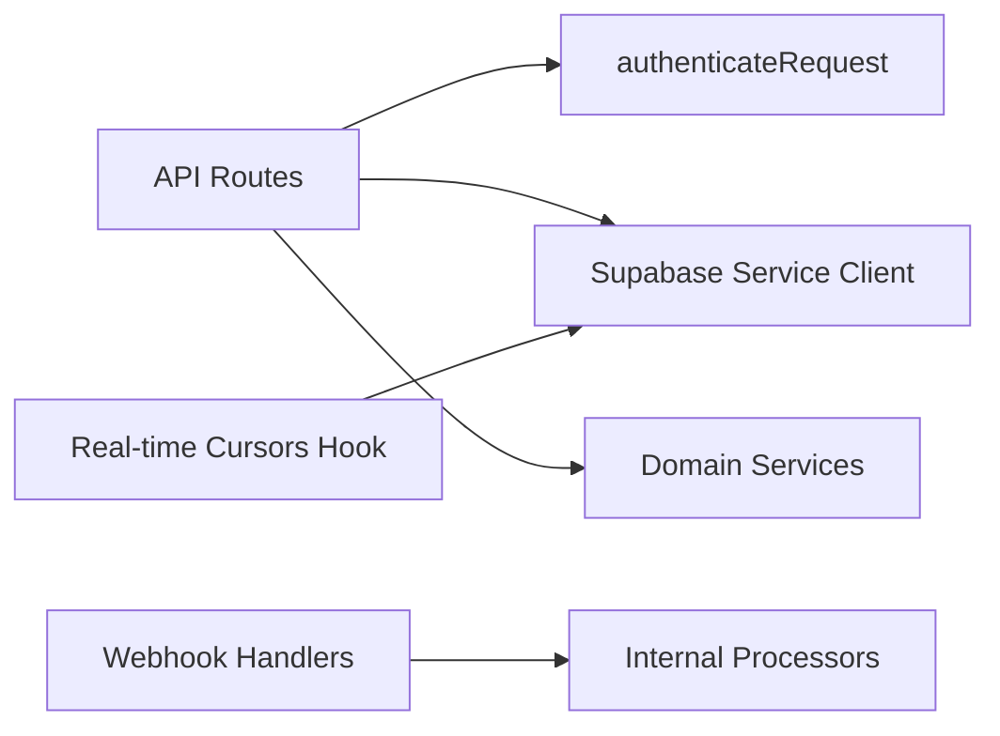

# API Reference

<cite>
**Referenced Files in This Document**
- [src/app/api/health/route.ts](file://src/app/api/health/route.ts)
- [src/app/api/auth/me/route.ts](file://src/app/api/auth/me/route.ts)
- [src/app/api/pastas/route.ts](file://src/app/api/pastas/route.ts)
- [src/app/api/pendentes-manifestacao/route.ts](file://src/app/api/pendentes-manifestacao/route.ts)
- [src/app/api/assinatura-digital/forms/verificar-cpf/route.ts](file://src/app/api/assinatura-digital/forms/verificar-cpf/route.ts)
- [src/app/api/webhooks/chatwoot/route.ts](file://src/app/api/webhooks/chatwoot/route.ts)
- [src/lib/supabase/client.ts](file://src/lib/supabase/client.ts)
- [src/lib/supabase/server.ts](file://src/lib/supabase/server.ts)
- [src/hooks/use-realtime-cursors.ts](file://src/hooks/use-realtime-cursors.ts)
- [supabase/README.md](file://supabase/README.md)
</cite>

## Table of Contents
1. [Introduction](#introduction)
2. [Project Structure](#project-structure)
3. [Core Components](#core-components)
4. [Architecture Overview](#architecture-overview)
5. [Detailed Component Analysis](#detailed-component-analysis)
6. [Dependency Analysis](#dependency-analysis)
7. [Performance Considerations](#performance-considerations)
8. [Troubleshooting Guide](#troubleshooting-guide)
9. [Conclusion](#conclusion)
10. [Appendices](#appendices)

## Introduction
This document provides a comprehensive API reference for the ZattarOS platform, covering REST API endpoints, Next.js Server Actions, Supabase Auth and real-time capabilities, and webhook integrations. It focuses on public interfaces, authentication requirements, request/response schemas, and operational guidance. The documented endpoints are grouped into categories such as legal processes, contracts, documents, users, and AI services, with attention to rate limiting, error handling, and versioning considerations.

## Project Structure
ZattarOS exposes REST endpoints under the Next.js App Router at src/app/api. Authentication is enforced centrally, and Supabase is used for database access and real-time collaboration. Webhooks integrate external systems (e.g., Chatwoot). Server Actions are used in portal pages for form handling and data mutations.

```mermaid
graph TB
Client["Client Apps<br/>Browsers, Mobile, Integrations"] --> API["Next.js App Router API<br/>src/app/api/*"]
API --> Auth["Authentication Middleware<br/>authenticateRequest()"]
Auth --> Supabase["Supabase Client/Server<br/>src/lib/supabase/*"]
API --> Services["Domain Services<br/>Repository/Service Layer"]
API --> Webhooks["Webhook Handlers<br/>Chatwoot, Dyte, Dify"]
Realtime["Real-time Collaboration<br/>useRealtimeCursors"] --> Supabase
```

**Diagram sources**
- [src/app/api/auth/me/route.ts:1-87](file://src/app/api/auth/me/route.ts#L1-L87)
- [src/lib/supabase/client.ts:1-240](file://src/lib/supabase/client.ts#L1-L240)
- [src/lib/supabase/server.ts:1-38](file://src/lib/supabase/server.ts#L1-L38)
- [src/hooks/use-realtime-cursors.ts:1-177](file://src/hooks/use-realtime-cursors.ts#L1-L177)

**Section sources**
- [src/app/api/health/route.ts:1-45](file://src/app/api/health/route.ts#L1-L45)
- [src/app/api/auth/me/route.ts:1-87](file://src/app/api/auth/me/route.ts#L1-L87)
- [src/app/api/pastas/route.ts:1-124](file://src/app/api/pastas/route.ts#L1-L124)
- [src/app/api/pendentes-manifestacao/route.ts:1-456](file://src/app/api/pendentes-manifestacao/route.ts#L1-L456)
- [src/app/api/assinatura-digital/forms/verificar-cpf/route.ts:1-162](file://src/app/api/assinatura-digital/forms/verificar-cpf/route.ts#L1-L162)
- [src/app/api/webhooks/chatwoot/route.ts:1-74](file://src/app/api/webhooks/chatwoot/route.ts#L1-L74)
- [src/lib/supabase/client.ts:1-240](file://src/lib/supabase/client.ts#L1-L240)
- [src/lib/supabase/server.ts:1-38](file://src/lib/supabase/server.ts#L1-L38)
- [src/hooks/use-realtime-cursors.ts:1-177](file://src/hooks/use-realtime-cursors.ts#L1-L177)

## Core Components
- REST API routes under src/app/api define HTTP endpoints for resources and actions.
- Authentication middleware enforces access control and extracts user context.
- Supabase client/server adapters manage secure, SSR-safe authentication and data access.
- Real-time collaboration uses Supabase channels and presence.
- Webhooks receive events from external systems and trigger internal synchronization.

**Section sources**
- [src/app/api/auth/me/route.ts:1-87](file://src/app/api/auth/me/route.ts#L1-L87)
- [src/lib/supabase/client.ts:1-240](file://src/lib/supabase/client.ts#L1-L240)
- [src/lib/supabase/server.ts:1-38](file://src/lib/supabase/server.ts#L1-L38)
- [src/hooks/use-realtime-cursors.ts:1-177](file://src/hooks/use-realtime-cursors.ts#L1-L177)

## Architecture Overview
The API architecture integrates Next.js App Router endpoints with Supabase for authentication, authorization, and real-time collaboration. Authentication is centralized, and Supabase RLS ensures row-level security. Webhooks enable asynchronous integrations with third-party services.

```mermaid
sequenceDiagram
participant C as "Client"
participant A as "API Route"
participant M as "Auth Middleware"
participant S as "Supabase Service Client"
C->>A : "HTTP Request"
A->>M : "authenticateRequest()"
M-->>A : "AuthResult { authenticated, usuarioId }"
A->>S : "Database operations (RLS)"
S-->>A : "Result"
A-->>C : "JSON Response"
```

**Diagram sources**
- [src/app/api/auth/me/route.ts:19-86](file://src/app/api/auth/me/route.ts#L19-L86)
- [src/lib/supabase/server.ts:4-36](file://src/lib/supabase/server.ts#L4-L36)

## Detailed Component Analysis

### Health Check
- Method: GET
- URL: /api/health
- Description: Returns application status, timestamp, and version.
- Authentication: Not required
- Response: JSON with status, timestamp, and version
- Notes: Suitable for load balancers and monitoring

**Section sources**
- [src/app/api/health/route.ts:1-45](file://src/app/api/health/route.ts#L1-L45)

### Authenticated User Profile
- Method: GET
- URL: /api/auth/me
- Description: Returns profile and permissions in a single call.
- Authentication: Bearer token or session required
- Response: JSON with user data and permission list
- Headers: Cache-Control: private, no-store
- Notes: Replaces separate /api/perfil, /api/permissoes/minhas, and /api/me

```mermaid
sequenceDiagram
participant C as "Client"
participant R as "GET /api/auth/me"
participant A as "authenticateRequest"
participant SC as "Supabase Service Client"
participant U as "Usuarios Table"
participant P as "Permissions Resolver"
C->>R : "GET /api/auth/me"
R->>A : "Authenticate"
A-->>R : "Authenticated + usuarioId"
R->>SC : "Select usuarios by id"
SC-->>R : "User record"
R->>P : "listarPermissoesUsuario(usuarioId)"
P-->>R : "Permissions array"
R-->>C : "200 OK { data : { id, authUserId, ... , permissoes } }"
```

**Diagram sources**
- [src/app/api/auth/me/route.ts:19-86](file://src/app/api/auth/me/route.ts#L19-L86)

**Section sources**
- [src/app/api/auth/me/route.ts:1-87](file://src/app/api/auth/me/route.ts#L1-L87)

### Folders Management
- Methods: GET, POST
- URL: /api/pastas
- Description: Lists folders with counters or hierarchy; creates new folders.
- Authentication: Required
- Query parameters (GET):
  - modo: "lista" or "hierarquia"
  - pasta_pai_id: numeric or "null"
  - incluir_documentos: boolean
- Body parameters (POST):
  - nome: string (required, max 200 chars)
  - tipo: "comum" or "privada" (required)
- Validation:
  - Name length and type checks
- Responses:
  - 200 OK with data
  - 201 Created on successful creation
  - 400 Bad Request on validation errors
  - 401 Unauthorized when not authenticated
  - 500 Internal Server Error on failures

**Section sources**
- [src/app/api/pastas/route.ts:1-124](file://src/app/api/pastas/route.ts#L1-L124)

### Pending Manifestation Processes
- Method: GET
- URL: /api/pendentes-manifestacao
- Description: Paginated list of pending processes with advanced filters, sorting, grouping, and counts.
- Authentication: Required (supports bearerAuth, sessionAuth, serviceApiKey)
- Query parameters:
  - Pagination: pagina (default 1), limite (default 50, max 100)
  - Basic filters: trt, grau, responsavel_id, sem_responsavel
  - Text search: busca
  - Field-specific filters: numero_processo, nome_parte_autora, nome_parte_re, descricao_orgao_julgador, sigla_orgao_julgador, classe_judicial, codigo_status_processo, segredo_justica, juizo_digital, processo_id
  - Date ranges: data_prazo_legal_inicio/fim, data_ciencia_inicio/fim, data_criacao_expediente_inicio/fim, data_autuacao_inicio/fim, data_arquivamento_inicio/fim
  - Sorting: ordenar_por (default varies by field), ordem ("asc" or "desc")
  - Grouping: agrupar_por (field), incluir_contagem (boolean)
- Responses:
  - 200 OK with either:
    - Standard pagination: pendentes[] + paginacao
    - Grouped aggregation: agrupamentos[] + total
  - 400 Bad Request on invalid parameters
  - 401 Unauthorized when not authenticated
  - 500 Internal Server Error on failures

```mermaid
flowchart TD
Start(["GET /api/pendentes-manifestacao"]) --> Auth["Authenticate"]
Auth --> Params["Parse and validate query params"]
Params --> Valid{"Valid?"}
Valid --> |No| Err400["400 Bad Request"]
Valid --> |Yes| Build["Build query with filters and pagination"]
Build --> Exec["Execute Supabase query"]
Exec --> Result{"Success?"}
Result --> |No| Err500["500 Internal Server Error"]
Result --> |Yes| Format["Format response (list or grouped)"]
Format --> Ok200["200 OK"]
```

**Diagram sources**
- [src/app/api/pendentes-manifestacao/route.ts:342-456](file://src/app/api/pendentes-manifestacao/route.ts#L342-L456)

**Section sources**
- [src/app/api/pendentes-manifestacao/route.ts:1-456](file://src/app/api/pendentes-manifestacao/route.ts#L1-L456)

### Digital Signature Form: CPF Verification
- Method: POST
- URL: /api/assinatura-digital/forms/verificar-cpf
- Description: Verifies a CPF and returns client data plus pending contracts requiring signature.
- Authentication: Required
- Rate Limiting: Applied via applyRateLimit("verificarCpf")
- Request body:
  - cpf: 11-digit string
- Response:
  - exists: boolean
  - cliente: structured client data (id, name, contact info, address)
  - contratos_pendentes: filtered list of contracts needing signatures
- Validation:
  - Zod schema enforces CPF length
- Error handling:
  - 400 Bad Request for invalid CPF
  - 500 Internal Server Error for server failures
- Notes: Fetches related address and pending contracts; excludes contracts already fully signed

**Section sources**
- [src/app/api/assinatura-digital/forms/verificar-cpf/route.ts:1-162](file://src/app/api/assinatura-digital/forms/verificar-cpf/route.ts#L1-L162)

### Webhooks: Chatwoot Events
- Method: POST
- URL: /api/webhooks/chatwoot
- Description: Receives Chatwoot webhook events and processes synchronization.
- Authentication: Not required
- Request body:
  - event: string (required)
  - Additional event payload fields
- Validation:
  - Requires "event" field
- Behavior:
  - On invalid payload: 400 Bad Request
  - On processing failure: returns 200 with processed=false and error message
  - On success: 200 OK with processed=true
  - Uncaught exceptions: logged and responded as processed=false with error
- Health check:
  - GET /api/webhooks/chatwoot returns service status

**Section sources**
- [src/app/api/webhooks/chatwoot/route.ts:1-74](file://src/app/api/webhooks/chatwoot/route.ts#L1-L74)

### Supabase Auth and Real-time Interfaces
- Browser client adapter:
  - Creates a cached browser client with tokens-only cookies and localStorage fallback
  - Filters benign auth lock warnings to reduce noise
- Server client adapter:
  - Encodes tokens-only in cookies; user object stored server-side
- Real-time cursors:
  - Uses Supabase channels with presence tracking
  - Broadcasts cursor movements with throttling
  - Maintains remote cursors and removes them on leave

```mermaid
classDiagram
class SupabaseBrowserClient {
+createClient()
-browserUserStorage
-browserCookieMethods
-installLockNoiseFilter()
}
class SupabaseServerClient {
+createClient()
-cookieStore
-encode : "tokens-only"
}
class RealtimeCursorsHook {
+useRealtimeCursors(roomName, username, throttleMs)
-generateRandomColor()
-generateRandomNumber()
-EVENT_NAME
-useThrottleCallback()
}
SupabaseBrowserClient <.. RealtimeCursorsHook : "createClient()"
SupabaseServerClient <.. SupabaseBrowserClient : "SSR-safe"
```

**Diagram sources**
- [src/lib/supabase/client.ts:1-240](file://src/lib/supabase/client.ts#L1-L240)
- [src/lib/supabase/server.ts:1-38](file://src/lib/supabase/server.ts#L1-L38)
- [src/hooks/use-realtime-cursors.ts:1-177](file://src/hooks/use-realtime-cursors.ts#L1-L177)

**Section sources**
- [src/lib/supabase/client.ts:1-240](file://src/lib/supabase/client.ts#L1-L240)
- [src/lib/supabase/server.ts:1-38](file://src/lib/supabase/server.ts#L1-L38)
- [src/hooks/use-realtime-cursors.ts:1-177](file://src/hooks/use-realtime-cursors.ts#L1-L177)

## Dependency Analysis
- API routes depend on:
  - authenticateRequest for authorization
  - Supabase service client for database operations
  - Domain services for business logic
- Real-time features depend on Supabase channels and presence
- Webhooks depend on event payload validation and internal processors

```mermaid
graph LR
Routes["API Routes"] --> Auth["authenticateRequest"]
Routes --> Supabase["Supabase Service Client"]
Routes --> Services["Domain Services"]
Realtime["Real-time Cursors Hook"] --> Supabase
Webhooks["Webhook Handlers"] --> Processors["Internal Processors"]
```

**Diagram sources**
- [src/app/api/auth/me/route.ts:12-17](file://src/app/api/auth/me/route.ts#L12-L17)
- [src/lib/supabase/server.ts:4-36](file://src/lib/supabase/server.ts#L4-L36)
- [src/hooks/use-realtime-cursors.ts:1-177](file://src/hooks/use-realtime-cursors.ts#L1-L177)
- [src/app/api/webhooks/chatwoot/route.ts](file://src/app/api/webhooks/chatwoot/route.ts#L9)

**Section sources**
- [src/app/api/auth/me/route.ts:1-87](file://src/app/api/auth/me/route.ts#L1-L87)
- [src/lib/supabase/server.ts:1-38](file://src/lib/supabase/server.ts#L1-L38)
- [src/hooks/use-realtime-cursors.ts:1-177](file://src/hooks/use-realtime-cursors.ts#L1-L177)
- [src/app/api/webhooks/chatwoot/route.ts:1-74](file://src/app/api/webhooks/chatwoot/route.ts#L1-L74)

## Performance Considerations
- Use pagination and appropriate limits to control payload sizes.
- Prefer grouped/aggregated responses when applicable to reduce data transfer.
- Apply rate limiting for high-frequency endpoints (e.g., CPF verification).
- Leverage Supabase RLS and indexes to minimize query overhead.
- Throttle real-time broadcasts to limit network traffic.

## Troubleshooting Guide
- Authentication failures:
  - Ensure bearer token or session is present and valid.
  - Check Supabase cookie encoding and user storage configuration.
- Real-time cursor issues:
  - Verify channel subscription state and presence tracking.
  - Confirm throttle settings and event propagation.
- Webhook delivery:
  - Validate payload structure and required fields.
  - Inspect logs for processing errors; webhook returns 200 even on errors to prevent retries.

**Section sources**
- [src/app/api/assinatura-digital/forms/verificar-cpf/route.ts:50-52](file://src/app/api/assinatura-digital/forms/verificar-cpf/route.ts#L50-L52)
- [src/hooks/use-realtime-cursors.ts:107-163](file://src/hooks/use-realtime-cursors.ts#L107-L163)
- [src/app/api/webhooks/chatwoot/route.ts:11-60](file://src/app/api/webhooks/chatwoot/route.ts#L11-L60)

## Conclusion
ZattarOS provides a robust set of REST API endpoints, integrated authentication, and real-time collaboration powered by Supabase. The documented endpoints cover key functional areas including legal processes, contracts, documents, users, and AI services. Adhering to the documented authentication, validation, and rate limiting practices ensures reliable operation and maintainable integrations.

## Appendices

### Authentication Requirements
- Many endpoints require:
  - Authorization header with Bearer token
  - Active session
  - Service API key for internal integrations
- Examples:
  - /api/auth/me
  - /api/pastas
  - /api/pendentes-manifestacao

**Section sources**
- [src/app/api/auth/me/route.ts:21-28](file://src/app/api/auth/me/route.ts#L21-L28)
- [src/app/api/pastas/route.ts:23-26](file://src/app/api/pastas/route.ts#L23-L26)
- [src/app/api/pendentes-manifestacao/route.ts:31-34](file://src/app/api/pendentes-manifestacao/route.ts#L31-L34)

### Rate Limiting
- Implemented for high-risk endpoints (e.g., CPF verification).
- Enforced via applyRateLimit("verificarCpf").
- Clients should handle 429 responses gracefully and retry with exponential backoff.

**Section sources**
- [src/app/api/assinatura-digital/forms/verificar-cpf/route.ts:51-52](file://src/app/api/assinatura-digital/forms/verificar-cpf/route.ts#L51-L52)

### Supabase Schema Overview
- The database includes numerous tables, enums, views, functions, triggers, and RLS policies.
- Refer to the Supabase documentation for schema details and migration guidance.

**Section sources**
- [supabase/README.md:1-378](file://supabase/README.md#L1-L378)