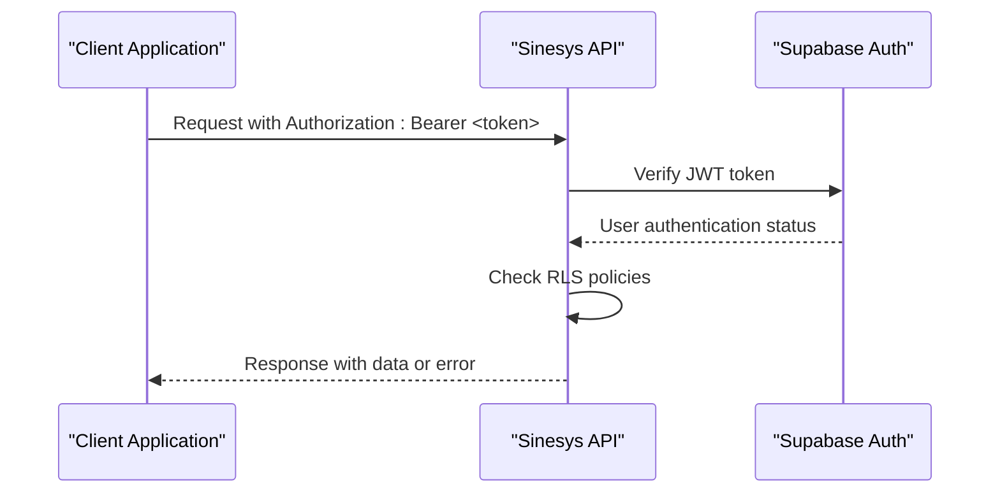

# API Reference

<cite>
**Referenced Files in This Document**   
- [acervo/route.ts](file://app/api/acervo/route.ts)
- [audiencias/route.ts](file://app/api/audiencias/route.ts)
- [clientes/route.ts](file://app/api/clientes/route.ts)
- [contratos/route.ts](file://app/api/contratos/route.ts)
- [usuarios/route.ts](file://app/api/usuarios/route.ts)
- [me/route.ts](file://app/api/me/route.ts)
- [perfil/route.ts](file://app/api/perfil/route.ts)
- [permissoes/minhas/route.ts](file://app/api/permissoes/minhas/route.ts)
- [permissoes/recursos/route.ts](file://app/api/permissoes/recursos/route.ts)
- [permissoes/usuarios/[id]/route.ts](file://app/api/permissoes/usuarios/[id]/route.ts)
- [api-auth.ts](file://backend/auth/api-auth.ts)
- [dashboard-api.ts](file://app/api/dashboard-api.ts)
- [openapi.json](file://app/api/docs/openapi.json/route.ts)
</cite>

## Table of Contents
1. [Introduction](#introduction)
2. [Authentication and Security](#authentication-and-security)
3. [API Endpoints](#api-endpoints)
   - [Acervo (Legal Processes)](#acervo-legal-processes)
   - [Audiências (Hearings)](#audiências-hearings)
   - [Clientes (Clients)](#clientes-clients)
   - [Contratos (Contracts)](#contratos-contracts)
   - [Usuários (Users)](#usuários-users)
   - [Permissões (Permissions)](#permissões-permissions)
4. [OpenAPI Specification](#openapi-specification)
5. [Rate Limiting and Performance](#rate-limiting-and-performance)
6. [Versioning Strategy](#versioning-strategy)
7. [Client Integration Examples](#client-integration-examples)
8. [Common Issues and Debugging](#common-issues-and-debugging)
9. [Conclusion](#conclusion)

## Introduction

The Sinesys RESTful API provides comprehensive access to the legal practice management system, enabling integration with external applications and custom client implementations. This documentation covers all public endpoints organized into major functional groups: acervo/ for legal processes, audiencias/ for hearings, clientes/ for clients, contratos/ for contracts, usuarios/ for users, and financeiro/ for financial operations.

The API follows REST principles with predictable resource-oriented URLs, proper HTTP verbs, and status codes. All responses are in JSON format with a consistent structure that includes a `success` boolean flag and `data` object containing the actual payload. Error responses include descriptive messages to facilitate debugging.

The API is built on Next.js with Supabase as the backend, leveraging Supabase Auth for authentication and Row Level Security (RLS) policies for data access control. The system supports multiple authentication methods including JWT tokens, session cookies, and service API keys for different use cases.

**Section sources**
- [acervo/route.ts](file://app/api/acervo/route.ts)
- [audiencias/route.ts](file://app/api/audiencias/route.ts)
- [clientes/route.ts](file://app/api/clientes/route.ts)
- [contratos/route.ts](file://app/api/contratos/route.ts)
- [usuarios/route.ts](file://app/api/usuarios/route.ts)

## Authentication and Security

The Sinesys API implements a robust dual authentication system that supports multiple authentication methods for different client types and use cases. The authentication is handled by the `api-auth.ts` module which provides a unified interface for verifying requests from various sources.

### Authentication Methods

The API supports three primary authentication methods:

1. **Bearer Token (JWT with Supabase Auth)**: Used by frontend applications and external clients. The token is passed in the `Authorization` header as `Bearer <token>`. This method leverages Supabase Auth for user authentication and session management.

2. **Session Cookies**: Used by server-side rendered Next.js applications. The authentication state is maintained through cookies managed by Supabase's SSR capabilities.

3. **Service API Key**: Used by internal services, background jobs, and system processes. This key is passed in the `x-service-api-key` header and provides elevated privileges for system operations.



**Diagram sources**
- [api-auth.ts](file://backend/auth/api-auth.ts)
- [middleware.ts](file://lib/middleware.ts)

### Row Level Security (RLS) Policies

The Sinesys API implements comprehensive Row Level Security policies at the database level to ensure data isolation and access control. These policies are defined in the Supabase database schema and enforced automatically for all database operations.

Key RLS policies include:
- Users can only access records associated with their organization
- Users can only modify records they own or have explicit permissions for
- Super administrators have unrestricted access to all data
- Sensitive operations require additional permission checks beyond basic ownership

The RLS policies work in conjunction with the application-level permission system to provide defense in depth. Even if an attacker bypasses application logic, the database-level policies prevent unauthorized data access.

### Permission System

The permission system is role-based with support for custom roles and granular permissions. Permissions are defined as resource-operation pairs (e.g., "clientes:criar", "processos:visualizar") and assigned to users through roles or direct assignment.

Super administrators (users with `is_super_admin = true`) automatically have all permissions granted. Regular users must have explicit permissions assigned either directly or through their roles.

**Section sources**
- [api-auth.ts](file://backend/auth/api-auth.ts)
- [middleware.ts](file://lib/middleware.ts)
- [require-permission.ts](file://backend/auth/require-permission.ts)

## API Endpoints

### Acervo (Legal Processes)

The acervo endpoints provide access to legal processes and cases managed by the system. These endpoints support comprehensive filtering, pagination, and grouping operations.

#### GET /api/acervo

Retrieves a paginated list of legal processes with advanced filtering and grouping capabilities.

**Parameters**
- `pagina` (integer): Page number (default: 1)
- `limite` (integer): Items per page (default: 50, max: 2000)
- `unified` (boolean): Whether to unify multi-instance processes (default: true)
- `origem` (string): Filter by process origin (acervo_geral, arquivado)
- `trt` (string): Filter by TRT code (e.g., TRT3, TRT1)
- `grau` (string): Filter by process degree (primeiro_grau, segundo_grau)
- `responsavel_id` (string): Filter by responsible user ID
- `busca` (string): Text search across multiple fields
- `numero_processo` (string): Filter by process number (partial match)
- `nome_parte_autora` (string): Filter by plaintiff name (partial match)
- `agrupar_por` (string): Field to group results by
- `incluir_contagem` (boolean): Whether to include counts in grouped results

**Response Schema**
```json
{
  "success": true,
  "data": {
    "processos": [
      {
        "id": 1,
        "numero_processo": "0010014-94.2025.5.03.0022",
        "nome_parte_autora": "João Silva",
        "nome_parte_re": "Empresa XYZ",
        "data_autuacao": "2025-01-10T13:03:15.862Z",
        "trt": "TRT3",
        "grau": "primeiro_grau",
        "responsavel_id": 123,
        "classe_judicial": "ATOrd",
        "codigo_status_processo": "DISTRIBUIDO",
        "segredo_justica": false,
        "juizo_digital": true
      }
    ],
    "paginacao": {
      "pagina": 1,
      "limite": 50,
      "total": 100,
      "totalPaginas": 2
    }
  }
}
```

**Error Codes**
- 400: Invalid parameters (e.g., pagina < 1, limite > 2000)
- 401: Unauthorized (invalid or missing authentication)
- 500: Internal server error

**Section sources**
- [acervo/route.ts](file://app/api/acervo/route.ts)

### Audiências (Hearings)

The audiencias endpoints manage court hearings and related scheduling information.

#### GET /api/audiencias

Retrieves a paginated list of hearings with filtering and sorting options.

**Parameters**
- `pagina` (integer): Page number (default: 1)
- `limite` (integer): Items per page (default: 50, max: 1000)
- `trt` (string): Filter by TRT code
- `grau` (string): Filter by process degree
- `responsavel_id` (string): Filter by responsible user ID
- `busca` (string): Text search across multiple fields
- `numero_processo` (string): Filter by process number
- `status` (string): Filter by status (M=Marked, R=Realized, C=Cancelled)
- `modalidade` (string): Filter by modality (virtual, presencial, hibrida)
- `data_inicio_inicio` (string): Start date range (ISO date)
- `data_inicio_fim` (string): End date range (ISO date)

**Response Schema**
```json
{
  "success": true,
  "data": {
    "audiencias": [
      {
        "id": 1,
        "processo_id": 1,
        "numero_processo": "0010014-94.2025.5.03.0022",
        "polo_ativo_nome": "João Silva",
        "polo_passivo_nome": "Empresa XYZ",
        "data_inicio": "2025-01-15T09:00:00.000Z",
        "data_fim": "2025-01-15T10:00:00.000Z",
        "status": "M",
        "modalidade": "virtual",
        "tipo_descricao": "Instrução",
        "url_audiencia_virtual": "https://meet.google.com/abc-defg-hij",
        "responsavel_id": 123
      }
    ],
    "paginacao": {
      "pagina": 1,
      "limite": 50,
      "total": 75,
      "totalPaginas": 2
    }
  }
}
```

#### POST /api/audiencias

Creates a new hearing manually in the system.

**Request Body**
```json
{
  "processo_id": 1,
  "advogado_id": 456,
  "data_inicio": "2025-01-15T09:00:00.000Z",
  "data_fim": "2025-01-15T10:00:00.000Z",
  "tipo_descricao": "Instrução",
  "tipo_is_virtual": true,
  "sala_audiencia_nome": "Sala Virtual 1",
  "url_audiencia_virtual": "https://meet.google.com/abc-defg-hij",
  "observacoes": "Reunião de conciliação",
  "responsavel_id": 123
}
```

**Response Schema (201 Created)**
```json
{
  "success": true,
  "data": {
    "id": 789
  }
}
```

**Error Codes**
- 400: Invalid data (missing required fields, invalid dates)
- 401: Unauthorized
- 500: Internal server error

**Section sources**
- [audiencias/route.ts](file://app/api/audiencias/route.ts)

### Clientes (Clients)

The clientes endpoints manage client information and related data.

#### GET /api/clientes

Retrieves a paginated list of clients with filtering options.

**Parameters**
- `pagina` (integer): Page number (default: 1)
- `limite` (integer): Items per page (default: 50)
- `busca` (string): Search by name, CPF, CNPJ, or email
- `tipoPessoa` (string): Filter by person type (pf, pj)
- `ativo` (boolean): Filter by active/inactive status
- `incluir_endereco` (boolean): Whether to include address data

#### POST /api/clientes

Creates a new client in the system.

**Request Body**
```json
{
  "tipoPessoa": "pf",
  "nome": "João Silva",
  "nomeFantasia": "João",
  "cpf": "123.456.789-00",
  "rg": "12.345.678-9",
  "dataNascimento": "1980-01-01",
  "genero": "masculino",
  "estadoCivil": "casado",
  "email": "joao@email.com",
  "telefonePrimario": "(11) 91234-5678",
  "endereco": {
    "logradouro": "Rua das Flores",
    "numero": "123",
    "bairro": "Centro",
    "cidade": "São Paulo",
    "estado": "SP",
    "cep": "01000-000"
  },
  "observacoes": "Cliente preferencial"
}
```

**Response Schema (201 Created)**
```json
{
  "success": true,
  "data": {
    "id": 1,
    "tipo_pessoa": "pf",
    "nome": "João Silva",
    "nome_fantasia": "João",
    "cpf": "123.456.789-00",
    "rg": "12.345.678-9",
    "data_nascimento": "1980-01-01",
    "genero": "masculino",
    "estado_civil": "casado",
    "email": "joao@email.com",
    "telefone_primario": "(11) 91234-5678",
    "endereco_id": 1,
    "observacoes": "Cliente preferencial",
    "created_at": "2025-01-10T13:03:15.862Z",
    "updated_at": "2025-01-10T13:03:15.862Z"
  }
}
```

**Error Codes**
- 400: Missing required fields
- 401: Unauthorized
- 500: Internal server error

**Section sources**
- [clientes/route.ts](file://app/api/clientes/route.ts)

### Contratos (Contracts)

The contratos endpoints manage legal contracts and agreements.

#### GET /api/contratos

Retrieves a paginated list of contracts with filtering options.

**Parameters**
- `pagina` (integer): Page number (default: 1)
- `limite` (integer): Items per page (default: 50)
- `busca` (string): Search by observations
- `areaDireito` (string): Filter by legal area
- `tipoContrato` (string): Filter by contract type
- `status` (string): Filter by contract status
- `clienteId` (integer): Filter by client ID
- `responsavelId` (integer): Filter by responsible user ID

#### POST /api/contratos

Creates a new contract in the system.

**Request Body**
```json
{
  "areaDireito": "trabalhista",
  "tipoContrato": "ajuizamento",
  "tipoCobranca": "hora",
  "clienteId": 1,
  "poloCliente": "ativo",
  "valorContrato": 5000.00,
  "valorHora": 300.00,
  "observacoes": "Contrato de ajuizamento trabalhista"
}
```

**Response Schema (201 Created)**
```json
{
  "success": true,
  "data": {
    "id": 1,
    "area_direito": "trabalhista",
    "tipo_contrato": "ajuizamento",
    "tipo_cobranca": "hora",
    "cliente_id": 1,
    "polo_cliente": "ativo",
    "valor_contrato": 5000.00,
    "valor_hora": 300.00,
    "observacoes": "Contrato de ajuizamento trabalhista",
    "status": "em_contratacao",
    "created_at": "2025-01-10T13:03:15.862Z",
    "updated_at": "2025-01-10T13:03:15.862Z"
  }
}
```

**Error Codes**
- 400: Missing required fields
- 401: Unauthorized
- 500: Internal server error

**Section sources**
- [contratos/route.ts](file://app/api/contratos/route.ts)

### Usuários (Users)

The usuarios endpoints manage user accounts and profiles.

#### GET /api/usuarios

Retrieves a paginated list of users with filtering options.

**Parameters**
- `pagina` (integer): Page number (default: 1)
- `limite` (integer): Items per page (default: 50)
- `busca` (string): Search by name, CPF, or email
- `ativo` (boolean): Filter by active/inactive status
- `oab` (string): Filter by OAB number
- `ufOab` (string): Filter by OAB state

#### POST /api/usuarios

Creates a new user in the system.

**Request Body**
```json
{
  "nomeCompleto": "João Silva",
  "nomeExibicao": "João",
  "cpf": "123.456.789-00",
  "rg": "12.345.678-9",
  "dataNascimento": "1980-01-01",
  "genero": "masculino",
  "oab": "123456",
  "ufOab": "SP",
  "emailCorporativo": "joao@escritorio.com",
  "emailPessoal": "joao@email.com",
  "telefone": "(11) 91234-5678",
  "endereco": {
    "logradouro": "Rua das Flores",
    "numero": "123",
    "bairro": "Centro",
    "cidade": "São Paulo",
    "estado": "SP",
    "cep": "01000-000"
  },
  "senha": "password123",
  "ativo": true
}
```

**Response Schema (201 Created)**
```json
{
  "success": true,
  "data": {
    "id": 1,
    "nome_completo": "João Silva",
    "nome_exibicao": "João",
    "cpf": "123.456.789-00",
    "rg": "12.345.678-9",
    "data_nascimento": "1980-01-01",
    "genero": "masculino",
    "oab": "123456",
    "uf_oab": "SP",
    "email_corporativo": "joao@escritorio.com",
    "email_pessoal": "joao@email.com",
    "telefone": "(11) 91234-5678",
    "endereco_id": 1,
    "ativo": true,
    "created_at": "2025-01-10T13:03:15.862Z",
    "updated_at": "2025-01-10T13:03:15.862Z"
  }
}
```

#### GET /api/me

Retrieves basic information about the authenticated user.

**Response Schema**
```json
{
  "id": 1,
  "isSuperAdmin": true
}
```

#### GET /api/perfil

Retrieves complete profile information for the authenticated user.

**Response Schema**
```json
{
  "success": true,
  "data": {
    "id": 1,
    "nome_completo": "João Silva",
    "nome_exibicao": "João",
    "cpf": "123.456.789-00",
    "rg": "12.345.678-9",
    "data_nascimento": "1980-01-01",
    "genero": "masculino",
    "oab": "123456",
    "uf_oab": "SP",
    "email_corporativo": "joao@escritorio.com",
    "email_pessoal": "joao@email.com",
    "telefone": "(11) 91234-5678",
    "endereco_id": 1,
    "ativo": true,
    "created_at": "2025-01-10T13:03:15.862Z",
    "updated_at": "2025-01-10T13:03:15.862Z"
  }
}
```

**Section sources**
- [usuarios/route.ts](file://app/api/usuarios/route.ts)
- [me/route.ts](file://app/api/me/route.ts)
- [perfil/route.ts](file://app/api/perfil/route.ts)

### Permissões (Permissions)

The permissions endpoints manage user permissions and access control.

#### GET /api/permissoes/minhas

Retrieves permissions for the authenticated user.

**Parameters**
- `recurso` (string): Filter by specific resource

**Response Schema**
```json
{
  "success": true,
  "data": {
    "usuarioId": 1,
    "isSuperAdmin": false,
    "permissoes": [
      {
        "recurso": "clientes",
        "operacao": "visualizar",
        "permitido": true
      },
      {
        "recurso": "clientes",
        "operacao": "criar",
        "permitido": true
      }
    ]
  }
}
```

#### GET /api/permissoes/recursos

Retrieves the complete matrix of available permissions.

**Response Schema**
```json
{
  "success": true,
  "data": {
    "matriz": [
      {
        "recurso": "clientes",
        "operacoes": ["visualizar", "criar", "editar", "excluir"]
      }
    ],
    "totalRecursos": 15,
    "totalPermissoes": 45
  }
}
```

#### GET /api/permissoes/usuarios/{id}

Retrieves all permissions assigned to a specific user.

**Response Schema**
```json
{
  "success": true,
  "data": {
    "usuario_id": 1,
    "is_super_admin": false,
    "permissoes": [
      {
        "recurso": "clientes",
        "operacao": "visualizar",
        "permitido": true
      }
    ]
  }
}
```

#### POST /api/permissoes/usuarios/{id}

Assigns multiple permissions to a user in batch.

**Request Body**
```json
{
  "permissoes": [
    {
      "recurso": "clientes",
      "operacao": "visualizar",
      "permitido": true
    }
  ]
}
```

#### PUT /api/permissoes/usuarios/{id}

Replaces all existing permissions for a user with new ones.

**Request Body**
```json
{
  "permissoes": [
    {
      "recurso": "clientes",
      "operacao": "visualizar",
      "permitido": true
    }
  ]
}
```

**Section sources**
- [permissoes/minhas/route.ts](file://app/api/permissoes/minhas/route.ts)
- [permissoes/recursos/route.ts](file://app/api/permissoes/recursos/route.ts)
- [permissoes/usuarios/[id]/route.ts](file://app/api/permissoes/usuarios/[id]/route.ts)

## OpenAPI Specification

The Sinesys API provides a comprehensive OpenAPI/Swagger specification available at `/api/docs/openapi.json`. This specification is automatically generated and kept up-to-date with the actual API implementation.

The OpenAPI specification includes:
- Complete endpoint definitions with HTTP methods, URL patterns, and parameters
- Detailed request and response schemas with examples
- Authentication requirements and security schemes
- Error codes and descriptions
- Data models and type definitions

The specification can be used for:
- Generating client libraries in various programming languages
- Creating API documentation
- Testing API endpoints with tools like Swagger UI
- Validating API requests and responses
- Integrating with API management platforms

To access the OpenAPI specification, make a GET request to `/api/docs/openapi.json`. The response is a JSON document that conforms to the OpenAPI 3.0 specification.

**Section sources**
- [openapi.json](file://app/api/docs/openapi.json/route.ts)
- [swagger.config.ts](file://swagger.config.ts)

## Rate Limiting and Performance

The Sinesys API implements rate limiting to prevent abuse and ensure fair usage of system resources. The rate limiting strategy is designed to balance accessibility with system stability.

### Rate Limiting Rules

- **General endpoints**: 100 requests per minute per user
- **Search endpoints**: 60 requests per minute per user
- **Write operations**: 30 requests per minute per user
- **Administrative endpoints**: 20 requests per minute per user

When a client exceeds the rate limit, the API returns a 429 Too Many Requests status code with a `Retry-After` header indicating when the client can make requests again.

### Performance Considerations

The API is optimized for performance with several key features:

1. **Caching**: Frequently accessed data is cached to reduce database load and improve response times.

2. **Pagination**: All list endpoints support pagination with reasonable default limits to prevent excessive data transfer.

3. **Filtering and Searching**: Endpoints support efficient filtering and searching to minimize the amount of data transferred.

4. **Database Indexing**: Critical database fields are indexed to ensure fast query performance.

5. **Connection Pooling**: Database connections are pooled to reduce connection overhead.

For optimal performance, clients should:
- Use pagination to retrieve large datasets in chunks
- Apply filters to reduce the amount of data returned
- Cache responses when appropriate
- Batch requests when possible
- Handle rate limiting gracefully with exponential backoff

**Section sources**
- [dashboard-api.ts](file://app/api/dashboard-api.ts)
- [middleware.ts](file://lib/middleware.ts)

## Versioning Strategy

The Sinesys API follows a pragmatic versioning strategy to ensure backward compatibility while allowing for evolution of the API.

### Versioning Approach

The API uses URL-based versioning with the pattern `/api/v{version}/{endpoint}`. Currently, the API is at version 1 (v1), so all endpoints are accessible under the `/api/` prefix (equivalent to `/api/v1/`).

Future versions will be introduced as needed, with the following principles:
- Backward incompatible changes require a new major version
- New features and endpoints can be added to the current version
- Deprecated endpoints will be maintained for at least 6 months before removal
- Version changes will be announced in advance

### Deprecation Policy

When an endpoint or feature is deprecated:
1. It will be marked as deprecated in the OpenAPI specification
2. A deprecation notice will be added to the documentation
3. The endpoint will continue to function for a minimum of 6 months
4. Clients will receive warning headers in responses

Clients are encouraged to monitor the API documentation and OpenAPI specification for deprecation notices and plan migrations accordingly.

**Section sources**
- [dashboard-api.ts](file://app/api/dashboard-api.ts)

## Client Integration Examples

This section provides practical examples of how to integrate with the Sinesys API from client applications.

### JavaScript/TypeScript Example

```javascript
// Configure API client
const API_BASE_URL = 'https://api.sinesys.com';
const AUTH_TOKEN = 'your-jwt-token';

// Function to make authenticated API requests
async function apiRequest(endpoint, options = {}) {
  const response = await fetch(`${API_BASE_URL}/api/${endpoint}`, {
    headers: {
      'Authorization': `Bearer ${AUTH_TOKEN}`,
      'Content-Type': 'application/json',
    },
    ...options
  });

  if (!response.ok) {
    throw new Error(`API error: ${response.status}`);
  }

  return response.json();
}

// Example: List clients
async function listClients() {
  try {
    const result = await apiRequest('clientes?pagina=1&limite=10');
    console.log('Clients:', result.data);
  } catch (error) {
    console.error('Error fetching clients:', error);
  }
}

// Example: Create a new client
async function createClient(clientData) {
  try {
    const result = await apiRequest('clientes', {
      method: 'POST',
      body: JSON.stringify(clientData)
    });
    console.log('Client created:', result.data);
    return result.data;
  } catch (error) {
    console.error('Error creating client:', error);
    throw error;
  }
}
```

### React Component Example

```jsx
import { useState, useEffect } from 'react';

function ClientList() {
  const [clients, setClients] = useState([]);
  const [loading, setLoading] = useState(true);
  const [error, setError] = useState(null);

  useEffect(() => {
    async function fetchClients() {
      try {
        const response = await fetch('/api/clientes?pagina=1&limite=50', {
          headers: {
            'Authorization': `Bearer ${localStorage.getItem('token')}`
          }
        });

        if (!response.ok) {
          throw new Error('Failed to fetch clients');
        }

        const data = await response.json();
        setClients(data.data);
      } catch (err) {
        setError(err.message);
      } finally {
        setLoading(false);
      }
    }

    fetchClients();
  }, []);

  if (loading) return <div>Loading...</div>;
  if (error) return <div>Error: {error}</div>;

  return (
    <div>
      <h2>Clients</h2>
      <ul>
        {clients.map(client => (
          <li key={client.id}>
            {client.nome} - {client.email}
          </li>
        ))}
      </ul>
    </div>
  );
}
```

### Error Handling Best Practices

```javascript
async function robustApiCall(endpoint, options = {}) {
  const MAX_RETRIES = 3;
  const BASE_DELAY = 1000; // 1 second

  for (let attempt = 1; attempt <= MAX_RETRIES; attempt++) {
    try {
      const response = await fetch(`${API_BASE_URL}/api/${endpoint}`, {
        headers: {
          'Authorization': `Bearer ${AUTH_TOKEN}`,
          'Content-Type': 'application/json',
        },
        ...options
      });

      // Handle different status codes
      if (response.status === 401) {
        // Unauthorized - likely token expired
        throw new Error('Authentication failed. Please log in again.');
      }

      if (response.status === 429) {
        // Rate limited - wait and retry
        const retryAfter = parseInt(response.headers.get('Retry-After') || '60');
        await new Promise(resolve => setTimeout(resolve, retryAfter * 1000));
        continue; // Retry the request
      }

      if (!response.ok) {
        const errorData = await response.json().catch(() => ({}));
        throw new Error(errorData.error || `HTTP ${response.status}`);
      }

      return await response.json();

    } catch (error) {
      if (attempt === MAX_RETRIES) {
        console.error(`API call failed after ${MAX_RETRIES} attempts:`, error);
        throw error;
      }

      // Exponential backoff
      const delay = BASE_DELAY * Math.pow(2, attempt - 1);
      console.log(`Attempt ${attempt} failed. Retrying in ${delay}ms...`);
      await new Promise(resolve => setTimeout(resolve, delay));
    }
  }
}
```

**Section sources**
- [dashboard-api.ts](file://app/api/dashboard-api.ts)

## Common Issues and Debugging

This section addresses common integration issues and provides debugging approaches.

### Authentication Issues

**Symptoms**: 401 Unauthorized responses
**Common causes**:
- Expired JWT token
- Missing Authorization header
- Invalid token format
- Revoked user session

**Debugging steps**:
1. Verify the token is present in the Authorization header
2. Check that the token hasn't expired (JWT expiration claim)
3. Validate the token signature using a JWT debugger
4. Test authentication with a fresh login
5. Check browser developer tools for cookie issues

### Permission Denied Errors

**Symptoms**: 403 Forbidden responses
**Common causes**:
- User lacks required permissions
- Role assignments not properly configured
- Super admin flag not set correctly

**Debugging steps**:
1. Check the user's permissions using `/api/permissoes/minhas`
2. Verify the required permission exists in the permission matrix
3. Confirm the user has the correct role assignments
4. Check if the user is a super admin (which grants all permissions)

### Rate Limiting Issues

**Symptoms**: 429 Too Many Requests responses
**Common causes**:
- Exceeding request limits
- Aggressive polling from client
- Multiple clients sharing the same user account

**Debugging steps**:
1. Check the Retry-After header for when to resume requests
2. Implement exponential backoff in client code
3. Batch multiple operations into fewer requests
4. Cache responses to reduce redundant requests
5. Monitor request patterns to identify sources of excessive calls

### Data Consistency Issues

**Symptoms**: Missing data, stale data, or data mismatches
**Common causes**:
- Caching issues
- Database replication lag
- Incomplete data synchronization

**Debugging steps**:
1. Clear client-side caches
2. Add cache-busting parameters to requests
3. Verify data in the database directly
4. Check synchronization jobs and their status
5. Monitor for errors in data import processes

### Debugging Tools

The API provides several tools to assist with debugging:

1. **Request IDs**: Each response includes a unique request ID for tracking
2. **Detailed error messages**: Errors include descriptive messages and codes
3. **Audit logs**: All API operations are logged for troubleshooting
4. **Health endpoint**: `/api/health` provides system status information

**Section sources**
- [api-auth.ts](file://backend/auth/api-auth.ts)
- [require-permission.ts](file://backend/auth/require-permission.ts)
- [dashboard-api.ts](file://app/api/dashboard-api.ts)

## Conclusion

The Sinesys RESTful API provides comprehensive access to the legal practice management system with a well-designed, secure, and scalable architecture. The API follows REST principles with consistent patterns across all endpoints, making it easy to learn and integrate with.

Key features of the API include:
- Robust authentication and authorization with JWT, sessions, and API keys
- Comprehensive Row Level Security policies for data protection
- Granular permission system with support for custom roles
- Well-documented endpoints with OpenAPI/Swagger specification
- Practical rate limiting to ensure system stability
- Forward-compatible versioning strategy

The API is designed to support a wide range of use cases, from simple data retrieval to complex workflow automation. With proper implementation of the patterns and best practices outlined in this documentation, clients can build reliable and efficient integrations with the Sinesys platform.

For the most up-to-date information, always refer to the OpenAPI specification at `/api/docs/openapi.json` and monitor the API documentation for updates and deprecation notices.