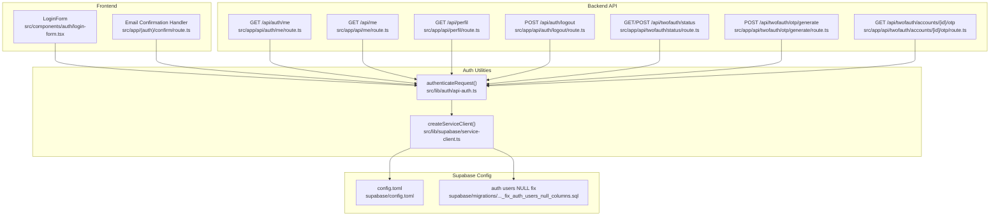
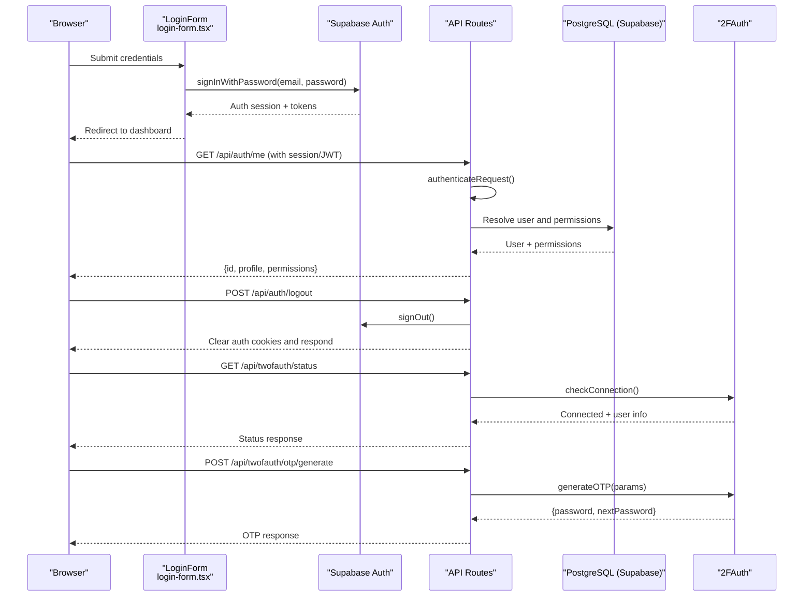
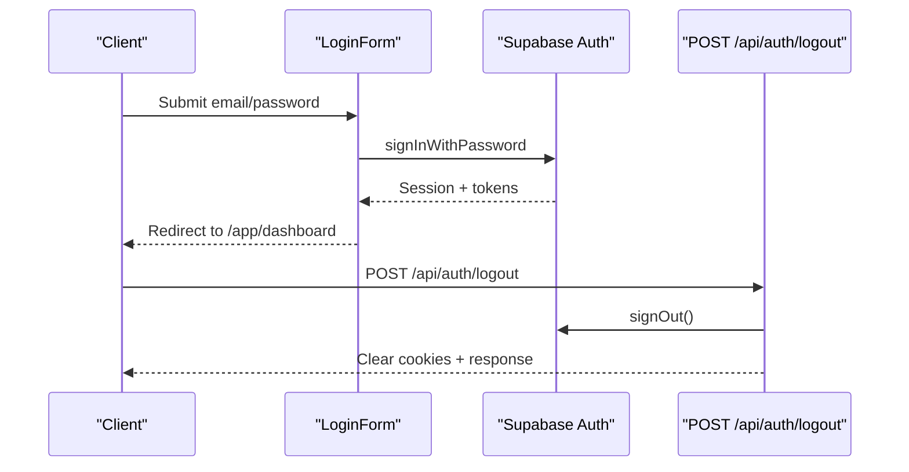
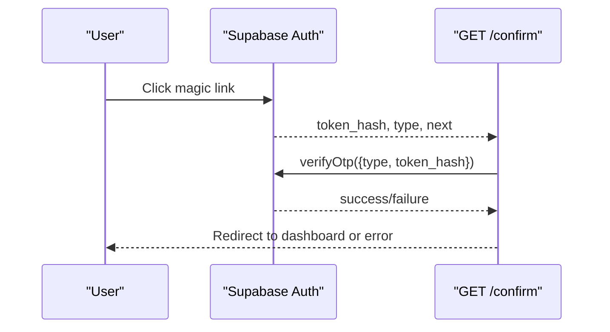
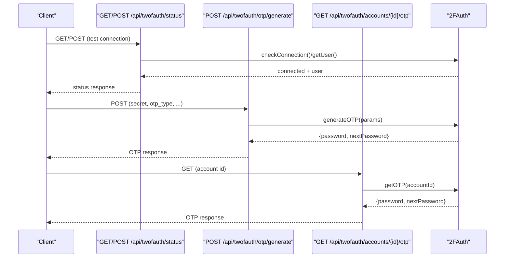
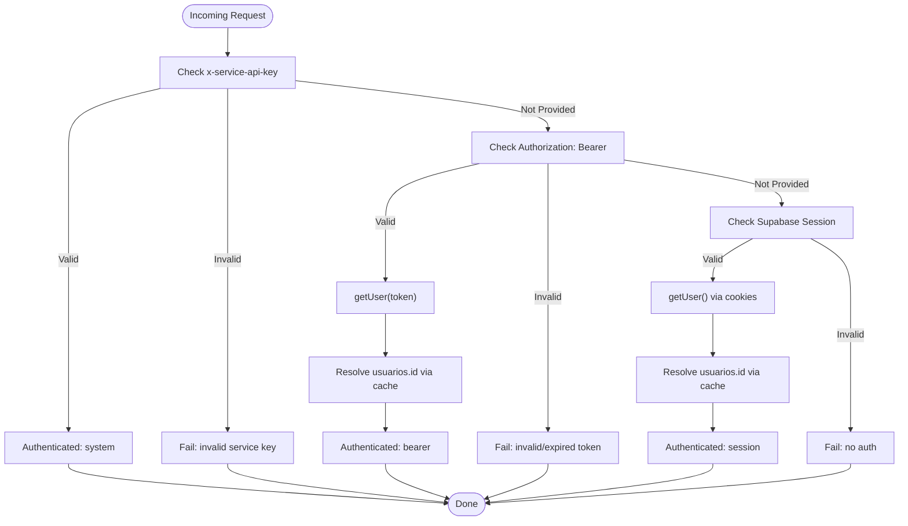
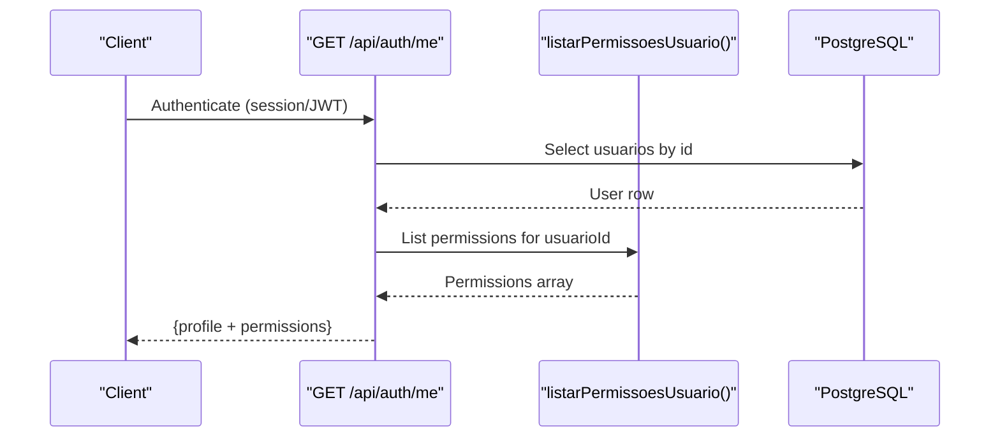
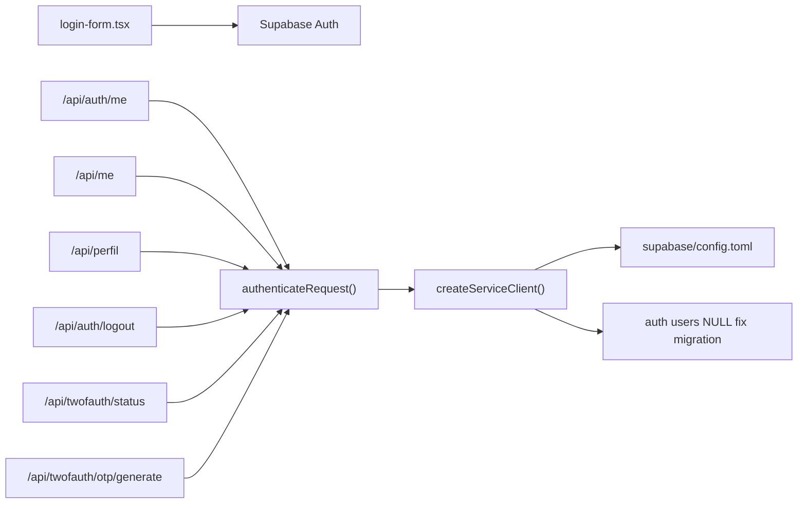

# Authentication API

<cite>
**Referenced Files in This Document**
- [src/app/api/auth/logout/route.ts](file://src/app/api/auth/logout/route.ts)
- [src/app/api/auth/me/route.ts](file://src/app/api/auth/me/route.ts)
- [src/app/api/me/route.ts](file://src/app/api/me/route.ts)
- [src/app/api/perfil/route.ts](file://src/app/api/perfil/route.ts)
- [src/lib/auth/api-auth.ts](file://src/lib/auth/api-auth.ts)
- [src/lib/supabase/service-client.ts](file://src/lib/supabase/service-client.ts)
- [src/components/auth/login-form.tsx](file://src/components/auth/login-form.tsx)
- [src/app/(auth)/confirm/route.ts](file://src/app/(auth)/confirm/route.ts)
- [src/app/api/twofauth/otp/generate/route.ts](file://src/app/api/twofauth/otp/generate/route.ts)
- [src/app/api/twofauth/status/route.ts](file://src/app/api/twofauth/status/route.ts)
- [src/app/api/twofauth/accounts/[id]/otp/route.ts](file://src/app/api/twofauth/accounts/[id]/otp/route.ts)
- [src/lib/integrations/twofauth/otp.ts](file://src/lib/integrations/twofauth/otp.ts)
- [src/lib/mail/api-helpers.ts](file://src/lib/mail/api-helpers.ts)
- [src/app/(authenticated)/mail/repository.ts](file://src/app/(authenticated)/mail/repository.ts)
- [supabase/config.toml](file://supabase/config.toml)
- [supabase/migrations/20251117030000_fix_auth_users_null_columns.sql](file://supabase/migrations/20251117030000_fix_auth_users_null_columns.sql)
</cite>

## Table of Contents
1. [Introduction](#introduction)
2. [Project Structure](#project-structure)
3. [Core Components](#core-components)
4. [Architecture Overview](#architecture-overview)
5. [Detailed Component Analysis](#detailed-component-analysis)
6. [Dependency Analysis](#dependency-analysis)
7. [Performance Considerations](#performance-considerations)
8. [Troubleshooting Guide](#troubleshooting-guide)
9. [Conclusion](#conclusion)

## Introduction
This document describes the ZattarOS authentication API built on Supabase Auth. It covers login/logout flows, session management, JWT and refresh token handling, two-factor authentication (2FA) via 2FAuth, password reset and email confirmation, OAuth provider integration, magic link authentication, user registration and profile management, permission checking, and security considerations including rate limiting, IP blocking, and session hijacking prevention.

## Project Structure
Authentication-related APIs and components are organized under:
- API routes for authentication and user info
- Frontend login form and confirmation handler
- 2FA integration with 2FAuth
- Supabase configuration and database migrations

**Diagram sources**
- [src/components/auth/login-form.tsx:1-196](file://src/components/auth/login-form.tsx#L1-L196)
- [src/app/(auth)/confirm/route.ts:1-31](file://src/app/(auth)/confirm/route.ts#L1-L31)
- [src/app/api/auth/me/route.ts:1-87](file://src/app/api/auth/me/route.ts#L1-L87)
- [src/app/api/me/route.ts:1-87](file://src/app/api/me/route.ts#L1-L87)
- [src/app/api/perfil/route.ts:1-77](file://src/app/api/perfil/route.ts#L1-L77)
- [src/app/api/auth/logout/route.ts:1-108](file://src/app/api/auth/logout/route.ts#L1-L108)
- [src/app/api/twofauth/status/route.ts:1-192](file://src/app/api/twofauth/status/route.ts#L1-L192)
- [src/app/api/twofauth/otp/generate/route.ts:1-147](file://src/app/api/twofauth/otp/generate/route.ts#L1-L147)
- [src/app/api/twofauth/accounts/[id]/otp/route.ts:1-53](file://src/app/api/twofauth/accounts/[id]/otp/route.ts#L1-L53)
- [src/lib/auth/api-auth.ts:1-275](file://src/lib/auth/api-auth.ts#L1-L275)
- [src/lib/supabase/service-client.ts:1-16](file://src/lib/supabase/service-client.ts#L1-L16)
- [supabase/config.toml:146-174](file://supabase/config.toml#L146-L174)
- [supabase/migrations/20251117030000_fix_auth_users_null_columns.sql:1-40](file://supabase/migrations/20251117030000_fix_auth_users_null_columns.sql#L1-L40)

**Section sources**
- [src/app/api/auth/logout/route.ts:1-108](file://src/app/api/auth/logout/route.ts#L1-L108)
- [src/app/api/auth/me/route.ts:1-87](file://src/app/api/auth/me/route.ts#L1-L87)
- [src/app/api/me/route.ts:1-87](file://src/app/api/me/route.ts#L1-L87)
- [src/app/api/perfil/route.ts:1-77](file://src/app/api/perfil/route.ts#L1-L77)
- [src/lib/auth/api-auth.ts:1-275](file://src/lib/auth/api-auth.ts#L1-L275)
- [src/lib/supabase/service-client.ts:1-16](file://src/lib/supabase/service-client.ts#L1-L16)
- [src/components/auth/login-form.tsx:1-196](file://src/components/auth/login-form.tsx#L1-L196)
- [src/app/(auth)/confirm/route.ts:1-31](file://src/app/(auth)/confirm/route.ts#L1-L31)
- [src/app/api/twofauth/otp/generate/route.ts:1-147](file://src/app/api/twofauth/otp/generate/route.ts#L1-L147)
- [src/app/api/twofauth/status/route.ts:1-192](file://src/app/api/twofauth/status/route.ts#L1-L192)
- [src/app/api/twofauth/accounts/[id]/otp/route.ts:1-53](file://src/app/api/twofauth/accounts/[id]/otp/route.ts#L1-L53)
- [src/lib/integrations/twofauth/otp.ts:1-39](file://src/lib/integrations/twofauth/otp.ts#L1-L39)
- [src/lib/mail/api-helpers.ts:1-42](file://src/lib/mail/api-helpers.ts#L1-L42)
- [src/app/(authenticated)/mail/repository.ts:47-213](file://src/app/(authenticated)/mail/repository.ts#L47-L213)
- [supabase/config.toml:146-174](file://supabase/config.toml#L146-L174)
- [supabase/migrations/20251117030000_fix_auth_users_null_columns.sql:1-40](file://supabase/migrations/20251117030000_fix_auth_users_null_columns.sql#L1-L40)

## Core Components
- Dual authentication pipeline supporting:
  - Supabase session cookies (browser sessions)
  - Bearer JWT tokens (external clients and API consumers)
  - Service API key (system jobs)
- Centralized authentication utility that resolves authenticated user ID and caches user mapping for performance
- Supabase service client wrapper for database operations
- Supabase Auth configuration and migrations ensuring robust token handling

Key responsibilities:
- authenticateRequest: validates session, bearer token, or service key; resolves user IDs; logs suspicious activity
- createServiceClient: provides a service-level Supabase client
- Supabase configuration: JWT expiry, refresh token rotation, signup and password policies

**Section sources**
- [src/lib/auth/api-auth.ts:95-275](file://src/lib/auth/api-auth.ts#L95-L275)
- [src/lib/supabase/service-client.ts:1-16](file://src/lib/supabase/service-client.ts#L1-L16)
- [supabase/config.toml:146-174](file://supabase/config.toml#L146-L174)

## Architecture Overview
The authentication architecture integrates client-side login, Supabase Auth, backend API routes, and optional 2FA integration.

**Diagram sources**
- [src/components/auth/login-form.tsx:31-76](file://src/components/auth/login-form.tsx#L31-L76)
- [src/app/api/auth/me/route.ts:19-86](file://src/app/api/auth/me/route.ts#L19-L86)
- [src/app/api/auth/logout/route.ts:54-107](file://src/app/api/auth/logout/route.ts#L54-L107)
- [src/app/api/twofauth/status/route.ts:40-112](file://src/app/api/twofauth/status/route.ts#L40-L112)
- [src/app/api/twofauth/otp/generate/route.ts:94-146](file://src/app/api/twofauth/otp/generate/route.ts#L94-L146)
- [src/lib/integrations/twofauth/otp.ts:21-39](file://src/lib/integrations/twofauth/otp.ts#L21-L39)

## Detailed Component Analysis

### Login and Logout Endpoints
- Login endpoint
  - Client submits email/password to Supabase Auth
  - On success, browser receives session cookies and is redirected to the app
  - Error handling differentiates invalid credentials, unconfirmed email, and server errors
- Logout endpoint
  - Clears all Supabase auth cookies (including chunked ones)
  - Attempts Supabase signOut; proceeds to manual cleanup if session expired
  - Returns standardized success/error responses

**Diagram sources**
- [src/components/auth/login-form.tsx:31-76](file://src/components/auth/login-form.tsx#L31-L76)
- [src/app/api/auth/logout/route.ts:54-107](file://src/app/api/auth/logout/route.ts#L54-L107)

**Section sources**
- [src/components/auth/login-form.tsx:31-76](file://src/components/auth/login-form.tsx#L31-L76)
- [src/app/api/auth/logout/route.ts:54-107](file://src/app/api/auth/logout/route.ts#L54-L107)

### Password Reset and Email Confirmation
- Magic link confirmation
  - Supabase Auth sends a magic link with a token hash and type
  - Backend verifies the OTP and redirects to the intended path or error page
- Password reset
  - Triggered via Supabase Auth; handled by Supabase Auth UI and server-side flows
  - Tokens and expiry governed by Supabase configuration

**Diagram sources**
- [src/app/(auth)/confirm/route.ts:6-31](file://src/app/(auth)/confirm/route.ts#L6-L31)

**Section sources**
- [src/app/(auth)/confirm/route.ts:6-31](file://src/app/(auth)/confirm/route.ts#L6-L31)
- [supabase/config.toml:146-174](file://supabase/config.toml#L146-L174)

### Two-Factor Authentication (2FA)
- Status checks
  - GET /api/twofauth/status: verifies connectivity to 2FAuth and fetches user info
  - POST /api/twofauth/status: tests connectivity with provided credentials
- OTP generation
  - POST /api/twofauth/otp/generate: generates OTP without saving account
  - GET /api/twofauth/accounts/{id}/otp: retrieves OTP for a saved account
- 2FAuth integration
  - Uses a dedicated client to call 2FAuth endpoints
  - Returns structured OTP data with current and next passwords

**Diagram sources**
- [src/app/api/twofauth/status/route.ts:40-112](file://src/app/api/twofauth/status/route.ts#L40-L112)
- [src/app/api/twofauth/otp/generate/route.ts:94-146](file://src/app/api/twofauth/otp/generate/route.ts#L94-L146)
- [src/app/api/twofauth/accounts/[id]/otp/route.ts:52-53](file://src/app/api/twofauth/accounts/[id]/otp/route.ts#L52-L53)
- [src/lib/integrations/twofauth/otp.ts:21-39](file://src/lib/integrations/twofauth/otp.ts#L21-L39)

**Section sources**
- [src/app/api/twofauth/status/route.ts:40-112](file://src/app/api/twofauth/status/route.ts#L40-L112)
- [src/app/api/twofauth/otp/generate/route.ts:94-146](file://src/app/api/twofauth/otp/generate/route.ts#L94-L146)
- [src/app/api/twofauth/accounts/[id]/otp/route.ts:52-53](file://src/app/api/twofauth/accounts/[id]/otp/route.ts#L52-L53)
- [src/lib/integrations/twofauth/otp.ts:21-39](file://src/lib/integrations/twofauth/otp.ts#L21-L39)

### Session Management and JWT Handling
- Authentication resolution order:
  - Service API key (highest priority)
  - Bearer JWT (external clients)
  - Supabase session (browser cookies)
- Supabase configuration:
  - JWT expiry and refresh token rotation enabled
  - Refresh token reuse window configured
- Cookie handling:
  - Encoded tokens-only mode for SSR
  - Automatic refresh via getSession() in middleware
- Logout clears all auth cookies, including chunked ones

**Diagram sources**
- [src/lib/auth/api-auth.ts:95-275](file://src/lib/auth/api-auth.ts#L95-L275)
- [src/app/api/auth/logout/route.ts:54-107](file://src/app/api/auth/logout/route.ts#L54-L107)
- [supabase/config.toml:146-174](file://supabase/config.toml#L146-L174)

**Section sources**
- [src/lib/auth/api-auth.ts:95-275](file://src/lib/auth/api-auth.ts#L95-L275)
- [src/app/api/auth/logout/route.ts:54-107](file://src/app/api/auth/logout/route.ts#L54-L107)
- [supabase/config.toml:146-174](file://supabase/config.toml#L146-L174)

### User Registration, Profile Management, and Permission Checking
- User info consolidation
  - GET /api/auth/me: returns profile + permissions in a single call
  - GET /api/me: returns basic info (id, isSuperAdmin)
  - GET /api/perfil: returns profile fields for UI
- Permissions
  - Permissions resolved via repository and returned alongside profile
- Security headers
  - Cache-control headers applied to prevent caching of sensitive data

**Diagram sources**
- [src/app/api/auth/me/route.ts:19-86](file://src/app/api/auth/me/route.ts#L19-L86)
- [src/app/api/me/route.ts:40-86](file://src/app/api/me/route.ts#L40-L86)
- [src/app/api/perfil/route.ts:21-74](file://src/app/api/perfil/route.ts#L21-L74)

**Section sources**
- [src/app/api/auth/me/route.ts:19-86](file://src/app/api/auth/me/route.ts#L19-L86)
- [src/app/api/me/route.ts:40-86](file://src/app/api/me/route.ts#L40-L86)
- [src/app/api/perfil/route.ts:21-74](file://src/app/api/perfil/route.ts#L21-L74)

### OAuth Provider Integration and Magic Link Authentication
- OAuth providers
  - Supabase Auth manages OAuth flows; site URL and redirect URLs are configured in Supabase
- Magic link authentication
  - Supabase Auth handles magic links; backend verifies OTP and redirects accordingly

**Section sources**
- [supabase/config.toml:146-174](file://supabase/config.toml#L146-L174)
- [src/app/(auth)/confirm/route.ts:6-31](file://src/app/(auth)/confirm/route.ts#L6-L31)

### Security Headers and Cookies
- Supabase cookies are cleared on logout, including chunked auth-token cookies
- Logout ensures secure, httpOnly, and sameSite lax flags are applied consistently
- Middleware refresh via getSession() helps maintain valid sessions

**Section sources**
- [src/app/api/auth/logout/route.ts:54-107](file://src/app/api/auth/logout/route.ts#L54-L107)

## Dependency Analysis
Authentication relies on:
- Supabase Auth for identity, sessions, and tokens
- Supabase configuration for JWT and refresh token behavior
- Database migrations ensuring token columns are not null
- Internal utilities for authentication and service client creation

**Diagram sources**
- [src/components/auth/login-form.tsx:31-76](file://src/components/auth/login-form.tsx#L31-L76)
- [src/app/api/auth/me/route.ts:19-86](file://src/app/api/auth/me/route.ts#L19-L86)
- [src/app/api/me/route.ts:40-86](file://src/app/api/me/route.ts#L40-L86)
- [src/app/api/perfil/route.ts:21-74](file://src/app/api/perfil/route.ts#L21-L74)
- [src/app/api/auth/logout/route.ts:54-107](file://src/app/api/auth/logout/route.ts#L54-L107)
- [src/app/api/twofauth/status/route.ts:40-112](file://src/app/api/twofauth/status/route.ts#L40-L112)
- [src/app/api/twofauth/otp/generate/route.ts:94-146](file://src/app/api/twofauth/otp/generate/route.ts#L94-L146)
- [src/lib/auth/api-auth.ts:95-275](file://src/lib/auth/api-auth.ts#L95-L275)
- [src/lib/supabase/service-client.ts:1-16](file://src/lib/supabase/service-client.ts#L1-L16)
- [supabase/config.toml:146-174](file://supabase/config.toml#L146-L174)
- [supabase/migrations/20251117030000_fix_auth_users_null_columns.sql:1-40](file://supabase/migrations/20251117030000_fix_auth_users_null_columns.sql#L1-L40)

**Section sources**
- [src/lib/auth/api-auth.ts:95-275](file://src/lib/auth/api-auth.ts#L95-L275)
- [src/lib/supabase/service-client.ts:1-16](file://src/lib/supabase/service-client.ts#L1-L16)
- [supabase/config.toml:146-174](file://supabase/config.toml#L146-L174)
- [supabase/migrations/20251117030000_fix_auth_users_null_columns.sql:1-40](file://supabase/migrations/20251117030000_fix_auth_users_null_columns.sql#L1-L40)

## Performance Considerations
- Authentication caching
  - User ID mapping is cached in-memory with TTL to reduce database hits
- Parallelization
  - Consolidated user info endpoint fetches profile and permissions concurrently
- Cookie handling
  - Encoded tokens-only mode reduces cookie overhead and improves SSR reliability

**Section sources**
- [src/lib/auth/api-auth.ts:31-84](file://src/lib/auth/api-auth.ts#L31-L84)
- [src/app/api/auth/me/route.ts:33-40](file://src/app/api/auth/me/route.ts#L33-L40)

## Troubleshooting Guide
Common issues and resolutions:
- Invalid service API key
  - Symptom: Unauthorized with error indicating invalid key
  - Action: Verify SERVICE_API_KEY environment variable and header
- Invalid or expired Bearer token
  - Symptom: Unauthorized when using JWT
  - Action: Regenerate token; verify JWT expiry and issuer
- Session not found or expired
  - Symptom: No authentication provided
  - Action: Re-authenticate; ensure cookies are accepted and not blocked
- Supabase Auth token columns NULL
  - Symptom: Errors related to NULL token columns
  - Action: Apply migration fixing auth.users token columns
- 2FAuth connectivity issues
  - Symptom: Status indicates not connected or error message
  - Action: Verify 2FAuth URL and token; test with POST /api/twofauth/status

Security monitoring:
- Suspicious activity recording is performed for invalid service API keys and invalid bearer tokens

**Section sources**
- [src/lib/auth/api-auth.ts:115-127](file://src/lib/auth/api-auth.ts#L115-L127)
- [src/lib/auth/api-auth.ts:160-167](file://src/lib/auth/api-auth.ts#L160-L167)
- [supabase/migrations/20251117030000_fix_auth_users_null_columns.sql:19-40](file://supabase/migrations/20251117030000_fix_auth_users_null_columns.sql#L19-L40)
- [src/app/api/twofauth/status/route.ts:56-65](file://src/app/api/twofauth/status/route.ts#L56-L65)

## Conclusion
ZattarOS provides a robust, layered authentication system leveraging Supabase Auth for identity and session management, with a unified authentication utility supporting multiple auth modes. The API exposes consolidated user info, secure logout, and optional 2FA integration via 2FAuth. Supabase configuration governs JWT and refresh token behavior, while database migrations ensure reliable token handling. Security measures include suspicious activity logging, strict cookie handling, and cache-aware user resolution.