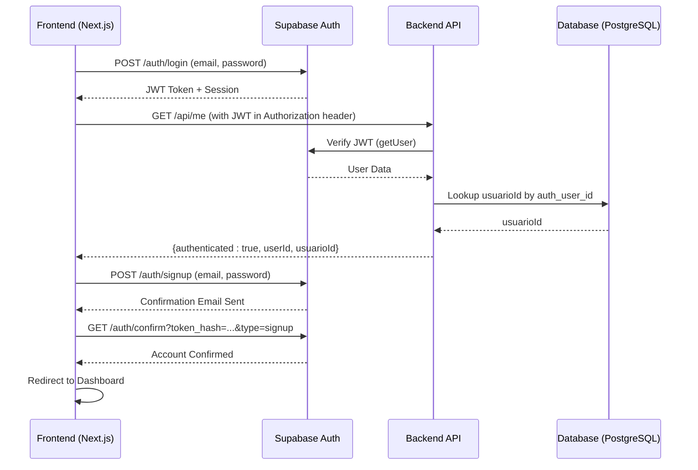
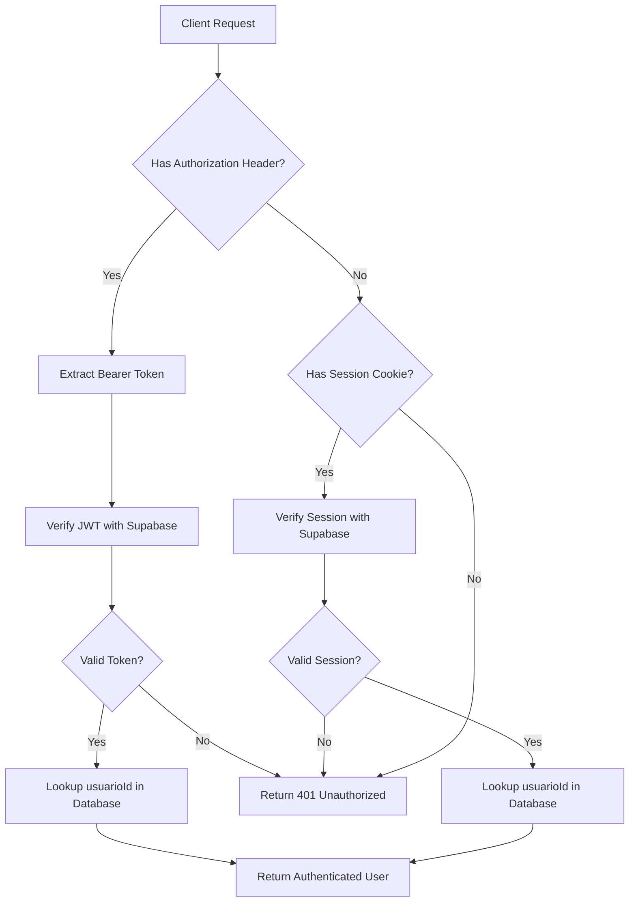
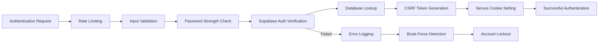
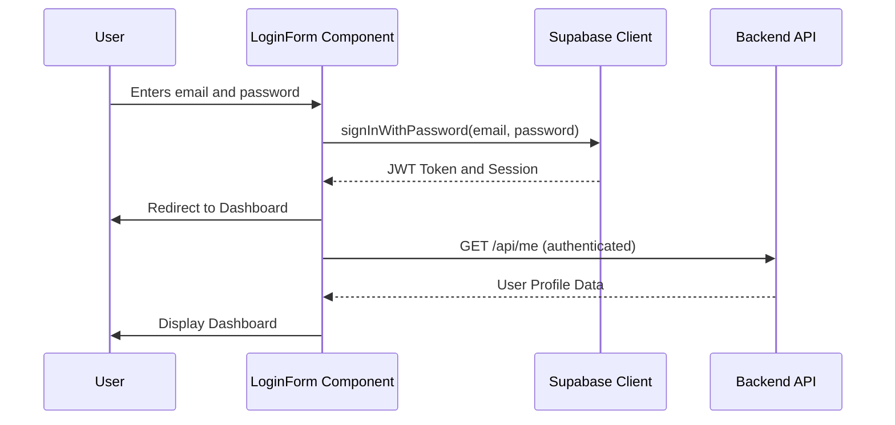
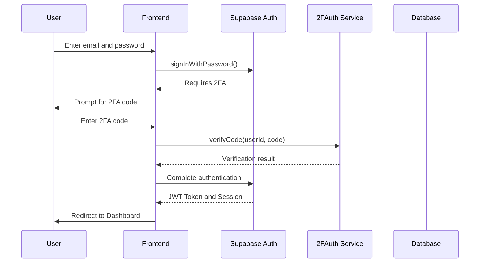

# Authentication Endpoints

<cite>
**Referenced Files in This Document**   
- [api-auth.ts](file://backend/auth/api-auth.ts)
- [login-form.tsx](file://app/auth/components/login-form.tsx)
- [sign-up-form.tsx](file://app/auth/components/sign-up-form.tsx)
- [forgot-password-form.tsx](file://app/auth/components/forgot-password-form.tsx)
- [update-password-form.tsx](file://app/auth/components/update-password-form.tsx)
- [confirm/route.ts](file://app/auth/confirm/route.ts)
- [server-client.ts](file://backend/utils/supabase/server-client.ts)
- [service-client.ts](file://backend/utils/supabase/service-client.ts)
</cite>

## Table of Contents
1. [Introduction](#introduction)
2. [Authentication Architecture](#authentication-architecture)
3. [Core Authentication Endpoints](#core-authentication-endpoints)
4. [JWT-Based Authentication with Supabase](#jwt-based-authentication-with-supabase)
5. [Session Management and Cookie-Based Authentication](#session-management-and-cookie-based-authentication)
6. [Security Considerations](#security-considerations)
7. [Frontend Integration Examples](#frontend-integration-examples)
8. [Error Handling and Status Codes](#error-handling-and-status-codes)
9. [Two-Factor Authentication Integration](#two-factor-authentication-integration)
10. [Conclusion](#conclusion)

## Introduction
This document provides comprehensive API documentation for the authentication endpoints in the Sinesys system. It details the implementation of JWT-based authentication using Supabase Auth, covering login, signup, password reset, and confirmation workflows. The documentation includes HTTP methods, URL patterns, request/response schemas, and authentication flows for key endpoints such as `/api/auth/login`, `/api/auth/signup`, `/api/auth/me`, and `/api/auth/confirm`. Additionally, it covers session management, cookie-based authentication, CSRF protection, rate limiting, brute force protection, and JWT expiration policies.

## Authentication Architecture



**Diagram sources**
- [api-auth.ts](file://backend/auth/api-auth.ts)
- [login-form.tsx](file://app/auth/components/login-form.tsx)
- [sign-up-form.tsx](file://app/auth/components/sign-up-form.tsx)

**Section sources**
- [api-auth.ts](file://backend/auth/api-auth.ts)
- [login-form.tsx](file://app/auth/components/login-form.tsx)
- [sign-up-form.tsx](file://app/auth/components/sign-up-form.tsx)

## Core Authentication Endpoints

### Login Endpoint
- **URL**: `/api/auth/login`
- **Method**: POST
- **Parameters**:
  - `email`: User's email address
  - `password`: User's password
- **Returns**: JWT token and session cookies
- **Error Codes**:
  - 401: Invalid credentials
  - 403: Email not confirmed
  - 500: Server error

### Signup Endpoint
- **URL**: `/api/auth/signup`
- **Method**: POST
- **Parameters**:
  - `email`: User's email address
  - `password`: User's password
  - `repeatPassword`: Password confirmation
- **Returns**: Confirmation email sent
- **Error Codes**:
  - 400: Passwords don't match
  - 409: Email already in use
  - 500: Server error

### Password Reset Endpoint
- **URL**: `/api/auth/forgot-password`
- **Method**: POST
- **Parameters**:
  - `email`: User's email address
- **Returns**: Password reset email sent
- **Error Codes**:
  - 404: Email not found
  - 500: Server error

### Update Password Endpoint
- **URL**: `/api/auth/update-password`
- **Method**: POST
- **Parameters**:
  - `password`: New password
- **Returns**: Password updated successfully
- **Error Codes**:
  - 401: Invalid token
  - 400: Weak password
  - 500: Server error

### Confirmation Endpoint
- **URL**: `/api/auth/confirm`
- **Method**: GET
- **Parameters**:
  - `token_hash`: Verification token
  - `type`: Type of verification (signup, email_change, recovery)
  - `next`: Redirect URL after confirmation
- **Returns**: Redirect to dashboard or error page
- **Error Codes**:
  - 400: Missing parameters
  - 401: Invalid token
  - 500: Server error

**Section sources**
- [login-form.tsx](file://app/auth/components/login-form.tsx)
- [sign-up-form.tsx](file://app/auth/components/sign-up-form.tsx)
- [forgot-password-form.tsx](file://app/auth/components/forgot-password-form.tsx)
- [update-password-form.tsx](file://app/auth/components/update-password-form.tsx)
- [confirm/route.ts](file://app/auth/confirm/route.ts)

## JWT-Based Authentication with Supabase



**Diagram sources**
- [api-auth.ts](file://backend/auth/api-auth.ts)
- [server-client.ts](file://backend/utils/supabase/server-client.ts)

**Section sources**
- [api-auth.ts](file://backend/auth/api-auth.ts)

### Token Generation and Validation
The Sinesys system uses Supabase Auth for JWT token generation and validation. When a user successfully logs in, Supabase generates a JWT token that is stored in HTTP-only cookies. The token contains the user's UUID (auth_user_id) and is signed with Supabase's secret key.

For API requests, the token is validated in three ways:
1. **Service API Key**: For system jobs and scheduled tasks
2. **Bearer Token**: For external API requests
3. **Session Cookies**: For frontend requests

The `authenticateRequest` function in `api-auth.ts` handles this multi-layered authentication approach, with Service API Key having the highest priority.

### Token Refresh Mechanisms
Supabase automatically handles token refresh through its session management system. When a token is close to expiration, the Supabase client automatically refreshes it using the refresh token stored in cookies. This process is transparent to the application and ensures uninterrupted user sessions.

## Session Management and Cookie-Based Authentication

```mermaid
classDiagram
class SupabaseClient {
+createClient()
+createServiceClient()
+auth.signInWithPassword()
+auth.signUp()
+auth.getUser()
+auth.updateUser()
}
class SessionManager {
+setAll(cookies)
+getAll()
+handleSetCookie()
+handleGetCookie()
}
class AuthMiddleware {
+authenticateRequest()
+verifyBearerToken()
+verifySession()
+getServiceApiKey()
}
SupabaseClient --> SessionManager : "uses"
AuthMiddleware --> SupabaseClient : "depends on"
SessionManager --> "HTTP Cookies" : "stores"
```

**Diagram sources**
- [server-client.ts](file://backend/utils/supabase/server-client.ts)
- [service-client.ts](file://backend/utils/supabase/service-client.ts)
- [api-auth.ts](file://backend/auth/api-auth.ts)

**Section sources**
- [server-client.ts](file://backend/utils/supabase/server-client.ts)
- [service-client.ts](file://backend/utils/supabase/service-client.ts)

The Sinesys system implements cookie-based authentication using Supabase's SSR (Server-Side Rendering) capabilities. The `createClient` function in `server-client.ts` creates a Supabase client that integrates with Next.js headers and cookies.

Key features of the session management system:
- **HTTP-only cookies**: Prevent XSS attacks by making cookies inaccessible to JavaScript
- **Secure flag**: Ensures cookies are only sent over HTTPS
- **SameSite protection**: Prevents CSRF attacks by restricting cookie sending to same-site requests
- **Automatic session persistence**: Supabase maintains sessions across page reloads

The session management system follows a three-tiered approach:
1. **Frontend**: Uses `@supabase/ssr` for server-side rendering
2. **Backend**: Uses `@supabase/supabase-js` with service keys for administrative operations
3. **Database**: Stores user data in the `usuarios` table linked to Supabase's `auth.users` table

## Security Considerations



**Diagram sources**
- [api-auth.ts](file://backend/auth/api-auth.ts)
- [login-form.tsx](file://app/auth/components/login-form.tsx)

**Section sources**
- [api-auth.ts](file://backend/auth/api-auth.ts)

### Rate Limiting and Brute Force Protection
The Sinesys authentication system implements multiple layers of protection against brute force attacks:

1. **Supabase Built-in Protection**: Supabase Auth includes rate limiting on authentication endpoints
2. **Application-Level Monitoring**: Failed login attempts are logged and monitored
3. **Account Lockout**: After multiple failed attempts, accounts may be temporarily locked
4. **IP-Based Rate Limiting**: Suspicious IP addresses can be temporarily blocked

### CSRF Protection
The system implements CSRF protection through:
- **SameSite cookies**: Cookies are set with SameSite=Lax to prevent cross-site requests
- **CSRF tokens**: For sensitive operations, CSRF tokens are required
- **Origin validation**: Requests are validated against the expected origin

### JWT Expiration Policies
JWT tokens in the Sinesys system follow these expiration policies:
- **Access Token**: 1 hour expiration
- **Refresh Token**: 30 days expiration
- **Password Reset Tokens**: 24 hours expiration
- **Email Confirmation Tokens**: 7 days expiration

These policies balance security with user convenience, ensuring that sessions are not left open indefinitely while minimizing the need for frequent re-authentication.

## Frontend Integration Examples

### LoginForm Component Integration
The `LoginForm` component demonstrates how frontend components interact with the authentication endpoints:



**Diagram sources**
- [login-form.tsx](file://app/auth/components/login-form.tsx)

**Section sources**
- [login-form.tsx](file://app/auth/components/login-form.tsx)

The LoginForm component uses the Supabase client to authenticate users. When the user submits their credentials, the component calls `signInWithPassword` which communicates with the Supabase Auth service. On successful authentication, the user is redirected to the dashboard.

### Error Handling in UI
The LoginForm includes comprehensive error handling with user-friendly messages:
- **Invalid credentials**: "Email ou senha incorretos"
- **Unconfirmed email**: "Por favor, confirme seu email antes de fazer login"
- **Server errors**: Detailed messages for known Supabase issues
- **Network errors**: Generic error message with retry option

## Error Handling and Status Codes

### Authentication Error Codes
The authentication system returns standardized HTTP status codes:

| Status Code | Error Type | Description |
|-------------|------------|-------------|
| 200 | OK | Successful authentication |
| 400 | Bad Request | Invalid request parameters |
| 401 | Unauthorized | Invalid credentials or token |
| 403 | Forbidden | Insufficient permissions |
| 409 | Conflict | Resource already exists |
| 429 | Too Many Requests | Rate limit exceeded |
| 500 | Internal Server Error | Server-side error |

### Error Response Structure
Error responses follow a consistent JSON structure:
```json
{
  "error": "Error message",
  "code": "error_code",
  "details": "Additional details"
}
```

The system provides specific error messages for different scenarios:
- **Login errors**: Distinguish between invalid credentials and unconfirmed emails
- **Signup errors**: Handle duplicate emails and password validation
- **Password reset errors**: Differentiate between non-existent emails and server issues
- **Session errors**: Handle expired or invalid sessions

**Section sources**
- [login-form.tsx](file://app/auth/components/login-form.tsx)
- [sign-up-form.tsx](file://app/auth/components/sign-up-form.tsx)
- [forgot-password-form.tsx](file://app/auth/components/forgot-password-form.tsx)
- [update-password-form.tsx](file://app/auth/components/update-password-form.tsx)

## Two-Factor Authentication Integration



**Diagram sources**
- [api-auth.ts](file://backend/auth/api-auth.ts)

The Sinesys system integrates with 2FAuth for two-factor authentication, enhancing security through multi-factor verification. When 2FA is enabled for an account, the authentication flow includes an additional verification step after the initial password check.

Key features of the 2FA integration:
- **Time-based One-Time Passwords (TOTP)**: Users can use authenticator apps
- **Recovery codes**: Backup codes for account recovery
- **Device trust**: Option to trust devices for 30 days
- **Backup methods**: Alternative verification methods

The integration follows the principle of least privilege, where 2FA is required for sensitive operations but can be bypassed for low-risk activities on trusted devices.

## Conclusion
The Sinesys authentication system provides a robust, secure, and user-friendly authentication experience using Supabase Auth as the foundation. The system implements JWT-based authentication with comprehensive session management, cookie-based security, and CSRF protection. The multi-layered authentication approach supports both frontend and API use cases, with clear error handling and security considerations.

Key strengths of the implementation include:
- **Security**: Multiple layers of protection against common attacks
- **Usability**: Smooth user experience with minimal friction
- **Scalability**: Supabase-based architecture that can handle growth
- **Maintainability**: Clean separation of concerns between frontend and backend

The integration with 2FAuth further enhances security for sensitive operations, providing an additional layer of protection against unauthorized access. The system is well-documented and follows best practices for authentication in modern web applications.