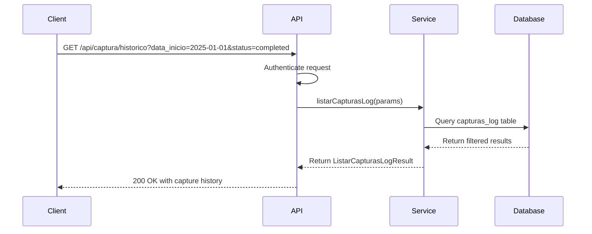
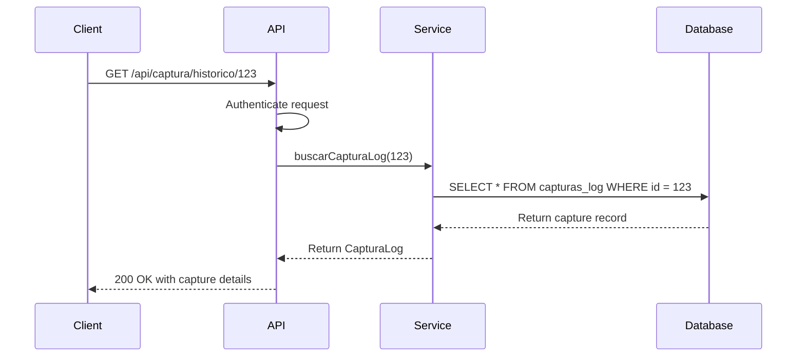
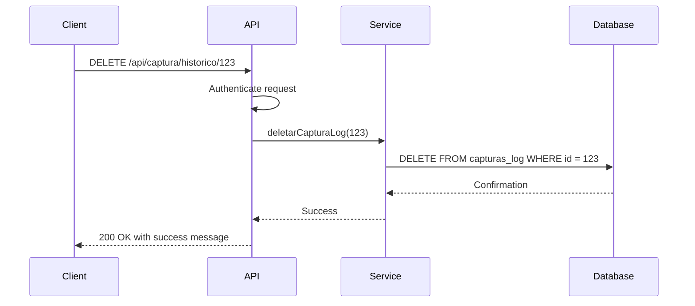
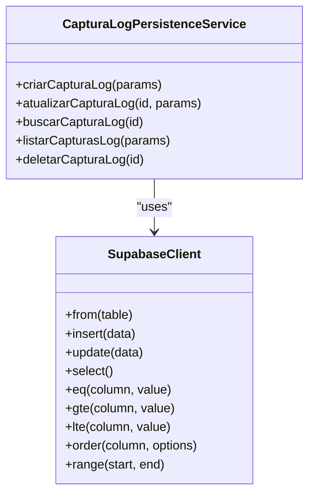
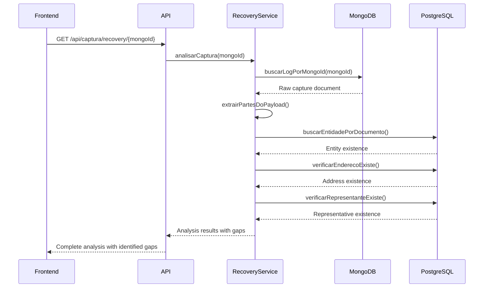
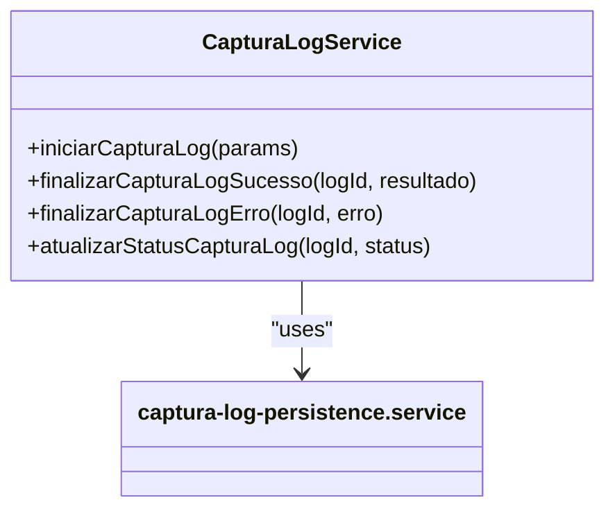
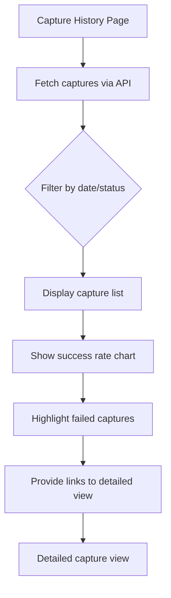
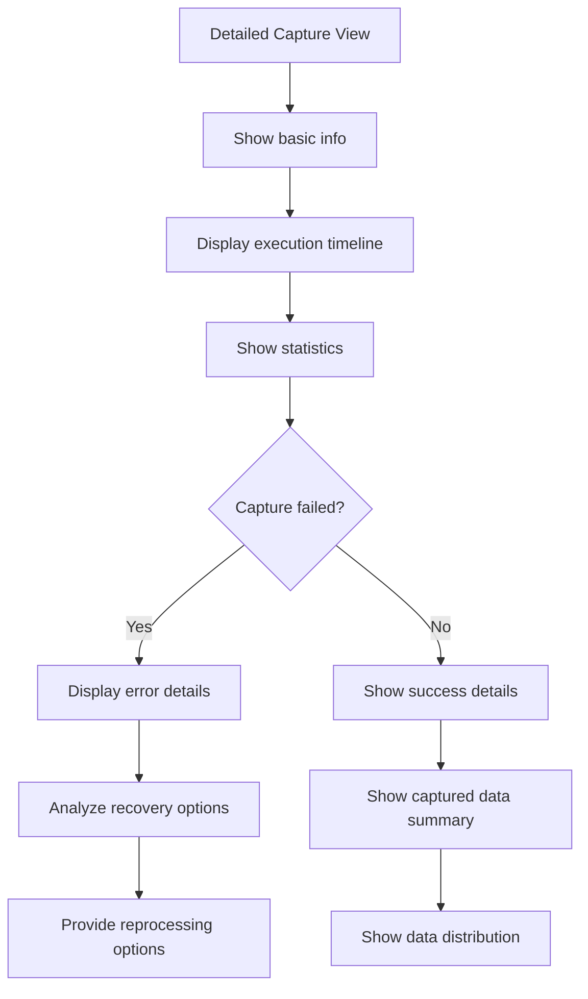
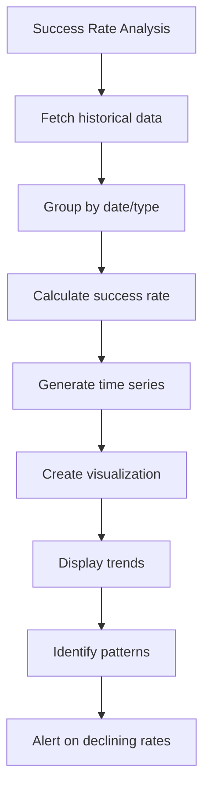
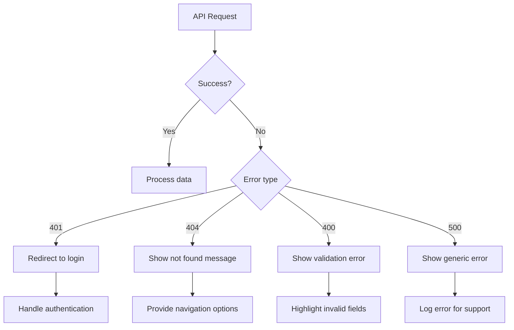

# Capture History Endpoints

<cite>
**Referenced Files in This Document**   
- [route.ts](file://app/api/captura/historico/route.ts)
- [route.ts](file://app/api/captura/historico/[id]/route.ts)
- [captura-log-persistence.service.ts](file://backend/captura/services/persistence/captura-log-persistence.service.ts)
- [recovery-analysis.service.ts](file://backend/captura/services/recovery/recovery-analysis.service.ts)
- [captura-log.service.ts](file://backend/captura/services/captura-log.service.ts)
- [captura-log-types.ts](file://backend/types/captura/capturas-log-types.ts)
- [page.tsx](file://app/(dashboard)/captura/historico/[id]/page.tsx)
- [use-capturas-log.ts](file://app/_lib/hooks/use-capturas-log.ts)
</cite>

## Table of Contents
1. [Introduction](#introduction)
2. [API Endpoints](#api-endpoints)
3. [Request Parameters](#request-parameters)
4. [Response Schema](#response-schema)
5. [Implementation Details](#implementation-details)
6. [Frontend Integration](#frontend-integration)
7. [Performance Considerations](#performance-considerations)
8. [Data Retention and Archival](#data-retention-and-archival)
9. [Error Handling](#error-handling)
10. [Conclusion](#conclusion)

## Introduction

The capture history endpoints in the Sinesys system provide a comprehensive API for managing and retrieving historical data about data capture operations from various tribunals. These endpoints enable users to track the success, failure, and performance of capture processes, analyze historical trends, and troubleshoot issues with failed captures. The system is designed to handle large volumes of historical data while providing efficient querying capabilities through pagination and filtering.

The capture history functionality is centered around the `/api/captura/historico` endpoint, which supports listing historical captures with various filters and retrieving detailed information about specific capture operations. The system stores detailed logs of each capture operation, including metadata about the tribunal, execution time, success/failure status, and statistical information about the captured data.

**Section sources**
- [route.ts](file://app/api/captura/historico/route.ts)
- [route.ts](file://app/api/captura/historico/[id]/route.ts)

## API Endpoints

The Sinesys system provides two main endpoints for accessing capture history data:

### GET /api/captura/historico

This endpoint returns a paginated list of capture history records with support for various filtering options. It allows clients to retrieve historical capture data based on date ranges, tribunal types, status filters, and other criteria.



**Diagram sources**
- [route.ts](file://app/api/captura/historico/route.ts)
- [captura-log-persistence.service.ts](file://backend/captura/services/persistence/captura-log-persistence.service.ts)

### GET /api/captura/historico/{id}

This endpoint retrieves detailed information about a specific capture operation by its ID. It provides comprehensive details about the capture, including its status, execution times, results, and any error messages.



**Diagram sources**
- [route.ts](file://app/api/captura/historico/[id]/route.ts)
- [captura-log-persistence.service.ts](file://backend/captura/services/persistence/captura-log-persistence.service.ts)

### DELETE /api/captura/historico/{id}

This endpoint allows for the deletion of a specific capture history record by its ID. It permanently removes the record from the system.



**Diagram sources**
- [route.ts](file://app/api/captura/historico/[id]/route.ts)
- [captura-log-persistence.service.ts](file://backend/captura/services/persistence/captura-log-persistence.service.ts)

**Section sources**
- [route.ts](file://app/api/captura/historico/route.ts)
- [route.ts](file://app/api/captura/historico/[id]/route.ts)

## Request Parameters

The capture history endpoints support various query parameters for filtering and pagination.

### GET /api/captura/historico Parameters

| Parameter | Type | Required | Description | Example |
|---------|------|----------|-------------|---------|
| pagina | integer | No | Page number for pagination (default: 1) | `pagina=2` |
| limite | integer | No | Number of items per page (default: 50, max: 100) | `limite=100` |
| tipo_captura | string | No | Filter by capture type | `tipo_captura=acervo_geral` |
| advogado_id | integer | No | Filter by lawyer ID | `advogado_id=42` |
| status | string | No | Filter by capture status | `status=completed` |
| data_inicio | string (date) | No | Start date for filtering (YYYY-MM-DD) | `data_inicio=2025-01-01` |
| data_fim | string (date) | No | End date for filtering (YYYY-MM-DD) | `data_fim=2025-12-31` |

The `tipo_captura` parameter accepts the following values:
- `acervo_geral`: General collection
- `arquivados`: Archived cases
- `audiencias`: Hearings
- `pendentes`: Pending cases
- `partes`: Parties

The `status` parameter accepts the following values:
- `pending`: Capture pending
- `in_progress`: Capture in progress
- `completed`: Capture completed successfully
- `failed`: Capture failed

**Section sources**
- [route.ts](file://app/api/captura/historico/route.ts)
- [captura-log-types.ts](file://backend/types/captura/capturas-log-types.ts)

## Response Schema

### List Response Schema

When calling GET /api/captura/historico, the response contains a paginated list of capture history records.

```json
{
  "success": true,
  "data": {
    "capturas": [
      {
        "id": 123,
        "tipo_captura": "acervo_geral",
        "advogado_id": 42,
        "credencial_ids": [1, 2],
        "status": "completed",
        "resultado": {
          "total_processos": 150,
          "total_partes": 320,
          "clientes": 85,
          "partes_contrarias": 120,
          "terceiros": 45,
          "representantes": 70,
          "vinculos": 320,
          "erros_count": 0,
          "duracao_ms": 2450,
          "mongodb_ids": ["67890abc1234567890abcdef", "67890abc1234567890abcdeg"],
          "mongodb_falhas": 0
        },
        "erro": null,
        "iniciado_em": "2025-01-15T10:30:00.000Z",
        "concluido_em": "2025-01-15T10:30:02.450Z",
        "created_at": "2025-01-15T10:30:00.000Z"
      }
    ],
    "total": 1,
    "pagina": 1,
    "limite": 50,
    "totalPaginas": 1
  }
}
```

### Single Record Response Schema

When calling GET /api/captura/historico/{id}, the response contains detailed information about a specific capture.

```json
{
  "success": true,
  "data": {
    "id": 123,
    "tipo_captura": "acervo_geral",
    "advogado_id": 42,
    "credencial_ids": [1, 2],
    "status": "completed",
    "resultado": {
      "total_processos": 150,
      "total_partes": 320,
      "clientes": 85,
      "partes_contrarias": 120,
      "terceiros": 45,
      "representantes": 70,
      "vinculos": 320,
      "erros_count": 0,
      "duracao_ms": 2450,
      "mongodb_ids": ["67890abc1234567890abcdef", "67890abc1234567890abcdeg"],
      "mongodb_falhas": 0
    },
    "erro": null,
    "iniciado_em": "2025-01-15T10:30:00.000Z",
    "concluido_em": "2025-01-15T10:30:02.450Z",
    "created_at": "2025-01-15T10:30:00.000Z"
  }
}
```

### Common Fields

| Field | Type | Description |
|------|------|-------------|
| id | integer | Unique identifier for the capture record |
| tipo_captura | string | Type of capture operation |
| advogado_id | integer | ID of the lawyer associated with the capture |
| credencial_ids | array of integers | IDs of credentials used for the capture |
| status | string | Current status of the capture |
| resultado | object | Detailed results of the capture operation |
| erro | string or null | Error message if the capture failed |
| iniciado_em | string (ISO timestamp) | When the capture was initiated |
| concluido_em | string (ISO timestamp) or null | When the capture was completed |
| created_at | string (ISO timestamp) | When the record was created |

### Resultado Object

The `resultado` field contains detailed statistics about the capture operation:

| Field | Type | Description |
|------|------|-------------|
| total_processos | integer | Total number of processes processed |
| total_partes | integer | Total number of parties found |
| clientes | integer | Number of clients identified |
| partes_contrarias | integer | Number of opposing parties |
| terceiros | integer | Number of third parties (experts, prosecutors, etc.) |
| representantes | integer | Number of representatives saved |
| vinculos | integer | Number of process-party relationships created |
| erros_count | integer | Number of errors encountered |
| duracao_ms | integer | Duration of the capture in milliseconds |
| mongodb_ids | array of strings | IDs of MongoDB documents containing raw capture data |
| mongodb_falhas | integer | Number of failures when saving to MongoDB |

**Section sources**
- [captura-log-types.ts](file://backend/types/captura/capturas-log-types.ts)
- [route.ts](file://app/api/captura/historico/route.ts)
- [route.ts](file://app/api/captura/historico/[id]/route.ts)

## Implementation Details

### captura-log-persistence.service.ts

The `captura-log-persistence.service.ts` file contains the core persistence logic for capture history records. It provides functions for CRUD operations on the `capturas_log` table in the PostgreSQL database.

The service uses Supabase as the database client and implements the following key functions:

- `criarCapturaLog`: Creates a new capture log record
- `atualizarCapturaLog`: Updates an existing capture log record
- `buscarCapturaLog`: Retrieves a specific capture log by ID
- `listarCapturasLog`: Lists capture logs with filtering and pagination
- `deletarCapturaLog`: Deletes a capture log record

The service handles database errors appropriately, converting them to meaningful error messages. For example, when a record is not found, it throws a specific error message rather than a generic database error.



**Diagram sources**
- [captura-log-persistence.service.ts](file://backend/captura/services/persistence/captura-log-persistence.service.ts)

### recovery-analysis.service.ts

The `recovery-analysis.service.ts` file contains functionality for analyzing failed captures and identifying gaps in data persistence. This service is crucial for troubleshooting and ensuring data integrity.

Key features of this service include:

- `analisarCaptura`: Analyzes a specific capture by its MongoDB ID and identifies any gaps in data persistence
- `analisarDocumento`: Analyzes a MongoDB document and compares it with the persisted data in PostgreSQL
- `identificarGaps`: Identifies missing entities (parties, addresses, representatives) by comparing the raw capture data with the database
- `analisarGapsAgregado`: Performs aggregated analysis of gaps across multiple logs
- `verificarSeLogPossuiGaps`: Quickly checks if a log has any gaps without performing a full analysis

The service extracts data from the raw MongoDB documents and compares it with the data in the PostgreSQL database to identify any discrepancies. This is particularly useful for identifying cases where data was successfully captured but not properly persisted in the main database.



**Diagram sources**
- [recovery-analysis.service.ts](file://backend/captura/services/recovery/recovery-analysis.service.ts)

### captura-log.service.ts

The `captura-log.service.ts` file provides a higher-level interface for managing capture logs. It serves as a convenience layer that simplifies common operations on capture logs.

Key functions in this service include:

- `iniciarCapturaLog`: Creates a new capture log and returns its ID
- `finalizarCapturaLogSucesso`: Updates a capture log with success status and results
- `finalizarCapturaLogErro`: Updates a capture log with failure status and error message
- `atualizarStatusCapturaLog`: Updates the status of a capture log

This service abstracts the lower-level persistence operations and provides a more intuitive interface for capture management.



**Diagram sources**
- [captura-log.service.ts](file://backend/captura/services/captura-log.service.ts)

**Section sources**
- [captura-log-persistence.service.ts](file://backend/captura/services/persistence/captura-log-persistence.service.ts)
- [recovery-analysis.service.ts](file://backend/captura/services/recovery/recovery-analysis.service.ts)
- [captura-log.service.ts](file://backend/captura/services/captura-log.service.ts)

## Frontend Integration

### Capture History Display

The frontend capture interface displays capture history data in a user-friendly manner. The main capture history page lists recent captures with key information such as capture type, status, execution time, and success/failure indicators.



The interface includes visual indicators for capture status:
- Green checkmark for successful captures
- Red exclamation mark for failed captures
- Yellow clock for in-progress captures
- Gray circle for pending captures

### Detailed Capture View

When a user clicks on a specific capture, they are taken to a detailed view page that shows comprehensive information about the capture operation. This page is accessible via the route `/captura/historico/[id]`.



The detailed view includes:
- Basic capture information (ID, type, status, times)
- Execution timeline showing start and end times
- Statistical breakdown of captured data
- Error details if the capture failed
- Recovery analysis if available
- Options to reprocess failed captures

### Success Rate Analysis

The frontend analyzes success rates by aggregating data from multiple capture operations. It calculates success rates over time and by capture type, providing insights into system performance.



The analysis includes:
- Daily success rate trends
- Success rates by capture type
- Average execution time by type
- Error frequency and types
- Recovery success rates

**Section sources**
- [page.tsx](file://app/(dashboard)/captura/historico/[id]/page.tsx)
- [use-capturas-log.ts](file://app/_lib/hooks/use-capturas-log.ts)

## Performance Considerations

### Query Optimization

The capture history endpoints are designed to handle large volumes of historical data efficiently. The database queries are optimized for performance with appropriate indexing on key fields:

- Index on `iniciado_em` for date range queries
- Index on `status` for status filtering
- Index on `tipo_captura` for type filtering
- Index on `advogado_id` for lawyer-specific queries
- Composite index on frequently used filter combinations

The API implements pagination to prevent excessive data transfer and memory usage. The default page size is 50 items, with a maximum of 100 items per page to prevent performance degradation.

### Pagination Strategy

The pagination strategy uses the offset-based approach with the following parameters:

- `pagina`: Page number (1-based)
- `limite`: Number of items per page (default: 50, max: 100)

The implementation uses Supabase's `range()` method to efficiently retrieve the requested page of results:

```typescript
const offset = (pagina - 1) * limite;
query = query.range(offset, offset + limite - 1);
```

This approach is suitable for the expected data volumes and access patterns. For very large datasets, cursor-based pagination could be considered in the future to improve performance.

### Caching Strategy

While not explicitly implemented in the current code, a caching strategy could be beneficial for frequently accessed capture history data. Potential caching approaches include:

- Client-side caching with appropriate TTL
- Server-side caching of common queries
- Redis cache for frequently accessed capture details

### Data Aggregation

For analytics purposes, the system could implement data aggregation to improve performance. This could include:

- Pre-calculated daily success rates
- Aggregated statistics by capture type
- Summary tables for historical trends

These aggregations would reduce the need to query large volumes of raw data for common reporting scenarios.

**Section sources**
- [captura-log-persistence.service.ts](file://backend/captura/services/persistence/captura-log-persistence.service.ts)
- [route.ts](file://app/api/captura/historico/route.ts)

## Data Retention and Archival

### Log Retention Policy

The system maintains a comprehensive log retention policy to balance data availability with storage costs. The current policy retains capture logs indefinitely, as they represent important historical records of data capture operations.

However, the raw capture data stored in MongoDB may have a different retention policy. The system is designed to allow for archival of older raw data while maintaining the summary information in the PostgreSQL database.

### Data Archival Process

The data archival process is designed to manage storage costs while preserving important information. The process includes:

1. Identification of older capture records that are candidates for archival
2. Extraction of key information from raw data
3. Compression and archival of raw data
4. Update of the capture log to reference the archived data
5. Optional deletion of raw data from primary storage

The system maintains references to archived data through the `mongodb_ids` field in the capture log, which stores the IDs of the MongoDB documents containing the raw capture data.

### Data Integrity

The system ensures data integrity through several mechanisms:

- Transactional operations when updating capture logs
- Consistent error handling and logging
- Validation of data before persistence
- Regular consistency checks between raw data and persisted data

The `recovery-analysis.service.ts` includes functionality to validate the consistency between the raw capture data in MongoDB and the persisted data in PostgreSQL:

```typescript
const captura = await buscarCapturaLog(id);
const contadores = await contarLogsBrutoPorStatus(id);

const esperado = captura.resultado.total_processos;
const atual = contadores.total;

if (atual !== esperado) {
  console.warn(`Inconsistência: esperado ${esperado}, encontrado ${atual}`);
}
```

This validation helps identify cases where data may have been lost during the capture or persistence process.

**Section sources**
- [captura-log-persistence.service.ts](file://backend/captura/services/persistence/captura-log-persistence.service.ts)
- [recovery-analysis.service.ts](file://backend/captura/services/recovery/recovery-analysis.service.ts)

## Error Handling

### API Error Responses

The capture history endpoints implement comprehensive error handling to provide meaningful feedback to clients. The API returns standardized error responses with the following structure:

```json
{
  "error": {
    "code": "ERROR_CODE",
    "message": "Descriptive error message"
  }
}
```

Common error codes include:
- `UNAUTHORIZED`: Authentication failed
- `BAD_REQUEST`: Invalid request parameters
- `NOT_FOUND`: Resource not found
- `INTERNAL`: Internal server error

### Specific Error Scenarios

The endpoints handle various error scenarios:

**Invalid ID format:**
- Returns 400 Bad Request with "ID inválido" message
- Validates that the ID is a valid integer

**Capture not found:**
- Returns 404 Not Found with "Registro de captura não encontrado" message
- Handles both non-existent IDs and deleted records

**Authentication failure:**
- Returns 401 Unauthorized with "Unauthorized" message
- Requires valid authentication token or session

**Database errors:**
- Returns 500 Internal Server Error with descriptive message
- Logs detailed error information for debugging

### Client-Side Error Handling

The frontend implements robust error handling for capture history operations:



The client-side code uses the `use-capturas-log` hook to handle API requests and errors consistently across the application.

**Section sources**
- [route.ts](file://app/api/captura/historico/route.ts)
- [route.ts](file://app/api/captura/historico/[id]/route.ts)

## Conclusion

The capture history endpoints in the Sinesys system provide a robust and comprehensive API for managing and retrieving historical data about data capture operations. The system is designed to handle large volumes of data while providing efficient querying capabilities through pagination and filtering.

Key features of the implementation include:
- Comprehensive API endpoints for listing and retrieving capture history
- Detailed response schemas with rich statistical information
- Robust error handling and authentication
- Efficient pagination strategy for large datasets
- Integration with recovery analysis for troubleshooting failed captures
- Frontend components for displaying capture history and analyzing success rates

The system's architecture separates concerns effectively, with distinct services for persistence, recovery analysis, and high-level capture management. This modular design makes the system maintainable and extensible.

For optimal performance with large datasets, consider implementing additional optimizations such as:
- Cursor-based pagination for very large datasets
- Caching of frequently accessed data
- Data aggregation for analytics purposes
- Archival of older raw data to reduce storage costs

The capture history functionality is a critical component of the Sinesys system, providing visibility into data capture operations and enabling effective monitoring and troubleshooting of the data integration process.

**Section sources**
- [route.ts](file://app/api/captura/historico/route.ts)
- [route.ts](file://app/api/captura/historico/[id]/route.ts)
- [captura-log-persistence.service.ts](file://backend/captura/services/persistence/captura-log-persistence.service.ts)
- [recovery-analysis.service.ts](file://backend/captura/services/recovery/recovery-analysis.service.ts)