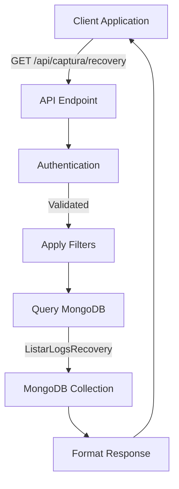
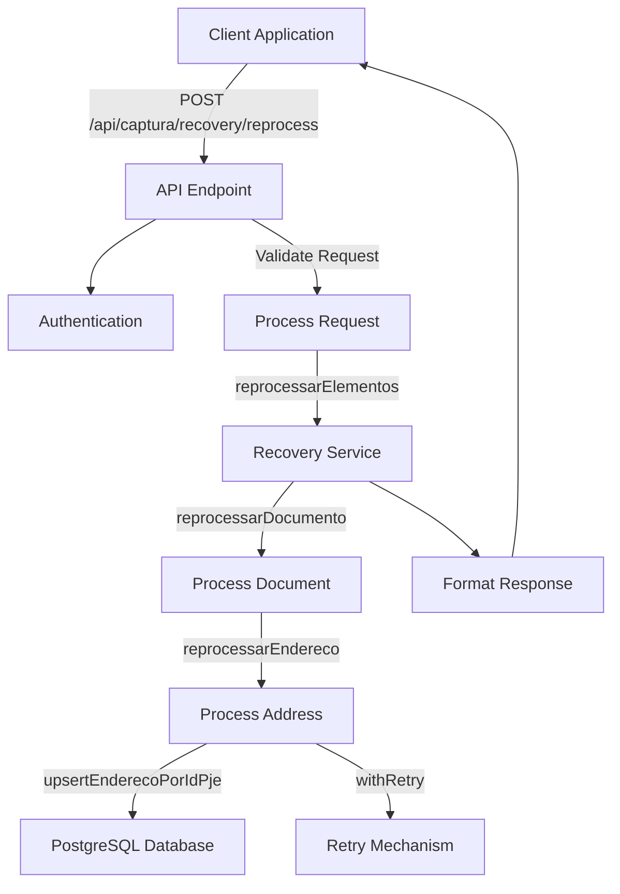
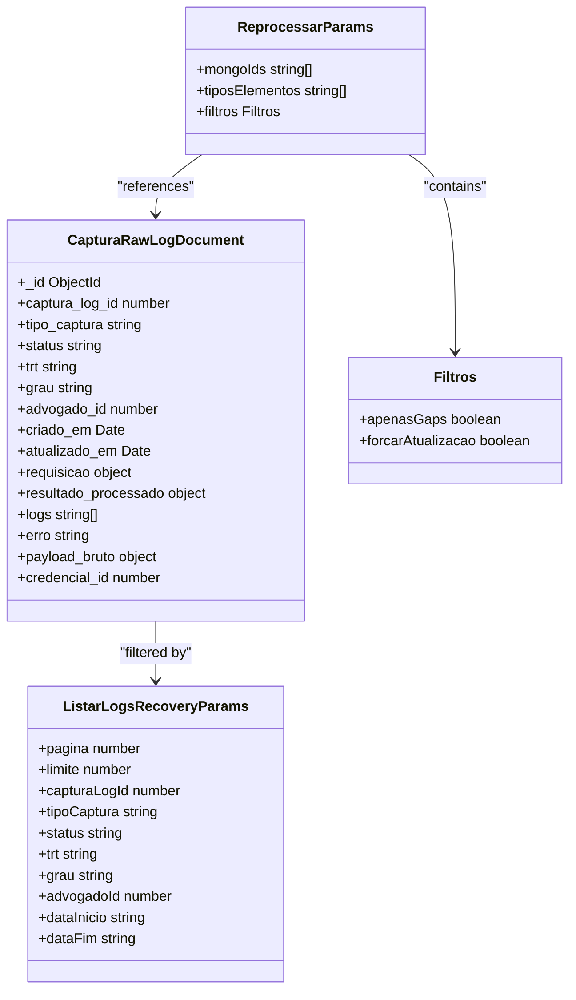
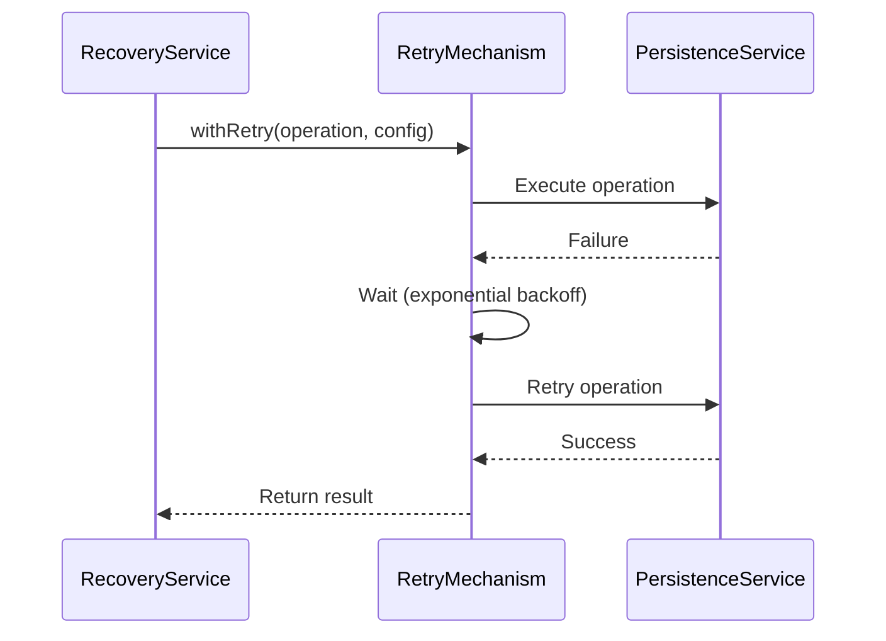
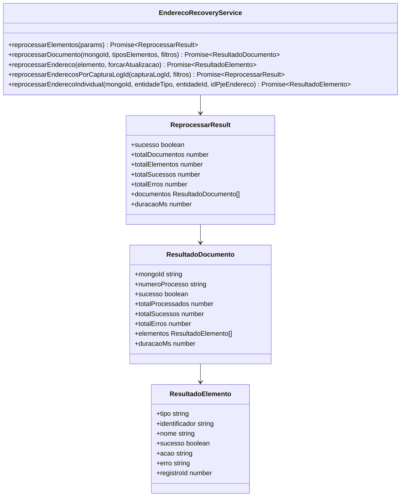
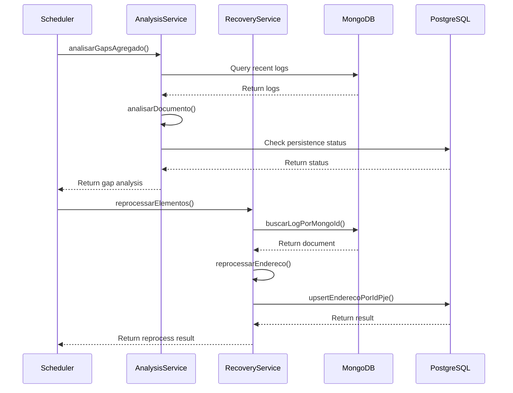
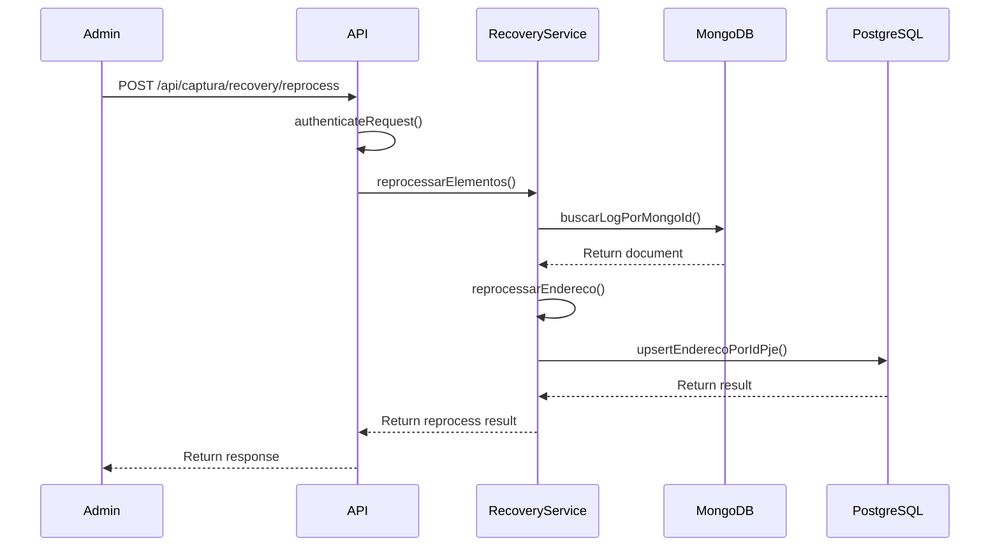
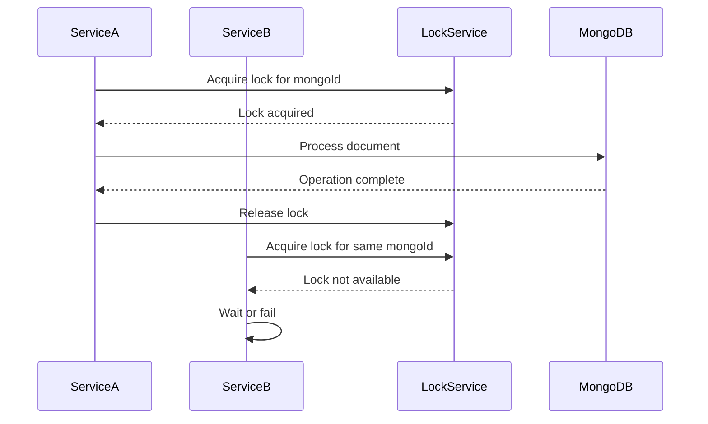
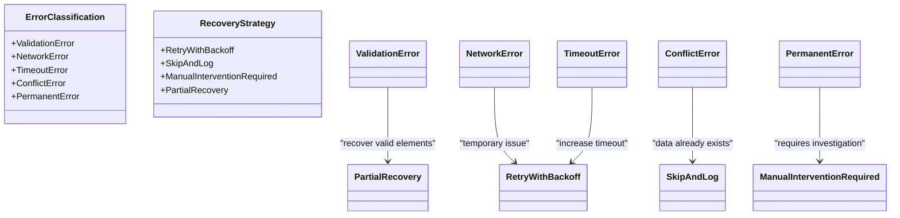

# Capture Recovery Endpoints

<cite>
**Referenced Files in This Document**   
- [captura-recovery.service.ts](file://backend/captura/services/recovery/captura-recovery.service.ts)
- [endereco-recovery.service.ts](file://backend/captura/services/recovery/endereco-recovery.service.ts)
- [recovery-analysis.service.ts](file://backend/captura/services/recovery/recovery-analysis.service.ts)
- [types.ts](file://backend/captura/services/recovery/types.ts)
- [route.ts](file://app/api/captura/recovery/route.ts)
- [route.ts](file://app/api/captura/recovery/[mongoId]/route.ts)
- [route.ts](file://app/api/captura/recovery/[mongoId]/elementos/route.ts)
- [route.ts](file://app/api/captura/recovery/reprocess/route.ts)
- [collections.ts](file://backend/utils/mongodb/collections.ts)
- [api-auth.ts](file://backend/auth/api-auth.ts)
- [service-client.ts](file://backend/utils/supabase/service-client.ts)
- [retry.ts](file://backend/utils/retry/index.ts)
</cite>

## Table of Contents
1. [Introduction](#introduction)
2. [API Endpoints](#api-endpoints)
3. [Recovery Parameters](#recovery-parameters)
4. [Response Schema](#response-schema)
5. [Implementation Details](#implementation-details)
6. [Recovery Process](#recovery-process)
7. [Distributed Locking Mechanism](#distributed-locking-mechanism)
8. [Error Classification and Retry Strategies](#error-classification-and-retry-strategies)
9. [Practical Examples](#practical-examples)
10. [Conclusion](#conclusion)

## Introduction

The Sinesys capture recovery system provides a robust mechanism for recovering from failed data captures from the PJE (Processo Judicial Eletrônico) system. When a capture operation fails to persist certain elements (such as addresses, parties, or representatives) to the PostgreSQL database, the system stores the raw payload in MongoDB for later recovery. This documentation details the API endpoints and underlying services that enable administrators and automated systems to identify, analyze, and re-persist these missing elements.

The recovery process is centered around MongoDB document IDs that reference raw capture logs. The system supports both manual recovery initiated by administrators and automatic recovery triggered by system processes. Key components include the `captura-recovery.service.ts` for managing recovery operations and the `endereco-recovery.service.ts` for specifically handling address-related recovery with retry logic.

**Section sources**
- [captura-recovery.service.ts](file://backend/captura/services/recovery/captura-recovery.service.ts)
- [endereco-recovery.service.ts](file://backend/captura/services/recovery/endereco-recovery.service.ts)

## API Endpoints

The capture recovery API is exposed under the `/api/captura/recovery/` base path and provides several endpoints for listing, analyzing, and reprocessing failed captures.

### GET /api/captura/recovery

This endpoint lists capture logs stored in MongoDB for recovery purposes. It supports pagination and filtering by various criteria including capture type, status, TRT code, and date range.



**Diagram sources**
- [route.ts](file://app/api/captura/recovery/route.ts)
- [captura-recovery.service.ts](file://backend/captura/services/recovery/captura-recovery.service.ts)

### GET /api/captura/recovery/{mongoId}

This endpoint retrieves detailed information about a specific capture log by its MongoDB ID. It includes the original request, result, logs, and error information. The response can optionally include the raw payload and perform a gap analysis to identify missing elements.

```mermaid
flowchart TD
Client["Client Application"] --> |GET /api/captura/recovery/{mongoId}| API["API Endpoint"]
API --> Auth["Authentication"]
Auth --> |Validated| Find["Find Log by MongoId"]
Find --> |buscarLogPorMongoId| MongoDB["MongoDB Collection"]
MongoDB --> Analyze["Analyze Gaps"]
Analyze --> |analisarCaptura| PostgreSQL["PostgreSQL Database"]
PostgreSQL --> Response["Format Response"]
Response --> Client
```

**Diagram sources**
- [route.ts](file://app/api/captura/recovery/[mongoId]/route.ts)
- [captura-recovery.service.ts](file://backend/captura/services/recovery/captura-recovery.service.ts)
- [recovery-analysis.service.ts](file://backend/captura/services/recovery/recovery-analysis.service.ts)

### GET /api/captura/recovery/{mongoId}/elementos

This endpoint returns all elements captured in a specific log, along with their persistence status in PostgreSQL. It supports filtering by persistence status (all, missing, existing) and different response modes (generic or parts-specific structure).

```mermaid
flowchart TD
Client["Client Application"] --> |GET /api/captura/recovery/{mongoId}/elementos| API["API Endpoint"]
API --> Auth["Authentication"]
Auth --> |Validated| Find["Find Log by MongoId"]
Find --> |buscarLogPorMongoId| MongoDB["MongoDB Collection"]
MongoDB --> Extract["Extract Elements"]
Extract --> |extrairElementosPorTipo| Status["Check Persistence Status"]
Status --> |Supabase Queries| PostgreSQL["PostgreSQL Database"]
PostgreSQL --> Response["Format Response"]
Response --> Client
```

**Diagram sources**
- [route.ts](file://app/api/captura/recovery/[mongoId]/elementos/route.ts)
- [recovery-analysis.service.ts](file://backend/captura/services/recovery/recovery-analysis.service.ts)

### POST /api/captura/recovery/reprocess

This endpoint initiates the reprocessing of elements from one or more capture logs. It supports reprocessing by MongoDB IDs or by capture log ID, with options to specify element types and filtering criteria.



**Diagram sources**
- [route.ts](file://app/api/captura/recovery/reprocess/route.ts)
- [endereco-recovery.service.ts](file://backend/captura/services/recovery/endereco-recovery.service.ts)

## Recovery Parameters

The recovery system uses several parameters to control the recovery process, including MongoDB IDs, retry strategies, and options for partial capture resumption.

### MongoDB IDs

The primary identifier for recovery operations is the MongoDB ObjectId, which references a specific capture log document. These IDs are used in path parameters for detailed endpoints and in request bodies for reprocessing operations.



**Diagram sources**
- [types.ts](file://backend/captura/services/recovery/types.ts)
- [captura-recovery.service.ts](file://backend/captura/services/recovery/captura-recovery.service.ts)

### Retry Strategies

The system implements a configurable retry strategy for recovery operations, particularly for address persistence. The retry configuration includes maximum attempts, base delay, and maximum delay.



**Diagram sources**
- [endereco-recovery.service.ts](file://backend/captura/services/recovery/endereco-recovery.service.ts)
- [retry.ts](file://backend/utils/retry/index.ts)

### Partial Capture Resumption

The recovery system supports resuming partial captures through several mechanisms:
- **Gap Analysis**: Identifies specific elements (addresses, parties, representatives) that were not persisted
- **Selective Reprocessing**: Allows reprocessing only missing elements or forcing updates to existing ones
- **Element Filtering**: Supports filtering by element type and persistence status

**Section sources**
- [recovery-analysis.service.ts](file://backend/captura/services/recovery/recovery-analysis.service.ts)
- [types.ts](file://backend/captura/services/recovery/types.ts)

## Response Schema

The API responses follow a consistent schema with success status, data payload, and optional error information.

### List Response Schema

```json
{
  "success": true,
  "data": {
    "logs": [
      {
        "mongoId": "string",
        "capturaLogId": "number",
        "tipoCaptura": "string",
        "status": "string",
        "trt": "string",
        "grau": "string",
        "advogadoId": "number",
        "criadoEm": "string",
        "numeroProcesso": "string",
        "erro": "string"
      }
    ],
    "total": "number",
    "pagina": "number",
    "limite": "number",
    "totalPaginas": "number"
  },
  "estatisticas": {
    "contadores": {
      "success": "number",
      "error": "number",
      "total": "number"
    },
    "porTrt": [
      {
        "trt": "string",
        "total": "number",
        "success": "number",
        "error": "number"
      }
    ],
    "gaps": {
      "totalLogs": "number",
      "logsComGaps": "number",
      "resumoGaps": {
        "enderecos": "number",
        "partes": "number",
        "representantes": "number"
      }
    }
  }
}
```

### Detail Response Schema

```json
{
  "success": true,
  "data": {
    "log": {
      "mongoId": "string",
      "capturaLogId": "number",
      "tipoCaptura": "string",
      "status": "string",
      "trt": "string",
      "grau": "string",
      "advogadoId": "number",
      "criadoEm": "string",
      "erro": "string"
    },
    "analise": {
      "processo": {
        "id": "number",
        "idPje": "number",
        "numeroProcesso": "string",
        "trt": "string",
        "grau": "string"
      },
      "totais": {
        "partes": "number",
        "partesPersistidas": "number",
        "enderecosEsperados": "number",
        "enderecosPersistidos": "number",
        "representantes": "number",
        "representantesPersistidos": "number"
      },
      "gaps": {
        "enderecosFaltantes": [
          {
            "tipo": "string",
            "identificador": "string",
            "nome": "string",
            "dadosBrutos": "object",
            "statusPersistencia": "string",
            "contexto": {
              "entidadeId": "number",
              "entidadeTipo": "string"
            }
          }
        ],
        "partesFaltantes": [],
        "representantesFaltantes": []
      },
      "payloadDisponivel": "boolean",
      "erroOriginal": "string"
    },
    "payloadDisponivel": "boolean"
  }
}
```

### Reprocess Response Schema

```json
{
  "success": true,
  "data": {
    "sucesso": "boolean",
    "totalDocumentos": "number",
    "totalElementos": "number",
    "totalSucessos": "number",
    "totalErros": "number",
    "documentos": [
      {
        "mongoId": "string",
        "numeroProcesso": "string",
        "sucesso": "boolean",
        "totalProcessados": "number",
        "totalSucessos": "number",
        "totalErros": "number",
        "elementos": [
          {
            "tipo": "string",
            "identificador": "string",
            "nome": "string",
            "sucesso": "boolean",
            "acao": "string",
            "erro": "string",
            "registroId": "number"
          }
        ],
        "duracaoMs": "number"
      }
    ],
    "duracaoMs": "number"
  }
}
```

**Section sources**
- [types.ts](file://backend/captura/services/recovery/types.ts)
- [route.ts](file://app/api/captura/recovery/route.ts)
- [route.ts](file://app/api/captura/recovery/[mongoId]/route.ts)
- [route.ts](file://app/api/captura/recovery/reprocess/route.ts)

## Implementation Details

The capture recovery system is implemented across several services that handle different aspects of the recovery process.

### captura-recovery.service.ts

This service provides the core functionality for managing recovery operations. It includes functions for listing, searching, and retrieving capture logs from MongoDB.

```mermaid
classDiagram
class CapturaRecoveryService {
+listarLogsRecovery(params) Promise~ListarLogsRecoveryResult~
+buscarLogPorMongoId(mongoId) Promise~CapturaRawLogDocument | null~
+buscarLogsPorCapturaLogId(capturaLogId) Promise~CapturaRawLogDocument[]~
+contarLogsPorStatus(params) Promise~{success, error, total}~
+estatisticasPorTrt(params) Promise~{trt, total, success, error}[]~
+verificarPayloadDisponivel(mongoId) Promise~boolean~
+extrairPayloadBruto(mongoId) Promise~unknown | null~
}
class ListarLogsRecoveryResult {
+logs LogRecoverySumario[]
+total number
+pagina number
+limite number
+totalPaginas number
}
class LogRecoverySumario {
+mongoId string
+capturaLogId number
+tipoCaptura string
+status string
+trt string
+grau string
+advogadoId number
+criadoEm Date
+numeroProcesso string
+processoIdPje number
+erro string
}
CapturaRecoveryService --> ListarLogsRecoveryResult
CapturaRecoveryService --> LogRecoverySumario
```

**Diagram sources**
- [captura-recovery.service.ts](file://backend/captura/services/recovery/captura-recovery.service.ts)

### endereco-recovery.service.ts

This service specifically handles the recovery of address data from failed captures. It implements retry logic and checks for existing records to prevent duplicates.



**Diagram sources**
- [endereco-recovery.service.ts](file://backend/captura/services/recovery/endereco-recovery.service.ts)

## Recovery Process

The recovery process involves several steps from identifying failed captures to re-persisting missing elements.

### Automatic Recovery

The system automatically recovers from failed captures through scheduled jobs that analyze recent capture logs for gaps and initiate reprocessing.



**Diagram sources**
- [recovery-analysis.service.ts](file://backend/captura/services/recovery/recovery-analysis.service.ts)
- [endereco-recovery.service.ts](file://backend/captura/services/recovery/endereco-recovery.service.ts)

### Manual Recovery

Administrators can manually trigger recovery through the API endpoints, allowing for targeted recovery of specific captures.



**Diagram sources**
- [route.ts](file://app/api/captura/recovery/reprocess/route.ts)
- [endereco-recovery.service.ts](file://backend/captura/services/recovery/endereco-recovery.service.ts)

## Distributed Locking Mechanism

The system implements a distributed locking mechanism to prevent concurrent recovery of the same capture, ensuring data consistency and preventing race conditions.



The locking mechanism is implemented using Redis-based distributed locks through the `@/backend/utils/locks` module, which ensures that only one service instance can process a specific capture log at a time. This prevents multiple recovery processes from attempting to re-persist the same elements simultaneously, which could lead to data inconsistencies or duplicate records.

**Section sources**
- [utils/locks](file://backend/utils/locks)

## Error Classification and Retry Strategies

The system classifies errors and applies appropriate recovery strategies based on the error type and context.

### Error Classification

Errors are classified into several categories that determine the appropriate recovery strategy:



The error classification system analyzes the error message and context to determine the appropriate recovery strategy. For example, network-related errors trigger retry mechanisms, while validation errors may require manual intervention.

**Section sources**
- [types.ts](file://backend/captura/services/recovery/types.ts)
- [endereco-recovery.service.ts](file://backend/captura/services/recovery/endereco-recovery.service.ts)

### Retry Configuration

The retry mechanism is configurable with parameters for maximum attempts, base delay, and maximum delay:

```typescript
const RETRY_CONFIG = {
  maxAttempts: 3,
  baseDelay: 500,
  maxDelay: 5000,
};
```

The retry mechanism uses exponential backoff with jitter to prevent thundering herd problems when multiple failed captures are recovered simultaneously.

**Section sources**
- [endereco-recovery.service.ts](file://backend/captura/services/recovery/endereco-recovery.service.ts)
- [retry.ts](file://backend/utils/retry/index.ts)

## Practical Examples

### Example 1: Manual Recovery of Missing Addresses

An administrator identifies a failed capture and manually triggers recovery of missing addresses:

```http
POST /api/captura/recovery/reprocess
Content-Type: application/json
Authorization: Bearer <token>

{
  "mongoIds": ["64abc123def4567890123456"],
  "tiposElementos": ["endereco"],
  "filtros": {
    "apenasGaps": true,
    "forcarAtualizacao": false
  }
}
```

### Example 2: Automatic Gap Analysis

A scheduled job analyzes recent captures for gaps:

```typescript
const params = {
  dataInicio: "2025-01-01",
  dataFim: "2025-01-02",
  tipoCaptura: "partes"
};

const analysis = await analisarGapsAgregado(params);
if (analysis.logsComGaps > 0) {
  // Trigger recovery for captures with gaps
  await reprocessarElementos({
    mongoIds: analysis.topProcessosComGaps.map(p => p.mongoId),
    tiposElementos: ["endereco"]
  });
}
```

### Example 3: Individual Address Recovery

Recovering a specific address from a capture log:

```http
POST /api/captura/recovery/reprocess
Content-Type: application/json
Authorization: Bearer <token>

{
  "mongoIds": ["64abc123def4567890123456"],
  "tiposElementos": ["endereco"],
  "filtros": {
    "apenasGaps": false,
    "forcarAtualizacao": true
  }
}
```

**Section sources**
- [route.ts](file://app/api/captura/recovery/reprocess/route.ts)
- [endereco-recovery.service.ts](file://backend/captura/services/recovery/endereco-recovery.service.ts)

## Conclusion

The Sinesys capture recovery system provides a comprehensive solution for handling failed data captures from the PJE system. By storing raw payloads in MongoDB and providing a robust API for recovery operations, the system ensures that no data is lost due to transient failures. The implementation includes sophisticated features such as gap analysis, distributed locking, retry mechanisms, and error classification that work together to provide reliable and efficient recovery.

The system supports both automated recovery processes and manual intervention by administrators, making it flexible for different operational needs. The clear API endpoints and well-defined response schemas make it easy to integrate recovery functionality into administrative interfaces and automated workflows.