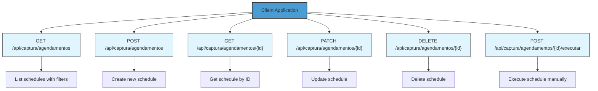
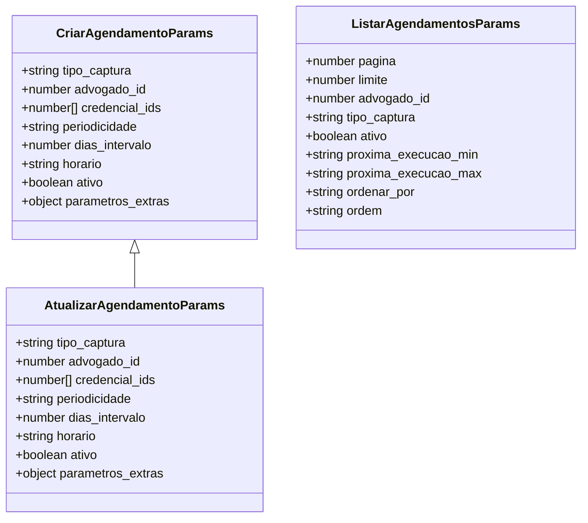
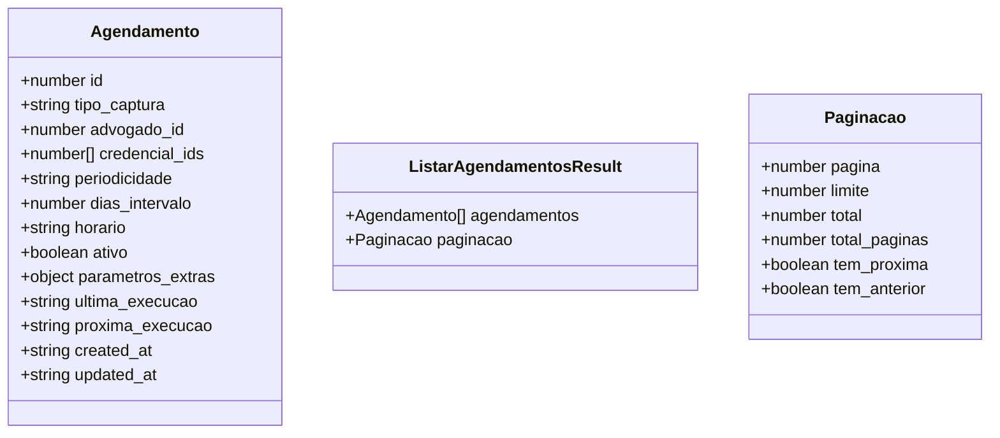
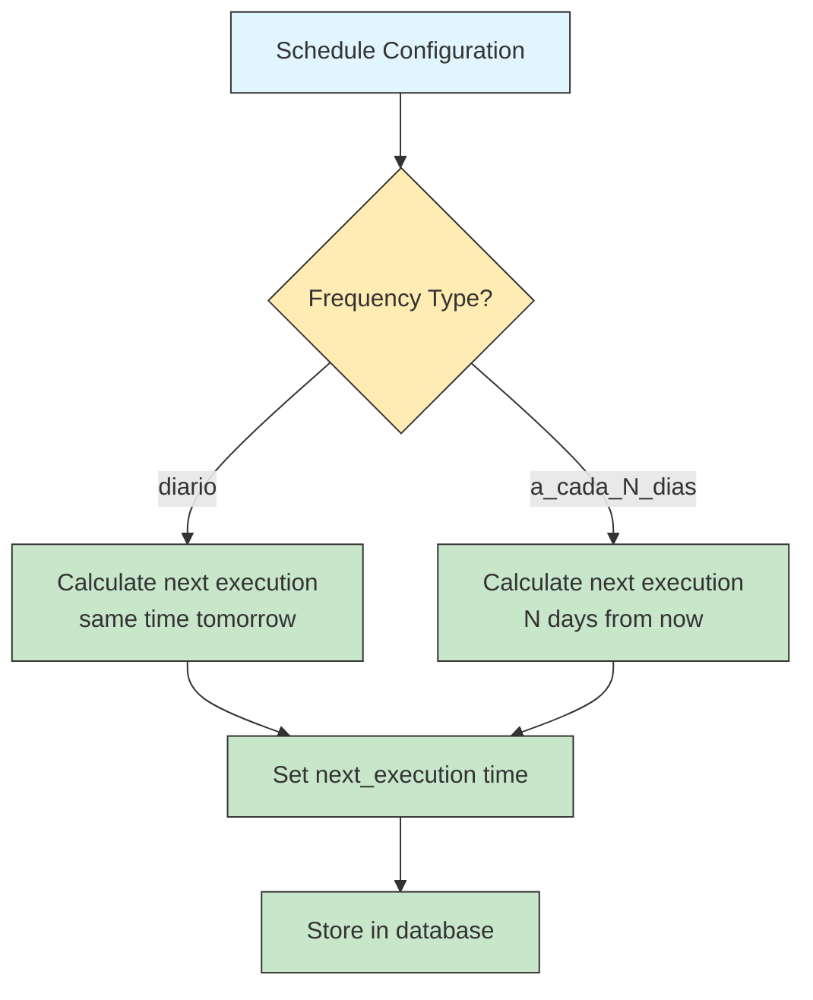
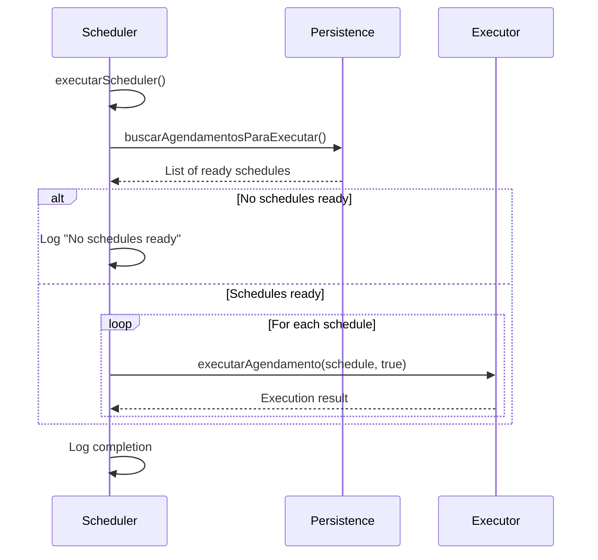
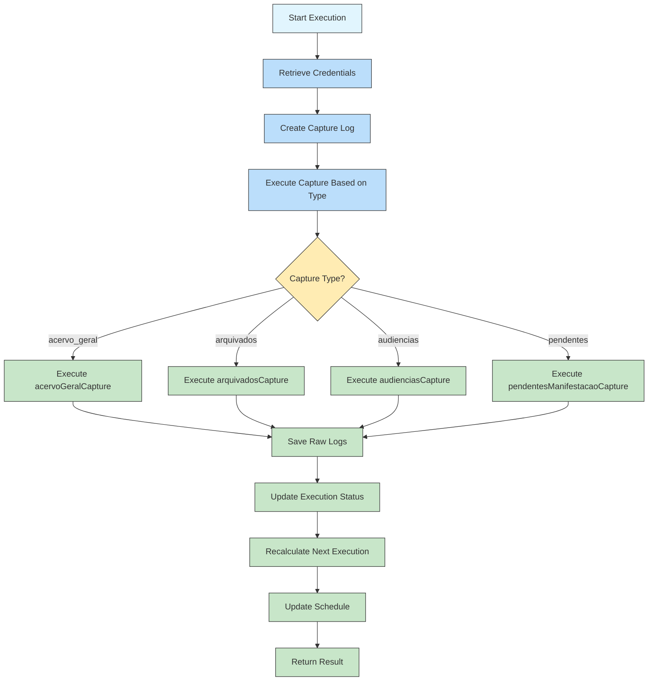
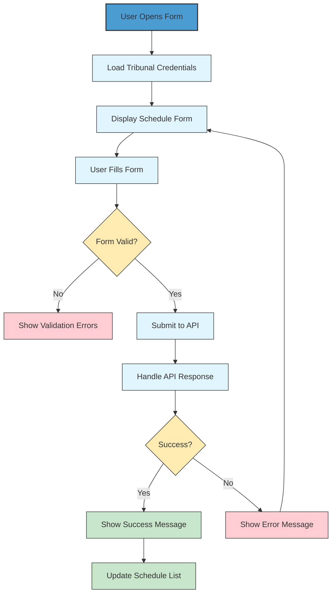
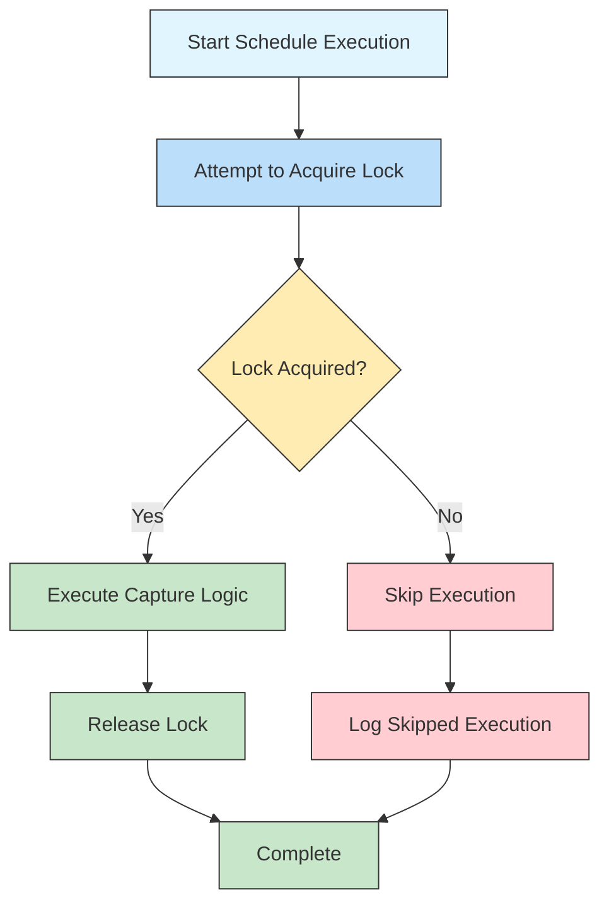

# Capture Scheduling Endpoints

<cite>
**Referenced Files in This Document**   
- [route.ts](file://app/api/captura/agendamentos/route.ts)
- [route.ts](file://app/api/captura/agendamentos/[id]/route.ts)
- [route.ts](file://app/api/captura/agendamentos/[id]/executar/route.ts)
- [agendamento-scheduler.service.ts](file://backend/captura/services/scheduler/agendamento-scheduler.service.ts)
- [executar-agendamento.service.ts](file://backend/captura/services/scheduler/executar-agendamento.service.ts)
- [agendamentos-types.ts](file://backend/types/captura/agendamentos-types.ts)
- [criar-agendamento.service.ts](file://backend/captura/services/agendamentos/criar-agendamento.service.ts)
- [atualizar-agendamento.service.ts](file://backend/captura/services/agendamentos/atualizar-agendamento.service.ts)
- [listar-agendamentos.service.ts](file://backend/captura/services/agendamentos/listar-agendamentos.service.ts)
- [buscar-agendamento.service.ts](file://backend/captura/services/agendamentos/buscar-agendamento.service.ts)
- [page.tsx](file://app/(dashboard)/captura/agendamentos/page.tsx)
- [agendamento-form.tsx](file://app/(dashboard)/captura/components/agendamentos/agendamento-form.tsx)
- [agendamentos-list.tsx](file://app/(dashboard)/captura/components/agendamentos/agendamentos-list.tsx)
- [spec.md](file://openspec/specs/agendamentos/spec.md)
</cite>

## Table of Contents
1. [Introduction](#introduction)
2. [API Endpoints](#api-endpoints)
3. [Request/Response Schemas](#requestresponse-schemas)
4. [Scheduling Parameters](#scheduling-parameters)
5. [Implementation Details](#implementation-details)
6. [Frontend Integration](#frontend-integration)
7. [Common Issues and Solutions](#common-issues-and-solutions)
8. [Distributed Locking Mechanism](#distributed-locking-mechanism)
9. [Conclusion](#conclusion)

## Introduction

The Capture Scheduling API in the Sinesys system enables automated data capture from various tribunal systems through scheduled jobs. This documentation covers the `/api/captura/agendamentos` endpoint which manages the creation, retrieval, update, and deletion of capture schedules. The system supports different capture types including general inventory (acervo_geral), archived cases (arquivados), hearings (audiencias), and pending matters (pendentes). Each schedule is configured with tribunal credentials, execution frequency, and timing parameters.

The scheduling system is designed to handle both automatic cron-based execution and manual on-demand execution. The backend services ensure reliable execution with proper error handling, logging, and state management. The frontend interface provides a user-friendly way to manage schedules with form validation and real-time feedback.

**Section sources**
- [route.ts](file://app/api/captura/agendamentos/route.ts)
- [agendamentos-types.ts](file://backend/types/captura/agendamentos-types.ts)
- [spec.md](file://openspec/specs/agendamentos/spec.md)

## API Endpoints

The capture scheduling system exposes a RESTful API with standard CRUD operations for managing capture schedules. All endpoints require authentication via bearer token, session cookie, or service API key.

**Diagram sources**
- [route.ts](file://app/api/captura/agendamentos/route.ts)
- [route.ts](file://app/api/captura/agendamentos/[id]/route.ts)
- [route.ts](file://app/api/captura/agendamentos/[id]/executar/route.ts)

### GET /api/captura/agendamentos

Retrieves a paginated list of capture schedules with optional filtering. The endpoint supports various query parameters to filter by lawyer ID, capture type, active status, and execution time range.

**Section sources**
- [route.ts](file://app/api/captura/agendamentos/route.ts)
- [listar-agendamentos.service.ts](file://backend/captura/services/agendamentos/listar-agendamentos.service.ts)

### POST /api/captura/agendamentos

Creates a new capture schedule. The request body must include required fields such as capture type, lawyer ID, credential references, frequency, and execution time. The system automatically calculates the next execution time based on the provided schedule configuration.

**Section sources**
- [route.ts](file://app/api/captura/agendamentos/route.ts)
- [criar-agendamento.service.ts](file://backend/captura/services/agendamentos/criar-agendamento.service.ts)

### GET /api/captura/agendamentos/{id}

Retrieves a specific capture schedule by its ID. Returns detailed information about the schedule including its current status, last execution time, and next scheduled execution.

**Section sources**
- [route.ts](file://app/api/captura/agendamentos/[id]/route.ts)
- [buscar-agendamento.service.ts](file://backend/captura/services/agendamentos/buscar-agendamento.service.ts)

### PATCH /api/captura/agendamentos/{id}

Updates an existing capture schedule. Allows modification of any schedule parameter. When frequency, interval, or execution time is changed, the system automatically recalculates the next execution time.

**Section sources**
- [route.ts](file://app/api/captura/agendamentos/[id]/route.ts)
- [atualizar-agendamento.service.ts](file://backend/captura/services/agendamentos/atualizar-agendamento.service.ts)

### DELETE /api/captura/agendamentos/{id}

Deletes a capture schedule. The operation is idempotent and returns success even if the schedule does not exist.

**Section sources**
- [route.ts](file://app/api/captura/agendamentos/[id]/route.ts)

### POST /api/captura/agendamentos/{id}/executar

Triggers manual execution of a schedule without affecting its regular schedule. This is useful for testing or immediate data capture needs.

**Section sources**
- [route.ts](file://app/api/captura/agendamentos/[id]/executar/route.ts)
- [executar-agendamento.service.ts](file://backend/captura/services/scheduler/executar-agendamento.service.ts)

## Request/Response Schemas

This section details the request and response schemas for the capture scheduling endpoints.

### Request Schema

The request schema defines the structure of data sent to the API for creating and updating schedules.

**Diagram sources**
- [agendamentos-types.ts](file://backend/types/captura/agendamentos-types.ts)

### Response Schema

The response schema defines the structure of data returned by the API when retrieving schedules.

**Diagram sources**
- [agendamentos-types.ts](file://backend/types/captura/agendamentos-types.ts)
- [listar-agendamentos.service.ts](file://backend/captura/services/agendamentos/listar-agendamentos.service.ts)

## Scheduling Parameters

The capture scheduling system supports various parameters to configure when and how captures are executed.

### Tribunal ID and Credentials

Each schedule references one or more tribunal credentials through the `credencial_ids` array. These credentials contain the login information needed to access specific tribunal systems. The system validates that all referenced credentials exist before creating or updating a schedule.

**Section sources**
- [agendamentos-types.ts](file://backend/types/captura/agendamentos-types.ts)
- [executar-agendamento.service.ts](file://backend/captura/services/scheduler/executar-agendamento.service.ts)

### Frequency and Execution Time

The scheduling system supports two frequency types:

- **diario**: Executes daily at the specified time
- **a_cada_N_dias**: Executes every N days at the specified time

The `horario` parameter specifies the execution time in HH:mm format (e.g., "07:00" for 7:00 AM). When creating a new schedule or updating frequency parameters, the system automatically calculates the next execution time based on the current time and the specified schedule.

**Diagram sources**
- [criar-agendamento.service.ts](file://backend/captura/services/agendamentos/criar-agendamento.service.ts)
- [atualizar-agendamento.service.ts](file://backend/captura/services/agendamentos/atualizar-agendamento.service.ts)
- [calcular-proxima-execucao.service.ts](file://backend/captura/services/agendamentos/calcular-proxima-execucao.service.ts)

### Additional Parameters

Certain capture types support additional parameters through the `parametros_extras` field:

- **audiencias**: Supports `dataInicio` and `dataFim` to specify date range for hearing capture
- **pendentes**: Supports `filtroPrazo` to specify whether to capture matters with deadlines ("no_prazo") or without deadlines ("sem_prazo")

These parameters are passed to the underlying capture services when the schedule is executed.

**Section sources**
- [agendamentos-types.ts](file://backend/types/captura/agendamentos-types.ts)
- [executar-agendamento.service.ts](file://backend/captura/services/scheduler/executar-agendamento.service.ts)

## Implementation Details

This section details the implementation of the capture scheduling system, focusing on the core services that handle schedule execution.

### agendamento-scheduler.service.ts

The main scheduler service that runs periodically (typically every minute) to check for schedules ready for execution. It queries the database for schedules where the next execution time is in the past and processes them sequentially.

**Diagram sources**
- [agendamento-scheduler.service.ts](file://backend/captura/services/scheduler/agendamento-scheduler.service.ts)
- [persistence/agendamento-persistence.service.ts](file://backend/captura/services/persistence/agendamento-persistence.service.ts)
- [executar-agendamento.service.ts](file://backend/captura/services/scheduler/executar-agendamento.service.ts)

**Section sources**
- [agendamento-scheduler.service.ts](file://backend/captura/services/scheduler/agendamento-scheduler.service.ts)

### executar-agendamento.service.ts

The core service responsible for executing individual capture schedules. It handles the complete execution workflow including credential retrieval, capture execution, logging, and schedule state updates.

**Diagram sources**
- [executar-agendamento.service.ts](file://backend/captura/services/scheduler/executar-agendamento.service.ts)
- [trt/acervo-geral.service.ts](file://backend/captura/services/trt/acervo-geral.service.ts)
- [trt/arquivados.service.ts](file://backend/captura/services/trt/arquivados.service.ts)
- [trt/audiencias.service.ts](file://backend/captura/services/trt/audiencias.service.ts)
- [trt/pendentes-manifestacao.service.ts](file://backend/captura/services/trt/pendentes-manifestacao.service.ts)

**Section sources**
- [executar-agendamento.service.ts](file://backend/captura/services/scheduler/executar-agendamento.service.ts)

## Frontend Integration

The frontend capture interface provides a user-friendly way to manage capture schedules through a form-based interface.

### Schedule Creation and Management

The frontend implementation in `agendamento-form.tsx` provides a form for creating and editing schedules with validation and real-time feedback. The form handles the mapping between user interface elements and the API request structure.

**Diagram sources**
- [agendamento-form.tsx](file://app/(dashboard)/captura/components/agendamentos/agendamento-form.tsx)
- [agendamentos-list.tsx](file://app/(dashboard)/captura/components/agendamentos/agendamentos-list.tsx)
- [page.tsx](file://app/(dashboard)/captura/agendamentos/page.tsx)

### User Interface Components

The frontend consists of several key components:

- **agendamento-form.tsx**: Form component for creating and editing schedules
- **agendamentos-list.tsx**: Component for displaying the list of schedules
- **page.tsx**: Main page component that orchestrates the form and list

These components work together to provide a seamless user experience for managing capture schedules.

**Section sources**
- [agendamento-form.tsx](file://app/(dashboard)/captura/components/agendamentos/agendamento-form.tsx)
- [agendamentos-list.tsx](file://app/(dashboard)/captura/components/agendamentos/agendamentos-list.tsx)
- [page.tsx](file://app/(dashboard)/captura/agendamentos/page.tsx)

## Common Issues and Solutions

This section addresses common issues encountered when working with the capture scheduling system and their solutions.

### Overlapping Schedules

Overlapping schedules can occur when multiple schedules are configured to run at similar times, potentially overwhelming system resources. The system mitigates this through:

1. Sequential execution of schedules within the scheduler
2. Rate limiting at the tribunal API level
3. Resource monitoring and alerting

To prevent performance issues, users should distribute schedules across different times of day when possible.

**Section sources**
- [agendamento-scheduler.service.ts](file://backend/captura/services/scheduler/agendamento-scheduler.service.ts)

### Timezone Handling

The system stores all timestamps in UTC to ensure consistency across different timezones. The frontend converts timestamps to the user's local timezone for display. When configuring schedules, users should specify execution times in their local timezone, and the system handles the conversion to UTC for storage and execution.

**Section sources**
- [executar-agendamento.service.ts](file://backend/captura/services/scheduler/executar-agendamento.service.ts)
- [agendamento-form.tsx](file://app/(dashboard)/captura/components/agendamentos/agendamento-form.tsx)

### Failed Execution Recovery

The system provides robust error handling and recovery mechanisms:

1. Detailed logging of execution attempts and errors
2. Automatic retry of failed captures in subsequent schedule runs
3. Manual execution capability for immediate recovery
4. Email notifications for critical failures

The `executar-agendamento.service.ts` handles errors gracefully, ensuring that one failed capture does not affect the execution of other schedules.

**Section sources**
- [executar-agendamento.service.ts](file://backend/captura/services/scheduler/executar-agendamento.service.ts)
- [captura-log.service.ts](file://backend/captura/services/captura-log.service.ts)

## Distributed Locking Mechanism

The system implements a distributed locking mechanism to prevent concurrent execution of the same schedule, which could lead to data corruption or resource contention.

The locking mechanism works as follows:

1. Before executing a schedule, the system attempts to acquire a lock using the schedule ID
2. If the lock is successfully acquired, the execution proceeds
3. If the lock is already held by another process, the execution is skipped
4. The lock is automatically released when execution completes or times out

This ensures that even in a distributed environment with multiple scheduler instances, each schedule is executed by only one instance at a time.

**Diagram sources**
- [executar-agendamento.service.ts](file://backend/captura/services/scheduler/executar-agendamento.service.ts)
- [utils/locks/lock.service.ts](file://backend/utils/locks/lock.service.ts)

**Section sources**
- [executar-agendamento.service.ts](file://backend/captura/services/scheduler/executar-agendamento.service.ts)

## Conclusion

The Capture Scheduling API in the Sinesys system provides a robust and flexible solution for automating data capture from tribunal systems. The API supports comprehensive CRUD operations for managing schedules with detailed configuration options for frequency, timing, and capture parameters. The implementation includes reliable execution through the agendamento-scheduler.service.ts and executar-agendamento.service.ts services, with proper error handling and logging.

The frontend integration provides an intuitive interface for users to manage schedules, while the distributed locking mechanism ensures safe execution in multi-instance environments. Common issues such as overlapping schedules, timezone handling, and failed execution recovery are addressed through system design and operational practices.

This documentation provides a comprehensive overview of the API endpoints, request/response schemas, implementation details, and operational considerations for the capture scheduling system.