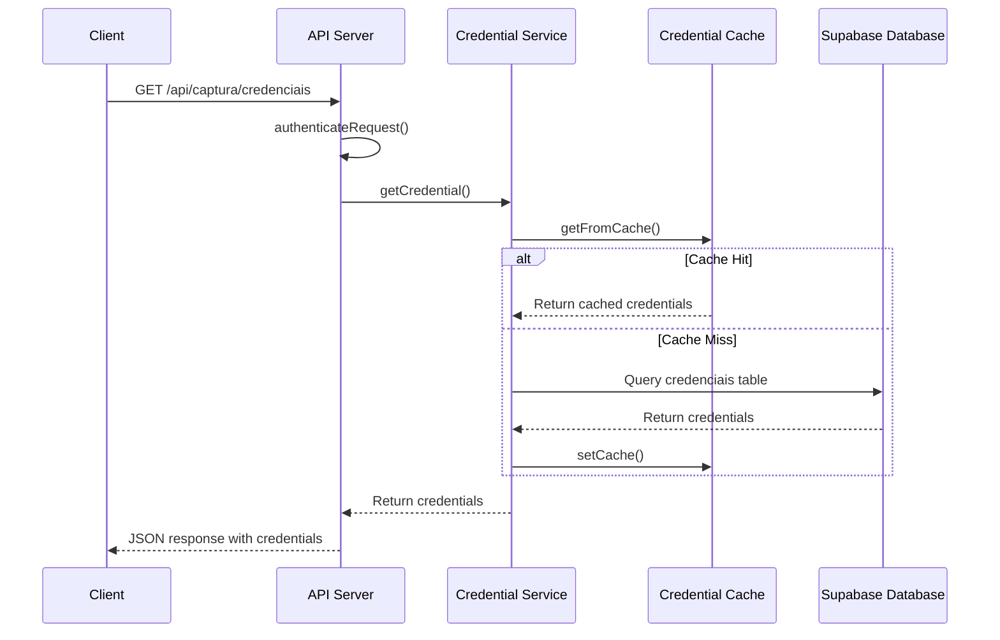

# Credential Management Endpoints

<cite>
**Referenced Files in This Document**   
- [route.ts](file://app/api/captura/credenciais/route.ts)
- [credential.service.ts](file://backend/captura/credentials/credential.service.ts)
- [credential-cache.service.ts](file://backend/captura/credentials/credential-cache.service.ts)
- [page.tsx](file://app/(dashboard)/captura/credenciais/page.tsx)
- [03_credenciais.sql](file://supabase/schemas/03_credenciais.sql)
- [trt-types.ts](file://backend/types/captura/trt-types.ts)
</cite>

## Table of Contents
1. [Introduction](#introduction)
2. [API Endpoint Overview](#api-endpoint-overview)
3. [Request and Response Schemas](#request-and-response-schemas)
4. [Credential Parameters](#credential-parameters)
5. [Response Schema Details](#response-schema-details)
6. [Service Implementation](#service-implementation)
7. [Frontend Integration](#frontend-integration)
8. [Security Considerations](#security-considerations)
9. [Credential Validation and Error Handling](#credential-validation-and-error-handling)
10. [Architecture Diagram](#architecture-diagram)

## Introduction

The Sinesys system provides a credential management API for handling access credentials to various tribunals. This documentation details the `/api/captura/credenciais` endpoint, which enables the retrieval of credentials required for automated capture from tribunal systems. The system supports multiple tribunal configurations and integrates with a caching mechanism to optimize performance.

The credential management system is designed to securely store and retrieve credentials for legal professionals accessing tribunal systems. It supports both first and second degree processes across various TRT (Regional Labor Court) jurisdictions. The system implements proper authentication mechanisms and follows security best practices for credential storage and access.

**Section sources**
- [route.ts](file://app/api/captura/credenciais/route.ts#L1-L173)
- [page.tsx](file://app/(dashboard)/captura/credenciais/page.tsx#L1-L217)

## API Endpoint Overview

The credential management system exposes a GET endpoint for retrieving credentials:

**HTTP Method**: GET  
**URL Pattern**: `/api/captura/credenciais`  
**Authentication Methods**: Bearer Token, Session Authentication, Service API Key

The endpoint returns a comprehensive list of credentials with associated lawyer information, available tribunals, and process degrees. It supports filtering by active status through the `active` query parameter. When no filter is applied, all credentials are returned.

The authentication system implements multiple security layers, including bearer tokens for API access, session-based authentication for web interfaces, and service API keys for backend operations. This multi-layered approach ensures that only authorized users and services can access sensitive credential information.



**Diagram sources**
- [route.ts](file://app/api/captura/credenciais/route.ts#L68-L173)
- [credential.service.ts](file://backend/captura/credentials/credential.service.ts#L39-L401)
- [credential-cache.service.ts](file://backend/captura/credentials/credential-cache.service.ts#L124-L143)

## Request and Response Schemas

### Request Parameters

The endpoint accepts the following query parameters:

| Parameter | Type | Required | Description |
|---------|------|----------|-------------|
| active | boolean | No | Filter credentials by active status (true/false). When omitted, returns all credentials. |

### Response Schema

The API returns a JSON object with the following structure:

```json
{
  "success": boolean,
  "data": {
    "credenciais": [
      {
        "id": integer,
        "advogado_id": integer,
        "advogado_nome": string,
        "advogado_cpf": string,
        "advogado_oab": string,
        "advogado_uf_oab": string,
        "tribunal": string,
        "grau": string,
        "active": boolean,
        "created_at": string,
        "updated_at": string
      }
    ],
    "tribunais_disponiveis": [string],
    "graus_disponiveis": [string]
  }
}
```

### Status Codes

| Code | Description | Response Body |
|------|-------------|---------------|
| 200 | Success | JSON with credentials data |
| 401 | Unauthorized | { "error": "Unauthorized" } |
| 500 | Internal Server Error | { "error": "Internal server error" } |

**Section sources**
- [route.ts](file://app/api/captura/credenciais/route.ts#L8-L173)
- [03_credenciais.sql](file://supabase/schemas/03_credenciais.sql#L1-L48)

## Credential Parameters

The credential system manages the following parameters for each tribunal access configuration:

### Tribunal ID
- **Field**: `tribunal`
- **Type**: String
- **Format**: TRT followed by number (TRT1 to TRT24) or TST
- **Description**: Identifies the specific tribunal for which the credential is valid

### Lawyer Information
- **advogado_id**: Integer identifier for the lawyer in the system
- **advogado_nome**: Full name of the lawyer
- **advogado_cpf**: CPF (Brazilian individual taxpayer registry) of the lawyer
- **advogado_oab**: OAB (Brazilian Bar Association) registration number
- **advogado_uf_oab**: Brazilian state where the OAB registration is valid

### Access Credentials
- **username**: Derived from the lawyer's CPF
- **password**: Stored password for tribunal access
- **additional authentication factors**: Not currently implemented in the credential model

### Process Degree
- **Field**: `grau`
- **Type**: String
- **Values**: "primeiro_grau" (first degree), "segundo_grau" (second degree)
- **Description**: Specifies the judicial degree for which the credential is valid

The system supports credentials for all 24 Regional Labor Courts (TRTs) and the Superior Labor Court (TST). Each credential is associated with a specific lawyer and can be configured for either first or second degree processes.

**Section sources**
- [trt-types.ts](file://backend/types/captura/trt-types.ts#L31-L56)
- [03_credenciais.sql](file://supabase/schemas/03_credenciais.sql#L26-L28)
- [credential.service.ts](file://backend/captura/credentials/credential.service.ts#L50-L66)

## Response Schema Details

The response schema provides comprehensive information about credentials and system metadata:

### Credential Object
Each credential in the response includes:

| Field | Type | Description |
|------|------|-------------|
| id | integer | Unique identifier for the credential |
| advogado_id | integer | Reference to the lawyer who owns the credential |
| advogado_nome | string | Full name of the associated lawyer |
| advogado_cpf | string | CPF of the associated lawyer |
| advogado_oab | string | OAB registration number of the lawyer |
| advogado_uf_oab | string | State of OAB registration |
| tribunal | string | Tribunal code (e.g., TRT1, TRT2) |
| grau | string | Process degree (primeiro_grau or segundo_grau) |
| active | boolean | Status indicator (true if credential is active) |
| created_at | string | Timestamp of credential creation |
| updated_at | string | Timestamp of last credential update |

### Metadata Fields
The response includes additional metadata to support frontend filtering:

| Field | Type | Description |
|------|------|-------------|
| tribunais_disponiveis | array of strings | List of all tribunal codes with active credentials |
| graus_disponiveis | array of strings | List of all process degrees with active credentials |

The metadata fields are automatically generated from the credential data, providing the frontend with information about available filtering options without requiring additional API calls.

**Section sources**
- [route.ts](file://app/api/captura/credenciais/route.ts#L25-L66)
- [credential.service.ts](file://backend/captura/credentials/credential.service.ts#L50-L66)

## Service Implementation

The credential management system is implemented across multiple service layers:

### Credential Service
The `credential.service.ts` file contains the core business logic for credential management:

- **getCredential**: Retrieves a specific credential by ID
- **getCredentialByTribunalAndGrau**: Retrieves credentials by lawyer, tribunal, and degree
- **getActiveCredentialsByTribunalAndGrau**: Retrieves all active credentials for a specific tribunal and degree
- **getCredentialComplete**: Retrieves complete credential information including tribunal and degree
- **validateCredential**: Validates if a credential exists and is active
- **getAdvogadoByCredentialId**: Retrieves lawyer information associated with a credential

The service uses Supabase as the data storage layer and implements proper error handling and logging.

### Credential Cache Service
The `credential-cache.service.ts` implements an in-memory caching system to optimize performance:

- **Cache TTL**: 5 minutes (300,000 milliseconds)
- **Cache Key Format**: `${advogadoId}:${tribunal}:${grau}`
- **Key Functions**:
  - `getFromCache`: Retrieves credentials from cache
  - `setCache`: Stores credentials in cache
  - `getCredentialsBatch`: Retrieves multiple credentials in a single database query
  - `clearCredentialCache`: Clears the entire cache
  - `cleanExpiredCache`: Removes expired credentials from cache
  - `getCacheStats`: Returns cache statistics

The caching system significantly reduces database load when processing multiple tribunal captures and implements automatic expiration to ensure data freshness.

**Section sources**
- [credential.service.ts](file://backend/captura/credentials/credential.service.ts#L1-L401)
- [credential-cache.service.ts](file://backend/captura/credentials/credential-cache.service.ts#L1-L447)

## Frontend Integration

The frontend credential management interface is implemented in the `page.tsx` file and provides the following functionality:

### User Interface Components
- **DataTable**: Displays credentials in a tabular format with sorting and filtering
- **TableToolbar**: Provides search and filtering controls
- **CredenciaisDialog**: Modal for creating and editing credentials
- **AdvogadoViewDialog**: Modal for viewing lawyer details
- **AlertDialog**: Confirmation dialog for status changes

### State Management
The component uses React hooks for state management:
- `useState`: Manages dialog states and filter selections
- `useMemo`: Optimizes filtered credential calculations
- `useCallback`: Memoizes filter change handlers
- `useDebounce`: Implements debounced search functionality

### Filtering Capabilities
The interface supports multiple filtering dimensions:
- **Search**: By lawyer name, CPF, or OAB number
- **Tribunal**: Filter by specific tribunal (TRT1-TRT24, TST)
- **Degree**: Filter by process degree (first or second)
- **Status**: Filter by active/inactive status

The frontend integrates with the `useCredenciais` hook to fetch and manage credential data, providing a responsive user experience with real-time filtering and search capabilities.

**Section sources**
- [page.tsx](file://app/(dashboard)/captura/credenciais/page.tsx#L1-L217)
- [credential.service.ts](file://backend/captura/credentials/credential.service.ts#L39-L401)

## Security Considerations

The credential management system implements several security measures to protect sensitive information:

### Credential Storage
- **Storage Method**: Credentials are stored in plain text in the database
- **Rationale**: Required for automated login to tribunal systems that don't support API-based authentication
- **Database Schema**: The `credenciais` table contains a `senha` (password) field of type text
- **Security Note**: The system previously used encrypted passwords but migrated to plain text storage to simplify the capture process

### Access Control
- **Row Level Security**: Enabled on the credenciais table
- **Authentication**: Multiple authentication methods (bearer token, session, API key)
- **Permission Validation**: Placeholder for future implementation in credential service
- **Service Client**: Uses Supabase service role with elevated privileges for system operations

### Rotation Policies
- **Manual Rotation**: Credentials can be updated through the frontend interface
- **Status Management**: Credentials can be deactivated without deletion
- **Audit Trail**: Updated_at timestamp tracks credential modifications
- **No Automated Rotation**: Currently requires manual intervention for credential updates

### Additional Security Measures
- **Caching Security**: Credentials in cache are not encrypted but have a short TTL (5 minutes)
- **Error Handling**: Generic error messages to prevent information disclosure
- **Input Validation**: Basic validation on credential parameters
- **Logging**: Error logging with contextual information for debugging

The system balances security requirements with functional needs, recognizing that automated tribunal access requires storing credentials in a retrievable format while implementing appropriate access controls and monitoring.

**Section sources**
- [03_credenciais.sql](file://supabase/schemas/03_credenciais.sql#L1-L48)
- [credential.service.ts](file://backend/captura/credentials/credential.service.ts#L45-L66)
- [credential-cache.service.ts](file://backend/captura/credentials/credential-cache.service.ts#L54-L55)

## Credential Validation and Error Handling

The system implements comprehensive validation and error handling for credential operations:

### Validation Process
- **Existence Check**: Verifies that the credential ID exists in the database
- **Active Status**: Confirms the credential is active (active = true)
- **Lawyer Association**: Validates that the credential is associated with a valid lawyer
- **Required Fields**: Ensures CPF is present for the associated lawyer

The `validateCredential` function specifically checks if a credential exists and is active, returning a boolean result without exposing additional information.

### Error Handling
The system handles the following error scenarios:

| Error Type | Handling Mechanism | Response |
|-----------|-------------------|----------|
| Authentication Failure | authenticateRequest middleware | 401 Unauthorized |
| Database Query Error | Try-catch blocks with error logging | 500 Internal Server Error |
| Credential Not Found | Null checks in service methods | Returns null or empty array |
| Invalid Parameters | Input validation in service methods | Appropriate error responses |
| Cache Miss | Automatic fallback to database | Seamless user experience |

Error messages are designed to be generic to prevent information disclosure while providing sufficient detail for debugging. The system logs detailed error information server-side for troubleshooting purposes.

### Resilience Features
- **Cache Fallback**: When cache is unavailable, falls back to database queries
- **Graceful Degradation**: Continues operation with partial data when possible
- **Retry Logic**: Not explicitly implemented but could be added for database operations
- **Monitoring**: Cache statistics available through getCacheStats function

The error handling strategy prioritizes system stability and security while maintaining usability for legitimate users.

**Section sources**
- [credential.service.ts](file://backend/captura/credentials/credential.service.ts#L333-L349)
- [route.ts](file://app/api/captura/credenciais/route.ts#L115-L121)
- [credential-cache.service.ts](file://backend/captura/credentials/credential-cache.service.ts#L302-L310)

## Architecture Diagram

```mermaid
graph TD
subgraph "Frontend"
UI[Credentials Management UI]
Hook[useCredenciais Hook]
end
subgraph "API Layer"
API[/api/captura/credenciais]
Auth[Authentication Middleware]
end
subgraph "Service Layer"
CredentialService[Credential Service]
CacheService[Credential Cache Service]
end
subgraph "Data Layer"
Database[(Supabase Database)]
Cache[(In-Memory Cache)]
end
UI --> Hook
Hook --> API
API --> Auth
Auth --> CredentialService
CredentialService --> CacheService
CacheService --> Cache
CredentialService --> Database
CacheService --> Database
style UI fill:#4CAF50,stroke:#388E3C
style API fill:#2196F3,stroke:#1976D2
style CredentialService fill:#FF9800,stroke:#F57C00
style Database fill:#9C27B0,stroke:#7B1FA2
style Cache fill:#607D8B,stroke:#455A64
```

**Diagram sources**
- [route.ts](file://app/api/captura/credenciais/route.ts#L68-L173)
- [credential.service.ts](file://backend/captura/credentials/credential.service.ts#L1-L401)
- [credential-cache.service.ts](file://backend/captura/credentials/credential-cache.service.ts#L1-L447)
- [03_credenciais.sql](file://supabase/schemas/03_credenciais.sql#L1-L48)