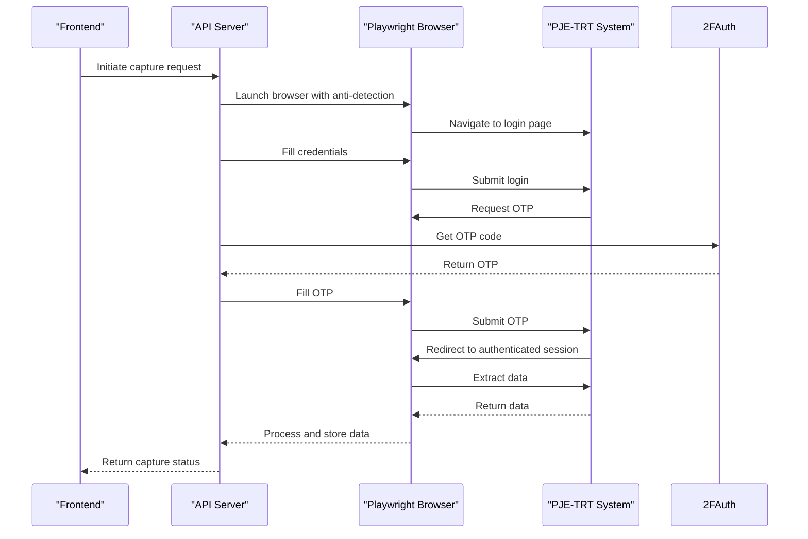
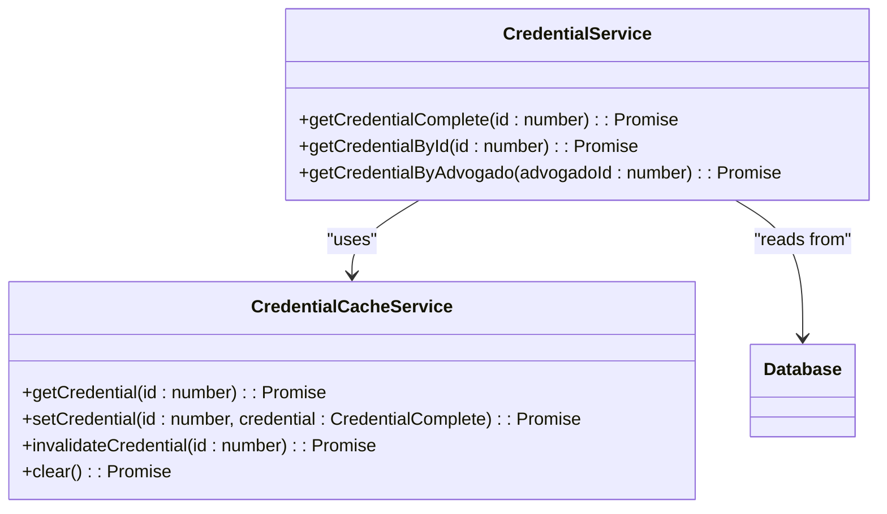
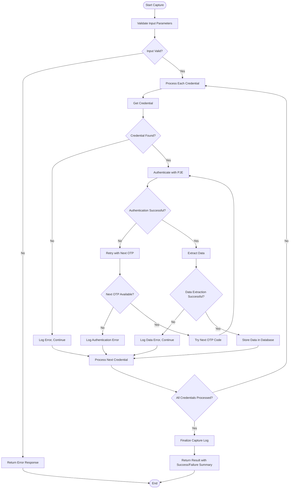
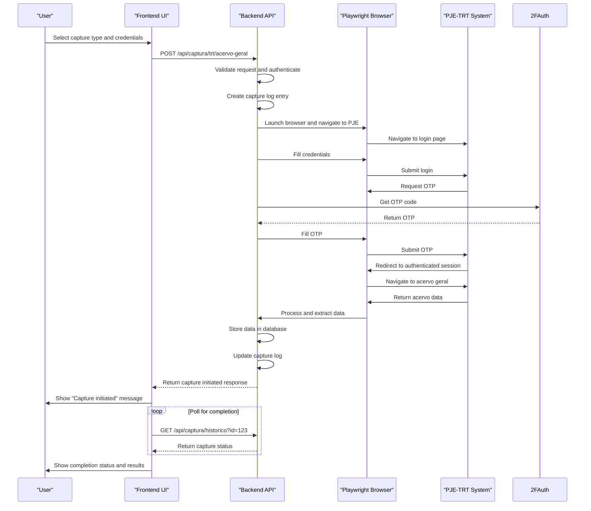
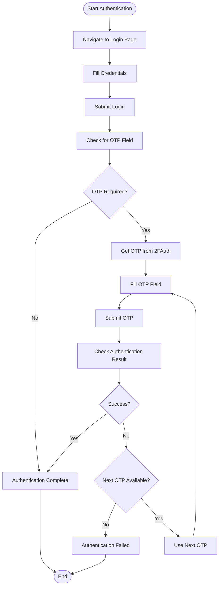
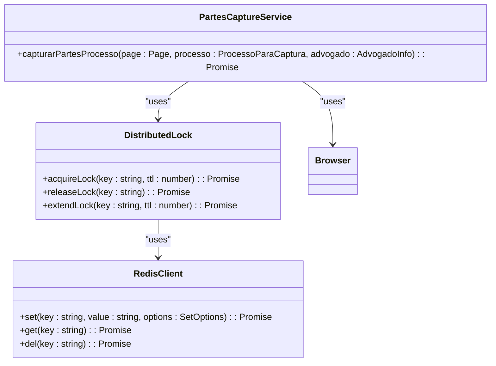

# Data Capture Endpoints

<cite>
**Referenced Files in This Document**   
- [agendamentos/route.ts](file://app/api/captura/agendamentos/route.ts)
- [credenciais/route.ts](file://app/api/captura/credenciais/route.ts)
- [historico/route.ts](file://app/api/captura/historico/route.ts)
- [trt/acervo-geral/route.ts](file://app/api/captura/trt/acervo-geral/route.ts)
- [trt/partes/route.ts](file://app/api/captura/trt/partes/route.ts)
- [trt/audiencias/route.ts](file://app/api/captura/trt/audiencias/route.ts)
- [trt/pendentes-manifestacao/route.ts](file://app/api/captura/trt/pendentes-manifestacao/route.ts)
- [trt/timeline/route.ts](file://app/api/captura/trt/timeline/route.ts)
- [credential.service.ts](file://backend/captura/credentials/credential.service.ts)
- [credential-cache.service.ts](file://backend/captura/credentials/credential-cache.service.ts)
- [trt-auth.service.ts](file://backend/captura/services/trt/trt-auth.service.ts)
- [browser-connection.service.ts](file://backend/captura/services/browser/browser-connection.service.ts)
- [captura-log.service.ts](file://backend/captura/services/captura-log.service.ts)
- [distributed-lock.ts](file://backend/utils/locks/distributed-lock.ts)
</cite>

## Table of Contents
1. [Introduction](#introduction)
2. [Capture Scheduling Endpoint](#capture-scheduling-endpoint)
3. [Credential Management Endpoint](#credential-management-endpoint)
4. [Capture History Endpoint](#capture-history-endpoint)
5. [TRT Data Extraction Endpoints](#trt-data-extraction-endpoints)
6. [Implementation Details](#implementation-details)
7. [Usage Examples](#usage-examples)
8. [Common Integration Issues](#common-integration-issues)
9. [Retry Mechanisms and Distributed Locking](#retry-mechanisms-and-distributed-locking)

## Introduction
The Sinesys system provides a comprehensive API for data capture from judicial systems, specifically designed for integration with PJE-TRT (Processo Judicial Eletrônico - Tribunal Regional do Trabalho). This documentation covers the major endpoints for data capture, including capture scheduling, credential management, capture history, and tribunal-specific data extraction. The system uses browser automation with Playwright to interact with the PJE-TRT web interface, extracting data from various sections including acervo geral (general collection), arquivados (archived cases), audiências (hearings), and partes (parties involved in cases).

The API endpoints follow a consistent pattern with authentication via bearer tokens, session authentication, or service API keys. All endpoints return JSON responses with a success flag, data object, and appropriate HTTP status codes. The system is designed to handle asynchronous processing, with immediate responses indicating that capture has been initiated and will be processed in the background.

**Section sources**
- [agendamentos/route.ts](file://app/api/captura/agendamentos/route.ts#L1-L240)
- [trt/acervo-geral/route.ts](file://app/api/captura/trt/acervo-geral/route.ts#L1-L366)

## Capture Scheduling Endpoint

The `/api/captura/agendamentos` endpoint allows users to create and manage scheduled data capture jobs. This endpoint supports both listing existing schedules and creating new ones.

### HTTP Methods and URL Patterns
- **GET** `/api/captura/agendamentos` - List capture schedules with filtering and pagination
- **POST** `/api/captura/agendamentos` - Create a new capture schedule
- **GET** `/api/captura/agendamentos/[id]` - Get details of a specific schedule
- **PUT** `/api/captura/agendamentos/[id]` - Update a specific schedule
- **DELETE** `/api/captura/agendamentos/[id]` - Delete a specific schedule
- **POST** `/api/captura/agendamentos/[id]/executar` - Manually execute a scheduled capture

### Request/Response Schemas
For GET requests, the endpoint accepts query parameters for filtering and pagination:
- `pagina` (integer) - Page number (default: 1)
- `limite` (integer) - Items per page (default: 50, maximum: 100)
- `advogado_id` (integer) - Filter by lawyer ID
- `tipo_captura` (string) - Filter by capture type (acervo_geral, arquivados, audiencias, pendentes)
- `ativo` (boolean) - Filter by active/inactive status

For POST requests, the request body must include:
```json
{
  "tipo_captura": "acervo_geral",
  "advogado_id": 1,
  "credencial_ids": [1, 2, 3],
  "periodicidade": "diario",
  "horario": "07:00",
  "ativo": true,
  "parametros_extras": {
    "dataInicio": "2024-01-01",
    "dataFim": "2024-12-31",
    "filtroPrazo": "no_prazo"
  }
}
```

The response schema includes:
```json
{
  "success": true,
  "data": {
    "id": 1,
    "tipo_captura": "acervo_geral",
    "advogado_id": 1,
    "credencial_ids": [1, 2, 3],
    "periodicidade": "diario",
    "dias_intervalo": null,
    "horario": "07:00",
    "ativo": true,
    "parametros_extras": {
      "dataInicio": "2024-01-01",
      "dataFim": "2024-12-31",
      "filtroPrazo": "no_prazo"
    },
    "proxima_execucao": "2024-01-01T07:00:00.000Z",
    "created_at": "2024-01-01T00:00:00.000Z",
    "updated_at": "2024-01-01T00:00:00.000Z"
  }
}
```

### Authentication Methods
The endpoint requires authentication via:
- Bearer token (JWT)
- Session cookie
- Service API key

### Parameters
- `tipo_captura`: The type of data to capture (acervo_geral, arquivados, audiencias, pendentes)
- `advogado_id`: The ID of the lawyer associated with the credentials
- `credencial_ids`: Array of credential IDs to use for authentication
- `periodicidade`: Frequency of capture (diario, a_cada_N_dias)
- `dias_intervalo`: Required when periodicidade is a_cada_N_dias
- `horario`: Time of day to execute the capture (HH:MM format)
- `ativo`: Whether the schedule is active
- `parametros_extras`: Additional parameters specific to the capture type

### Return Values
- **200 OK**: Successfully returned schedule(s)
- **201 Created**: Successfully created a new schedule
- **400 Bad Request**: Invalid parameters
- **401 Unauthorized**: Authentication failed
- **500 Internal Server Error**: Server error

### Usage Examples
To create a daily capture schedule:
```bash
curl -X POST https://api.sinesys.com/api/captura/agendamentos \
  -H "Authorization: Bearer YOUR_TOKEN" \
  -H "Content-Type: application/json" \
  -d '{
    "tipo_captura": "acervo_geral",
    "advogado_id": 1,
    "credencial_ids": [1, 2, 3],
    "periodicidade": "diario",
    "horario": "07:00"
  }'
```

To list all active schedules:
```bash
curl -X GET "https://api.sinesys.com/api/captura/agendamentos?ativo=true" \
  -H "Authorization: Bearer YOUR_TOKEN"
```

**Section sources**
- [agendamentos/route.ts](file://app/api/captura/agendamentos/route.ts#L1-L240)

## Credential Management Endpoint

The `/api/captura/credenciais` endpoint provides access to credential information for data capture, allowing clients to retrieve available credentials with associated lawyer and tribunal information.

### HTTP Methods and URL Patterns
- **GET** `/api/captura/credenciais` - List credentials with lawyer information

### Request/Response Schemas
The endpoint accepts an optional query parameter:
- `active` (boolean) - Filter by active status (true/false)

The response schema includes:
```json
{
  "success": true,
  "data": {
    "credenciais": [
      {
        "id": 1,
        "advogado_id": 1,
        "advogado_nome": "John Doe",
        "advogado_cpf": "12345678900",
        "advogado_oab": "12345",
        "advogado_uf_oab": "SP",
        "tribunal": "TRT3",
        "grau": "primeiro_grau",
        "active": true,
        "created_at": "2024-01-01T00:00:00.000Z",
        "updated_at": "2024-01-01T00:00:00.000Z"
      }
    ],
    "tribunais_disponiveis": ["TRT3", "TRT5"],
    "graus_disponiveis": ["primeiro_grau", "segundo_grau"]
  }
}
```

### Authentication Methods
The endpoint requires authentication via:
- Bearer token (JWT)
- Session cookie
- Service API key

### Parameters
- `active`: Optional filter to return only active or inactive credentials

### Return Values
- **200 OK**: Successfully returned credentials
- **401 Unauthorized**: Authentication failed
- **500 Internal Server Error**: Server error

### Usage Examples
To retrieve all credentials:
```bash
curl -X GET https://api.sinesys.com/api/captura/credenciais \
  -H "Authorization: Bearer YOUR_TOKEN"
```

To retrieve only active credentials:
```bash
curl -X GET "https://api.sinesys.com/api/captura/credenciais?active=true" \
  -H "Authorization: Bearer YOUR_TOKEN"
```

**Section sources**
- [credenciais/route.ts](file://app/api/captura/credenciais/route.ts#L1-L173)

## Capture History Endpoint

The `/api/captura/historico` endpoint provides access to the history of completed and in-progress data capture operations, allowing users to monitor and audit capture activities.

### HTTP Methods and URL Patterns
- **GET** `/api/captura/historico` - List capture history with filtering and pagination
- **GET** `/api/captura/historico/[id]` - Get details of a specific capture operation

### Request/Response Schemas
The endpoint accepts query parameters for filtering and pagination:
- `pagina` (integer) - Page number (default: 1)
- `limite` (integer) - Items per page (default: 50, maximum: 100)
- `tipo_captura` (string) - Filter by capture type (acervo_geral, arquivados, audiencias, pendentes)
- `advogado_id` (integer) - Filter by lawyer ID
- `status` (string) - Filter by status (pending, in_progress, completed, failed)
- `data_inicio` (string) - Filter by start date (YYYY-MM-DD)
- `data_fim` (string) - Filter by end date (YYYY-MM-DD)

The response schema includes:
```json
{
  "success": true,
  "data": {
    "capturas": [
      {
        "id": 1,
        "tipo_captura": "acervo_geral",
        "advogado_id": 1,
        "credencial_ids": [1, 2, 3],
        "status": "completed",
        "resultado": {
          "credenciais_processadas": 3,
          "resultados": [
            {
              "credencial_id": 1,
              "tribunal": "TRT3",
              "grau": "primeiro_grau",
              "resultado": {
                "total": 150,
                "processos": [...]
              }
            }
          ]
        },
        "erro": null,
        "iniciado_em": "2024-01-01T07:00:00.000Z",
        "concluido_em": "2024-01-01T07:15:00.000Z"
      }
    ],
    "total": 1,
    "pagina": 1,
    "limite": 50,
    "totalPaginas": 1
  }
}
```

### Authentication Methods
The endpoint requires authentication via:
- Bearer token (JWT)
- Session cookie
- Service API key

### Parameters
- `tipo_captura`: Filter by capture type
- `advogado_id`: Filter by lawyer ID
- `status`: Filter by capture status
- `data_inicio` and `data_fim`: Filter by date range

### Return Values
- **200 OK**: Successfully returned capture history
- **401 Unauthorized**: Authentication failed
- **500 Internal Server Error**: Server error

### Usage Examples
To retrieve recent capture history:
```bash
curl -X GET "https://api.sinesys.com/api/captura/historico?pagina=1&limite=10" \
  -H "Authorization: Bearer YOUR_TOKEN"
```

To retrieve failed captures from the last week:
```bash
curl -X GET "https://api.sinesys.com/api/captura/historico?status=failed&data_inicio=2024-01-01" \
  -H "Authorization: Bearer YOUR_TOKEN"
```

**Section sources**
- [historico/route.ts](file://app/api/captura/historico/route.ts#L1-L160)

## TRT Data Extraction Endpoints

The Sinesys system provides several endpoints under `/api/captura/trt/` for extracting specific types of data from the PJE-TRT system. These endpoints use browser automation to interact with the PJE-TRT web interface and extract data.

### Acervo Geral Endpoint
The `/api/captura/trt/acervo-geral` endpoint extracts general case data from the PJE-TRT system.

**HTTP Method**: POST
**URL Pattern**: `/api/captura/trt/acervo-geral`

**Request Schema**:
```json
{
  "advogado_id": 1,
  "credencial_ids": [1, 2, 3]
}
```

**Response Schema**:
```json
{
  "success": true,
  "message": "Captura iniciada com sucesso",
  "status": "in_progress",
  "capture_id": 123,
  "data": {
    "credenciais_processadas": 3,
    "message": "A captura está sendo processada em background. Consulte o histórico para acompanhar o progresso."
  }
}
```

### Partes Endpoint
The `/api/captura/trt/partes` endpoint extracts information about parties involved in cases, including clients, opposing parties, and third parties.

**HTTP Method**: POST
**URL Pattern**: `/api/captura/trt/partes`

**Request Schema**:
```json
{
  "advogado_id": 1,
  "credencial_ids": [5, 6],
  "processo_ids": [100, 101, 102],
  "trts": ["TRT3", "TRT5"],
  "graus": ["primeiro_grau"]
}
```

**Response Schema**:
```json
{
  "success": true,
  "message": "Captura de partes concluída",
  "data": {
    "total_processos": 5,
    "total_partes": 25,
    "clientes": 3,
    "partes_contrarias": 15,
    "terceiros": 7,
    "representantes": 12,
    "vinculos": 25,
    "erros": [],
    "duracao_ms": 12500
  }
}
```

### Audiências Endpoint
The `/api/captura/trt/audiencias` endpoint extracts hearing data from the PJE-TRT system.

**HTTP Method**: POST
**URL Pattern**: `/api/captura/trt/audiencias`

**Request Schema**:
```json
{
  "advogado_id": 1,
  "credencial_ids": [1, 2, 3],
  "dataInicio": "2024-01-01",
  "dataFim": "2024-12-31",
  "status": "M"
}
```

### Pendentes de Manifestação Endpoint
The `/api/captura/trt/pendentes-manifestacao` endpoint extracts cases pending manifestation from the PJE-TRT system.

**HTTP Method**: POST
**URL Pattern**: `/api/captura/trt/pendentes-manifestacao`

**Request Schema**:
```json
{
  "advogado_id": 1,
  "credencial_ids": [1, 2, 3],
  "filtrosPrazo": ["sem_prazo", "no_prazo"]
}
```

### Timeline Endpoint
The `/api/captura/trt/timeline` endpoint extracts the complete timeline of a specific case, including movements and documents.

**HTTP Method**: POST
**URL Pattern**: `/api/captura/trt/timeline`

**Request Schema**:
```json
{
  "trtCodigo": "TRT3",
  "grau": "primeiro_grau",
  "processoId": "2887163",
  "numeroProcesso": "0010702-80.2025.5.03.0111",
  "advogadoId": 1,
  "baixarDocumentos": true,
  "filtroDocumentos": {
    "apenasAssinados": true,
    "apenasNaoSigilosos": true
  }
}
```

**Response Schema**:
```json
{
  "success": true,
  "data": {
    "timeline": [...],
    "totalItens": 190,
    "totalDocumentos": 61,
    "totalMovimentos": 129,
    "documentosBaixados": [...],
    "totalBaixadosSucesso": 61,
    "totalErros": 0,
    "mongoId": "6743f8a5e8c2d1234567890a"
  }
}
```

### Common Parameters
All TRT endpoints require:
- `advogado_id`: The ID of the lawyer
- `credencial_ids`: Array of credential IDs for authentication

### Return Values
All TRT endpoints return:
- **200 OK**: Capture initiated successfully (asynchronous)
- **400 Bad Request**: Missing or invalid parameters
- **401 Unauthorized**: Authentication failed
- **404 Not Found**: Credential or configuration not found
- **500 Internal Server Error**: Server error

**Section sources**
- [trt/acervo-geral/route.ts](file://app/api/captura/trt/acervo-geral/route.ts#L1-L366)
- [trt/partes/route.ts](file://app/api/captura/trt/partes/route.ts#L1-L800)
- [trt/audiencias/route.ts](file://app/api/captura/trt/audiencias/route.ts#L1-L425)
- [trt/pendentes-manifestacao/route.ts](file://app/api/captura/trt/pendentes-manifestacao/route.ts#L1-L467)
- [trt/timeline/route.ts](file://app/api/captura/trt/timeline/route.ts#L1-L212)

## Implementation Details

### Browser Automation
The Sinesys system uses Playwright for browser automation to interact with the PJE-TRT web interface. The implementation uses Firefox as the browser engine, with both local and remote execution options:

- **Local Development**: Uses locally installed Firefox
- **Production**: Connects to a remote browser via Browserless (Chromium)

The browser automation includes several anti-detection measures to prevent the PJE-TRT system from identifying automated access:



**Diagram sources**
- [trt-auth.service.ts](file://backend/captura/services/trt/trt-auth.service.ts#L1-L603)
- [browser-connection.service.ts](file://backend/captura/services/browser/browser-connection.service.ts#L1-L50)

### Credential Caching
The system implements credential caching to improve performance and reduce database queries. Credentials are cached using a service that manages both in-memory and persistent storage:



**Diagram sources**
- [credential.service.ts](file://backend/captura/credentials/credential.service.ts#L1-L150)
- [credential-cache.service.ts](file://backend/captura/credentials/credential-cache.service.ts#L1-L100)

### Error Recovery Mechanisms
The system includes comprehensive error recovery mechanisms to handle common issues encountered during data capture:

1. **OTP Retry Logic**: When an OTP code fails, the system automatically tries the next valid code from the 2FAuth service
2. **Network Error Retry**: Network errors during SSO login are retried with exponential backoff
3. **Session Recovery**: Failed authentication attempts trigger session cleanup and retry
4. **Partial Success Handling**: When processing multiple credentials, failures in one credential do not prevent processing of others

The error recovery flow is implemented as follows:



**Diagram sources**
- [trt-auth.service.ts](file://backend/captura/services/trt/trt-auth.service.ts#L1-L603)
- [captura-log.service.ts](file://backend/captura/services/captura-log.service.ts#L1-L200)

## Usage Examples

### Frontend Capture Interface Interaction
The frontend capture interface interacts with the backend services to initiate automated data extraction. The typical flow is:



**Diagram sources**
- [trt/acervo-geral/route.ts](file://app/api/captura/trt/acervo-geral/route.ts#L1-L366)
- [historico/route.ts](file://app/api/captura/historico/route.ts#L1-L160)

### API Usage Patterns
Common API usage patterns include:

1. **Scheduled Capture**: Create a schedule that runs daily to capture new cases
2. **On-Demand Capture**: Manually trigger capture for specific credentials
3. **Bulk Capture**: Initiate capture for multiple credentials simultaneously
4. **Targeted Capture**: Capture data for specific cases or date ranges

Example of a complete capture workflow:
```javascript
// 1. Get available credentials
const credentials = await fetch('/api/captura/credenciais', {
  headers: { 'Authorization': 'Bearer ' + token }
}).then(r => r.json());

// 2. Initiate capture for all credentials
const captureResponse = await fetch('/api/captura/trt/acervo-geral', {
  method: 'POST',
  headers: { 
    'Authorization': 'Bearer ' + token,
    'Content-Type': 'application/json'
  },
  body: JSON.stringify({
    advogado_id: 1,
    credencial_ids: credentials.data.credenciais.map(c => c.id)
  })
});

// 3. Get capture ID for monitoring
const { capture_id } = await captureResponse.json();

// 4. Poll for completion
let status = 'in_progress';
while (status === 'in_progress') {
  await new Promise(resolve => setTimeout(resolve, 5000));
  const history = await fetch(`/api/captura/historico/${capture_id}`, {
    headers: { 'Authorization': 'Bearer ' + token }
  }).then(r => r.json());
  status = history.data.status;
}

console.log('Capture completed:', status);
```

**Section sources**
- [agendamentos/route.ts](file://app/api/captura/agendamentos/route.ts#L1-L240)
- [trt/acervo-geral/route.ts](file://app/api/captura/trt/acervo-geral/route.ts#L1-L366)
- [historico/route.ts](file://app/api/captura/historico/route.ts#L1-L160)

## Common Integration Issues

### CAPTCHA Challenges
The PJE-TRT system may present CAPTCHA challenges during authentication. The current implementation does not handle CAPTCHA automatically, which can cause capture failures. When a CAPTCHA is encountered:

1. The authentication process will fail
2. An error will be logged in the capture history
3. The system will not automatically retry

**Mitigation Strategies**:
- Implement CAPTCHA solving service integration
- Use dedicated IP addresses with trusted reputation
- Implement human-in-the-loop verification for initial authentication
- Cache successful authentication sessions for longer periods

### Session Timeouts
Session timeouts can occur when the capture process takes longer than the PJE-TRT session timeout period (typically 30 minutes). This can result in:

1. Authentication errors during long-running captures
2. Partial data extraction
3. Incomplete capture logs

**Mitigation Strategies**:
- Implement session refresh mechanism during long captures
- Break large captures into smaller batches
- Implement automatic re-authentication when session expires
- Optimize data extraction to reduce processing time

### Network Connectivity Problems
Network issues between the Sinesys server and PJE-TRT can cause capture failures. Common symptoms include:

1. Connection timeouts
2. SSL/TLS handshake failures
3. Intermittent connectivity
4. DNS resolution issues

**Mitigation Strategies**:
- Implement exponential backoff retry logic
- Use multiple network paths or CDN
- Implement circuit breaker pattern
- Monitor network health and failover to backup connections

### Error Codes and Troubleshooting
Common error codes and their meanings:

| Error Code | Meaning | Recommended Action |
|-----------|-------|-------------------|
| 400 Bad Request | Missing or invalid parameters | Validate request payload |
| 401 Unauthorized | Authentication failed | Check token validity and permissions |
| 404 Not Found | Credential or configuration not found | Verify credential IDs and tribunal configuration |
| 500 Internal Server Error | Server-side error | Check server logs and retry |
| OTP_INVALID | Invalid OTP code | Wait for next code and retry |
| SESSION_EXPIRED | Authentication session expired | Re-authenticate and retry |
| NETWORK_ERROR | Network connectivity issue | Check network connection and retry |

**Section sources**
- [trt-auth.service.ts](file://backend/captura/services/trt/trt-auth.service.ts#L1-L603)
- [trt/acervo-geral/route.ts](file://app/api/captura/trt/acervo-geral/route.ts#L1-L366)

## Retry Mechanisms and Distributed Locking

### Retry Mechanisms
The system implements several retry mechanisms to ensure reliable data capture:

1. **OTP Retry**: When an OTP code fails, the system automatically tries the next valid code
2. **Network Retry**: Network errors during SSO login are retried with exponential backoff
3. **Authentication Retry**: Failed authentication attempts trigger session cleanup and retry
4. **Capture Retry**: Failed captures can be retried manually or through scheduled jobs

The retry logic is implemented in the authentication service:



**Diagram sources**
- [trt-auth.service.ts](file://backend/captura/services/trt/trt-auth.service.ts#L1-L603)

### Distributed Locking
The system uses distributed locking to prevent race conditions when multiple instances attempt to capture the same data simultaneously. This is particularly important for the partes endpoint, which processes individual cases.

The distributed locking strategy uses Redis to manage locks:



**Diagram sources**
- [distributed-lock.ts](file://backend/utils/locks/distributed-lock.ts#L1-L150)
- [partes/route.ts](file://app/api/captura/trt/partes/route.ts#L1-L800)

The locking mechanism works as follows:
1. Before processing a case, the system attempts to acquire a lock with the key `captura:processo:${processo.id}`
2. If the lock is acquired, the system proceeds with data extraction
3. If the lock cannot be acquired, the system skips the case (assuming another instance is processing it)
4. The lock is automatically released after a TTL (time-to-live) period
5. The lock can be extended if the processing takes longer than expected

This ensures that:
- No two instances process the same case simultaneously
- Failed captures do not block future attempts (due to TTL)
- System remains available even if an instance crashes during processing

**Section sources**
- [distributed-lock.ts](file://backend/utils/locks/distributed-lock.ts#L1-L150)
- [partes/route.ts](file://app/api/captura/trt/partes/route.ts#L1-L800)