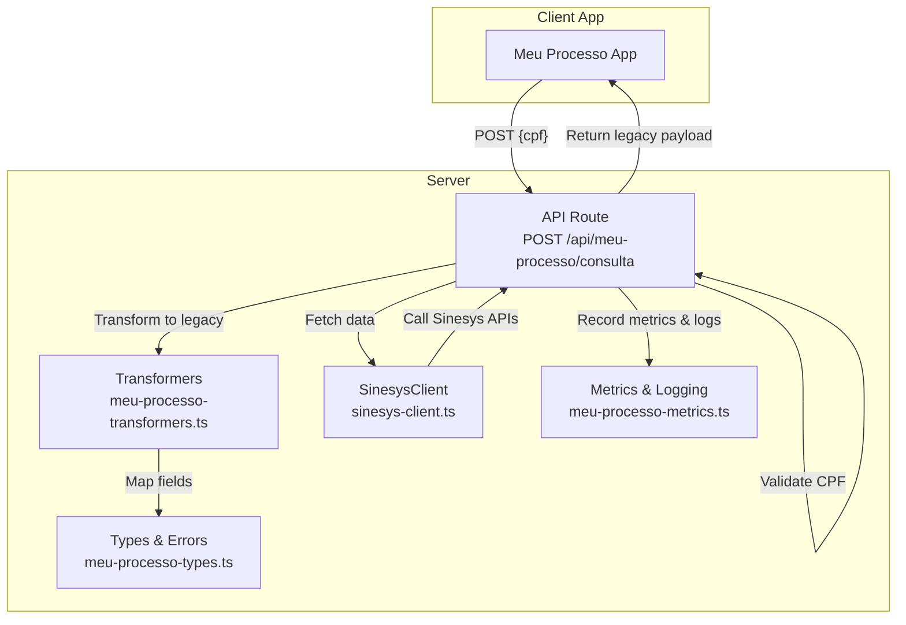
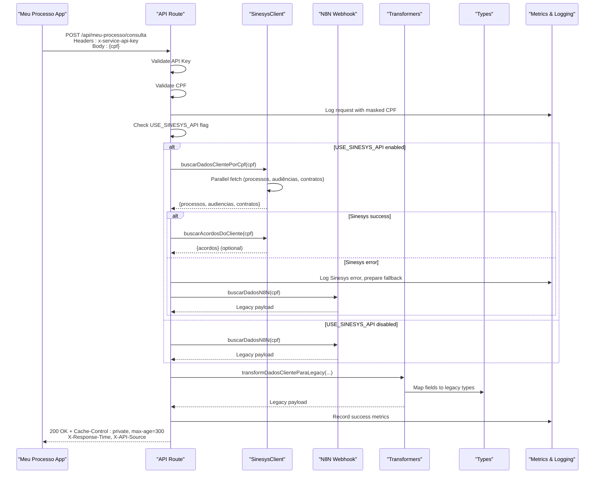
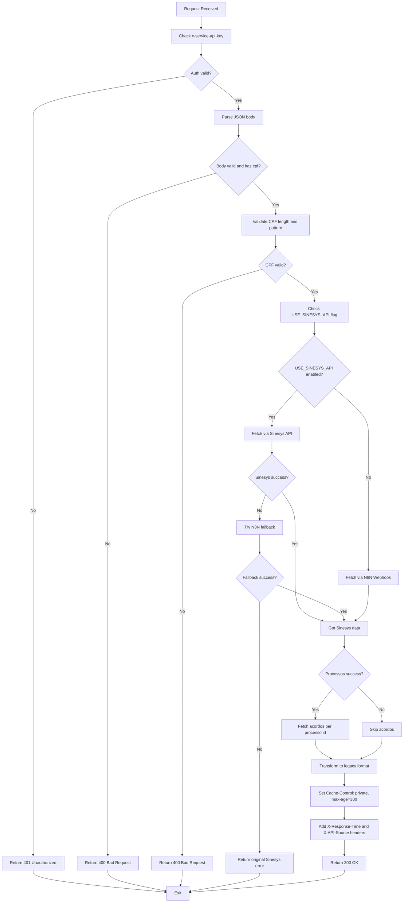
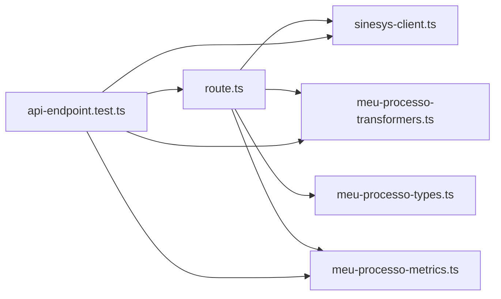

# Meu Processo Consulta Endpoint

<cite>
**Referenced Files in This Document**
- [route.ts](file://app/api/meu-processo/consulta/route.ts)
- [meu-processo-transformers.ts](file://lib/transformers/meu-processo-transformers.ts)
- [sinesys-client.ts](file://lib/services/sinesys-client.ts)
- [meu-processo-types.ts](file://lib/types/meu-processo-types.ts)
- [meu-processo-metrics.ts](file://lib/services/meu-processo-metrics.ts)
</cite>

## Update Summary
**Changes Made**
- Updated documentation to reflect implementation of feature flag for Sinesys API usage
- Added details on fallback mechanism to N8N webhook
- Incorporated configurable timeout and retry settings
- Updated response caching configuration details
- Enhanced logging with source and timing headers for monitoring and debugging
- Revised architecture overview and component analysis to reflect new implementation
- Added new sections for metrics and fallback behavior

## Table of Contents
1. [Introduction](#introduction)
2. [Project Structure](#project-structure)
3. [Core Components](#core-components)
4. [Architecture Overview](#architecture-overview)
5. [Detailed Component Analysis](#detailed-component-analysis)
6. [Dependency Analysis](#dependency-analysis)
7. [Performance Considerations](#performance-considerations)
8. [Troubleshooting Guide](#troubleshooting-guide)
9. [Conclusion](#conclusion)

## Introduction
This document describes the Meu Processo Consulta Endpoint, a server-side API that aggregates client-related data from the Sinesys platform and returns it in a legacy-compatible format for the Meu Processo client app. It focuses on:
- Endpoint behavior and request/response contracts
- Authentication and validation
- Data aggregation and transformation pipeline
- Error handling and caching
- Testing coverage and operational guidance

The endpoint has been updated to include a feature flag for Sinesys API usage, a fallback mechanism to N8N webhook, configurable timeout and retry settings, response caching configuration, and enhanced logging with source and timing headers for monitoring and debugging.

## Project Structure
The Meu Processo Consulta Endpoint is implemented as a Next.js API Route under the app layer and integrates with shared libraries for typing, transformation, and Sinesys client operations.

**Diagram sources**
- [route.ts](file://app/api/meu-processo/consulta/route.ts#L1-L342)
- [meu-processo-transformers.ts](file://lib/transformers/meu-processo-transformers.ts#L1-L361)
- [meu-processo-types.ts](file://lib/types/meu-processo-types.ts#L1-L328)
- [sinesys-client.ts](file://lib/services/sinesys-client.ts#L1-L373)
- [meu-processo-metrics.ts](file://lib/services/meu-processo-metrics.ts#L1-L375)

**Section sources**
- [route.ts](file://app/api/meu-processo/consulta/route.ts#L1-L342)
- [README.md](file://app/api/meu-processo/README.md#L1-L254)

## Core Components
- API Route: Validates authentication and request body, orchestrates data fetching, and returns a legacy-compatible response.
- SinesysClient: Encapsulates HTTP requests to Sinesys, retries, timeouts, and error mapping.
- Transformers: Converts Sinesys responses into the legacy format expected by the Meu Processo app.
- Types: Defines request/response shapes for Sinesys and the legacy format, plus error types.
- Metrics & Logging: Provides enhanced logging with source and timing headers, and metrics collection for monitoring.

**Section sources**
- [route.ts](file://app/api/meu-processo/consulta/route.ts#L1-L342)
- [sinesys-client.ts](file://lib/services/sinesys-client.ts#L1-L373)
- [meu-processo-transformers.ts](file://lib/transformers/meu-processo-transformers.ts#L1-L361)
- [meu-processo-types.ts](file://lib/types/meu-processo-types.ts#L1-L328)
- [meu-processo-metrics.ts](file://lib/services/meu-processo-metrics.ts#L1-L375)

## Architecture Overview
The endpoint performs the following steps:
1. Authenticate via a service API key header.
2. Validate the CPF in the request body.
3. Check feature flag to determine primary data source (Sinesys API or N8N webhook).
4. Fetch client data from Sinesys (processos, audiências, contratos) in parallel if feature flag is enabled.
5. On Sinesys API failure, fallback to N8N webhook.
6. Optionally fetch acordos/condenações per processos if available.
7. Transform aggregated data into the legacy format.
8. Return a cached response with appropriate headers including source and timing information.

**Diagram sources**
- [route.ts](file://app/api/meu-processo/consulta/route.ts#L50-L342)
- [sinesys-client.ts](file://lib/services/sinesys-client.ts#L274-L356)
- [meu-processo-transformers.ts](file://lib/transformers/meu-processo-transformers.ts#L307-L361)
- [meu-processo-types.ts](file://lib/types/meu-processo-types.ts#L1-L328)
- [meu-processo-metrics.ts](file://lib/services/meu-processo-metrics.ts#L1-L375)

## Detailed Component Analysis

### API Route: POST /api/meu-processo/consulta
Responsibilities:
- Authentication: checks the presence and correctness of the service API key header.
- Validation: ensures the request body is valid JSON and contains a properly formatted CPF.
- Feature flag management: determines whether to use Sinesys API or N8N webhook as primary data source.
- Fallback mechanism: automatically switches to N8N webhook on Sinesys API failure.
- Data orchestration: calls SinesysClient to fetch processos, audiências, contratos, and optionally acordos/condenações.
- Transformation: converts the collected data into the legacy format.
- Response: returns a cached response with enhanced headers and handles errors gracefully.

Key behaviors:
- Authentication failure returns 401 with an error message.
- Invalid or missing CPF returns 400 with an error message.
- Body parsing failures return 400 with an error message.
- Sinesys API errors trigger fallback to N8N webhook when enabled.
- Graceful degradation: acordos are fetched only if processos are available; failures are logged and ignored to keep the response.
- Enhanced response headers include X-Response-Time and X-API-Source for monitoring.

Caching:
- Response includes Cache-Control: private, max-age=300 (configurable via MEU_PROCESSO_CACHE_TTL).

Max execution duration:
- The route enforces a 30-second maximum runtime (configurable via maxDuration).

**Section sources**
- [route.ts](file://app/api/meu-processo/consulta/route.ts#L1-L342)
- [README.md](file://app/api/meu-processo/README.md#L173-L207)

### SinesysClient
Responsibilities:
- Provides high-level methods to fetch data from Sinesys by CPF.
- Implements retry with exponential backoff and configurable timeout.
- Wraps HTTP errors into typed SinesysAPIError exceptions.
- Aggregates client data in parallel and returns unified payloads.
- Optionally fetches acordos per processos and aggregates them.
- Configurable via environment variables (timeout, retries).

Notable methods:
- buscarDadosClientePorCpf(cpf): parallel fetch of processos, audiências, and contratos.
- buscarAcordosDoCliente(cpf): fetches acordos for each processos' id.
- buscarContratosPorCpf(cpf): resolves client id from CPF and fetches contracts.
- requestWithRetry: implements retry logic with exponential backoff.

Configuration:
- Timeout: configurable via SINESYS_TIMEOUT environment variable (default: 30000ms)
- Retries: configurable via SINESYS_RETRIES environment variable (default: 2)

**Section sources**
- [sinesys-client.ts](file://lib/services/sinesys-client.ts#L1-L373)

### Transformers: Legacy Mapping
Responsibilities:
- Convert Sinesys responses into the legacy format used by the Meu Processo app.
- Extract jurisdiction state/municipality from tribunal/vara.
- Flatten acordos into individual parcel rows.
- Aggregate multiple datasets into a single legacy payload.

Key transformations:
- Processos: map tribunal, número, partes, instâncias, and timeline to legacy structure.
- Audiências: combine data + horario into a single datetime string and map local/link.
- Contratos: map client and contract fields to legacy shape.
- Acordos/Condenações: expand parcelas into separate rows with repeated metadata.

**Section sources**
- [meu-processo-transformers.ts](file://lib/transformers/meu-processo-transformers.ts#L1-L361)

### Types and Error Handling
- Sinesys types define request/response shapes for processos, audiências, contratos, acordos, and timelines.
- Legacy types define the output structure expected by the Meu Processo app.
- SinesysAPIError encapsulates HTTP errors with status, code, and details.
- SinesysClientConfig defines configuration options for timeout and retries.

**Section sources**
- [meu-processo-types.ts](file://lib/types/meu-processo-types.ts#L1-L328)

### Metrics and Logging
Responsibilities:
- Collect and store request metrics including duration, success rate, and data counts.
- Provide structured logging with masked CPF for privacy.
- Track API source (sinesys, n8n, fallback) for monitoring.
- Generate performance statistics and alerts.
- Implement timer utility for measuring execution time.

Key features:
- Request metrics include CPF (masked), API source, duration, success status, and data counts.
- Structured logging with different log levels (debug, info, warn, error).
- Performance metrics include P95/P99 latency, error rates, and source distribution.
- Alert conditions for high error rates, high latency, and frequent fallback usage.
- Timer class for measuring execution time.

**Section sources**
- [meu-processo-metrics.ts](file://lib/services/meu-processo-metrics.ts#L1-L375)

### API Flow and Decision Logic

**Diagram sources**
- [route.ts](file://app/api/meu-processo/consulta/route.ts#L50-L342)
- [sinesys-client.ts](file://lib/services/sinesys-client.ts#L274-L356)
- [meu-processo-transformers.ts](file://lib/transformers/meu-processo-transformers.ts#L307-L361)
- [meu-processo-metrics.ts](file://lib/services/meu-processo-metrics.ts#L1-L375)

## Dependency Analysis
The endpoint depends on:
- SinesysClient for external API calls.
- Transformers for data mapping.
- Types for compile-time safety and runtime validation.
- Metrics & Logging for monitoring and debugging.
- Tests for integration verification.

**Diagram sources**
- [route.ts](file://app/api/meu-processo/consulta/route.ts#L1-L342)
- [sinesys-client.ts](file://lib/services/sinesys-client.ts#L1-L373)
- [meu-processo-transformers.ts](file://lib/transformers/meu-processo-transformers.ts#L1-L361)
- [meu-processo-types.ts](file://lib/types/meu-processo-types.ts#L1-L328)
- [meu-processo-metrics.ts](file://lib/services/meu-processo-metrics.ts#L1-L375)
- [api-endpoint.test.ts](file://tests/integration/meu-processo/api-endpoint.test.ts#L1-L601)

**Section sources**
- [route.ts](file://app/api/meu-processo/consulta/route.ts#L1-L342)
- [sinesys-client.ts](file://lib/services/sinesys-client.ts#L1-L373)
- [meu-processo-transformers.ts](file://lib/transformers/meu-processo-transformers.ts#L1-L361)
- [meu-processo-types.ts](file://lib/types/meu-processo-types.ts#L1-L328)
- [meu-processo-metrics.ts](file://lib/services/meu-processo-metrics.ts#L1-L375)
- [api-endpoint.test.ts](file://tests/integration/meu-processo/api-endpoint.test.ts#L1-L601)

## Performance Considerations
- Parallelization: The client fetches processos, audiências, and contratos concurrently to reduce latency.
- Retries: Automatic retry with exponential backoff reduces transient failures (configurable via SINESYS_RETRIES).
- Timeout: Configurable timeout prevents long-running requests (configurable via SINESYS_TIMEOUT).
- Caching: Response includes Cache-Control to enable client-side caching for up to 5 minutes (configurable via MEU_PROCESSO_CACHE_TTL).
- Graceful fallback: Acordos are fetched only when processos are available; failures are handled without blocking the response.
- Enhanced monitoring: Response headers include X-Response-Time and X-API-Source for performance tracking and debugging.
- Memory-efficient metrics: In-memory storage with limited retention (1000 requests) to prevent memory leaks.

## Troubleshooting Guide
Common issues and resolutions:
- 401 Unauthorized: Ensure the x-service-api-key header matches the configured SERVICE_API_KEY.
- 400 Bad Request:
  - Missing or invalid JSON body.
  - Missing or invalid CPF (must be 11 digits; repeated sequences are rejected).
- 500 Internal Server Error:
  - Sinesys API errors may trigger fallback to N8N; check logs for details.
  - Unexpected exceptions return a generic error message; check server logs.
- No data returned:
  - If both processos and audiências are unavailable, a message indicates no data was found for the CPF.
  - Contratos may be returned as a string indicating absence when no records are found.
- Fallback usage: Check X-API-Source header to determine if response came from Sinesys API (sinesys), N8N (n8n), or fallback (fallback).

Operational tips:
- Masked logging: CPFs are partially masked in logs for privacy.
- Max execution: The route enforces a 30-second limit; long-running queries may be aborted.
- Monitoring: Use X-Response-Time header to track performance.
- Alerting: Monitor for high fallback rates (indicating Sinesys API issues) and high error rates.
- Configuration: Adjust timeout and retry settings via environment variables based on production performance.

**Section sources**
- [route.ts](file://app/api/meu-processo/consulta/route.ts#L50-L342)
- [README.md](file://app/api/meu-processo/README.md#L106-L129)

## Conclusion
The Meu Processo Consulta Endpoint provides a robust, authenticated, and cache-aware integration with Sinesys, transforming heterogeneous data into a legacy-compatible format for the client app. Its design emphasizes reliability through parallelization, retries, and graceful error handling, while maintaining strong typing and comprehensive testing.

The recent updates enhance the endpoint with a feature flag for Sinesys API usage, a fallback mechanism to N8N webhook, configurable timeout and retry settings, response caching configuration, and enhanced logging with source and timing headers for monitoring and debugging. These improvements increase system resilience, provide better observability, and allow for gradual migration from the legacy N8N webhook to the modern Sinesys API.