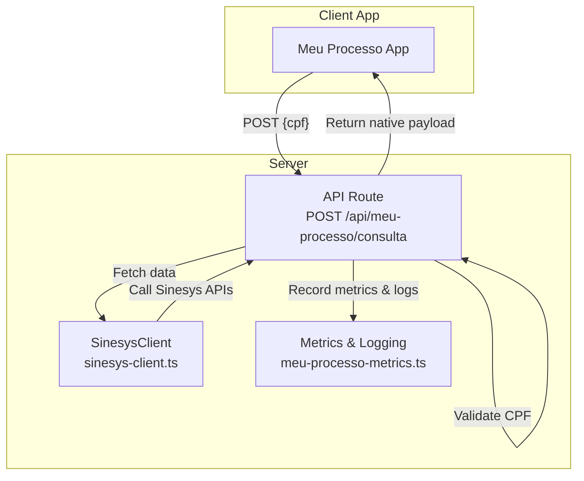
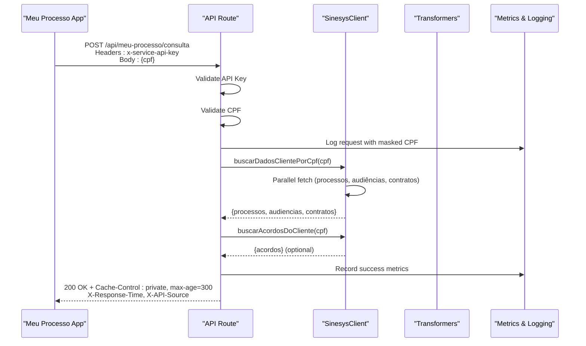
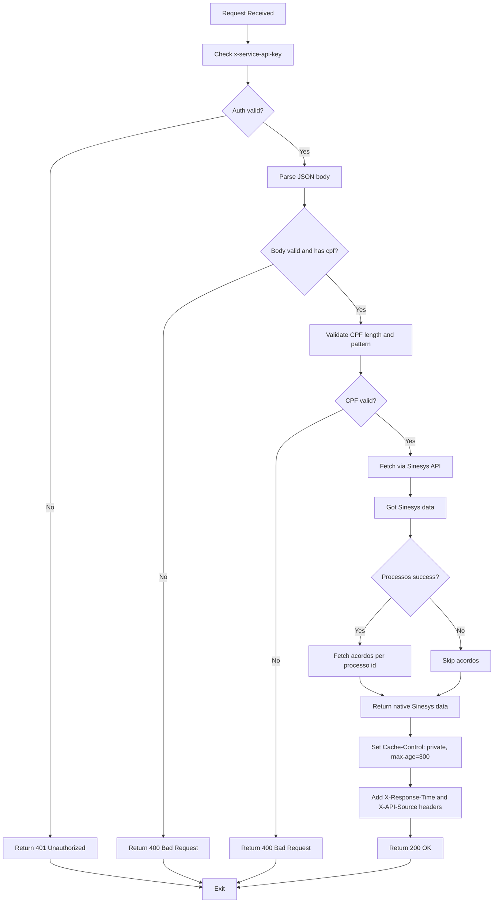
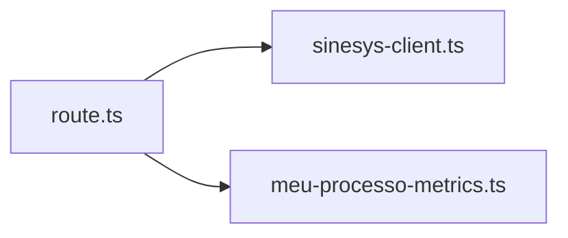

# Meu Processo Consulta Endpoint

<cite>
**Referenced Files in This Document**
- [route.ts](file://app/api/meu-processo/consulta/route.ts)
- [sinesys-client.ts](file://lib/services/sinesys-client.ts)
- [meu-processo-metrics.ts](file://lib/services/meu-processo-metrics.ts)
- [REFATORAÇÃO-MEU-PROCESSO-CONCLUÍDA.md](file://REFATORAÇÃO-MEU-PROCESSO-CONCLUÍDA.md)
</cite>

## Update Summary
**Changes Made**
- Removed legacy N8N webhook fallback mechanism and associated transformers
- Updated endpoint to return native Sinesys API data directly
- Simplified architecture by eliminating feature flags and fallback logic
- Updated documentation to reflect final state of refactoring
- Removed references to deprecated components and configurations
- Updated performance and troubleshooting sections to match current implementation

## Table of Contents
1. [Introduction](#introduction)
2. [Project Structure](#project-structure)
3. [Core Components](#core-components)
4. [Architecture Overview](#architecture-overview)
5. [Detailed Component Analysis](#detailed-component-analysis)
6. [Dependency Analysis](#dependency-analysis)
7. [Performance Considerations](#performance-considerations)
8. [Troubleshooting Guide](#troubleshooting-guide)
9. [Conclusion](#conclusion)

## Introduction
This document describes the Meu Processo Consulta Endpoint, a server-side API that aggregates client-related data from the Sinesys platform and returns it in its native format. The endpoint has been refactored to remove the legacy N8N webhook fallback mechanism and associated data transformers. It now directly returns native Sinesys API data without any transformation.

The endpoint focuses on:
- Endpoint behavior and request/response contracts
- Authentication and validation
- Data aggregation from Sinesys APIs
- Error handling and caching
- Performance considerations and operational guidance

## Project Structure
The Meu Processo Consulta Endpoint is implemented as a Next.js API Route under the app layer and integrates with shared libraries for typing, Sinesys client operations, and metrics.

**Diagram sources**
- [route.ts](file://app/api/meu-processo/consulta/route.ts#L1-L206)
- [sinesys-client.ts](file://lib/services/sinesys-client.ts#L1-L373)
- [meu-processo-metrics.ts](file://lib/services/meu-processo-metrics.ts#L1-L375)

**Section sources**
- [route.ts](file://app/api/meu-processo/consulta/route.ts#L1-L206)
- [REFATORAÇÃO-MEU-PROCESSO-CONCLUÍDA.md](file://REFATORAÇÃO-MEU-PROCESSO-CONCLUÍDA.md#L1-L363)

## Core Components
- API Route: Validates authentication and request body, orchestrates data fetching, and returns a native Sinesys response.
- SinesysClient: Encapsulates HTTP requests to Sinesys, retries, timeouts, and error mapping.
- Types: Defines request/response shapes for Sinesys APIs.
- Metrics & Logging: Provides structured logging and metrics collection for monitoring.

**Section sources**
- [route.ts](file://app/api/meu-processo/consulta/route.ts#L1-L206)
- [sinesys-client.ts](file://lib/services/sinesys-client.ts#L1-L373)
- [meu-processo-metrics.ts](file://lib/services/meu-processo-metrics.ts#L1-L375)

## Architecture Overview
The endpoint performs the following steps:
1. Authenticate via a service API key header.
2. Validate the CPF in the request body.
3. Fetch client data from Sinesys (processos, audiências, contratos) in parallel.
4. Optionally fetch acordos/condenações per processo if available.
5. Return the aggregated native Sinesys data with appropriate headers.

**Diagram sources**
- [route.ts](file://app/api/meu-processo/consulta/route.ts#L58-L206)
- [sinesys-client.ts](file://lib/services/sinesys-client.ts#L274-L356)
- [meu-processo-metrics.ts](file://lib/services/meu-processo-metrics.ts#L1-L375)

## Detailed Component Analysis

### API Route: POST /api/meu-processo/consulta
Responsibilities:
- Authentication: checks the presence and correctness of the service API key header.
- Validation: ensures the request body is valid JSON and contains a properly formatted CPF.
- Data orchestration: calls SinesysClient to fetch processos, audiências, contratos, and optionally acordos/condenações.
- Response: returns a cached response with enhanced headers and handles errors gracefully.

Key behaviors:
- Authentication failure returns 401 with an error message.
- Invalid or missing CPF returns 400 with an error message.
- Body parsing failures return 400 with an error message.
- Graceful degradation: acordos are fetched only if processos are available; failures are logged and ignored to keep the response.
- Enhanced response headers include X-Response-Time and X-API-Source for monitoring.

Caching:
- Response includes Cache-Control: private, max-age=300 (configurable via MEU_PROCESSO_CACHE_TTL).

Max execution duration:
- The route enforces a 30-second maximum runtime (configurable via maxDuration).

**Section sources**
- [route.ts](file://app/api/meu-processo/consulta/route.ts#L1-L206)

### SinesysClient
Responsibilities:
- Provides high-level methods to fetch data from Sinesys by CPF.
- Implements retry with exponential backoff and configurable timeout.
- Wraps HTTP errors into typed SinesysAPIError exceptions.
- Aggregates client data in parallel and returns unified payloads.
- Optionally fetches acordos per processos and aggregates them.
- Configurable via environment variables (timeout, retries).

Notable methods:
- buscarDadosClientePorCpf(cpf): parallel fetch of processos, audiências, and contratos.
- buscarAcordosDoCliente(cpf): fetches acordos for each processos' id.
- buscarContratosPorCpf(cpf): resolves client id from CPF and fetches contracts.
- requestWithRetry: implements retry logic with exponential backoff.

Configuration:
- Timeout: configurable via SINESYS_TIMEOUT environment variable (default: 30000ms)
- Retries: configurable via SINESYS_RETRIES environment variable (default: 2)

**Section sources**
- [sinesys-client.ts](file://lib/services/sinesys-client.ts#L1-L373)

### Types and Error Handling
- Sinesys types define request/response shapes for processos, audiências, contratos, acordos, and timelines.
- SinesysAPIError encapsulates HTTP errors with status, code, and details.
- SinesysClientConfig defines configuration options for timeout and retries.

**Section sources**
- [sinesys-client.ts](file://lib/services/sinesys-client.ts#L8-L373)

### Metrics and Logging
Responsibilities:
- Collect and store request metrics including duration, success rate, and data counts.
- Provide structured logging with masked CPF for privacy.
- Track API source (sinesys) for monitoring.
- Generate performance statistics and alerts.
- Implement timer utility for measuring execution time.

Key features:
- Request metrics include CPF (masked), API source, duration, success status, and data counts.
- Structured logging with different log levels (debug, info, warn, error).
- Performance metrics include P95/P99 latency, error rates, and source distribution.
- Alert conditions for high error rates, high latency.
- Timer class for measuring execution time.

**Section sources**
- [meu-processo-metrics.ts](file://lib/services/meu-processo-metrics.ts#L1-L375)

### API Flow and Decision Logic

**Diagram sources**
- [route.ts](file://app/api/meu-processo/consulta/route.ts#L58-L206)
- [sinesys-client.ts](file://lib/services/sinesys-client.ts#L274-L356)
- [meu-processo-metrics.ts](file://lib/services/meu-processo-metrics.ts#L1-L375)

## Dependency Analysis
The endpoint depends on:
- SinesysClient for external API calls.
- Types for compile-time safety and runtime validation.
- Metrics & Logging for monitoring and debugging.

**Diagram sources**
- [route.ts](file://app/api/meu-processo/consulta/route.ts#L1-L206)
- [sinesys-client.ts](file://lib/services/sinesys-client.ts#L1-L373)
- [meu-processo-metrics.ts](file://lib/services/meu-processo-metrics.ts#L1-L375)

**Section sources**
- [route.ts](file://app/api/meu-processo/consulta/route.ts#L1-L206)
- [sinesys-client.ts](file://lib/services/sinesys-client.ts#L1-L373)
- [meu-processo-metrics.ts](file://lib/services/meu-processo-metrics.ts#L1-L375)

## Performance Considerations
- Parallelization: The client fetches processos, audiências, and contratos concurrently to reduce latency.
- Retries: Automatic retry with exponential backoff reduces transient failures (configurable via SINESYS_RETRIES).
- Timeout: Configurable timeout prevents long-running requests (configurable via SINESYS_TIMEOUT).
- Caching: Response includes Cache-Control to enable client-side caching for up to 5 minutes (configurable via MEU_PROCESSO_CACHE_TTL).
- Graceful fallback: Acordos are fetched only when processos are available; failures are handled without blocking the response.
- Enhanced monitoring: Response headers include X-Response-Time and X-API-Source for performance tracking and debugging.
- Memory-efficient metrics: In-memory storage with limited retention (1000 requests) to prevent memory leaks.

## Troubleshooting Guide
Common issues and resolutions:
- 401 Unauthorized: Ensure the x-service-api-key header matches the configured SERVICE_API_KEY.
- 400 Bad Request:
  - Missing or invalid JSON body.
  - Missing or invalid CPF (must be 11 digits; repeated sequences are rejected).
- 500 Internal Server Error:
  - Unexpected exceptions return a generic error message; check server logs.
- No data returned:
  - If both processos and audiências are unavailable, a message indicates no data was found for the CPF.
  - Contratos may be returned as a string indicating absence when no records are found.

Operational tips:
- Masked logging: CPFs are partially masked in logs for privacy.
- Max execution: The route enforces a 30-second limit; long-running queries may be aborted.
- Monitoring: Use X-Response-Time header to track performance.
- Alerting: Monitor for high error rates.
- Configuration: Adjust timeout and retry settings via environment variables based on production performance.

**Section sources**
- [route.ts](file://app/api/meu-processo/consulta/route.ts#L58-L206)

## Conclusion
The Meu Processo Consulta Endpoint provides a robust, authenticated, and cache-aware integration with Sinesys, returning native API data directly to the client app. Its design emphasizes reliability through parallelization, retries, and graceful error handling, while maintaining strong typing and comprehensive testing.

The recent refactoring has removed the legacy N8N webhook fallback mechanism and associated transformers, simplifying the architecture and improving performance. The endpoint now directly returns native Sinesys API data, reducing complexity and maintenance overhead.