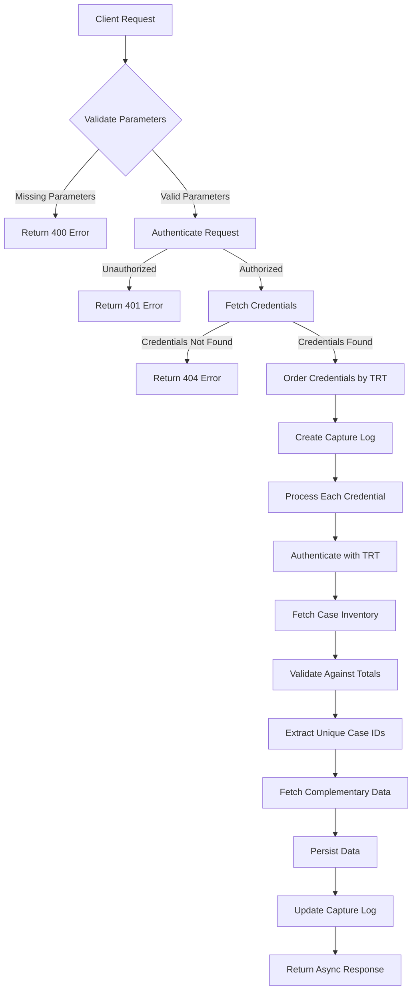
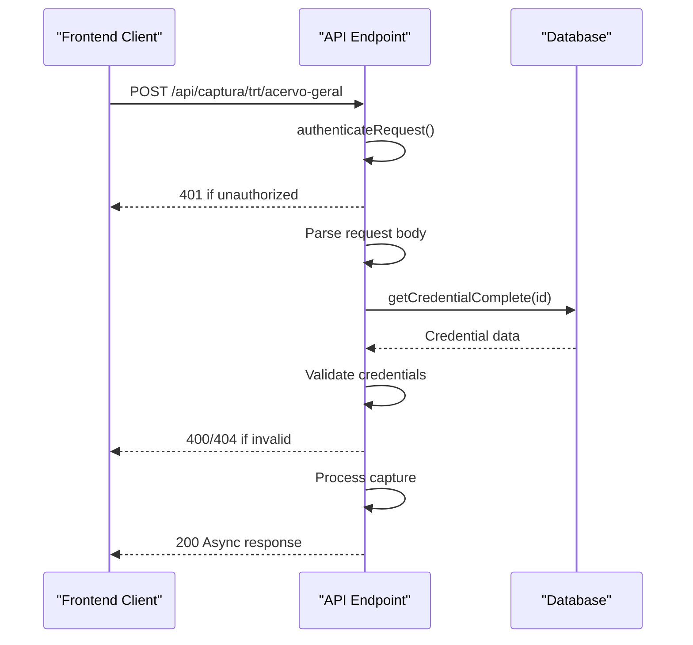
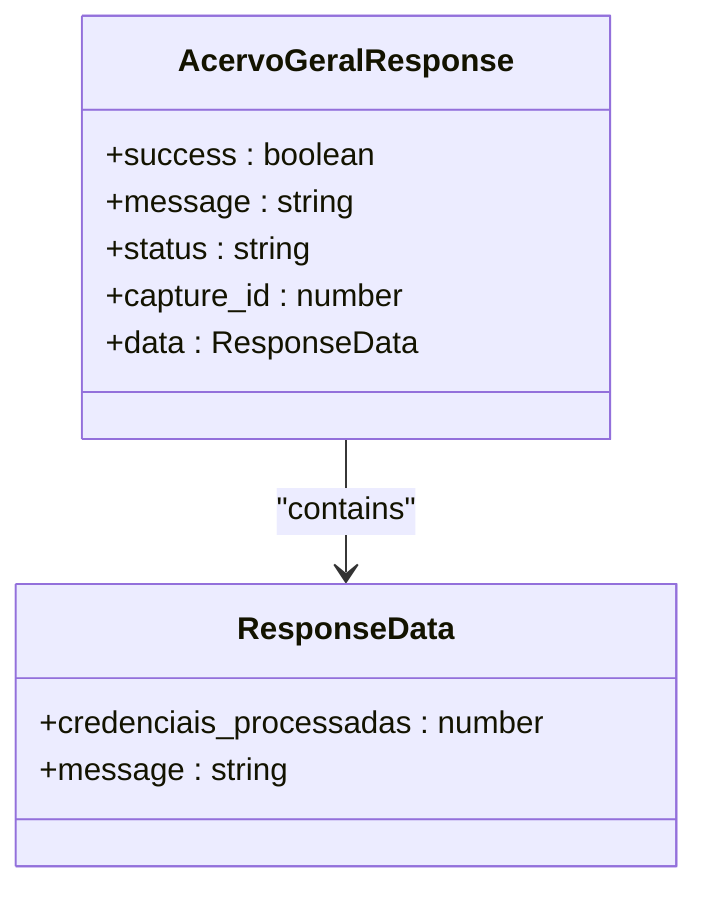
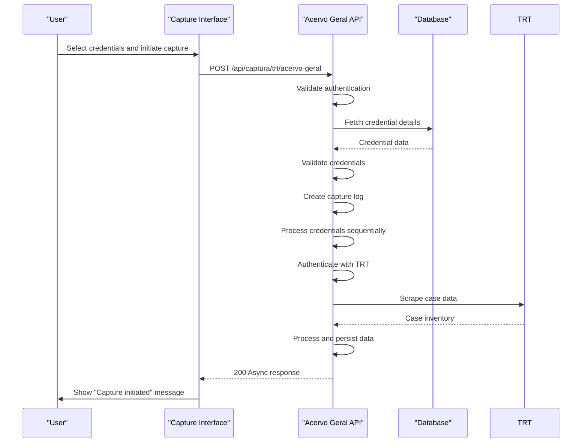
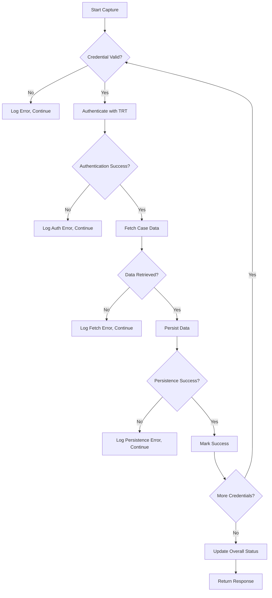
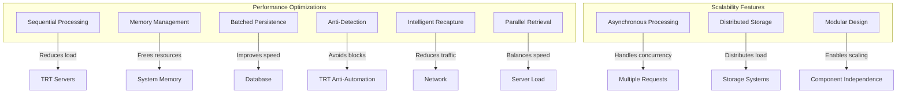
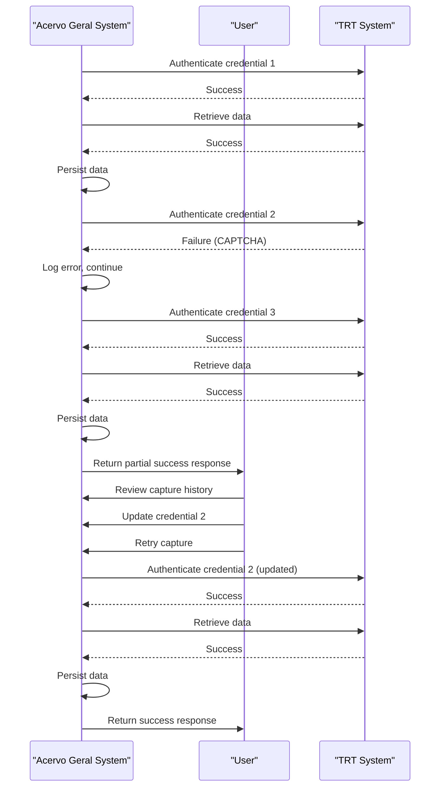

# Acervo Geral Endpoints

<cite>
**Referenced Files in This Document**   
- [route.ts](file://app/api/captura/trt/acervo-geral/route.ts)
- [acervo-geral.service.ts](file://backend/captura/services/trt/acervo-geral.service.ts)
- [trt-auth.service.ts](file://backend/captura/services/trt/trt-auth.service.ts)
- [trt-types.ts](file://backend/types/captura/trt-types.ts)
- [credenciais-columns.tsx](file://app/(dashboard)/captura/components/credenciais/credenciais-columns.tsx)
- [credenciais-list.tsx](file://app/(dashboard)/captura/components/credenciais/credenciais-list.tsx)
- [credenciais-dialog.tsx](file://app/(dashboard)/captura/components/credenciais/credenciais-dialog.tsx)
- [page.tsx](file://app/(dashboard)/captura/credenciais/page.tsx)
</cite>

## Table of Contents
1. [Introduction](#introduction)
2. [API Endpoint Details](#api-endpoint-details)
3. [Authentication and Security](#authentication-and-security)
4. [Response Schema](#response-schema)
5. [Implementation Flow](#implementation-flow)
6. [Frontend Integration](#frontend-integration)
7. [Common Issues and Error Handling](#common-issues-and-error-handling)
8. [Performance Considerations](#performance-considerations)
9. [Error Recovery Mechanisms](#error-recovery-mechanisms)
10. [Conclusion](#conclusion)

## Introduction

The Acervo Geral endpoints in the Sinesys system provide integration with the Tribunal Regional do Trabalho (TRT) to capture comprehensive case data from the PJE (Processo Judicial Eletrônico) platform. This documentation details the API endpoint for retrieving general case inventory data, including process metadata, classification, distribution date, and status information.

The integration uses Puppeteer-based automation to authenticate with the TRT's PJE system and extract case data. The endpoint is designed to handle large datasets efficiently while maintaining data integrity through a multi-phase processing pipeline. The system supports multiple TRT jurisdictions and both first and second instance cases.

The Acervo Geral functionality is a critical component of the Sinesys legal technology platform, enabling law firms to automatically synchronize their case portfolios with the official court records. This eliminates manual data entry and ensures that attorneys have access to the most up-to-date information about their cases.

**Section sources**
- [route.ts](file://app/api/captura/trt/acervo-geral/route.ts#L1-L366)
- [acervo-geral.service.ts](file://backend/captura/services/trt/acervo-geral.service.ts#L1-L354)

## API Endpoint Details

The Acervo Geral endpoint provides access to comprehensive case inventory data from the TRT system. The endpoint follows a RESTful design pattern with clear request parameters and response structures.

### HTTP Method and URL Pattern

The endpoint uses the HTTP POST method with the following URL pattern:
```
POST /api/captura/trt/acervo-geral
```

This endpoint initiates the capture process for a lawyer's complete case inventory from the specified TRT jurisdiction.

### Request Parameters

The endpoint accepts a JSON payload with the following required parameters:

| Parameter | Type | Required | Description |
|---------|------|----------|-------------|
| `advogado_id` | integer | Yes | The ID of the lawyer whose credentials will be used for authentication |
| `credencial_ids` | array of integers | Yes | Array of credential IDs to be used in the capture process |

The request body must include both parameters, with `credencial_ids` being a non-empty array. Each credential ID corresponds to stored login credentials for a specific TRT jurisdiction and instance (first or second degree).

### Optional Filters

While the primary endpoint does not support query parameters for filtering, the system implements intelligent processing controls:

- **Recapture Prevention**: The system automatically skips processes that have been updated within the last 24 hours, preventing unnecessary reprocessing of recently captured data.
- **Sequential Processing**: Credentials are processed sequentially, ordered by TRT number (TRT1, TRT2, etc.), ensuring consistent execution order.
- **Progressive Enhancement**: Data is captured in phases, with core process data retrieved first, followed by complementary information like timelines and parties.

The system does not implement client-side pagination as the capture process is designed to retrieve complete case inventories in a single asynchronous operation.



**Diagram sources**
- [route.ts](file://app/api/captura/trt/acervo-geral/route.ts#L125-L356)
- [acervo-geral.service.ts](file://backend/captura/services/trt/acervo-geral.service.ts#L107-L306)

**Section sources**
- [route.ts](file://app/api/captura/trt/acervo-geral/route.ts#L125-L356)
- [acervo-geral.service.ts](file://backend/captura/services/trt/acervo-geral.service.ts#L107-L306)

## Authentication and Security

The Acervo Geral endpoint implements a multi-layered authentication and security model to ensure secure access to sensitive case data.

### Supabase Session Authentication

The primary authentication mechanism uses Supabase sessions, which provide secure user authentication and session management. When a client makes a request to the endpoint, the system validates the Supabase session token to verify the user's identity and authorization level.

The authentication process begins with the `authenticateRequest` function, which validates the incoming request against the Supabase authentication system. This ensures that only authenticated users with valid sessions can access the endpoint.

```typescript
const authResult = await authenticateRequest(request);
if (!authResult.authenticated) {
  return NextResponse.json(
    { error: 'Unauthorized' },
    { status: 401 }
  );
}
```

### Tribunal Credential Management

In addition to user session authentication, the system requires valid tribunal credentials stored in the database. These credentials are associated with specific lawyers and TRT jurisdictions.

The credential validation process includes several security checks:

1. **Credential Existence**: The system verifies that all requested credential IDs exist in the database.
2. **Ownership Verification**: The system confirms that all credentials belong to the specified lawyer, preventing unauthorized access to other lawyers' credentials.
3. **Active Status Check**: Only active credentials are processed, ensuring that disabled or expired credentials cannot be used.



**Diagram sources**
- [route.ts](file://app/api/captura/trt/acervo-geral/route.ts#L128-L190)
- [trt-auth.service.ts](file://backend/captura/services/trt/trt-auth.service.ts#L539-L602)

**Section sources**
- [route.ts](file://app/api/captura/trt/acervo-geral/route.ts#L128-L190)
- [trt-auth.service.ts](file://backend/captura/services/trt/trt-auth.service.ts#L539-L602)

## Response Schema

The Acervo Geral endpoint returns a structured JSON response that provides information about the capture process status and results.

### Success Response (200)

When the capture process is successfully initiated, the endpoint returns a 200 status code with the following response structure:

```json
{
  "success": true,
  "message": "Captura iniciada com sucesso",
  "status": "in_progress",
  "capture_id": 123,
  "data": {
    "credenciais_processadas": 3,
    "message": "A captura está sendo processada em background. Consulte o histórico para acompanhar o progresso."
  }
}
```

The response includes:
- `success`: Boolean indicating the request was accepted
- `message`: Human-readable status message
- `status`: Current status of the capture process
- `capture_id`: Identifier for tracking the capture process in the history
- `data`: Additional information about the capture, including the number of credentials processed

### Error Responses

The endpoint returns specific error codes for different failure scenarios:

| Status Code | Error Scenario | Response Structure |
|------------|----------------|-------------------|
| 400 | Missing required parameters or invalid credentials | `{ "error": "Missing required parameters..." }` |
| 401 | Authentication failed | `{ "error": "Unauthorized" }` |
| 404 | Credentials not found | `{ "error": "One or more credentials not found", "details": { "credencial_ids_nao_encontradas": [...] } }` |
| 500 | Internal server error | `{ "error": "Internal server error" }` |

### Response Characteristics

The endpoint uses an asynchronous processing model, meaning it returns a response immediately after validating the request, while the actual data capture occurs in the background. This design prevents timeouts during the potentially lengthy capture process.

The response does not include the actual case data, as this is stored directly in the database during the background processing. Clients should use the `capture_id` to monitor the progress of the capture through the history endpoint.



**Diagram sources**
- [route.ts](file://app/api/captura/trt/acervo-geral/route.ts#L47-L69)
- [acervo-geral.service.ts](file://backend/captura/services/trt/acervo-geral.service.ts#L65-L85)

**Section sources**
- [route.ts](file://app/api/captura/trt/acervo-geral/route.ts#L47-L69)
- [acervo-geral.service.ts](file://backend/captura/services/trt/acervo-geral.service.ts#L65-L85)

## Implementation Flow

The Acervo Geral implementation follows a structured six-phase process that ensures reliable data capture and persistence.

### Phase 1: Authentication

The process begins with authentication to the TRT's PJE system using the provided credentials. The system uses Playwright to automate the browser-based login process, including handling the SSO (Single Sign-On) with Gov.br and the two-factor authentication (2FA) via OTP (One-Time Password).

The authentication service applies anti-detection configurations to prevent the TRT system from identifying the automation, including modifying browser properties like `navigator.webdriver`, `navigator.plugins`, and `navigator.languages`.

### Phase 2: Case Inventory Retrieval

Once authenticated, the system retrieves the complete case inventory for the lawyer through the PJE API. This involves making a GET request to the `/paineladvogado/{id}/processos` endpoint, which returns all cases in the lawyer's inventory.

The system validates the retrieved data against the totalizer information to ensure completeness. If the number of retrieved cases does not match the expected total, an error is thrown.

### Phase 3: Unique Case ID Extraction

The retrieved case data may contain duplicate entries. The system extracts unique case IDs using a Set data structure, ensuring that each case is processed only once during subsequent phases.

### Phase 4: Complementary Data Capture

For each unique case, the system captures complementary data including:
- Timeline information through the `/processos/id/{id}/timeline` endpoint
- Party information through the `/processos/id/{id}/partes` endpoint

This phase includes a 300ms delay between requests to avoid overwhelming the TRT servers and potentially triggering rate limiting.

### Phase 5: Data Persistence

The captured data is persisted in the database in a specific order to maintain referential integrity:

1. **Cases**: Process data is upserted into the Supabase database, returning database IDs for reference
2. **Timelines**: Timeline data is upserted into MongoDB for cases that were not skipped
3. **Parties**: Party data is upserted along with entity relationships for cases that were not skipped

### Phase 6: Browser Cleanup

Finally, the browser instance is closed to free up system resources and ensure a clean state for subsequent captures.

```mermaid
flowchart TD
A[Fase 1: Autenticação] --> B[Fase 2: Buscar Processos]
B --> C[Fase 3: Extrair IDs Únicos]
C --> D[Fase 4: Dados Complementares]
D --> E[Fase 5: Persistência]
E --> F[Fase 6: Fechar Browser]
A --> |autenticarPJE| A1[Login SSO PDPJ]
A1 --> A2[OTP via 2FAuth]
A2 --> A3[JWT + Cookies]
B --> |obterTodosProcessosAcervoGeral| B1[GET /paineladvogado/{id}/processos]
B1 --> B2[Validar contra totalizador]
C --> |extrairProcessosUnicosDeAcervo| C1[Set(id) → processos únicos]
D --> |buscarDadosComplementaresProcessos| D1[Verificação de recaptura]
D1 --> D2[Timeline: GET /processos/id/{id}/timeline]
D2 --> D3[Partes: GET /processos/id/{id}/partes]
D3 --> D4[Delay 300ms entre requisições]
E --> |salvarAcervo| E1[Processos: upsert acervo (Supabase)]
E1 --> E2[Timeline: upsert (MongoDB)]
E2 --> E3[Partes: upsert entidades + vínculos]
F --> |browser.close| F1[Fechar instância do browser]
```

**Diagram sources**
- [acervo-geral.service.ts](file://backend/captura/services/trt/acervo-geral.service.ts#L46-L45)
- [trt-auth.service.ts](file://backend/captura/services/trt/trt-auth.service.ts#L46-L603)

**Section sources**
- [acervo-geral.service.ts](file://backend/captura/services/trt/acervo-geral.service.ts#L46-L45)
- [trt-auth.service.ts](file://backend/captura/services/trt/trt-auth.service.ts#L46-L603)

## Frontend Integration

The frontend implementation provides a user interface for managing credentials and initiating Acervo Geral captures.

### Credential Management Interface

The credential management system allows lawyers to store and manage their TRT login credentials securely. The interface displays credentials in a tabular format with columns for:

- Lawyer name and OAB information
- TRT jurisdiction
- Instance (first or second degree)
- Last capture date
- Status indicators

Users can add, edit, and delete credentials through a modal dialog interface. Each credential is associated with a specific lawyer and TRT jurisdiction.

### Capture Initiation

From the capture interface, users can select one or more credentials and initiate the Acervo Geral capture process. The frontend collects the selected credential IDs and the lawyer ID, then makes a POST request to the API endpoint.

The interface provides feedback during the capture process, showing the asynchronous nature of the operation and instructing users to check the history for completion status.



**Diagram sources**
- [credenciais-columns.tsx](file://app/(dashboard)/captura/components/credenciais/credenciais-columns.tsx)
- [credenciais-list.tsx](file://app/(dashboard)/captura/components/credenciais/credenciais-list.tsx)
- [credenciais-dialog.tsx](file://app/(dashboard)/captura/components/credenciais/credenciais-dialog.tsx)
- [page.tsx](file://app/(dashboard)/captura/credenciais/page.tsx)

**Section sources**
- [credenciais-columns.tsx](file://app/(dashboard)/captura/components/credenciais/credenciais-columns.tsx)
- [credenciais-list.tsx](file://app/(dashboard)/captura/components/credenciais/credenciais-list.tsx)
- [credenciais-dialog.tsx](file://app/(dashboard)/captura/components/credenciais/credenciais-dialog.tsx)
- [page.tsx](file://app/(dashboard)/captura/credenciais/page.tsx)

## Common Issues and Error Handling

The Acervo Geral system implements comprehensive error handling to address common issues encountered during the capture process.

### Tribunal CAPTCHA Challenges

The TRT system may present CAPTCHA challenges as an anti-automation measure. The current implementation does not handle CAPTCHAs automatically, which can cause authentication failures. When a CAPTCHA is encountered, the authentication process will time out, and an error will be logged.

To mitigate this issue, the system uses anti-detection techniques to reduce the likelihood of triggering CAPTCHA challenges. However, if CAPTCHAs are frequently encountered, manual intervention may be required to update the automation approach.

### Session Timeouts

Session timeouts can occur due to network issues or server-side session expiration. The system handles timeouts through:

- **Retry Mechanisms**: The authentication process includes retry logic for network-related errors during the SSO redirection phase.
- **Error Detection**: The system monitors for network error messages in the page content and logs these occurrences.
- **Graceful Failure**: When a timeout occurs, the system logs the error and continues processing other credentials rather than failing the entire batch.

### Pagination Handling

The Acervo Geral endpoint does not require pagination handling as it retrieves the complete case inventory in a single request. The TRT PJE system handles pagination internally and returns all cases in the response. This design simplifies the client implementation but requires the system to handle potentially large response payloads.

### Error Recovery

The system implements several error recovery mechanisms:

- **Partial Success**: If one credential fails, the system continues processing the remaining credentials rather than aborting the entire operation.
- **Detailed Logging**: Comprehensive logs are maintained for each capture attempt, including success and failure details for individual credentials.
- **History Tracking**: Each capture attempt is recorded in the database with a status indicator, allowing users to identify and retry failed captures.



**Diagram sources**
- [route.ts](file://app/api/captura/trt/acervo-geral/route.ts#L212-L344)
- [acervo-geral.service.ts](file://backend/captura/services/trt/acervo-geral.service.ts#L345-L354)

**Section sources**
- [route.ts](file://app/api/captura/trt/acervo-geral/route.ts#L212-L344)
- [acervo-geral.service.ts](file://backend/captura/services/trt/acervo-geral.service.ts#L345-L354)

## Performance Considerations

The Acervo Geral system is designed to handle large case inventories efficiently while maintaining system stability and data integrity.

### Large Dataset Processing

The system implements several optimizations for processing large acervo datasets:

- **Sequential Credential Processing**: Credentials are processed one at a time to prevent overwhelming system resources and TRT servers.
- **Memory Management**: The browser instance is closed after each credential processing to free up memory.
- **Batched Persistence**: Data is persisted in batches rather than individual records to improve database performance.

### Resource Optimization

The implementation includes several resource optimization techniques:

- **Anti-Detection Configurations**: By modifying browser properties, the system reduces the likelihood of being blocked by the TRT's anti-automation measures.
- **Intelligent Recapture**: The system skips cases that have been updated within the last 24 hours, reducing unnecessary data transfer and processing.
- **Parallel Data Retrieval**: For each case, timeline and party data are retrieved in sequence with a small delay to balance speed and server load.

### Scalability Considerations

The system architecture supports scalability through:

- **Asynchronous Processing**: The endpoint returns immediately, allowing the server to handle multiple concurrent capture requests.
- **Distributed Storage**: Case data is stored in Supabase (PostgreSQL) while timeline data is stored in MongoDB, distributing the storage load.
- **Modular Design**: The separation of authentication, data retrieval, and persistence logic allows for independent scaling of components.



**Diagram sources**
- [acervo-geral.service.ts](file://backend/captura/services/trt/acervo-geral.service.ts#L192-L195)
- [trt-auth.service.ts](file://backend/captura/services/trt/trt-auth.service.ts#L59-L83)

**Section sources**
- [acervo-geral.service.ts](file://backend/captura/services/trt/acervo-geral.service.ts#L192-L195)
- [trt-auth.service.ts](file://backend/captura/services/trt/trt-auth.service.ts#L59-L83)

## Error Recovery Mechanisms

The Acervo Geral system implements robust error recovery mechanisms to ensure data integrity and reliability.

### Resilient Processing

The system is designed to continue processing even when individual operations fail:

- **Credential-Level Isolation**: If one credential fails to authenticate or retrieve data, the system continues processing the remaining credentials.
- **Partial Success Reporting**: The response includes detailed information about which credentials succeeded and which failed, allowing users to address specific issues.
- **Atomic Operations**: Each credential processing is treated as an atomic operation, with its own error handling and logging.

### Comprehensive Logging

The system maintains detailed logs for troubleshooting and recovery:

- **Capture Logs**: Each capture attempt is recorded with a status indicator (in_progress, success, error).
- **Raw Logs**: Detailed raw logs are stored for each credential, including request and response data.
- **Error Classification**: Errors are categorized and logged with context to facilitate debugging.

### Recovery Workflow

When a capture fails, the system supports the following recovery workflow:

1. **Identify Failed Credentials**: Users can review the capture history to identify which credentials failed.
2. **Diagnose Issues**: Detailed error messages and logs help determine the cause of failure.
3. **Correct Problems**: Users can update credentials or address other issues.
4. **Retry Capture**: The capture can be reattempted with the same or modified parameters.

The system does not automatically retry failed captures, as this could lead to account lockouts or other issues with the TRT system. Instead, it relies on manual intervention for recovery, ensuring that retries are performed with appropriate corrections.



**Diagram sources**
- [route.ts](file://app/api/captura/trt/acervo-geral/route.ts#L212-L344)
- [acervo-geral.service.ts](file://backend/captura/services/trt/acervo-geral.service.ts#L315-L332)

**Section sources**
- [route.ts](file://app/api/captura/trt/acervo-geral/route.ts#L212-L344)
- [acervo-geral.service.ts](file://backend/captura/services/trt/acervo-geral.service.ts#L315-L332)

## Conclusion

The Acervo Geral endpoints in the Sinesys system provide a robust solution for integrating with the TRT's PJE platform to automatically capture comprehensive case inventory data. The system combines secure authentication, efficient data retrieval, and reliable persistence to deliver a seamless experience for legal professionals.

Key strengths of the implementation include its asynchronous processing model, which prevents timeouts during lengthy capture operations, and its comprehensive error handling, which ensures that partial failures do not compromise the entire process. The system's modular design separates concerns between authentication, data retrieval, and persistence, making it maintainable and extensible.

The integration addresses the critical need for law firms to keep their case management systems synchronized with official court records, eliminating manual data entry and reducing the risk of errors. By automating this process, the system saves significant time and resources while ensuring data accuracy and completeness.

Future enhancements could include support for automatic CAPTCHA solving, improved retry mechanisms for transient errors, and more sophisticated data filtering options to allow users to target specific case types or date ranges. Additionally, implementing webhooks or notifications for capture completion could enhance the user experience by providing real-time updates without requiring manual status checks.

Overall, the Acervo Geral endpoints represent a sophisticated integration solution that balances technical complexity with user needs, delivering reliable and efficient access to critical legal data.

[No sources needed since this section summarizes without analyzing specific files]