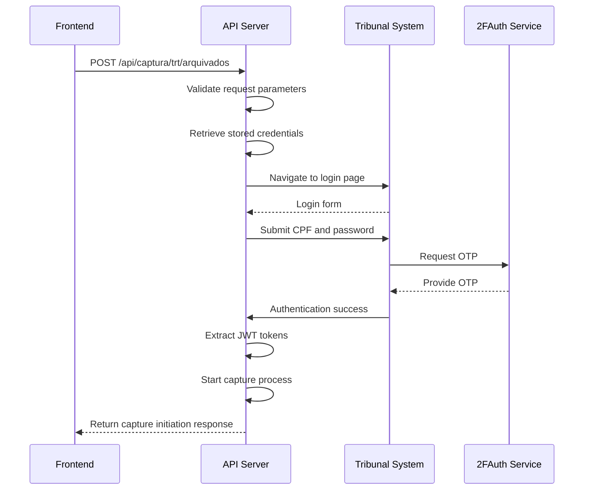
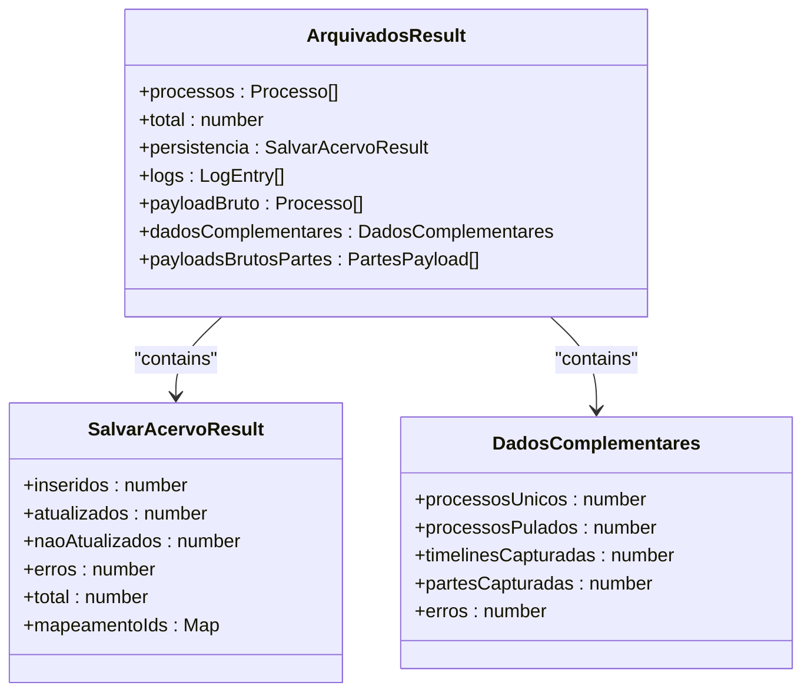
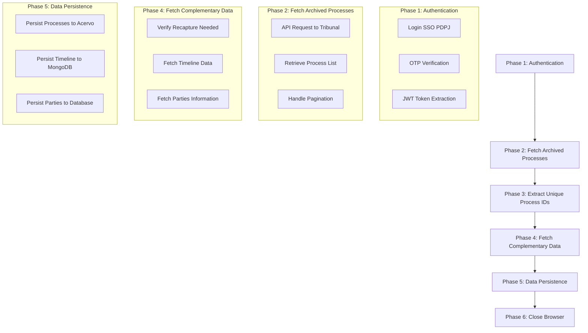
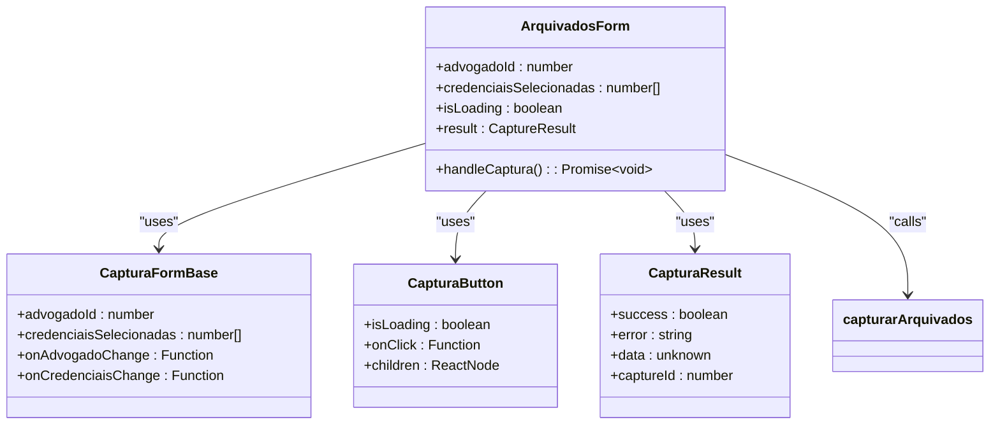
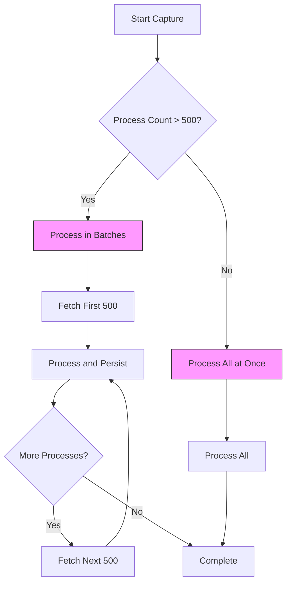

# Arquivados Endpoints

<cite>
**Referenced Files in This Document**   
- [arquivados.service.ts](file://backend/captura/services/trt/arquivados.service.ts)
- [trt-auth.service.ts](file://backend/captura/services/trt/trt-auth.service.ts)
- [route.ts](file://app/api/captura/trt/arquivados/route.ts)
- [arquivados-form.tsx](file://app/(dashboard)/captura/components/arquivados-form.tsx)
- [captura.ts](file://app/api/captura/captura.ts)
- [dados-complementares.service.ts](file://backend/captura/services/trt/dados-complementares.service.ts)
- [acervo-persistence.service.ts](file://backend/captura/services/persistence/acervo-persistence.service.ts)
- [test-api-arquivados.ts](file://scripts/api-arquivados/test-api-arquivados.ts)
</cite>

## Table of Contents
1. [Introduction](#introduction)
2. [API Endpoint Details](#api-endpoint-details)
3. [Authentication and Session Management](#authentication-and-session-management)
4. [Response Structure](#response-structure)
5. [Implementation Details](#implementation-details)
6. [Frontend Integration](#frontend-integration)
7. [Error Handling and Challenges](#error-handling-and-challenges)
8. [Integration Examples](#integration-examples)
9. [Conclusion](#conclusion)

## Introduction

The Arquivados endpoints in the Sinesys system provide integration with tribunal archive sections to retrieve archived legal processes for compliance purposes. This documentation details the API endpoints, authentication mechanisms, response structures, and implementation details for capturing archived processes from TRT (Tribunal Regional do Trabalho) systems.

The integration uses browser automation to navigate tribunal archive sections, extract process metadata, and store the information in the system's database. The process involves authentication using stored tribunal credentials, session management, data extraction, and persistence of archived process information including closure dates, reasons, and related metadata.

This documentation covers the complete workflow from API request to data persistence, including error handling strategies for access denied scenarios and data consistency validation.

**Section sources**
- [arquivados.service.ts](file://backend/captura/services/trt/arquivados.service.ts#L1-L351)
- [trt-auth.service.ts](file://backend/captura/services/trt/trt-auth.service.ts#L1-L603)

## API Endpoint Details

The Arquivados integration provides a POST endpoint for initiating the capture of archived processes from tribunal systems. Despite the documentation objective mentioning a GET method, the actual implementation uses a POST request to handle the complex parameters and initiate the asynchronous capture process.

### Endpoint Information
- **HTTP Method**: POST
- **URL Pattern**: `/api/captura/trt/arquivados`
- **Authentication**: Required (Bearer Token, Session Auth, or Service API Key)
- **Content-Type**: `application/json`

### Request Parameters
The endpoint accepts a JSON payload with the following required parameters:

| Parameter | Type | Required | Description |
|---------|------|----------|-------------|
| `advogado_id` | integer | Yes | ID of the lawyer in the database |
| `credencial_ids` | array of integers | Yes | Array of credential IDs to be used for capture |

The request body example:
```json
{
  "advogado_id": 1,
  "credencial_ids": [1, 2, 3]
}
```

### Response Structure
The endpoint returns an immediate response indicating that the capture process has been initiated, with the actual processing happening in the background.

| Field | Type | Description |
|------|------|-------------|
| `success` | boolean | Indicates if the capture was successfully initiated |
| `message` | string | Status message |
| `status` | string | Current status of the capture process |
| `capture_id` | integer | ID of the capture log entry for tracking progress |
| `data` | object | Additional information about the capture process |

Example response:
```json
{
  "success": true,
  "message": "Captura iniciada com sucesso",
  "status": "in_progress",
  "capture_id": 123,
  "data": {
    "credenciais_processadas": 3,
    "message": "A captura está sendo processada em background. Consulte o histórico para acompanhar o progresso."
  }
}
```

**Section sources**
- [route.ts](file://app/api/captura/trt/arquivados/route.ts#L1-L368)
- [captura.ts](file://app/api/captura/captura.ts#L274-L302)

## Authentication and Session Management

The Arquivados integration uses a sophisticated authentication mechanism that leverages stored tribunal credentials and implements session management through the `trt-auth.service.ts` implementation.

### Authentication Flow
The authentication process follows a multi-step flow to access tribunal systems:



**Diagram sources**
- [trt-auth.service.ts](file://backend/captura/services/trt/trt-auth.service.ts#L539-L602)
- [route.ts](file://app/api/captura/trt/arquivados/route.ts#L131-L368)

### Credential Management
The system stores tribunal credentials securely in the database and retrieves them when needed for capture operations. The credentials include:
- Lawyer's CPF
- Password for the tribunal system
- Tribunal identification (TRT1, TRT2, etc.)
- Instance level (first degree, second degree)

### Session Handling
The authentication service implements several key features to maintain valid sessions:

1. **JWT Token Extraction**: After successful login, the service extracts JWT tokens from cookies, including the access token and XSRF token.

2. **Anti-Detection Measures**: The system applies anti-detection configurations to the browser instance to prevent the tribunal system from identifying automated access:
   - Removes webdriver flag that identifies automation
   - Overrides plugins array
   - Sets languages to Brazilian Portuguese

3. **OTP Handling**: The system integrates with a 2FAuth service to automatically retrieve and submit one-time passwords required for authentication.

4. **Session Persistence**: The authenticated browser session is maintained throughout the capture process to avoid repeated authentication.

**Section sources**
- [trt-auth.service.ts](file://backend/captura/services/trt/trt-auth.service.ts#L1-L603)
- [credential.service.ts](file://backend/captura/credentials/credential.service.ts#L1-L100)

## Response Structure

The Arquivados endpoint returns a structured response containing information about archived processes, including closure dates, reasons, and related metadata. The complete response structure is available after the background capture process completes and can be retrieved through the capture history API.

### Process Data Structure
The archived processes contain comprehensive metadata extracted from the tribunal system:

| Field | Type | Description |
|------|------|-------------|
| `id` | number | Unique identifier of the process in the tribunal system |
| `numeroProcesso` | string | Process number in the format 0000000-00.00.00.0000 |
| `descricaoOrgaoJulgador` | string | Description of the judging body |
| `classeJudicial` | string | Judicial class of the process |
| `segredoDeJustica` | boolean | Indicates if the process is under judicial secrecy |
| `codigoStatusProcesso` | string | Status code of the process |
| `dataAutuacao` | string | Date when the process was filed |
| `dataArquivamento` | string | Date when the process was archived |
| `nomeParteAutora` | string | Name of the plaintiff |
| `nomeParteRe` | string | Name of the defendant |
| `juizoDigital` | boolean | Indicates if the process is digital |

### Capture Result Structure
The `arquivadosCapture` function returns a comprehensive result object with detailed information about the capture operation:



**Diagram sources**
- [arquivados.service.ts](file://backend/captura/services/trt/arquivados.service.ts#L62-L82)
- [acervo-persistence.service.ts](file://backend/captura/services/persistence/acervo-persistence.service.ts#L30-L38)

The response includes not only the process data but also metadata about the capture operation itself, such as:
- Number of processes inserted and updated
- Number of processes skipped (already up-to-date)
- Error counts and details
- Mapping between tribunal process IDs and internal database IDs

This comprehensive response structure enables clients to understand both the data that was captured and the performance of the capture operation.

**Section sources**
- [arquivados.service.ts](file://backend/captura/services/trt/arquivados.service.ts#L62-L82)
- [acervo-persistence.service.ts](file://backend/captura/services/persistence/acervo-persistence.service.ts#L30-L38)

## Implementation Details

The Arquivados integration implementation follows a sophisticated six-phase process that optimizes performance and ensures data integrity. The complete workflow is implemented in the `arquivados.service.ts` file and coordinates multiple services to capture and persist archived process data.

### Capture Process Workflow
The implementation follows a structured six-phase approach:



**Diagram sources**
- [arquivados.service.ts](file://backend/captura/services/trt/arquivados.service.ts#L4-L45)
- [arquivados.service.ts](file://backend/captura/services/trt/arquivados.service.ts#L104-L350)

### Browser Automation Implementation
The system uses Playwright for browser automation to navigate tribunal archive sections and extract data. The implementation includes several optimization features:

1. **Session Reuse**: The authenticated session is reused across multiple data extraction operations to minimize login attempts.

2. **Rate Limiting**: The system implements delays between requests (300ms) to avoid triggering rate limiting mechanisms.

3. **Data Extraction Patterns**: The system extracts data using consistent patterns:
   - Process lists are retrieved from the tribunal's API endpoints
   - Timeline data is fetched for each process
   - Parties information is extracted and normalized

4. **Error Resilience**: The implementation includes retry mechanisms and error handling to deal with network issues or temporary unavailability.

### Data Persistence Strategy
The system follows a specific order of persistence to ensure referential integrity:

1. **Process Persistence**: Processes are first saved to the acervo (main database) to obtain internal IDs
2. **Timeline Persistence**: Timeline data is saved to MongoDB using the process IDs from the acervo
3. **Parties Persistence**: Parties information is linked to processes using the established IDs

This order ensures that all references are valid and maintains data consistency across the system.

**Section sources**
- [arquivados.service.ts](file://backend/captura/services/trt/arquivados.service.ts#L104-L350)
- [dados-complementares.service.ts](file://backend/captura/services/trt/dados-complementares.service.ts#L140-L264)
- [acervo-persistence.service.ts](file://backend/captura/services/persistence/acervo-persistence.service.ts#L87-L259)

## Frontend Integration

The frontend implementation provides a user-friendly interface for initiating the capture of archived processes. The integration is implemented in the `arquivados-form.tsx` component and uses the `capturarArquivados` function from the API client.

### User Interface Components
The frontend consists of several key components:



**Diagram sources**
- [arquivados-form.tsx](file://app/(dashboard)/captura/components/arquivados-form.tsx#L1-L90)
- [captura.ts](file://app/api/captura/captura.ts#L274-L302)

### Capture Initiation Flow
The frontend follows a simple but effective flow for initiating captures:

1. **Form Display**: The user is presented with a form to select a lawyer and credentials
2. **Validation**: The form validates that required fields are filled
3. **API Call**: The frontend calls the `capturarArquivados` function with the selected parameters
4. **Loading State**: A loading indicator is shown during the request
5. **Result Display**: The result is displayed, including success/failure status and capture ID

### Practical Usage Example
The frontend capture system retrieves archived cases for compliance purposes through the following steps:

1. The user selects a lawyer from the available options
2. The user selects one or more tribunal credentials to use for the capture
3. The user clicks the "Iniciar Captura de Arquivados" button
4. The system validates the selection and sends the request to the API
5. The user receives immediate feedback that the capture has been initiated
6. The user can monitor the progress through the capture history interface

This user-friendly approach abstracts the complexity of the underlying API and provides a seamless experience for retrieving archived cases.

**Section sources**
- [arquivados-form.tsx](file://app/(dashboard)/captura/components/arquivados-form.tsx#L1-L90)
- [captura.ts](file://app/api/captura/captura.ts#L274-L302)

## Error Handling and Challenges

The Arquivados integration addresses several common challenges in tribunal system integration, particularly around access controls, data volume, and error recovery.

### Common Integration Challenges

#### Varying Archive Access Controls
Different tribunals have varying access controls and authentication requirements:
- Some tribunals require additional verification steps
- Access patterns may change without notice
- Rate limiting policies differ between tribunals

The system addresses these challenges by:
- Implementing flexible authentication flows that can adapt to different tribunal requirements
- Using credential-specific configurations stored in the database
- Implementing retry mechanisms with exponential backoff

#### Handling Large Volumes of Data
Archived processes can number in the thousands for active lawyers, presenting performance challenges:



**Diagram sources**
- [arquivados.service.ts](file://backend/captura/services/trt/arquivados.service.ts#L142-L147)
- [dados-complementares.service.ts](file://backend/captura/services/trt/dados-complementares.service.ts#L189-L247)

The system handles large volumes by:
- Processing processes in batches of 500
- Implementing progress tracking and logging
- Using efficient data structures like Sets for deduplication

### Error Handling Strategies

#### Access Denied Scenarios
When access is denied, the system implements the following strategies:
- **Credential Validation**: Before attempting capture, the system validates that credentials exist and belong to the specified lawyer
- **Detailed Error Messages**: Specific error messages help identify the cause of access issues
- **Retry with Next OTP**: If the current OTP fails, the system automatically tries with the next OTP in sequence

#### Data Consistency Validation
The system ensures data consistency through several mechanisms:
- **Change Detection**: Before updating a process, the system compares the new data with existing data to avoid unnecessary updates
- **Data Mapping**: A mapping between tribunal process IDs and internal database IDs ensures referential integrity
- **Transaction Order**: Data is persisted in a specific order (processes → timeline → parties) to maintain relationships

#### Recovery Mechanisms
The system implements comprehensive logging and recovery features:
- **Capture Logs**: Each capture operation is logged with a unique ID for tracking
- **Raw Data Storage**: Raw payloads are stored to enable recovery if processing fails
- **Error Classification**: Errors are categorized and logged with context for troubleshooting

These error handling strategies ensure that the system can recover from failures, maintain data integrity, and provide actionable insights when issues occur.

**Section sources**
- [arquivados.service.ts](file://backend/captura/services/trt/arquivados.service.ts#L291-L294)
- [route.ts](file://app/api/captura/trt/arquivados/route.ts#L291-L315)
- [captura-log.service.ts](file://backend/captura/services/captura-log.service.ts#L1-L100)

## Integration Examples

The Arquivados endpoints can be integrated in various ways, from direct API calls to frontend usage. Below are practical examples demonstrating different integration scenarios.

### Direct API Integration
The following example shows how to call the Arquivados endpoint directly using JavaScript:

```javascript
// Example from test-api-arquivados.ts
async function testarArquivadosTRT(trtCodigo) {
  const response = await fetch(`${API_BASE_URL}/api/captura/trt/arquivados`, {
    method: 'POST',
    headers: {
      'Content-Type': 'application/json',
      'x-service-api-key': SERVICE_API_KEY,
    },
    body: JSON.stringify({
      advogado_id: ADVOGADO_ID,
      credencial_ids: [1, 2, 3],
    }),
  });

  const resultado = await response.json();
  console.log(`Total de processos arquivados: ${resultado.data?.total || 0}`);
}
```

This script demonstrates:
- Using environment variables for configuration
- Proper error handling with detailed messages
- Saving results for later analysis
- Processing multiple tribunals sequentially

### Frontend Integration
The frontend integration is straightforward and user-friendly:

```typescript
// Example from arquivados-form.tsx
const handleCaptura = async () => {
  if (!validarCamposCaptura(advogadoId, credenciaisSelecionadas)) {
    setResult({
      success: false,
      error: 'Selecione um advogado e pelo menos uma credencial',
    });
    return;
  }

  setIsLoading(true);
  setResult({ success: null });

  try {
    const response = await capturarArquivados({
      advogado_id: advogadoId,
      credencial_ids: credenciaisSelecionadas,
    });

    if (!response.success) {
      setResult({
        success: false,
        error: response.error || 'Erro ao iniciar captura',
      });
    } else {
      setResult({
        success: true,
        data: response.data,
        capture_id: response.capture_id,
      });
      onSuccess?.();
    }
  } catch (error) {
    const errorMessage = error instanceof Error ? error.message : 'Erro desconhecido';
    setResult({ success: false, error: errorMessage });
  } finally {
    setIsLoading(false);
  }
};
```

This example shows:
- Form validation before submission
- Loading state management
- Success and error handling
- Callback execution on success

### Compliance Use Case
A practical example of how the system retrieves archived cases for compliance purposes:

1. **Monthly Compliance Check**: A compliance officer initiates a capture for all archived cases of high-risk clients
2. **Automated Processing**: The system authenticates with each tribunal, retrieves archived cases, and stores them in the database
3. **Data Analysis**: The compliance team reviews the archived cases for any issues or patterns
4. **Reporting**: Reports are generated showing the status of archived cases and any required actions

This workflow ensures that the organization maintains compliance with regulatory requirements by systematically capturing and reviewing archived legal cases.

**Section sources**
- [test-api-arquivados.ts](file://scripts/api-arquivados/test-api-arquivados.ts#L49-L128)
- [arquivados-form.tsx](file://app/(dashboard)/captura/components/arquivados-form.tsx#L24-L66)

## Conclusion

The Arquivados endpoints in the Sinesys system provide a robust solution for integrating with tribunal archive systems to retrieve archived legal processes. The implementation combines browser automation, secure credential management, and efficient data persistence to create a reliable capture system.

Key features of the implementation include:
- **Secure Authentication**: Using stored credentials and OTP integration to access tribunal systems
- **Efficient Data Extraction**: Browser automation to navigate archive sections and extract process metadata
- **Comprehensive Response Structure**: Detailed information about archived processes including closure dates and reasons
- **Robust Error Handling**: Strategies for dealing with access denied scenarios and data consistency validation
- **Scalable Architecture**: Handling large volumes of archived data through batch processing and efficient storage

The system addresses common integration challenges such as varying archive access controls across tribunals and handling large volumes of data. The frontend integration provides a user-friendly interface for initiating captures, while the API allows for programmatic access and automation.

For compliance purposes, this system enables organizations to systematically retrieve and review archived cases, ensuring they meet regulatory requirements and maintain accurate records of legal proceedings.

The combination of technical sophistication and user-friendly design makes the Arquivados integration a valuable component of the Sinesys system for legal compliance and case management.

**Section sources**
- [arquivados.service.ts](file://backend/captura/services/trt/arquivados.service.ts#L1-L351)
- [trt-auth.service.ts](file://backend/captura/services/trt/trt-auth.service.ts#L1-L603)
- [route.ts](file://app/api/captura/trt/arquivados/route.ts#L1-L368)