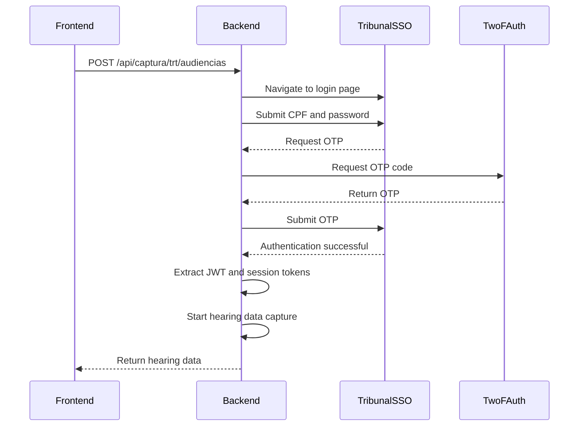
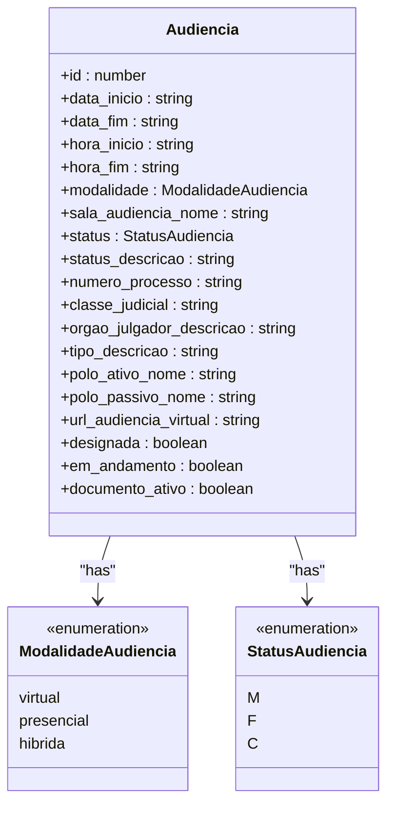
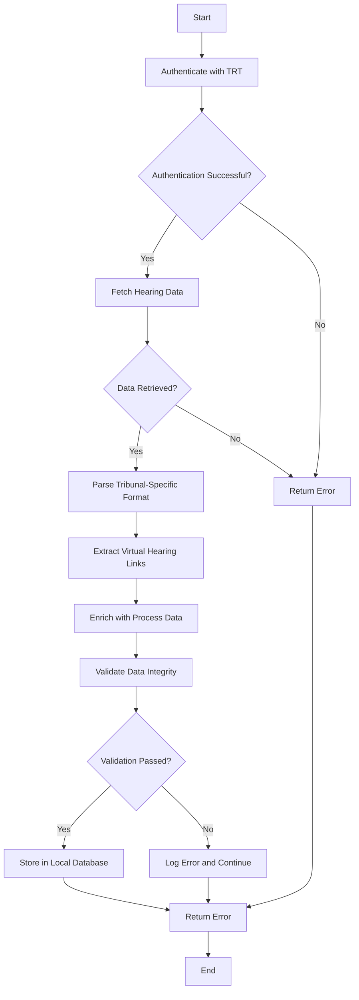

# Audiencias Endpoints

<cite>
**Referenced Files in This Document**   
- [app/api/audiencias/route.ts](file://app/api/audiencias/route.ts)
- [backend/captura/services/trt/trt-auth.service.ts](file://backend/captura/services/trt/trt-auth.service.ts)
- [backend/captura/services/trt/audiencias.service.ts](file://backend/captura/services/trt/audiencias.service.ts)
- [types/domain/audiencias.ts](file://types/domain/audiencias.ts)
- [backend/captura/services/trt/API-PJE-AUDIENCIAS-RESPONSE.MD](file://backend/captura/services/trt/API-PJE-AUDIENCIAS-RESPONSE.MD)
- [app/api/captura/trt/audiencias/route.ts](file://app/api/captura/trt/audiencias/route.ts)
- [types/contracts/audiencias.ts](file://types/contracts/audiencias.ts)
- [supabase/schemas/07_audiencias.sql](file://supabase/schemas/07_audiencias.sql)
- [app/_lib/types/audiencias.ts](file://app/_lib/types/audiencias.ts)
</cite>

## Table of Contents
1. [Introduction](#introduction)
2. [API Endpoint](#api-endpoint)
3. [Authentication Flow](#authentication-flow)
4. [Response Schema](#response-schema)
5. [Implementation Details](#implementation-details)
6. [Usage Examples](#usage-examples)
7. [Common Issues](#common-issues)
8. [Data Validation and Synchronization](#data-validation-and-synchronization)

## Introduction
The Audiencias tribunal integration endpoints in the Sinesys system provide a comprehensive interface for retrieving and managing hearing schedules from various labor courts (TRTs). This documentation covers the API endpoints, authentication mechanisms, response formats, and implementation details for the hearing management system. The system integrates with the PJE (Processo Judicial Eletrônico) platform to capture hearing data, including virtual hearing links and participant information, while maintaining synchronization with the local database.

## API Endpoint

### GET /api/audiencias/trt/audiencias
This endpoint retrieves hearing schedules from the tribunal system with various filtering options.

**HTTP Method**: GET

**URL Pattern**: `/api/captura/trt/audiencias`

**Query Parameters**:
- `tribunalId` (required): The identifier for the specific tribunal
- `dataInicio` (optional): Start date for the date range filter (YYYY-MM-DD format)
- `dataFim` (optional): End date for the date range filter (YYYY-MM-DD format)
- `tipoAudiencia` (optional): Filter by hearing type (e.g., "Una", "Instrução", "Conciliação")

**Example Request**:
```
GET /api/captura/trt/audiencias?tribunalId=TRT13&dataInicio=2025-11-01&dataFim=2025-11-30&tipoAudiencia=Una
```

**Section sources**
- [app/api/captura/trt/audiencias/route.ts](file://app/api/captura/trt/audiencias/route.ts)
- [backend/captura/services/trt/audiencias.service.ts](file://backend/captura/services/trt/audiencias.service.ts)

## Authentication Flow

### trt-auth.service.ts Implementation
The authentication flow for the tribunal integration is implemented in the `trt-auth.service.ts` file, which handles the complete authentication process with the PJE system.

**Authentication Process**:
1. **Initial Connection**: Establishes a connection to the tribunal's authentication system using Firefox browser automation
2. **SSO Login**: Navigates to the SSO PDPJ login page and submits credentials
3. **Two-Factor Authentication**: Processes OTP (One-Time Password) using the 2FAuth service
4. **Session Validation**: Verifies successful authentication and extracts session tokens

**Credential Validation**:
The system validates credentials through a multi-step process:
- CPF and password validation against the tribunal's authentication system
- Two-factor authentication code verification
- JWT token extraction and validation from cookies
- Advogado (lawyer) information extraction from the authenticated session



**Diagram sources**
- [backend/captura/services/trt/trt-auth.service.ts](file://backend/captura/services/trt/trt-auth.service.ts)
- [backend/captura/services/trt/audiencias.service.ts](file://backend/captura/services/trt/audiencias.service.ts)

**Section sources**
- [backend/captura/services/trt/trt-auth.service.ts](file://backend/captura/services/trt/trt-auth.service.ts)

## Response Schema

### Hearing Details Structure
The API response contains comprehensive information about each hearing, including scheduling details, virtual hearing information, and participant data.

**Response Format**:
```json
{
  "success": true,
  "data": {
    "audiencias": [
      {
        "id": 684034,
        "data_inicio": "2025-12-04T10:00:00",
        "data_fim": "2025-12-04T10:10:00",
        "hora_inicio": "10:00:00",
        "hora_fim": "10:10:00",
        "modalidade": "presencial",
        "sala_audiencia_nome": "JUIZ TITULAR (ACERVO PAR)",
        "status": "M",
        "status_descricao": "Designada",
        "numero_processo": "0001254-59.2025.5.13.0029",
        "classe_judicial": "Tutela Cautelar Antecedente",
        "orgao_julgador_descricao": "10ª Vara do Trabalho de João Pessoa",
        "tipo_descricao": "Una por videoconferência",
        "polo_ativo_nome": "ADRIANO JOSE DA SILVA ARAUJO",
        "polo_passivo_nome": "99 TECNOLOGIA LTDA",
        "url_audiencia_virtual": null,
        "designada": false,
        "em_andamento": false,
        "documento_ativo": false
      }
    ],
    "paginacao": {
      "pagina": 1,
      "limite": 50,
      "total": 2,
      "totalPaginas": 1
    }
  }
}
```

**Key Fields**:
- `data_inicio` and `data_fim`: ISO timestamp for hearing start and end times
- `hora_inicio` and `hora_fim`: Formatted time strings for display
- `modalidade`: Hearing modality (virtual, presencial, or hibrida)
- `status`: Hearing status (M=Designada, F=Realizada, C=Cancelada)
- `url_audiencia_virtual`: URL for virtual hearings (when applicable)
- `polo_ativo_nome` and `polo_passivo_nome`: Names of the plaintiff and defendant parties



**Diagram sources**
- [types/domain/audiencias.ts](file://types/domain/audiencias.ts)
- [backend/captura/services/trt/API-PJE-AUDIENCIAS-RESPONSE.MD](file://backend/captura/services/trt/API-PJE-AUDIENCIAS-RESPONSE.MD)

**Section sources**
- [types/domain/audiencias.ts](file://types/domain/audiencias.ts)
- [backend/captura/services/trt/API-PJE-AUDIENCIAS-RESPONSE.MD](file://backend/captura/services/trt/API-PJE-AUDIENCIAS-RESPONSE.MD)

## Implementation Details

### audiencias.service.ts Processing
The `audiencias.service.ts` file implements the core logic for capturing and processing hearing data from the tribunal system.

**Processing Flow**:
1. **Authentication**: Uses the `trt-auth.service.ts` to authenticate with the tribunal system
2. **Data Retrieval**: Fetches hearing data from the PJE API endpoint
3. **Data Parsing**: Processes the tribunal-specific hearing schedule format
4. **Virtual Link Extraction**: Identifies and extracts virtual hearing URLs when available
5. **Data Enrichment**: Combines hearing data with additional process information
6. **Persistence**: Stores the processed data in the local database

**Key Implementation Features**:
- **Tribunal-Specific Parsing**: Handles variations in hearing schedule layouts across different tribunals
- **Virtual Hearing Detection**: Identifies virtual hearings based on type description and extracts access URLs
- **Data Normalization**: Converts tribunal-specific data formats to the system's standard format
- **Error Handling**: Implements robust error handling for network issues and data inconsistencies



**Diagram sources**
- [backend/captura/services/trt/audiencias.service.ts](file://backend/captura/services/trt/audiencias.service.ts)

**Section sources**
- [backend/captura/services/trt/audiencias.service.ts](file://backend/captura/services/trt/audiencias.service.ts)

## Usage Examples

### Frontend Hearing Management System
The frontend hearing management system uses the API endpoints to display and manage hearing schedules.

**Example Usage**:
```typescript
// Fetch hearings for a specific tribunal and date range
const fetchHearings = async (tribunalId: string, startDate: string, endDate: string) => {
  const response = await fetch(
    `/api/captura/trt/audiencias?tribunalId=${tribunalId}&dataInicio=${startDate}&dataFim=${endDate}`
  );
  
  if (response.ok) {
    const data = await response.json();
    return data.data.audiencias;
  }
  
  throw new Error('Failed to fetch hearings');
};

// Display virtual hearing information
const renderHearing = (hearing: Audiencia) => {
  return (
    <div>
      <h3>{hearing.numero_processo}</h3>
      <p>Data: {formatDate(hearing.data_inicio)}</p>
      <p>Hora: {hearing.hora_inicio}</p>
      <p>Modalidade: {hearing.modalidade}</p>
      {hearing.modalidade === 'virtual' && hearing.url_audiencia_virtual && (
        <a href={hearing.url_audiencia_virtual} target="_blank">
          Acessar Audiência Virtual
        </a>
      )}
    </div>
  );
};
```

**Section sources**
- [app/_lib/types/audiencias.ts](file://app/_lib/types/audiencias.ts)
- [app/api/audiencias/route.ts](file://app/api/audiencias/route.ts)

## Common Issues

### Dynamic Hearing Schedule Layouts
Different tribunals may have variations in their hearing schedule layouts, which can affect data extraction.

**Solutions**:
- Implement flexible parsing logic that can adapt to different layout formats
- Use multiple selectors to locate key information
- Implement fallback mechanisms when primary selectors fail
- Regularly update parsing rules based on tribunal changes

### Handling Virtual Hearing Access Credentials
Virtual hearings may require additional authentication steps or credentials.

**Solutions**:
- Store virtual hearing URLs with access tokens when provided
- Implement credential management for virtual hearing platforms
- Provide clear instructions for users on how to access virtual hearings
- Handle expired or invalid access credentials gracefully

**Section sources**
- [backend/captura/services/trt/audiencias.service.ts](file://backend/captura/services/trt/audiencias.service.ts)
- [backend/captura/services/trt/trt-auth.service.ts](file://backend/captura/services/trt/trt-auth.service.ts)

## Data Validation and Synchronization

### Data Validation Rules
The system implements strict validation rules to ensure data integrity.

**Validation Rules**:
- Date format validation (YYYY-MM-DD)
- Time format validation (HH:MM:SS)
- Required field validation
- Data type validation
- Cross-field validation (e.g., end time must be after start time)

### Synchronization with Local Database
The system maintains synchronization between the captured hearing data and the local audiencias table.

**Synchronization Mechanism**:
- **Initial Sync**: Full data import when first connecting to a tribunal
- **Incremental Updates**: Regular updates to capture new or modified hearings
- **Conflict Resolution**: Handles cases where local data differs from tribunal data
- **Data Integrity**: Ensures referential integrity between related tables

**Database Schema**:
```sql
-- Table structure for audiencias
CREATE TABLE audiencias (
    id SERIAL PRIMARY KEY,
    id_pje INTEGER,
    advogado_id INTEGER NOT NULL,
    processo_id INTEGER NOT NULL,
    orgao_julgador_id INTEGER,
    orgao_julgador_descricao TEXT,
    trt TEXT,
    grau TEXT,
    numero_processo TEXT,
    classe_judicial TEXT,
    classe_judicial_id INTEGER,
    data_inicio TIMESTAMP,
    data_fim TIMESTAMP,
    hora_inicio TIME,
    hora_fim TIME,
    modalidade TEXT,
    presenca_hibrida TEXT,
    sala_audiencia_nome TEXT,
    sala_audiencia_id INTEGER,
    status TEXT,
    status_descricao TEXT,
    tipo_audiencia_id INTEGER,
    tipo_descricao TEXT,
    tipo_codigo TEXT,
    tipo_is_virtual BOOLEAN,
    designada BOOLEAN,
    em_andamento BOOLEAN,
    documento_ativo BOOLEAN,
    nome_parte_autora TEXT,
    nome_parte_re TEXT,
    polo_ativo_nome TEXT,
    polo_passivo_nome TEXT,
    url_audiencia_virtual TEXT,
    url_ata_audiencia TEXT,
    ata_audiencia_id INTEGER,
    endereco_presencial JSONB,
    responsavel_id INTEGER,
    observacoes TEXT,
    dados_anteriores JSONB,
    created_at TIMESTAMP DEFAULT NOW(),
    updated_at TIMESTAMP DEFAULT NOW()
);
```

**Section sources**
- [supabase/schemas/07_audiencias.sql](file://supabase/schemas/07_audiencias.sql)
- [types/contracts/audiencias.ts](file://types/contracts/audiencias.ts)