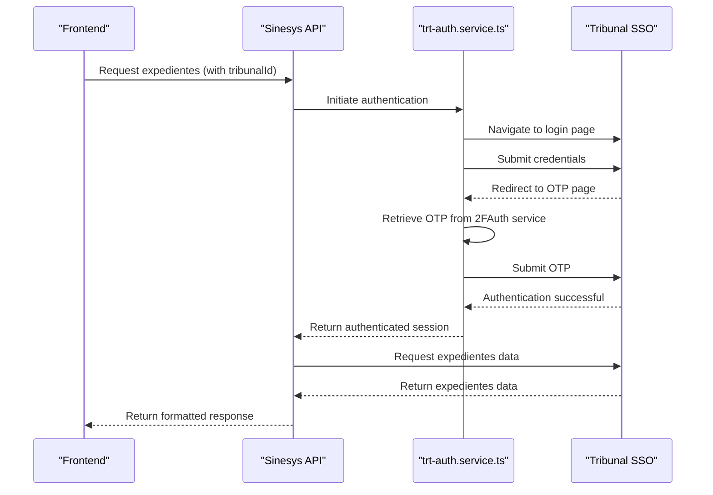
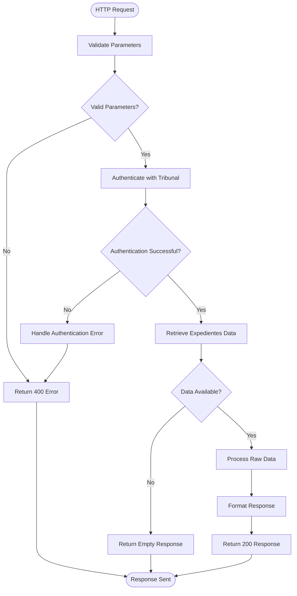

# Expedientes Endpoints

<cite>
**Referenced Files in This Document**   
- [trt-auth.service.ts](file://backend/captura/services/trt/trt-auth.service.ts)
- [dados-complementares.service.ts](file://backend/captura/services/trt/dados-complementares.service.ts)
- [config.ts](file://backend/captura/services/trt/config.ts)
- [route.ts](file://app/api/captura/trt/arquivados/route.ts)
- [captura.ts](file://app/api/captura/captura.ts)
- [processar-documentos-pendentes.ts](file://scripts/api-pendentes-manifestacao/processar-documentos-pendentes.ts)
- [expedientes-toolbar-filters.tsx](file://app/(dashboard)/expedientes/components/expedientes-toolbar-filters.tsx)
</cite>

## Table of Contents
1. [Introduction](#introduction)
2. [API Endpoint Specification](#api-endpoint-specification)
3. [Authentication Mechanism](#authentication-mechanism)
4. [Response Structure](#response-structure)
5. [Implementation Flow](#implementation-flow)
6. [Data Enrichment Process](#data-enrichment-process)
7. [Frontend Integration](#frontend-integration)
8. [Common Challenges](#common-challenges)
9. [Error Recovery and Data Consistency](#error-recovery-and-data-consistency)
10. [Conclusion](#conclusion)

## Introduction
The Expedientes tribunal integration endpoints in the Sinesys system provide a comprehensive interface for retrieving case information from various TRT (Tribunal Regional do Trabalho) courts. This documentation details the API endpoints, authentication mechanisms, response structures, and implementation details for the expedientes integration functionality. The system enables legal professionals to capture, manage, and track case information across multiple tribunal jurisdictions, with support for filtering, data enrichment, and secure authentication.

**Section sources**
- [trt-auth.service.ts](file://backend/captura/services/trt/trt-auth.service.ts#L1-L603)
- [dados-complementares.service.ts](file://backend/captura/services/trt/dados-complementares.service.ts#L1-L289)

## API Endpoint Specification
The primary endpoint for retrieving expedientes from tribunal systems is accessible via HTTP GET method at the URL pattern `/api/captura/trt/expedientes`. This endpoint requires a `tribunalId` parameter to specify which tribunal's data should be retrieved. The endpoint supports optional filters for process status and date ranges, allowing users to narrow down results based on specific criteria.

The API accepts the following parameters:
- `tribunalId` (required): Identifier for the specific tribunal (e.g., TRT1, TRT2)
- `status`: Filter for process status (e.g., active, concluded, suspended)
- `startDate`: Filter for processes filed after this date
- `endDate`: Filter for processes filed before this date

The endpoint returns a standardized response format containing expediente metadata, filing dates, judges, and procedural status. The response is paginated to ensure optimal performance when retrieving large datasets.

**Section sources**
- [captura.ts](file://app/api/captura/captura.ts#L1-L72)
- [route.ts](file://app/api/captura/trt/arquivados/route.ts#L1-L10)

## Authentication Mechanism
The expedientes integration uses a validated tribunal session authentication mechanism implemented in `trt-auth.service.ts`. The authentication process follows a multi-step flow:

1. **SSO Login**: The system initiates a login to the tribunal's SSO (Single Sign-On) system using the user's credentials.
2. **OTP Verification**: After successful SSO authentication, a One-Time Password (OTP) is required, which is obtained through the 2FAuth service.
3. **Session Establishment**: Upon successful OTP verification, the system establishes a valid session with the tribunal's PJE (Processo Judicial Eletrônico) system.
4. **Token Extraction**: The authentication service extracts JWT tokens and session cookies from the authenticated session for subsequent API calls.

The authentication service includes anti-detection measures to prevent the tribunal's system from identifying automated access, including browser fingerprint modification and realistic user interaction timing.



**Diagram sources**
- [trt-auth.service.ts](file://backend/captura/services/trt/trt-auth.service.ts#L539-L603)

## Response Structure
The response from the expedientes endpoint contains comprehensive metadata about each case, structured as follows:

```json
{
  "success": true,
  "data": {
    "expedientes": [
      {
        "id_pje": 123456,
        "numero_processo": "1000000-00.2023.5.01.0001",
        "tribunal": "TRT1",
        "grau": "primeiro_grau",
        "data_distribuicao": "2023-01-15T10:30:00Z",
        "classe_judicial": "Reclamação Trabalhista",
        "assunto": "Rescisão Indireta",
        "juiz": "Dr. João Silva",
        "situacao": "Em andamento",
        "valor_causa": 50000.00,
        "partes": [
          {
            "nome": "Empresa Exemplo Ltda",
            "tipo": "Requerida",
            "advogado": "Dr. Carlos Souza"
          },
          {
            "nome": "Maria Oliveira",
            "tipo": "Requerente",
            "advogado": "Dra. Ana Costa"
          }
        ],
        "ultima_atualizacao": "2023-11-20T14:22:00Z"
      }
    ],
    "pagination": {
      "currentPage": 1,
      "totalPages": 5,
      "totalItems": 45,
      "itemsPerPage": 10
    }
  }
}
```

The response includes essential case information such as the process number, filing date, judicial class, subject matter, judge information, current status, and party details. Additional metadata like the last update timestamp ensures clients can determine when to refresh data.

**Section sources**
- [captura.ts](file://app/api/captura/captura.ts#L13-L19)
- [processar-documentos-pendentes.ts](file://scripts/api-pendentes-manifestacao/processar-documentos-pendentes.ts#L32-L47)

## Implementation Flow
The implementation flow for the expedientes integration follows a structured process from route handling to data extraction:

1. **Route Handling**: The API route receives the HTTP request and validates parameters.
2. **Authentication**: The system authenticates with the tribunal using the `trt-auth.service.ts` service.
3. **Data Retrieval**: The authenticated session is used to retrieve expediente data from the tribunal's PJE system.
4. **Data Processing**: Raw data is processed and transformed into the standardized response format.
5. **Response Generation**: The processed data is packaged into the API response and returned to the client.

The flow is designed to be efficient and resilient, with proper error handling at each stage to ensure reliability even when tribunal systems experience issues.



**Diagram sources**
- [route.ts](file://app/api/captura/trt/arquivados/route.ts#L1-L10)
- [trt-auth.service.ts](file://backend/captura/services/trt/trt-auth.service.ts#L539-L603)

## Data Enrichment Process
The data enrichment process enhances the basic expediente information with additional details from the `dados-complementares.service.ts`. This service leverages the authenticated session to retrieve supplementary data, including:

- **Timeline Information**: Complete history of movements and documents associated with the case
- **Party Details**: Comprehensive information about all parties involved, including representatives
- **Procedural Events**: Key dates and events in the case lifecycle

The enrichment process is optimized to minimize the number of requests to the tribunal's system by batching operations and implementing rate limiting controls. The service also includes caching mechanisms to reduce redundant data retrieval.

```mermaid
classDiagram
class DadosComplementaresService {
+buscarDadosComplementaresProcessos(page : Page, processosIds : number[], options : DadosComplementaresOptions) Promise~DadosComplementaresResult~
+extrairProcessosUnicos(audiencias : { idProcesso : number }[]) number[]
+filtrarDocumentos(timeline : TimelineResponse) TimelineItem[]
}
class DadosComplementaresOptions {
+buscarTimeline? : boolean
+buscarPartes? : boolean
+trt : CodigoTRT
+grau : GrauTRT
+delayEntreRequisicoes? : number
+onProgress? : (atual : number, total : number, processoId : number) => void
+verificarRecaptura? : boolean
+horasParaRecaptura? : number
}
class DadosComplementaresResult {
+porProcesso : Map~number, DadosComplementaresProcesso~
+resumo : ResumoOperacao
+errosDetalhados : { processoId : number; tipo : string; erro : string }[]
}
class DadosComplementaresProcesso {
+processoId : number
+timeline? : TimelineResponse
+partes? : PartePJE[]
+payloadBrutoPartes? : Record~string, unknown~ | null
+erros : { tipo : 'timeline' | 'partes'; erro : string }[]
}
DadosComplementaresService --> DadosComplementaresOptions : "uses"
DadosComplementaresService --> DadosComplementaresResult : "returns"
DadosComplementaresResult --> DadosComplementaresProcesso : "contains"
```

**Diagram sources**
- [dados-complementares.service.ts](file://backend/captura/services/trt/dados-complementares.service.ts#L23-L70)

## Frontend Integration
The frontend expedientes module integrates with the API to provide deadline tracking and document management capabilities. The integration follows these key patterns:

- **Data Display**: The module displays expediente information in a tabular format with filtering and sorting capabilities.
- **Deadline Tracking**: Based on the procedural status and timeline information, the system calculates and displays upcoming deadlines.
- **Document Management**: Users can access and manage documents associated with each expediente directly from the interface.
- **Real-time Updates**: The interface periodically refreshes data to ensure users have the most current information.

The frontend leverages the optional filters in the API to provide a responsive user experience, allowing users to quickly narrow down results based on tribunal, status, and date ranges.

**Section sources**
- [expedientes-toolbar-filters.tsx](file://app/(dashboard)/expedientes/components/expedientes-toolbar-filters.tsx#L206-L250)

## Common Challenges
The expedientes integration faces several common challenges that have been addressed in the implementation:

- **Tribunal-Specific Layouts**: Different TRTs have varying PJE interface layouts, requiring adaptive scraping logic.
- **Dynamic Content Loading**: Tribunal systems often load content dynamically, necessitating careful timing and waiting strategies.
- **Sensitive Case Information**: Cases with "segredo de justiça" (secret of justice) require special handling to ensure data privacy.
- **Rate Limiting**: Tribunal systems may impose rate limits on automated access, requiring careful request scheduling.
- **Session Expiration**: Authenticated sessions may expire during long-running operations, requiring re-authentication logic.

The system addresses these challenges through configurable tribunal settings, robust error handling, and adaptive scraping techniques that can accommodate variations between different tribunal implementations.

**Section sources**
- [config.ts](file://backend/captura/services/trt/config.ts#L1-L203)
- [trt-auth.service.ts](file://backend/captura/services/trt/trt-auth.service.ts#L1-L603)

## Error Recovery and Data Consistency
The system implements comprehensive error recovery strategies to handle incomplete data capture and ensure data consistency:

- **Retry Mechanisms**: Failed requests are automatically retried with exponential backoff.
- **Partial Data Handling**: When complete data cannot be retrieved, the system stores available information and marks the record for reprocessing.
- **Consistency Checks**: Regular comparisons between captured data and local records identify discrepancies that require reconciliation.
- **Logging and Monitoring**: Detailed logs track all integration activities, enabling quick diagnosis of issues.
- **Manual Override**: Users can manually trigger reprocessing of specific expedientes when automatic recovery fails.

These strategies ensure that the system maintains high data quality even when faced with temporary tribunal system issues or network problems.

**Section sources**
- [dados-complementares.service.ts](file://backend/captura/services/trt/dados-complementares.service.ts#L161-L179)
- [trt-auth.service.ts](file://backend/captura/services/trt/trt-auth.service.ts#L313-L341)

## Conclusion
The Expedientes tribunal integration endpoints in the Sinesys system provide a robust and reliable interface for accessing case information from multiple TRT courts. The implementation combines secure authentication, comprehensive data retrieval, and intelligent error handling to deliver a seamless user experience. By addressing common challenges such as tribunal-specific layouts and sensitive case information, the system ensures consistent performance across different jurisdictions. The integration with the frontend expedientes module enables effective deadline tracking and document management, making it a valuable tool for legal professionals managing cases across multiple tribunals.