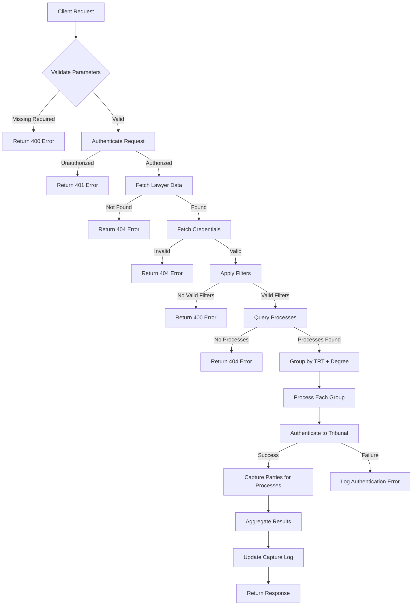
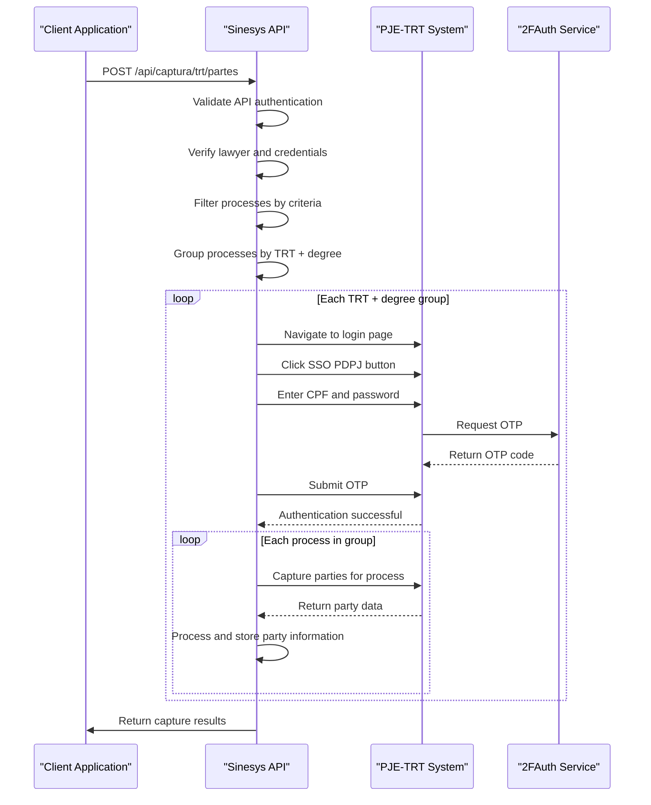
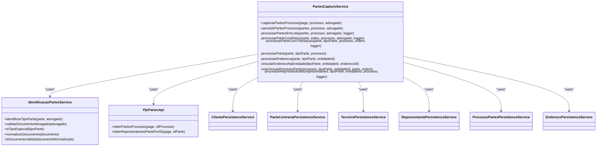
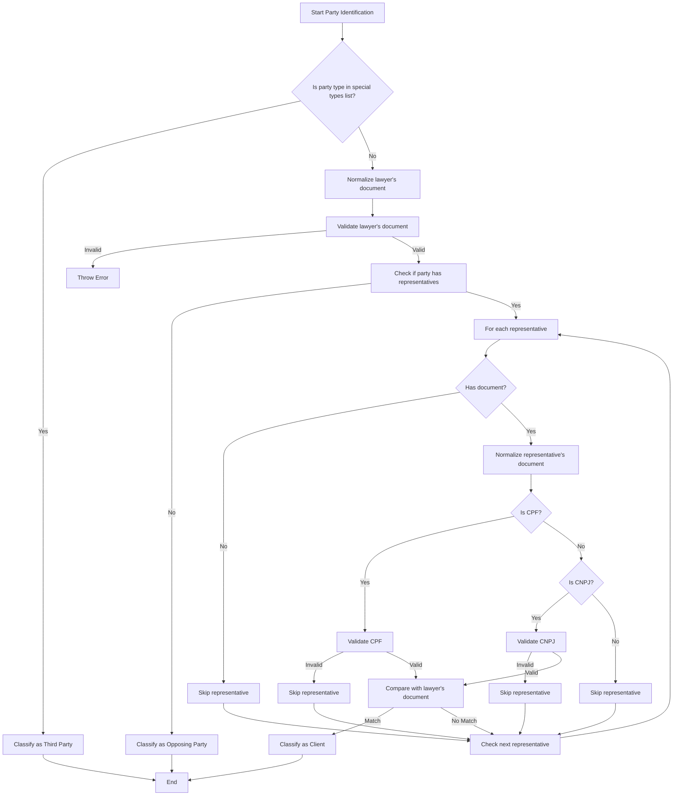
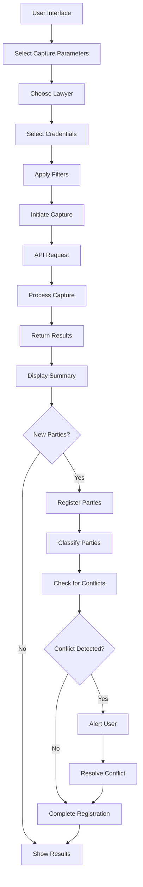
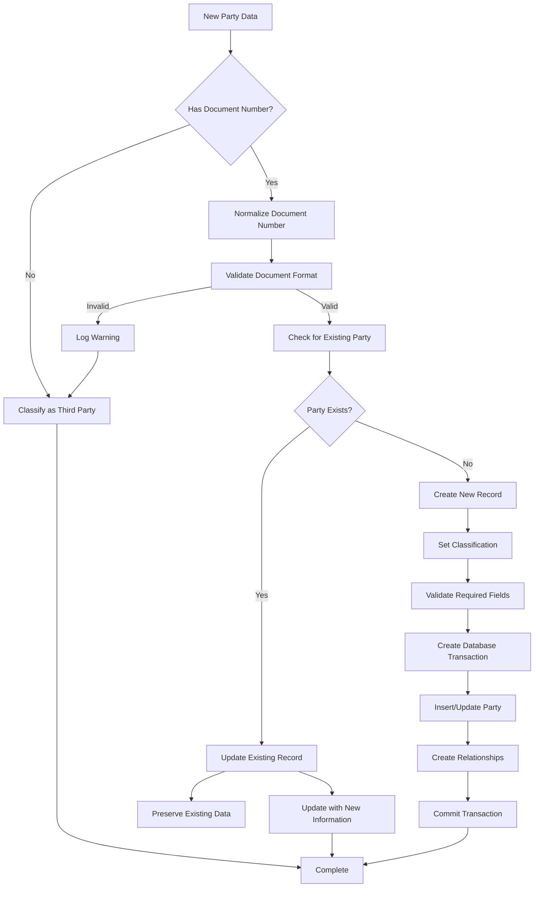
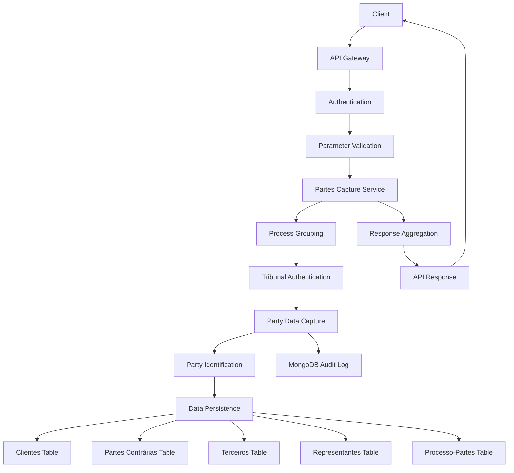

# Partes Endpoints

<cite>
**Referenced Files in This Document**   
- [route.ts](file://app/api/captura/trt/partes/route.ts)
- [obter-partes.ts](file://backend/api/pje-trt/partes/obter-partes.ts)
- [obter-representantes.ts](file://backend/api/pje-trt/partes/obter-representantes.ts)
- [partes-capture.service.ts](file://backend/captura/services/partes/partes-capture.service.ts)
- [identificacao-partes.service.ts](file://backend/captura/services/partes/identificacao-partes.service.ts)
- [trt-auth.service.ts](file://backend/captura/services/trt/trt-auth.service.ts)
- [tribunal-config-persistence.service.ts](file://backend/captura/services/persistence/tribunal-config-persistence.service.ts)
</cite>

## Table of Contents
1. [Introduction](#introduction)
2. [API Endpoint Details](#api-endpoint-details)
3. [Authentication and Session Management](#authentication-and-session-management)
4. [Response Schema](#response-schema)
5. [Partes Capture Service Implementation](#partes-capture-service-implementation)
6. [Party Identification Logic](#party-identification-logic)
7. [Frontend Integration and Usage](#frontend-integration-and-usage)
8. [Data Validation and Deduplication](#data-validation-and-deduplication)
9. [Common Issues and Edge Cases](#common-issues-and-edge-cases)
10. [Architecture and Data Flow](#architecture-and-data-flow)

## Introduction
This document provides comprehensive API documentation for the Partes tribunal integration endpoints in the Sinesys system. The integration allows for the capture of party information from tribunal systems, specifically focusing on the TRT (Tribunal Regional do Trabalho) network. The system enables automatic party registration, conflict checking, and maintains relationships between parties, processes, and representatives. This documentation covers the HTTP endpoints, authentication mechanisms, data structures, implementation details, and usage patterns within the Sinesys ecosystem.

**Section sources**
- [route.ts](file://app/api/captura/trt/partes/route.ts)

## API Endpoint Details
The Partes integration exposes a POST endpoint at `/api/captura/trt/partes` that retrieves party information from tribunal systems. Despite the documentation objective mentioning a GET method, the actual implementation uses POST to handle complex filtering parameters and maintain security best practices. The endpoint requires authentication via bearer token, session cookie, or service API key.

The endpoint accepts a JSON payload with the following parameters:
- `advogado_id`: Required integer identifying the lawyer for client identification
- `credencial_ids`: Required array of credential IDs for tribunal authentication
- `processo_ids`: Optional array of process IDs to filter capture
- `trts`: Optional array of tribunal codes (e.g., "TRT3", "TRT5")
- `graus`: Optional array of process degrees ("primeiro_grau", "segundo_grau")
- `numero_processo`: Optional specific process number for capture
- `numeros_processo`: Optional array of process numbers for capture

The response includes comprehensive statistics about the capture operation, including counts of total processes, parties, clients, opposing parties, third parties, representatives, and created relationships. Error information is provided for any processes that failed during capture.



**Diagram sources**
- [route.ts](file://app/api/captura/trt/partes/route.ts)

**Section sources**
- [route.ts](file://app/api/captura/trt/partes/route.ts)

## Authentication and Session Management
The Partes integration uses established tribunal sessions and credential validation for authentication. The system implements a multi-layered authentication approach that begins with API-level authentication and extends to tribunal-specific authentication.

At the API level, requests must be authenticated using one of three methods: bearer token, session cookie, or service API key. Once API authentication is successful, the system validates the provided `advogado_id` and `credencial_ids` to ensure they exist in the database. The credentials contain the necessary login information (CPF and password) for accessing the tribunal systems.

For tribunal authentication, the system uses Playwright to automate the login process through the PJE (Processo Judicial Eletrônico) portal. The authentication flow involves:
1. Navigating to the tribunal's login page
2. Clicking the SSO PDPJ button to initiate government authentication
3. Entering the lawyer's CPF and password
4. Processing two-factor authentication (OTP) using the 2FAuth service
5. Capturing authentication tokens (access_token and XSRF-Token) from cookies

The system optimizes performance by grouping processes by tribunal and degree, allowing a single authentication session to be reused for multiple processes within the same group. This reduces the number of authentication operations and improves overall efficiency.



**Diagram sources**
- [route.ts](file://app/api/captura/trt/partes/route.ts)
- [trt-auth.service.ts](file://backend/captura/services/trt/trt-auth.service.ts)

**Section sources**
- [route.ts](file://app/api/captura/trt/partes/route.ts)
- [trt-auth.service.ts](file://backend/captura/services/trt/trt-auth.service.ts)

## Response Schema
The response from the `/api/captura/trt/partes` endpoint follows a standardized schema that provides comprehensive information about the capture operation. The response is a JSON object with the following structure:

```json
{
  "success": true,
  "message": "Captura de partes concluída",
  "data": {
    "total_processos": 5,
    "total_partes": 23,
    "clientes": 8,
    "partes_contrarias": 12,
    "terceiros": 3,
    "representantes": 15,
    "vinculos": 23,
    "erros": [],
    "duracao_ms": 12450
  }
}
```

The `data` object contains the following properties:
- `total_processos`: Integer representing the total number of processes processed
- `total_partes`: Integer representing the total number of parties found across all processes
- `clientes`: Integer representing the number of clients identified
- `partes_contrarias`: Integer representing the number of opposing parties identified
- `terceiros`: Integer representing the number of third parties (experts, MP, witnesses, etc.)
- `representantes`: Integer representing the total number of representatives saved
- `vinculos`: Integer representing the total number of process-party relationships created
- `erros`: Array of error objects, each containing `processo_id`, `numero_processo`, and `erro` fields
- `duracao_ms`: Integer representing the total execution time in milliseconds

Error responses follow a different schema with an `error` field containing a descriptive message. The endpoint returns appropriate HTTP status codes (400, 401, 404, 500) based on the error type.

**Section sources**
- [route.ts](file://app/api/captura/trt/partes/route.ts)

## Partes Capture Service Implementation
The partes capture service is implemented in the `partes-capture.service.ts` file and follows a modular architecture with clear separation of concerns. The service coordinates the capture of party information from tribunal systems and persists it in the local database.

The core function `capturarPartesProcesso` takes a Playwright Page object, process information, and lawyer identification data as parameters. It orchestrates the following steps:
1. Fetches party data from the tribunal API using `obterPartesProcesso`
2. Identifies the type of each party (client, opposing party, or third party)
3. Persists the party data in the appropriate database table
4. Processes and saves the party's address information
5. Creates the relationship between the party and the process
6. Processes and saves the party's representatives

The service implements several optimization strategies:
- Parallel processing of parties with configurable concurrency limits
- Retry mechanisms for transient failures
- Distributed locking to prevent concurrent captures of the same process
- Performance monitoring with configurable thresholds

The service also handles data transformation, mapping the tribunal's data structure to the internal data model. This includes normalizing document numbers (CPF/CNPJ), extracting nested fields, and preserving the original raw data for auditing purposes.



**Diagram sources**
- [partes-capture.service.ts](file://backend/captura/services/partes/partes-capture.service.ts)
- [identificacao-partes.service.ts](file://backend/captura/services/partes/identificacao-partes.service.ts)

**Section sources**
- [partes-capture.service.ts](file://backend/captura/services/partes/partes-capture.service.ts)

## Party Identification Logic
The party identification logic is implemented in the `identificacao-partes.service.ts` file and follows a hierarchical decision process to classify each party. The system uses a combination of party type and representative information to determine whether a party should be classified as a client, opposing party, or third party.

The identification algorithm follows these steps in order of priority:
1. Check if the party type is in the list of special types (e.g., "PERITO", "MINISTERIO_PUBLICO", "TESTEMUNHA")
2. If not a special type, check if any of the party's representatives have a CPF/CNPJ that matches the lawyer's document
3. If no matching representative is found, classify the party as an opposing party

The list of special types includes roles that are considered third parties regardless of representation, such as experts, public prosecutors, witnesses, and court-appointed officials. This ensures that these parties are always classified correctly, even if they are represented by lawyers from the same office.

For client identification, the system compares the normalized CPF/CNPJ of each representative with the lawyer's document. The normalization process removes formatting characters (dots, hyphens, slashes) to ensure accurate comparison. The system validates that both the lawyer's document and the representative's document are valid (11 digits for CPF, 14 digits for CNPJ) before comparison.

The identification service also includes validation functions to ensure data integrity. The `validarDocumentoAdvogado` function validates the lawyer's document at the beginning of the capture process, preventing repeated validation for each party. This improves performance and ensures consistent error handling.



**Diagram sources**
- [identificacao-partes.service.ts](file://backend/captura/services/partes/identificacao-partes.service.ts)

**Section sources**
- [identificacao-partes.service.ts](file://backend/captura/services/partes/identificacao-partes.service.ts)

## Frontend Integration and Usage
The frontend parts management system uses the captured party data for automatic party registration and conflict checking. The system integrates with the partes endpoints through the dashboard interface, specifically in the partes module.

When a user initiates a capture operation from the frontend, the system collects the necessary parameters (lawyer ID, credential IDs, and filters) and sends them to the `/api/captura/trt/partes` endpoint. The frontend provides a user interface for selecting which processes to capture, either by specific process numbers, tribunal codes, or process degrees.

Upon successful capture, the frontend displays a summary of the results, showing the number of processes processed, parties found, clients identified, and any errors that occurred. The system automatically registers new parties in the local database, categorizing them as clients, opposing parties, or third parties based on the identification logic.

For conflict checking, the system compares the newly captured parties against existing parties in the database. If a party with the same CPF/CNPJ already exists but with a different classification, the system alerts the user to the potential conflict. This helps prevent duplicate entries and ensures data consistency.

The frontend also provides detailed views of each party, including their name, role in the process, representation status, and identification numbers. Users can edit party information, add additional details, or link parties to other entities in the system.



**Section sources**
- [page.tsx](file://app/(dashboard)/partes/page.tsx)

## Data Validation and Deduplication
The system implements comprehensive data validation and deduplication strategies when integrating party information with the local partes system. These mechanisms ensure data integrity, prevent duplicates, and maintain consistency across the database.

Data validation occurs at multiple levels:
1. API parameter validation: Ensures required parameters are present and properly formatted
2. Document validation: Validates CPF/CNPJ numbers for correct length and format
3. Schema validation: Validates the structure of data received from tribunal APIs
4. Business rule validation: Enforces domain-specific rules (e.g., clients must have valid documents)

For deduplication, the system uses CPF/CNPJ as the primary key for party identification. When a new party is captured, the system first checks if a party with the same document number already exists in the appropriate table (clientes, partes_contrarias, or terceiros). If a match is found, the existing record is updated with new information; otherwise, a new record is created.

The system also handles edge cases such as:
- Parties without document numbers (classified as third parties with limited information)
- Name variations across different tribunals (resolved through document-based matching)
- Corporate parties with multiple representation structures
- Parties with incomplete or missing contact information

To ensure data consistency, the system uses database transactions when creating or updating party records and their relationships. This prevents partial updates and maintains referential integrity.



**Section sources**
- [partes-capture.service.ts](file://backend/captura/services/partes/partes-capture.service.ts)

## Common Issues and Edge Cases
The Partes integration handles several common issues and edge cases that arise when working with tribunal data. These include name variations across tribunals, representation identification challenges, and corporate party handling.

Name variations are addressed through document-based matching rather than name matching. Since CPF/CNPJ numbers are unique identifiers, the system can reliably identify the same party across different tribunals even if their name is spelled differently or formatted inconsistently. This approach prevents duplicate entries and ensures accurate party tracking.

Representation identification can be challenging when representatives have incomplete information. The system handles this by:
- Validating representative documents before comparison
- Handling cases where OAB numbers are missing or incomplete
- Supporting both individual lawyers and law firms as representatives
- Processing representatives with incomplete contact information

Corporate parties present additional complexity due to their organizational structure. The system handles corporate parties by:
- Treating them as legal entities with CNPJ as the primary identifier
- Capturing additional corporate information such as state registration, opening date, and business activity
- Supporting multiple representatives for the same corporate party
- Handling special cases like public agencies and official entities

The system also addresses performance considerations by implementing distributed locking to prevent concurrent captures of the same process, retry mechanisms for transient failures, and batch processing to optimize database operations.

**Section sources**
- [identificacao-partes.service.ts](file://backend/captura/services/partes/identificacao-partes.service.ts)
- [partes-capture.service.ts](file://backend/captura/services/partes/partes-capture.service.ts)

## Architecture and Data Flow
The Partes integration follows a layered architecture with clear separation between API endpoints, business logic, and data persistence. The system is designed for scalability, reliability, and maintainability.

The data flow begins with an HTTP request to the `/api/captura/trt/partes` endpoint. The request is authenticated and validated before being processed by the partes capture service. This service coordinates the capture of party information from tribunal systems using Playwright to automate browser interactions.

Once party data is retrieved, it is processed by the identification service to determine the party type (client, opposing party, or third party). The processed data is then persisted in the appropriate database tables using dedicated persistence services for each entity type.

The system uses Supabase as the primary database, with tables for clients, opposing parties, third parties, representatives, and process-party relationships. MongoDB is used for audit logging, storing raw capture data for compliance and debugging purposes.

The architecture includes several key components:
- API Gateway: Handles authentication, rate limiting, and request routing
- Capture Service: Orchestrates the capture process and business logic
- Persistence Layer: Manages database operations and data integrity
- Authentication Service: Handles tribunal login and session management
- Logging Service: Records audit trails and operational metrics

This modular design allows for independent scaling of components and facilitates maintenance and updates.



**Diagram sources**
- [route.ts](file://app/api/captura/trt/partes/route.ts)
- [partes-capture.service.ts](file://backend/captura/services/partes/partes-capture.service.ts)

**Section sources**
- [route.ts](file://app/api/captura/trt/partes/route.ts)
- [partes-capture.service.ts](file://backend/captura/services/partes/partes-capture.service.ts)