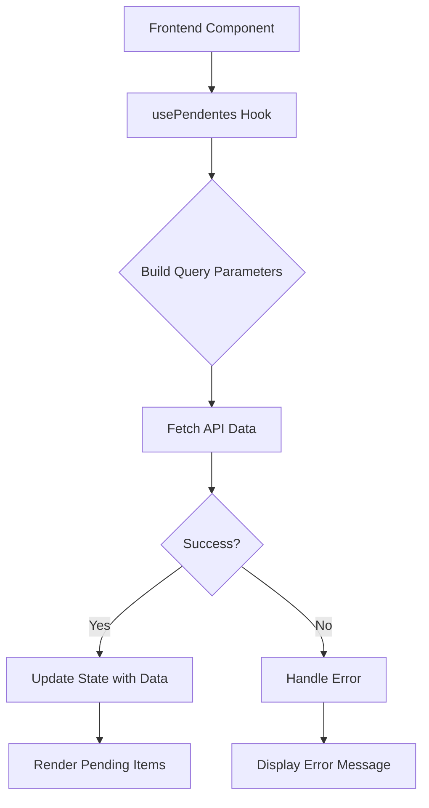

# Pendentes Manifestação Endpoints

<cite>
**Referenced Files in This Document**   
- [route.ts](file://app/api/pendentes-manifestacao/route.ts)
- [pendentes-manifestacao.service.ts](file://backend/captura/services/trt/pendentes-manifestacao.service.ts)
- [trt-auth.service.ts](file://backend/captura/services/trt/trt-auth.service.ts)
- [listar-pendentes.service.ts](file://backend/expedientes/services/listar-pendentes.service.ts)
- [types.ts](file://backend/types/expedientes/types.ts)
- [use-pendentes.ts](file://app/_lib/hooks/use-pendentes.ts)
- [pendentes-form.tsx](file://app/(dashboard)/captura/components/pendentes-form.tsx)
</cite>

## Table of Contents
1. [Introduction](#introduction)
2. [API Endpoint Details](#api-endpoint-details)
3. [Authentication Mechanism](#authentication-mechanism)
4. [Response Schema](#response-schema)
5. [Implementation Details](#implementation-details)
6. [Frontend Integration](#frontend-integration)
7. [Error Handling and Validation](#error-handling-and-validation)
8. [Common Challenges](#common-challenges)
9. [Conclusion](#conclusion)

## Introduction
The Pendentes Manifestação endpoints in the Sinesys system provide integration with tribunal systems to retrieve pending manifestation items that require legal action. This documentation details the API endpoint `/api/captura/trt/pendentes-manifestacao` with the tribunalId parameter, which retrieves pending manifestation items with deadlines, process references, and document links. The system uses validated tribunal sessions for authentication and provides comprehensive data for automatic deadline tracking and notification generation in the frontend pendentes module.

## API Endpoint Details

The API endpoint for retrieving pending manifestation items is a HTTP GET method with the following characteristics:

- **Method**: GET
- **URL Pattern**: `/api/captura/trt/pendentes-manifestacao`
- **Parameters**: 
  - `tribunalId` (required): The identifier for the tribunal
  - Various filtering, pagination, sorting, and grouping parameters

The endpoint supports extensive query parameters for filtering and sorting the results:

**Pagination Parameters**
- `pagina`: Page number (default: 1)
- `limite`: Items per page (default: 50, maximum: 100)

**Filtering Parameters**
- `trt`: Filter by TRT code (e.g., TRT3, TRT1)
- `grau`: Filter by process degree (primeiro_grau, segundo_grau)
- `responsavel_id`: Filter by responsible party ID
- `busca`: Text search across multiple fields including process number, party names, and court descriptions
- `numero_processo`: Filter by process number (partial match)
- `nome_parte_autora`: Filter by plaintiff name (partial match)
- `nome_parte_re`: Filter by defendant name (partial match)
- `prazo_vencido`: Filter by expired deadline (true/false)
- Date range filters for various dates including legal deadline, knowledge date, and creation date

**Sorting Parameters**
- `ordenar_por`: Field to sort by (default: data_prazo_legal_parte)
- `ordem`: Sort direction (asc/desc)

**Grouping Parameters**
- `agrupar_por`: Field to group results by (e.g., trt, grau, responsavel_id)
- `incluir_contagem`: Whether to include counts in grouped results

The endpoint returns a JSON response with success status and data containing the pending items or grouped results with counts.

**Section sources**
- [route.ts](file://app/api/pendentes-manifestacao/route.ts#L1-L482)

## Authentication Mechanism

The authentication mechanism for the Pendentes Manifestação endpoints uses validated tribunal sessions through the TRT authentication service. The authentication process follows a multi-step flow to ensure secure access to tribunal data.

The authentication process begins with SSO (Single Sign-On) login to the PDPJ system using government credentials (gov.br). After successful SSO authentication, a two-factor authentication (2FA) process is required using OTP (One-Time Password) codes. The system integrates with a 2FAuth service to obtain and validate OTP codes.

The authentication service implements several security measures:
- JWT (JSON Web Token) tokens are captured from cookies after successful login
- XSRF tokens are captured for CSRF protection
- The authentication service extracts lawyer information (ID, CPF, name) from the JWT payload
- Anti-detection configurations are applied to prevent browser automation detection

The authentication flow is implemented in the `trt-auth.service.ts` file, which handles the complete authentication process including:
1. Initializing the browser connection (remote or local)
2. Applying anti-detection configurations
3. Performing SSO login with credentials
4. Processing OTP verification
5. Capturing authentication tokens and cookies
6. Extracting lawyer information from the JWT

The service returns an authentication result containing the authenticated page, browser instance, browser context, lawyer information, and authentication tokens. This authenticated session is then used for subsequent API calls to retrieve pending manifestation data.

**Section sources**
- [trt-auth.service.ts](file://backend/captura/services/trt/trt-auth.service.ts#L1-L603)

## Response Schema

The response schema for the Pendentes Manifestação endpoint contains detailed information about pending manifestation items. The response structure varies depending on whether grouping is requested.

**Standard Response (without grouping)**
```json
{
  "success": true,
  "data": {
    "pendentes": [
      {
        "id": 1,
        "id_pje": 12345,
        "advogado_id": 678,
        "processo_id": 901,
        "trt": "TRT3",
        "grau": "primeiro_grau",
        "numero_processo": "0010014-94.2025.5.03.0022",
        "descricao_orgao_julgador": "Vigésima Terceira Vara do Trabalho de São Paulo",
        "classe_judicial": "ATOrd",
        "numero": 10014,
        "segredo_justica": false,
        "codigo_status_processo": "DISTRIBUIDO",
        "prioridade_processual": 1,
        "nome_parte_autora": "João Silva",
        "qtde_parte_autora": 1,
        "nome_parte_re": "Empresa XYZ",
        "qtde_parte_re": 1,
        "data_autuacao": "2025-01-15T10:00:00.000Z",
        "juizo_digital": true,
        "data_arquivamento": null,
        "id_documento": 54321,
        "data_ciencia_parte": "2025-01-16T14:30:00.000Z",
        "data_prazo_legal_parte": "2025-01-20T10:00:00.000Z",
        "data_criacao_expediente": "2025-01-16T14:30:00.000Z",
        "prazo_vencido": false,
        "sigla_orgao_julgador": "VT23SP",
        "baixado_em": null,
        "protocolo_id": null,
        "justificativa_baixa": null,
        "responsavel_id": 123,
        "tipo_expediente_id": 456,
        "descricao_arquivos": "Petição Inicial",
        "arquivo_nome": "peticao-inicial.pdf",
        "arquivo_url": "https://storage.example.com/peticao-inicial.pdf",
        "arquivo_key": "documents/peticao-inicial.pdf",
        "arquivo_bucket": "sinesys-documents",
        "observacoes": "Urgente: resposta em 5 dias úteis",
        "created_at": "2025-01-16T14:30:00.000Z",
        "updated_at": "2025-01-16T14:30:00.000Z"
      }
    ],
    "paginacao": {
      "pagina": 1,
      "limite": 50,
      "total": 100,
      "totalPaginas": 2
    }
  }
}
```

**Grouped Response (with agrupar_por parameter)**
```json
{
  "success": true,
  "data": {
    "agrupamentos": [
      {
        "grupo": "vencido",
        "quantidade": 15
      },
      {
        "grupo": "no_prazo",
        "quantidade": 85
      }
    ],
    "total": 100
  }
}
```

The response includes the following key fields:
- **id**: Internal identifier for the pending item
- **numero_processo**: Process number in standard format
- **nome_parte_autora/nome_parte_re**: Names of plaintiff and defendant
- **data_prazo_legal_parte**: Legal deadline date for the manifestation
- **prazo_vencido**: Boolean indicating if the deadline has expired
- **descricao_orgao_julgador**: Description of the judicial body
- **classe_judicial**: Judicial class code
- **arquivo_url**: Direct link to the document
- **observacoes**: Internal notes or observations

The schema also includes metadata fields like creation and update timestamps, responsible party ID, and process status information.

**Section sources**
- [types.ts](file://backend/types/expedientes/types.ts#L1-L179)

## Implementation Details

The implementation of the Pendentes Manifestação functionality is structured in a multi-phase service that optimizes the capture process while maintaining data integrity. The core implementation is located in the `pendentes-manifestacao.service.ts` file and follows a six-phase approach.

**Phase 1: Authentication**
The service begins by authenticating with the tribunal system using the `autenticarPJE` function from the TRT authentication service. This establishes a valid session with the tribunal's PJE system using SSO and 2FA authentication.

**Phase 2: Fetch Pending Items**
After authentication, the service retrieves pending manifestation items from the tribunal's API using the `obterTodosProcessosPendentesManifestacao` function. This call returns a list of pending items with their basic information including process IDs and deadlines.

**Phase 3: Extract Unique Processes**
The service extracts unique process IDs from the list of pending items to avoid duplicate processing. This is done using a Set to ensure each process is only processed once, regardless of how many pending items it has.

**Phase 4: Fetch Complementary Data**
For each unique process, the service retrieves additional data including:
- Timeline information (movements and documents)
- Party information (plaintiffs, defendants, third parties)
- Process details

This phase includes recapture verification to avoid reprocessing recently updated processes, with a default threshold of 24 hours since the last update.

**Phase 5: Data Persistence**
The captured data is persisted in the following order to ensure referential integrity:
1. Timeline data is stored in MongoDB
2. Party information is stored with entity relationships
3. Pending items are stored in Supabase
4. Documents are downloaded and uploaded to cloud storage (optional)

The persistence layer uses a service client to interact with the database and includes error handling and logging for each operation.

**Phase 6: Browser Cleanup**
Finally, the browser instance is closed to free up resources and maintain security by terminating the authenticated session.

The service also includes comprehensive logging through the `captureLogService` which tracks the progress and any errors during the capture process. The result includes statistics on processed items, errors, and performance metrics.

**Section sources**
- [pendentes-manifestacao.service.ts](file://backend/captura/services/trt/pendentes-manifestacao.service.ts#L1-L456)

## Frontend Integration

The frontend pendentes module integrates with the Pendentes Manifestação API to provide automatic deadline tracking and notification generation. The integration is implemented through a React hook and UI components that consume the API data.

The primary integration point is the `usePendentes` hook located in `use-pendentes.ts`, which provides a clean interface for components to fetch pending manifestation data. The hook handles:
- Building the query string from parameters
- Making the API request
- Error handling and state management
- Caching and refetching capabilities



The hook converts the API response into a structured format with pending items and pagination information, making it easy for components to display the data.

The UI implementation includes the `PendentesForm` component which provides a form interface for initiating the capture process. This component allows users to:
- Select a lawyer
- Choose credentials
- Specify filters for pending items (with/without deadline)
- Initiate the capture process

The form handles validation and displays the results of the capture operation, including success/failure status and any error messages.

Key features of the frontend integration:
- Automatic deadline tracking based on the `data_prazo_legal_parte` field
- Visual indicators for expired deadlines (`prazo_vencido` field)
- Direct document access through `arquivo_url`
- Filtering and sorting capabilities matching the API parameters
- Pagination support for large result sets

The integration also includes components for managing deadlines, such as the `PrazoEditor` which allows users to set or update legal deadlines for pending items through a PATCH request to the API.

**Section sources**
- [use-pendentes.ts](file://app/_lib/hooks/use-pendentes.ts#L1-L137)
- [pendentes-form.tsx](file://app/(dashboard)/captura/components/pendentes-form.tsx#L1-L140)

## Error Handling and Validation

The Pendentes Manifestação system implements comprehensive error handling and validation at multiple levels to ensure data integrity and provide meaningful feedback to users.

**API-Level Validation**
The API endpoint performs validation on incoming parameters:
- Page number must be greater than or equal to 1
- Limit must be between 1 and 100
- Date parameters must be in valid ISO format
- Enum values must be from allowed options

When validation fails, the API returns a 400 status code with a descriptive error message explaining the specific validation issue.

**Service-Level Error Handling**
The backend service implements try-catch blocks around critical operations and provides detailed error logging:
- Authentication failures are caught and logged with context
- API request errors are handled with retry logic where appropriate
- Database operations include transaction management and rollback on failure
- Document download/upload errors are isolated to prevent affecting other operations

The service uses a `captureLogService` to track errors and successes throughout the capture process, providing a comprehensive log that can be used for debugging and monitoring.

**Frontend Error Handling**
The frontend implements robust error handling in the `usePendentes` hook:
- Network errors are caught and converted to user-friendly messages
- API error responses are parsed and displayed appropriately
- Loading and error states are managed to provide feedback to users
- The hook provides a `refetch` function to allow users to retry failed requests

**Data Validation Rules**
The system enforces several data validation rules to ensure deadline accuracy:
- Legal deadlines are validated against business days and court calendars
- Deadline calculations consider the date of knowledge (`data_ciencia_parte`)
- The `prazo_vencido` field is automatically calculated based on the current date and deadline
- Date ranges are validated to ensure start date is not after end date

The system also validates the integrity of related data:
- Process references are verified against the acervo (main process database)
- Document links are validated for accessibility
- Party information is cross-checked for consistency

Error responses follow a consistent format with a success flag, error message, and optional additional data for debugging.

**Section sources**
- [route.ts](file://app/api/pendentes-manifestacao/route.ts#L432-L479)
- [pendentes-manifestacao.service.ts](file://backend/captura/services/trt/pendentes-manifestacao.service.ts#L450-L455)

## Common Challenges

The Pendentes Manifestação integration faces several common challenges that have been addressed through specific implementation strategies.

**Varying Manifestation Requirement Formats Across Tribunals**
Different tribunals have varying formats and requirements for manifestation items, which presents a challenge for standardization. The system addresses this through:
- Flexible data modeling that accommodates tribunal-specific fields
- Configurable tribunal settings that define specific behaviors
- Normalization of data during the capture process
- Tribunal-specific parsing rules for deadline calculation

The system uses a configuration-based approach where each tribunal's specific requirements are stored in the database, allowing the capture service to adapt its behavior based on the tribunal being accessed.

**Handling Urgent Deadlines**
Urgent deadlines require special handling to ensure they are not missed. The system addresses this through:
- Priority sorting with urgent items displayed first
- Real-time deadline monitoring and notifications
- Visual indicators for imminent deadlines
- Automated reminders based on configurable thresholds

The frontend implements a deadline tracking system that calculates the time remaining and categorizes deadlines by urgency level, allowing users to focus on the most critical items.

**Authentication Session Management**
Maintaining valid authentication sessions with tribunal systems presents challenges due to:
- Session timeouts and expiration
- Two-factor authentication requirements
- Anti-automation measures implemented by tribunal systems

The system addresses these through:
- Robust session management with automatic re-authentication
- OTP handling with fallback to backup codes
- Anti-detection configurations to prevent browser automation detection
- Retry logic for transient authentication failures

**Data Consistency and Synchronization**
Ensuring data consistency between the tribunal systems and the Sinesys database requires careful synchronization. The system implements:
- Recapture verification to avoid unnecessary reprocessing
- Timestamp-based change detection
- Conflict resolution strategies for concurrent updates
- Data validation rules to maintain integrity

**Network and Performance Issues**
The integration with external tribunal systems can be affected by network latency and performance issues. The system mitigates these through:
- Rate limiting with configurable delays between requests
- Caching of frequently accessed data
- Asynchronous processing for long-running operations
- Progress tracking and user feedback during lengthy operations

These challenges are continuously monitored and addressed through system improvements and updates to maintain reliable integration with tribunal systems.

## Conclusion
The Pendentes Manifestação endpoints in the Sinesys system provide a robust integration with tribunal systems for managing pending legal manifestations. The API endpoint `/api/captura/trt/pendentes-manifestacao` offers comprehensive functionality for retrieving pending items with deadlines, process references, and document links.

The system implements a secure authentication mechanism using validated tribunal sessions through SSO and two-factor authentication. The response schema provides detailed information about pending items, including legal deadlines, party information, and document links, enabling effective deadline tracking and management.

The implementation follows a structured six-phase approach that optimizes the capture process while maintaining data integrity. The frontend integration through the `usePendentes` hook and related components provides a seamless user experience for managing pending manifestations.

Key features of the system include:
- Comprehensive filtering, sorting, and grouping capabilities
- Automatic deadline tracking and notification generation
- Secure authentication with session management
- Robust error handling and data validation
- Handling of common challenges like varying tribunal formats and urgent deadlines

The system is designed to help legal professionals efficiently manage their pending manifestations, ensuring timely responses and compliance with legal deadlines. Future enhancements could include advanced deadline prediction, integration with calendar systems, and improved document management capabilities.