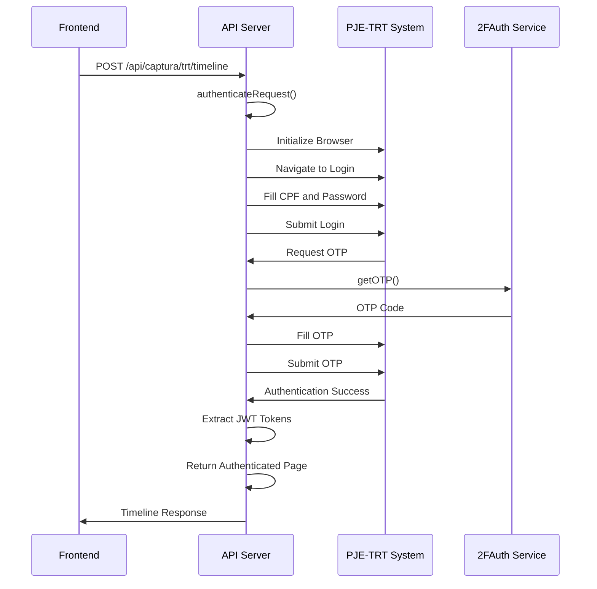
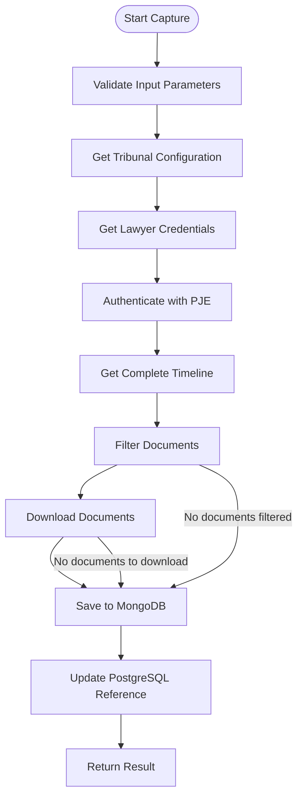
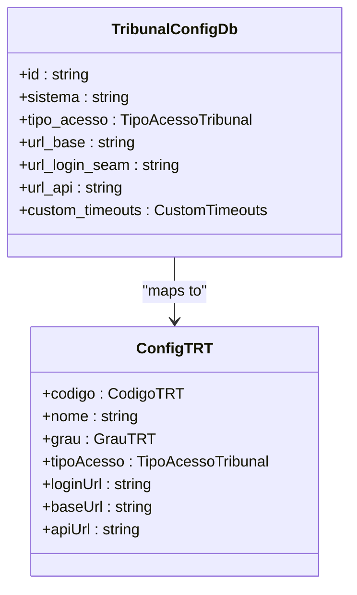
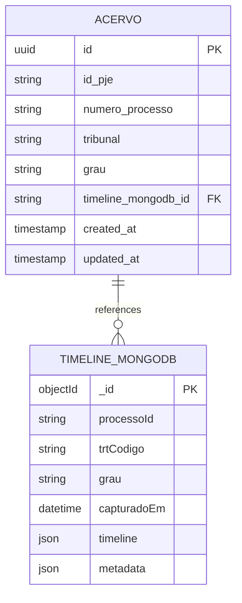

# Timeline Endpoints

<cite>
**Referenced Files in This Document**   
- [route.ts](file://app/api/captura/trt/timeline/route.ts)
- [timeline-capture.service.ts](file://backend/captura/services/timeline/timeline-capture.service.ts)
- [trt-auth.service.ts](file://backend/captura/services/trt/trt-auth.service.ts)
- [timeline-persistence.service.ts](file://backend/captura/services/timeline/timeline-persistence.service.ts)
- [timeline.ts](file://backend/types/pje-trt/timeline.ts)
- [trt-types.ts](file://backend/types/captura/trt-types.ts)
- [config.ts](file://backend/captura/services/trt/config.ts)
- [use-processo-timeline.ts](file://app/_lib/hooks/use-processo-timeline.ts)
- [processo-visualizacao.tsx](file://app/(dashboard)/processos/[id]/processo-visualizacao.tsx)
</cite>

## Table of Contents
1. [Introduction](#introduction)
2. [API Endpoint Specification](#api-endpoint-specification)
3. [Authentication Flow](#authentication-flow)
4. [Response Structure](#response-structure)
5. [Implementation Details](#implementation-details)
6. [Frontend Integration](#frontend-integration)
7. [Common Challenges and Solutions](#common-challenges-and-solutions)
8. [Data Consistency and Storage](#data-consistency-and-storage)
9. [Error Handling](#error-handling)
10. [Performance Considerations](#performance-considerations)

## Introduction

The Timeline Tribunal Integration endpoints in the Sinesys system provide a comprehensive solution for capturing and managing procedural timelines from Brazilian Labor Courts (TRT). This documentation details the implementation of the `/api/captura/trt/timeline` endpoint, which retrieves chronological process events, document filings, and procedural movements from the PJE-TRT system. The integration handles authentication, data extraction, document downloading, and storage across multiple systems including MongoDB and PostgreSQL. The system is designed to support all 24 TRT regions and the TST (Superior Labor Court) with configurable parameters for each tribunal.

**Section sources**
- [route.ts](file://app/api/captura/trt/timeline/route.ts#L1-L212)
- [timeline-capture.service.ts](file://backend/captura/services/timeline/timeline-capture.service.ts#L1-L352)

## API Endpoint Specification

The timeline capture endpoint is a POST request that retrieves the complete timeline of a legal process from the PJE-TRT system. The endpoint follows REST conventions and returns a structured JSON response containing the timeline data and metadata.

### Endpoint Details
- **Method**: POST
- **URL**: `/api/captura/trt/timeline`
- **Authentication**: Bearer Token or API Key
- **Content-Type**: application/json

### Request Parameters
The endpoint accepts the following parameters in the request body:

| Parameter | Type | Required | Description | Example |
|---------|------|----------|-------------|---------|
| trtCodigo | string | Yes | TRT code (TRT1 to TRT24 or TST) | "TRT3" |
| grau | string | Yes | Instance level | "primeiro_grau" |
| processoId | string | Yes | Process ID in PJE system | "2887163" |
| numeroProcesso | string | Yes | Process number | "0010702-80.2025.5.03.0111" |
| advogadoId | number | Yes | Lawyer ID for credentials | 1 |
| baixarDocumentos | boolean | No | Download PDFs of documents | true |
| filtroDocumentos | object | No | Document filtering criteria | See below |

### Document Filtering Parameters
The `filtroDocumentos` object supports the following filtering options:

| Filter | Type | Default | Description |
|-------|------|---------|-------------|
| apenasAssinados | boolean | true | Only signed documents |
| apenasNaoSigilosos | boolean | true | Only non-confidential documents |
| tipos | array | [] | Specific document types to include |
| dataInicial | string | - | Initial date filter (ISO 8601) |
| dataFinal | string | - | Final date filter (ISO 8601) |

### Response Structure
The endpoint returns a JSON object with the following structure:

```json
{
  "success": true,
  "data": {
    "timeline": [],
    "totalItens": 190,
    "totalDocumentos": 61,
    "totalMovimentos": 129,
    "documentosBaixados": [],
    "totalBaixadosSucesso": 61,
    "totalErros": 0,
    "mongoId": "6743f8a5e8c2d1234567890a"
  }
}
```

**Section sources**
- [route.ts](file://app/api/captura/trt/timeline/route.ts#L1-L212)
- [timeline.ts](file://backend/types/pje-trt/timeline.ts#L1-L210)

## Authentication Flow

The authentication flow for the timeline integration uses a multi-step process to securely access the PJE-TRT system. The implementation is handled by the `trt-auth.service.ts` which manages the complete authentication lifecycle.

### Authentication Process


**Diagram sources **
- [trt-auth.service.ts](file://backend/captura/services/trt/trt-auth.service.ts#L539-L603)
- [route.ts](file://app/api/captura/trt/timeline/route.ts#L133-L211)

### Key Authentication Components

1. **Browser Initialization**: The system uses Playwright to initialize a Firefox browser instance with anti-detection configurations that remove automation flags.

2. **SSO Login**: Authentication begins with navigating to the tribunal's login page and submitting the lawyer's CPF and password through the government SSO (Single Sign-On) system.

3. **Two-Factor Authentication**: The system integrates with a 2FAuth service to obtain time-based one-time passwords (TOTP) required for PJE access.

4. **Token Extraction**: After successful authentication, the system extracts JWT tokens (access_token and XSRF-Token) from browser cookies for subsequent API calls.

5. **Lawyer Information**: The system decodes the JWT payload to extract the lawyer's ID, CPF, and name for audit and logging purposes.

The authentication service includes robust error handling for network issues, OTP validation failures, and session timeouts, with automatic retry mechanisms for transient errors.

**Section sources**
- [trt-auth.service.ts](file://backend/captura/services/trt/trt-auth.service.ts#L1-L603)
- [timeline-capture.service.ts](file://backend/captura/services/timeline/timeline-capture.service.ts#L12-L18)

## Response Structure

The timeline endpoint returns a comprehensive response structure that includes both the raw timeline data and metadata about the capture process. The response is designed to provide clients with all necessary information for display and further processing.

### Timeline Item Structure
Each item in the timeline array represents either a document filing or a procedural movement. The structure includes common fields and type-specific properties:

```typescript
interface TimelineItem {
  // Common fields
  id: number;
  titulo: string;
  data: string; // ISO 8601
  documento: boolean; // true = document, false = movement
  idUsuario: number;
  nomeResponsavel: string;
  documentoSigiloso: boolean;
  ativo: boolean;
  
  // Document-specific fields (when documento: true)
  idUnicoDocumento?: string;
  tipo?: string; // "Certidão", "Petição", etc.
  idSignatario?: number;
  nomeSignatario?: string;
  
  // Movement-specific fields (when documento: false)
  codigoMovimentoCNJ?: string;
  movimentoPermiteExclusao?: boolean;
}
```

### Complete Response Schema
The full response includes the timeline data along with statistics and processing information:

| Field | Type | Description |
|------|------|-------------|
| timeline | array | Array of timeline items |
| totalItens | number | Total number of timeline items |
| totalDocumentos | number | Number of document items |
| totalMovimentos | number | Number of movement items |
| documentosBaixados | array | Downloaded document metadata |
| totalBaixadosSucesso | number | Successfully downloaded documents |
| totalErros | number | Download errors encountered |
| mongoId | string | MongoDB document ID for the timeline |

The response excludes the actual PDF buffers to prevent excessive payload sizes, instead providing metadata about the downloaded documents.

**Section sources**
- [timeline.ts](file://backend/types/pje-trt/timeline.ts#L1-L210)
- [timeline-capture.service.ts](file://backend/captura/services/timeline/timeline-capture.service.ts#L63-L80)

## Implementation Details

The timeline capture implementation is structured as a service-oriented architecture with clear separation of concerns. The core functionality is implemented in the `timeline-capture.service.ts` file, which orchestrates the entire capture process.

### Capture Process Flow


**Diagram sources **
- [timeline-capture.service.ts](file://backend/captura/services/timeline/timeline-capture.service.ts#L123-L352)
- [config.ts](file://backend/captura/services/trt/config.ts#L100-L132)

### Key Implementation Components

#### Tribunal Configuration Management
The system uses a cached configuration service that retrieves tribunal-specific settings from the database. The `getTribunalConfig` function implements a 5-minute TTL cache to reduce database load while ensuring configuration freshness.



**Diagram sources **
- [trt-types.ts](file://backend/types/captura/trt-types.ts#L96-L126)
- [config.ts](file://backend/captura/services/trt/config.ts#L74-L85)

#### Document Processing Pipeline
The document processing pipeline handles the extraction, filtering, and downloading of documents with comprehensive error handling:

1. **Document Filtering**: The `filtrarDocumentos` function applies the specified filters to select documents for download based on signature status, confidentiality, type, and date range.

2. **Sequential Downloading**: Documents are downloaded sequentially with a 500ms delay between requests to prevent overwhelming the PJE system.

3. **Backblaze B2 Integration**: Downloaded PDFs are immediately uploaded to Backblaze B2 storage, and the resulting URLs are embedded in the timeline data.

4. **Error Resilience**: Individual document download failures do not abort the entire process; errors are logged and included in the final response.

**Section sources**
- [timeline-capture.service.ts](file://backend/captura/services/timeline/timeline-capture.service.ts#L85-L118)
- [timeline-persistence.service.ts](file://backend/captura/services/timeline/timeline-persistence.service.ts#L38-L113)

## Frontend Integration

The frontend integration of the timeline functionality is implemented through a combination of React hooks and UI components that provide a seamless user experience for viewing and interacting with process timelines.

### Hook Architecture
The `useProcessoTimeline` hook encapsulates the complete lifecycle of timeline management, including data fetching, capture initiation, and state management:

```mermaid
sequenceDiagram
participant Component
participant Hook as useProcessoTimeline
participant API
Component->>Hook : Mount Processo Page
Hook->>API : fetchProcesso()
API-->>Hook : Process Data
Hook->>API : fetchTimeline()
API-->>Hook : Timeline Data or null
alt Timeline Exists
Hook-->>Component : Return timeline data
else Timeline Missing
Hook->>API : captureTimeline()
API-->>Hook : Capture Initiated
Hook->>Hook : Start Polling
loop Every 5 seconds
Hook->>API : pollTimeline()
alt Timeline Ready
API-->>Hook : Timeline Data
Hook-->>Component : Update with timeline
break Stop Polling
end
end
end
```

**Diagram sources **
- [use-processo-timeline.ts](file://app/_lib/hooks/use-processo-timeline.ts#L294-L317)
- [processo-visualizacao.tsx](file://app/(dashboard)/processos/[id]/processo-visualizacao.tsx#L174-L202)

### User Experience Flow
The frontend implements a lazy-loading strategy that optimizes resource usage and user experience:

1. **Initial Load**: The process page loads basic information immediately.
2. **Timeline Check**: The system checks if timeline data already exists in the database.
3. **Automatic Capture**: If no timeline exists, capture is initiated automatically.
4. **Loading State**: A loading indicator shows progress during capture.
5. **Polling**: The system polls for completion every 5 seconds.
6. **Display**: Once available, the timeline is rendered in the UI.

This approach ensures that users only wait for timeline data when they actually need it, rather than pre-loading potentially large datasets for all processes.

**Section sources**
- [use-processo-timeline.ts](file://app/_lib/hooks/use-processo-timeline.ts#L294-L329)
- [processo-visualizacao.tsx](file://app/(dashboard)/processos/[id]/processo-visualizacao.ts#L174-L202)

## Common Challenges and Solutions

The timeline integration faces several common challenges related to data consistency, system reliability, and performance. The implementation includes specific strategies to address these challenges effectively.

### Inconsistent Timeline Formatting
Different TRT regions may have variations in their PJE implementations, leading to inconsistent data formats. The system addresses this through:

- **Flexible Parsing**: The timeline parser handles optional fields and varying data structures.
- **Configuration Overrides**: Tribunal-specific configurations allow for custom URL patterns and API endpoints.
- **Error Tolerance**: The system continues processing even when individual timeline items have unexpected formats.

### Document Attachment Handling
Document attachments present challenges in terms of size, format, and accessibility:

- **Selective Downloading**: Documents are only downloaded when explicitly requested, with filtering options to limit the scope.
- **Incremental Processing**: Large document sets are processed sequentially with delays to prevent timeouts.
- **Storage Optimization**: PDFs are stored in Backblaze B2 with metadata retained in the timeline for efficient access.

### Incremental Timeline Updates
To handle updates to existing timelines without redundant processing:

- **Version Comparison**: The system compares timestamps to determine if a refresh is needed.
- **Delta Updates**: Future enhancements could implement differential updates to capture only new items.
- **Cache Management**: The 5-minute configuration cache balances freshness with performance.

**Section sources**
- [timeline-capture.service.ts](file://backend/captura/services/timeline/timeline-capture.service.ts#L206-L297)
- [config.ts](file://backend/captura/services/trt/config.ts#L33-L34)

## Data Consistency and Storage

The system implements a hybrid storage strategy that combines the strengths of relational and NoSQL databases to ensure data consistency and performance.

### Storage Architecture


**Diagram sources **
- [timeline-persistence.service.ts](file://backend/captura/services/timeline/timeline-persistence.service.ts#L118-L140)
- [timeline-persistence.service.ts](file://backend/captura/services/timeline/timeline-persistence.service.ts#L38-L113)

### Data Synchronization
The system maintains consistency between PostgreSQL and MongoDB through a two-phase process:

1. **MongoDB Storage**: The complete timeline with all document metadata is stored in MongoDB as a single document for efficient retrieval.

2. **PostgreSQL Reference**: The PostgreSQL `acervo` table maintains a reference to the MongoDB document via the `timeline_mongodb_id` field.

3. **Atomic Updates**: The timeline save operation is designed to be idempotent, allowing safe retries without data duplication.

4. **Error Handling**: Failures in MongoDB storage do not prevent the overall capture process from completing, ensuring timeline data is still available.

This hybrid approach leverages MongoDB's flexibility for complex, hierarchical data while maintaining referential integrity through the relational database.

**Section sources**
- [timeline-persistence.service.ts](file://backend/captura/services/timeline/timeline-persistence.service.ts#L1-L203)

## Error Handling

The system implements comprehensive error handling at multiple levels to ensure reliability and provide meaningful feedback for troubleshooting.

### Error Categories
The implementation distinguishes between several types of errors:

| Error Type | Source | Handling Strategy |
|-----------|--------|-------------------|
| Authentication | trt-auth.service.ts | Retry with next OTP, detailed error messages |
| Network | Playwright/browser | Retry with exponential backoff |
| Document Download | timeline-capture.service.ts | Individual document error isolation |
| Database | timeline-persistence.service.ts | Non-blocking, continue processing |

### Error Propagation
Errors are propagated through the system with appropriate context:

- **Client-Facing Errors**: Simplified messages for end users
- **Log Errors**: Detailed technical information for debugging
- **Structured Errors**: Categorized errors for monitoring and alerting

The system logs all errors with contextual information including timestamps, parameters, and stack traces (when available) to facilitate troubleshooting.

**Section sources**
- [timeline-capture.service.ts](file://backend/captura/services/timeline/timeline-capture.service.ts#L206-L288)
- [trt-auth.service.ts](file://backend/captura/services/trt/trt-auth.service.ts#L189-L213)

## Performance Considerations

The timeline integration is designed with performance optimization in mind, addressing the challenges of processing potentially large datasets from external systems.

### Performance Optimization Strategies

1. **Caching**: Tribunal configurations are cached in memory for 5 minutes to reduce database queries.

2. **Sequential Processing**: Document downloads are processed sequentially with 500ms delays to prevent overwhelming the PJE system and triggering rate limits.

3. **Payload Optimization**: The API response excludes PDF buffers and includes only metadata to reduce network transfer size.

4. **Connection Reuse**: The browser instance is reused for all operations within a single capture request to minimize connection overhead.

5. **Asynchronous Operations**: Non-critical operations like MongoDB storage are designed to not block the main response.

### Scalability Considerations
The system architecture supports horizontal scaling through:

- **Stateless API**: The endpoint is stateless and can be load balanced across multiple instances.
- **Distributed Storage**: MongoDB and Backblaze B2 provide scalable storage solutions.
- **Queue-Based Processing**: Future enhancements could implement queuing for high-volume capture requests.

These performance considerations ensure that the system can handle large timelines efficiently while maintaining responsiveness and reliability.

**Section sources**
- [timeline-capture.service.ts](file://backend/captura/services/timeline/timeline-capture.service.ts#L290-L291)
- [config.ts](file://backend/captura/services/trt/config.ts#L33-L34)