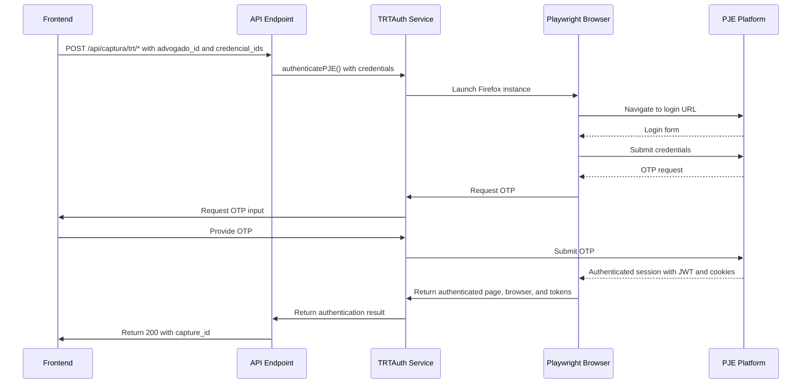
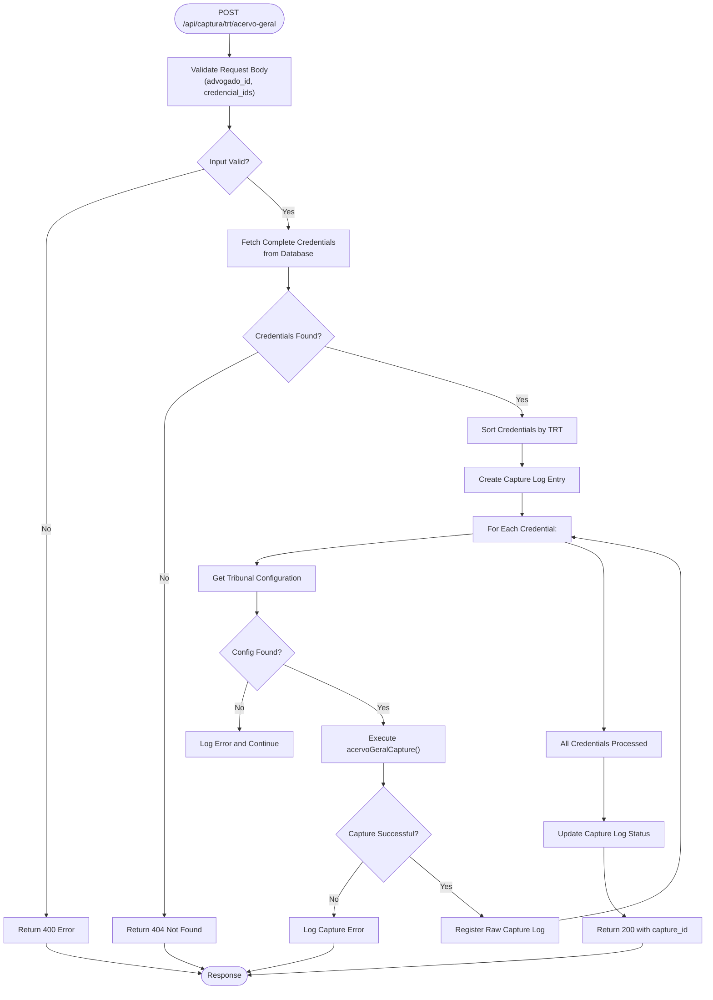
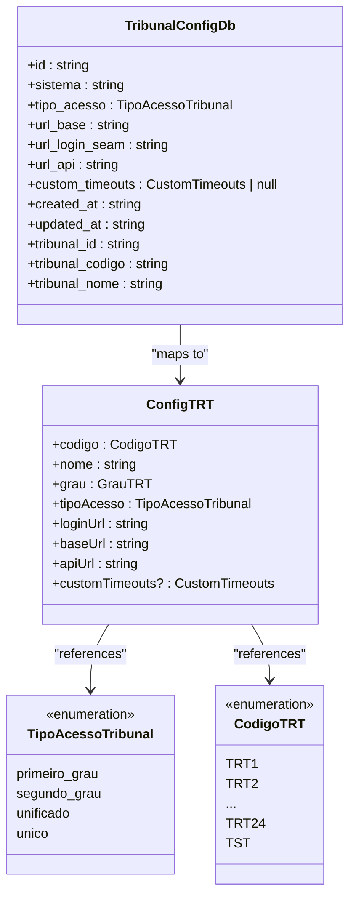
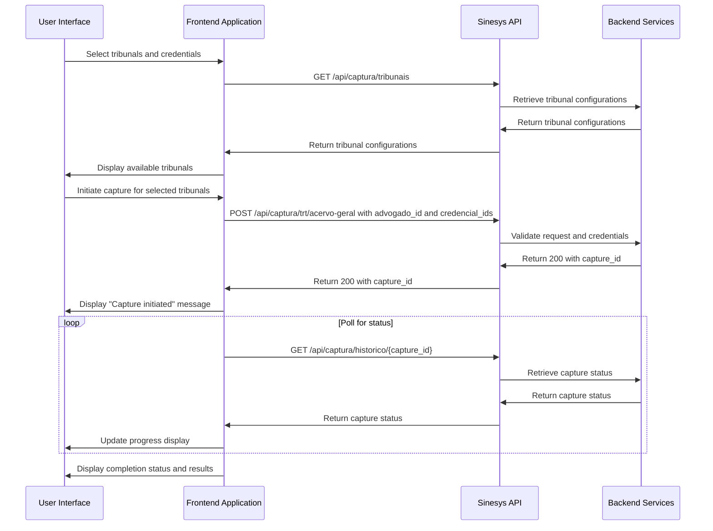
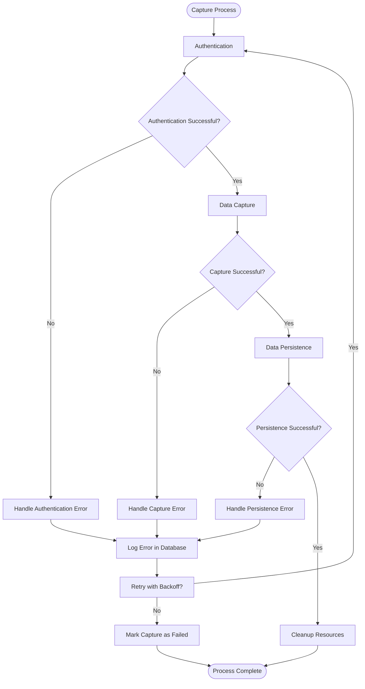
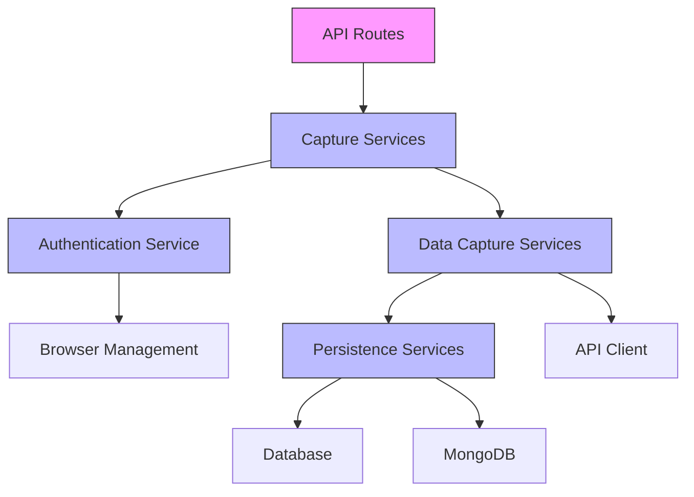

# Tribunal Integration Endpoints

<cite>
**Referenced Files in This Document**   
- [trt-auth.service.ts](file://backend/captura/services/trt/trt-auth.service.ts)
- [trt-capture.service.ts](file://backend/captura/services/trt/trt-capture.service.ts)
- [trt-types.ts](file://backend/types/captura/trt-types.ts)
- [acervo-geral.service.ts](file://backend/captura/services/trt/acervo-geral.service.ts)
- [arquivados.service.ts](file://backend/captura/services/trt/arquivados.service.ts)
- [audiencias.service.ts](file://backend/captura/services/trt/audiencias.service.ts)
- [acervo-geral/route.ts](file://app/api/captura/trt/acervo-geral/route.ts)
- [arquivados/route.ts](file://app/api/captura/trt/arquivados/route.ts)
- [audiencias/route.ts](file://app/api/captura/trt/audiencias/route.ts)
- [expedientes/route.ts](file://app/api/captura/trt/expedientes/route.ts)
- [config.ts](file://backend/captura/services/trt/config.ts)
</cite>

## Table of Contents
1. [Introduction](#introduction)
2. [Authentication Mechanism](#authentication-mechanism)
3. [API Endpoints](#api-endpoints)
4. [Tribunal Configuration](#tribunal-configuration)
5. [Frontend Integration](#frontend-integration)
6. [Error Handling and Recovery](#error-handling-and-recovery)
7. [Implementation Details](#implementation-details)

## Introduction
The Sinesys system provides a comprehensive set of endpoints for integrating with Brazilian Labor Courts (TRT) through the PJE (Processo Judicial Eletrônico) platform. These endpoints enable automated data extraction from various tribunal sections including general inventory, archived processes, hearings, and case files. The integration architecture is designed to handle the complexities of tribunal-specific authentication, session management, and data format variations while ensuring data consistency and reliability.

The system follows a modular design with distinct layers for authentication, data capture, and persistence. Each endpoint follows a consistent pattern of asynchronous processing with background execution and progress tracking through a capture log system. The integration handles tribunal-specific variations through configurable parameters stored in the database, allowing for flexible adaptation to different TRT implementations.

**Section sources**
- [trt-auth.service.ts](file://backend/captura/services/trt/trt-auth.service.ts#L1-L44)
- [trt-capture.service.ts](file://backend/captura/services/trt/trt-capture.service.ts#L1-L35)

## Authentication Mechanism

The tribunal authentication system is implemented in the `trt-auth.service.ts` file and provides a robust mechanism for handling the complex authentication requirements of the PJE platform. The service manages the complete authentication flow including SSO login, OTP verification, and session token management.



**Diagram sources **
- [trt-auth.service.ts](file://backend/captura/services/trt/trt-auth.service.ts#L5-L44)

The authentication process follows these key steps:
1. **Browser Initialization**: The service uses Playwright to launch a Firefox browser instance with specific configurations for handling tribunal websites.
2. **SSO Login**: Navigates to the tribunal's SSO login page and submits the attorney's credentials (CPF and password).
3. **OTP Verification**: Handles the two-factor authentication process by requesting an OTP code through the `getOTP` function and submitting it to the PJE platform.
4. **Session Establishment**: Upon successful authentication, the service captures the authenticated page, browser instance, and authentication tokens (access token and XSRF token).
5. **Resource Management**: The authenticated browser context is returned to the calling service for subsequent API calls, ensuring the same session is maintained.

The authentication system is designed to handle tribunal-specific variations through the `TRTAuthOptions` interface, which includes parameters for credentials, configuration, optional two-factor authentication configuration, and headless mode setting.

**Section sources**
- [trt-auth.service.ts](file://backend/captura/services/trt/trt-auth.service.ts#L5-L44)
- [trt-types.ts](file://backend/types/captura/trt-types.ts#L14-L31)

## API Endpoints

The Sinesys system exposes several endpoints for capturing data from different sections of the TRT PJE platform. All endpoints follow a consistent POST pattern with asynchronous processing and return a 200 status code immediately upon initiation, with the actual data capture occurring in the background.

### /api/captura/trt/acervo-geral

This endpoint captures the general inventory of processes for a specific attorney from the TRT platform.



**Diagram sources **
- [acervo-geral/route.ts](file://app/api/captura/trt/acervo-geral/route.ts#L1-L366)

**Request**
- **Method**: POST
- **URL**: `/api/captura/trt/acervo-geral`
- **Authentication**: Bearer token, session cookie, or service API key
- **Request Body**:
```json
{
  "advogado_id": 1,
  "credencial_ids": [1, 2, 3]
}
```

**Response (Success - 200)**
```json
{
  "success": true,
  "message": "Captura iniciada com sucesso",
  "status": "in_progress",
  "capture_id": 123,
  "data": {
    "credenciais_processadas": 3,
    "message": "A captura está sendo processada em background. Consulte o histórico para acompanhar o progresso."
  }
}
```

The endpoint processes each credential sequentially to avoid session conflicts, as the SSO system invalidates previous sessions when a new login occurs. For each credential, it performs the following steps:
1. Authenticates with the tribunal using the stored credentials
2. Retrieves all processes from the general inventory
3. Validates the count against the totalizer endpoint
4. Extracts unique process IDs
5. Captures complementary data (timeline and parties) for each process
6. Persists the data in the appropriate databases
7. Closes the browser instance

**Section sources**
- [acervo-geral/route.ts](file://app/api/captura/trt/acervo-geral/route.ts#L1-L366)
- [acervo-geral.service.ts](file://backend/captura/services/trt/acervo-geral.service.ts#L1-L354)

### /api/captura/trt/arquivados

This endpoint captures archived processes for a specific attorney from the TRT platform.

**Request**
- **Method**: POST
- **URL**: `/api/captura/trt/arquivados`
- **Authentication**: Bearer token, session cookie, or service API key
- **Request Body**:
```json
{
  "advogado_id": 1,
  "credencial_ids": [1, 2, 3]
}
```

**Response (Success - 200)**
```json
{
  "success": true,
  "message": "Captura iniciada com sucesso",
  "status": "in_progress",
  "capture_id": 123,
  "data": {
    "credenciais_processadas": 3,
    "message": "A captura está sendo processada em background. Consulte o histórico para acompanhar o progresso."
  }
}
```

The implementation is nearly identical to the acervo-geral endpoint but uses different API parameters to filter for archived processes (tipoPainelAdvogado=5). The service handles the same authentication, data capture, and persistence flow but specifically targets the archived processes section of the PJE platform.

**Section sources**
- [arquivados/route.ts](file://app/api/captura/trt/arquivados/route.ts#L1-L368)
- [arquivados.service.ts](file://backend/captura/services/trt/arquivados.service.ts#L1-L351)

### /api/captura/trt/audiencias

This endpoint captures hearing data for a specific attorney from the TRT platform.

**Request**
- **Method**: POST
- **URL**: `/api/captura/trt/audiencias`
- **Authentication**: Bearer token, session cookie, or service API key
- **Request Body**:
```json
{
  "advogado_id": 1,
  "credencial_ids": [1, 2, 3],
  "dataInicio": "2024-01-01",
  "dataFim": "2024-12-31",
  "status": "M"
}
```

**Response (Success - 200)**
```json
{
  "success": true,
  "message": "Captura iniciada com sucesso",
  "status": "in_progress",
  "capture_id": 123,
  "data": {
    "credenciais_processadas": 3,
    "message": "A captura está sendo processada em background. Consulte o histórico para acompanhar o progresso."
  }
}
```

The endpoint includes optional parameters for filtering:
- **dataInicio**: Start date for the hearing search period (YYYY-MM-DD format, defaults to today)
- **dataFim**: End date for the hearing search period (YYYY-MM-DD format, defaults to today + 365 days)
- **status**: Hearing status filter ('M' = Scheduled, 'C' = Cancelled, 'F' = Completed, defaults to 'M')

The service validates date formats and ensures the start date is not after the end date. For completed hearings (status 'F'), the system additionally attempts to capture hearing minutes by identifying and downloading signed documents labeled as "ata" from the process timeline.

**Section sources**
- [audiencias/route.ts](file://app/api/captura/trt/audiencias/route.ts#L1-L425)
- [audiencias.service.ts](file://backend/captura/services/trt/audiencias.service.ts#L1-L481)

### /api/captura/trt/expedientes

This endpoint captures pending cases (expedientes) for a specific attorney from the TRT platform.

**Request**
- **Method**: POST
- **URL**: `/api/captura/trt/expedientes`
- **Authentication**: Bearer token, session cookie, or service API key
- **Request Body**:
```json
{
  "advogado_id": 1,
  "credencial_ids": [1, 2, 3],
  "filtroPrazo": "no_prazo"
}
```

**Response (Success - 200)**
```json
{
  "success": true,
  "message": "Captura iniciada com sucesso",
  "status": "in_progress",
  "capture_id": 123,
  "data": {
    "credenciais_processadas": 3,
    "message": "A captura está sendo processada em background. Consulte o histórico para acompanhar o progresso."
  }
}
```

The endpoint includes an optional parameter for filtering pending cases:
- **filtroPrazo**: Deadline filter ('no_prazo' = within deadline, 'sem_prazo' = without deadline)

The implementation follows the same pattern as other endpoints, with authentication, data capture, and persistence. It specifically targets the pending cases section of the PJE platform, which contains processes awaiting manifestation from the represented party.

**Section sources**
- [expedientes/route.ts](file://app/api/captura/trt/expedientes/route.ts)
- [expedientes.service.ts](file://backend/captura/services/trt/expedientes.service.ts)

## Tribunal Configuration

The system uses a flexible configuration model to handle variations between different TRTs and their access methods. Tribunal configurations are stored in the database and cached in memory for performance.



**Diagram sources **
- [trt-types.ts](file://backend/types/captura/trt-types.ts#L22-L57)
- [config.ts](file://backend/captura/services/trt/config.ts#L49-L85)

The configuration system includes the following key components:

- **TribunalConfigDb**: The database representation of tribunal configuration, containing all fields from the `tribunais_config` table including the JOINed tribunal information.
- **ConfigTRT**: The in-memory representation used by the application code, which maps database fields to application-friendly names and types.
- **TipoAcessoTribunal**: An enumeration defining the types of tribunal access methods, which determines how attorneys log in to different tribunals.
- **CodigoTRT**: An enumeration of all possible TRT codes, including the 24 regional labor courts and the Superior Labor Court (TST).

The mapping between database configuration and application configuration is handled by the `mapDbToConfig` function, which converts the database structure to the application structure while also mapping the `tipo_acesso` to the appropriate `grau` value. This abstraction allows the application to work with a consistent interface regardless of the underlying database structure.

**Section sources**
- [trt-types.ts](file://backend/types/captura/trt-types.ts#L6-L124)
- [config.ts](file://backend/captura/services/trt/config.ts#L49-L85)

## Frontend Integration

The frontend capture interface initiates data extraction through a series of coordinated API calls. The process begins when a user selects specific tribunals and credentials for data capture.



**Diagram sources **
- [acervo-geral/route.ts](file://app/api/captura/trt/acervo-geral/route.ts#L125-L366)
- [historico/route.ts](file://app/api/captura/historico/route.ts)

The frontend integration follows these steps:
1. **Configuration Retrieval**: The frontend first retrieves the list of available tribunal configurations by calling the `/api/captura/tribunais` endpoint.
2. **User Selection**: The user selects which tribunals and credentials to use for data capture through the capture interface.
3. **Capture Initiation**: When the user initiates the capture process, the frontend makes a POST request to the appropriate endpoint (`/api/captura/trt/acervo-geral`, `/api/captura/trt/arquivados`, etc.) with the attorney ID and credential IDs.
4. **Status Polling**: The frontend receives a `capture_id` in the response and uses this to poll the capture status through the `/api/captura/historico/{id}` endpoint.
5. **Progress Display**: The frontend displays the progress of the capture operation to the user, showing which credentials have been processed and any errors that occurred.
6. **Completion Notification**: Once the capture is complete, the frontend displays the final results to the user.

This asynchronous approach ensures that the user interface remains responsive even during long-running capture operations that may take several minutes to complete.

**Section sources**
- [acervo-geral/route.ts](file://app/api/captura/trt/acervo-geral/route.ts#L125-L366)
- [historico/route.ts](file://app/api/captura/historico/route.ts)

## Error Handling and Recovery

The system implements comprehensive error handling and recovery mechanisms to ensure data consistency and reliability during the capture process.



**Diagram sources **
- [acervo-geral.service.ts](file://backend/captura/services/trt/acervo-geral.service.ts#L107-L354)
- [arquivados.service.ts](file://backend/captura/services/trt/arquivados.service.ts#L104-L351)
- [audiencias.service.ts](file://backend/captura/services/trt/audiencias.service.ts#L133-L481)

The error handling system includes the following key features:

1. **Comprehensive Logging**: Every capture operation is logged in the database through the `captura_log` and `captura_raw_log` tables. The logs include detailed information about the request, response, and any errors that occur.
2. **Graceful Degradation**: If a specific credential fails to authenticate or capture data, the system logs the error and continues with the remaining credentials rather than aborting the entire operation.
3. **Resource Cleanup**: The system ensures that browser instances are properly closed even if an error occurs, preventing resource leaks.
4. **Error Categorization**: Errors are categorized and logged with specific codes and messages to facilitate troubleshooting.
5. **Data Consistency**: The system maintains data consistency by using transactions where appropriate and ensuring that related data (processes, timelines, parties) are persisted in the correct order.

The capture process is designed to be idempotent, meaning that running the same capture operation multiple times will not create duplicate data. The system checks for existing records and updates them rather than creating new ones, ensuring data integrity across multiple capture operations.

**Section sources**
- [acervo-geral.service.ts](file://backend/captura/services/trt/acervo-geral.service.ts#L107-L354)
- [arquivados.service.ts](file://backend/captura/services/trt/arquivados.service.ts#L104-L351)
- [audiencias.service.ts](file://backend/captura/services/trt/audiencias.service.ts#L133-L481)

## Implementation Details

The tribunal integration system is built with a modular architecture that separates concerns between authentication, data capture, and persistence. This design allows for code reuse and makes the system easier to maintain and extend.

### Service Layer Architecture

The system follows a layered architecture with clear separation of responsibilities:



**Diagram sources **
- [acervo-geral.service.ts](file://backend/captura/services/trt/acervo-geral.service.ts#L47-L354)
- [arquivados.service.ts](file://backend/captura/services/trt/arquivados.service.ts#L47-L351)
- [audiencias.service.ts](file://backend/captura/services/trt/audiencias.service.ts#L47-L481)

The key components of the architecture are:

- **API Routes**: Handle HTTP requests, authentication, and parameter validation.
- **Capture Services**: Coordinate the entire capture process, calling authentication and data capture services as needed.
- **Authentication Service**: Manages the complex authentication flow with the PJE platform.
- **Data Capture Services**: Handle the specific logic for capturing data from different sections of the PJE platform.
- **Persistence Services**: Manage the storage of captured data in the appropriate databases.

### Data Flow and Processing

The data flow for each capture operation follows a consistent pattern:

1. **Authentication**: Establish a session with the tribunal's PJE platform using the provided credentials.
2. **Data Extraction**: Use the authenticated session to extract data from the specific section (acervo-geral, arquivados, audiencias, etc.).
3. **Data Enrichment**: Enhance the extracted data with additional information from related endpoints (timeline, parties, etc.).
4. **Data Transformation**: Convert the extracted data into the format required by the application's data model.
5. **Data Persistence**: Store the transformed data in the appropriate databases (Supabase for relational data, MongoDB for timeline data).
6. **Resource Cleanup**: Close the browser instance and clean up any temporary resources.

This pattern ensures that data is consistently processed and stored regardless of the source endpoint.

### Common Challenges and Solutions

The system addresses several common challenges in tribunal integration:

1. **CAPTCHA Implementations**: The use of Playwright with a real browser instance allows the system to handle CAPTCHA challenges that may appear during the login process. The headless browser can render and interact with CAPTCHA elements just like a human user.
2. **Session Management**: The system maintains a single browser instance per credential to ensure session consistency. The authentication service returns the authenticated browser context to the calling service, which uses it for all subsequent API calls.
3. **Response Format Variations**: The system handles variations in response formats between different TRTs through the configuration system. Custom timeouts and URL patterns can be specified for each tribunal to accommodate their specific requirements.
4. **Rate Limiting**: The system implements delays between requests (300ms for party data) to avoid triggering rate limiting mechanisms on the tribunal servers.
5. **Data Consistency**: The system uses a comprehensive logging and error handling system to ensure data consistency. If a capture operation fails partway through, the logs provide a complete record of what was processed and what needs to be retried.

The implementation demonstrates a sophisticated understanding of the challenges involved in integrating with government systems and provides robust solutions to ensure reliable data capture.

**Section sources**
- [acervo-geral.service.ts](file://backend/captura/services/trt/acervo-geral.service.ts#L1-L354)
- [arquivados.service.ts](file://backend/captura/services/trt/arquivados.service.ts#L1-L351)
- [audiencias.service.ts](file://backend/captura/services/trt/audiencias.service.ts#L1-L481)
- [trt-auth.service.ts](file://backend/captura/services/trt/trt-auth.service.ts#L1-L44)