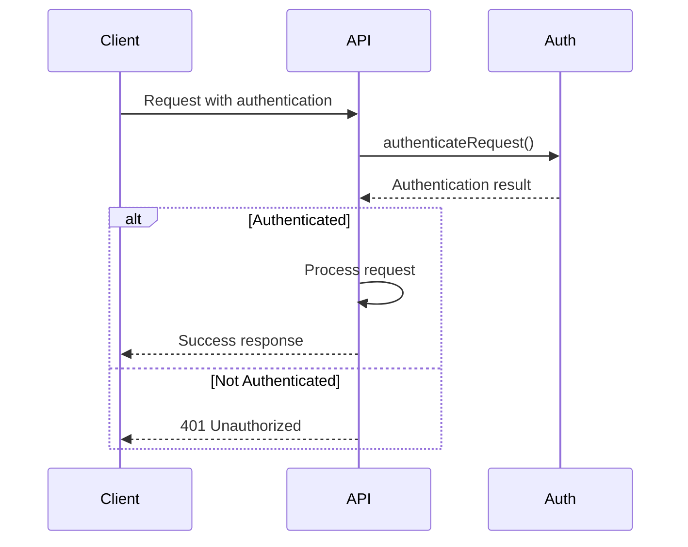
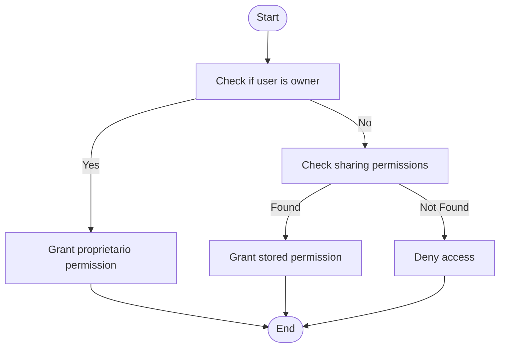
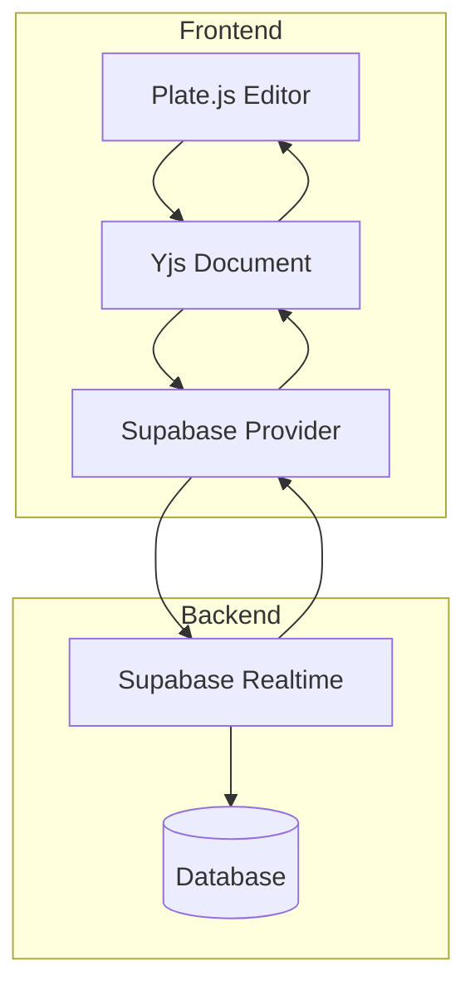
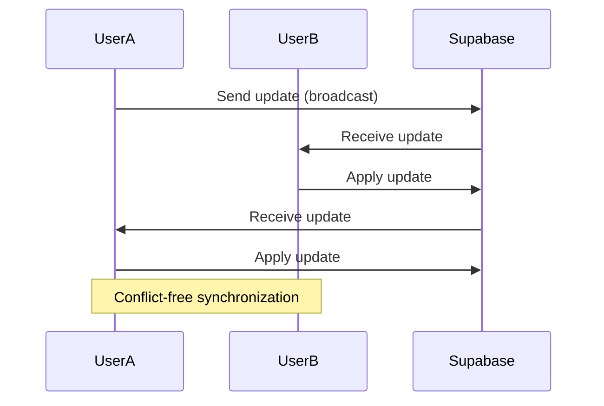
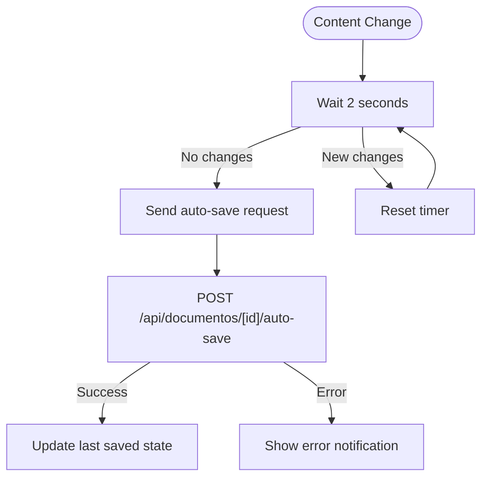
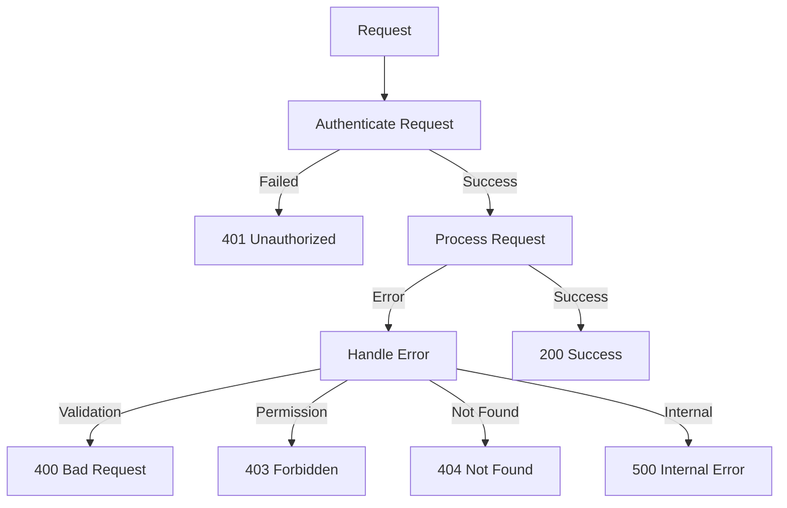
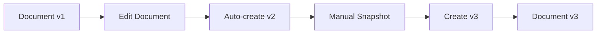

# Document CRUD Operations

<cite>
**Referenced Files in This Document**   
- [route.ts](file://app/api/documentos/route.ts)
- [route.ts](file://app/api/documentos/[id]/route.ts)
- [documentos-persistence.service.ts](file://backend/documentos/services/persistence/documentos-persistence.service.ts)
- [types.ts](file://backend/types/documentos/types.ts)
- [document-editor.tsx](file://components/documentos/document-editor.tsx)
- [supabase-provider.ts](file://lib/yjs/supabase-provider.ts)
- [supabase-yjs-provider.ts](file://lib/yjs/supabase-yjs-provider.ts)
- [use-realtime-collaboration.ts](file://hooks/use-realtime-collaboration.ts)
- [use-yjs-collaboration.ts](file://hooks/use-yjs-collaboration.ts)
- [route.ts](file://app/api/documentos/[id]/auto-save/route.ts)
</cite>

## Table of Contents
1. [Introduction](#introduction)
2. [API Endpoints](#api-endpoints)
3. [Data Model](#data-model)
4. [Authentication and Permissions](#authentication-and-permissions)
5. [Real-time Collaboration](#real-time-collaboration)
6. [Error Handling](#error-handling)
7. [Usage Examples](#usage-examples)
8. [Version History](#version-history)
9. [Conclusion](#conclusion)

## Introduction

The Sinesys system provides a comprehensive document management solution with full CRUD (Create, Read, Update, Delete) operations through its API endpoints. This documentation details the implementation of document management functionality, focusing on the `/api/documentos/` endpoint and its associated operations. The system supports real-time collaboration, version history, access control, and document sharing capabilities.

The document management system is built on a robust architecture that combines Next.js API routes with Supabase for database operations and real-time synchronization. Documents are stored with rich metadata including title, content, ownership, permissions, and versioning information. The frontend editor provides a seamless user experience with auto-save functionality and real-time collaboration features.

**Section sources**
- [route.ts](file://app/api/documentos/route.ts#L1-L222)
- [document-editor.tsx](file://components/documentos/document-editor.tsx#L1-L479)

## API Endpoints

### GET /api/documentos/

Retrieves a paginated list of documents with optional filtering parameters. The endpoint returns documents that the authenticated user has access to, either as the creator or through sharing.

**Parameters:**
- `pasta_id` (integer): Filter by folder ID. Use 'null' for documents in the root.
- `busca` (string): Search term for title and description.
- `tags` (string): Comma-separated tags for filtering.
- `criado_por` (integer): Filter by creator ID.
- `incluir_deletados` (boolean): Include soft-deleted documents.
- `limit` (integer): Records per page (default: 50).
- `offset` (integer): Pagination offset.

**Response:**
```json
{
  "success": true,
  "data": [
    {
      "id": 1,
      "titulo": "Document Title",
      "conteudo": [],
      "pasta_id": null,
      "criado_por": 1,
      "editado_por": 1,
      "versao": 1,
      "descricao": "Document description",
      "tags": ["tag1", "tag2"],
      "created_at": "2025-01-01T00:00:00Z",
      "updated_at": "2025-01-01T00:00:00Z",
      "editado_em": null,
      "deleted_at": null,
      "criador": {
        "id": 1,
        "nomeCompleto": "John Doe",
        "nomeExibicao": "John",
        "emailCorporativo": "john@example.com"
      },
      "editor": {
        "id": 1,
        "nomeCompleto": "John Doe",
        "nomeExibicao": "John"
      }
    }
  ],
  "pagination": {
    "total": 1,
    "limit": 50,
    "offset": 0,
    "hasMore": false
  }
}
```

**Status Codes:**
- 200: Successful response
- 401: Unauthorized
- 500: Internal server error

**Section sources**
- [route.ts](file://app/api/documentos/route.ts#L98-L148)

### POST /api/documentos/

Creates a new document associated with the authenticated user.

**Request Body:**
```json
{
  "titulo": "New Document",
  "conteudo": [],
  "pasta_id": 1,
  "descricao": "Document description",
  "tags": ["tag1", "tag2"]
}
```

**Validation Rules:**
- Title is required and must not be empty
- Title length must not exceed 500 characters

**Response:**
```json
{
  "success": true,
  "data": {
    "id": 2,
    "titulo": "New Document",
    "conteudo": [],
    "pasta_id": 1,
    "criado_por": 1,
    "editado_por": 1,
    "versao": 1,
    "descricao": "Document description",
    "tags": ["tag1", "tag2"],
    "created_at": "2025-01-01T00:00:00Z",
    "updated_at": "2025-01-01T00:00:00Z",
    "editado_em": null,
    "deleted_at": null
  }
}
```

**Status Codes:**
- 201: Document created successfully
- 400: Invalid parameters
- 401: Unauthorized
- 500: Internal server error

**Section sources**
- [route.ts](file://app/api/documentos/route.ts#L181-L221)

### GET /api/documentos/[id]

Retrieves a specific document by ID with access control verification.

**Response:**
```json
{
  "success": true,
  "data": {
    "id": 1,
    "titulo": "Document Title",
    "conteudo": [],
    "pasta_id": null,
    "criado_por": 1,
    "editado_por": 1,
    "versao": 1,
    "descricao": "Document description",
    "tags": ["tag1", "tag2"],
    "created_at": "2025-01-01T00:00:00Z",
    "updated_at": "2025-01-01T00:00:00Z",
    "editado_em": null,
    "deleted_at": null,
    "criador": {
      "id": 1,
      "nomeCompleto": "John Doe",
      "nomeExibicao": "John",
      "emailCorporativo": "john@example.com"
    },
    "editor": {
      "id": 1,
      "nomeCompleto": "John Doe",
      "nomeExibicao": "John"
    },
    "permissao_usuario": "proprietario"
  }
}
```

**Status Codes:**
- 200: Successful response
- 400: Invalid ID
- 403: Access denied
- 404: Document not found
- 500: Internal server error

**Section sources**
- [route.ts](file://app/api/documentos/[id]/route.ts#L24-L82)

### PUT/PATCH /api/documentos/[id]

Updates an existing document. Both PUT and PATCH methods are supported.

**Request Body:**
```json
{
  "titulo": "Updated Title",
  "conteudo": [],
  "pasta_id": 2,
  "descricao": "Updated description",
  "tags": ["new-tag"]
}
```

**Validation Rules:**
- Title cannot be empty if provided
- Title length must not exceed 500 characters
- User must have edit permission (owner or editor)

**Response:**
```json
{
  "success": true,
  "data": {
    "id": 1,
    "titulo": "Updated Title",
    "conteudo": [],
    "pasta_id": 2,
    "criado_por": 1,
    "editado_por": 1,
    "versao": 2,
    "descricao": "Updated description",
    "tags": ["new-tag"],
    "created_at": "2025-01-01T00:00:00Z",
    "updated_at": "2025-01-02T00:00:00Z",
    "editado_em": "2025-01-02T00:00:00Z",
    "deleted_at": null
  }
}
```

**Status Codes:**
- 200: Document updated successfully
- 400: Invalid parameters
- 403: No permission to edit
- 404: Document not found
- 500: Internal server error

**Section sources**
- [route.ts](file://app/api/documentos/[id]/route.ts#L88-L168)

### DELETE /api/documentos/[id]

Soft deletes a document (moves to trash). Only the document owner can perform this operation.

**Response:**
```json
{
  "success": true,
  "message": "Documento movido para lixeira"
}
```

**Status Codes:**
- 200: Document moved to trash
- 400: Invalid ID
- 403: Only owner can delete
- 404: Document not found
- 500: Internal server error

**Section sources**
- [route.ts](file://app/api/documentos/[id]/route.ts#L174-L222)

## Data Model

### Document Structure

The document data model includes comprehensive metadata and content storage:

**Fields:**
- `id` (number): Unique identifier
- `titulo` (string): Document title (required, max 500 characters)
- `conteudo` (PlateContent): JSONB structure storing Plate.js editor content
- `pasta_id` (number | null): Parent folder ID or null for root
- `criado_por` (number): Creator user ID
- `editado_por` (number | null): Last editor user ID
- `versao` (number): Version number (auto-incremented)
- `descricao` (string | null): Document description
- `tags` (string[]): Array of tags for organization
- `created_at` (string): Creation timestamp
- `updated_at` (string): Last update timestamp
- `editado_em` (string | null): Last content edit timestamp
- `deleted_at` (string | null): Soft delete timestamp

**Section sources**
- [types.ts](file://backend/types/documentos/types.ts#L18-L32)

### Relationships

The document system includes several related entities:

**Pasta (Folder):**
- Organizes documents hierarchically
- Supports common and private folder types
- Tracks creation and modification metadata

**Compartilhamento (Sharing):**
- Manages document access permissions
- Supports view and edit permissions
- Tracks sharing relationships between users and documents

**Versão (Version):**
- Maintains document history
- Stores content snapshots with version numbers
- Enables restoration of previous states

**Upload:**
- Associates files with documents
- Tracks file metadata (name, type, size, storage key)
- Supports various media types (images, videos, PDFs, etc.)

**Section sources**
- [types.ts](file://backend/types/documentos/types.ts#L89-L557)

## Authentication and Permissions

### Authentication

All document endpoints require authentication via the `authenticateRequest` function, which validates the user's session and extracts user information from the request.



**Diagram sources**
- [route.ts](file://app/api/documentos/route.ts#L100-L103)
- [route.ts](file://app/api/documentos/[id]/route.ts#L29-L31)

### Access Control

The system implements granular permission management:

**Permission Levels:**
- `proprietario` (owner): Full control (read, write, delete, share)
- `editar` (editor): Read and write access
- `visualizar` (viewer): Read-only access

**Access Verification:**
1. Check if user is the document creator
2. If not, check sharing permissions
3. Return appropriate permission level



**Diagram sources**
- [documentos-persistence.service.ts](file://backend/documentos/services/persistence/documentos-persistence.service.ts#L397-L427)

## Real-time Collaboration

### Architecture

The real-time collaboration system uses Yjs for CRDT-based conflict resolution and Supabase Realtime for synchronization.



**Diagram sources**
- [supabase-provider.ts](file://lib/yjs/supabase-provider.ts#L44-L251)
- [supabase-yjs-provider.ts](file://lib/yjs/supabase-yjs-provider.ts#L78-L358)

### Implementation

The collaboration system is implemented through several components:

**SupabaseProvider:**
- Establishes Realtime channel connection
- Handles incremental updates and full sync
- Manages connection lifecycle

**Yjs Integration:**
- Uses Y.Doc for shared state
- Applies updates with proper origin tracking
- Supports awareness for presence information

**Frontend Integration:**
- `useYjsCollaboration` hook manages Yjs instance
- `useRealtimeCollaboration` hook handles presence and cursor tracking
- Plate.js editor integrates with Yjs for collaborative editing



**Diagram sources**
- [use-yjs-collaboration.ts](file://hooks/use-yjs-collaboration.ts#L66-L201)
- [use-realtime-collaboration.ts](file://hooks/use-realtime-collaboration.ts#L53-L244)

### Auto-save

The system implements auto-save functionality with a 2-second debounce:



**Section sources**
- [document-editor.tsx](file://components/documentos/document-editor.tsx#L147-L202)

## Error Handling

### Common Error Scenarios

The system handles various error conditions with appropriate responses:

**Document Not Found:**
- Status: 404
- Response: `{ success: false, error: 'Documento não encontrado' }`
- Triggered when document ID is invalid or document doesn't exist

**Permission Denied:**
- Status: 403
- Response: `{ success: false, error: 'Acesso negado' }`
- Triggered when user lacks required permissions

**Validation Failures:**
- Status: 400
- Response: `{ success: false, error: 'Título é obrigatório' }`
- Triggered for invalid input (empty title, etc.)

**Internal Errors:**
- Status: 500
- Response: `{ success: false, error: 'Erro interno' }`
- Triggered for database or server errors



**Section sources**
- [route.ts](file://app/api/documentos/route.ts#L99-L148)
- [route.ts](file://app/api/documentos/[id]/route.ts#L29-L82)

### Error Response Structure

All error responses follow a consistent format:

```json
{
  "success": false,
  "error": "Error message",
  "details": {}
}
```

The error field contains user-friendly messages in Portuguese, while the details field may contain additional technical information for debugging.

**Section sources**
- [types.ts](file://backend/types/documentos/types.ts#L538-L542)

## Usage Examples

### Creating a Document

```javascript
// Create a new document
const response = await fetch('/api/documentos/', {
  method: 'POST',
  headers: { 'Content-Type': 'application/json' },
  body: JSON.stringify({
    titulo: 'Meeting Notes',
    descricao: 'Notes from team meeting',
    tags: ['meeting', 'team']
  })
});

const result = await response.json();
if (result.success) {
  console.log('Document created:', result.data.id);
}
```

**Section sources**
- [route.ts](file://app/api/documentos/route.ts#L181-L221)

### Retrieving Documents with Filtering

```javascript
// Get documents in a specific folder
const response = await fetch('/api/documentos?folder_id=5&limit=10');
const result = await response.json();

// Search documents by title
const searchResponse = await fetch('/api/documentos?busca=contract');
const searchResult = await searchResponse.json();

// Get documents with specific tags
const tagResponse = await fetch('/api/documentos?tags=legal,important');
const tagResult = await tagResponse.json();
```

**Section sources**
- [route.ts](file://app/api/documentos/route.ts#L98-L148)

### Updating Document Content

```javascript
// Update document title and content
const response = await fetch(`/api/documentos/${documentId}`, {
  method: 'PATCH',
  headers: { 'Content-Type': 'application/json' },
  body: JSON.stringify({
    titulo: 'Updated Meeting Notes',
    conteudo: updatedContent
  })
});

const result = await response.json();
if (result.success) {
  console.log('Document updated');
}
```

**Section sources**
- [route.ts](file://app/api/documentos/[id]/route.ts#L88-L168)

### Deleting a Document

```javascript
// Move document to trash
const response = await fetch(`/api/documentos/${documentId}`, {
  method: 'DELETE'
});

const result = await response.json();
if (result.success) {
  console.log('Document moved to trash');
}
```

**Section sources**
- [route.ts](file://app/api/documentos/[id]/route.ts#L174-L222)

## Version History

### Version Management

The system maintains version history for all documents:

**Version Creation:**
- Automatic: When document content is updated
- Manual: When user explicitly creates a snapshot

**Version Structure:**
- `id`: Version identifier
- `documento_id`: Associated document
- `versao`: Version number
- `conteudo`: Content snapshot
- `titulo`: Title at time of version
- `criado_por`: User who created version
- `created_at`: Creation timestamp



**Section sources**
- [documentos-persistence.service.ts](file://backend/documentos/services/persistence/documentos-persistence.service.ts#L218-L247)
- [types.ts](file://backend/types/documentos/types.ts#L333-L363)

### Version Endpoints

**GET /api/documentos/[id]/versoes**
- Lists all versions of a document
- Supports pagination
- Returns version metadata and creator information

**POST /api/documentos/[id]/versoes**
- Creates a manual version snapshot
- Increments version number
- Requires edit permission

**Section sources**
- [route.ts](file://app/api/documentos/[id]/versoes/route.ts#L24-L166)

## Conclusion

The Sinesys document management system provides a comprehensive CRUD API with robust features for document creation, retrieval, updating, and deletion. The implementation includes sophisticated access control, real-time collaboration through Yjs and Supabase Realtime, version history management, and comprehensive error handling.

Key features include:
- RESTful API design with standard HTTP methods
- Granular permission system with owner, editor, and viewer roles
- Real-time collaboration with conflict-free synchronization
- Auto-save functionality with debounce
- Version history with manual and automatic snapshots
- Comprehensive error handling with meaningful messages
- Integration with frontend editor components

The system is designed for scalability and reliability, using Supabase for database operations and real-time synchronization, while maintaining data integrity through proper validation and access control mechanisms.

[No sources needed since this section summarizes without analyzing specific files]