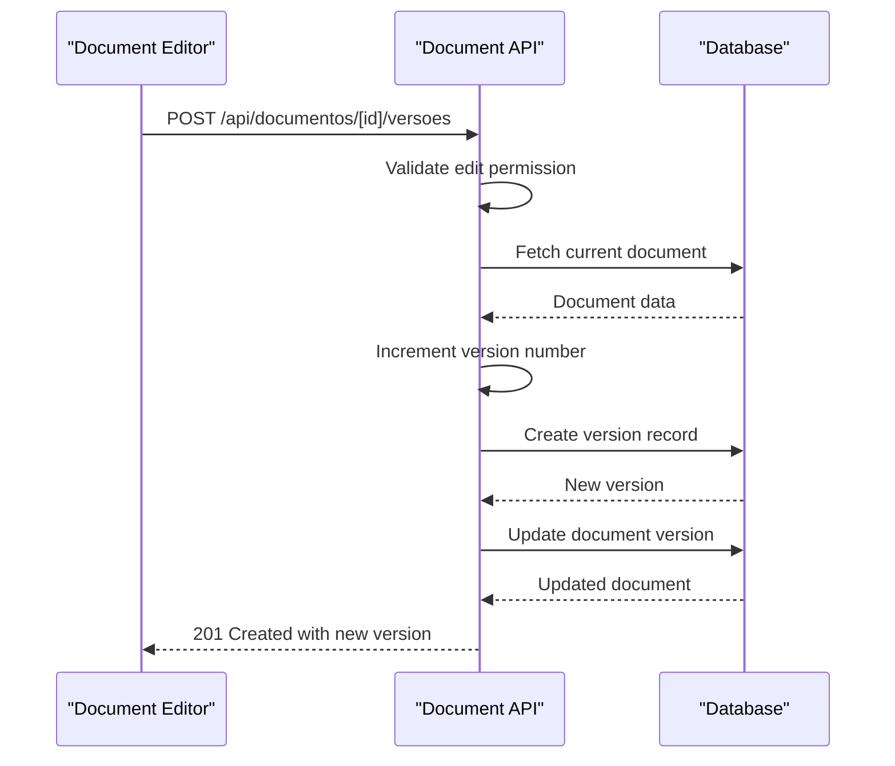
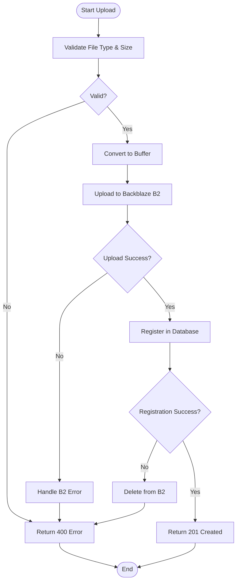
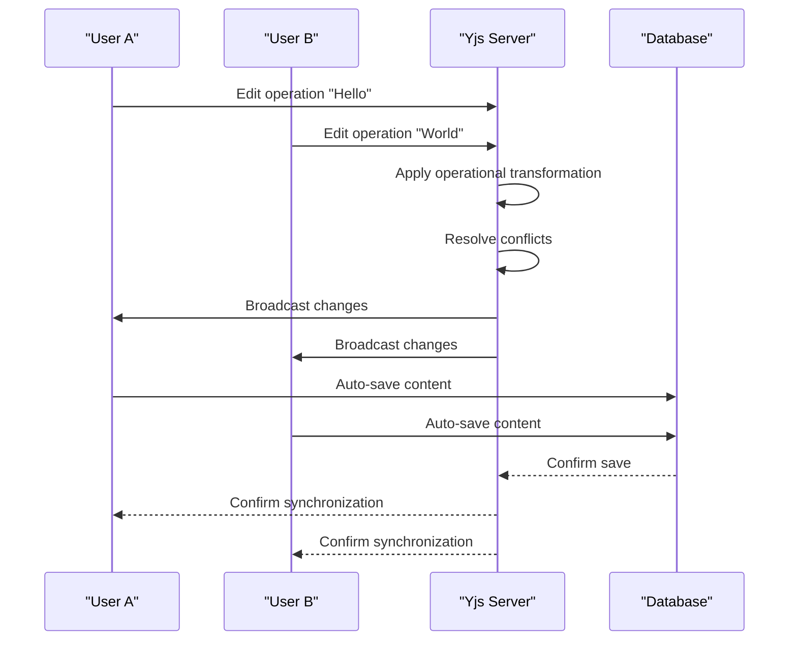
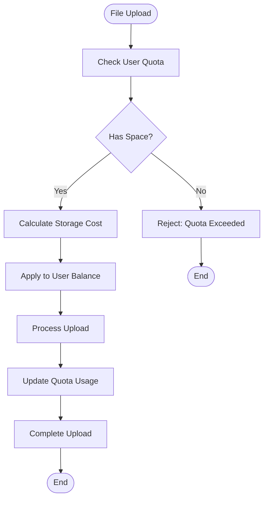

# Document Endpoints

<cite>
**Referenced Files in This Document**   
- [route.ts](file://app/api/documentos/route.ts)
- [route.ts](file://app/api/documentos/[id]/route.ts)
- [route.ts](file://app/api/documentos/[id]/compartilhamentos/route.ts)
- [route.ts](file://app/api/documentos/[id]/versoes/route.ts)
- [route.ts](file://app/api/documentos/[id]/versoes/[versaoId]/route.ts)
- [route.ts](file://app/api/documentos/[id]/upload/route.ts)
- [route.ts](file://app/api/documentos/presigned-url/route.ts)
- [documentos-persistence.service.ts](file://backend/documentos/services/persistence/documentos-persistence.service.ts)
- [compartilhamento-persistence.service.ts](file://backend/documentos/services/persistence/compartilhamento-persistence.service.ts)
- [versoes-persistence.service.ts](file://backend/documentos/services/persistence/versoes-persistence.service.ts)
- [uploads-persistence.service.ts](file://backend/documentos/services/persistence/uploads-persistence.service.ts)
- [pastas-persistence.service.ts](file://backend/documentos/services/persistence/pastas-persistence.service.ts)
- [types.ts](file://backend/types/documentos/types.ts)
- [b2-upload.service.ts](file://backend/documentos/services/upload/b2-upload.service.ts)
- [backblaze-b2.service.ts](file://backend/storage/backblaze-b2.service.ts)
</cite>

## Table of Contents
1. [Introduction](#introduction)
2. [Document CRUD Operations](#document-crud-operations)
3. [Sharing Management](#sharing-management)
4. [Version Control](#version-control)
5. [Folder Organization](#folder-organization)
6. [File Uploads](#file-uploads)
7. [Real-time Collaboration](#real-time-collaboration)
8. [Storage and Access](#storage-and-access)
9. [Error Handling](#error-handling)
10. [Usage Examples](#usage-examples)

## Introduction
The Sinesys document management system provides a comprehensive API for managing documents, folders, sharing, versioning, and file attachments. This documentation covers the major endpoints for document management functionality, including CRUD operations, sharing management, version control, folder organization, and file uploads. The system integrates real-time collaboration using Yjs, conflict resolution strategies, and operational transformation to enable seamless multi-user editing. Documents are stored in Backblaze B2 with secure access via presigned URLs.

**Section sources**
- [route.ts](file://app/api/documentos/route.ts#L1-L222)

## Document CRUD Operations

The `/api/documentos/` endpoint provides comprehensive CRUD operations for document management. The system supports document creation, retrieval, updating, and soft deletion with robust permission controls and pagination.

### GET /api/documentos/
Retrieves a paginated list of documents with filtering options. Users can filter by folder, search term, tags, creator, and include deleted documents.

**Parameters**
- `pasta_id` (integer): Folder ID to filter documents. Use 'null' for root folder documents.
- `busca` (string): Search term for title and description.
- `tags` (string): Comma-separated tags for filtering.
- `criado_por` (integer): Creator ID to filter documents.
- `incluir_deletados` (boolean): Include documents in trash.
- `limit` (integer): Records per page (default: 50).
- `offset` (integer): Pagination offset.

**Response Schema**
```json
{
  "success": true,
  "data": [
    {
      "id": 1,
      "titulo": "Document Title",
      "conteudo": {},
      "pasta_id": null,
      "criado_por": 1,
      "editado_por": 1,
      "versao": 1,
      "descricao": "Document description",
      "tags": ["tag1", "tag2"],
      "created_at": "2023-01-01T00:00:00Z",
      "updated_at": "2023-01-01T00:00:00Z",
      "editado_em": "2023-01-01T00:00:00Z",
      "deleted_at": null,
      "criador": {
        "id": 1,
        "nome_completo": "John Doe",
        "nome_exibicao": "John",
        "email_corporativo": "john@company.com"
      },
      "editor": {
        "id": 1,
        "nome_completo": "John Doe",
        "nome_exibicao": "John"
      },
      "permissao_usuario": "proprietario"
    }
  ],
  "pagination": {
    "total": 1,
    "limit": 50,
    "offset": 0,
    "hasMore": false
  }
}
```

**Error Codes**
- 401: Unauthorized - User not authenticated
- 500: Internal Server Error

**Section sources**
- [route.ts](file://app/api/documentos/route.ts#L21-L138)

### POST /api/documentos/
Creates a new document associated with the authenticated user.

**Request Body**
```json
{
  "titulo": "New Document",
  "conteudo": [],
  "pasta_id": 1,
  "descricao": "Document description",
  "tags": ["work", "important"]
}
```

**Validation Rules**
- Title is required and must not be empty
- Title length must not exceed 500 characters
- Content defaults to empty array if not provided

**Response Schema**
```json
{
  "success": true,
  "data": {
    "id": 2,
    "titulo": "New Document",
    "conteudo": [],
    "pasta_id": 1,
    "criado_por": 1,
    "editado_por": 1,
    "versao": 1,
    "descricao": "Document description",
    "tags": ["work", "important"],
    "created_at": "2023-01-01T00:00:00Z",
    "updated_at": "2023-01-01T00:00:00Z",
    "editado_em": "2023-01-01T00:00:00Z",
    "deleted_at": null
  }
}
```

**Error Codes**
- 400: Bad Request - Invalid parameters (missing title, title too long)
- 401: Unauthorized - User not authenticated
- 500: Internal Server Error

**Section sources**
- [route.ts](file://app/api/documentos/route.ts#L151-L210)

### GET /api/documentos/[id]
Retrieves a specific document by ID with user permission information.

**Response Schema**
```json
{
  "success": true,
  "data": {
    "id": 1,
    "titulo": "Document Title",
    "conteudo": {},
    "pasta_id": null,
    "criado_por": 1,
    "editado_por": 1,
    "versao": 1,
    "descricao": "Document description",
    "tags": ["tag1", "tag2"],
    "created_at": "2023-01-01T00:00:00Z",
    "updated_at": "2023-01-01T00:00:00Z",
    "editado_em": "2023-01-01T00:00:00Z",
    "deleted_at": null,
    "criador": {
      "id": 1,
      "nome_completo": "John Doe",
      "nome_exibicao": "John",
      "email_corporativo": "john@company.com"
    },
    "editor": {
      "id": 1,
      "nome_completo": "John Doe",
      "nome_exibicao": "John"
    },
    "permissao_usuario": "proprietario"
  }
}
```

**Error Codes**
- 400: Bad Request - Invalid ID format
- 403: Forbidden - No access to document
- 404: Not Found - Document not found
- 500: Internal Server Error

**Section sources**
- [route.ts](file://app/api/documentos/[id]/route.ts#L20-L71)

### PUT/PATCH /api/documentos/[id]
Updates a document's properties. Both PUT and PATCH methods are supported for full and partial updates.

**Request Body**
```json
{
  "titulo": "Updated Title",
  "conteudo": [],
  "pasta_id": 2,
  "descricao": "Updated description",
  "tags": ["updated", "new"]
}
```

**Validation Rules**
- Title cannot be empty if provided
- Title length must not exceed 500 characters
- User must have edit or owner permission

**Response Schema**
```json
{
  "success": true,
  "data": {
    "id": 1,
    "titulo": "Updated Title",
    "conteudo": [],
    "pasta_id": 2,
    "criado_por": 1,
    "editado_por": 1,
    "versao": 2,
    "descricao": "Updated description",
    "tags": ["updated", "new"],
    "created_at": "2023-01-01T00:00:00Z",
    "updated_at": "2023-01-02T00:00:00Z",
    "editado_em": "2023-01-02T00:00:00Z",
    "deleted_at": null
  }
}
```

**Error Codes**
- 400: Bad Request - Invalid parameters
- 403: Forbidden - No edit permission
- 500: Internal Server Error

**Section sources**
- [route.ts](file://app/api/documentos/[id]/route.ts#L84-L157)

### DELETE /api/documentos/[id]
Soft deletes a document by moving it to the trash. Only the document owner can perform this action.

**Response Schema**
```json
{
  "success": true,
  "message": "Documento movido para lixeira"
}
```

**Error Codes**
- 400: Bad Request - Invalid ID format
- 403: Forbidden - Only owner can delete
- 500: Internal Server Error

**Section sources**
- [route.ts](file://app/api/documentos/[id]/route.ts#L170-L211)

## Sharing Management

The document sharing system allows users to share documents with specific permissions and manage access rights. The `/api/documentos/[id]/compartilhamentos/` endpoint handles sharing operations.

### GET /api/documentos/[id]/compartilhamentos
Lists all sharing relationships for a document. Users must have access to the document to view its sharing information.

**Response Schema**
```json
{
  "success": true,
  "data": [
    {
      "id": 1,
      "documento_id": 1,
      "usuario_id": 2,
      "permissao": "editar",
      "pode_deletar": false,
      "compartilhado_por": 1,
      "created_at": "2023-01-01T00:00:00Z",
      "usuario": {
        "id": 2,
        "nome_completo": "Jane Smith",
        "nome_exibicao": "Jane",
        "email_corporativo": "jane@company.com"
      },
      "compartilhador": {
        "id": 1,
        "nome_completo": "John Doe"
      }
    }
  ]
}
```

**Error Codes**
- 400: Bad Request - Invalid document ID
- 403: Forbidden - No access to document
- 500: Internal Server Error

**Section sources**
- [route.ts](file://app/api/documentos/[id]/compartilhamentos/route.ts#L17-L57)

### POST /api/documentos/[id]/compartilhamentos
Shares a document with another user. The sharing user must have edit or owner permission.

**Request Body**
```json
{
  "usuario_id": 2,
  "permissao": "editar",
  "pode_deletar": false
}
```

**Validation Rules**
- `usuario_id` is required and must be a number
- `permissao` must be "visualizar" or "editar"
- Cannot share with self
- User must have edit or owner permission

**Response Schema**
```json
{
  "success": true,
  "data": {
    "id": 1,
    "documento_id": 1,
    "usuario_id": 2,
    "permissao": "editar",
    "pode_deletar": false,
    "compartilhado_por": 1,
    "created_at": "2023-01-01T00:00:00Z"
  }
}
```

**Error Codes**
- 400: Bad Request - Invalid parameters or self-sharing
- 403: Forbidden - No permission to share
- 500: Internal Server Error

**Section sources**
- [route.ts](file://app/api/documentos/[id]/compartilhamentos/route.ts#L70-L144)

### Permission Levels
The system implements a hierarchical permission model:
- **Proprietario (Owner)**: Full control including deletion and sharing management
- **Editar (Edit)**: Can modify document content and properties
- **Visualizar (View)**: Read-only access to document content

When a document is shared, the system checks the user's existing permission and updates it if necessary, preventing duplicate sharing records.

**Section sources**
- [compartilhamento-persistence.service.ts](file://backend/documentos/services/persistence/compartilhamento-persistence.service.ts#L18-L50)

## Version Control

The version control system maintains a complete history of document changes with manual snapshot creation and restoration capabilities.

### GET /api/documentos/[id]/versoes
Lists document versions with pagination support.

**Parameters**
- `limit` (integer): Versions per page (default: 50)
- `offset` (integer): Pagination offset

**Response Schema**
```json
{
  "success": true,
  "data": [
    {
      "id": 1,
      "documento_id": 1,
      "versao": 2,
      "conteudo": {},
      "titulo": "Updated Title",
      "criado_por": 1,
      "created_at": "2023-01-02T00:00:00Z",
      "criador": {
        "id": 1,
        "nomeCompleto": "John Doe",
        "nomeExibicao": "John"
      }
    }
  ],
  "pagination": {
    "total": 1,
    "limit": 50,
    "offset": 0,
    "hasMore": false
  }
}
```

**Error Codes**
- 400: Bad Request - Invalid document ID
- 403: Forbidden - No access to document
- 500: Internal Server Error

**Section sources**
- [route.ts](file://app/api/documentos/[id]/versoes/route.ts#L20-L79)

### POST /api/documentos/[id]/versoes
Creates a manual version snapshot of the current document state.

**Response Schema**
```json
{
  "success": true,
  "data": {
    "id": 1,
    "documento_id": 1,
    "versao": 2,
    "conteudo": {},
    "titulo": "Updated Title",
    "criado_por": 1,
    "created_at": "2023-01-02T00:00:00Z"
  }
}
```

**Process**
1. Verify user has edit permission
2. Fetch current document state
3. Increment document version number
4. Create version record with current content and title

**Error Codes**
- 400: Bad Request - Invalid document ID
- 403: Forbidden - No edit permission
- 404: Not Found - Document not found
- 500: Internal Server Error

**Section sources**
- [route.ts](file://app/api/documentos/[id]/versoes/route.ts#L92-L154)

### GET /api/documentos/[id]/versoes/[versaoId]
Retrieves a specific version of a document.

**Response Schema**
```json
{
  "success": true,
  "data": {
    "id": 1,
    "documento_id": 1,
    "versao": 2,
    "conteudo": {},
    "titulo": "Updated Title",
    "criado_por": 1,
    "created_at": "2023-01-02T00:00:00Z",
    "criador": {
      "id": 1,
      "nomeCompleto": "John Doe",
      "nomeExibicao": "John"
    }
  }
}
```

**Error Codes**
- 400: Bad Request - Invalid IDs
- 403: Forbidden - No access to document
- 404: Not Found - Version not found
- 400: Bad Request - Version doesn't belong to document

**Section sources**
- [route.ts](file://app/api/documentos/[id]/versoes/[versaoId]/route.ts#L15-L73)

### Version Restoration
When restoring a version, the system creates a new version with the restored content and updates the main document. This maintains the version history while applying the restored content.

**Process**
1. Find the version to restore
2. Create a new version with the restored content
3. Update the main document with the restored content and title
4. Increment the document version number

**Section sources**
- [versoes-persistence.service.ts](file://backend/documentos/services/persistence/versoes-persistence.service.ts#L209-L267)

## Folder Organization

The folder system provides hierarchical organization for documents with support for common and private folders.

### Folder Structure
Folders can be organized hierarchically with parent-child relationships. Each folder has:
- Name and optional description
- Type: "comum" (common) or "privada" (private)
- Optional color and icon
- Creator reference

**Section sources**
- [pastas-persistence.service.ts](file://backend/documentos/services/persistence/pastas-persistence.service.ts#L9-L105)

### Folder Permissions
- **Common folders**: Accessible to all users
- **Private folders**: Only accessible to the creator

The system verifies folder access when users attempt to create, update, or delete documents within folders.

**Section sources**
- [pastas-persistence.service.ts](file://backend/documentos/services/persistence/pastas-persistence.service.ts#L334-L362)

## File Uploads

The file upload system allows attaching files to documents with secure storage in Backblaze B2.

### POST /api/documentos/[id]/upload
Uploads a file to a document.

**Request**
- Form Data with `file` field containing the file
- Document ID in URL path

**Validation**
- File type must be allowed
- File size must not exceed 50MB
- User must have edit or owner permission

**Process**
1. Validate file type and size
2. Convert file to buffer
3. Upload to Backblaze B2
4. Register upload in database with B2 key and URL

**Response Schema**
```json
{
  "success": true,
  "data": {
    "id": 1,
    "documento_id": 1,
    "nome_arquivo": "document.pdf",
    "tipo_mime": "application/pdf",
    "tamanho_bytes": 102400,
    "b2_key": "documents/1/document.pdf",
    "b2_url": "https://s3.us-west-002.backblazeb2.com/...",
    "tipo_media": "pdf",
    "criado_por": 1,
    "created_at": "2023-01-01T00:00:00Z"
  },
  "message": "Arquivo enviado com sucesso"
}
```

**Error Codes**
- 400: Bad Request - No file, invalid type, or size too large
- 403: Forbidden - No upload permission
- 500: Internal Server Error

**Section sources**
- [route.ts](file://app/api/documentos/[id]/upload/route.ts#L76-L171)

### GET /api/documentos/[id]/upload
Lists all files uploaded to a document.

**Response Schema**
```json
{
  "success": true,
  "data": [
    {
      "id": 1,
      "documento_id": 1,
      "nome_arquivo": "document.pdf",
      "tipo_mime": "application/pdf",
      "tamanho_bytes": 102400,
      "b2_key": "documents/1/document.pdf",
      "b2_url": "https://s3.us-west-002.backblazeb2.com/...",
      "tipo_media": "pdf",
      "criado_por": 1,
      "created_at": "2023-01-01T00:00:00Z"
    }
  ]
}
```

**Section sources**
- [route.ts](file://app/api/documentos/[id]/upload/route.ts#L22-L63)

## Real-time Collaboration

The system implements real-time collaboration using Yjs for operational transformation and conflict resolution.

### Yjs Integration
The document editor uses Yjs to synchronize content changes across multiple users in real-time. Each document has a shared Yjs document that is synchronized through WebRTC and WebSockets.

**Key Features**
- Operational transformation for concurrent edits
- Conflict resolution through automatic merging
- Real-time cursor and selection sharing
- Presence tracking of collaborators

**Section sources**
- [yjs-kit.tsx](file://components/plate/yjs-kit.tsx)

### Auto-save Mechanism
Documents are automatically saved with a debounce mechanism to prevent excessive server requests while ensuring data persistence.

**Endpoint**: `/api/documentos/[id]/auto-save/`

**Process**
- Client sends content updates with debounce
- Server validates and saves document
- Version is incremented only for manual saves, not auto-saves

**Section sources**
- [AutoSavePayload](file://backend/types/documentos/types.ts#L517-L521)

## Storage and Access

The document system integrates with Backblaze B2 for secure file storage and access management.

### Backblaze B2 Integration
All document files and uploads are stored in Backblaze B2 with the following configuration:
- Private bucket for document storage
- File naming convention: `documents/[document_id]/[filename]`
- Server-side encryption
- Versioning enabled

**Section sources**
- [b2-upload.service.ts](file://backend/documentos/services/upload/b2-upload.service.ts)
- [backblaze-b2.service.ts](file://backend/storage/backblaze-b2.service.ts)

### Presigned URL Mechanism
The system generates time-limited presigned URLs for secure file access without exposing storage credentials.

#### POST /api/documentos/presigned-url
Generates a presigned URL for file download.

**Request Body**
```json
{
  "key": "documents/1/document.pdf"
}
```

**Response Schema**
```json
{
  "url": "https://s3.us-west-002.backblazeb2.com/...?X-Amz-Signature=...",
  "expiresIn": 3600
}
```

The URL is valid for 1 hour (3600 seconds) and provides temporary access to the specified file.

**Section sources**
- [route.ts](file://app/api/documentos/presigned-url/route.ts#L42-L64)

## Error Handling

The API implements comprehensive error handling with standardized response formats.

### Error Response Schema
```json
{
  "success": false,
  "error": "Error message",
  "details": {}
}
```

### Common Error Codes
- **400 Bad Request**: Invalid parameters, validation errors
- **401 Unauthorized**: Authentication required or failed
- **403 Forbidden**: Insufficient permissions
- **404 Not Found**: Resource not found
- **500 Internal Server Error**: Unexpected server error

### Validation Errors
The system performs thorough validation on all endpoints:
- Input sanitization and type checking
- Business rule validation (permissions, quotas)
- Database constraint validation
- File type and size validation

**Section sources**
- [route.ts](file://app/api/documentos/route.ts#L139-L147)

## Usage Examples

### Document Editor Versioning Workflow
The document editor interacts with versioning endpoints to maintain document history:



**Diagram sources**
- [route.ts](file://app/api/documentos/[id]/versoes/route.ts#L92-L154)
- [versoes-persistence.service.ts](file://backend/documentos/services/persistence/versoes-persistence.service.ts#L18-L41)

### Large File Upload Process
Handling large file uploads with proper error management:



**Diagram sources**
- [route.ts](file://app/api/documentos/[id]/upload/route.ts#L76-L171)
- [b2-upload.service.ts](file://backend/documentos/services/upload/b2-upload.service.ts)

### Concurrent Editing Conflict Resolution
The system handles concurrent editing through Yjs operational transformation:



**Diagram sources**
- [yjs-kit.tsx](file://components/plate/yjs-kit.tsx)
- [AutoSavePayload](file://backend/types/documentos/types.ts#L517-L521)

### Storage Quota Management
The system monitors and enforces storage quotas:



**Section sources**
- [uploads-persistence.service.ts](file://backend/documentos/services/persistence/uploads-persistence.service.ts#L194-L208)
- [calcularEstatisticasUploads](file://backend/documentos/services/persistence/uploads-persistence.service.ts#L304-L339)