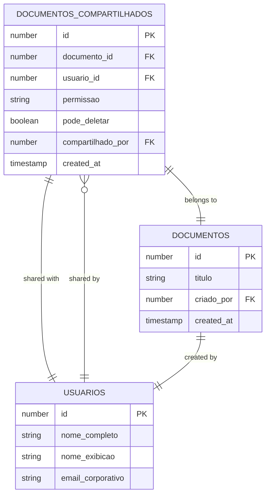
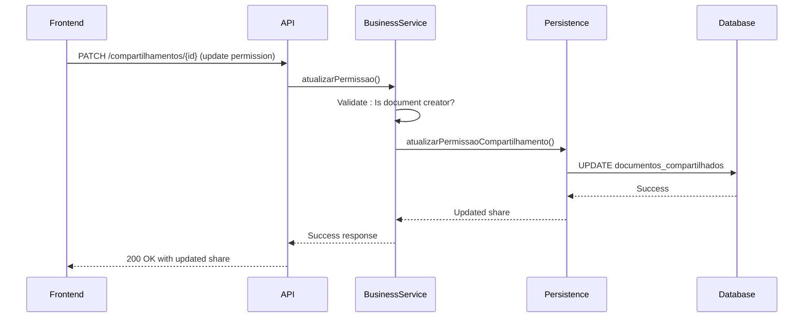
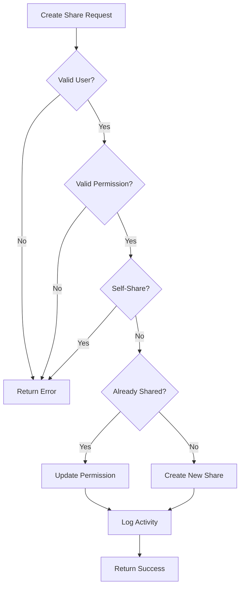

# Document Sharing Management

<cite>
**Referenced Files in This Document**   
- [compartilhar-documento.service.ts](file://backend/documentos/services/compartilhamento/compartilhar-documento.service.ts)
- [atualizar-permissao.service.ts](file://backend/documentos/services/compartilhamento/atualizar-permissao.service.ts)
- [remover-compartilhamento.service.ts](file://backend/documentos/services/compartilhamento/remover-compartilhamento.service.ts)
- [compartilhamento-persistence.service.ts](file://backend/documentos/services/persistence/compartilhamento-persistence.service.ts)
- [listar-compartilhamentos.service.ts](file://backend/documentos/services/compartilhamento/listar-compartilhamentos.service.ts)
- [route.ts](file://app/api/documentos/[id]/compartilhamentos/route.ts)
- [route.ts](file://app/api/documentos/[id]/compartilhamentos/[compartilhamentoId]/route.ts)
- [share-document-dialog.tsx](file://components/documentos/share-document-dialog.tsx)
- [types.ts](file://backend/types/documentos/types.ts)
- [compartilhamento-api.integration.test.ts](file://tests/integration/documentos/compartilhamento-api.integration.test.ts)
</cite>

## Table of Contents
1. [Introduction](#introduction)
2. [API Endpoints](#api-endpoints)
3. [Data Model](#data-model)
4. [Permission System](#permission-system)
5. [Frontend Integration](#frontend-integration)
6. [Usage Examples](#usage-examples)
7. [Security Considerations](#security-considerations)
8. [Error Handling](#error-handling)

## Introduction

The document sharing system in Sinesys enables users to securely share documents with collaborators while maintaining granular control over access permissions. This documentation details the API endpoints, data model, and business logic for managing document shares through the `/api/documentos/compartilhamentos/` endpoints.

The sharing system is designed with security and usability in mind, allowing document creators to share documents with specific users, manage their permissions, and revoke access when needed. The system supports two permission levels: view and edit, with strict enforcement of access controls at both the application and database levels.

**Section sources**
- [compartilhar-documento.service.ts](file://backend/documentos/services/compartilhamento/compartilhar-documento.service.ts#L1-L109)
- [atualizar-permissao.service.ts](file://backend/documentos/services/compartilhamento/atualizar-permissao.service.ts#L1-L122)

## API Endpoints

The document sharing API provides RESTful endpoints for creating, reading, updating, and deleting document shares. All endpoints require authentication and enforce permission checks to ensure only authorized users can perform operations.

### POST /api/documentos/{id}/compartilhamentos

Creates a new document share with a user.

**Request**
```json
{
  "usuario_id": 123,
  "permissao": "visualizar",
  "pode_deletar": false
}
```

**Response (200 OK)**
```json
{
  "success": true,
  "data": {
    "id": 456,
    "documento_id": 789,
    "usuario_id": 123,
    "permissao": "visualizar",
    "pode_deletar": false,
    "compartilhado_por": 101,
    "created_at": "2025-01-15T10:30:00Z"
  }
}
```

**Authentication**: Required  
**Authorization**: Only the document creator can create shares

### GET /api/documentos/{id}/compartilhamentos

Retrieves all shares for a document.

**Response (200 OK)**
```json
{
  "success": true,
  "data": [
    {
      "id": 456,
      "documento_id": 789,
      "usuario_id": 123,
      "permissao": "visualizar",
      "pode_deletar": false,
      "compartilhado_por": 101,
      "created_at": "2025-01-15T10:30:00Z",
      "usuario": {
        "id": 123,
        "nome_completo": "John Doe",
        "nome_exibicao": "John",
        "email_corporativo": "john@example.com"
      },
      "compartilhador": {
        "id": 101,
        "nome_completo": "Jane Smith"
      }
    }
  ]
}
```

**Authentication**: Required  
**Authorization**: Users with access to the document can view shares

### PATCH /api/documentos/{id}/compartilhamentos/{compartilhamentoId}

Updates an existing share's permissions.

**Request**
```json
{
  "permissao": "editar",
  "pode_deletar": true
}
```

**Response (200 OK)**
```json
{
  "success": true,
  "data": {
    "id": 456,
    "documento_id": 789,
    "usuario_id": 123,
    "permissao": "editar",
    "pode_deletar": true,
    "compartilhado_por": 101,
    "created_at": "2025-01-15T10:30:00Z"
  }
}
```

**Authentication**: Required  
**Authorization**: Only the document creator can update permissions

### DELETE /api/documentos/{id}/compartilhamentos/{compartilhamentoId}

Removes a share, revoking the user's access.

**Response (200 OK)**
```json
{
  "success": true,
  "message": "Compartilhamento removido com sucesso"
}
```

**Authentication**: Required  
**Authorization**: Document creator, user who shared, or the user receiving the share can remove it

**Section sources**
- [route.ts](file://app/api/documentos/[id]/compartilhamentos/route.ts)
- [route.ts](file://app/api/documentos/[id]/compartilhamentos/[compartilhamentoId]/route.ts)
- [compartilhar-documento.service.ts](file://backend/documentos/services/compartilhamento/compartilhar-documento.service.ts#L37-L109)
- [atualizar-permissao.service.ts](file://backend/documentos/services/compartilhamento/atualizar-permissao.service.ts#L22-L122)
- [remover-compartilhamento.service.ts](file://backend/documentos/services/compartilhamento/remover-compartilhamento.service.ts#L21-L117)

## Data Model

The document sharing system uses a relational data model to track sharing relationships between documents and users. The core entity is the `documentos_compartilhados` table, which establishes the many-to-many relationship between documents and users.



**Diagram sources**
- [compartilhamento-persistence.service.ts](file://backend/documentos/services/persistence/compartilhamento-persistence.service.ts#L18-L344)
- [types.ts](file://backend/types/documentos/types.ts)

### Field Definitions

**documentos_compartilhados table:**
- `id`: Unique identifier for the sharing relationship
- `documento_id`: Reference to the shared document
- `usuario_id`: Reference to the user receiving access
- `permissao`: Permission level ("visualizar" or "editar")
- `pode_deletar`: Whether the user can delete the document (if they have edit permission)
- `compartilhado_por`: User ID of the person who created the share
- `created_at`: Timestamp when the share was created

The data model enforces referential integrity through foreign key constraints and uses Row Level Security (RLS) policies in Supabase to ensure users can only access shares they are authorized to view.

**Section sources**
- [compartilhamento-persistence.service.ts](file://backend/documentos/services/persistence/compartilhamento-persistence.service.ts#L18-L344)
- [types.ts](file://backend/types/documentos/types.ts)

## Permission System

The document sharing system implements a hierarchical permission model with two primary permission levels: view and edit. These permissions determine what actions a user can perform on a shared document.

### Permission Levels

**View ("visualizar"):**
- Can open and view the document
- Cannot make changes to the document content
- Cannot share the document with others
- Cannot delete the document

**Edit ("editar"):**
- All view permissions
- Can modify the document content
- Can add comments and annotations
- Can share the document with others (if granted permission)
- Can delete the document (if `pode_deletar` flag is set)

### Permission Enforcement

Permission enforcement occurs at multiple levels in the application stack:



**Diagram sources**
- [atualizar-permissao.service.ts](file://backend/documentos/services/compartilhamento/atualizar-permissao.service.ts#L22-L57)
- [compartilhamento-persistence.service.ts](file://backend/documentos/services/persistence/compartilhamento-persistence.service.ts#L55-L84)

The business logic layer performs the primary authorization checks:
1. Only the document creator can create or modify shares
2. Users can remove their own shares
3. The `pode_deletar` flag controls whether a user with edit permission can delete the document

Permission checks are also implemented at the database level using RLS policies, providing defense in depth.

**Section sources**
- [atualizar-permissao.service.ts](file://backend/documentos/services/compartilhamento/atualizar-permissao.service.ts#L22-L122)
- [remover-compartilhamento.service.ts](file://backend/documentos/services/compartilhamento/remover-compartilhamento.service.ts#L21-L117)
- [compartilhamento-persistence.service.ts](file://backend/documentos/services/persistence/compartilhamento-persistence.service.ts#L226-L250)

## Frontend Integration

The document sharing functionality is integrated into the frontend through the ShareDocumentDialog component, which provides a user-friendly interface for managing document shares.

```mermaid
flowchart TD
A[Document Editor] --> B[Share Button]
B --> C[ShareDocumentDialog]
C --> D[Search Users]
D --> E[Select Permission]
E --> F[Create Share]
F --> G[API: POST /compartilhamentos]
G --> H[Update UI]
C --> I[Manage Existing Shares]
I --> J[Update Permission]
J --> K[API: PATCH /compartilhamentos/{id}]
K --> H
I --> L[Remove Share]
L --> M[API: DELETE /compartilhamentos/{id}]
M --> H
```

**Diagram sources**
- [share-document-dialog.tsx](file://components/documentos/share-document-dialog.tsx#L54-L447)
- [route.ts](file://app/api/documentos/[id]/compartilhamentos/route.ts)

### Component Features

The ShareDocumentDialog component provides the following functionality:
- Search and select users by name or email
- Display existing shares with user avatars and permission badges
- Update permissions through dropdown selectors
- Toggle the "can delete" permission
- Real-time feedback with loading states and success/error notifications
- Automatic refresh of share list after operations

The component uses React state management to handle the UI state and makes direct API calls to the document sharing endpoints. It includes error handling with user-friendly toast notifications.

**Section sources**
- [share-document-dialog.tsx](file://components/documentos/share-document-dialog.tsx#L54-L447)
- [app/ajuda/funcionalidades/documentos/page.tsx](file://app/ajuda/funcionalidades/documentos/page.tsx#L232-L255)

## Usage Examples

This section provides practical examples of using the document sharing API for common scenarios.

### Sharing a Document with a User

To share a document with a user for viewing:

```http
POST /api/documentos/789/compartilhamentos HTTP/1.1
Content-Type: application/json
Authorization: Bearer <token>

{
  "usuario_id": 123,
  "permissao": "visualizar"
}
```

Response:
```json
{
  "success": true,
  "data": {
    "id": 456,
    "documento_id": 789,
    "usuario_id": 123,
    "permissao": "visualizar",
    "pode_deletar": false,
    "compartilhado_por": 101,
    "created_at": "2025-01-15T10:30:00Z"
  }
}
```

### Promoting a User to Editor

To upgrade a user's permission from view to edit:

```http
PATCH /api/documentos/789/compartilhamentos/456 HTTP/1.1
Content-Type: application/json
Authorization: Bearer <token>

{
  "permissao": "editar"
}
```

### Revoking Access

To remove a user's access to a document:

```http
DELETE /api/documentos/789/compartilhamentos/456 HTTP/1.1
Authorization: Bearer <token>
```

### Bulk Sharing

The backend service supports sharing with multiple users through the `compartilharDocumentoComMultiplos` function, which processes each share individually and returns results with error handling for failed operations.

**Section sources**
- [compartilhar-documento.service.ts](file://backend/documentos/services/compartilhamento/compartilhar-documento.service.ts#L77-L108)
- [atualizar-permissao.service.ts](file://backend/documentos/services/compartilhamento/atualizar-permissao.service.ts#L104-L121)
- [remover-compartilhamento.service.ts](file://backend/documentos/services/compartilhamento/remover-compartilhamento.service.ts#L21-L53)

## Security Considerations

The document sharing system implements multiple security measures to protect document access and prevent unauthorized sharing.

### Access Control

The system enforces strict access control through:
- Creator-only share management: Only the document creator can create or modify shares
- Multi-party removal: The document creator, the user who shared, or the recipient can remove a share
- Permission inheritance: Edit permission includes view permission
- Defense in depth: Both application-level and database-level authorization checks

### Audit Logging

All sharing activities are automatically logged through the database's audit trail mechanisms, capturing:
- When a document was shared
- Who shared it and with whom
- Permission changes
- Access revocation

These logs can be used for compliance and security investigations.

### Data Validation

The system performs comprehensive validation:
- User existence verification before sharing
- Permission value validation (only "visualizar" or "editar" allowed)
- Prevention of self-sharing
- Conflict resolution when sharing already exists



**Diagram sources**
- [compartilhar-documento.service.ts](file://backend/documentos/services/compartilhamento/compartilhar-documento.service.ts#L17-L68)
- [compartilhamento-persistence.service.ts](file://backend/documentos/services/persistence/compartilhamento-persistence.service.ts#L38-L45)

**Section sources**
- [compartilhar-documento.service.ts](file://backend/documentos/services/compartilhamento/compartilhar-documento.service.ts#L17-L68)
- [atualizar-permissao.service.ts](file://backend/documentos/services/compartilhamento/atualizar-permissao.service.ts#L34-L37)
- [remover-compartilhamento.service.ts](file://backend/documentos/services/compartilhamento/remover-compartilhamento.service.ts#L38-L45)

## Error Handling

The document sharing API provides comprehensive error handling with descriptive messages to help clients understand and resolve issues.

### Common Error Responses

**403 Forbidden - Insufficient Permissions**
```json
{
  "success": false,
  "error": "Apenas o criador do documento pode compartilhá-lo"
}
```

**404 Not Found - Resource Not Found**
```json
{
  "success": false,
  "error": "Documento não encontrado"
}
```

**400 Bad Request - Invalid Input**
```json
{
  "success": false,
  "error": "Permissão inválida. Use \"visualizar\" ou \"editar\""
}
```

### Error Types and Causes

| Error Type | Cause | Resolution |
|------------|------|------------|
| Creator Required | Non-creator attempting to share | Only document creator can share |
| User Not Found | Invalid usuario_id | Verify user exists in system |
| Invalid Permission | Permission not "visualizar" or "editar" | Use valid permission value |
| Self-Share | Attempting to share with oneself | Remove the share request |
| Document Not Found | Invalid documento_id | Verify document exists |

The backend services throw descriptive errors that are propagated to the API layer, ensuring clients receive meaningful error messages for troubleshooting.

**Section sources**
- [compartilhar-documento.service.ts](file://backend/documentos/services/compartilhamento/compartilhar-documento.service.ts#L45-L68)
- [atualizar-permissao.service.ts](file://backend/documentos/services/compartilhamento/atualizar-permissao.service.ts#L31-L37)
- [remover-compartilhamento.service.ts](file://backend/documentos/services/compartilhamento/remover-compartilhamento.service.ts#L29-L36)
- [compartilhamento-api.integration.test.ts](file://tests/integration/documentos/compartilhamento-api.integration.test.ts)