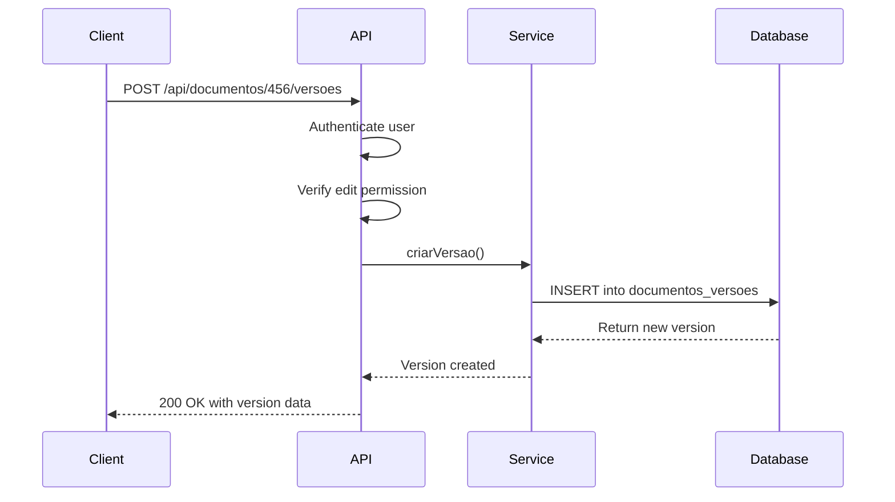
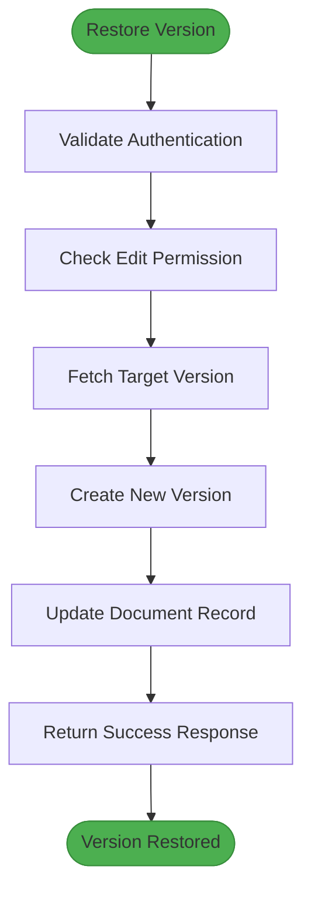

# Document Version Control

<cite>
**Referenced Files in This Document**   
- [route.ts](file://app/api/documentos/[id]/versoes/route.ts)
- [route.ts](file://app/api/documentos/[id]/versoes/[versaoId]/route.ts)
- [route.ts](file://app/api/documentos/[id]/versoes/[versaoId]/restaurar/route.ts)
- [versoes-persistence.service.ts](file://backend/documentos/services/persistence/versoes-persistence.service.ts)
- [types.ts](file://backend/types/documentos/types.ts)
- [collaborative-plate-editor.tsx](file://components/plate/collaborative-plate-editor.tsx)
- [supabase-yjs-provider.ts](file://lib/yjs/supabase-yjs-provider.ts)
- [spec.md](file://openspec/specs/documentos-editor/spec.md)
- [20251130220000_create_documentos_system.sql](file://supabase/migrations/aplicadas/20251130220000_create_documentos_system.sql)
</cite>

## Table of Contents
1. [Introduction](#introduction)
2. [API Endpoints](#api-endpoints)
3. [Data Model](#data-model)
4. [Version Creation and Management](#version-creation-and-management)
5. [Integration with Collaborative Editor](#integration-with-collaborative-editor)
6. [Usage Examples](#usage-examples)
7. [Performance Considerations](#performance-considerations)
8. [Storage Optimization](#storage-optimization)

## Introduction
The Sinesys document version control system provides comprehensive version management for documents within the platform. This system enables users to track changes, restore previous versions, and maintain a complete history of document modifications. The versioning functionality is tightly integrated with the collaborative editor, allowing for both manual and automatic version creation. The API endpoints under `/api/documentos/versoes/` provide full CRUD operations for document versions, including listing, creating, retrieving, and restoring versions. Each version captures essential metadata such as timestamp, author, and document state, ensuring a complete audit trail of document evolution.

**Section sources**
- [route.ts](file://app/api/documentos/[id]/versoes/route.ts)
- [versoes-persistence.service.ts](file://backend/documentos/services/persistence/versoes-persistence.service.ts)

## API Endpoints

### GET /api/documentos/[id]/versoes
Retrieves a paginated list of versions for a specific document.

**Authentication**: Required (JWT via authenticateRequest)
**Authorization**: User must have access to the document
**Parameters**:
- `id` (path): Document ID
- `limit` (query, optional): Number of versions per page (default: 50)
- `offset` (query, optional): Pagination offset (default: 0)

**Response**:
```json
{
  "success": true,
  "data": [
    {
      "id": 123,
      "documento_id": 456,
      "versao": 1,
      "conteudo": {...},
      "titulo": "Document Title",
      "criado_por": 789,
      "created_at": "2025-01-15T10:30:00Z",
      "criador": {
        "id": 789,
        "nomeCompleto": "John Doe",
        "nomeExibicao": "John"
      }
    }
  ],
  "pagination": {
    "total": 10,
    "limit": 50,
    "offset": 0,
    "hasMore": false
  }
}
```

### POST /api/documentos/[id]/versoes
Creates a new manual version of a document.

**Authentication**: Required (JWT via authenticateRequest)
**Authorization**: User must have edit permission on the document
**Parameters**:
- `id` (path): Document ID

**Request Body**: None (uses current document state)

**Response**:
```json
{
  "success": true,
  "data": {
    "id": 124,
    "documento_id": 456,
    "versao": 2,
    "conteudo": {...},
    "titulo": "Updated Document Title",
    "criado_por": 789,
    "created_at": "2025-01-15T11:00:00Z"
  }
}
```

### GET /api/documentos/[id]/versoes/[versaoId]
Retrieves a specific version by version ID.

**Authentication**: Required (JWT via authenticateRequest)
**Authorization**: User must have access to the document
**Parameters**:
- `id` (path): Document ID
- `versaoId` (path): Version ID

**Response**:
```json
{
  "success": true,
  "data": {
    "id": 123,
    "documento_id": 456,
    "versao": 1,
    "conteudo": {...},
    "titulo": "Document Title",
    "criado_por": 789,
    "created_at": "2025-01-15T10:30:00Z",
    "criador": {
      "id": 789,
      "nomeCompleto": "John Doe",
      "nomeExibicao": "John"
    }
  }
}
```

### POST /api/documentos/[id]/versoes/[versaoId]/restaurar
Restores a document to a previous version state.

**Authentication**: Required (JWT via authenticateRequest)
**Authorization**: User must have edit permission on the document
**Parameters**:
- `id` (path): Document ID
- `versaoId` (path): Version ID to restore

**Response**:
```json
{
  "success": true,
  "data": {
    "nova_versao": {
      "id": 125,
      "documento_id": 456,
      "versao": 3,
      "conteudo": {...},
      "titulo": "Document Title",
      "criado_por": 789,
      "created_at": "2025-01-15T11:30:00Z"
    },
    "documento_atualizado": true
  },
  "message": "Version restored successfully"
}
```

**Section sources**
- [route.ts](file://app/api/documentos/[id]/versoes/route.ts)
- [route.ts](file://app/api/documentos/[id]/versoes/[versaoId]/route.ts)
- [route.ts](file://app/api/documentos/[id]/versoes/[versaoId]/restaurar/route.ts)
- [versoes-persistence.service.ts](file://backend/documentos/services/persistence/versoes-persistence.service.ts)

## Data Model

### documentos_versoes Table
The `documentos_versoes` table stores the complete history of document versions with the following schema:

```mermaid
erDiagram
documentos_versoes {
bigint id PK
bigint documento_id FK
integer versao
jsonb conteudo
text titulo
bigint criado_por FK
timestamptz created_at
}
documentos ||--o{ documentos_versoes : "1 to many"
usuarios ||--o{ documentos_versoes : "1 to many"
documentos_versoes }o-- documentos : "belongs to"
documentos_versoes }o-- usuarios : "created by"
```

**Diagram sources**
- [20251130220000_create_documentos_system.sql](file://supabase/migrations/aplicadas/20251130220000_create_documentos_system.sql)
- [types.ts](file://backend/types/documentos/types.ts)

**Field Descriptions**:
- **id**: Primary key (auto-incrementing)
- **documento_id**: Foreign key to the documents table
- **versao**: Sequential version number (1, 2, 3, ...)
- **conteudo**: JSONB field storing the complete document state in Plate.js format
- **titulo**: Document title at the time of version creation
- **criado_por**: Foreign key to the users table (author of the version)
- **created_at**: Timestamp of version creation (automatically set)

**Constraints**:
- `documentos_versoes_versao_positive`: Ensures version numbers are positive
- `documentos_versoes_unique`: Unique constraint on (documento_id, versao) to prevent duplicate version numbers

**Indexes**:
- `idx_documentos_versoes_documento_id`: B-tree index on documento_id for efficient querying
- `idx_documentos_versoes_created_at`: B-tree index on created_at (descending) for chronological sorting

### DocumentoVersao Interface
The TypeScript interface defining the version structure:

```typescript
interface DocumentoVersao {
  id: number;
  documento_id: number;
  versao: number;
  conteudo: PlateContent; // JSONB structure from Plate.js
  titulo: string;
  criado_por: number;
  created_at: string;
}
```

**Section sources**
- [20251130220000_create_documentos_system.sql](file://supabase/migrations/aplicadas/20251130220000_create_documentos_system.sql)
- [types.ts](file://backend/types/documentos/types.ts)

## Version Creation and Management

### Manual Version Creation
Manual versions are created through the POST `/api/documentos/[id]/versoes` endpoint. When a user explicitly saves a version:

1. The system verifies the user has edit permission on the document
2. Retrieves the current document state (content and title)
3. Creates a new version record with the next sequential version number
4. Stores a complete snapshot of the document state
5. Returns the newly created version



**Diagram sources**
- [route.ts](file://app/api/documentos/[id]/versoes/route.ts)
- [versoes-persistence.service.ts](file://backend/documentos/services/persistence/versoes-persistence.service.ts)

### Version Restoration
Restoring a version creates a new version with the content from a previous state:

1. The system verifies the user has edit permission
2. Retrieves the target version to restore
3. Creates a new version with the next version number
4. Updates the main document record with the restored content
5. Returns the new version and confirmation



**Diagram sources**
- [route.ts](file://app/api/documentos/[id]/versoes/[versaoId]/restaurar/route.ts)
- [versoes-persistence.service.ts](file://backend/documentos/services/persistence/versoes-persistence.service.ts)

### Version Comparison
The system provides functionality to compare two versions of a document:

```typescript
async function compararVersoes(
  documento_id: number,
  versao_a: number,
  versao_b: number
): Promise<{
  versao_a: DocumentoVersao;
  versao_b: DocumentoVersao;
}> {
  // Implementation retrieves both versions and returns them
}
```

This allows users to see the differences between any two versions in the document's history.

**Section sources**
- [versoes-persistence.service.ts](file://backend/documentos/services/persistence/versoes-persistence.service.ts)

## Integration with Collaborative Editor

### Real-time Collaboration Architecture
The document versioning system is integrated with a collaborative editor using CRDT (Conflict-free Replicated Data Type) technology:

```mermaid
graph TD
A[Client 1] --> |Yjs Update| B[Supabase Realtime]
C[Client 2] --> |Yjs Update| B
D[Client N] --> |Yjs Update| B
B --> |Broadcast| A
B --> |Broadcast| C
B --> |Broadcast| D
B --> E[Auto-save Trigger]
E --> F[Create Version]
classDef client fill:#2196F3,stroke:#1976D2;
class A,C,D client;
class B fill:#4CAF50,stroke:#388E3C;
class E,F fill:#FF9800,stroke:#F57C00;
```

**Diagram sources**
- [collaborative-plate-editor.tsx](file://components/plate/collaborative-plate-editor.tsx)
- [supabase-yjs-provider.ts](file://lib/yjs/supabase-yjs-provider.ts)

### Auto-save vs. Versioning
The system distinguishes between auto-save operations and version creation:

```mermaid
flowchart LR
subgraph Editor
A[User Typing] --> B{2 seconds inactivity?}
B --> |Yes| C[Auto-save Request]
B --> |No| A
C --> D[Send to /auto-save endpoint]
D --> E[Update document record]
E --> F[No version created]
end
subgraph Versioning
G[User clicks "Save Version"] --> H[POST /versoes]
H --> I[Create version snapshot]
I --> J[Increment version number]
end
style Editor fill:#f0f8ff,stroke:#4682b4;
style Versioning fill:#f5f5f5,stroke:#9e9e9e;
```

**Diagram sources**
- [spec.md](file://openspec/specs/documentos-editor/spec.md)
- [collaborative-plate-editor.tsx](file://components/plate/collaborative-plate-editor.tsx)

### Yjs Integration
The collaborative editor uses Yjs for real-time synchronization with Supabase as the transport layer:

```typescript
class SupabaseYjsProvider implements UnifiedProvider {
  connect(): void {
    // Connect to Supabase Realtime channel
    // Listen for Yjs updates from other clients
    // Broadcast local updates to other clients
  }
  
  handleLocalUpdate(update: Uint8Array): void {
    // Send update to other clients via broadcast
    this.channel.send({
      type: 'broadcast',
      event: 'yjs-update',
      payload: { update: Array.from(update) }
    });
  }
}
```

Changes are continuously synchronized between clients, while explicit version creation captures discrete snapshots of the document state.

**Section sources**
- [collaborative-plate-editor.tsx](file://components/plate/collaborative-plate-editor.tsx)
- [supabase-yjs-provider.ts](file://lib/yjs/supabase-yjs-provider.ts)

## Usage Examples

### Retrieving Version History
To retrieve the version history of a document:

```bash
curl -X GET \
  "https://api.sinesys.com/api/documentos/456/versoes?limit=10&offset=0" \
  -H "Authorization: Bearer <token>"
```

This returns the 10 most recent versions with complete metadata.

### Creating a Manual Version
To create a new version of a document:

```bash
curl -X POST \
  "https://api.sinesys.com/api/documentos/456/versoes" \
  -H "Authorization: Bearer <token>"
```

This creates a new version with the current document state.

### Restoring a Previous Version
To restore a document to a previous state:

```bash
curl -X POST \
  "https://api.sinesys.com/api/documentos/456/versoes/123/restaurar" \
  -H "Authorization: Bearer <token>"
```

This creates a new version containing the content from version 123.

### Comparing Versions
To compare two versions programmatically:

```typescript
const resultado = await compararVersoes(456, 1, 2);
console.log('Version 1:', resultado.versao_a);
console.log('Version 2:', resultado.versao_b);
```

**Section sources**
- [route.ts](file://app/api/documentos/[id]/versoes/route.ts)
- [route.ts](file://app/api/documentos/[id]/versoes/[versaoId]/restaurar/route.ts)
- [versoes-persistence.service.ts](file://backend/documentos/services/persistence/versoes-persistence.service.ts)

## Performance Considerations

### Large Document Handling
For documents with extensive version history, the system implements several performance optimizations:

1. **Pagination**: Version lists are paginated with a default limit of 50 items
2. **Efficient Queries**: Indexed database queries for version retrieval
3. **Selective Loading**: Only metadata is loaded initially; full content is fetched on demand
4. **Caching**: Response caching for frequent version history requests

The system handles large documents by storing the complete state in each version, which ensures consistency but requires careful management of storage and retrieval performance.

### Query Optimization
Database queries are optimized for common access patterns:

```sql
-- Index for document-based version queries
CREATE INDEX idx_documentos_versoes_documento_id ON documentos_versoes (documento_id);

-- Index for chronological sorting
CREATE INDEX idx_documentos_versoes_created_at ON documentos_versoes (created_at DESC);
```

These indexes ensure that version retrieval operations scale efficiently even with thousands of versions per document.

**Section sources**
- [versoes-persistence.service.ts](file://backend/documentos/services/persistence/versoes-persistence.service.ts)
- [20251130220000_create_documentos_system.sql](file://supabase/migrations/aplicadas/20251130220000_create_documentos_system.sql)

## Storage Optimization

### Version Pruning Strategy
The system provides automated storage optimization through version pruning:

```typescript
async function limparVersoesAntigas(
  documento_id: number,
  manter_ultimas_n = 10
): Promise<number> {
  // Keep only the N most recent versions
  // Delete older versions to save storage
}
```

This function can be scheduled to run periodically, ensuring that storage usage remains manageable while preserving recent history.

### Storage Efficiency
The versioning system balances storage efficiency with functionality:

- **Complete Snapshots**: Each version stores the complete document state, ensuring reliability and simplicity
- **JSONB Compression**: PostgreSQL's JSONB format provides efficient storage and indexing
- **Immutable Design**: Versions are immutable (only inserted, never updated), preventing data corruption
- **Cascade Deletion**: When a document is deleted, all its versions are automatically removed

The trade-off of storing complete snapshots rather than diffs is intentional, as it simplifies version restoration and ensures data integrity, while the impact on storage is mitigated through pruning strategies.

**Section sources**
- [versoes-persistence.service.ts](file://backend/documentos/services/persistence/versoes-persistence.service.ts)