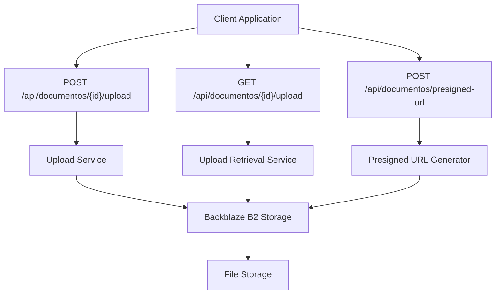
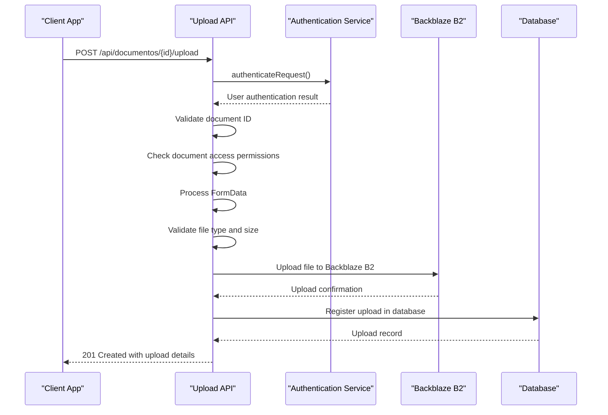
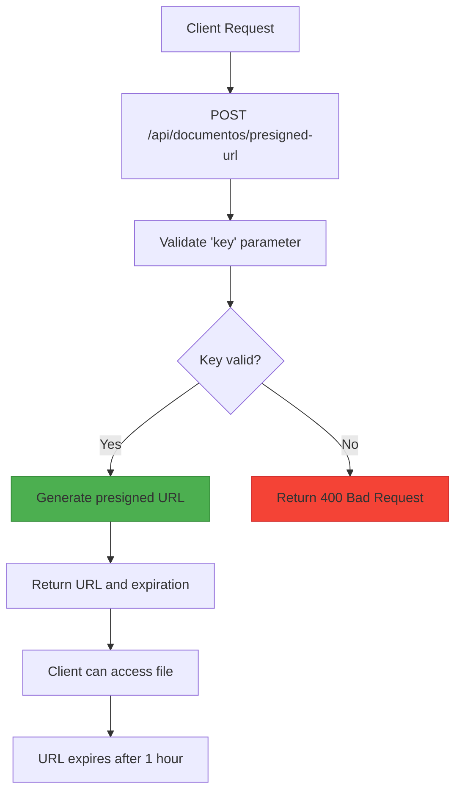
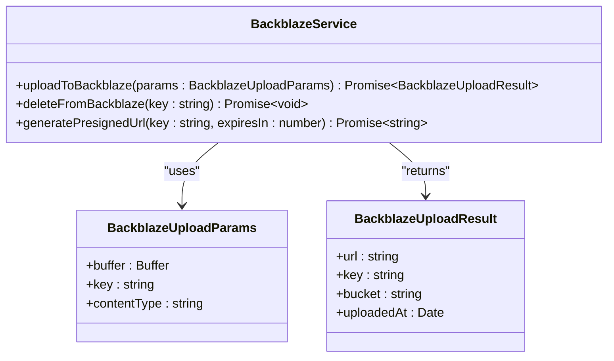
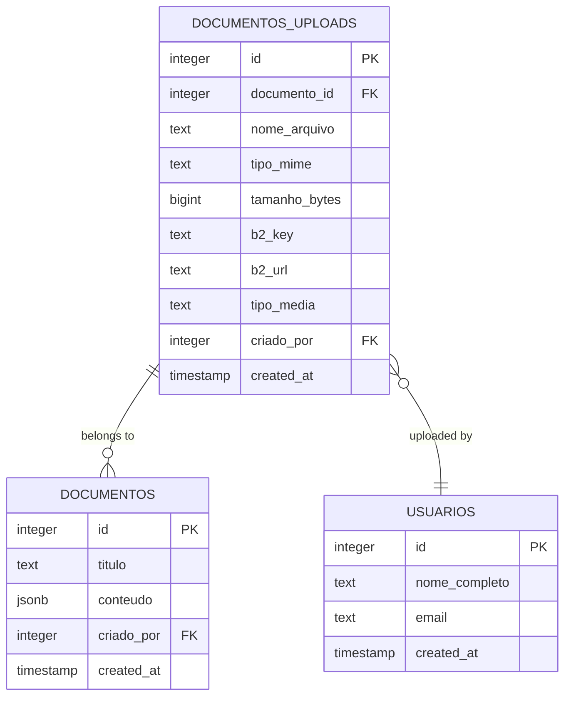
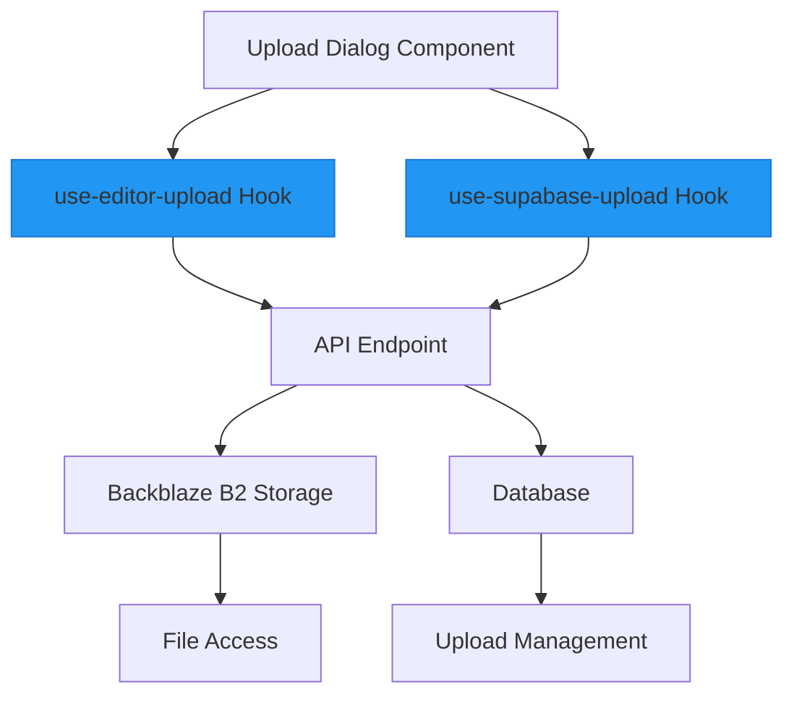
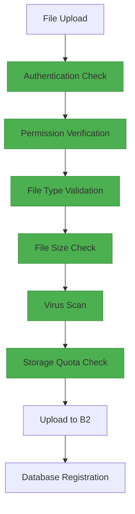

# File Uploads

<cite>
**Referenced Files in This Document**   
- [route.ts](file://app/api/documentos/[id]/upload/route.ts)
- [route.ts](file://app/api/documentos/presigned-url/route.ts)
- [b2-upload.service.ts](file://backend/documentos/services/upload/b2-upload.service.ts)
- [backblaze-b2.service.ts](file://backend/storage/backblaze-b2.service.ts)
- [file-naming.utils.ts](file://backend/storage/file-naming.utils.ts)
- [uploads-persistence.service.ts](file://backend/documentos/services/persistence/uploads-persistence.service.ts)
- [documentos-persistence.service.ts](file://backend/documentos/services/persistence/documentos-persistence.service.ts)
- [use-editor-upload.tsx](file://hooks/use-editor-upload.tsx)
- [use-supabase-upload.ts](file://hooks/use-supabase-upload.ts)
- [upload-dialog.tsx](file://components/documentos/upload-dialog.tsx)
</cite>

## Table of Contents
1. [Introduction](#introduction)
2. [Upload Endpoints](#upload-endpoints)
3. [Direct Upload Implementation](#direct-upload-implementation)
4. [Presigned URL Generation](#presigned-url-generation)
5. [File Storage with Backblaze B2](#file-storage-with-backblaze-b2)
6. [Data Model for Uploaded Files](#data-model-for-uploaded-files)
7. [Frontend Integration](#frontend-integration)
8. [API Usage Examples](#api-usage-examples)
9. [Security Considerations](#security-considerations)
10. [Error Handling](#error-handling)

## Introduction

The Sinesys system provides a comprehensive file upload infrastructure for managing document uploads across various contexts. This documentation details the API endpoints, implementation details, and integration patterns for file uploads using Backblaze B2 as the storage backend. The system supports direct uploads, presigned URL generation for secure access, and robust file management capabilities.

The upload system is designed to handle various file types including documents, images, audio, and video files, with comprehensive validation and security measures in place. All uploaded files are stored in Backblaze B2, an S3-compatible object storage service, ensuring high availability and durability.

**Section sources**
- [route.ts](file://app/api/documentos/[id]/upload/route.ts)
- [backblaze-b2.service.ts](file://backend/storage/backblaze-b2.service.ts)

## Upload Endpoints

The Sinesys system exposes several endpoints for file upload operations, each serving a specific purpose in the document management workflow.

### Direct Upload Endpoint

The primary endpoint for uploading files to a specific document is:

```
POST /api/documentos/[id]/upload
```

This endpoint accepts a file upload via FormData and stores it in the Backblaze B2 storage system. The file is associated with the document specified by the ID parameter.

### Upload Listing Endpoint

To retrieve a list of all uploads associated with a specific document:

```
GET /api/documentos/[id]/upload
```

This endpoint returns metadata about all files uploaded to the specified document, including file names, sizes, and storage locations.

### Presigned URL Endpoint

For secure access to private files, the system provides:

```
POST /api/documentos/presigned-url
```

This endpoint generates a time-limited presigned URL that grants temporary access to a specific file in the storage system.



**Diagram sources**
- [route.ts](file://app/api/documentos/[id]/upload/route.ts)
- [route.ts](file://app/api/documentos/presigned-url/route.ts)

**Section sources**
- [route.ts](file://app/api/documentos/[id]/upload/route.ts)
- [route.ts](file://app/api/documentos/presigned-url/route.ts)

## Direct Upload Implementation

The direct upload functionality allows clients to upload files directly to the server, which then stores them in Backblaze B2.

### HTTP Method and Authentication

The upload endpoint uses the POST method and requires authentication via JWT token in the Authorization header. The authentication is handled by the `authenticateRequest` function, which validates the user's credentials and session.

### Request Structure

The request must be sent as multipart/form-data with the following structure:

- **file**: The file to be uploaded (required)
- The file is sent as a FormData object with the field name "file"

### Upload Process Flow



**Diagram sources**
- [route.ts](file://app/api/documentos/[id]/upload/route.ts)
- [b2-upload.service.ts](file://backend/documentos/services/upload/b2-upload.service.ts)
- [uploads-persistence.service.ts](file://backend/documentos/services/persistence/uploads-persistence.service.ts)

**Section sources**
- [route.ts](file://app/api/documentos/[id]/upload/route.ts)
- [b2-upload.service.ts](file://backend/documentos/services/upload/b2-upload.service.ts)

## Presigned URL Generation

The presigned URL functionality enables secure, temporary access to files stored in the private Backblaze B2 bucket.

### Endpoint Details

```
POST /api/documentos/presigned-url
```

**Request Body:**
```json
{
  "key": "string"
}
```

- **key**: The storage path (B2 key) of the file for which to generate a presigned URL

**Response:**
```json
{
  "url": "string",
  "expiresIn": "number"
}
```

- **url**: The generated presigned URL for accessing the file
- **expiresIn**: The number of seconds until the URL expires (3600 seconds/1 hour)

### Implementation

The presigned URL generation is implemented using the AWS SDK's s3-request-presigner, which creates signed URLs for S3-compatible storage services like Backblaze B2.



**Diagram sources**
- [route.ts](file://app/api/documentos/presigned-url/route.ts)
- [backblaze-b2.service.ts](file://backend/storage/backblaze-b2.service.ts)

**Section sources**
- [route.ts](file://app/api/documentos/presigned-url/route.ts)
- [backblaze-b2.service.ts](file://backend/storage/backblaze-b2.service.ts)

## File Storage with Backblaze B2

The Sinesys system uses Backblaze B2 as its primary object storage solution, leveraging its S3-compatible API for file storage and retrieval.

### Storage Architecture

Backblaze B2 provides a cost-effective, durable storage solution with high availability. The system uses the AWS SDK v3 to interact with the B2 service through its S3-compatible API.

### Upload Service Implementation

The core upload functionality is implemented in the `backblaze-b2.service.ts` file, which provides several key functions:

- **uploadToBackblaze**: Uploads a file buffer to B2 with specified metadata
- **deleteFromBackblaze**: Removes a file from B2 storage
- **generatePresignedUrl**: Creates time-limited access URLs for private files



**Diagram sources**
- [backblaze-b2.service.ts](file://backend/storage/backblaze-b2.service.ts)

**Section sources**
- [backblaze-b2.service.ts](file://backend/storage/backblaze-b2.service.ts)
- [b2-upload.service.ts](file://backend/documentos/services/upload/b2-upload.service.ts)

### File Naming and Organization

Files are organized in a structured hierarchy within the B2 bucket:

```
processos/{numeroProcesso}/{tipoOrigem}/{nomeArquivo}
```

Where:
- **numeroProcesso**: The case number (e.g., 0010702-80.2025.5.03.0111)
- **tipoOrigem**: The source type (timeline, pendente_manifestacao, audiencias, expedientes)
- **nomeArquivo**: The generated filename following the pattern doc_{id}_{YYYYMMDD}.pdf

The file naming utilities are implemented in `file-naming.utils.ts`, which provides functions for generating consistent, predictable filenames based on document type and metadata.

**Section sources**
- [file-naming.utils.ts](file://backend/storage/file-naming.utils.ts)

## Data Model for Uploaded Files

The system maintains a comprehensive data model for tracking uploaded files and their metadata in the database.

### Database Schema

The `documentos_uploads` table stores metadata about each uploaded file with the following fields:

| Field | Type | Description |
|-------|------|-------------|
| id | integer | Unique identifier for the upload record |
| documento_id | integer | Foreign key to the associated document |
| nome_arquivo | text | Original filename |
| tipo_mime | text | MIME type of the file |
| tamanho_bytes | bigint | File size in bytes |
| b2_key | text | Storage path in Backblaze B2 |
| b2_url | text | Public URL of the file |
| tipo_media | text | Media type (imagem, video, audio, pdf, outros) |
| criado_por | integer | User ID of the uploader |
| created_at | timestamp | Upload timestamp |

### Data Flow

When a file is uploaded, the system follows this data flow:

1. The file is received by the API endpoint
2. Metadata is extracted and validated
3. The file is uploaded to Backblaze B2
4. A record is created in the `documentos_uploads` table
5. The response includes both storage information and database metadata



**Diagram sources**
- [uploads-persistence.service.ts](file://backend/documentos/services/persistence/uploads-persistence.service.ts)
- [documentos-persistence.service.ts](file://backend/documentos/services/persistence/documentos-persistence.service.ts)

**Section sources**
- [uploads-persistence.service.ts](file://backend/documentos/services/persistence/uploads-persistence.service.ts)
- [documentos-persistence.service.ts](file://backend/documentos/services/persistence/documentos-persistence.service.ts)

## Frontend Integration

The file upload functionality is integrated into various frontend components across the Sinesys application.

### Upload Dialog Component

The `upload-dialog.tsx` component provides a user interface for uploading files to documents. It uses the `use-editor-upload` hook to manage the upload process and display progress.

### React Hooks

Two primary hooks facilitate file uploads in the frontend:

- **use-editor-upload**: Handles uploads specifically for document editing contexts
- **use-supabase-upload**: Provides generic file upload capabilities using Supabase storage



**Section sources**
- [upload-dialog.tsx](file://components/documentos/upload-dialog.tsx)
- [use-editor-upload.tsx](file://hooks/use-editor-upload.tsx)
- [use-supabase-upload.ts](file://hooks/use-supabase-upload.ts)

## API Usage Examples

### Direct File Upload

```javascript
// Example of uploading a file to a document
async function uploadFile(documentId, file) {
  const formData = new FormData();
  formData.append('file', file);
  
  const response = await fetch(`/api/documentos/${documentId}/upload`, {
    method: 'POST',
    body: formData,
    headers: {
      'Authorization': `Bearer ${token}`
    }
  });
  
  const result = await response.json();
  return result;
}
```

### Generating a Presigned URL

```javascript
// Example of generating a presigned URL for file access
async function getPresignedUrl(fileKey) {
  const response = await fetch('/api/documentos/presigned-url', {
    method: 'POST',
    headers: {
      'Content-Type': 'application/json',
      'Authorization': `Bearer ${token}`
    },
    body: JSON.stringify({ key: fileKey })
  });
  
  const result = await response.json();
  return result.url; // Use this URL to access the file
}
```

### Listing Document Uploads

```javascript
// Example of retrieving uploads for a document
async function getDocumentUploads(documentId) {
  const response = await fetch(`/api/documentos/${documentId}/upload`, {
    headers: {
      'Authorization': `Bearer ${token}`
    }
  });
  
  const result = await response.json();
  return result.data; // Array of upload records
}
```

**Section sources**
- [route.ts](file://app/api/documentos/[id]/upload/route.ts)
- [route.ts](file://app/api/documentos/presigned-url/route.ts)
- [use-editor-upload.tsx](file://hooks/use-editor-upload.tsx)

## Security Considerations

The file upload system implements multiple security measures to protect against common vulnerabilities.

### Authentication and Authorization

All upload operations require authentication via JWT tokens. The system verifies that the user has appropriate permissions to upload files to the specified document:

- **Owners** and users with **edit** permissions can upload files
- **View-only** users cannot upload files
- Access is validated using the `verificarAcessoDocumento` function

### File Validation

The system performs strict validation on uploaded files:

- **File type validation**: Only specific MIME types are allowed
- **File size limits**: Maximum 50MB per file
- **Virus scanning**: Files are scanned for malware (implementation details not shown)

### Storage Security

Files are stored securely in Backblaze B2 with the following measures:

- **Private bucket**: The storage bucket is not publicly accessible
- **Presigned URLs**: Temporary access URLs with limited expiration
- **Access controls**: Fine-grained permissions for file access

### Quota Enforcement

The system enforces storage quotas at multiple levels:

- **Per-document quotas**: Limits on total storage per document
- **Per-user quotas**: Limits on total storage usage per user
- **System-wide quotas**: Overall storage capacity limits



**Section sources**
- [route.ts](file://app/api/documentos/[id]/upload/route.ts)
- [b2-upload.service.ts](file://backend/documentos/services/upload/b2-upload.service.ts)
- [documentos-persistence.service.ts](file://backend/documentos/services/persistence/documentos-persistence.service.ts)

## Error Handling

The upload system implements comprehensive error handling to provide meaningful feedback to clients.

### Error Types

The system returns specific HTTP status codes for different error conditions:

| Status Code | Error Type | Description |
|-----------|-----------|-------------|
| 400 | Bad Request | Invalid parameters or file validation failure |
| 401 | Unauthorized | Authentication required or failed |
| 403 | Forbidden | Insufficient permissions for the operation |
| 404 | Not Found | Document or resource not found |
| 500 | Internal Server Error | Server-side error during processing |

### Error Response Structure

Error responses follow a consistent format:

```json
{
  "success": false,
  "error": "Error message describing the issue"
}
```

### Common Error Scenarios

- **Invalid file type**: Returns 400 with "Tipo de arquivo não permitido"
- **File too large**: Returns 400 with "Arquivo muito grande (máximo 50MB)"
- **No file provided**: Returns 400 with "Nenhum arquivo enviado"
- **Authentication failure**: Returns 401 with "Unauthorized"
- **Permission denied**: Returns 403 with "Sem permissão para fazer upload"
- **Document not found**: Returns 400 with "ID inválido"

**Section sources**
- [route.ts](file://app/api/documentos/[id]/upload/route.ts)
- [route.ts](file://app/api/documentos/presigned-url/route.ts)
- [b2-upload.service.ts](file://backend/documentos/services/upload/b2-upload.service.ts)