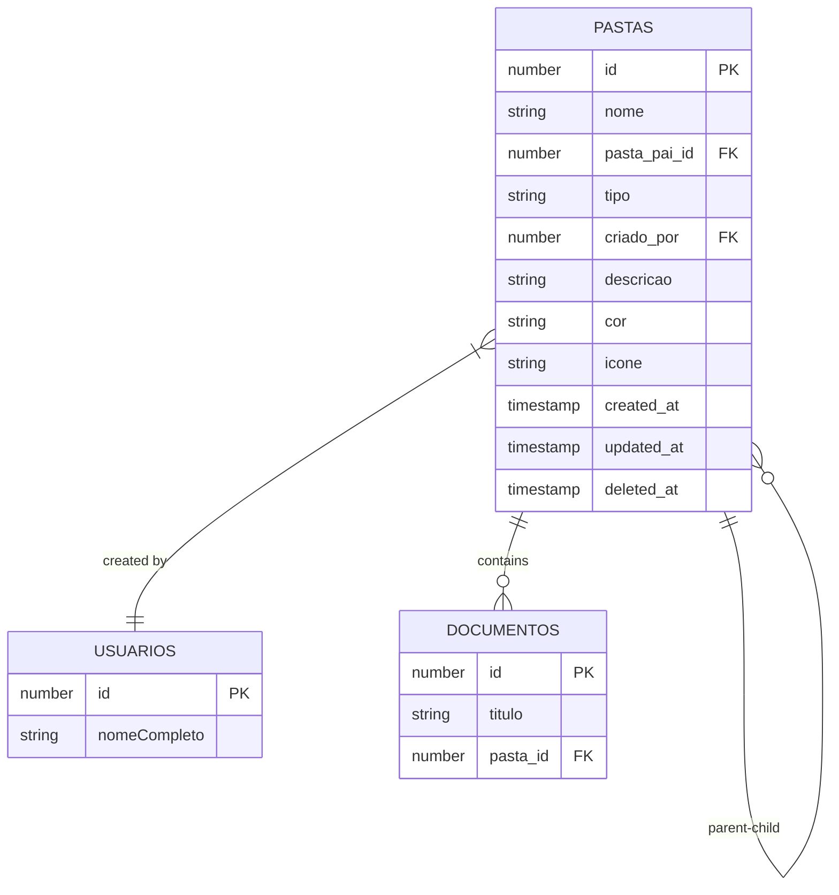
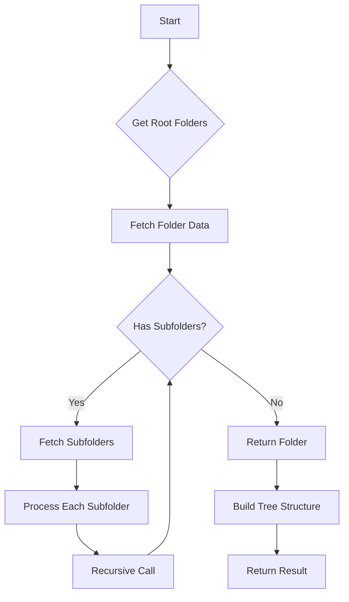
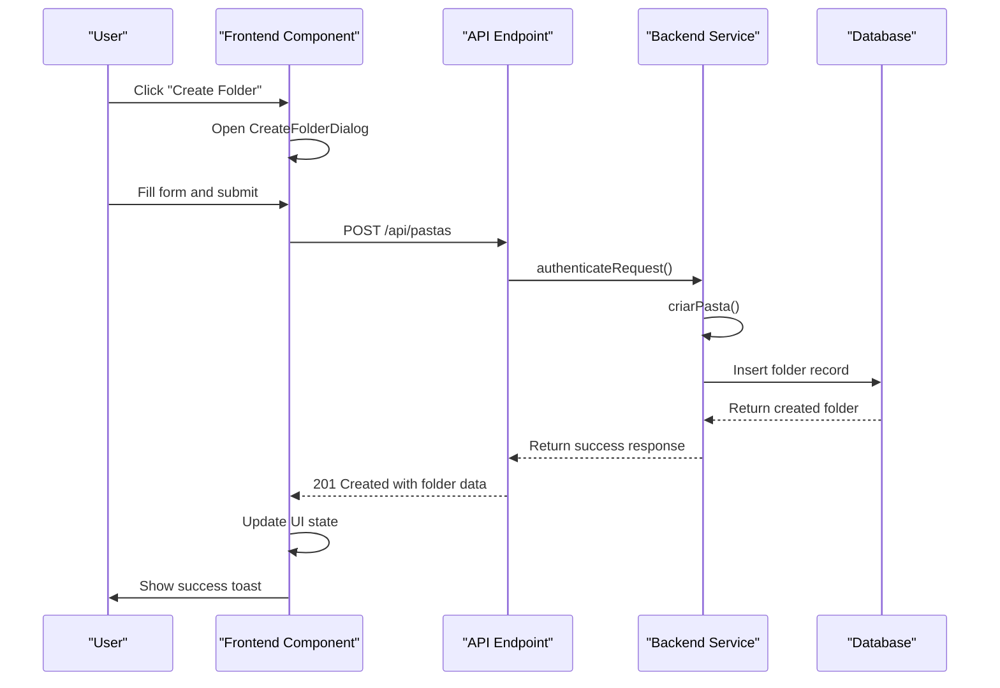
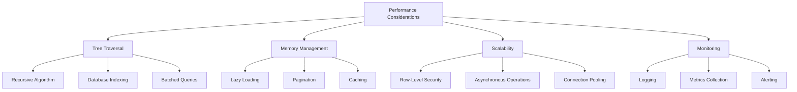
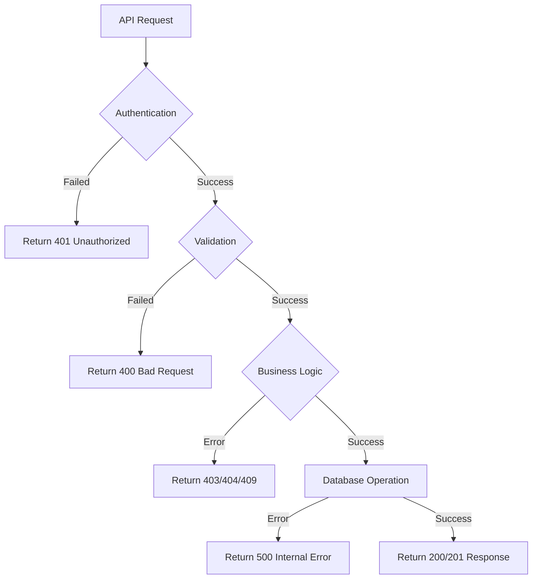

# Folder Organization

<cite>
**Referenced Files in This Document**   
- [route.ts](file://app/api/pastas/route.ts)
- [criar-pasta.service.ts](file://backend/documentos/services/pastas/criar-pasta.service.ts)
- [deletar-pasta.service.ts](file://backend/documentos/services/pastas/deletar-pasta.service.ts)
- [listar-pastas.service.ts](file://backend/documentos/services/pastas/listar-pastas.service.ts)
- [mover-documento.service.ts](file://backend/documentos/services/pastas/mover-documento.service.ts)
- [pastas-persistence.service.ts](file://backend/documentos/services/persistence/pastas-persistence.service.ts)
- [types.ts](file://backend/types/documentos/types.ts)
- [folder-tree.tsx](file://components/documentos/folder-tree.tsx)
- [create-folder-dialog.tsx](file://components/documentos/create-folder-dialog.tsx)
</cite>

## Table of Contents
1. [Introduction](#introduction)
2. [API Endpoints](#api-endpoints)
3. [Data Model](#data-model)
4. [Folder Hierarchy and Path Resolution](#folder-hierarchy-and-path-resolution)
5. [Frontend Integration](#frontend-integration)
6. [Usage Examples](#usage-examples)
7. [Performance Considerations](#performance-considerations)
8. [Error Handling](#error-handling)

## Introduction

The Sinesys system provides a comprehensive folder organization API that enables users to manage document folders in a hierarchical structure. The `/api/documentos/pastas/` endpoints allow for creating, updating, deleting, and organizing folders, with support for nested folder structures and efficient tree traversal. This documentation details the API functionality, data model, authentication mechanisms, and integration with the frontend file explorer.

The folder system supports two types of folders: "comum" (common) folders that are visible to all users, and "privada" (private) folders that are only accessible to their creator. Each folder can contain documents and subfolders, forming a tree structure that helps users organize their documents effectively.

**Section sources**
- [route.ts](file://app/api/pastas/route.ts#L1-L124)

## API Endpoints

The folder organization API provides RESTful endpoints for managing folders. All endpoints require authentication via the `authenticateRequest` function, which validates the user's session and permissions.

### GET /api/pastas

Retrieves a list of folders based on the specified mode and parameters.

**Query Parameters:**
- `modo` (string, optional): Determines the response format. Can be "lista" (default) for a flat list or "hierarquia" for a hierarchical tree structure.
- `pasta_pai_id` (number, optional): Filters folders by parent folder ID. Use "null" to retrieve root folders.
- `incluir_documentos` (boolean, optional): When set to true and modo is "hierarquia", includes documents in the response.

**Response:**
```json
{
  "success": true,
  "data": [
    {
      "id": 1,
      "nome": "Processos",
      "pasta_pai_id": null,
      "tipo": "comum",
      "criado_por": 123,
      "descricao": "Main processes folder",
      "cor": "#3b82f6",
      "icone": "folder",
      "created_at": "2025-01-15T10:30:00.000Z",
      "updated_at": "2025-01-15T10:30:00.000Z",
      "deleted_at": null,
      "total_documentos": 5,
      "total_subpastas": 2,
      "criador": {
        "id": 123,
        "nomeCompleto": "John Doe"
      }
    }
  ]
}
```

### POST /api/pastas

Creates a new folder.

**Request Body:**
```json
{
  "nome": "New Folder",
  "pasta_pai_id": 1,
  "tipo": "comum",
  "descricao": "Folder description",
  "cor": "#3b82f6",
  "icone": "folder"
}
```

**Validation Rules:**
- `nome` is required and must be 1-200 characters long
- `tipo` must be either "comum" or "privada"
- `cor` must be a valid hexadecimal color code (#RRGGBB)

**Response:**
Returns the created folder with status 201 (Created).

### PUT /api/pastas/[id]

Updates an existing folder.

**Request Body:**
```json
{
  "nome": "Updated Folder Name",
  "pasta_pai_id": 2,
  "descricao": "Updated description",
  "cor": "#ef4444",
  "icone": "folder-open"
}
```

**Response:**
Returns the updated folder.

### DELETE /api/pastas/[id]

Soft deletes a folder (moves to trash).

**Query Parameters:**
- `acaoDocumentosOrfaos` (string, optional): Specifies what to do with documents in the folder. Options are:
  - `mover_raiz`: Move documents to root (default)
  - `deletar`: Delete documents along with the folder
  - `erro`: Return an error if the folder contains documents

**Response:**
```json
{
  "success": true,
  "data": {
    "pasta": {
      "id": 1,
      "nome": "Deleted Folder",
      "deleted_at": "2025-01-15T11:00:00.000Z"
    },
    "documentosMovidos": 3,
    "documentosDeletados": 0,
    "subpastasDeletadas": 2
  }
}
```

### POST /api/pastas/mover-documento

Moves a document to a different folder.

**Request Body:**
```json
{
  "documentoId": 123,
  "novaPastaId": 1
}
```

**Response:**
Returns the updated document.

**Section sources**
- [route.ts](file://app/api/pastas/route.ts#L1-L124)
- [criar-pasta.service.ts](file://backend/documentos/services/pastas/criar-pasta.service.ts#L1-L78)
- [deletar-pasta.service.ts](file://backend/documentos/services/pastas/deletar-pasta.service.ts#L1-L137)
- [mover-documento.service.ts](file://backend/documentos/services/pastas/mover-documento.service.ts#L1-L94)

## Data Model

The folder system is built around a relational data model that supports hierarchical organization and efficient querying.

### Pasta (Folder) Entity

The `Pasta` interface defines the structure of a folder in the system:

```typescript
interface Pasta {
  id: number;
  nome: string;
  pasta_pai_id: number | null;
  tipo: 'comum' | 'privada';
  criado_por: number;
  descricao: string | null;
  cor: string | null;
  icone: string | null;
  created_at: string;
  updated_at: string;
  deleted_at: string | null;
}
```

### Extended Folder Types

The system provides several extended types for different use cases:

**PastaComContadores**: Includes document and subfolder counts
```typescript
interface PastaComContadores extends Pasta {
  total_documentos: number;
  total_subpastas: number;
  criador: {
    id: number;
    nomeCompleto: string;
  };
}
```

**PastaHierarquia**: Represents a folder with its nested structure
```typescript
interface PastaHierarquia extends Pasta {
  subpastas: PastaHierarquia[];
  documentos?: Documento[];
}
```

### Database Schema

The folder table in the database includes the following columns:
- `id`: Primary key (auto-incrementing integer)
- `nome`: Folder name (text, not null)
- `pasta_pai_id`: Foreign key to parent folder (integer, nullable)
- `tipo`: Folder type (enum: 'comum', 'privada')
- `criado_por`: Foreign key to user who created the folder
- `descricao`: Optional description (text)
- `cor`: Optional color for visual identification (text)
- `icone`: Optional icon identifier (text)
- `created_at`: Creation timestamp
- `updated_at`: Last update timestamp
- `deleted_at`: Soft delete timestamp (nullable)

The table includes foreign key constraints and row-level security policies to ensure data integrity and proper access control.



**Diagram sources**
- [types.ts](file://backend/types/documentos/types.ts#L93-L105)
- [pastas-persistence.service.ts](file://backend/documentos/services/persistence/pastas-persistence.service.ts#L19-L38)

## Folder Hierarchy and Path Resolution

The folder system implements a hierarchical tree structure that allows for nested organization of documents. This section details the implementation of the folder hierarchy, path resolution, and tree traversal algorithms.

### Hierarchical Structure

Folders are organized in a parent-child relationship where each folder can have zero or more subfolders. The root level consists of folders with `pasta_pai_id` set to null. This creates a forest structure where multiple root folders can exist.

The system prevents circular references through validation in the `criarPasta` service, which checks that a folder cannot be its own ancestor. This ensures the integrity of the tree structure.

### Tree Traversal Algorithms

The system implements efficient tree traversal algorithms for retrieving folder hierarchies:

**Hierarchical Retrieval Algorithm:**
1. Fetch root folders (where `pasta_pai_id` is null)
2. For each root folder, recursively fetch its children
3. Build the tree structure in memory
4. Include documents if requested

The `buscarHierarquiaPastas` function in the persistence layer implements this algorithm using a recursive approach with Promise.all() for parallel processing of sibling nodes.



**Diagram sources**
- [pastas-persistence.service.ts](file://backend/documentos/services/persistence/pastas-persistence.service.ts#L149-L224)
- [listar-pastas.service.ts](file://backend/documentos/services/pastas/listar-pastas.service.ts#L48-L54)

### Path Resolution and Breadcrumbs

The system provides functionality to resolve the full path of a folder and generate breadcrumbs for navigation.

The `buscarCaminhoPasta` function implements path resolution by:
1. Starting from the target folder
2. Iteratively querying the parent folder
3. Building the path array from root to target
4. Returning the complete breadcrumb trail

This algorithm has O(d) time complexity where d is the depth of the folder in the hierarchy.

### Performance Optimizations

To optimize performance for deep folder hierarchies, the system implements several strategies:

1. **Lazy Loading**: The frontend only loads the visible portion of the tree, expanding nodes on demand.
2. **Caching**: Frequently accessed folder structures are cached to reduce database queries.
3. **Batch Operations**: Multiple related queries are executed in parallel when possible.
4. **Indexing**: Database indexes on `pasta_pai_id` and `criado_por` columns ensure fast lookups.

The system also includes a flattened list mode (`modo=lista`) for scenarios where the hierarchical structure is not needed, reducing the computational overhead of tree construction.

**Section sources**
- [pastas-persistence.service.ts](file://backend/documentos/services/persistence/pastas-persistence.service.ts#L149-L224)
- [listar-pastas.service.ts](file://backend/documentos/services/pastas/listar-pastas.service.ts#L59-L82)

## Frontend Integration

The folder API is tightly integrated with the frontend file explorer component, providing a seamless user experience for document organization.

### Folder Tree Component

The `FolderTree` component renders the hierarchical folder structure and handles user interactions:

```tsx
function FolderTree({ onFolderSelect, selectedFolderId }: FolderTreeProps) {
  const [pastas, setPastas] = useState<PastaHierarquia[]>([]);
  const [expandedIds, setExpandedIds] = useState<Set<number>>(new Set());
  
  useEffect(() => {
    async function fetchPastas() {
      const response = await fetch('/api/pastas?modo=hierarquia');
      const data = await response.json();
      if (data.success) {
        setPastas(data.data);
      }
    }
    fetchPastas();
  }, []);
  
  // Rendering logic for folder tree
}
```

Key features of the component:
- Visualizes the folder hierarchy with expandable nodes
- Shows document and subfolder counts
- Provides visual feedback for the selected folder
- Supports lazy loading of subfolders
- Handles folder selection events

### Create Folder Dialog

The `CreateFolderDialog` component provides a user-friendly interface for creating new folders:

```tsx
function CreateFolderDialog({
  open,
  onOpenChange,
  pastaPaiId,
  onSuccess,
}: CreateFolderDialogProps) {
  const handleSubmit = async (e: React.FormEvent) => {
    e.preventDefault();
    const response = await fetch('/api/pastas', {
      method: 'POST',
      headers: { 'Content-Type': 'application/json' },
      body: JSON.stringify({
        nome: nome.trim(),
        descricao: descricao.trim() || null,
        tipo,
        pasta_pai_id: pastaPaiId,
      }),
    });
    // Handle response and update UI
  };
  
  // Render form with validation
}
```

The dialog includes:
- Form validation for required fields
- Real-time feedback on input
- Loading states during API calls
- Success/error notifications
- Type selection with explanatory text

### Event Flow

The integration between the frontend and backend follows this sequence:



**Diagram sources**
- [folder-tree.tsx](file://components/documentos/folder-tree.tsx#L1-L134)
- [create-folder-dialog.tsx](file://components/documentos/create-folder-dialog.tsx#L1-L173)

## Usage Examples

This section provides practical examples of using the folder organization API for common scenarios.

### Creating a Folder Structure

To create a hierarchical folder structure for organizing legal documents:

```javascript
// Create root folder
const response1 = await fetch('/api/pastas', {
  method: 'POST',
  headers: { 'Content-Type': 'application/json' },
  body: JSON.stringify({
    nome: 'Processos Jurídicos',
    tipo: 'comum',
    descricao: 'Todos os processos jurídicos da empresa'
  })
});

const rootFolder = await response1.json();

// Create subfolder for civil cases
const response2 = await fetch('/api/pastas', {
  method: 'POST',
  headers: { 'Content-Type': 'application/json' },
  body: JSON.stringify({
    nome: 'Cíveis',
    tipo: 'comum',
    pasta_pai_id: rootFolder.data.id,
    cor: '#3b82f6'
  })
});

// Create subfolder for criminal cases
const response3 = await fetch('/api/pastas', {
  method: 'POST',
  headers: { 'Content-Type': 'application/json' },
  body: JSON.stringify({
    nome: 'Crimes',
    tipo: 'comum',
    pasta_pai_id: rootFolder.data.id,
    cor: '#ef4444'
  })
});
```

### Moving Documents Between Folders

To reorganize documents by moving them between folders:

```javascript
// Move a single document
const moveResponse = await fetch('/api/pastas/mover-documento', {
  method: 'POST',
  headers: { 'Content-Type': 'application/json' },
  body: JSON.stringify({
    documentoId: 123,
    novaPastaId: 456
  })
});

// Move multiple documents
const documentosParaMover = [123, 124, 125];
const resultados = [];

for (const docId of documentosParaMover) {
  try {
    const response = await fetch('/api/pastas/mover-documento', {
      method: 'POST',
      headers: { 'Content-Type': 'application/json' },
      body: JSON.stringify({
        documentoId: docId,
        novaPastaId: 456
      })
    });
    const data = await response.json();
    resultados.push(data);
  } catch (error) {
    console.error(`Erro ao mover documento ${docId}:`, error);
  }
}
```

### Retrieving Folder Contents with Filtering

To retrieve folder contents with specific filtering options:

```javascript
// Get hierarchical view of all folders with documents
const response1 = await fetch('/api/pastas?modo=hierarquia&incluir_documentos=true');

// Get flat list of subfolders for a specific parent
const response2 = await fetch('/api/pastas?modo=lista&pasta_pai_id=123');

// Get root folders only
const response3 = await fetch('/api/pastas?modo=lista&pasta_pai_id=null');
```

### Organizing Documents in a Hierarchical Structure

A complete example of organizing documents in a law firm:

```javascript
// 1. Create main department folders
const [civilFolder, criminalFolder, corporateFolder] = await Promise.all([
  createFolder('Direito Civil', 'comum'),
  createFolder('Direito Criminal', 'comum'),
  createFolder('Direito Empresarial', 'comum')
]);

// 2. Create case-specific subfolders
const [familyLawFolder] = await Promise.all([
  createFolder('Direito de Família', 'comum', civilFolder.id),
  createFolder('Direitos Reais', 'comum', civilFolder.id),
  createFolder('Execuções', 'comum', civilFolder.id)
]);

// 3. Move relevant documents to appropriate folders
await Promise.all([
  moveDocument(1001, familyLawFolder.id),
  moveDocument(1002, familyLawFolder.id),
  moveDocument(1003, familyLawFolder.id)
]);

// 4. Retrieve the complete structure for display
const hierarchyResponse = await fetch('/api/pastas?modo=hierarquia&incluir_documentos=true');
const folderStructure = await hierarchyResponse.json();
```

**Section sources**
- [route.ts](file://app/api/pastas/route.ts#L1-L124)
- [mover-documento.service.ts](file://backend/documentos/services/pastas/mover-documento.service.ts#L23-L94)

## Performance Considerations

The folder organization system is designed to handle deep folder hierarchies and large numbers of documents efficiently. This section outlines the performance characteristics and optimization strategies.

### Tree Traversal Efficiency

For deep folder hierarchies, the system implements several optimizations:

1. **Recursive Algorithm with Promise.all()**: The `buscarHierarquiaPastas` function uses a recursive approach that processes sibling nodes in parallel, reducing the overall execution time.

2. **Database Indexing**: The database includes indexes on critical columns:
   - `pasta_pai_id` for fast child folder lookups
   - `criado_por` for user-specific queries
   - `tipo` for filtering by folder type
   - `deleted_at` for soft delete filtering

3. **Batched Queries**: When retrieving a folder hierarchy, the system minimizes the number of database round trips by fetching all necessary data in a structured manner.

### Memory Management

To prevent memory issues with large folder structures:

1. **Lazy Loading**: The frontend only loads the visible portion of the tree, expanding nodes on demand rather than loading the entire hierarchy at once.

2. **Pagination**: For flat list views, the system supports pagination to limit the number of items returned in a single request.

3. **Caching Strategy**: Frequently accessed folder structures are cached at multiple levels:
   - Client-side caching in the browser
   - Server-side caching in Redis
   - Database query result caching

### Scalability Features

The system includes several features to ensure scalability:

1. **Row-Level Security**: Database policies ensure that users only access folders they have permission to view, reducing the data set that needs to be processed.

2. **Asynchronous Operations**: Long-running operations like bulk document moves are processed asynchronously to prevent request timeouts.

3. **Connection Pooling**: Database connections are pooled to reduce the overhead of establishing new connections for each request.

### Performance Monitoring

The system includes performance monitoring through:

1. **Logging**: All folder operations are logged with timing information for analysis.

2. **Metrics Collection**: Key performance metrics are collected, including:
   - API response times
   - Database query durations
   - Memory usage patterns
   - Error rates

3. **Alerting**: Performance thresholds trigger alerts when exceeded, allowing for proactive optimization.



**Diagram sources**
- [pastas-persistence.service.ts](file://backend/documentos/services/persistence/pastas-persistence.service.ts#L149-L224)
- [listar-pastas.service.ts](file://backend/documentos/services/pastas/listar-pastas.service.ts#L22-L34)

## Error Handling

The folder organization API implements comprehensive error handling to provide meaningful feedback to users and maintain system stability.

### Validation Errors

The system performs validation at multiple levels:

**Client-Side Validation:**
- Required fields (name cannot be empty)
- Length constraints (name ≤ 200 characters)
- Format validation (color must be valid hex code)
- Type validation (tipo must be 'comum' or 'privada')

**Server-Side Validation:**
- Authentication and authorization
- Business logic validation (no circular references)
- Database constraint validation

### Error Response Structure

All API endpoints return standardized error responses:

```json
{
  "success": false,
  "error": "Descriptive error message"
}
```

Common error messages include:
- "Nome é obrigatório" - Folder name is required
- "Nome muito longo (máximo 200 caracteres)" - Name exceeds length limit
- "Tipo inválido (comum ou privada)" - Invalid folder type
- "Pasta pai não encontrada" - Parent folder does not exist
- "Apenas o criador pode deletar a pasta" - Only creator can delete
- "Você não tem acesso a este documento" - No access to document

### Specific Error Scenarios

**Circular Reference Prevention:**
When attempting to create a circular reference (making a folder a child of its descendant), the system returns an error to maintain tree integrity.

**Permission Errors:**
Users can only modify folders they have access to:
- Common folders: All users can view
- Private folders: Only the creator can view and modify

**Deletion Constraints:**
When deleting a folder with documents, the system provides options:
- Move documents to root
- Delete documents with the folder
- Return an error to prevent accidental data loss

### Error Handling Flow



The system logs all errors for debugging and monitoring purposes while returning user-friendly messages to the client.

**Section sources**
- [route.ts](file://app/api/pastas/route.ts#L60-L68)
- [criar-pasta.service.ts](file://backend/documentos/services/pastas/criar-pasta.service.ts#L16-L35)
- [deletar-pasta.service.ts](file://backend/documentos/services/pastas/deletar-pasta.service.ts#L49-L63)