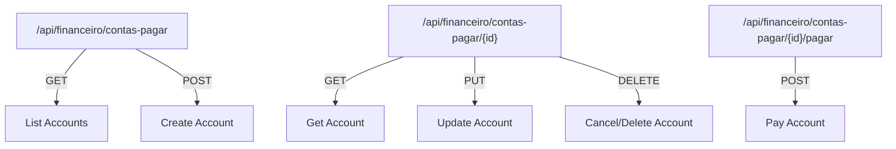
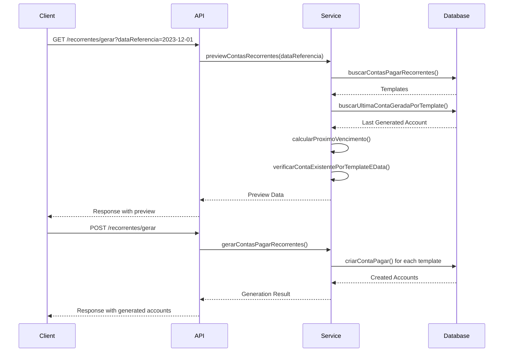
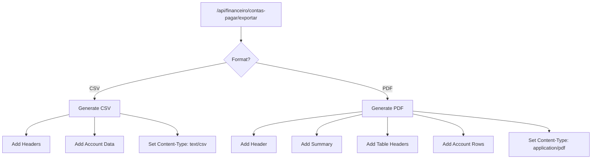
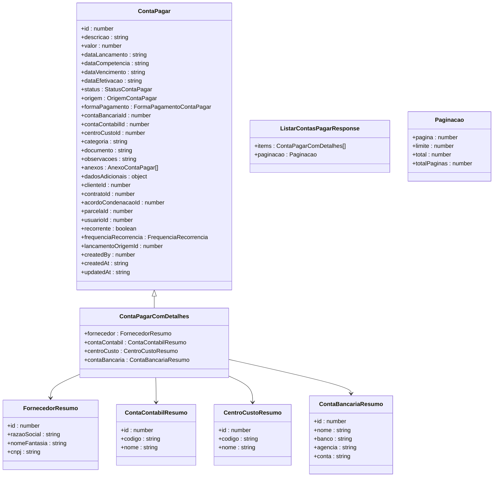
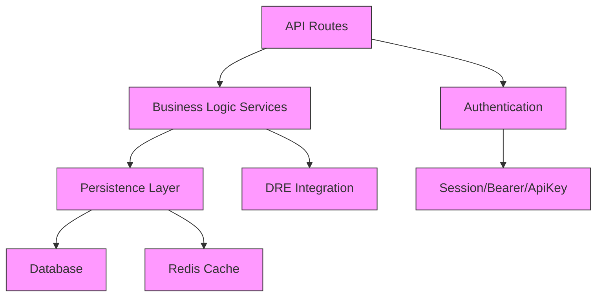

# Accounts Payable

<cite>
**Referenced Files in This Document**   
- [route.ts](file://app/api/financeiro/contas-pagar/route.ts)
- [route.ts](file://app/api/financeiro/contas-pagar/[id]/route.ts)
- [route.ts](file://app/api/financeiro/contas-pagar/[id]/pagar/route.ts)
- [route.ts](file://app/api/financeiro/contas-pagar/exportar/route.ts)
- [route.ts](file://app/api/financeiro/contas-pagar/recorrentes/gerar/route.ts)
- [pagar-conta.service.ts](file://backend/financeiro/contas-pagar/services/contas-pagar/pagar-conta.service.ts)
- [gerar-recorrentes.service.ts](file://backend/financeiro/contas-pagar/services/contas-pagar/gerar-recorrentes.service.ts)
- [cancelar-conta.service.ts](file://backend/financeiro/contas-pagar/services/contas-pagar/cancelar-conta.service.ts)
- [contas-pagar-persistence.service.ts](file://backend/financeiro/contas-pagar/services/persistence/contas-pagar-persistence.service.ts)
- [contas-pagar.types.ts](file://backend/types/financeiro/contas-pagar.types.ts)
</cite>

## Table of Contents
1. [Introduction](#introduction)
2. [Core Endpoints](#core-endpoints)
3. [Recurring Payments](#recurring-payments)
4. [Data Export](#data-export)
5. [Request Parameters](#request-parameters)
6. [Response Schemas](#response-schemas)
7. [Authentication](#authentication)
8. [Implementation Details](#implementation-details)
9. [Common Issues](#common-issues)
10. [Usage Examples](#usage-examples)

## Introduction
The Accounts Payable API in the Sinesys system provides comprehensive functionality for managing payable accounts within a legal practice. This API enables CRUD operations for payable accounts, generation of recurring payments, and data export capabilities. The system is designed to handle vendor information, payment terms, due dates, tax calculations, and integration with vendor management systems. The API supports payment scheduling, late fee calculations, and provides audit trails for all transactions. This documentation covers the endpoints, request/response schemas, authentication methods, and implementation details for the accounts payable functionality.

**Section sources**
- [route.ts](file://app/api/financeiro/contas-pagar/route.ts)
- [contas-pagar.types.ts](file://backend/types/financeiro/contas-pagar.types.ts)

## Core Endpoints
The core endpoints for accounts payable management provide comprehensive CRUD operations for payable accounts. The primary endpoint `/api/financeiro/contas-pagar` supports GET and POST methods for retrieving and creating payable accounts. The individual account endpoint `/api/financeiro/contas-pagar/{id}` supports GET, PUT, and DELETE methods for retrieving, updating, and canceling/deleting specific accounts. The payment endpoint `/api/financeiro/contas-pagar/{id}/pagar` handles the payment processing for payable accounts.

**Diagram sources**
- [route.ts](file://app/api/financeiro/contas-pagar/route.ts)
- [route.ts](file://app/api/financeiro/contas-pagar/[id]/route.ts)
- [route.ts](file://app/api/financeiro/contas-pagar/[id]/pagar/route.ts)

**Section sources**
- [route.ts](file://app/api/financeiro/contas-pagar/route.ts)
- [route.ts](file://app/api/financeiro/contas-pagar/[id]/route.ts)
- [route.ts](file://app/api/financeiro/contas-pagar/[id]/pagar/route.ts)

## Recurring Payments
The recurring payments functionality is accessed through the `/api/financeiro/contas-pagar/recorrentes/gerar` endpoint. This endpoint supports both GET and POST methods. The GET method provides a preview of the accounts that will be generated without actually creating them, while the POST method generates the actual recurring payments. The system supports various recurrence frequencies including monthly, quarterly, semi-annual, and annual. The generation process includes validation to prevent duplicate transactions and ensures that only active templates are processed.

**Diagram sources**
- [route.ts](file://app/api/financeiro/contas-pagar/recorrentes/gerar/route.ts)
- [gerar-recorrentes.service.ts](file://backend/financeiro/contas-pagar/services/contas-pagar/gerar-recorrentes.service.ts)
- [contas-pagar-persistence.service.ts](file://backend/financeiro/contas-pagar/services/persistence/contas-pagar-persistence.service.ts)

**Section sources**
- [route.ts](file://app/api/financeiro/contas-pagar/recorrentes/gerar/route.ts)
- [gerar-recorrentes.service.ts](file://backend/financeiro/contas-pagar/services/contas-pagar/gerar-recorrentes.service.ts)

## Data Export
The data export functionality is available at the `/api/financeiro/contas-pagar/exportar` endpoint. This endpoint supports CSV and PDF export formats for accounts payable data. The exported data includes account details such as description, vendor information, due dates, values, and status. The system also includes a summary of upcoming payments and overdue accounts in the PDF export. The export process includes filtering capabilities based on status, date ranges, and vendor IDs, allowing users to generate targeted reports for specific accounting periods or vendors.

**Diagram sources**
- [route.ts](file://app/api/financeiro/contas-pagar/exportar/route.ts)

**Section sources**
- [route.ts](file://app/api/financeiro/contas-pagar/exportar/route.ts)

## Request Parameters
The accounts payable endpoints accept various request parameters for filtering, sorting, and pagination. For the GET method on the main endpoint, parameters include pagination (pagina, limite), search (busca), status filtering, date ranges for due dates and accounting periods, vendor ID, account ID, cost center ID, bank account ID, category, origin, recurrence status, and sorting options. The POST method for creating accounts requires fields such as description, value, due date, and accounting account ID, with optional fields for vendor, category, recurrence settings, and additional metadata.

**Section sources**
- [route.ts](file://app/api/financeiro/contas-pagar/route.ts)
- [contas-pagar.types.ts](file://backend/types/financeiro/contas-pagar.types.ts)

## Response Schemas
The response schemas for accounts payable endpoints follow a consistent structure with a success flag, data object, and optional error message. The data object for listing accounts includes the accounts array, pagination information, and optionally a summary of upcoming payments. Individual account responses include detailed information such as ID, description, value, dates, status, payment method, bank account, accounting account, cost center, category, document, observations, attachments, additional data, client/contract references, recurrence settings, and timestamps. The payment endpoint response includes details of the payment transaction.

**Diagram sources**
- [contas-pagar.types.ts](file://backend/types/financeiro/contas-pagar.types.ts)

**Section sources**
- [contas-pagar.types.ts](file://backend/types/financeiro/contas-pagar.types.ts)

## Authentication
The accounts payable endpoints require authentication using one of three methods: bearer token, session authentication, or service API key. The authentication is handled by the `authenticateRequest` function which validates the provided credentials. For export functionality, additional permission checks are performed using the `requirePermission` function to ensure the user has the necessary rights to export financial data. The system also tracks the user ID for audit purposes, recording who created or modified each account.

**Section sources**
- [route.ts](file://app/api/financeiro/contas-pagar/route.ts)
- [route.ts](file://app/api/financeiro/contas-pagar/[id]/route.ts)
- [route.ts](file://app/api/financeiro/contas-pagar/exportar/route.ts)

## Implementation Details
The accounts payable system is implemented with a service-oriented architecture, separating business logic from data persistence. The persistence layer handles database operations with caching using Redis to improve performance. The business logic layer implements validation rules, recurrence generation, and payment processing. The system includes validation to prevent invalid operations such as paying already paid accounts or modifying canceled accounts. For recurring payments, the system prevents duplicate generation by checking for existing accounts before creating new ones. The payment processing includes integration with the DRE (Demonstração do Resultado Econômico) system, invalidating cache when payments affect financial periods.

**Diagram sources**
- [pagar-conta.service.ts](file://backend/financeiro/contas-pagar/services/contas-pagar/pagar-conta.service.ts)
- [gerar-recorrentes.service.ts](file://backend/financeiro/contas-pagar/services/contas-pagar/gerar-recorrentes.service.ts)
- [cancelar-conta.service.ts](file://backend/financeiro/contas-pagar/services/contas-pagar/cancelar-conta.service.ts)
- [contas-pagar-persistence.service.ts](file://backend/financeiro/contas-pagar/services/persistence/contas-pagar-persistence.service.ts)

**Section sources**
- [pagar-conta.service.ts](file://backend/financeiro/contas-pagar/services/contas-pagar/pagar-conta.service.ts)
- [gerar-recorrentes.service.ts](file://backend/financeiro/contas-pagar/services/contas-pagar/gerar-recorrentes.service.ts)
- [cancelar-conta.service.ts](file://backend/financeiro/contas-pagar/services/contas-pagar/cancelar-conta.service.ts)
- [contas-pagar-persistence.service.ts](file://backend/financeiro/contas-pagar/services/persistence/contas-pagar-persistence.service.ts)

## Common Issues
Common issues in the accounts payable system include payment reconciliation challenges, duplicate transaction prevention, and handling partial payments. The system addresses duplicate transactions through validation in the recurrence generation process, checking for existing accounts before creating new ones. For payment reconciliation, the system maintains detailed audit trails and integrates with the DRE system to ensure financial accuracy. Partial payments are not directly supported in the current implementation, requiring the creation of separate accounts for partial payment scenarios. Other common issues include handling canceled accounts, managing vendor information consistency, and ensuring proper accounting period alignment.

**Section sources**
- [pagar-conta.service.ts](file://backend/financeiro/contas-pagar/services/contas-pagar/pagar-conta.service.ts)
- [gerar-recorrentes.service.ts](file://backend/financeiro/contas-pagar/services/contas-pagar/gerar-recorrentes.service.ts)
- [cancelar-conta.service.ts](file://backend/financeiro/contas-pagar/services/contas-pagar/cancelar-conta.service.ts)

## Usage Examples
The accounts payable API is used in various scenarios within the Sinesys system. The frontend processes bulk payment approvals by calling the payment endpoint for multiple accounts. The system automatically generates recurring payments on a scheduled basis, using the recurrence generation endpoint. Users export accounts payable data in CSV format for integration with external accounting systems. The API is also used to generate reports for financial analysis, including aging reports and cash flow projections. The system supports integration with vendor management by linking payable accounts to vendor records and maintaining consistent vendor information across transactions.

**Section sources**
- [page.tsx](file://app/(dashboard)/financeiro/contas-pagar/page.tsx)
- [pagar-conta-dialog.tsx](file://app/(dashboard)/financeiro/contas-pagar/components/pagar-conta-dialog.tsx)
- [contas-pagar-toolbar-filters.tsx](file://app/(dashboard)/financeiro/contas-pagar/components/contas-pagar-toolbar-filters.tsx)