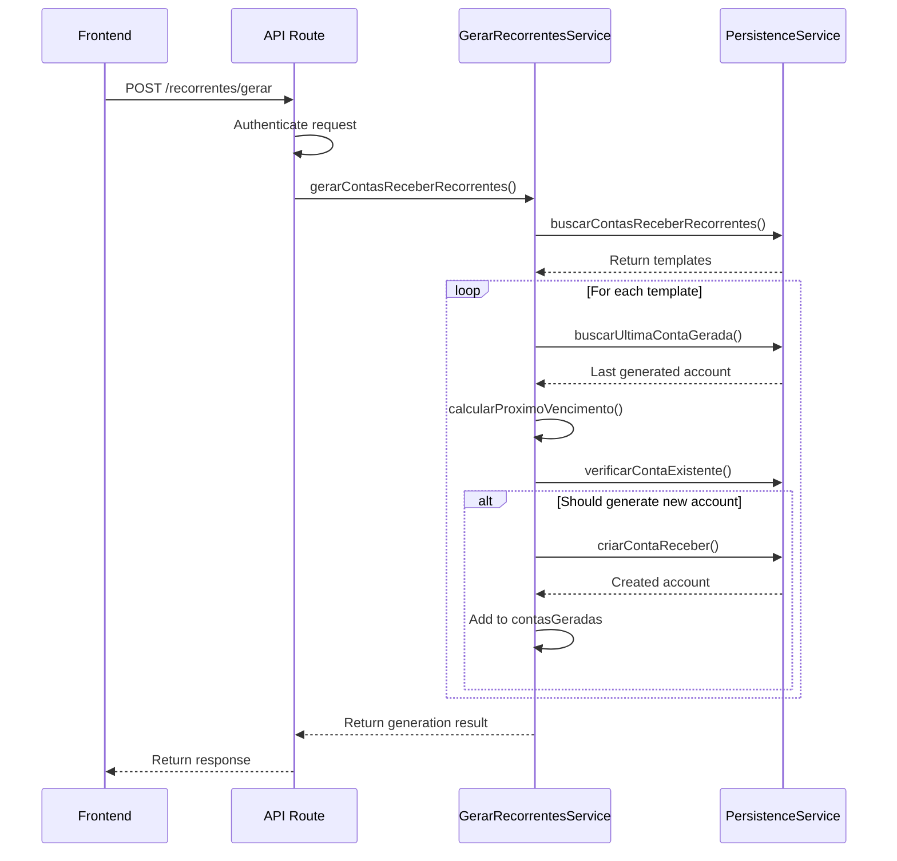
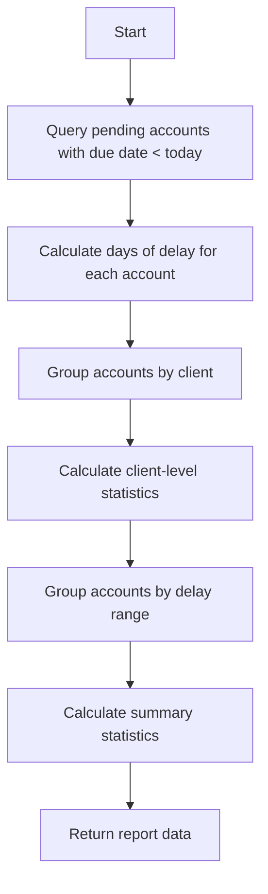
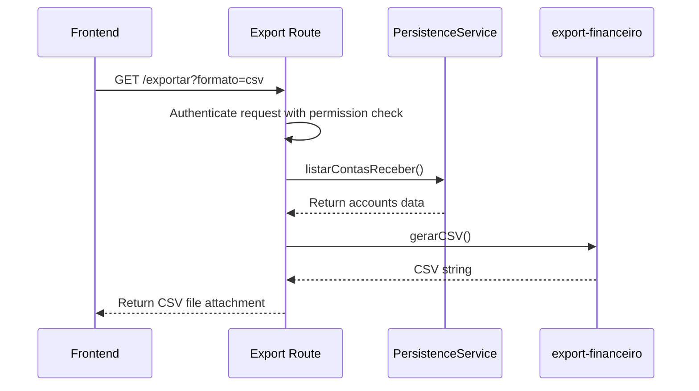
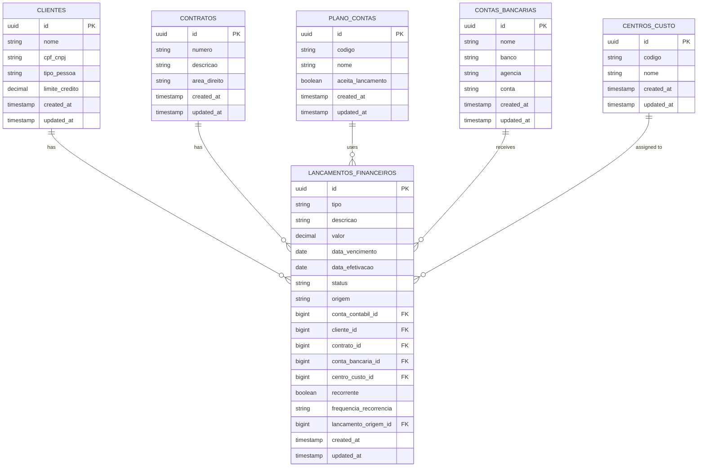

# Accounts Receivable

<cite>
**Referenced Files in This Document**   
- [route.ts](file://app/api/financeiro/contas-receber/route.ts)
- [gerar/route.ts](file://app/api/financeiro/contas-receber/recorrentes/gerar/route.ts)
- [inadimplencia/route.ts](file://app/api/financeiro/contas-receber/relatorios/inadimplencia/route.ts)
- [exportar/route.ts](file://app/api/financeiro/contas-receber/exportar/route.ts)
- [receber/route.ts](file://app/api/financeiro/contas-receber/[id]/receber/route.ts)
- [contas-receber-persistence.service.ts](file://backend/financeiro/contas-receber/services/persistence/contas-receber-persistence.service.ts)
- [gerar-recorrentes.service.ts](file://backend/financeiro/contas-receber/services/contas-receber/gerar-recorrentes.service.ts)
- [receber-conta.service.ts](file://backend/financeiro/contas-receber/services/contas-receber/receber-conta.service.ts)
- [inadimplencia.service.ts](file://backend/financeiro/contas-receber/services/relatorios/inadimplencia.service.ts)
- [contas-receber.types.ts](file://backend/types/financeiro/contas-receber.types.ts)
- [export-financeiro.ts](file://app/_lib/financeiro/export-financeiro.ts)
- [33_financeiro_functions.sql](file://supabase/schemas/33_financeiro_functions.sql)
</cite>

## Table of Contents
1. [Introduction](#introduction)
2. [Core Endpoints](#core-endpoints)
3. [Recurring Invoices Generation](#recurring-invoices-generation)
4. [Delinquency Reports](#delinquency-reports)
5. [Data Export](#data-export)
6. [Request and Response Schemas](#request-and-response-schemas)
7. [Authentication](#authentication)
8. [Implementation Details](#implementation-details)
9. [Common Issues and Solutions](#common-issues-and-solutions)
10. [Integration with Client Management](#integration-with-client-management)

## Introduction
The Accounts Receivable API in the Sinesys system provides a comprehensive set of endpoints for managing financial receivables. This API enables the creation, retrieval, updating, and deletion of receivable accounts, generation of recurring invoices, reporting on delinquency, and data export capabilities. The system is designed to handle complex financial workflows including payment reconciliation, partial payments, and credit notes. The API follows RESTful principles and uses standard HTTP methods and status codes. All endpoints require authentication and are secured with bearer tokens, session authentication, or service API keys.

**Section sources**
- [route.ts](file://app/api/financeiro/contas-receber/route.ts)

## Core Endpoints
The core endpoints for managing accounts receivable are located at `/api/financeiro/contas-receber`. These endpoints support CRUD operations for receivable accounts.

### GET /api/financeiro/contas-receber
Retrieves a paginated list of receivable accounts with optional filtering.

**Query Parameters:**
- `pagina` (integer, default: 1): Page number for pagination
- `limite` (integer, default: 50, max: 100): Number of records per page
- `busca` (string): Text search on description, document, or category
- `status` (string, enum: pendente, confirmado, cancelado, estornado): Filter by account status
- `dataVencimentoInicio` (string, format: date): Start date for due date filtering
- `dataVencimentoFim` (string, format: date): End date for due date filtering
- `clienteId` (integer): Filter by client ID
- `contratoId` (integer): Filter by contract ID
- `categoria` (string): Filter by category
- `incluirResumo` (boolean): Include delinquency summary in response

**Response Schema:**
```json
{
  "success": true,
  "data": {
    "items": [
      {
        "id": 123,
        "descricao": "Monthly legal services",
        "valor": 5000.00,
        "dataLancamento": "2025-01-01",
        "dataCompetencia": "2025-01-01",
        "dataVencimento": "2025-01-15",
        "dataEfetivacao": null,
        "status": "pendente",
        "origem": "contrato",
        "formaRecebimento": "pix",
        "contaBancariaId": 456,
        "contaContabilId": 789,
        "centroCustoId": 101,
        "categoria": "honorarios_contratuais",
        "documento": "INV-001",
        "observacoes": "Regular monthly billing",
        "anexos": [],
        "dadosAdicionais": {},
        "clienteId": 202,
        "contratoId": 303,
        "acordoCondenacaoId": null,
        "parcelaId": null,
        "usuarioId": 404,
        "recorrente": true,
        "frequenciaRecorrencia": "mensal",
        "lancamentoOrigemId": null,
        "createdBy": 404,
        "createdAt": "2025-01-01T10:00:00Z",
        "updatedAt": "2025-01-01T10:00:00Z",
        "cliente": {
          "id": 202,
          "nome": "John Doe",
          "razaoSocial": null,
          "nomeFantasia": null,
          "cpfCnpj": "123.456.789-00",
          "cnpj": null,
          "tipoPessoa": "fisica"
        },
        "contrato": {
          "id": 303,
          "numero": "CTR-001",
          "descricao": "Legal services agreement",
          "areaDireito": "civil",
          "tipoContrato": "prestacao_servicos"
        },
        "contaContabil": {
          "id": 789,
          "codigo": "1.1.1.01",
          "nome": "Serviços Profissionais"
        },
        "centroCusto": {
          "id": 101,
          "codigo": "CC001",
          "nome": "Consultoria"
        },
        "contaBancaria": {
          "id": 456,
          "nome": "Banco do Brasil",
          "banco": "Banco do Brasil",
          "agencia": "1234",
          "conta": "56789-0"
        }
      }
    ],
    "paginacao": {
      "pagina": 1,
      "limite": 50,
      "total": 100,
      "totalPaginas": 2
    },
    "resumoInadimplencia": {
      "vencidas": {
        "quantidade": 5,
        "valorTotal": 25000.00,
        "itens": []
      },
      "vencendoHoje": {
        "quantidade": 3,
        "valorTotal": 15000.00,
        "itens": []
      },
      "vencendoEm7Dias": {
        "quantidade": 8,
        "valorTotal": 40000.00,
        "itens": []
      },
      "vencendoEm30Dias": {
        "quantidade": 15,
        "valorTotal": 75000.00,
        "itens": []
      }
    }
  }
}
```

**Status Codes:**
- 200: Successful retrieval
- 401: Unauthorized
- 500: Internal server error

### POST /api/financeiro/contas-receber
Creates a new receivable account.

**Request Body:**
```json
{
  "descricao": "Initial payment for legal services",
  "valor": 10000.00,
  "dataVencimento": "2025-02-01",
  "contaContabilId": 789,
  "clienteId": 202,
  "contratoId": 303,
  "categoria": "honorarios_contratuais",
  "recorrente": false,
  "frequenciaRecorrencia": "mensal"
}
```

**Required Fields:**
- `descricao`: Description of the receivable (string)
- `valor`: Amount (number > 0)
- `dataVencimento`: Due date (string, format: date)
- `contaContabilId`: Accounting account ID (integer)

**Response Schema:**
Returns the created account with status 201 (Created).

**Status Codes:**
- 201: Account created successfully
- 400: Invalid data
- 401: Unauthorized
- 500: Internal server error

### PUT /api/financeiro/contas-receber/{id}
Updates an existing receivable account.

**Path Parameter:**
- `id`: Account ID (integer)

**Request Body:**
```json
{
  "descricao": "Updated description",
  "valor": 12000.00,
  "dataVencimento": "2025-02-15"
}
```

**Status Codes:**
- 200: Account updated successfully
- 400: Invalid data
- 401: Unauthorized
- 404: Account not found
- 500: Internal server error

### DELETE /api/financeiro/contas-receber/{id}
Deletes a receivable account (only if status is 'pendente').

**Path Parameter:**
- `id`: Account ID (integer)

**Status Codes:**
- 204: Account deleted successfully
- 400: Cannot delete confirmed or canceled account
- 401: Unauthorized
- 404: Account not found
- 500: Internal server error

**Section sources**
- [route.ts](file://app/api/financeiro/contas-receber/route.ts)
- [contas-receber-persistence.service.ts](file://backend/financeiro/contas-receber/services/persistence/contas-receber-persistence.service.ts)
- [contas-receber.types.ts](file://backend/types/financeiro/contas-receber.types.ts)

## Recurring Invoices Generation
The system provides functionality to generate recurring invoices based on templates. This is particularly useful for monthly billing cycles and subscription-based services.

### POST /api/financeiro/contas-receber/recorrentes/gerar
Generates receivable accounts from recurring templates.

**Query Parameters:**
- `preview` (boolean, default: false): If true, returns a preview of accounts that would be generated without creating them

**Request Body:**
None required

**Response Schema (Preview):**
```json
{
  "success": true,
  "data": {
    "preview": true,
    "templates": 5,
    "contasAGerar": [
      {
        "templateId": 1,
        "descricao": "Monthly legal services",
        "valor": 5000.00,
        "proximoVencimento": "2025-02-01"
      }
    ],
    "totalAGerar": 10,
    "valorTotalAGerar": 50000.00
  }
}
```

**Response Schema (Generation):**
```json
{
  "success": true,
  "data": {
    "contasGeradas": [
      {
        "id": 124,
        "descricao": "Monthly legal services",
        "valor": 5000.00,
        "dataVencimento": "2025-02-01",
        "status": "pendente"
      }
    ],
    "total": 10,
    "erros": []
  },
  "message": "10 account(s) generated successfully"
}
```

**Status Codes:**
- 200: Accounts generated successfully
- 401: Unauthorized
- 500: Internal server error

### GET /api/financeiro/contas-receber/recorrentes/gerar
Returns a preview of accounts that would be generated (dry run).

**Response Schema:**
Same as POST preview response.

**Status Codes:**
- 200: Preview returned successfully
- 401: Unauthorized
- 500: Internal server error

**Implementation Details:**
The recurring invoice generation follows this process:
1. Retrieve all active recurring templates
2. For each template, find the last generated account
3. Calculate the next due date based on the recurrence frequency
4. If the next due date is within 30 days of the reference date, generate a new account
5. Prevent duplicates by checking if an account already exists for the template and due date

Supported recurrence frequencies include: weekly, biweekly, monthly, bimonthly, quarterly, semiannually, and annually.



**Diagram sources**
- [gerar/route.ts](file://app/api/financeiro/contas-receber/recorrentes/gerar/route.ts)
- [gerar-recorrentes.service.ts](file://backend/financeiro/contas-receber/services/contas-receber/gerar-recorrentes.service.ts)
- [contas-receber-persistence.service.ts](file://backend/financeiro/contas-receber/services/persistence/contas-receber-persistence.service.ts)

**Section sources**
- [gerar/route.ts](file://app/api/financeiro/contas-receber/recorrentes/gerar/route.ts)
- [gerar-recorrentes.service.ts](file://backend/financeiro/contas-receber/services/contas-receber/gerar-recorrentes.service.ts)

## Delinquency Reports
The system provides detailed reporting on delinquent accounts to help manage collections and cash flow.

### GET /api/financeiro/contas-receber/relatorios/inadimplencia
Generates a delinquency report for pending receivable accounts.

**Query Parameters:**
- `dataInicio` (string, format: date): Start date for filtering
- `dataFim` (string, format: date): End date for filtering

**Response Schema:**
```json
{
  "success": true,
  "data": {
    "resumo": {
      "totalContas": 20,
      "valorTotal": 100000.00,
      "diasMediaAtraso": 15.5,
      "clientesInadimplentes": 8
    },
    "clientesRanking": [
      {
        "clienteId": 202,
        "clienteNome": "John Doe",
        "quantidadeContas": 5,
        "valorTotal": 25000.00,
        "diasMediaAtraso": 20.2,
        "maiorAtraso": 45
      }
    ],
    "faixasAtraso": [
      {
        "faixa": "1-7 dias",
        "quantidadeContas": 3,
        "valorTotal": 15000.00,
        "percentualTotal": 15.0
      },
      {
        "faixa": "8-15 dias",
        "quantidadeContas": 5,
        "valorTotal": 25000.00,
        "percentualTotal": 25.0
      },
      {
        "faixa": "16-30 dias",
        "quantidadeContas": 7,
        "valorTotal": 35000.00,
        "percentualTotal": 35.0
      },
      {
        "faixa": "Mais de 90 dias",
        "quantidadeContas": 2,
        "valorTotal": 10000.00,
        "percentualTotal": 10.0
      }
    ],
    "contasVencidas": [
      {
        "id": 123,
        "descricao": "Monthly legal services",
        "valor": 5000.00,
        "dataVencimento": "2025-01-15",
        "status": "pendente",
        "cliente": {
          "id": 202,
          "nome": "John Doe"
        }
      }
    ]
  }
}
```

**Status Codes:**
- 200: Report generated successfully
- 401: Unauthorized
- 500: Internal server error

**Implementation Details:**
The delinquency report is generated by:
1. Querying all pending receivable accounts with due dates before the current date
2. Calculating days of delay for each account
3. Grouping accounts by client to identify top delinquent clients
4. Categorizing accounts into delay ranges (1-7 days, 8-15 days, etc.)
5. Calculating summary statistics including total value, average delay, and number of delinquent clients



**Diagram sources**
- [inadimplencia/route.ts](file://app/api/financeiro/contas-receber/relatorios/inadimplencia/route.ts)
- [inadimplencia.service.ts](file://backend/financeiro/contas-receber/services/relatorios/inadimplencia.service.ts)

**Section sources**
- [inadimplencia/route.ts](file://app/api/financeiro/contas-receber/relatorios/inadimplencia/route.ts)
- [inadimplencia.service.ts](file://backend/financeiro/contas-receber/services/relatorios/inadimplencia.service.ts)

## Data Export
The system provides export capabilities for accounts receivable data in CSV format for integration with external accounting systems.

### GET /api/financeiro/contas-receber/exportar
Exports accounts receivable data in CSV or PDF format.

**Query Parameters:**
- `formato` (string, default: pdf, options: csv, pdf): Export format
- `status` (string): Filter by account status
- `dataInicio` (string, format: date): Start date for due date filtering
- `dataFim` (string, format: date): End date for due date filtering
- `clienteId` (integer): Filter by client ID

**Response:**
Returns a file attachment with the exported data.

For CSV format, the response includes:
- Content-Type: text/csv; charset=utf-8
- Content-Disposition: attachment; filename="contas_a_receber.csv"

For PDF format, the response includes:
- Content-Type: application/pdf
- Content-Disposition: attachment; filename="contas_a_receber.pdf"

**CSV Headers:**
- Descrição
- Cliente
- Vencimento
- Valor
- Status

**Implementation Details:**
The export functionality uses the `export-financeiro` library to generate formatted output. For CSV exports, the system uses UTF-8 encoding with BOM to ensure proper character display in spreadsheet applications. For PDF exports, the system generates a professional-looking document with company branding, summary of delinquency, and tabular data presentation.



**Diagram sources**
- [exportar/route.ts](file://app/api/financeiro/contas-receber/exportar/route.ts)
- [export-financeiro.ts](file://app/_lib/financeiro/export-financeiro.ts)

**Section sources**
- [exportar/route.ts](file://app/api/financeiro/contas-receber/exportar/route.ts)
- [export-financeiro.ts](file://app/_lib/financeiro/export-financeiro.ts)

## Request and Response Schemas
This section details the complete request and response schemas for all accounts receivable endpoints.

### Common Data Types
The following types are used across multiple endpoints:

**StatusContaReceber:**
- `pendente`: Account is pending payment
- `confirmado`: Account has been paid
- `cancelado`: Account has been canceled
- `estornado`: Account payment has been reversed

**OrigemContaReceber:**
- `manual`: Manually created account
- `acordo_judicial`: Created from a judicial agreement
- `contrato`: Created from a contract
- `importacao_bancaria`: Created from bank import
- `recorrente`: Created from a recurring template

**FormaRecebimentoContaReceber:**
- `dinheiro`: Cash payment
- `transferencia_bancaria`: Bank transfer
- `ted`: TED transfer
- `pix`: PIX payment
- `boleto`: Bank slip
- `cartao_credito`: Credit card
- `cartao_debito`: Debit card
- `cheque`: Check
- `deposito_judicial`: Judicial deposit

**FrequenciaRecorrencia:**
- `semanal`: Weekly
- `quinzenal`: Biweekly
- `mensal`: Monthly
- `bimestral`: Bimonthly
- `trimestral`: Quarterly
- `semestral`: Semiannually
- `anual`: Annually

### ContaReceber Interface
The core interface for receivable accounts includes:

**Required Fields:**
- `id` (number): Unique identifier
- `descricao` (string): Description
- `valor` (number): Amount
- `dataLancamento` (string): Creation date
- `dataCompetencia` (string): Competency date
- `status` (StatusContaReceber): Account status
- `origem` (OrigemContaReceber): Creation origin
- `contaContabilId` (number): Accounting account ID

**Optional Fields:**
- `dataVencimento` (string | null): Due date
- `dataEfetivacao` (string | null): Payment date
- `formaRecebimento` (FormaRecebimentoContaReceber | null): Payment method
- `contaBancariaId` (number | null): Bank account ID
- `centroCustoId` (number | null): Cost center ID
- `categoria` (string | null): Category
- `documento` (string | null): Document reference
- `observacoes` (string | null): Notes
- `anexos` (AnexoContaReceber[]): List of attachments
- `dadosAdicionais` (Record<string, unknown>): Additional data
- `clienteId` (number | null): Client ID
- `contratoId` (number | null): Contract ID
- `recorrente` (boolean): Whether it's a recurring template
- `frequenciaRecorrencia` (FrequenciaRecorrencia | null): Recurrence frequency

### AnexoContaReceber Interface
Represents an attachment to a receivable account:

- `nome` (string): File name
- `url` (string): File URL
- `tipo` (string): MIME type
- `tamanho` (number): File size in bytes
- `uploadedAt` (string): Upload timestamp
- `uploadedBy` (number | undefined): Uploader user ID

### RecebimentoRegistro Interface
Tracks individual payment records for partial payments:

- `id` (string): Unique identifier
- `valor` (number): Payment amount
- `dataRecebimento` (string): Payment date
- `formaRecebimento` (FormaRecebimentoContaReceber): Payment method
- `contaBancariaId` (number): Bank account ID
- `observacoes` (string | undefined): Payment notes
- `comprovante` (AnexoContaReceber | undefined): Proof of payment
- `registradoPor` (number | undefined): User who registered payment
- `registradoEm` (string): Registration timestamp

### HistoricoRecebimentos Interface
Maintains payment history for an account:

- `recebimentos` (RecebimentoRegistro[]): Array of payment records
- `valorTotalRecebido` (number): Total amount received
- `valorPendente` (number): Remaining amount to be paid

**Section sources**
- [contas-receber.types.ts](file://backend/types/financeiro/contas-receber.types.ts)

## Authentication
All accounts receivable endpoints require authentication to ensure data security and integrity.

### Authentication Methods
The API supports three authentication methods:

**Bearer Authentication:**
Include a JWT token in the Authorization header:
```
Authorization: Bearer <token>
```

**Session Authentication:**
Uses session cookies managed by the application. The session must be active and authenticated.

**Service API Key:**
For server-to-server communication, include the API key in the request:
```
X-API-Key: <service-api-key>
```

### Permission Requirements
Access to endpoints requires appropriate permissions:

- **Read operations** (GET): Require `contas_receber:visualizar` permission
- **Create operations** (POST): Require `contas_receber:criar` permission
- **Update operations** (PUT/PATCH): Require `contas_receber:editar` permission
- **Delete operations** (DELETE): Require `contas_receber:excluir` permission
- **Export operations**: Require `contas_receber:exportar` permission
- **Recurring generation**: Require `contas_receber:gerar_recorrentes` permission

The authentication is implemented in the `api-auth` module, which validates the provided credentials and returns the authenticated user's ID for audit purposes.

**Section sources**
- [route.ts](file://app/api/financeiro/contas-receber/route.ts)
- [api-auth.ts](file://backend/auth/api-auth.ts)

## Implementation Details
This section covers the technical implementation details of the accounts receivable system.

### Database Schema
Receivable accounts are stored in the `lancamentos_financeiros` table with `tipo = 'receita'`. Key fields include:

- `id`: Primary key
- `tipo`: 'receita' for accounts receivable
- `descricao`: Description
- `valor`: Amount
- `data_vencimento`: Due date
- `status`: Account status
- `origem`: Creation origin
- `conta_contabil_id`: Foreign key to `plano_contas`
- `cliente_id`: Foreign key to `clientes`
- `contrato_id`: Foreign key to `contratos`
- `recorrente`: Boolean indicating if it's a recurring template
- `frequencia_recorrencia`: Recurrence frequency
- `lancamento_origem_id`: Reference to the original template for generated accounts

The system uses PostgreSQL with Supabase as the database layer. The `lancamentos_financeiros` table has indexes on frequently queried fields such as `status`, `data_vencimento`, `cliente_id`, and `conta_contabil_id` to ensure optimal query performance.

### Business Logic
The system implements several business rules:

**Invoice Generation:**
- Recurring invoices are generated based on templates with specified frequencies
- The system prevents duplicate invoices by checking for existing accounts with the same template and due date
- Generated invoices reference their template through `lancamento_origem_id`

**Payment Processing:**
- Supports both full and partial payments
- Partial payments are tracked in the `historicoRecebimentos` field within `dados_adicionais`
- When the total received amount equals the invoice value, the status automatically changes to 'confirmado'

**Late Fee Calculations:**
- The system calculates late fees based on the number of days overdue
- Late fee rates are configurable per client or contract
- Late fees are applied as separate receivable accounts

**Payment Reminders:**
- Automated reminders are sent based on due date proximity
- Reminder schedule: 7 days before due date, on due date, and 3 days after due date
- Reminders can be sent via email, SMS, or in-app notifications

### Integration with Client Management
The accounts receivable system is tightly integrated with client management:

- Each receivable account is linked to a client through `cliente_id`
- Client credit limits are enforced during invoice creation
- Payment history is used to calculate client risk scores
- Delinquency reports are segmented by client for targeted collection efforts



**Diagram sources**
- [33_financeiro_functions.sql](file://supabase/schemas/33_financeiro_functions.sql)
- [contas-receber.types.ts](file://backend/types/financeiro/contas-receber.types.ts)

**Section sources**
- [contas-receber-persistence.service.ts](file://backend/financeiro/contas-receber/services/persistence/contas-receber-persistence.service.ts)
- [33_financeiro_functions.sql](file://supabase/schemas/33_financeiro_functions.sql)

## Common Issues and Solutions
This section addresses common issues encountered when working with the accounts receivable API and their solutions.

### Payment Reconciliation
**Issue:** Difficulty reconciling payments with bank statements due to timing differences.

**Solution:** The system supports a two-step reconciliation process:
1. Mark payments as "confirmed" when received
2. Match with bank statement entries during reconciliation
3. Use the `data_efetivacao` field to record the actual bank processing date

### Handling Partial Payments
**Issue:** Managing partial payments for large invoices.

**Solution:** The system supports partial payments through the payment history feature:
- Each partial payment is recorded as a separate entry in `historicoRecebimentos`
- The `valorPendente` field is updated after each payment
- The account status remains 'pendente' until the full amount is paid
- When the final payment is received, the status changes to 'confirmado'

### Managing Credit Notes
**Issue:** Handling refunds or adjustments to receivable accounts.

**Solution:** The system treats credit notes as negative receivable accounts:
- Create a new receivable account with a negative value
- Link it to the original account through `dadosAdicionais`
- Set the `categoria` to 'estorno' or 'ajuste'
- This approach maintains audit trails and simplifies reporting

### Duplicate Invoice Prevention
**Issue:** Accidental creation of duplicate invoices.

**Solution:** The system implements multiple safeguards:
- Unique constraint on `lancamento_origem_id` and `data_vencimento` for recurring invoices
- Validation during invoice creation to check for similar descriptions and amounts
- Audit log of all invoice creations with user tracking

### Integration with External Accounting Systems
**Issue:** Syncing data with external accounting software.

**Solution:** The system provides multiple integration options:
- CSV export for bulk data transfer
- REST API for real-time synchronization
- Webhooks for event-driven updates
- Scheduled exports for regular data sync

**Section sources**
- [receber-conta.service.ts](file://backend/financeiro/contas-receber/services/contas-receber/receber-conta.service.ts)
- [contas-receber-persistence.service.ts](file://backend/financeiro/contas-receber/services/persistence/contas-receber-persistence.service.ts)

## Integration with Client Management
The accounts receivable system is deeply integrated with client management to provide a comprehensive financial view.

### Client Credit Management
The system tracks client credit information:
- Credit limits set at the client level
- Current credit utilization calculated from open receivables
- Automatic credit limit checks during invoice creation
- Credit score calculation based on payment history

### Client-Specific Terms
The system supports client-specific billing terms:
- Custom due dates (e.g., net 15, net 30)
- Special discount rates
- Preferred payment methods
- Individual late fee policies

### Client Communication
The system facilitates client communication:
- Automated invoice delivery via email
- Payment reminders based on client preferences
- Statement generation for client billing cycles
- Portal access for clients to view and pay invoices

### Reporting by Client
The system provides client-focused reporting:
- Aging reports by client
- Payment history analysis
- Revenue by client over time
- Delinquency trends by client

These integrations ensure that the accounts receivable system works seamlessly with client management, providing a complete financial management solution.

**Section sources**
- [contas-receber-persistence.service.ts](file://backend/financeiro/contas-receber/services/persistence/contas-receber-persistence.service.ts)
- [contas-receber.types.ts](file://backend/types/financeiro/contas-receber.types.ts)