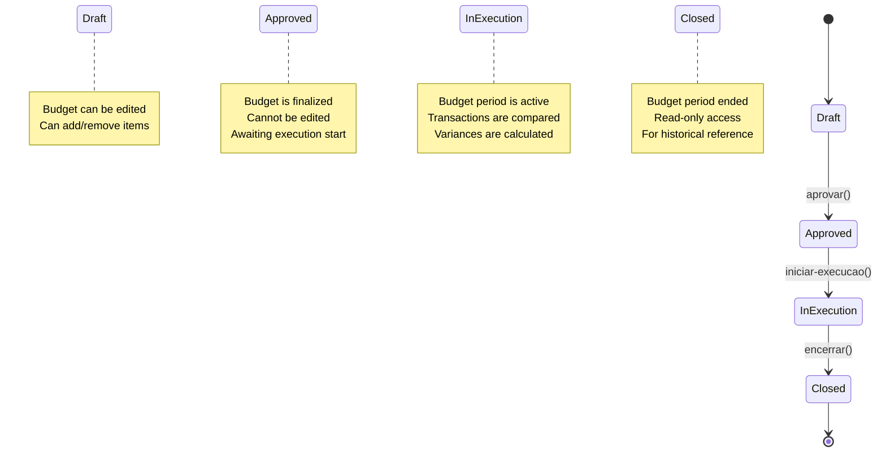
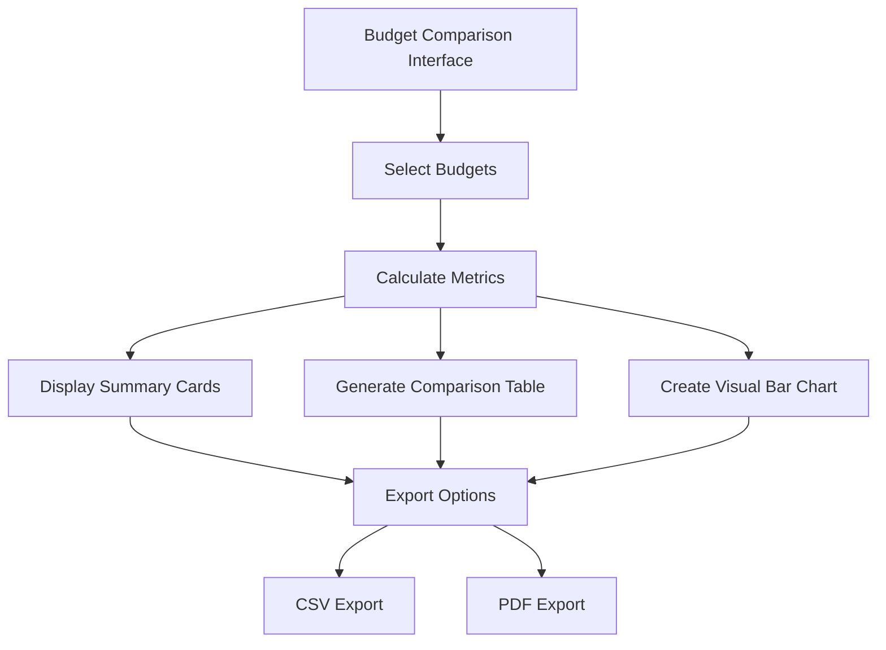

# Budgeting

<cite>
**Referenced Files in This Document**   
- [route.ts](file://app/api/financeiro/orcamentos/route.ts)
- [route.ts](file://app/api/financeiro/orcamentos/[id]/route.ts)
- [route.ts](file://app/api/financeiro/orcamentos/[id]/aprovar/route.ts)
- [route.ts](file://app/api/financeiro/orcamentos/[id]/iniciar-execucao/route.ts)
- [route.ts](file://app/api/financeiro/orcamentos/[id]/encerrar/route.ts)
- [route.ts](file://app/api/financeiro/orcamentos/[id]/analise/route.ts)
- [route.ts](file://app/api/financeiro/orcamentos/[id]/projecao/route.ts)
- [route.ts](file://app/api/financeiro/orcamentos/[id]/relatorio/route.ts)
- [route.ts](file://app/api/financeiro/orcamentos/[id]/itens/route.ts)
- [route.ts](file://app/api/financeiro/orcamentos/[id]/itens/[itemId]/route.ts)
- [page.tsx](file://app/(dashboard)/financeiro/orcamentos/comparar/page.tsx)
- [orcamento.types.ts](file://backend/types/financeiro/orcamento.types.ts)
- [financeiro-orcamentos.md](file://docs/financeiro-orcamentos.md)
</cite>

## Table of Contents
1. [Introduction](#introduction)
2. [Budget Endpoints](#budget-endpoints)
3. [Budget Item Endpoints](#budget-item-endpoints)
4. [Budget Analysis Endpoints](#budget-analysis-endpoints)
5. [Budget Approval Workflow](#budget-approval-workflow)
6. [Budget Comparison](#budget-comparison)
7. [Request Parameters](#request-parameters)
8. [Response Schemas](#response-schemas)
9. [Authentication Methods](#authentication-methods)
10. [Budget Calculations](#budget-calculations)
11. [Integration with Financial Planning](#integration-with-financial-planning)
12. [Common Issues](#common-issues)
13. [Integration with Financial Reporting](#integration-with-financial-reporting)
14. [API Usage Patterns](#api-usage-patterns)

## Introduction

The Sinesys budgeting system provides a comprehensive API for managing financial budgets within an organization. The system supports CRUD operations for budgets, budget vs actual comparisons, and budget approval workflows. Budgets can be created for various time periods including monthly, quarterly, semi-annual, and annual cycles.

The budgeting module follows a lifecycle with four distinct statuses: draft, approved, in execution, and closed. This lifecycle ensures proper governance and control over budget management. Budgets start in draft status where they can be edited, then progress to approved status, followed by in execution status when the budget period begins, and finally to closed status when the period ends.

Budgets are composed of budget items that are linked to accounting accounts and cost centers. Each budget item contains a planned value and can be associated with a description. The system provides comprehensive analysis capabilities, comparing budgeted values against actual financial transactions to calculate variances and provide insights into budget performance.

The API is designed to support integration with financial planning, reporting, and forecasting capabilities, enabling organizations to maintain financial discipline and make data-driven decisions.

**Section sources**
- [financeiro-orcamentos.md](file://docs/financeiro-orcamentos.md#L1-L209)

## Budget Endpoints

The budgeting API provides endpoints for managing budgets through their entire lifecycle. The primary endpoint for budget management is `/api/financeiro/orcamentos`, which supports listing, creating, updating, and deleting budgets.

The GET method on `/api/financeiro/orcamentos` returns a paginated list of budgets with optional filtering by year, period, status, and search terms. The response includes metadata about pagination and the list of budgets with their basic information. This endpoint supports various query parameters to filter and sort the results according to specific requirements.

The POST method on `/api/financeiro/orcamentos` creates a new budget in draft status. The request body must include required fields such as name, year, period, start date, and end date. When a budget is created, it is assigned to the authenticated user who becomes the creator of the budget.

For individual budget operations, the endpoint `/api/financeiro/orcamentos/{id}` provides GET, PUT, and DELETE methods. The GET method retrieves detailed information about a specific budget including its items. The PUT method updates the budget, but only if it is in draft status. The DELETE method removes the budget, but only if it is in draft status.

```mermaid
flowchart TD
A[Client Application] --> B[/api/financeiro/orcamentos]
B --> C{HTTP Method}
C --> |GET| D[List Budgets]
C --> |POST| E[Create Budget]
F[/api/financeiro/orcamentos/{id}] --> G{HTTP Method}
G --> |GET| H[Get Budget Details]
G --> |PUT| I[Update Budget]
G --> |DELETE| J[Delete Budget]
```

**Diagram sources**
- [route.ts](file://app/api/financeiro/orcamentos/route.ts#L1-L242)
- [route.ts](file://app/api/financeiro/orcamentos/[id]/route.ts#L1-L261)

**Section sources**
- [route.ts](file://app/api/financeiro/orcamentos/route.ts#L1-L242)
- [route.ts](file://app/api/financeiro/orcamentos/[id]/route.ts#L1-L261)

## Budget Item Endpoints

Budget items are managed through dedicated endpoints that allow for CRUD operations on the items within a budget. The primary endpoint for budget items is `/api/financeiro/orcamentos/{id}/itens`, where {id} refers to the budget ID.

The GET method on `/api/financeiro/orcamentos/{id}/itens` retrieves all items associated with a specific budget. This endpoint first validates the budget ID and then fetches the budget with its detailed items. If the budget is not found, a 404 error is returned. Otherwise, the response contains an array of budget items with their properties.

The POST method on `/api/financeiro/orcamentos/{id}/itens` creates new items in the specified budget. This endpoint supports both individual item creation and batch creation. When a single item is created, the request body contains the item properties directly. For batch creation, the request body contains an "itens" array with multiple item objects. Each item must be validated before creation, ensuring that required fields are present and values are valid.

For individual item operations, the endpoint `/api/financeiro/orcamentos/{id}/itens/{itemId}` provides GET, PUT, and DELETE methods. The GET method retrieves a specific item by its ID within the context of a budget. The PUT method updates an existing item, but only if the parent budget is in draft status. The DELETE method removes an item from the budget, with the same status restriction.

```mermaid
flowchart TD
A[Client Application] --> B[/api/financeiro/orcamentos/{id}/itens]
B --> C{HTTP Method}
C --> |GET| D[List Budget Items]
C --> |POST| E[Create Budget Item(s)]
F[/api/financeiro/orcamentos/{id}/itens/{itemId}] --> G{HTTP Method}
G --> |GET| H[Get Item Details]
G --> |PUT| I[Update Item]
G --> |DELETE| J[Delete Item]
```

**Diagram sources**
- [route.ts](file://app/api/financeiro/orcamentos/[id]/itens/route.ts#L1-L247)
- [route.ts](file://app/api/financeiro/orcamentos/[id]/itens/[itemId]/route.ts#L1-L310)

**Section sources**
- [route.ts](file://app/api/financeiro/orcamentos/[id]/itens/route.ts#L1-L247)
- [route.ts](file://app/api/financeiro/orcamentos/[id]/itens/[itemId]/route.ts#L1-L310)

## Budget Analysis Endpoints

The budgeting system provides specialized endpoints for analyzing budget performance and generating projections. These endpoints enable users to compare budgeted amounts against actual financial transactions and forecast future budget performance.

The `/api/financeiro/orcamentos/{id}/analise` endpoint provides a comprehensive analysis of a budget's performance. It returns detailed information about budget items, including budgeted amounts, actual amounts, variances, and alerts for significant deviations. The analysis can be customized through query parameters that control which components are included in the response, such as summary information, alerts, and monthly evolution data.

The `/api/financeiro/orcamentos/{id}/projecao` endpoint generates a projection of budget execution based on current spending trends. This projection helps users anticipate the final outcome of the budget period and make informed decisions about budget adjustments. The endpoint can optionally include annual comparison data to provide context for the projection.

The `/api/financeiro/orcamentos/{id}/relatorio` endpoint generates a complete report of the budget, combining all available information including details, analysis, and projections. This endpoint supports multiple output formats including JSON, Excel, and PDF, making it suitable for both programmatic use and human consumption.

```mermaid
flowchart TD
A[Client Application] --> B[/api/financeiro/orcamentos/{id}/analise]
B --> C[Get Budget Analysis]
A --> D[/api/financeiro/orcamentos/{id}/projecao]
D --> E[Get Budget Projection]
A --> F[/api/financeiro/orcamentos/{id}/relatorio]
F --> G[Get Budget Report]
```

**Diagram sources**
- [route.ts](file://app/api/financeiro/orcamentos/[id]/analise/route.ts#L1-L122)
- [route.ts](file://app/api/financeiro/orcamentos/[id]/projecao/route.ts#L1-L122)
- [route.ts](file://app/api/financeiro/orcamentos/[id]/relatorio/route.ts#L1-L139)

**Section sources**
- [route.ts](file://app/api/financeiro/orcamentos/[id]/analise/route.ts#L1-L122)
- [route.ts](file://app/api/financeiro/orcamentos/[id]/projecao/route.ts#L1-L122)
- [route.ts](file://app/api/financeiro/orcamentos/[id]/relatorio/route.ts#L1-L139)

## Budget Approval Workflow

The budgeting system implements a formal approval workflow through dedicated endpoints that transition budgets between different lifecycle states. This workflow ensures proper governance and control over budget management.

The `/api/financeiro/orcamentos/{id}/aprovar` endpoint approves a budget that is currently in draft status. When this endpoint is called, the budget status changes from "rascunho" (draft) to "aprovado" (approved). The approval process requires the budget to have at least one item and to be in draft status. The authenticated user who performs the approval is recorded as the approver, and the approval timestamp is captured.

The `/api/financeiro/orcamentos/{id}/iniciar-execucao` endpoint starts the execution of an approved budget. This transitions the budget from "aprovado" (approved) status to "em_execucao" (in execution) status. Once a budget is in execution, financial transactions are compared against the budgeted amounts for variance analysis. Only budgets in approved status can have their execution started.

The `/api/financeiro/orcamentos/{id}/encerrar` endpoint closes a budget that is in execution. This changes the budget status from "em_execucao" (in execution) to "encerrado" (closed). After a budget is closed, it becomes read-only and can no longer be modified. This endpoint supports optional observations about the closure.



**Diagram sources**
- [route.ts](file://app/api/financeiro/orcamentos/[id]/aprovar/route.ts#L1-L117)
- [route.ts](file://app/api/financeiro/orcamentos/[id]/iniciar-execucao/route.ts#L1-L96)
- [route.ts](file://app/api/financeiro/orcamentos/[id]/encerrar/route.ts#L1-L114)

**Section sources**
- [route.ts](file://app/api/financeiro/orcamentos/[id]/aprovar/route.ts#L1-L117)
- [route.ts](file://app/api/financeiro/orcamentos/[id]/iniciar-execucao/route.ts#L1-L96)
- [route.ts](file://app/api/financeiro/orcamentos/[id]/encerrar/route.ts#L1-L114)

## Budget Comparison

The system provides functionality for comparing multiple budgets side by side through both API endpoints and a dedicated user interface. The comparison feature enables users to analyze differences between budgets, identify trends, and make informed decisions.

The comparison functionality is primarily implemented in the frontend at `/app/(dashboard)/financeiro/orcamentos/comparar/page.tsx`. This page allows users to select multiple budgets for comparison and displays the results in various formats including summary cards, detailed tables, and visual bar charts.

The comparison process calculates key metrics such as the highest budget, lowest budget, and average budget values across the selected budgets. It also computes the variance of each budget against the average, providing insights into relative performance. The visual representation uses proportional bars to illustrate the relative sizes of the budgets.

The comparison page supports exporting the results in CSV and PDF formats, enabling users to share the analysis with stakeholders. The export functionality generates a comprehensive report that includes both the raw data and visual representations of the comparison.



**Diagram sources**
- [page.tsx](file://app/(dashboard)/financeiro/orcamentos/comparar/page.tsx#L1-L607)

**Section sources**
- [page.tsx](file://app/(dashboard)/financeiro/orcamentos/comparar/page.tsx#L1-L607)

## Request Parameters

The budgeting API endpoints accept various parameters to control their behavior and customize their responses. These parameters are provided as query string parameters for GET requests and as JSON properties in the request body for POST, PUT, and other methods.

For the budget listing endpoint (`/api/financeiro/orcamentos` with GET method), the following query parameters are supported:
- `pagina`: Page number for pagination (default: 1)
- `limite`: Number of items per page (default: 50, maximum: 100)
- `busca`: Text search term for filtering by budget name and description
- `ano`: Filter by budget year
- `periodo`: Filter by period type (mensal, trimestral, semestral, anual)
- `status`: Filter by budget status (rascunho, aprovado, em_execucao, encerrado)
- `ordenarPor`: Field to sort by (nome, ano, periodo, status, data_inicio, created_at)
- `ordem`: Sort order (asc, desc)

For the budget analysis endpoint (`/api/financeiro/orcamentos/{id}/analise`), the following query parameters control the response content:
- `incluirResumo`: Whether to include summary information (default: true)
- `incluirAlertas`: Whether to include deviation alerts (default: true)
- `incluirEvolucao`: Whether to include monthly evolution data (default: false)

For the budget projection endpoint (`/api/financeiro/orcamentos/{id}/projecao`), the following query parameter is available:
- `incluirComparativoAnual`: Whether to include annual comparison data (default: false)

For the budget report endpoint (`/api/financeiro/orcamentos/{id}/relatorio`), the format parameter controls the output format:
- `formato`: Output format (json, excel, pdf; default: json)

**Section sources**
- [financeiro-orcamentos.md](file://docs/financeiro-orcamentos.md#L86-L105)
- [route.ts](file://app/api/financeiro/orcamentos/route.ts#L35-L64)
- [route.ts](file://app/api/financeiro/orcamentos/[id]/analise/route.ts#L37-L51)
- [route.ts](file://app/api/financeiro/orcamentos/[id]/projecao/route.ts#L41-L45)
- [route.ts](file://app/api/financeiro/orcamentos/[id]/relatorio/route.ts#L40-L44)

## Response Schemas

The budgeting API returns structured JSON responses with a consistent format across all endpoints. The response structure includes a success flag, data payload, and optional message or error information.

The standard response format is:
```json
{
  "success": boolean,
  "data": object|array|null,
  "message": string (optional)
}
```

For budget listing responses, the data property contains an object with pagination information and the list of budgets:
```json
{
  "success": true,
  "data": {
    "orcamentos": [...],
    "paginacao": {
      "pagina": number,
      "limite": number,
      "total": number,
      "totalPaginas": number
    }
  }
}
```

For individual budget responses, the data property contains detailed budget information including its items:
```json
{
  "success": true,
  "data": {
    "id": number,
    "nome": string,
    "descricao": string,
    "ano": number,
    "periodo": string,
    "status": string,
    "data_inicio": string,
    "data_fim": string,
    "observacoes": string,
    "criado_por": number,
    "aprovado_por": number,
    "data_aprovacao": string,
    "itens": [...]
  }
}
```

For budget analysis responses, the data structure includes items with budget and actual values, summary information, alerts, and evolution data:
```json
{
  "success": true,
  "data": {
    "itens": [...],
    "resumo": {...},
    "alertas": [...],
    "evolucao": [...]
  }
}
```

Error responses follow the same structure but with success set to false and an error message:
```json
{
  "success": false,
  "error": string
}
```

**Section sources**
- [route.ts](file://app/api/financeiro/orcamentos/route.ts#L172-L175)
- [route.ts](file://app/api/financeiro/orcamentos/[id]/route.ts#L149-L152)
- [route.ts](file://app/api/financeiro/orcamentos/[id]/analise/route.ts#L101-L108)
- [route.ts](file://app/api/financeiro/orcamentos/[id]/relatorio/route.ts#L106-L109)

## Authentication Methods

The budgeting API requires authentication for all endpoints to ensure that only authorized users can access and modify budget data. The system supports multiple authentication methods to accommodate different client types and use cases.

The API endpoints specify the following security schemes in their Swagger documentation:
- `bearerAuth`: JWT-based authentication using bearer tokens
- `sessionAuth`: Session-based authentication for web clients
- `serviceApiKey`: API key authentication for service-to-service communication

Authentication is implemented through the `authenticateRequest` function imported from `@/backend/auth/api-auth`. This function validates the incoming request and returns an authentication result that includes whether the request is authenticated and the authenticated user ID.

For endpoints that modify data, the authenticated user ID is used to track who performed the action. For example, when a budget is approved, the `aprovado_por` field is set to the authenticated user ID, and the approval timestamp is recorded.

The authentication system ensures that users can only access budgets and budget items that they have permission to view or modify, based on their role and permissions within the organization.

**Section sources**
- [route.ts](file://app/api/financeiro/orcamentos/route.ts#L8)
- [route.ts](file://app/api/financeiro/orcamentos/[id]/route.ts#L9)
- [route.ts](file://app/api/financeiro/orcamentos/[id]/aprovar/route.ts#L7)

## Budget Calculations

The budgeting system performs various calculations to provide insights into budget performance and support financial decision-making. These calculations are implemented in backend services and exposed through API endpoints.

The primary calculation is the variance between budgeted and actual amounts. This is calculated as:
```
variance = actual - budgeted
variance_percentage = (variance / budgeted) * 100
```

The system also calculates utilization percentages, showing how much of the budgeted amount has been consumed by actual transactions. This helps identify budgets that are on track or at risk of overruns.

For budget projections, the system analyzes current spending trends and extrapolates them to estimate the final outcome of the budget period. This projection takes into account the time elapsed in the budget period and the rate of spending to provide a realistic forecast.

The comparison functionality calculates relative performance metrics, such as the variance of each budget against the average of selected budgets. This helps identify outliers and trends across multiple budgets.

```mermaid
flowchart TD
A[Budget Data] --> B[Variance Calculation]
A --> C[Utilization Percentage]
A --> D[Projection]
A --> E[Comparison Metrics]
B --> F[(actual - budgeted) / budgeted * 100]
C --> G[actual / budgeted * 100]
D --> H[Trend-based Forecast]
E --> I[Variance vs Average]
```

**Diagram sources**
- [financeiro-orcamentos.md](file://docs/financeiro-orcamentos.md#L170-L174)
- [page.tsx](file://app/(dashboard)/financeiro/orcamentos/comparar/page.tsx#L271-L272)

**Section sources**
- [financeiro-orcamentos.md](file://docs/financeiro-orcamentos.md#L170-L174)
- [page.tsx](file://app/(dashboard)/financeiro/orcamentos/comparar/page.tsx#L271-L272)

## Integration with Financial Planning

The budgeting system is designed to integrate seamlessly with financial planning processes, providing the foundation for strategic financial management. The system supports scenario planning by allowing users to create multiple budget drafts for the same period, enabling comparison of different financial strategies.

The budget lifecycle supports the financial planning process by separating the planning phase (draft budgets) from the execution phase (approved and in execution budgets). This separation ensures that financial plans are properly reviewed and approved before implementation.

The system's support for different time periods (monthly, quarterly, semi-annual, annual) aligns with common financial planning cycles. Users can create budgets that match their organization's planning horizon, from short-term operational budgets to long-term strategic budgets.

The comparison functionality supports financial planning by enabling users to compare current budgets against historical budgets, identifying trends and informing future planning decisions. The projection feature helps planners anticipate future financial performance and adjust plans proactively.

**Section sources**
- [financeiro-orcamentos.md](file://docs/financeiro-orcamentos.md#L22-L28)

## Common Issues

The budgeting system includes validation and error handling to prevent common issues and guide users toward correct usage. Understanding these common issues helps developers and users work effectively with the API.

One common issue is attempting to approve a budget that has no items. The system validates that a budget must have at least one item before it can be approved, returning a 400 error with an appropriate message if this condition is not met.

Another common issue is attempting to modify a budget that is not in draft status. Only budgets in draft status can be edited or deleted. Attempts to modify approved, in execution, or closed budgets result in 400 errors with messages explaining the status restrictions.

Budget overruns are monitored through the analysis functionality, which generates alerts when actual spending exceeds budgeted amounts by significant margins. These alerts help users identify potential issues early and take corrective action.

During financial year transitions, the system maintains budget integrity by properly closing budgets at the end of their period and preventing modifications to closed budgets. Historical budgets remain available for reference and comparison.

**Section sources**
- [financeiro-orcamentos.md](file://docs/financeiro-orcamentos.md#L176-L183)

## Integration with Financial Reporting

The budgeting system integrates with financial reporting capabilities to provide comprehensive financial insights. The system generates reports that combine budget data with actual financial transactions, enabling detailed analysis of financial performance.

The `/api/financeiro/orcamentos/{id}/relatorio` endpoint generates comprehensive reports that can be exported in multiple formats including JSON, Excel, and PDF. These reports are suitable for sharing with stakeholders and incorporating into broader financial reporting packages.

The analysis and projection endpoints provide data that can be used to create financial dashboards and visualizations. These insights help organizations monitor financial performance against plans and make data-driven decisions.

The system's data model, with its clear separation of budgeted and actual amounts, supports the creation of standard financial reports such as budget vs actual comparisons, variance analyses, and trend reports.

**Section sources**
- [route.ts](file://app/api/financeiro/orcamentos/[id]/relatorio/route.ts#L111-L120)

## API Usage Patterns

The budgeting API supports various usage patterns that reflect common workflows in financial management. Understanding these patterns helps developers integrate the API effectively into client applications.

A common pattern is the budget creation workflow:
1. Create a new budget in draft status
2. Add items to the budget
3. Review and edit the budget as needed
4. Approve the budget
5. Start execution when the budget period begins
6. Monitor performance through analysis endpoints
7. Close the budget at the end of the period

Another pattern is scenario planning, where users create multiple draft budgets for the same period with different assumptions. These budgets can be compared using the comparison functionality to evaluate different financial strategies.

The API also supports batch operations, such as creating multiple budget items at once. This pattern improves performance and user experience when setting up complex budgets with many line items.

The frontend implementation demonstrates how to use the API to create a rich user experience, with features like real-time validation, loading states, and error handling that guide users through the budgeting process.

**Section sources**
- [financeiro-orcamentos.md](file://docs/financeiro-orcamentos.md#L22-L28)
- [page.tsx](file://app/(dashboard)/financeiro/orcamentos/comparar/page.tsx#L339-L607)