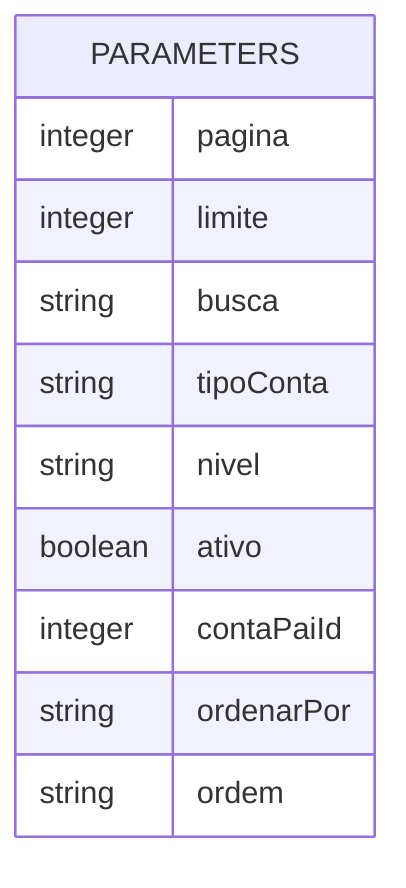
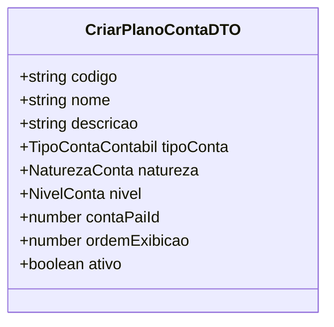
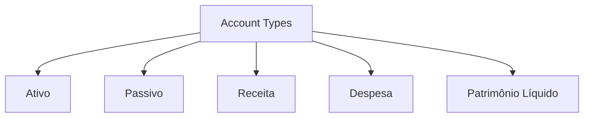
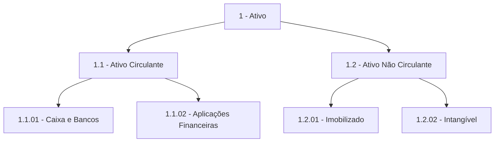
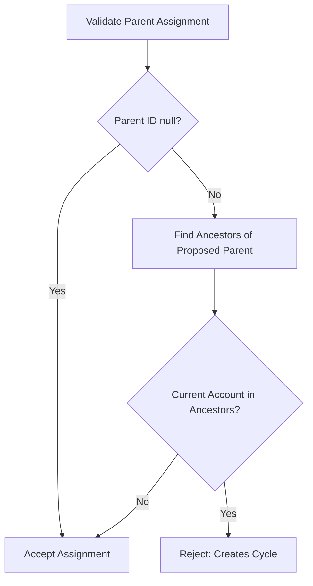
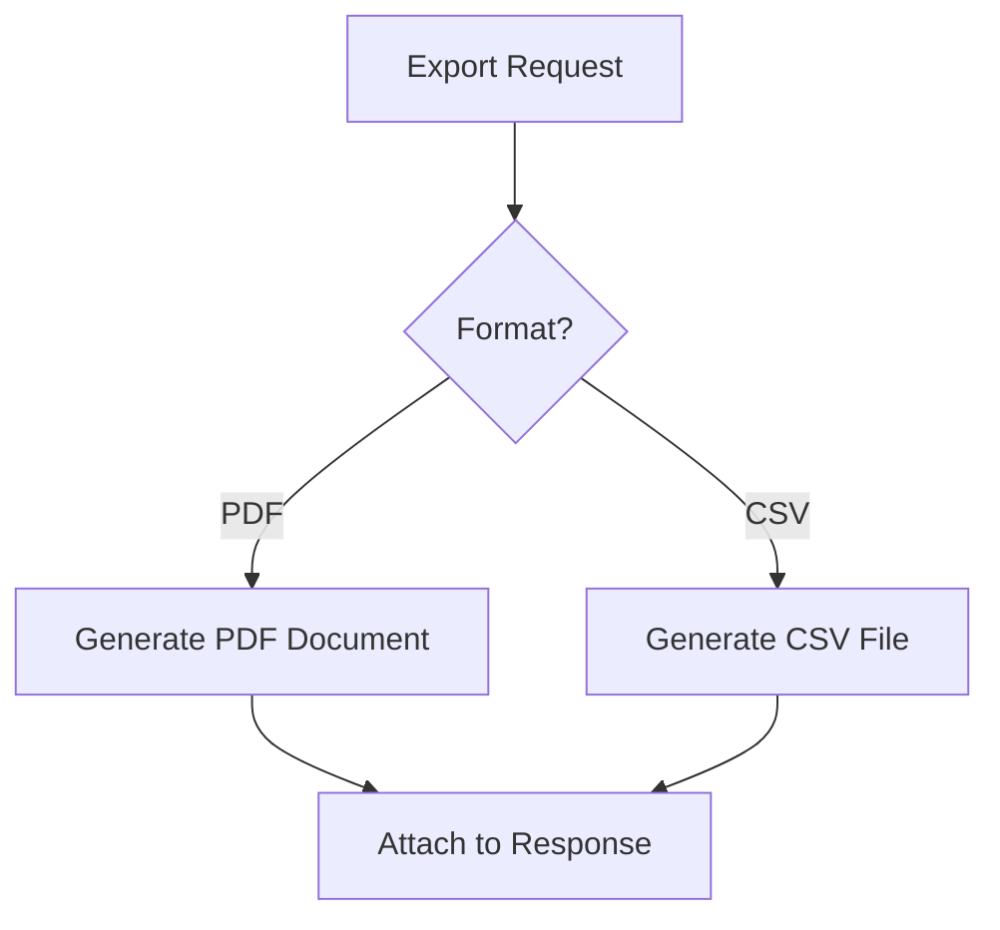
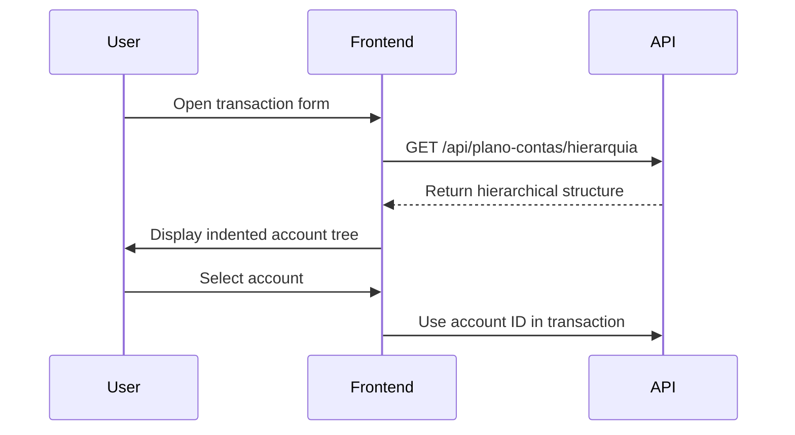
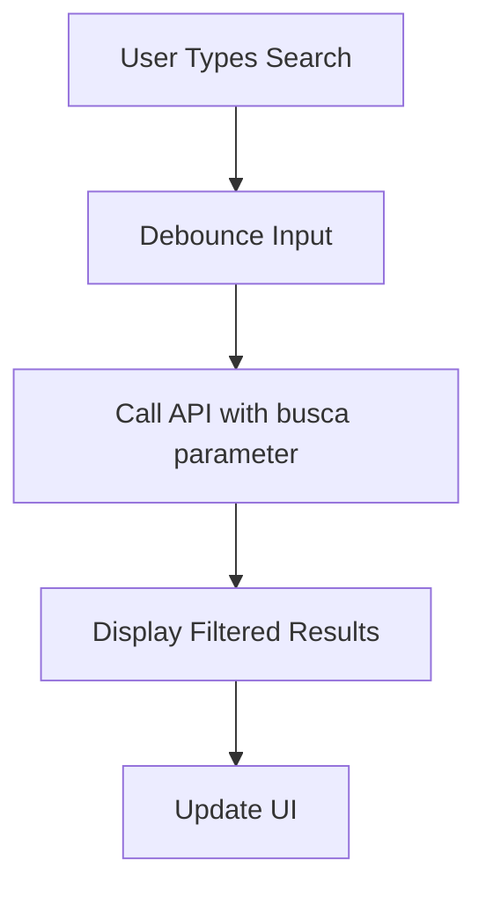

# Chart of Accounts

<cite>
**Referenced Files in This Document**   
- [plano_contas.sql](file://supabase/schemas/26_plano_contas.sql)
- [route.ts](file://app/api/plano-contas/route.ts)
- [route.ts](file://app/api/plano-contas/hierarquia/route.ts)
- [route.ts](file://app/api/plano-contas/codigo/[codigo]/route.ts)
- [route.ts](file://app/api/financeiro/plano-contas/exportar/route.ts)
- [listar-plano-contas.service.ts](file://backend/plano-contas/services/plano-contas/listar-plano-contas.service.ts)
- [obter-hierarquia.service.ts](file://backend/plano-contas/services/plano-contas/obter-hierarquia.service.ts)
- [plano-contas-persistence.service.ts](file://backend/plano-contas/services/persistence/plano-contas-persistence.service.ts)
- [plano-contas.types.ts](file://backend/types/financeiro/plano-contas.types.ts)
- [export-financeiro.ts](file://app/_lib/financeiro/export-financeiro.ts)
- [financeiro.ts](file://types/domain/financeiro.ts)
</cite>

## Table of Contents
1. [Introduction](#introduction)
2. [API Endpoints](#api-endpoints)
3. [Request Parameters](#request-parameters)
4. [Response Schemas](#response-schemas)
5. [Account Categorization](#account-categorization)
6. [Hierarchical Navigation](#hierarchical-navigation)
7. [Account Validation Rules](#account-validation-rules)
8. [Export Capabilities](#export-capabilities)
9. [Frontend Integration](#frontend-integration)
10. [Common Issues and Solutions](#common-issues-and-solutions)

## Introduction

The Chart of Accounts API in the Sinesys system provides comprehensive management of financial accounts through a hierarchical structure. This API enables users to retrieve, create, and manage accounting accounts used for classifying revenues, expenses, assets, and liabilities within the organization. The system follows standard accounting principles with a hierarchical structure where synthetic accounts group other accounts for reporting purposes, while analytical accounts receive direct financial entries.

The API endpoints support various operations including retrieving account structures, navigating account hierarchies, looking up accounts by code, and exporting chart of accounts data. These endpoints integrate with financial reporting systems and support frontend components that enable account selection in financial transactions.

**Section sources**
- [plano_contas.sql](file://supabase/schemas/26_plano_contas.sql#L1-L191)
- [route.ts](file://app/api/plano-contas/route.ts#L1-L261)

## API Endpoints

The Chart of Accounts API provides several endpoints for managing financial accounts:

### GET /api/plano-contas
Retrieves a paginated list of accounts in the chart of accounts with optional filtering parameters.

**Authentication**: Bearer token, session cookie, or service API key  
**Method**: GET  
**Response**: 200 OK with account list, 401 Unauthorized, 500 Internal Server Error

### POST /api/plano-contas
Creates a new account in the chart of accounts.

**Authentication**: Bearer token, session cookie, or service API key  
**Method**: POST  
**Response**: 201 Created with created account, 400 Bad Request, 401 Unauthorized, 500 Internal Server Error

### GET /api/plano-contas/hierarquia
Retrieves the complete hierarchical structure of the chart of accounts in a tree format.

**Authentication**: Bearer token, session cookie, or service API key  
**Method**: GET  
**Response**: 200 OK with hierarchical structure, 401 Unauthorized, 500 Internal Server Error

### GET /api/plano-contas/codigo/[codigo]
Retrieves account details by its hierarchical code.

**Authentication**: Bearer token, session cookie, or service API key  
**Method**: GET  
**Path Parameter**: codigo (string) - hierarchical account code (e.g., 1.1.01)  
**Response**: 200 OK with account details, 400 Bad Request, 404 Not Found, 401 Unauthorized, 500 Internal Server Error

### GET /api/financeiro/plano-contas/exportar
Exports chart of accounts data in various formats (PDF, CSV).

**Authentication**: Requires permission 'plano_contas.exportar'  
**Method**: GET  
**Query Parameters**: formato (pdf|csv), apenasAnaliticas (boolean)  
**Response**: 200 OK with file attachment, 401 Unauthorized, 500 Internal Server Error

**Section sources**
- [route.ts](file://app/api/plano-contas/route.ts#L1-L261)
- [route.ts](file://app/api/plano-contas/hierarquia/route.ts#L1-L78)
- [route.ts](file://app/api/plano-contas/codigo/[codigo]/route.ts#L1-L74)
- [route.ts](file://app/api/financeiro/plano-contas/exportar/route.ts#L1-L99)

## Request Parameters

### List Accounts Parameters
The GET /api/plano-contas endpoint accepts the following query parameters:



**Diagram sources**
- [route.ts](file://app/api/plano-contas/route.ts#L28-L81)

| Parameter | Type | Description | Constraints |
|---------|------|-------------|-------------|
| pagina | integer | Page number | Default: 1 |
| limite | integer | Items per page | Default: 50, Max: 100 |
| busca | string | Text search on code or name | Case-insensitive |
| tipoConta | string | Filter by account type | ativo, passivo, receita, despesa, patrimonio_liquido |
| nivel | string | Filter by account level | sintetica, analitica |
| ativo | boolean | Filter by active/inactive status | true/false |
| contaPaiId | integer | Filter by parent account | null for root accounts |
| ordenarPor | string | Field for sorting | codigo, nome, ordem_exibicao, created_at, updated_at |
| ordem | string | Sort direction | asc, desc |

### Create Account Request Body
The POST /api/plano-contas endpoint requires a JSON body with the following properties:



**Diagram sources**
- [plano-contas.types.ts](file://backend/types/financeiro/plano-contas.types.ts#L84-L94)

### Export Parameters
The export endpoint accepts the following query parameters:

| Parameter | Type | Description | Default |
|---------|------|-------------|---------|
| formato | string | Export format | pdf |
| apenasAnaliticas | boolean | Include only analytical accounts | false |

**Section sources**
- [route.ts](file://app/api/plano-contas/route.ts#L28-L145)
- [plano-contas.types.ts](file://backend/types/financeiro/plano-contas.types.ts#L84-L94)

## Response Schemas

### List Accounts Response
The response for listing accounts includes pagination information and account details:

```json
{
  "success": true,
  "data": {
    "items": [
      {
        "id": 1,
        "codigo": "1.1.01",
        "nome": "Caixa e Bancos",
        "descricao": "Saldo em caixa e contas bancárias",
        "tipoConta": "ativo",
        "natureza": "devedora",
        "nivel": "analitica",
        "contaPaiId": 1,
        "aceitaLancamento": true,
        "ordemExibicao": 1,
        "ativo": true,
        "createdBy": 1,
        "createdAt": "2025-01-01T00:00:00Z",
        "updatedAt": "2025-01-01T00:00:00Z",
        "contaPai": {
          "id": 1,
          "codigo": "1.1",
          "nome": "Ativo Circulante"
        }
      }
    ],
    "paginacao": {
      "pagina": 1,
      "limite": 50,
      "total": 100,
      "totalPaginas": 2
    }
  }
}
```

### Hierarchical Structure Response
The hierarchical endpoint returns accounts in a tree structure:

```json
{
  "success": true,
  "data": [
    {
      "id": 1,
      "codigo": "1.1",
      "nome": "Ativo Circulante",
      "tipoConta": "ativo",
      "natureza": "devedora",
      "nivel": "sintetica",
      "aceitaLancamento": false,
      "ativo": true,
      "createdAt": "2025-01-01T00:00:00Z",
      "updatedAt": "2025-01-01T00:00:00Z",
      "filhos": [
        {
          "id": 2,
          "codigo": "1.1.01",
          "nome": "Caixa e Bancos",
          "tipoConta": "ativo",
          "natureza": "devedora",
          "nivel": "analitica",
          "aceitaLancamento": true,
          "ativo": true,
          "createdAt": "2025-01-01T00:00:00Z",
          "updatedAt": "2025-01-01T00:00:00Z"
        }
      ]
    }
  ]
}
```

### Account Lookup Response
The account lookup by code returns detailed account information:

```json
{
  "success": true,
  "data": {
    "id": 1,
    "codigo": "1.1.01",
    "nome": "Caixa e Bancos",
    "descricao": "Saldo em caixa e contas bancárias",
    "tipoConta": "ativo",
    "natureza": "devedora",
    "nivel": "analitica",
    "contaPaiId": 1,
    "aceitaLancamento": true,
    "ordemExibicao": 1,
    "ativo": true,
    "createdBy": 1,
    "createdAt": "2025-01-01T00:00:00Z",
    "updatedAt": "2025-01-01T00:00:00Z",
    "contaPai": {
      "id": 1,
      "codigo": "1.1",
      "nome": "Ativo Circulante"
    }
  }
}
```

**Section sources**
- [plano-contas.types.ts](file://backend/types/financeiro/plano-contas.types.ts#L37-L75)
- [route.ts](file://app/api/plano-contas/route.ts#L190-L193)

## Account Categorization

The Chart of Accounts system implements a comprehensive categorization framework based on standard accounting principles. Accounts are classified by type, nature, and level, creating a structured hierarchy for financial reporting.

### Account Types
Accounts are categorized into five main types:



**Diagram sources**
- [plano-contas.types.ts](file://backend/types/financeiro/plano-contas.types.ts#L13-L18)

### Nature and Level
Each account has a nature (devedora/credora) and level (sintetica/analitica):

| Type | Default Nature | Level | Accepts Entries |
|------|----------------|-------|----------------|
| Ativo | Devedora | Sintética/Analítica | Only Analítica |
| Passivo | Credora | Sintética/Analítica | Only Analítica |
| Receita | Credora | Sintética/Analítica | Only Analítica |
| Despesa | Devedora | Sintética/Analítica | Only Analítica |
| Patrimônio Líquido | Credora | Sintética/Analítica | Only Analítica |

The system enforces business rules:
- Only analytical accounts can accept financial entries
- Synthetic accounts serve as grouping categories for reporting
- Each account type has a default nature that can be overridden

**Section sources**
- [plano_contas.sql](file://supabase/schemas/26_plano_contas.sql#L24-L33)
- [plano-contas.types.ts](file://backend/types/financeiro/plano-contas.types.ts#L13-L28)

## Hierarchical Navigation

The Chart of Accounts implements a hierarchical structure that enables efficient navigation and organization of financial accounts.

### Parent-Child Relationships
Accounts are organized in a tree structure where:
- Root accounts have no parent (conta_pai_id = null)
- Synthetic accounts can have child accounts
- Analytical accounts typically do not have children
- Each account can have only one parent



**Diagram sources**
- [plano_contas.sql](file://supabase/schemas/26_plano_contas.sql#L29-L30)
- [plano-contas-persistence.service.ts](file://backend/plano-contas/services/persistence/plano-contas-persistence.service.ts#L315-L340)

### Navigation Methods
The system provides multiple ways to navigate the hierarchy:

1. **Flat List with Filters**: GET /api/plano-contas with contaPaiId parameter
2. **Full Hierarchy**: GET /api/plano-contas/hierarquia returns complete tree
3. **Flattened Hierarchy**: Utility function to convert tree to indented list
4. **Path Resolution**: Find complete path from root to specific account

The hierarchical structure is cached for performance, with automatic invalidation when accounts are created, updated, or deleted.

**Section sources**
- [obter-hierarquia.service.ts](file://backend/plano-contas/services/plano-contas/obter-hierarquia.service.ts#L19-L21)
- [plano-contas-persistence.service.ts](file://backend/plano-contas/services/persistence/plano-contas-persistence.service.ts#L287-L340)

## Account Validation Rules

The Chart of Accounts system implements comprehensive validation rules to maintain data integrity and prevent common accounting errors.

### Structural Constraints
The database enforces several constraints:

```sql
constraint plano_contas_nivel_aceita_lancamento_check check (
  (nivel = 'analitica' and aceita_lancamento = true) or
  (nivel = 'sintetica' and aceita_lancamento = false)
),
constraint plano_contas_sem_auto_referencia_check check (conta_pai_id != id)
```

**Diagram sources**
- [plano_contas.sql](file://supabase/schemas/26_plano_contas.sql#L43-L47)

### Business Rules
The application layer enforces additional business rules:

1. **Unique Codes**: Account codes must be unique across the entire chart
2. **Parent Validation**: When assigning a parent account:
   - The parent must exist
   - The parent must be a synthetic account
   - The operation cannot create a circular reference
3. **Deactivation Rules**: 
   - Accounts with active children cannot be deactivated
   - Accounts with financial entries cannot be deleted
4. **Activation Rules**: 
   - An account cannot be activated if its parent is inactive

### Cycle Prevention
The system prevents circular references in the hierarchy using a recursive validation function:



**Diagram sources**
- [plano-contas-persistence.service.ts](file://backend/plano-contas/services/persistence/plano-contas-persistence.service.ts#L350-L409)
- [plano_contas.sql](file://supabase/schemas/26_plano_contas.sql#L98-L154)

**Section sources**
- [plano_contas.sql](file://supabase/schemas/26_plano_contas.sql#L98-L154)
- [plano-contas-persistence.service.ts](file://backend/plano-contas/services/persistence/plano-contas-persistence.service.ts#L350-L409)

## Export Capabilities

The Chart of Accounts system provides robust export functionality for integration with external accounting systems and reporting purposes.

### Export Formats
The system supports two export formats:



**Diagram sources**
- [route.ts](file://app/api/financeiro/plano-contas/exportar/route.ts#L25-L97)

### PDF Export
The PDF export includes:
- Professional formatting with company header
- Hierarchical indentation of accounts
- Columns for Account, Code, Nature, and Initial Balance
- Automatic pagination
- UTF-8 encoding with BOM for special characters

### CSV Export
The CSV export features:
- UTF-8 encoding with BOM
- Proper escaping of commas and quotes
- Hierarchical indentation using spaces
- Columns for Name, Code, Nature, Level, and Initial Balance
- Downloadable as attachment with sanitized filename

### Filtering Options
Exports can be filtered to include:
- All accounts (default)
- Only analytical accounts (when apenasAnaliticas=true)

The export functionality is protected by role-based access control, requiring the 'plano_contas.exportar' permission.

**Section sources**
- [route.ts](file://app/api/financeiro/plano-contas/exportar/route.ts#L1-L99)
- [export-financeiro.ts](file://app/_lib/financeiro/export-financeiro.ts#L1-L182)

## Frontend Integration

The Chart of Accounts API is integrated with frontend components to enable seamless user interaction in financial transactions.

### Account Selection
The frontend uses the hierarchical endpoint to populate account selectors:



**Diagram sources**
- [route.ts](file://app/api/plano-contas/hierarquia/route.ts#L47-L77)
- [plano-conta-select.tsx](file://app/(dashboard)/financeiro/plano-contas/components/plano-conta-select.tsx)

### Search and Filter
The frontend implements search functionality using the list endpoint:



### Component Integration
Key frontend components include:
- **plano-conta-select**: Dropdown for account selection with hierarchical display
- **plano-contas-toolbar-filters**: Filter controls for account type, level, and status
- **plano-conta-create-dialog**: Modal dialog for creating new accounts
- **plano-conta-edit-dialog**: Modal dialog for editing existing accounts

These components leverage the API endpoints to provide a responsive user interface for managing the chart of accounts.

**Section sources**
- [plano-conta-select.tsx](file://app/(dashboard)/financeiro/plano-contas/components/plano-conta-select.tsx)
- [plano-contas-toolbar-filters.tsx](file://app/(dashboard)/financeiro/plano-contas/components/plano-contas-toolbar-filters.tsx)
- [route.ts](file://app/api/plano-contas/hierarquia/route.ts#L47-L77)

## Common Issues and Solutions

This section addresses common challenges encountered when working with the Chart of Accounts system and provides solutions.

### Maintaining Hierarchy Integrity
**Issue**: Circular references in the account hierarchy can cause infinite loops in reporting.

**Solution**: The system prevents this through:
- Database trigger that validates hierarchy on insert/update
- Application-level validation that checks for cycles
- Clear error messages that identify the problematic relationship

```sql
-- Database trigger prevents cycles
create trigger trigger_validar_hierarquia_plano_contas
  before insert or update of conta_pai_id on public.plano_contas
  for each row
  when (new.conta_pai_id is not null)
  execute function public.validar_hierarquia_plano_contas();
```

### Handling Account Reclassifications
**Issue**: Moving accounts between different parts of the hierarchy requires careful validation.

**Best Practices**:
1. Ensure the new parent is a synthetic account
2. Verify the move doesn't create a cycle
3. Update all dependent reports and configurations
4. Maintain audit trail of the change

### Accounting Standards Compliance
**Issue**: Ensuring the chart of accounts complies with accounting standards.

**Solutions**:
- Implement standard account type classifications
- Enforce proper nature (devedora/credora) for each account type
- Provide validation rules that prevent invalid configurations
- Support hierarchical structure that aligns with financial statement requirements

### Performance Optimization
**Issue**: Large charts of accounts can impact performance.

**Optimizations**:
- Redis caching of frequently accessed data
- Database indexing on key fields (codigo, tipo_conta, conta_pai_id)
- Paginated responses for large result sets
- Selective field retrieval based on use case

### Integration with External Systems
**Issue**: Exporting data for use in external accounting systems.

**Solutions**:
- Standardized CSV format with proper encoding
- PDF exports with professional formatting
- API endpoints that support bulk operations
- Data validation before export to ensure consistency

**Section sources**
- [plano_contas.sql](file://supabase/schemas/26_plano_contas.sql#L98-L154)
- [plano-contas-persistence.service.ts](file://backend/plano-contas/services/persistence/plano-contas-persistence.service.ts#L637-L659)
- [route.ts](file://app/api/financeiro/plano-contas/exportar/route.ts#L1-L99)