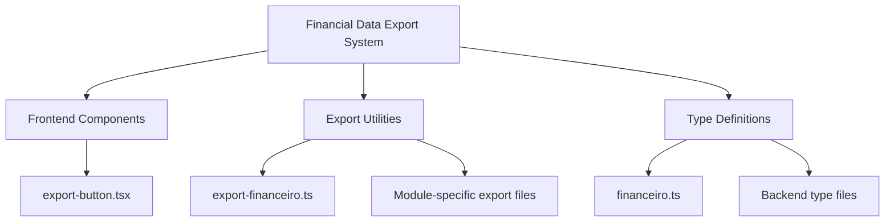
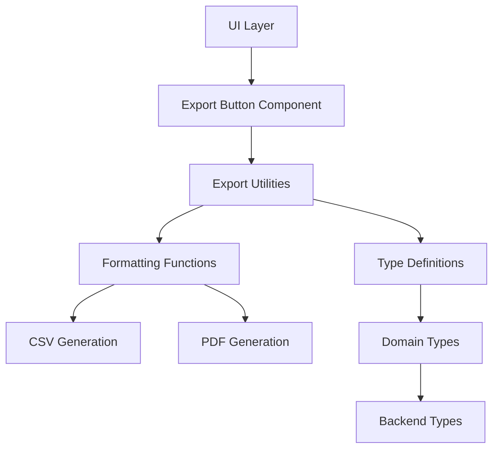
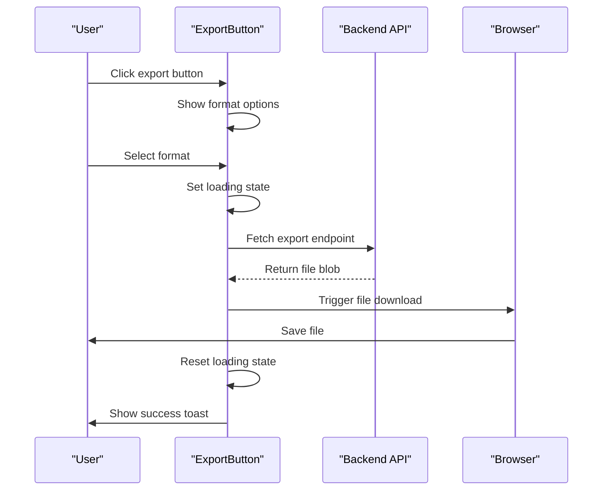
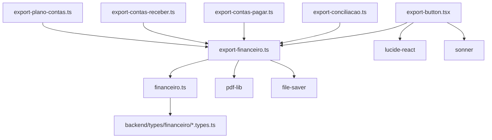

# Financial Data Export Typing

<cite>
**Referenced Files in This Document**   
- [export-button.tsx](file://components/financeiro/export-button.tsx)
- [export-financeiro.ts](file://app/_lib/financeiro/export-financeiro.ts)
- [export-conciliacao.ts](file://app/_lib/financeiro/export-conciliacao.ts)
- [export-contas-pagar.ts](file://app/_lib/financeiro/export-contas-pagar.ts)
- [export-contas-receber.ts](file://app/_lib/financeiro/export-contas-receber.ts)
- [export-plano-contas.ts](file://app/_lib/financeiro/export-plano-contas.ts)
- [financeiro.ts](file://types/domain/financeiro.ts)
- [conciliacao-bancaria.types.ts](file://backend/types/financeiro/conciliacao-bancaria.types.ts)
- [contas-pagar.types.ts](file://backend/types/financeiro/contas-pagar.types.ts)
- [contas-receber.types.ts](file://backend/types/financeiro/contas-receber.types.ts)
- [plano-contas.types.ts](file://backend/types/financeiro/plano-contas.types.ts)
</cite>

## Table of Contents
1. [Introduction](#introduction)
2. [Project Structure](#project-structure)
3. [Core Components](#core-components)
4. [Architecture Overview](#architecture-overview)
5. [Detailed Component Analysis](#detailed-component-analysis)
6. [Dependency Analysis](#dependency-analysis)
7. [Performance Considerations](#performance-considerations)
8. [Troubleshooting Guide](#troubleshooting-guide)
9. [Conclusion](#conclusion)

## Introduction
This document provides a comprehensive analysis of the financial data export typing system in the Sinesys application. The system enables users to export financial data in various formats (CSV, PDF) across different financial modules including Conciliation, Accounts Payable, Accounts Receivable, and Chart of Accounts. The typing system ensures type safety and consistency between frontend and backend components through well-defined TypeScript interfaces and type guards.

## Project Structure
The financial data export functionality is organized across multiple directories in the Sinesys application. The core export utilities are located in the `app/_lib/financeiro` directory, while the component-level export functionality is implemented in the `components/financeiro` directory. The typing system is defined in both the `types/domain` and `backend/types/financeiro` directories, ensuring consistency between frontend and backend code.



**Diagram sources**
- [export-button.tsx](file://components/financeiro/export-button.tsx)
- [export-financeiro.ts](file://app/_lib/financeiro/export-financeiro.ts)
- [financeiro.ts](file://types/domain/financeiro.ts)

**Section sources**
- [export-button.tsx](file://components/financeiro/export-button.tsx)
- [export-financeiro.ts](file://app/_lib/financeiro/export-financeiro.ts)
- [financeiro.ts](file://types/domain/financeiro.ts)

## Core Components
The financial data export system consists of several core components that work together to provide a consistent export experience across different financial modules. The `ExportButton` component provides a reusable UI element for triggering exports, while the various export utility files contain the business logic for generating CSV and PDF exports. The typing system ensures that data passed between components maintains type safety throughout the export process.

**Section sources**
- [export-button.tsx](file://components/financeiro/export-button.tsx)
- [export-financeiro.ts](file://app/_lib/financeiro/export-financeiro.ts)
- [financeiro.ts](file://types/domain/financeiro.ts)

## Architecture Overview
The financial data export architecture follows a modular design pattern where each financial module has its own export implementation that leverages shared utilities. The architecture separates concerns between UI components, export logic, and type definitions, enabling code reuse and maintainability. The system uses a layered approach with the frontend components interacting with export utilities that in turn use shared formatting functions and type definitions.



**Diagram sources**
- [export-button.tsx](file://components/financeiro/export-button.tsx)
- [export-financeiro.ts](file://app/_lib/financeiro/export-financeiro.ts)
- [financeiro.ts](file://types/domain/financeiro.ts)

## Detailed Component Analysis

### Export Button Component Analysis
The `ExportButton` component provides a dropdown interface for users to select their preferred export format (PDF, CSV, Excel). It handles the export process by constructing the appropriate API endpoint with query parameters and managing the download process. The component uses React state to manage loading states and provides user feedback through toast notifications.



**Diagram sources**
- [export-button.tsx](file://components/financeiro/export-button.tsx)

**Section sources**
- [export-button.tsx](file://components/financeiro/export-button.tsx)

### Export Utilities Analysis
The export utilities provide shared functionality for generating CSV and PDF exports across different financial modules. The `export-financeiro.ts` file contains common formatting functions for currency, dates, and percentages, as well as utilities for CSV escaping and PDF generation. These utilities are designed to be reusable across different export implementations.

```mermaid
classDiagram
class ExportFinanceiro {
+formatarValor(valor : number) : string
+formatarPercentual(valor : number) : string
+formatarData(data : string | Date) : string
+sanitizeFileName(name : string) : string
+escapeCSV(value : any) : string
+gerarCSV(cabecalhos : string[], linhas : any[][]) : string
+gerarPDFBase(titulo : string, subtitulo? : string) : Promise<PDFBase>
+drawDRELine(ctx : PDFBase & { y : number }, descricao : string, valor : number, percentual : number | null, opts : any) : number
+drawTableRow(ctx : PDFBase & { y : number }, valores : string[], colunas : number[], opts : any) : number
}
class ExportConciliacao {
+exportarTransacoesImportadasCSV(transacoes : TransacaoBancariaImportada[]) : void
+exportarConciliacoesPDF(conciliacoes : ConciliacaoBancaria[], periodo : { inicio : string; fim : string }) : Promise<void>
}
class ExportContasPagar {
+exportarContasPagarCSV(contas : ContaPagarComDetalhes[]) : void
+exportarContasPagarPDF(contas : ContaPagarComDetalhes[], filtros? : ContasPagarFilters) : Promise<void>
+exportarResumoVencimentosPDF(resumo : ResumoVencimentos) : Promise<void>
}
class ExportContasReceber {
+exportarContasReceberCSV(contas : ContaReceberComDetalhes[]) : void
+exportarContasReceberPDF(contas : ContaReceberComDetalhes[], filtros? : ContasReceberFilters) : Promise<void>
+exportarRelatorioInadimplenciaPDF(resumo : ResumoInadimplencia) : Promise<void>
}
class ExportPlanoContas {
+exportarPlanoContasCSV(contas : PlanoContaHierarquico[]) : void
+exportarPlanoContasPDF(contas : PlanoContaHierarquico[]) : Promise<void>
}
ExportConciliacao --> ExportFinanceiro : "uses"
ExportContasPagar --> ExportFinanceiro : "uses"
ExportContasReceber --> ExportFinanceiro : "uses"
ExportPlanoContas --> ExportFinanceiro : "uses"
```

**Diagram sources**
- [export-financeiro.ts](file://app/_lib/financeiro/export-financeiro.ts)
- [export-conciliacao.ts](file://app/_lib/financeiro/export-conciliacao.ts)
- [export-contas-pagar.ts](file://app/_lib/financeiro/export-contas-pagar.ts)
- [export-contas-receber.ts](file://app/_lib/financeiro/export-contas-receber.ts)
- [export-plano-contas.ts](file://app/_lib/financeiro/export-plano-contas.ts)

**Section sources**
- [export-financeiro.ts](file://app/_lib/financeiro/export-financeiro.ts)
- [export-conciliacao.ts](file://app/_lib/financeiro/export-conciliacao.ts)
- [export-contas-pagar.ts](file://app/_lib/financeiro/export-contas-pagar.ts)
- [export-contas-receber.ts](file://app/_lib/financeiro/export-contas-receber.ts)
- [export-plano-contas.ts](file://app/_lib/financeiro/export-plano-contas.ts)

### Type System Analysis
The financial data export typing system is designed to ensure type safety and consistency between frontend and backend components. The system uses a combination of domain types defined in `types/domain/financeiro.ts` and backend types from the `backend/types/financeiro` directory. The domain types re-export backend types and include utility functions for validation and data manipulation.

```mermaid
classDiagram
class FinanceiroTypes {
<<Type Definitions>>
+PlanoContaHierarquico
+ContaPagarComDetalhes
+ContaReceberComDetalhes
+ResumoVencimentos
+ResumoInadimplencia
+ContasPagarFilters
+ContasReceberFilters
}
class DomainFinanceiro {
<<Utility Functions>>
+achatarHierarquia(hierarquia : PlanoContaHierarquico[], nivel : number) : Array<PlanoContaHierarquico & { nivelIndentacao : number }>
+encontrarContaNaHierarquia(hierarquia : PlanoContaHierarquico[], id : number) : PlanoContaHierarquico | null
+obterCaminhoCompleto(hierarquia : PlanoContaHierarquico[], id : number, caminho : PlanoContaHierarquico[]) : PlanoContaHierarquico[] | null
}
class BackendTypes {
<<Backend Interfaces>>
+StatusConciliacao
+TipoConciliacao
+TipoTransacaoBancaria
+TipoArquivoExtrato
+StatusContaPagar
+OrigemContaPagar
+FormaPagamentoContaPagar
+FrequenciaRecorrencia
+CategoriaContaPagar
+StatusContaReceber
+OrigemContaReceber
+FormaRecebimentoContaReceber
+CategoriaContaReceber
}
DomainFinanceiro --> FinanceiroTypes : "extends"
FinanceiroTypes --> BackendTypes : "re-exports"
```

**Diagram sources**
- [financeiro.ts](file://types/domain/financeiro.ts)
- [conciliacao-bancaria.types.ts](file://backend/types/financeiro/conciliacao-bancaria.types.ts)
- [contas-pagar.types.ts](file://backend/types/financeiro/contas-pagar.types.ts)
- [contas-receber.types.ts](file://backend/types/financeiro/contas-receber.types.ts)
- [plano-contas.types.ts](file://backend/types/financeiro/plano-contas.types.ts)

**Section sources**
- [financeiro.ts](file://types/domain/financeiro.ts)
- [conciliacao-bancaria.types.ts](file://backend/types/financeiro/conciliacao-bancaria.types.ts)
- [contas-pagar.types.ts](file://backend/types/financeiro/contas-pagar.types.ts)
- [contas-receber.types.ts](file://backend/types/financeiro/contas-receber.types.ts)
- [plano-contas.types.ts](file://backend/types/financeiro/plano-contas.types.ts)

## Dependency Analysis
The financial data export system has a well-defined dependency structure that promotes code reuse and maintainability. The export utilities depend on shared formatting functions and type definitions, while individual module exports depend on the shared utilities. The type system creates a dependency between frontend and backend code, ensuring consistency across the application.



**Diagram sources**
- [export-button.tsx](file://components/financeiro/export-button.tsx)
- [export-financeiro.ts](file://app/_lib/financeiro/export-financeiro.ts)
- [export-conciliacao.ts](file://app/_lib/financeiro/export-conciliacao.ts)
- [export-contas-pagar.ts](file://app/_lib/financeiro/export-contas-pagar.ts)
- [export-contas-receber.ts](file://app/_lib/financeiro/export-contas-receber.ts)
- [export-plano-contas.ts](file://app/_lib/financeiro/export-plano-contas.ts)
- [financeiro.ts](file://types/domain/financeiro.ts)

**Section sources**
- [export-button.tsx](file://components/financeiro/export-button.tsx)
- [export-financeiro.ts](file://app/_lib/financeiro/export-financeiro.ts)
- [export-conciliacao.ts](file://app/_lib/financeiro/export-conciliacao.ts)
- [export-contas-pagar.ts](file://app/_lib/financeiro/export-contas-pagar.ts)
- [export-contas-receber.ts](file://app/_lib/financeiro/export-contas-receber.ts)
- [export-plano-contas.ts](file://app/_lib/financeiro/export-plano-contas.ts)
- [financeiro.ts](file://types/domain/financeiro.ts)

## Performance Considerations
The financial data export system is designed with performance in mind, particularly when handling large datasets. The export functions implement pagination to prevent memory issues when generating PDFs with many records. The CSV generation is optimized for performance by using efficient string concatenation and avoiding unnecessary data transformations. The system also includes error handling to prevent crashes during the export process.

**Section sources**
- [export-financeiro.ts](file://app/_lib/financeiro/export-financeiro.ts)
- [export-conciliacao.ts](file://app/_lib/financeiro/export-conciliacao.ts)
- [export-contas-pagar.ts](file://app/_lib/financeiro/export-contas-pagar.ts)
- [export-contas-receber.ts](file://app/_lib/financeiro/export-contas-receber.ts)
- [export-plano-contas.ts](file://app/_lib/financeiro/export-plano-contas.ts)

## Troubleshooting Guide
When troubleshooting issues with the financial data export system, consider the following common problems and solutions:

1. **Export fails with network error**: Check the API endpoint and ensure the backend service is running.
2. **PDF generation fails**: Verify that the pdf-lib package is properly installed and that there are no memory limitations.
3. **CSV encoding issues**: Ensure that special characters are properly escaped and that the BOM (Byte Order Mark) is included for UTF-8 encoding.
4. **Type errors**: Verify that the data being exported matches the expected type definitions in the backend types.
5. **Performance issues with large datasets**: Implement server-side pagination or streaming to handle large datasets more efficiently.

**Section sources**
- [export-button.tsx](file://components/financeiro/export-button.tsx)
- [export-financeiro.ts](file://app/_lib/financeiro/export-financeiro.ts)
- [financeiro.ts](file://types/domain/financeiro.ts)

## Conclusion
The financial data export typing system in the Sinesys application provides a robust and maintainable solution for exporting financial data in multiple formats. The system's modular architecture, comprehensive type definitions, and shared utilities enable consistent export functionality across different financial modules. By following TypeScript best practices and maintaining a clear separation of concerns, the system ensures type safety and reduces the risk of runtime errors. Future enhancements could include support for additional export formats and improved performance optimizations for handling large datasets.