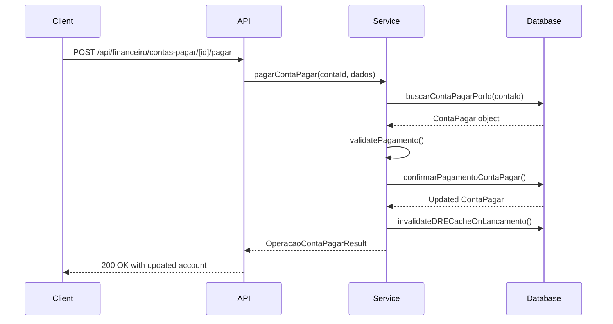
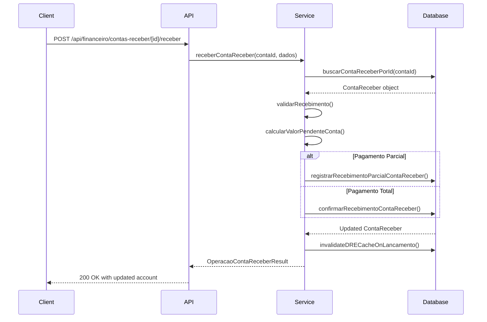
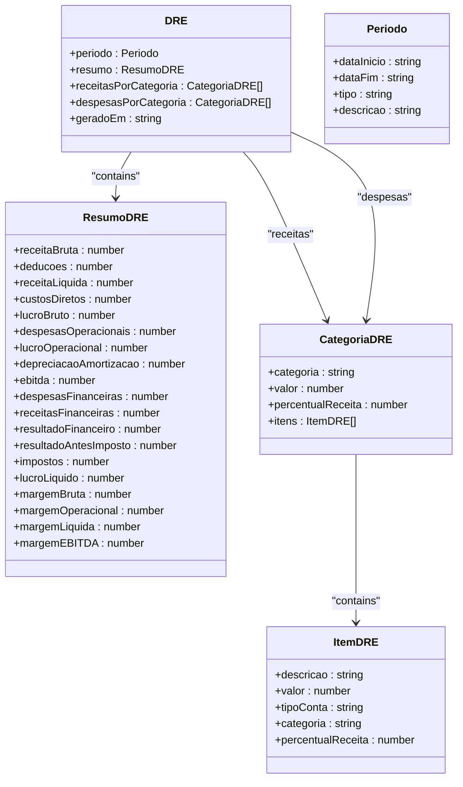
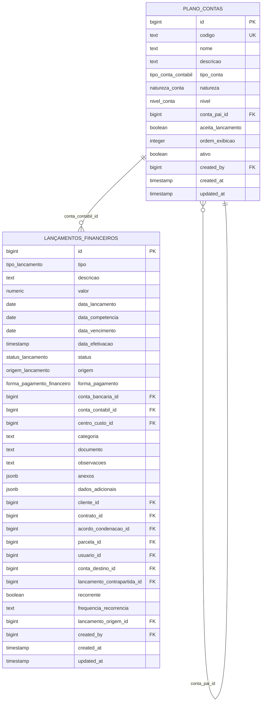

# Financial Endpoints

<cite>
**Referenced Files in This Document**   
- [contas-pagar/route.ts](file://app/api/financeiro/contas-pagar/route.ts)
- [contas-receber/route.ts](file://app/api/financeiro/contas-receber/route.ts)
- [dre/route.ts](file://app/api/financeiro/dre/route.ts)
- [orcamentos/route.ts](file://app/api/financeiro/orcamentos/route.ts)
- [plano-contas/exportar/route.ts](file://app/api/financeiro/plano-contas/exportar/route.ts)
- [26_plano_contas.sql](file://supabase/schemas/26_plano_contas.sql)
- [29_lancamentos_financeiros.sql](file://supabase/schemas/29_lancamentos_financeiros.sql)
- [calcular-dre.service.ts](file://backend/financeiro/dre/services/dre/calcular-dre.service.ts)
- [pagar-conta.service.ts](file://backend/financeiro/contas-pagar/services/contas-pagar/pagar-conta.service.ts)
- [receber-conta.service.ts](file://backend/financeiro/contas-receber/services/contas-receber/receber-conta.service.ts)
- [financeiro.ts](file://types/domain/financeiro.ts)
</cite>

## Table of Contents
1. [Introduction](#introduction)
2. [API Endpoints Overview](#api-endpoints-overview)
3. [Contas a Pagar](#contas-a-pagar)
4. [Contas a Receber](#contas-a-receber)
5. [DRE (Demonstração de Resultado)](#dre-demonstração-de-resultado)
6. [Orçamentos](#orçamentos)
7. [Plano de Contas](#plano-de-contas)
8. [Financial Calculations and Business Logic](#financial-calculations-and-business-logic)
9. [Data Export and Integration](#data-export-and-integration)
10. [Common Issues and Reconciliation](#common-issues-and-reconciliation)

## Introduction
The Sinesys financial system provides a comprehensive API for managing financial operations in a legal practice environment. This documentation covers the major financial endpoints including accounts payable, accounts receivable, financial statements (DRE), budgeting, and chart of accounts. The API follows REST principles with JSON request/response payloads and supports authentication via bearer tokens, session cookies, or service API keys. All financial operations maintain double-entry accounting principles and integrate with the firm's accounting standards.

**Section sources**
- [contas-pagar/route.ts](file://app/api/financeiro/contas-pagar/route.ts)
- [contas-receber/route.ts](file://app/api/financeiro/contas-receber/route.ts)
- [dre/route.ts](file://app/api/financeiro/dre/route.ts)

## API Endpoints Overview
The financial API is organized into several major endpoints under the `/api/financeiro` base path. Each endpoint supports standard HTTP methods for CRUD operations and includes comprehensive filtering, pagination, and export capabilities. The system implements row-level security through Supabase RLS policies, ensuring users can only access financial data according to their permissions.

```mermaid
graph TB
A[/api/financeiro] --> B[/contas-pagar]
A --> C[/contas-receber]
A --> D[/dre]
A --> E[/orcamentos]
A --> F[/plano-contas]
A --> G[/dashboard]
A --> H[/obrigacoes]
A --> I[/conciliacao-bancaria]
B --> B1[GET: List accounts]
B --> B2[POST: Create account]
B --> B3[PUT: Update account]
B --> B4[DELETE: Cancel account]
C --> C1[GET: List accounts]
C --> C2[POST: Create account]
C --> C3[PUT: Update account]
C --> C4[DELETE: Cancel account]
D --> D1[GET: Generate DRE]
D --> D2[GET: Export DRE]
E --> E1[GET: List budgets]
E --> E2[POST: Create budget]
E --> E3[PUT: Update budget]
F --> F1[GET: List chart of accounts]
F --> F2[POST: Create account]
F --> F3[GET: Export chart]
```

**Diagram sources**
- [contas-pagar/route.ts](file://app/api/financeiro/contas-pagar/route.ts)
- [contas-receber/route.ts](file://app/api/financeiro/contas-receber/route.ts)
- [dre/route.ts](file://app/api/financeiro/dre/route.ts)
- [orcamentos/route.ts](file://app/api/financeiro/orcamentos/route.ts)
- [plano-contas/exportar/route.ts](file://app/api/financeiro/plano-contas/exportar/route.ts)

## Contas a Pagar
The accounts payable endpoint manages vendor payments and expenses. It supports both one-time and recurring payments, with comprehensive tracking of payment status, due dates, and financial categories.

### HTTP Methods and URL Patterns
- **GET** `/api/financeiro/contas-pagar` - List accounts payable with filters
- **POST** `/api/financeiro/contas-pagar` - Create new account payable
- **GET** `/api/financeiro/contas-pagar/[id]` - Retrieve specific account
- **PUT** `/api/financeiro/contas-pagar/[id]` - Update account details
- **POST** `/api/financeiro/contas-pagar/[id]/pagar` - Process payment
- **POST** `/api/financeiro/contas-pagar/[id]/cancelar` - Cancel account

### Request/Response Schema
**Request (POST)**
```json
{
  "descricao": "string",
  "valor": "number",
  "dataVencimento": "string (date)",
  "contaContabilId": "integer",
  "fornecedorId": "integer",
  "categoria": "string",
  "recorrente": "boolean",
  "frequenciaRecorrencia": "string (mensal|trimestral|semestral|anual)"
}
```

**Response (GET List)**
```json
{
  "success": "boolean",
  "data": {
    "items": [
      {
        "id": "integer",
        "descricao": "string",
        "valor": "number",
        "dataVencimento": "string",
        "status": "string (pendente|confirmado|cancelado|estornado)",
        "fornecedor": {
          "id": "integer",
          "nome": "string"
        },
        "contaContabil": {
          "id": "integer",
          "codigo": "string",
          "nome": "string"
        }
      }
    ],
    "total": "integer",
    "pagina": "integer",
    "limite": "integer"
  }
}
```

### Parameters
- **pagina**: Page number (default: 1)
- **limite**: Items per page (default: 50, max: 100)
- **busca**: Text search on description, document, or category
- **status**: Filter by status (pendente, confirmado, cancelado, estornado)
- **dataVencimentoInicio/dataVencimentoFim**: Date range filter
- **fornecedorId**: Filter by vendor
- **categoria**: Filter by category
- **incluirResumo**: Include payment due summary

### Error Codes
- **400**: Invalid data - Missing required fields or invalid values
- **401**: Unauthorized - Authentication required
- **403**: Forbidden - Insufficient permissions
- **404**: Not Found - Account not found
- **500**: Internal Server Error - System error

### Usage Examples
```javascript
// Create new payable account
fetch('/api/financeiro/contas-pagar', {
  method: 'POST',
  headers: {
    'Authorization': 'Bearer <token>',
    'Content-Type': 'application/json'
  },
  body: JSON.stringify({
    descricao: 'Aluguel escritório',
    valor: 3500.00,
    dataVencimento: '2025-01-10',
    contaContabilId: 101,
    fornecedorId: 25,
    categoria: 'Aluguel'
  })
});

// List overdue accounts
fetch('/api/financeiro/contas-pagar?status=pendente&dataVencimentoFim=2025-01-15', {
  method: 'GET',
  headers: { 'Authorization': 'Bearer <token>' }
});
```

### Implementation Details
The accounts payable system implements double-entry accounting principles through the `lancamentos_financeiros` table, which records all financial transactions. When a payment is processed, the system creates a corresponding entry in the accounting records and updates the account status. The system validates that only pending accounts can be paid and prevents duplicate payments.



**Diagram sources**
- [contas-pagar/route.ts](file://app/api/financeiro/contas-pagar/route.ts)
- [pagar-conta.service.ts](file://backend/financeiro/contas-pagar/services/contas-pagar/pagar-conta.service.ts)
- [29_lancamentos_financeiros.sql](file://supabase/schemas/29_lancamentos_financeiros.sql)

**Section sources**
- [contas-pagar/route.ts](file://app/api/financeiro/contas-pagar/route.ts)
- [pagar-conta.service.ts](file://backend/financeiro/contas-pagar/services/contas-pagar/pagar-conta.service.ts)
- [29_lancamentos_financeiros.sql](file://supabase/schemas/29_lancamentos_financeiros.sql)

## Contas a Receber
The accounts receivable endpoint manages client payments and revenue collection. It supports partial payments, payment history tracking, and integration with client and contract records.

### HTTP Methods and URL Patterns
- **GET** `/api/financeiro/contas-receber` - List accounts receivable with filters
- **POST** `/api/financeiro/contas-receber` - Create new account receivable
- **GET** `/api/financeiro/contas-receber/[id]` - Retrieve specific account
- **PUT** `/api/financeiro/contas-receber/[id]` - Update account details
- **POST** `/api/financeiro/contas-receber/[id]/receber` - Process payment
- **POST** `/api/financeiro/contas-receber/[id]/cancelar` - Cancel account

### Request/Response Schema
**Request (POST)**
```json
{
  "descricao": "string",
  "valor": "number",
  "dataVencimento": "string (date)",
  "contaContabilId": "integer",
  "clienteId": "integer",
  "contratoId": "integer",
  "categoria": "string",
  "recorrente": "boolean",
  "frequenciaRecorrencia": "string (mensal|trimestral|semestral|anual)"
}
```

**Response (GET List)**
```json
{
  "success": "boolean",
  "data": {
    "items": [
      {
        "id": "integer",
        "descricao": "string",
        "valor": "number",
        "dataVencimento": "string",
        "status": "string (pendente|confirmado|cancelado|estornado)",
        "cliente": {
          "id": "integer",
          "nome": "string"
        },
        "contrato": {
          "id": "integer",
          "numero": "string"
        },
        "contaContabil": {
          "id": "integer",
          "codigo": "string",
          "nome": "string"
        }
      }
    ],
    "total": "integer",
    "pagina": "integer",
    "limite": "integer"
  }
}
```

### Parameters
- **pagina**: Page number (default: 1)
- **limite**: Items per page (default: 50, max: 100)
- **busca**: Text search on description, document, or category
- **status**: Filter by status (pendente, confirmado, cancelado, estornado)
- **dataVencimentoInicio/dataVencimentoFim**: Date range filter
- **clienteId**: Filter by client
- **contratoId**: Filter by contract
- **categoria**: Filter by category
- **incluirResumo**: Include delinquency summary

### Error Codes
- **400**: Invalid data - Missing required fields or invalid values
- **401**: Unauthorized - Authentication required
- **403**: Forbidden - Insufficient permissions
- **404**: Not Found - Account not found
- **500**: Internal Server Error - System error

### Usage Examples
```javascript
// Create new receivable account
fetch('/api/financeiro/contas-receber', {
  method: 'POST',
  headers: {
    'Authorization': 'Bearer <token>',
    'Content-Type': 'application/json'
  },
  body: JSON.stringify({
    descricao: 'Honorários processo 12345',
    valor: 8000.00,
    dataVencimento: '2025-01-20',
    contaContabilId: 201,
    clienteId: 42,
    contratoId: 15,
    categoria: 'Honorários'
  })
});

// Process partial payment
fetch('/api/financeiro/contas-receber/1001/receber', {
  method: 'POST',
  headers: {
    'Authorization': 'Bearer <token>',
    'Content-Type': 'application/json'
  },
  body: JSON.stringify({
    valorRecebido: 3000.00,
    formaRecebimento: 'pix',
    contaBancariaId: 5,
    dataEfetivacao: '2025-01-15',
    observacoes: 'Pagamento parcial adiantado'
  })
});
```

### Implementation Details
The accounts receivable system supports partial payments through a payment history mechanism. Each payment is recorded in the `historico_recebimentos` array, allowing complete tracking of payment status. The system calculates the remaining balance and updates the account status accordingly. When the total received amount equals the original value, the account status changes to "confirmado".



**Diagram sources**
- [contas-receber/route.ts](file://app/api/financeiro/contas-receber/route.ts)
- [receber-conta.service.ts](file://backend/financeiro/contas-receber/services/contas-receber/receber-conta.service.ts)
- [29_lancamentos_financeiros.sql](file://supabase/schemas/29_lancamentos_financeiros.sql)

**Section sources**
- [contas-receber/route.ts](file://app/api/financeiro/contas-receber/route.ts)
- [receber-conta.service.ts](file://backend/financeiro/contas-receber/services/contas-receber/receber-conta.service.ts)
- [29_lancamentos_financeiros.sql](file://supabase/schemas/29_lancamentos_financeiros.sql)

## DRE (Demonstração de Resultado)
The DRE (Demonstração de Resultado do Exercício) endpoint generates financial statements that show the company's revenue, expenses, and profitability over a specified period.

### HTTP Methods and URL Patterns
- **GET** `/api/financeiro/dre` - Generate DRE for a period
- **GET** `/api/financeiro/dre/evolucao` - Get DRE evolution over time
- **GET** `/api/financeiro/dre/exportar` - Export DRE data

### Request/Response Schema
**Request (GET)**
```
GET /api/financeiro/dre?dataInicio=2025-01-01&dataFim=2025-01-31&incluirComparativo=true&incluirOrcado=true
```

**Response**
```json
{
  "success": "boolean",
  "data": {
    "dre": {
      "periodo": {
        "dataInicio": "string",
        "dataFim": "string",
        "tipo": "string (mensal|trimestral|anual)",
        "descricao": "string"
      },
      "resumo": {
        "receitaBruta": "number",
        "deducoes": "number",
        "receitaLiquida": "number",
        "custosDiretos": "number",
        "lucroBruto": "number",
        "despesasOperacionais": "number",
        "lucroOperacional": "number",
        "depreciacaoAmortizacao": "number",
        "ebitda": "number",
        "despesasFinanceiras": "number",
        "receitasFinanceiras": "number",
        "resultadoFinanceiro": "number",
        "resultadoAntesImposto": "number",
        "impostos": "number",
        "lucroLiquido": "number",
        "margemBruta": "number",
        "margemOperacional": "number",
        "margemLiquida": "number",
        "margemEBITDA": "number"
      },
      "receitasPorCategoria": [
        {
          "categoria": "string",
          "valor": "number",
          "percentualReceita": "number",
          "itens": [
            {
              "descricao": "string",
              "valor": "number",
              "percentualReceita": "number"
            }
          ]
        }
      ],
      "despesasPorCategoria": [
        {
          "categoria": "string",
          "valor": "number",
          "percentualReceita": "number",
          "itens": [
            {
              "descricao": "string",
              "valor": "number",
              "percentualReceita": "number"
            }
          ]
        }
      ],
      "geradoEm": "string (date-time)"
    },
    "comparativo": {
      "periodoAnterior": "DRE object",
      "orcado": "ResumoDRE object",
      "variacoes": {
        "receitaLiquida": "number",
        "lucroBruto": "number",
        "lucroOperacional": "number",
        "ebitda": "number",
        "lucroLiquido": "number",
        "margemLiquida": "number"
      },
      "variacoesOrcado": {
        "receitaLiquida": "number",
        "lucroBruto": "number",
        "lucroOperacional": "number",
        "ebitda": "number",
        "lucroLiquido": "number",
        "margemLiquida": "number"
      }
    }
  }
}
```

### Parameters
- **dataInicio**: Start date of period (required, format: YYYY-MM-DD)
- **dataFim**: End date of period (required, format: YYYY-MM-DD)
- **tipo**: Period type (mensal, trimestral, anual) - auto-detected if not provided
- **incluirComparativo**: Include comparison with previous period
- **incluirOrcado**: Include comparison with budget

### Error Codes
- **400**: Invalid parameters - Missing required dates or invalid period
- **401**: Unauthorized - Authentication required
- **403**: Forbidden - Insufficient permissions (requires dre:visualizar)
- **500**: Internal Server Error - System error

### Usage Examples
```javascript
// Generate monthly DRE with comparison
fetch('/api/financeiro/dre?dataInicio=2025-01-01&dataFim=2025-01-31&incluirComparativo=true', {
  method: 'GET',
  headers: { 'Authorization': 'Bearer <token>' }
});

// Generate quarterly DRE with budget comparison
fetch('/api/financeiro/dre?dataInicio=2025-01-01&dataFim=2025-03-31&incluirOrcado=true', {
  method: 'GET',
  headers: { 'Authorization': 'Bearer <token>' }
});
```

### Implementation Details
The DRE calculation follows Brazilian accounting standards and uses a comprehensive classification system to categorize revenues and expenses. The system queries the `lancamentos_financeiros` table and applies business logic to calculate key financial metrics including gross profit, operating profit, EBITDA, and net profit. The calculation considers the accounting period and applies proper revenue recognition principles.



**Diagram sources**
- [dre/route.ts](file://app/api/financeiro/dre/route.ts)
- [calcular-dre.service.ts](file://backend/financeiro/dre/services/dre/calcular-dre.service.ts)
- [financeiro.ts](file://types/domain/financeiro.ts)

**Section sources**
- [dre/route.ts](file://app/api/financeiro/dre/route.ts)
- [calcular-dre.service.ts](file://backend/financeiro/dre/services/dre/calcular-dre.service.ts)
- [29_lancamentos_financeiros.sql](file://supabase/schemas/29_lancamentos_financeiros.sql)

## Orçamentos
The budgeting endpoint manages financial planning and forecasting. It supports creation of budgets for different periods and tracking of actual vs. planned performance.

### HTTP Methods and URL Patterns
- **GET** `/api/financeiro/orcamentos` - List budgets with filters
- **POST** `/api/financeiro/orcamentos` - Create new budget
- **GET** `/api/financeiro/orcamentos/[id]` - Retrieve specific budget
- **PUT** `/api/financeiro/orcamentos/[id]` - Update budget
- **POST** `/api/financeiro/orcamentos/[id]/aprovar` - Approve budget
- **POST** `/api/financeiro/orcamentos/[id]/iniciar-execucao` - Start execution
- **POST** `/api/financeiro/orcamentos/[id]/encerrar` - Close budget

### Request/Response Schema
**Request (POST)**
```json
{
  "nome": "string",
  "descricao": "string",
  "ano": "integer",
  "periodo": "string (mensal|trimestral|semestral|anual)",
  "dataInicio": "string (date)",
  "dataFim": "string (date)",
  "observacoes": "string"
}
```

**Response (GET List)**
```json
{
  "success": "boolean",
  "data": {
    "items": [
      {
        "id": "integer",
        "nome": "string",
        "descricao": "string",
        "ano": "integer",
        "periodo": "string",
        "dataInicio": "string",
        "dataFim": "string",
        "status": "string (rascunho|aprovado|em_execucao|encerrado)",
        "valorTotal": "number",
        "criadoPor": {
          "id": "integer",
          "nome": "string"
        },
        "aprovadoEm": "string",
        "execucaoInicio": "string",
        "encerradoEm": "string"
      }
    ],
    "total": "integer",
    "pagina": "integer",
    "limite": "integer"
    }
}
```

### Parameters
- **pagina**: Page number (default: 1)
- **limite**: Items per page (default: 50, max: 100)
- **busca**: Text search on name and description
- **ano**: Filter by year
- **periodo**: Filter by period type (mensal, trimestral, semestral, anual)
- **status**: Filter by status (rascunho, aprovado, em_execucao, encerrado)

### Error Codes
- **400**: Invalid data - Missing required fields or invalid values
- **401**: Unauthorized - Authentication required
- **403**: Forbidden - Insufficient permissions
- **404**: Not Found - Budget not found
- **500**: Internal Server Error - System error

### Usage Examples
```javascript
// Create annual budget
fetch('/api/financeiro/orcamentos', {
  method: 'POST',
  headers: {
    'Authorization': 'Bearer <token>',
    'Content-Type': 'application/json'
  },
  body: JSON.stringify({
    nome: 'Orçamento 2025',
    descricao: 'Orçamento anual para 2025',
    ano: 2025,
    periodo: 'anual',
    dataInicio: '2025-01-01',
    dataFim: '2025-12-31'
  })
});

// List approved budgets
fetch('/api/financeiro/orcamentos?status=aprovado', {
  method: 'GET',
  headers: { 'Authorization': 'Bearer <token>' }
});
```

### Implementation Details
The budgeting system implements a workflow with multiple status states: rascunho (draft), aprovado (approved), em_execucao (in execution), and encerrado (closed). The system prevents modification of budgets once they are approved and enforces proper approval workflows. Budgets can be linked to specific accounting periods and used for comparison with actual financial performance.

**Section sources**
- [orcamentos/route.ts](file://app/api/financeiro/orcamentos/route.ts)

## Plano de Contas
The chart of accounts endpoint manages the accounting structure used for financial classification. It supports hierarchical account organization with synthetic and analytical accounts.

### HTTP Methods and URL Patterns
- **GET** `/api/financeiro/plano-contas` - List chart of accounts
- **POST** `/api/financeiro/plano-contas` - Create new account
- **GET** `/api/financeiro/plano-contas/[id]` - Retrieve specific account
- **PUT** `/api/financeiro/plano-contas/[id]` - Update account
- **GET** `/api/financeiro/plano-contas/exportar` - Export chart of accounts

### Request/Response Schema
**Request (POST)**
```json
{
  "codigo": "string",
  "nome": "string",
  "descricao": "string",
  "tipoConta": "string (ativo|passivo|receita|despesa|patrimonio_liquido)",
  "natureza": "string (devedora|credora)",
  "nivel": "string (sintetica|analitica)",
  "contaPaiId": "integer",
  "ordemExibicao": "integer"
}
```

**Response (GET List)**
```json
{
  "success": "boolean",
  "data": {
    "items": [
      {
        "id": "integer",
        "codigo": "string",
        "nome": "string",
        "descricao": "string",
        "tipoConta": "string",
        "natureza": "string",
        "nivel": "string",
        "contaPai": {
          "id": "integer",
          "codigo": "string",
          "nome": "string"
        },
        "aceitaLancamento": "boolean",
        "ordemExibicao": "integer",
        "ativo": "boolean"
      }
    ],
    "total": "integer"
  }
}
```

### Parameters
- **busca**: Text search on code and name
- **tipoConta**: Filter by account type
- **nivel**: Filter by level (sintetica, analitica)
- **ativo**: Filter by active status (true/false)
- **hierarquico**: Return hierarchical structure (true/false)

### Error Codes
- **400**: Invalid data - Missing required fields or invalid values
- **401**: Unauthorized - Authentication required
- **403**: Forbidden - Insufficient permissions
- **404**: Not Found - Account not found
- **409**: Conflict - Account code already exists
- **500**: Internal Server Error - System error

### Usage Examples
```javascript
// Create new analytical account
fetch('/api/financeiro/plano-contas', {
  method: 'POST',
  headers: {
    'Authorization': 'Bearer <token>',
    'Content-Type': 'application/json'
  },
  body: JSON.stringify({
    codigo: '1.1.01',
    nome: 'Caixa',
    descricao: 'Conta de caixa físico',
    tipoConta: 'ativo',
    natureza: 'devedora',
    nivel: 'analitica',
    aceitaLancamento: true
  })
});

// List all active accounts
fetch('/api/financeiro/plano-contas?ativo=true', {
  method: 'GET',
  headers: { 'Authorization': 'Bearer <token>' }
});
```

### Implementation Details
The chart of accounts implements a hierarchical structure with synthetic accounts (which group other accounts) and analytical accounts (which accept financial entries). The system enforces business rules through database constraints and triggers, including prevention of circular references in the hierarchy and ensuring only analytical accounts can receive financial entries.



**Diagram sources**
- [26_plano_contas.sql](file://supabase/schemas/26_plano_contas.sql)
- [29_lancamentos_financeiros.sql](file://supabase/schemas/29_lancamentos_financeiros.sql)

**Section sources**
- [26_plano_contas.sql](file://supabase/schemas/26_plano_contas.sql)
- [29_lancamentos_financeiros.sql](file://supabase/schemas/29_lancamentos_financeiros.sql)

## Financial Calculations and Business Logic
The financial system implements comprehensive business logic for financial calculations, tax handling, and accounting validation.

### Financial Calculations
The system calculates key financial metrics including:
- **Gross Profit Margin**: (Revenue - Direct Costs) / Revenue
- **Operating Profit Margin**: Operating Profit / Revenue
- **Net Profit Margin**: Net Profit / Revenue
- **EBITDA**: Operating Profit + Depreciation & Amortization
- **Current Ratio**: Current Assets / Current Liabilities

### Tax Handling
The system supports tax calculations through the `impostos` category in the DRE calculation. Taxes are classified as expenses and deducted from pre-tax profit to calculate net profit. The system supports multiple tax types including:
- Income Tax (IR)
- Social Contribution on Net Profit (CSLL)
- PIS/COFINS
- ISS (Service Tax)

### Currency Conversion
The system operates in Brazilian Real (BRL) as the primary currency. All financial values are stored as numeric(15,2) to ensure precision for monetary values. The system does not currently support multi-currency operations.

### Double-Entry Accounting Validation
The system enforces double-entry accounting principles through database constraints and application logic:
- Every financial entry has a corresponding contra-entry
- Debit and credit amounts must balance
- Account types follow proper accounting rules (assets increase with debits, liabilities with credits)
- Synthetic accounts cannot receive direct entries

### Reconciliation Processes
The system supports reconciliation through:
- Bank reconciliation module (`/api/financeiro/conciliacao-bancaria`)
- Transaction matching algorithms
- Discrepancy reporting
- Audit trails for all financial changes

**Section sources**
- [calcular-dre.service.ts](file://backend/financeiro/dre/services/dre/calcular-dre.service.ts)
- [26_plano_contas.sql](file://supabase/schemas/26_plano_contas.sql)
- [29_lancamentos_financeiros.sql](file://supabase/schemas/29_lancamentos_financeiros.sql)

## Data Export and Integration
The financial system provides comprehensive data export capabilities and integration with external accounting systems.

### Export Formats
The system supports export in multiple formats:
- **CSV**: Comma-separated values for spreadsheet applications
- **OFX**: Open Financial Exchange format for accounting software
- **PDF**: Portable Document Format for reports
- **JSON**: JavaScript Object Notation for system integration

### Export Endpoints
- **GET** `/api/financeiro/contas-pagar/exportar` - Export accounts payable
- **GET** `/api/financeiro/contas-receber/exportar` - Export accounts receivable
- **GET** `/api/financeiro/dre/exportar` - Export DRE data
- **GET** `/api/financeiro/orcamentos/[id]/exportar` - Export budget
- **GET** `/api/financeiro/plano-contas/exportar` - Export chart of accounts

### Integration with External Systems
The system integrates with external accounting systems through:
- **API Integration**: REST API for data exchange
- **File Import/Export**: CSV and OFX support
- **Webhooks**: Event notifications for financial changes
- **Scheduled Exports**: Automated data synchronization

### Usage Examples
```javascript
// Export accounts payable to CSV
fetch('/api/financeiro/contas-pagar/exportar?formato=csv&status=pendente', {
  method: 'GET',
  headers: { 'Authorization': 'Bearer <token>' }
}).then(response => {
  // Handle CSV download
});

// Export DRE to OFX
fetch('/api/financeiro/dre/exportar?dataInicio=2025-01-01&dataFim=2025-01-31&formato=ofx', {
  method: 'GET',
  headers: { 'Authorization': 'Bearer <token>' }
});
```

**Section sources**
- [contas-pagar/route.ts](file://app/api/financeiro/contas-pagar/route.ts)
- [contas-receber/route.ts](file://app/api/financeiro/contas-receber/route.ts)
- [dre/route.ts](file://app/api/financeiro/dre/route.ts)
- [orcamentos/route.ts](file://app/api/financeiro/orcamentos/route.ts)
- [plano-contas/exportar/route.ts](file://app/api/financeiro/plano-contas/exportar/route.ts)

## Common Issues and Reconciliation
This section addresses common issues encountered when working with the financial system and provides guidance on reconciliation processes.

### Transaction Consistency
**Issue**: Transactions may become inconsistent due to network failures or system errors.
**Solution**: The system implements database transactions with rollback capabilities. All financial operations are wrapped in ACID-compliant transactions to ensure data consistency.

### Double-Entry Validation
**Issue**: Manual entries may violate double-entry accounting principles.
**Solution**: The system validates all entries through database constraints and application logic. The `lancamentos_financeiros` table includes constraints to ensure proper accounting rules are followed.

### Reconciliation Processes
The system provides tools for reconciliation:
1. **Bank Reconciliation**: Match system entries with bank statements
2. **Account Reconciliation**: Verify balances across different modules
3. **Period Close**: Finalize financial periods with audit trails
4. **Error Reporting**: Identify and resolve discrepancies

### Troubleshooting Guide
- **Missing Entries**: Verify the accounting period and filters
- **Incorrect Balances**: Check for unposted entries or system errors
- **Performance Issues**: Use pagination and filtering for large datasets
- **Authentication Errors**: Verify token validity and permissions

**Section sources**
- [29_lancamentos_financeiros.sql](file://supabase/schemas/29_lancamentos_financeiros.sql)
- [contas-pagar/route.ts](file://app/api/financeiro/contas-pagar/route.ts)
- [contas-receber/route.ts](file://app/api/financeiro/contas-receber/route.ts)