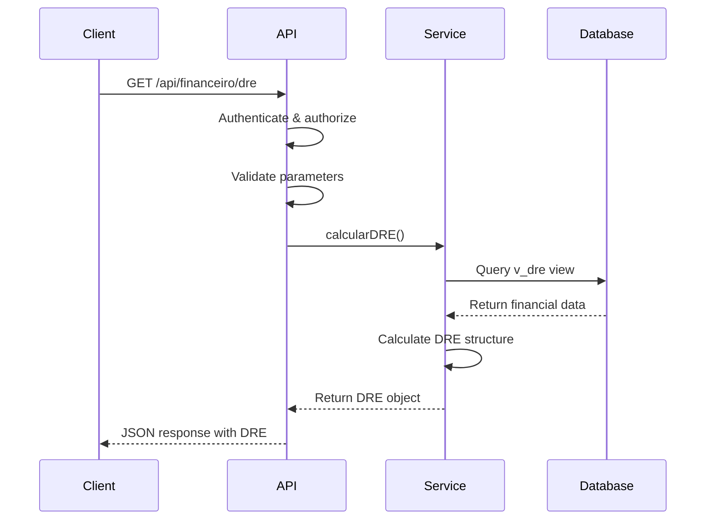
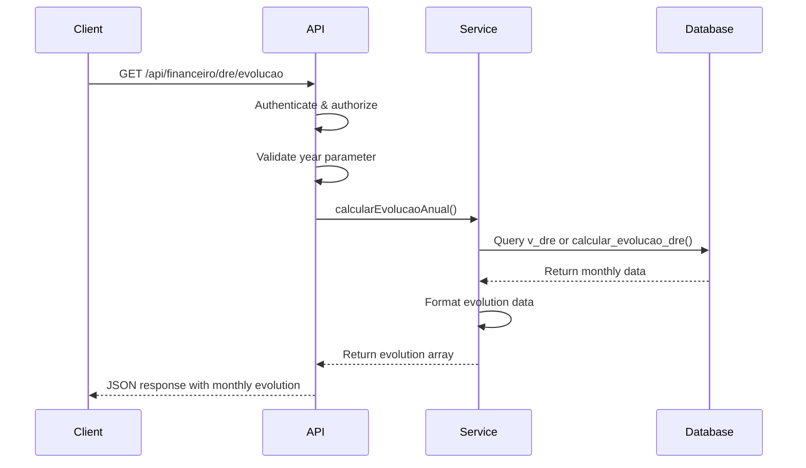
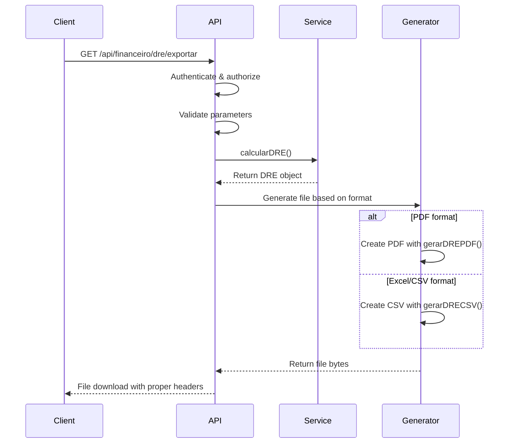
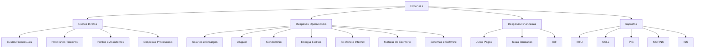
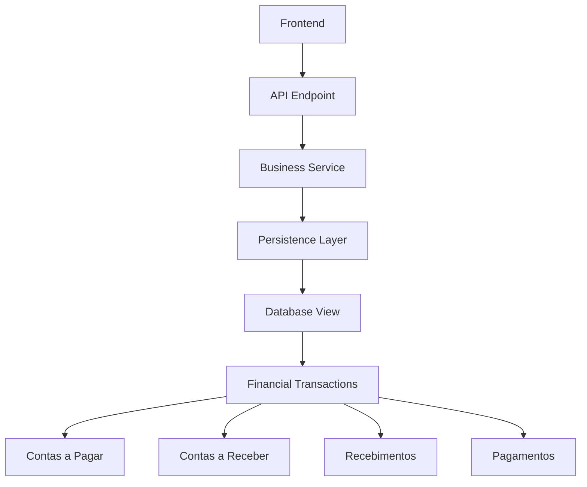

# Financial Statements (DRE)

<cite>
**Referenced Files in This Document**   
- [route.ts](file://app/api/financeiro/dre/route.ts)
- [evolucao/route.ts](file://app/api/financeiro/dre/evolucao/route.ts)
- [exportar/route.ts](file://app/api/financeiro/dre/exportar/route.ts)
- [calcular-dre.service.ts](file://backend/financeiro/dre/services/dre/calcular-dre.service.ts)
- [dre-persistence.service.ts](file://backend/financeiro/dre/services/persistence/dre-persistence.service.ts)
- [dre.types.ts](file://backend/types/financeiro/dre.types.ts)
</cite>

## Table of Contents
1. [Introduction](#introduction)
2. [API Endpoints](#api-endpoints)
3. [Request Parameters](#request-parameters)
4. [Response Schemas](#response-schemas)
5. [Financial Calculations](#financial-calculations)
6. [Export Capabilities](#export-capabilities)
7. [Implementation Details](#implementation-details)
8. [Usage Examples](#usage-examples)
9. [Common Issues](#common-issues)
10. [Integration Points](#integration-points)

## Introduction

The Financial Statements (DRE) API in the Sinesys system provides comprehensive financial reporting capabilities for law firms. The DRE (Demonstração de Resultado do Exercício) endpoints enable users to retrieve profit and loss statements, analyze financial trends, and export financial data in various formats. This documentation covers the core endpoints for financial statement generation, including detailed information about request parameters, response schemas, authentication methods, and implementation details.

The DRE system is designed to provide accurate financial insights by aggregating data from confirmed financial transactions, applying proper revenue recognition principles, and categorizing expenses according to standardized accounting practices. The API supports various reporting periods and provides comparative analysis against previous periods and budgeted amounts.

**Section sources**
- [route.ts](file://app/api/financeiro/dre/route.ts#L1-L162)
- [dre.types.ts](file://backend/types/financeiro/dre.types.ts#L1-L591)

## API Endpoints

The Sinesys DRE API provides three main endpoints for financial statement generation and analysis:

### GET /api/financeiro/dre

This endpoint generates the primary DRE (Profit and Loss Statement) for a specified period. It returns detailed financial information including revenue, expenses, and net income calculations.



**Diagram sources**
- [route.ts](file://app/api/financeiro/dre/route.ts#L87-L161)
- [calcular-dre.service.ts](file://backend/financeiro/dre/services/dre/calcular-dre.service.ts#L174-L212)

### GET /api/financeiro/dre/evolucao

This endpoint provides trend analysis of financial performance over a specific year, returning monthly evolution data for key financial metrics.



**Diagram sources**
- [evolucao/route.ts](file://app/api/financeiro/dre/evolucao/route.ts#L75-L123)
- [calcular-dre.service.ts](file://backend/financeiro/dre/services/dre/calcular-dre.service.ts#L327-L338)

### GET /api/financeiro/dre/exportar

This endpoint generates and exports the DRE in various formats (PDF, Excel, CSV) for external reporting and analysis.



**Diagram sources**
- [exportar/route.ts](file://app/api/financeiro/dre/exportar/route.ts#L480-L559)
- [calcular-dre.service.ts](file://backend/financeiro/dre/services/dre/calcular-dre.service.ts#L174-L212)

## Request Parameters

The DRE endpoints accept various parameters to customize the financial statements generated.

### Common Parameters for /api/financeiro/dre

| Parameter | Type | Required | Description | Example |
|---------|------|----------|-------------|---------|
| dataInicio | string (date) | Yes | Start date of the period (YYYY-MM-DD) | 2024-01-01 |
| dataFim | string (date) | Yes | End date of the period (YYYY-MM-DD) | 2024-12-31 |
| tipo | string | No | Type of period (mensal, trimestral, anual) | mensal |
| incluirComparativo | boolean | No | Include comparison with previous period | true |
| incluirOrcado | boolean | No | Include comparison with budgeted amounts | true |

### Parameters for /api/financeiro/dre/evolucao

| Parameter | Type | Required | Description | Example |
|---------|------|----------|-------------|---------|
| ano | integer | Yes | Year for which to retrieve evolution data | 2024 |

### Parameters for /api/financeiro/dre/exportar

| Parameter | Type | Required | Description | Example |
|---------|------|----------|-------------|---------|
| dataInicio | string (date) | Yes | Start date of the period (YYYY-MM-DD) | 2024-01-01 |
| dataFim | string (date) | Yes | End date of the period (YYYY-MM-DD) | 2024-12-31 |
| formato | string | Yes | Export format (pdf, excel, csv) | pdf |
| tipo | string | No | Type of period (mensal, trimestral, anual) | mensal |

**Section sources**
- [route.ts](file://app/api/financeiro/dre/route.ts#L27-L60)
- [evolucao/route.ts](file://app/api/financeiro/dre/evolucao/route.ts#L22-L31)
- [exportar/route.ts](file://app/api/financeiro/dre/exportar/route.ts#L439-L462)

## Response Schemas

The DRE API returns structured JSON responses with comprehensive financial data.

### DRE Response Schema

```json
{
  "success": true,
  "data": {
    "dre": {
      "periodo": {
        "dataInicio": "string",
        "dataFim": "string",
        "tipo": "mensal|trimestral|anual",
        "descricao": "string"
      },
      "resumo": {
        "receitaBruta": 0,
        "deducoes": 0,
        "receitaLiquida": 0,
        "custosDiretos": 0,
        "lucroBruto": 0,
        "despesasOperacionais": 0,
        "lucroOperacional": 0,
        "depreciacaoAmortizacao": 0,
        "ebitda": 0,
        "despesasFinanceiras": 0,
        "receitasFinanceiras": 0,
        "resultadoFinanceiro": 0,
        "resultadoAntesImposto": 0,
        "impostos": 0,
        "lucroLiquido": 0,
        "margemBruta": 0,
        "margemOperacional": 0,
        "margemLiquida": 0,
        "margemEBITDA": 0
      },
      "receitasPorCategoria": [
        {
          "categoria": "string",
          "valor": 0,
          "percentualReceita": 0,
          "itens": [
            {
              "contaContabilId": 0,
              "contaContabilCodigo": "string",
              "contaContabilNome": "string",
              "tipoConta": "receita|despesa",
              "categoria": "string",
              "valor": 0,
              "percentualReceita": 0,
              "quantidadeLancamentos": 0
            }
          ]
        }
      ],
      "despesasPorCategoria": [
        {
          "categoria": "string",
          "valor": 0,
          "percentualReceita": 0,
          "itens": [
            {
              "contaContabilId": 0,
              "contaContabilCodigo": "string",
              "contaContabilNome": "string",
              "tipoConta": "receita|despesa",
              "categoria": "string",
              "valor": 0,
              "percentualReceita": 0,
              "quantidadeLancamentos": 0
            }
          ]
        }
      ],
      "geradoEm": "string"
    },
    "comparativo": {
      "periodoAnterior": {},
      "orcado": {},
      "variacoes": {},
      "variacoesOrcado": {}
    },
    "geradoEm": "string"
  }
}
```

### Evolution Response Schema

```json
{
  "success": true,
  "data": {
    "evolucao": [
      {
        "mes": 0,
        "mesNome": "string",
        "ano": 0,
        "periodoCompleto": "string",
        "receitaLiquida": 0,
        "lucroOperacional": 0,
        "lucroLiquido": 0,
        "margemLiquida": 0
      }
    ],
    "ano": 0,
    "geradoEm": "string"
  }
}
```

**Section sources**
- [dre.types.ts](file://backend/types/financeiro/dre.types.ts#L100-L111)
- [dre.types.ts](file://backend/types/financeiro/dre.types.ts#L207-L211)

## Financial Calculations

The DRE system implements comprehensive financial calculations following standard accounting principles.

### Revenue Recognition

Revenue is recognized based on the accrual accounting method, where income is recorded when earned rather than when cash is received. The system categorizes revenue into several types:

- Honorários Advocatícios (Legal Fees)
- Honorários Sucumbência (Contingency Fees)
- Êxito Processual (Success Fees)
- Consultoria (Consulting Services)
- Receitas Financeiras (Financial Income)
- Outras Receitas (Other Income)

Revenue recognition follows the principle that income is recognized when services are rendered, regardless of payment timing.

### Expense Categorization

Expenses are categorized according to standardized accounting practices:



**Diagram sources**
- [dre.types.ts](file://backend/types/financeiro/dre.types.ts#L495-L521)
- [dre.types.ts](file://backend/types/financeiro/dre.types.ts#L506-L521)

### Key Financial Metrics

The DRE calculates several key financial metrics:

**Margem Bruta (Gross Margin)**
```
Margem Bruta = (Lucro Bruto / Receita Líquida) * 100
```

**Margem Operacional (Operating Margin)**
```
Margem Operacional = (Lucro Operacional / Receita Líquida) * 100
```

**EBITDA**
```
EBITDA = Lucro Operacional + Depreciação + Amortização
```

**Margem Líquida (Net Margin)**
```
Margem Líquida = (Lucro Líquido / Receita Líquida) * 100
```

**Section sources**
- [calcular-dre.service.ts](file://backend/financeiro/dre/services/dre/calcular-dre.service.ts#L101-L127)
- [dre.types.ts](file://backend/types/financeiro/dre.types.ts#L354-L357)

## Export Capabilities

The DRE export endpoint supports multiple formats for external reporting and analysis.

### PDF Export

The PDF export generates a professional-looking financial statement with proper formatting, including:

- Company header and branding
- Period information and generation timestamp
- Structured DRE with proper indentation and highlighting
- Summary of margins
- Footer with system information

The PDF is generated using the pdf-lib library with Helvetica font and A4 page size.

### Excel/CSV Export

The Excel and CSV exports provide tabular data that can be easily imported into spreadsheet applications:

- UTF-8 encoding with BOM for proper character display
- Comma-separated values with proper escaping
- Header rows with descriptive column names
- Currency formatting for financial values
- Percentage calculations for margins

The CSV format is compatible with Microsoft Excel and other spreadsheet applications.

### File Naming Convention

Exported files follow a standardized naming convention:
```
dre_{descricao_periodo}_{data_inicio}_{data_fim}.{formato}
```

Special characters are sanitized from filenames to ensure compatibility across different operating systems.

**Section sources**
- [exportar/route.ts](file://app/api/financeiro/dre/exportar/route.ts#L529-L552)
- [exportar/route.ts](file://app/api/financeiro/dre/exportar/route.ts#L53-L55)

## Implementation Details

The DRE system is implemented with a layered architecture that separates concerns and ensures maintainability.

### Data Flow Architecture



**Diagram sources**
- [route.ts](file://app/api/financeiro/dre/route.ts#L87-L161)
- [calcular-dre.service.ts](file://backend/financeiro/dre/services/dre/calcular-dre.service.ts#L174-L212)
- [dre-persistence.service.ts](file://backend/financeiro/dre/services/persistence/dre-persistence.service.ts#L68-L137)

### Database Structure

The DRE system relies on a materialized view `v_dre` in the database that aggregates financial data:

- **Source**: Financial transactions from contas a pagar and contas a receber
- **Aggregation**: By year, month, account code, and category
- **Refresh**: Periodically updated via the `refresh_v_dre()` function
- **Indexes**: Optimized for queries by year, month, and period

The materialized view improves performance by pre-calculating aggregations rather than computing them on each request.

### Caching Strategy

The DRE system implements a Redis-based caching strategy to improve performance:

- **Cache TTL**: 10 minutes for standard DRE data
- **Cache TTL**: 15 minutes for evolution data (changes less frequently)
- **Cache Invalidation**: Triggered when financial transactions are confirmed or canceled
- **Cache Keys**: Generated based on period parameters for proper cache hit/miss

This caching strategy reduces database load and improves response times for frequently accessed financial periods.

**Section sources**
- [dre-persistence.service.ts](file://backend/financeiro/dre/services/persistence/dre-persistence.service.ts#L32-L35)
- [dre-persistence.service.ts](file://backend/financeiro/dre/services/persistence/dre-persistence.service.ts#L72-L76)

## Usage Examples

### Frontend Dashboard Integration

The frontend dashboard visualizes monthly financial performance using the DRE evolution endpoint:

```typescript
// Example hook for fetching DRE data
const useDRE = (params: UseDREParams): UseDREResult => {
  const [dre, setDRE] = useState<DRE | null>(null);
  const [isLoading, setIsLoading] = useState(true);
  const [error, setError] = useState<string | null>(null);

  const fetchDRE = useCallback(async () => {
    setIsLoading(true);
    try {
      const response = await fetch(`/api/financeiro/dre?${new URLSearchParams({
        dataInicio: params.dataInicio,
        dataFim: params.dataFim,
        tipo: params.tipo || '',
        incluirComparativo: String(params.incluirComparativo || false),
        incluirOrcado: String(params.incluirOrcado || false),
      })}`);
      
      const data: DREApiResponse = await response.json();
      
      if (!data.success) {
        throw new Error(data.error || 'Failed to fetch DRE');
      }
      
      setDRE(data.data.dre);
    } catch (err) {
      setError(err instanceof Error ? err.message : 'Unknown error');
    } finally {
      setIsLoading(false);
    }
  }, [params]);

  useEffect(() => {
    fetchDRE();
  }, [fetchDRE]);

  return {
    dre,
    comparativo: data.data.comparativo || null,
    isLoading,
    error,
    refetch: fetchDRE,
  };
};
```

### Financial Trend Analysis

The evolution endpoint is used to create monthly trend charts:

```javascript
// Example of processing evolution data for a chart
const processEvolucaoData = (evolucao: EvolucaoDRE[]) => {
  return evolucao.map(item => ({
    month: item.mesNome,
    'Receita Líquida': item.receitaLiquida,
    'Lucro Operacional': item.lucroOperacional,
    'Lucro Líquido': item.lucroLiquido,
    'Margem Líquida': item.margemLiquida
  }));
};
```

### Export Integration

The export functionality can be integrated with external reporting tools:

```javascript
// Example of triggering DRE export
const exportDRE = async (dataInicio, dataFim, formato) => {
  const url = `/api/financeiro/dre/exportar?dataInicio=${dataInicio}&dataFim=${dataFim}&formato=${formato}`;
  const response = await fetch(url);
  
  if (response.ok) {
    const blob = await response.blob();
    const link = document.createElement('a');
    link.href = URL.createObjectURL(blob);
    link.download = `dre_${dataInicio}_${dataFim}.${formato}`;
    link.click();
  }
};
```

**Section sources**
- [use-dre.ts](file://app/_lib/hooks/use-dre.ts#L7-L67)
- [route.ts](file://app/api/financeiro/dre/route.ts#L87-L161)

## Common Issues

### Period-End Closing Procedures

When closing a financial period, ensure all transactions are properly recorded and confirmed. The DRE system only includes confirmed transactions, so any pending or draft entries will not be reflected in the financial statements.

### Accrual Accounting Adjustments

For accurate financial reporting, make accrual adjustments at period-end for:

- Unbilled services rendered
- Accrued expenses not yet invoiced
- Prepaid expenses that should be amortized
- Revenue recognition for long-term contracts

These adjustments should be recorded as journal entries before generating the DRE.

### Multi-Currency Transactions

The DRE system currently assumes a single currency (BRL). For firms handling multi-currency transactions:

- Convert all foreign currency amounts to BRL at the transaction date exchange rate
- Record the exchange rate used for each transaction
- Consider currency translation gains/losses as financial income/expenses
- Document the currency conversion methodology for audit purposes

### Data Synchronization Issues

If financial data appears inconsistent between the DRE and transaction records:

1. Check if the materialized view `v_dre` has been refreshed
2. Verify that all transactions have been confirmed (not in draft status)
3. Ensure the cache has been properly invalidated after transaction updates
4. Run the `refresh_v_dre()` function manually if needed

**Section sources**
- [dre-persistence.service.ts](file://backend/financeiro/dre/services/persistence/dre-persistence.service.ts#L449-L467)
- [dre-persistence.service.ts](file://backend/financeiro/dre/services/persistence/dre-persistence.service.ts#L474-L495)

## Integration Points

The DRE system integrates with several other components of the Sinesys platform:

### Chart of Accounts

The DRE relies on a properly configured chart of accounts where each account is classified into appropriate categories for DRE reporting. The classification is based on the account's category field, which determines how transactions are grouped in the financial statement.

### Budgeting System

The DRE can compare actual results against budgeted amounts when the `incluirOrcado` parameter is set to true. This integration requires that budgets have been created and approved in the system for the relevant periods.

### Financial Transaction Modules

The DRE data is sourced from multiple financial transaction modules:

- **Contas a Receber**: Records revenue and receivables
- **Contas a Pagar**: Records expenses and payables
- **Conciliação Bancária**: Provides bank transaction data
- **Recebimentos**: Records actual cash receipts
- **Pagamentos**: Records actual cash payments

Changes in these modules trigger cache invalidation to ensure the DRE reflects the most current data.

### Reporting Dashboard

The DRE data is consumed by the financial dashboard to provide visualizations of key performance indicators, including:

- Monthly revenue trends
- Profitability margins over time
- Expense composition analysis
- Comparative performance against previous periods

**Section sources**
- [dre-persistence.service.ts](file://backend/financeiro/dre/services/persistence/dre-persistence.service.ts#L284-L358)
- [calcular-dre.service.ts](file://backend/financeiro/dre/services/dre/calcular-dre.service.ts#L296-L305)