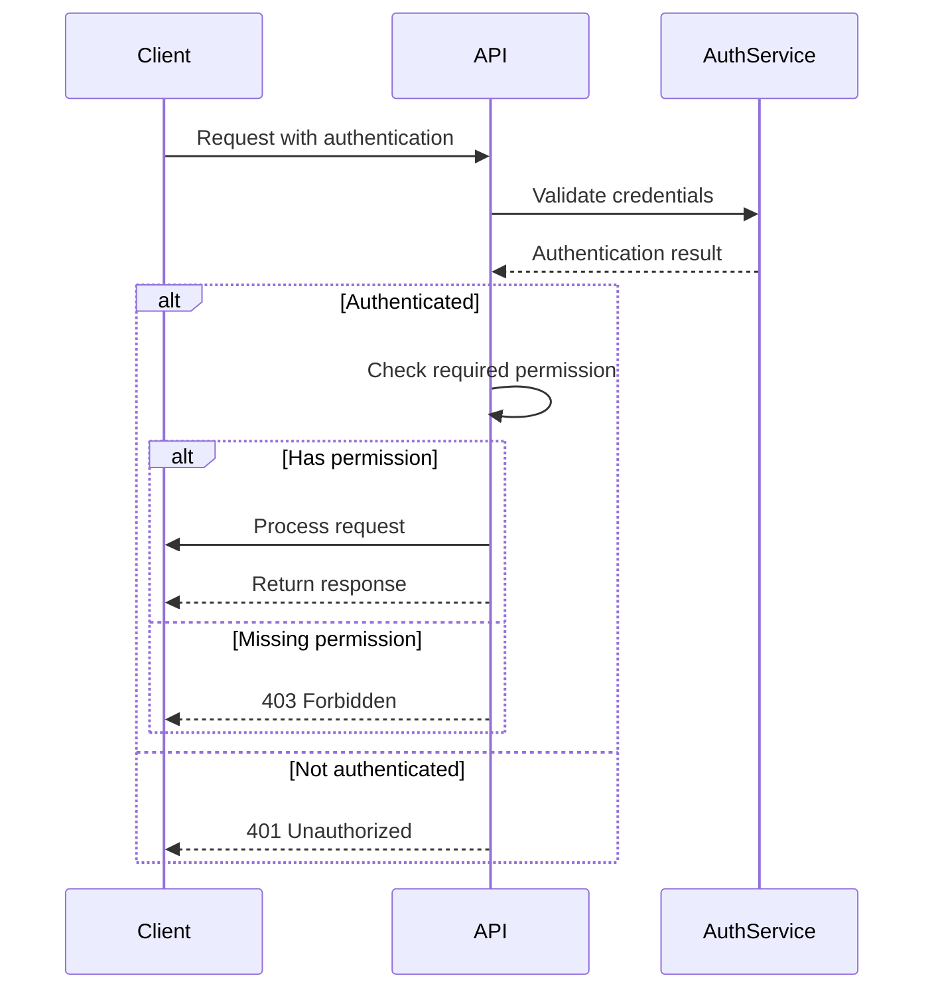
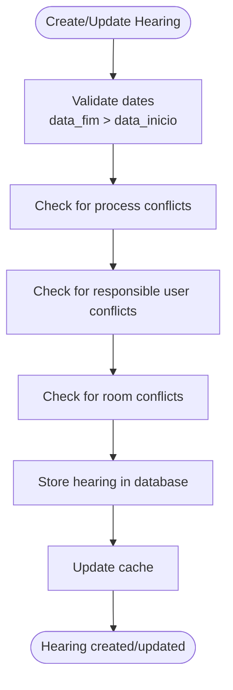
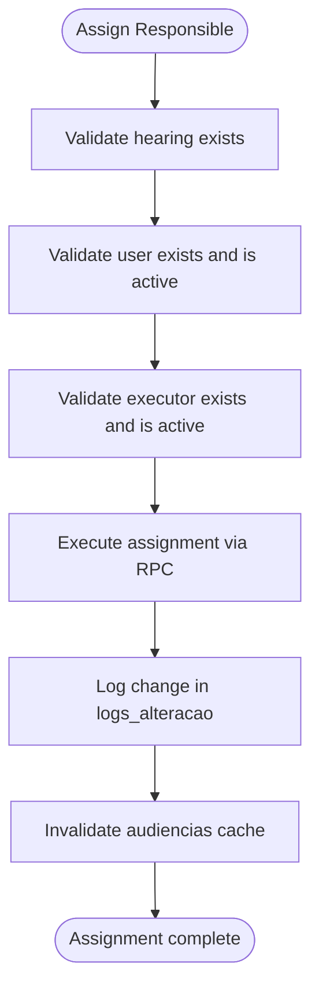
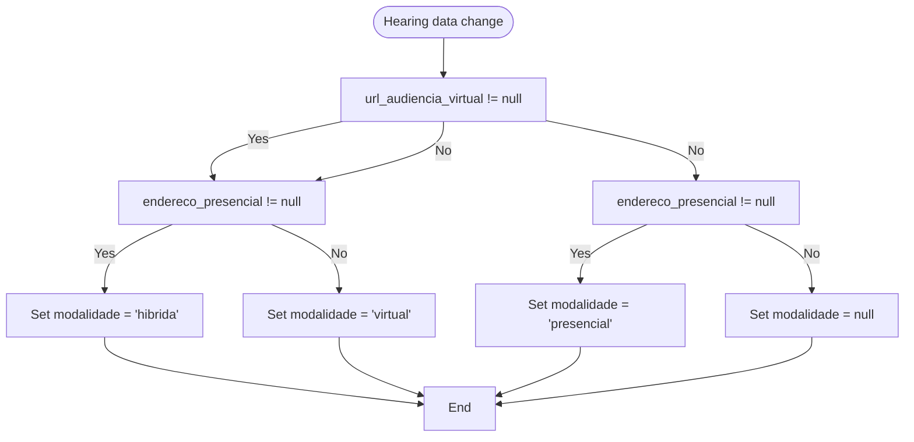
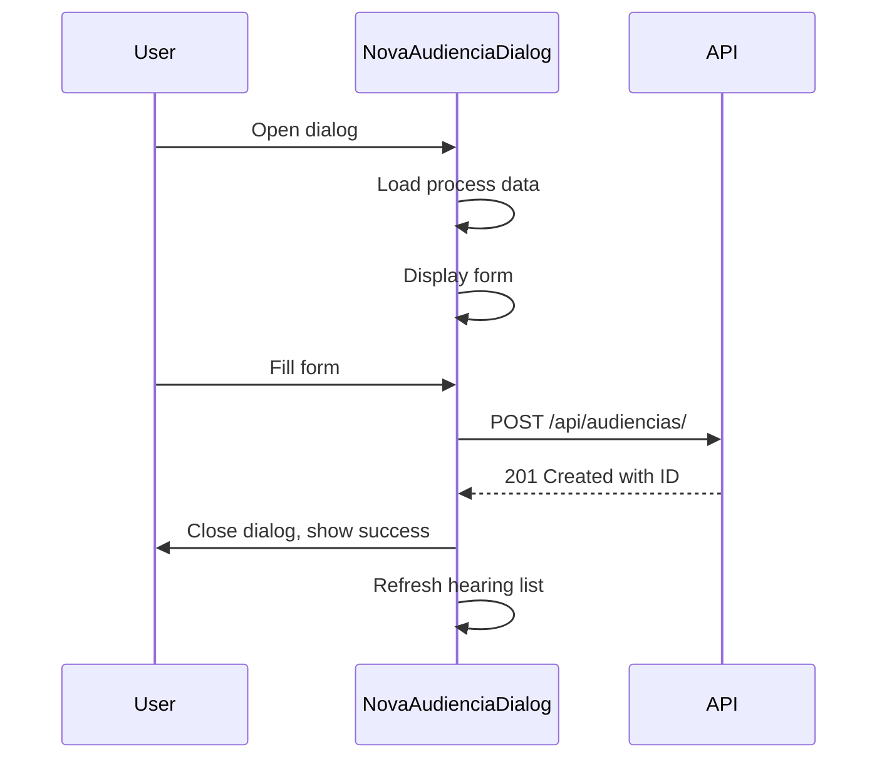
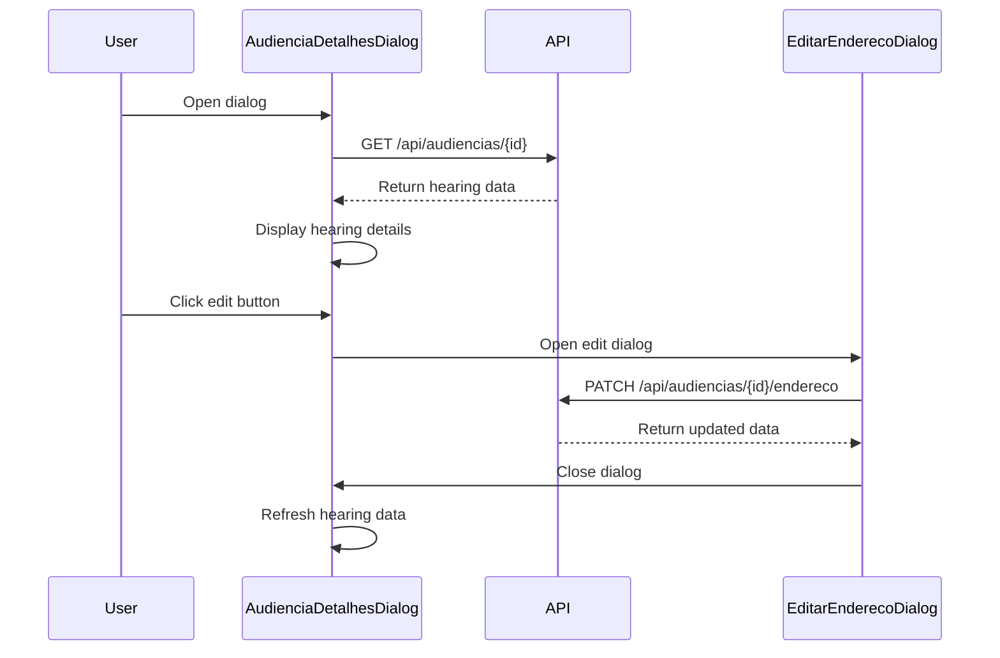
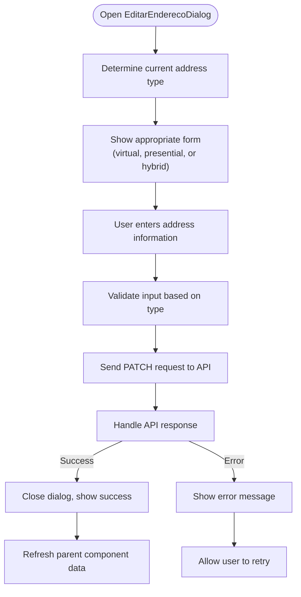

# Hearing Management API

<cite>
**Referenced Files in This Document**   
- [route.ts](file://app/api/audiencias/route.ts)
- [criar-audiencia.service.ts](file://backend/audiencias/services/criar-audiencia.service.ts)
- [listar-audiencias.service.ts](file://backend/audiencias/services/listar-audiencias.service.ts)
- [buscar-audiencias-cliente-cpf.service.ts](file://backend/audiencias/services/buscar-audiencias-cliente-cpf.service.ts)
- [atualizar-url-virtual.service.ts](file://backend/audiencias/services/atualizar-url-virtual.service.ts)
- [atribuir-responsavel.service.ts](file://backend/audiencias/services/atribuir-responsavel.service.ts)
- [endereco/route.ts](file://app/api/audiencias/[id]/endereco/route.ts)
- [url-virtual/route.ts](file://app/api/audiencias/[id]/url-virtual/route.ts)
- [observacoes/route.ts](file://app/api/audiencias/[id]/observacoes/route.ts)
- [responsavel/route.ts](file://app/api/audiencias/[id]/responsavel/route.ts)
- [cliente/cpf/[cpf]/route.ts](file://app/api/audiencias/cliente/cpf/[cpf]/route.ts)
- [audiencias.ts](file://types/domain/audiencias.ts)
- [audiencias.ts](file://types/contracts/audiencias.ts)
- [nova-audiencia-dialog.tsx](file://app/(dashboard)/audiencias/components/nova-audiencia-dialog.tsx)
- [audiencia-detalhes-dialog.tsx](file://app/(dashboard)/audiencias/components/audiencia-detalhes-dialog.tsx)
- [editar-endereco-dialog.tsx](file://app/(dashboard)/audiencias/components/editar-endereco-dialog.tsx)
</cite>

## Table of Contents
1. [Introduction](#introduction)
2. [Core Endpoints](#core-endpoints)
3. [Specialized Update Endpoints](#specialized-update-endpoints)
4. [Request/Response Schemas](#requestresponse-schemas)
5. [Authentication and Permissions](#authentication-and-permissions)
6. [Business Rules and Validation](#business-rules-and-validation)
7. [Frontend Component Integration](#frontend-component-integration)
8. [Error Handling](#error-handling)
9. [Common Use Cases](#common-use-cases)

## Introduction

The Hearing Management API in the Sinesys system provides comprehensive functionality for managing judicial hearings across various modalities (virtual, presential, hybrid). This API enables users to create, retrieve, update, and delete hearing records, with specialized endpoints for managing specific hearing attributes. The system supports both manually created hearings and those captured from external systems like PJE.

The API is designed with RESTful principles, using standard HTTP methods and status codes. It provides robust filtering, pagination, and sorting capabilities for retrieving hearing data. Specialized endpoints allow for granular updates to specific hearing attributes without requiring full resource updates.

This documentation covers all aspects of the `/api/audiencias/` endpoints, including CRUD operations, specialized attribute updates, request/response schemas, authentication requirements, business rules, and integration with frontend components.

## Core Endpoints

The Hearing Management API provides standard CRUD operations through the main `/api/audiencias/` endpoint.

### POST /api/audiencias/ - Create Hearing

Creates a new hearing record in the system. This endpoint is used for manually creating hearings that are not captured from external systems.

**Authentication**: Required (bearerAuth, sessionAuth, or serviceApiKey)  
**Permission**: `audiencias.criar`  
**Request Method**: POST  
**Content-Type**: application/json

**Request Payload**:
```json
{
  "processo_id": 123,
  "advogado_id": 456,
  "data_inicio": "2025-03-15T14:00:00Z",
  "data_fim": "2025-03-15T15:00:00Z",
  "tipo_audiencia_id": 789,
  "sala_audiencia_id": 101,
  "url_audiencia_virtual": "https://meet.google.com/abc-defg-hij",
  "endereco_presencial": {
    "logradouro": "Rua das Palmeiras",
    "numero": "123",
    "complemento": "Sala 501",
    "bairro": "Centro",
    "cidade": "São Paulo",
    "estado": "SP",
    "pais": "Brasil",
    "cep": "01000-000"
  },
  "observacoes": "Reunião de conciliação",
  "responsavel_id": 202
}
```

**Response**:
```json
{
  "success": true,
  "data": {
    "id": 303
  }
}
```

**Business Rules**:
- The `processo_id` must reference an existing process in the `acervo` table
- The `tipo_audiencia_id` must reference an existing hearing type
- The `sala_audiencia_id` must reference an existing hearing room
- The `data_fim` must be after `data_inicio`
- Manually created hearings have `id_pje = 0` to distinguish them from captured hearings

**Section sources**
- [route.ts](file://app/api/audiencias/route.ts#L315-L499)
- [criar-audiencia.service.ts](file://backend/audiencias/services/criar-audiencia.service.ts#L1-L110)

### GET /api/audiencias/ - List Hearings

Retrieves a paginated list of hearings with comprehensive filtering and sorting capabilities.

**Authentication**: Required (bearerAuth, sessionAuth, or serviceApiKey)  
**Permission**: `audiencias.visualizar`  
**Request Method**: GET

**Query Parameters**:
| Parameter | Type | Description | Example |
|---------|------|-------------|---------|
| pagina | integer | Page number (1-based) | `pagina=1` |
| limite | integer | Items per page (1-1000) | `limite=50` |
| trt | string | Filter by TRT code | `trt=TRT3` |
| grau | string | Filter by process degree | `grau=primeiro_grau` |
| responsavel_id | number/string | Filter by responsible user ID | `responsavel_id=123` or `responsavel_id=null` |
| sem_responsavel | boolean | Filter for hearings without responsible | `sem_responsavel=true` |
| busca | string | Text search across multiple fields | `busca=joão` |
| numero_processo | string | Filter by process number (partial) | `numero_processo=0001234` |
| polo_ativo_nome | string | Filter by plaintiff name (partial) | `polo_ativo_nome=silva` |
| polo_passivo_nome | string | Filter by defendant name (partial) | `polo_passivo_nome=empresa` |
| status | string | Filter by status (M=Marked, F=Realized, C=Cancelled) | `status=M` |
| modalidade | string | Filter by modality | `modalidade=virtual` |
| tipo_descricao | string | Filter by hearing type description (partial) | `tipo_descricao=instrução` |
| tipo_codigo | string | Filter by hearing type code | `tipo_codigo=UNA` |
| tipo_is_virtual | boolean | Filter by virtual hearing status | `tipo_is_virtual=true` |
| data_inicio_inicio | date | Start date for filtering by start date | `data_inicio_inicio=2025-03-01` |
| data_inicio_fim | date | End date for filtering by start date | `data_inicio_fim=2025-03-31` |
| data_fim_inicio | date | Start date for filtering by end date | `data_fim_inicio=2025-03-01` |
| data_fim_fim | date | End date for filtering by end date | `data_fim_fim=2025-03-31` |
| ordenar_por | string | Field to sort by | `ordenar_por=data_inicio` |
| ordem | string | Sort direction | `ordem=asc` |

**Response**:
```json
{
  "success": true,
  "data": {
    "audiencias": [
      {
        "id": 303,
        "id_pje": 0,
        "processo_id": 123,
        "data_inicio": "2025-03-15T14:00:00Z",
        "data_fim": "2025-03-15T15:00:00Z",
        "modalidade": "virtual",
        "status": "M",
        "numero_processo": "0001234-56.2024.5.03.0001",
        "tipo_descricao": "Audiência de Instrução",
        "url_audiencia_virtual": "https://meet.google.com/abc-defg-hij",
        "responsavel_id": 202,
        "observacoes": "Reunião de conciliação"
      }
    ],
    "paginacao": {
      "pagina": 1,
      "limite": 50,
      "total": 1,
      "totalPaginas": 1
    }
  }
}
```

**Section sources**
- [route.ts](file://app/api/audiencias/route.ts#L225-L313)
- [listar-audiencias.service.ts](file://backend/audiencias/services/listar-audiencias.service.ts#L1-L272)

### GET /api/audiencias/cliente/cpf/{cpf} - List Hearings by Client CPF

Retrieves all hearings associated with a client identified by their CPF. This endpoint is optimized for consumption by the WhatsApp Agent IA.

**Authentication**: Required (bearerAuth or apiKeyAuth)  
**Request Method**: GET  
**Path Parameter**: `cpf` (client's CPF, with or without punctuation)

**Response**:
```json
{
  "success": true,
  "data": {
    "cliente": {
      "nome": "João da Silva",
      "cpf": "123.456.789-01"
    },
    "resumo": {
      "total_audiencias": 5,
      "futuras": 2,
      "realizadas": 2,
      "canceladas": 1
    },
    "audiencias": [
      {
        "numero_processo": "0001234-56.2024.5.03.0001",
        "tipo": "Audiência de Instrução",
        "data": "15/03/2025",
        "horario": "14:00 - 15:00",
        "modalidade": "Virtual",
        "status": "Designada",
        "local": {
          "tipo": "virtual",
          "url_virtual": "https://zoom.us/j/123456789",
          "endereco": null,
          "sala": null,
          "presenca_hibrida": null
        },
        "partes": {
          "polo_ativo": "João da Silva",
          "polo_passivo": "Empresa XYZ Ltda"
        },
        "papel_cliente": "Reclamante",
        "parte_contraria": "Empresa XYZ Ltda",
        "tribunal": "TRT da 3ª Região (MG)",
        "vara": "1ª Vara do Trabalho de Belo Horizonte",
        "sigilo": false,
        "observacoes": "Cliente solicitou adiamento"
      }
    ]
  }
}
```

**Section sources**
- [cliente/cpf/[cpf]/route.ts](file://app/api/audiencias/cliente/cpf/[cpf]/route.ts#L1-L254)
- [buscar-audiencias-cliente-cpf.service.ts](file://backend/audiencias/services/buscar-audiencias-cliente-cpf.service.ts#L1-L406)

## Specialized Update Endpoints

The Hearing Management API provides specialized endpoints for updating specific hearing attributes without requiring full resource updates.

### PATCH /api/audiencias/{id}/endereco - Update Hearing Address

Updates the address information for a hearing, which can be a virtual URL, physical address, or both for hybrid hearings.

**Authentication**: Required (bearerAuth, sessionAuth, or serviceApiKey)  
**Permission**: `audiencias.editar`  
**Request Method**: PATCH  
**Path Parameter**: `id` (hearing ID)

**Request Payload**:
```json
{
  "tipo": "virtual",
  "urlAudienciaVirtual": "https://meet.google.com/abc-defg-hij"
}
```

```json
{
  "tipo": "presencial",
  "enderecoPresencial": {
    "logradouro": "Rua das Palmeiras",
    "numero": "123",
    "complemento": "Sala 501",
    "bairro": "Centro",
    "cidade": "São Paulo",
    "estado": "SP",
    "pais": "Brasil",
    "cep": "01000-000"
  }
}
```

```json
{
  "tipo": "hibrida",
  "urlAudienciaVirtual": "https://meet.google.com/abc-defg-hij",
  "enderecoPresencial": {
    "logradouro": "Rua das Palmeiras",
    "numero": "123",
    "complemento": "Sala 501",
    "bairro": "Centro",
    "cidade": "São Paulo",
    "estado": "SP",
    "pais": "Brasil",
    "cep": "01000-000"
  },
  "presencaHibrida": "advogado"
}
```

**Response**:
```json
{
  "success": true,
  "message": "Hearing address updated successfully",
  "data": {
    "id": 303,
    "url_audiencia_virtual": "https://meet.google.com/abc-defg-hij",
    "endereco_presencial": null,
    "modalidade": "virtual",
    "presenca_hibrida": null
  }
}
```

**Business Rules**:
- For virtual hearings: URL is required, physical address is cleared
- For presential hearings: At least logradouro or cidade must be provided, URL is cleared
- For hybrid hearings: Both URL and physical address are required, presencaHibrida must be specified
- The country is always set to "Brasil" for physical addresses

**Section sources**
- [endereco/route.ts](file://app/api/audiencias/[id]/endereco/route.ts#L1-L273)

### PATCH /api/audiencias/{id}/url-virtual - Update Virtual Hearing URL

Updates the virtual hearing URL for a specific hearing.

**Authentication**: Required (bearerAuth, sessionAuth, or serviceApiKey)  
**Permission**: `audiencias.editar_url_virtual`  
**Request Method**: PATCH  
**Path Parameter**: `id` (hearing ID)

**Request Payload**:
```json
{
  "urlAudienciaVirtual": "https://meet.google.com/abc-defg-hij"
}
```

```json
{
  "urlAudienciaVirtual": null
}
```

**Response**:
```json
{
  "success": true,
  "message": "Virtual hearing URL updated successfully",
  "data": {
    "id": 303,
    "url_audiencia_virtual": "https://meet.google.com/abc-defg-hij"
  }
}
```

**Section sources**
- [url-virtual/route.ts](file://app/api/audiencias/[id]/url-virtual/route.ts#L1-L132)
- [atualizar-url-virtual.service.ts](file://backend/audiencias/services/atualizar-url-virtual.service.ts#L1-L65)

### PATCH /api/audiencias/{id}/observacoes - Update Hearing Observations

Updates the observations for a specific hearing.

**Authentication**: Required (bearerAuth, sessionAuth, or serviceApiKey)  
**Permission**: `audiencias.editar`  
**Request Method**: PATCH  
**Path Parameter**: `id` (hearing ID)

**Request Payload**:
```json
{
  "observacoes": "Cliente solicitou adiamento"
}
```

```json
{
  "observacoes": null
}
```

**Response**:
```json
{
  "success": true,
  "message": "Hearing observations updated successfully",
  "data": {
    "id": 303,
    "observacoes": "Cliente solicitou adiamento"
  }
}
```

**Section sources**
- [observacoes/route.ts](file://app/api/audiencias/[id]/observacoes/route.ts#L1-L160)

### PATCH /api/audiencias/{id}/responsavel - Assign Hearing Responsible

Assigns, transfers, or unassigns a responsible user for a hearing.

**Authentication**: Required (bearerAuth, sessionAuth, or serviceApiKey)  
**Permission**: `audiencias.atribuir_responsavel`  
**Request Method**: PATCH  
**Path Parameter**: `id` (hearing ID)

**Request Payload**:
```json
{
  "responsavelId": 202
}
```

```json
{
  "responsavelId": null
}
```

**Response**:
```json
{
  "success": true,
  "data": {
    "id": 303,
    "responsavel_id": 202
  }
}
```

**Business Rules**:
- The hearing must exist
- The responsible user must exist and be active
- The user executing the action must exist and be active
- All changes are automatically logged in logs_alteracao

**Section sources**
- [responsavel/route.ts](file://app/api/audiencias/[id]/responsavel/route.ts#L1-L150)
- [atribuir-responsavel.service.ts](file://backend/audiencias/services/atribuir-responsavel.service.ts#L1-L156)

## Request/Response Schemas

### Audiencia Interface

The core data structure representing a hearing in the system.

```typescript
interface Audiencia {
  id: number;
  id_pje: number;
  advogado_id: number;
  processo_id: number;
  orgao_julgador_id: number | null;
  orgao_julgador_descricao: string | null;
  trt: string;
  grau: 'primeiro_grau' | 'segundo_grau';
  numero_processo: string;
  classe_judicial: string | null;
  classe_judicial_id: number | null;
  data_inicio: string; // ISO timestamp
  data_fim: string; // ISO timestamp
  hora_inicio: string | null;
  hora_fim: string | null;
  modalidade: 'virtual' | 'presencial' | 'hibrida' | null;
  presenca_hibrida: 'advogado' | 'cliente' | null;
  sala_audiencia_nome: string | null;
  sala_audiencia_id: number | null;
  status: string;
  status_descricao: string | null;
  tipo_audiencia_id: number | null;
  tipo_descricao: string | null;
  tipo_codigo: string | null;
  tipo_is_virtual: boolean;
  designada: boolean;
  em_andamento: boolean;
  documento_ativo: boolean;
  nome_parte_autora: string | null;
  nome_parte_re: string | null;
  polo_ativo_nome: string | null;
  polo_passivo_nome: string | null;
  url_audiencia_virtual: string | null;
  url_ata_audiencia: string | null;
  ata_audiencia_id: number | null;
  endereco_presencial: {
    logradouro?: string;
    numero?: string;
    complemento?: string;
    bairro?: string;
    cidade?: string;
    estado?: string;
    pais?: string;
    cep?: string;
  } | null;
  responsavel_id: number | null;
  observacoes: string | null;
  dados_anteriores: Record<string, unknown> | null;
  created_at: string; // ISO timestamp
  updated_at: string; // ISO timestamp
}
```

**Section sources**
- [audiencias.ts](file://types/domain/audiencias.ts#L1-L77)

### CriarAudienciaParams Interface

The request payload structure for creating a new hearing.

```typescript
interface CriarAudienciaParams {
  processo_id: number;
  advogado_id: number;
  data_inicio: string;
  data_fim: string;
  tipo_audiencia_id?: number;
  sala_audiencia_id?: number;
  url_audiencia_virtual?: string;
  endereco_presencial?: {
    logradouro?: string;
    numero?: string;
    complemento?: string;
    bairro?: string;
    cidade?: string;
    estado?: string;
    pais?: string;
    cep?: string;
  };
  observacoes?: string;
  responsavel_id?: number;
}
```

**Section sources**
- [audiencias.ts](file://types/contracts/audiencias.ts#L85-L105)

## Authentication and Permissions

The Hearing Management API implements a robust authentication and authorization system to ensure data security and proper access control.

### Authentication Methods

The API supports three authentication methods:

1. **Bearer Token (bearerAuth)**: JWT token in the Authorization header
2. **Session Cookie (sessionAuth)**: Session-based authentication
3. **Service API Key (serviceApiKey)**: API key for service-to-service communication

### Permission System

The API uses a granular permission system with specific permissions for different operations:

| Permission | Required For | Description |
|----------|-------------|-------------|
| `audiencias.visualizar` | GET /api/audiencias/ | View hearings |
| `audiencias.criar` | POST /api/audiencias/ | Create new hearings |
| `audiencias.editar` | PATCH /api/audiencias/{id}/endereco, PATCH /api/audiencias/{id}/observacoes | Edit hearing details |
| `audiencias.editar_url_virtual` | PATCH /api/audiencias/{id}/url-virtual | Edit virtual hearing URL |
| `audiencias.atribuir_responsavel` | PATCH /api/audiencias/{id}/responsavel | Assign hearing responsible |

### Authentication Flow



**Diagram sources**
- [route.ts](file://app/api/audiencias/route.ts#L5)
- [require-permission.ts](file://backend/auth/require-permission.ts)

## Business Rules and Validation

The Hearing Management API enforces several business rules and validation checks to maintain data integrity and consistency.

### Scheduling Conflict Detection

When creating or updating a hearing, the system checks for scheduling conflicts with existing hearings for the same process or responsible user.



**Diagram sources**
- [criar-audiencia.service.ts](file://backend/audiencias/services/criar-audiencia.service.ts#L9)
- [listar-audiencias.service.ts](file://backend/audiencias/services/listar-audiencias.service.ts#L77)

### Responsible User Validation

When assigning a responsible user to a hearing, the system validates that both the hearing and the user exist and are active.



**Diagram sources**
- [atribuir-responsavel.service.ts](file://backend/audiencias/services/atribuir-responsavel.service.ts#L91-L156)

### Modalidade Calculation

The hearing modality (virtual, presencial, hibrida) is automatically calculated by a database trigger based on the presence of virtual URL, physical address, and type.



**Diagram sources**
- [endereco/route.ts](file://app/api/audiencias/[id]/endereco/route.ts#L115-L215)

## Frontend Component Integration

The Hearing Management API is integrated with several frontend components that provide user interfaces for managing hearings.

### NovaAudienciaDialog Component

The `NovaAudienciaDialog` component provides a form for creating new hearings through the POST /api/audiencias/ endpoint.



**Section sources**
- [nova-audiencia-dialog.tsx](file://app/(dashboard)/audiencias/components/nova-audiencia-dialog.tsx)

### AudienciaDetalhesDialog Component

The `AudienciaDetalhesDialog` component displays detailed information about a hearing and allows updates to various attributes through the specialized PATCH endpoints.



**Section sources**
- [audiencia-detalhes-dialog.tsx](file://app/(dashboard)/audiencias/components/audiencia-detalhes-dialog.tsx)

### EditarEnderecoDialog Component

The `EditarEnderecoDialog` component provides a form for updating the hearing address through the PATCH /api/audiencias/{id}/endereco endpoint.



**Section sources**
- [editar-endereco-dialog.tsx](file://app/(dashboard)/audiencias/components/editar-endereco-dialog.tsx)

## Error Handling

The Hearing Management API provides comprehensive error handling with descriptive error messages and appropriate HTTP status codes.

### Error Response Structure

All error responses follow a consistent structure:

```json
{
  "error": {
    "code": "ERROR_CODE",
    "message": "Descriptive error message"
  }
}
```

### Common Error Codes

| HTTP Status | Error Code | Message | Cause |
|-----------|------------|---------|-------|
| 400 | BAD_REQUEST | Descriptive message | Invalid request parameters |
| 401 | UNAUTHORIZED | Unauthorized | Missing or invalid authentication |
| 403 | FORBIDDEN | Forbidden | Missing required permission |
| 404 | NOT_FOUND | Audiência não encontrada | Hearing with specified ID not found |
| 422 | UNPROCESSABLE_ENTITY | Descriptive message | Validation failed |
| 500 | INTERNAL | Erro interno do servidor | Internal server error |

### Validation Error Examples

**Invalid dates**:
```json
{
  "error": {
    "code": "BAD_REQUEST",
    "message": "data_fim deve ser posterior a data_inicio"
  }
}
```

**Invalid URL**:
```json
{
  "error": {
    "code": "BAD_REQUEST",
    "message": "URL inválida. Use o formato: https://exemplo.com"
  }
}
```

**Missing required field**:
```json
{
  "error": {
    "code": "BAD_REQUEST",
    "message": "Campo processo_id é obrigatório e deve ser um número"
  }
}
```

**Section sources**
- [route.ts](file://app/api/audiencias/route.ts#L308-L312)
- [endereco/route.ts](file://app/api/audiencias/[id]/endereco/route.ts#L249-L271)

## Common Use Cases

### Creating a Virtual Hearing

To create a virtual hearing, use the POST /api/audiencias/ endpoint with the appropriate parameters:

```javascript
fetch('/api/audiencias/', {
  method: 'POST',
  headers: {
    'Content-Type': 'application/json',
    'Authorization': 'Bearer token'
  },
  body: JSON.stringify({
    processo_id: 123,
    advogado_id: 456,
    data_inicio: '2025-03-15T14:00:00Z',
    data_fim: '2025-03-15T15:00:00Z',
    url_audiencia_virtual: 'https://meet.google.com/abc-defg-hij',
    observacoes: 'Reunião de conciliação'
  })
})
```

The system will automatically set the modality to 'virtual' based on the presence of the URL.

### Updating a Hearing to Hybrid Mode

To change a virtual hearing to hybrid mode, use the PATCH /api/audiencias/{id}/endereco endpoint:

```javascript
fetch('/api/audiencias/303/endereco', {
  method: 'PATCH',
  headers: {
    'Content-Type': 'application/json',
    'Authorization': 'Bearer token'
  },
  body: JSON.stringify({
    tipo: 'hibrida',
    urlAudienciaVirtual: 'https://meet.google.com/abc-defg-hij',
    enderecoPresencial: {
      logradouro: 'Rua das Palmeiras',
      numero: '123',
      cidade: 'São Paulo',
      estado: 'SP'
    },
    presencaHibrida: 'advogado'
  })
})
```

### Rescheduling a Hearing

To reschedule a hearing, update the data_inicio and data_fim fields through the appropriate update mechanism:

```javascript
// First, get the current hearing data
const response = await fetch('/api/audiencias/303');
const hearing = await response.json();

// Update the dates
hearing.data_inicio = '2025-03-20T14:00:00Z';
hearing.data_fim = '2025-03-20T15:00:00Z';

// Update the hearing (implementation depends on the frontend)
// This would typically use a form that sends a PATCH request
```

### Managing Virtual Hearing Integrations

For virtual hearing integrations, use the specialized PATCH /api/audiencias/{id}/url-virtual endpoint:

```javascript
// Update virtual hearing URL
fetch('/api/audiencias/303/url-virtual', {
  method: 'PATCH',
  headers: {
    'Content-Type': 'application/json',
    'Authorization': 'Bearer token'
  },
  body: JSON.stringify({
    urlAudienciaVirtual: 'https://zoom.us/j/new-meeting-id'
  })
})

// Remove virtual hearing URL
fetch('/api/audiencias/303/url-virtual', {
  method: 'PATCH',
  headers: {
    'Content-Type': 'application/json',
    'Authorization': 'Bearer token'
  },
  body: JSON.stringify({
    urlAudienciaVirtual: null
  })
})
```

These use cases demonstrate the flexibility of the Hearing Management API in handling various scenarios while maintaining data consistency and enforcing business rules.