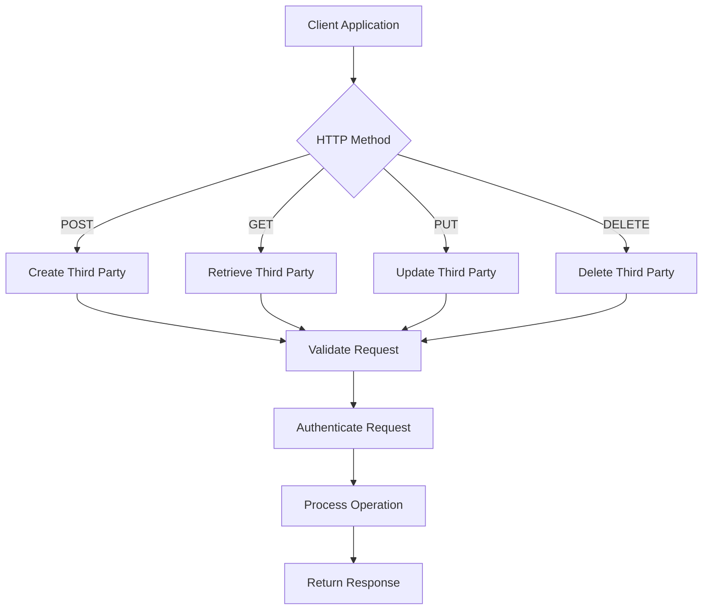
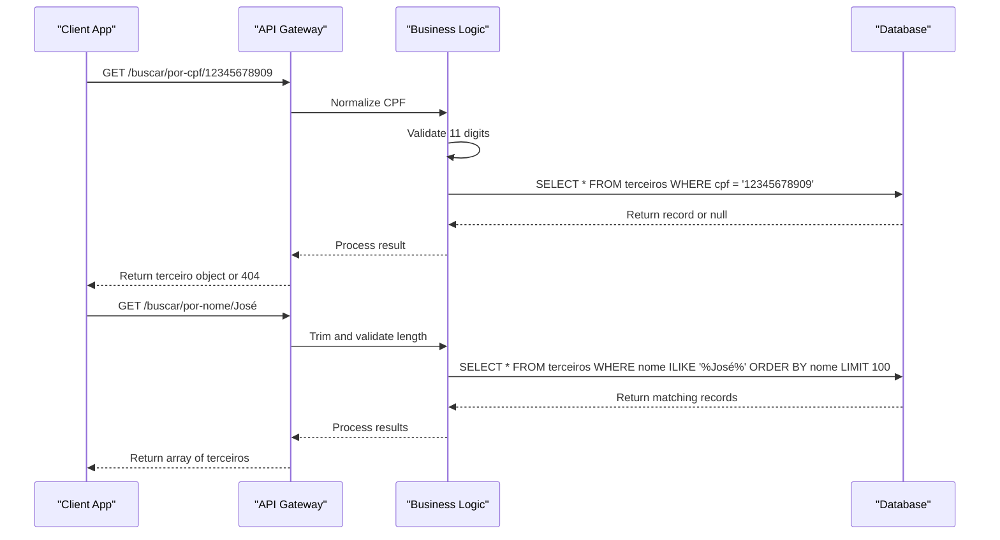
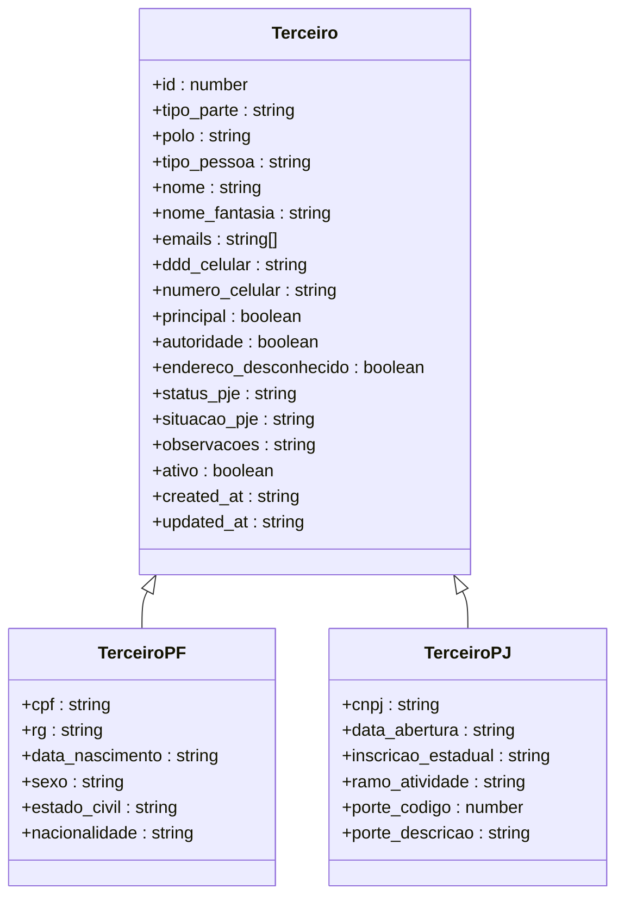
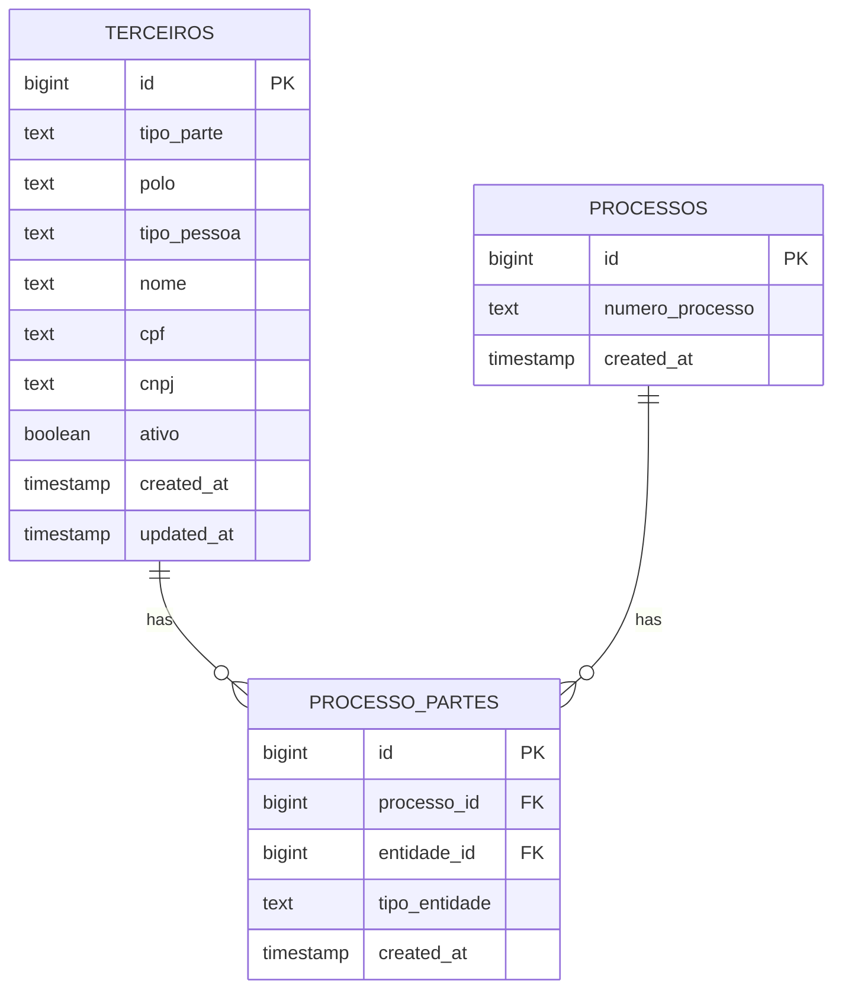

# Third Parties API

<cite>
**Referenced Files in This Document**   
- [route.ts](file://app/api/terceiros/route.ts)
- [route.ts](file://app/api/terceiros/[id]/route.ts)
- [16_terceiros.sql](file://supabase/schemas/16_terceiros.sql)
- [terceiro-persistence.service.ts](file://backend/terceiros/services/persistence/terceiro-persistence.service.ts)
- [buscar-terceiro-por-cpf.service.ts](file://backend/terceiros/services/terceiros/buscar-terceiro-por-cpf.service.ts)
- [buscar-terceiro-por-cnpj.service.ts](file://backend/terceiros/services/terceiros/buscar-terceiro-por-cnpj.service.ts)
- [buscar-terceiro-por-nome.service.ts](file://backend/terceiros/services/terceiros/buscar-terceiro-por-nome.service.ts)
- [terceiros-types.ts](file://backend/types/partes/terceiros-types.ts)
</cite>

## Table of Contents
1. [Introduction](#introduction)
2. [Core Endpoints](#core-endpoints)
3. [Search Endpoints](#search-endpoints)
4. [Request/Response Schemas](#requestresponse-schemas)
5. [Data Validation Rules](#data-validation-rules)
6. [Frontend Integration](#frontend-integration)
7. [Relationships with Legal Processes](#relationships-with-legal-processes)
8. [Error Handling](#error-handling)
9. [Common Issues and Best Practices](#common-issues-and-best-practices)

## Introduction

The Third Parties API in the Sinesys system manages external entities involved in legal processes, such as experts, public prosecutors, assistants, witnesses, and other third-party participants. This API provides comprehensive CRUD operations for managing third-party records, with support for both individuals (PF) and legal entities (PJ). The system ensures data integrity through unique constraints on CPF and CNPJ fields and implements robust validation rules for data consistency.

Third parties are stored in a global table (`terceiros`) and linked to specific legal processes through the `processo_partes` relationship table, allowing a single third party to be associated with multiple processes. The API supports rich querying capabilities, including search by CPF, CNPJ, name, and various filtering options for process integration.

**Section sources**
- [16_terceiros.sql](file://supabase/schemas/16_terceiros.sql#L6-L119)

## Core Endpoints

The Third Parties Management API provides standard CRUD operations through RESTful endpoints under the `/api/terceiros/` base path. These endpoints support creation, retrieval, updating, and deletion of third-party records with comprehensive data validation and authentication.

### POST /api/terceiros/ - Create Third Party

Creates a new third party record in the system. The request must include required fields such as `tipo_pessoa`, `nome`, `tipo_parte`, and `polo`. Depending on whether the third party is an individual (PF) or legal entity (PJ), additional required fields include `cpf` or `cnpj` respectively.

The endpoint validates all input data, ensuring CPF contains exactly 11 digits and CNPJ contains exactly 14 digits. Email addresses are validated for proper format, and duplicate CPF/CNPJ entries are prevented by database constraints.

### GET /api/terceiros/ - List Third Parties

Retrieves a paginated list of third parties with optional filtering. Supports query parameters for pagination (`pagina`, `limite`), filtering by person type (`tipo_pessoa`), party type (`tipo_parte`), and search across multiple fields (`busca`). The `incluir_endereco` parameter allows including address information in the response via JOIN operation.

### GET /api/terceiros/{id} - Retrieve Third Party by ID

Fetches a specific third party record by its unique identifier. Returns detailed information about the third party, including all personal or corporate data, contact information, and status fields.

### PUT /api/terceiros/{id} - Update Third Party

Updates an existing third party record. The API prevents changing the `tipo_pessoa` field after creation to maintain data integrity. All validation rules applied during creation are also enforced during updates. The system tracks changes through `updated_at` timestamp.

### DELETE /api/terceiros/{id} - Delete Third Party

Removes a third party record from the system. The operation follows soft-delete semantics by setting the `ativo` field to false rather than permanently removing the record, preserving historical data integrity.

**Diagram sources**
- [route.ts](file://app/api/terceiros/route.ts#L94-L169)
- [route.ts](file://app/api/terceiros/[id]/route.ts#L32-L148)

**Section sources**
- [route.ts](file://app/api/terceiros/route.ts#L94-L169)
- [route.ts](file://app/api/terceiros/[id]/route.ts#L32-L148)

## Search Endpoints

The Third Parties API provides specialized search endpoints for efficient lookup of third-party records by key identifiers. These endpoints are optimized for performance and support both formatted and unformatted input.

### GET /api/terceiros/buscar/por-cpf/{cpf}

Retrieves a third party by CPF (Individual Taxpayer Registry). The endpoint accepts CPF in any format (with or without formatting characters) and normalizes it by removing non-digit characters. The CPF must contain exactly 11 digits; otherwise, a validation error is returned.

The search operation is case-insensitive and leverages database indexing for optimal performance. If no third party is found with the specified CPF, the endpoint returns a 404 status code.

### GET /api/terceiros/buscar/por-cnpj/{cnpj}

Retrieves a third party by CNPJ (Corporate Taxpayer Registry). Similar to the CPF endpoint, it accepts CNPJ in any format and normalizes it by removing non-digit characters. The CNPJ must contain exactly 14 digits to be considered valid.

This endpoint is specifically designed for business entities and will not return individual third parties, even if a CPF matches the pattern.

### GET /api/terceiros/buscar/por-nome/{nome}

Searches for third parties by name using partial matching. The search is case-insensitive and returns all third parties whose names contain the search term. The name must be at least 3 characters long to prevent overly broad queries that could impact performance.

The results are ordered alphabetically by name and limited to 100 records to prevent excessive data transfer.

**Diagram sources**
- [buscar-terceiro-por-cpf.service.ts](file://backend/terceiros/services/terceiros/buscar-terceiro-por-cpf.service.ts#L14-L24)
- [buscar-terceiro-por-cnpj.service.ts](file://backend/terceiros/services/terceiros/buscar-terceiro-por-cnpj.service.ts#L14-L24)
- [buscar-terceiro-por-nome.service.ts](file://backend/terceiros/services/terceiros/buscar-terceiro-por-nome.service.ts#L14-L28)
- [terceiro-persistence.service.ts](file://backend/terceiros/services/persistence/terceiro-persistence.service.ts#L523-L588)

**Section sources**
- [buscar-terceiro-por-cpf.service.ts](file://backend/terceiros/services/terceiros/buscar-terceiro-por-cpf.service.ts#L14-L24)
- [buscar-terceiro-por-cnpj.service.ts](file://backend/terceiros/services/terceiros/buscar-terceiro-por-cnpj.service.ts#L14-L24)
- [buscar-terceiro-por-nome.service.ts](file://backend/terceiros/services/terceiros/buscar-terceiro-por-nome.service.ts#L14-L28)

## Request/Response Schemas

The Third Parties API uses standardized request and response schemas to ensure consistency across operations. All responses follow a common structure with `success` flag and `data` payload, while error responses include an `error` message.

### Request Payload Structure

The request payload for creating a third party requires several mandatory fields:

- **tipo_pessoa**: String enum ("pf" or "pj") indicating whether the third party is an individual or legal entity
- **nome**: String containing the full name of the third party (required for both PF and PJ)
- **tipo_parte**: String enum specifying the role of the third party (PERITO, MINISTERIO_PUBLICO, ASSISTENTE, TESTEMUNHA, CUSTOS_LEGIS, AMICUS_CURIAE, OUTRO)
- **polo**: String enum indicating the procedural position (ATIVO, PASSIVO, NEUTRO, TERCEIRO)
- **processo_id**: Integer linking the third party to a specific legal process

Additional required fields depend on the `tipo_pessoa`:
- For PF: **cpf** (11-digit individual taxpayer registry)
- For PJ: **cnpj** (14-digit corporate taxpayer registry)

Optional fields include contact information (emails, phone numbers), address reference (`endereco_id`), and various status flags.

### Response Format

The response format includes all third party properties as defined in the database schema, with type-specific fields for individuals and legal entities:

**Common Fields (All Third Parties):**
- id: Unique identifier
- tipo_parte: Role in legal process
- polo: Procedural position
- tipo_pessoa: "pf" or "pj"
- nome: Full name
- nome_fantasia: Trade name (for PJ)
- emails: Array of email addresses
- Phone contact fields (cellular, residential, commercial)
- Status flags (principal, autoridade, endereco_desconhecido)
- PJE status fields (status_pje, situacao_pje, login_pje)
- Control fields (observacoes, ativo, created_at, updated_at)

**Individual-Specific Fields (PF):**
- cpf: Individual taxpayer registry
- rg: Identity document
- data_nascimento: Date of birth
- sexo: Gender
- estado_civil: Marital status
- Nationality and birthplace information

**Entity-Specific Fields (PJ):**
- cnpj: Corporate taxpayer registry
- data_abertura: Company establishment date
- inscricao_estadual: State registration
- ramo_atividade: Business activity sector
- porte_codigo/descricao: Company size classification

**Diagram sources**
- [16_terceiros.sql](file://supabase/schemas/16_terceiros.sql#L6-L119)
- [terceiro-persistence.service.ts](file://backend/terceiros/services/persistence/terceiro-persistence.service.ts#L78-L180)
- [terceiros-types.ts](file://backend/types/partes/terceiros-types.ts#L5-L11)

**Section sources**
- [terceiro-persistence.service.ts](file://backend/terceiros/services/persistence/terceiro-persistence.service.ts#L78-L180)
- [terceiros-types.ts](file://backend/types/partes/terceiros-types.ts#L5-L11)

## Data Validation Rules

The Third Parties API enforces comprehensive data validation rules to ensure data quality and consistency across the system. These rules are implemented at both the application and database levels.

### Required Fields Validation

All third party records require the following mandatory fields:
- `tipo_pessoa`: Must be either "pf" or "pj"
- `nome`: Must be a non-empty string
- `tipo_parte`: Must be one of the defined party types
- `polo`: Must be one of the valid procedural positions

For individuals (PF), the `cpf` field is mandatory and must contain exactly 11 digits. For legal entities (PJ), the `cnpj` field is mandatory and must contain exactly 14 digits.

### Format Validation

The API validates several fields for proper format:
- **CPF**: Must contain exactly 11 numeric digits after normalization
- **CNPJ**: Must contain exactly 14 numeric digits after normalization
- **Emails**: Each email in the array must match standard email format (local@domain.tld)
- **Phone numbers**: DDD and number fields are validated for proper numeric format

### Uniqueness Constraints

The database enforces uniqueness constraints to prevent duplicate records:
- CPF must be unique across all active third parties
- CNPJ must be unique across all active third parties

These constraints are implemented as partial unique indexes that only apply when the respective field is not null, allowing multiple third parties without CPF/CNPJ.

### Business Rules

Additional business rules are enforced:
- The `tipo_pessoa` field cannot be changed after record creation
- Email addresses must be valid format if provided
- Name searches require at least 3 characters
- Results are limited to 100 records for performance reasons

**Section sources**
- [terceiro-persistence.service.ts](file://backend/terceiros/services/persistence/terceiro-persistence.service.ts#L185-L330)
- [terceiro-persistence.service.ts](file://backend/terceiros/services/persistence/terceiro-persistence.service.ts#L335-L500)
- [16_terceiros.sql](file://supabase/schemas/16_terceiros.sql#L103-L104)

## Frontend Integration

The Third Parties API is integrated with frontend components that provide user-friendly interfaces for managing third-party records. These components handle the API interactions and provide appropriate user feedback.

### TerceiroCreateDialog

The `TerceiroCreateDialog` component provides a form interface for creating new third parties. It dynamically adjusts its fields based on whether the user selects individual (PF) or legal entity (PJ) type. The dialog validates input in real-time and displays appropriate error messages for invalid data.

When the user submits the form, the component calls the POST `/api/terceiros/` endpoint with the appropriate payload. On success, it closes the dialog and refreshes the parent view to display the newly created third party.

### TerceiroEditDialog

The `TerceiroEditDialog` component allows editing existing third party records. It pre-populates the form with the current data from the GET `/api/terceiros/{id}` endpoint. The component prevents users from changing the `tipo_pessoa` field, reflecting the backend restriction.

The dialog handles the PUT `/api/terceiros/{id}` endpoint for updates and provides appropriate success or error feedback to the user.

### Search Integration

Frontend components integrate with the search endpoints to provide autocomplete functionality when linking third parties to processes. As users type in search fields, the application calls the appropriate search endpoint (by name, CPF, or CNPJ) and displays matching results.

The search results are displayed in a dropdown or modal interface, allowing users to select the appropriate third party for association with a legal process.

**Section sources**
- [route.ts](file://app/api/terceiros/route.ts#L130-L168)
- [route.ts](file://app/api/terceiros/[id]/route.ts#L66-L107)

## Relationships with Legal Processes

Third parties in the Sinesys system are linked to legal processes through a many-to-many relationship, allowing a single third party to participate in multiple processes and a single process to have multiple third parties.

### Database Structure

The relationship is managed through the `processo_partes` table, which contains:
- `processo_id`: Reference to the legal process
- `entidade_id`: Reference to the third party ID
- `tipo_entidade`: Set to "terceiro" to distinguish from other party types
- Additional relationship-specific fields (role, participation type, etc.)

This design allows for flexible association of third parties with processes while maintaining a global registry of third parties.

### API Integration

When creating a third party in the context of a specific process, the frontend first creates the third party record via POST `/api/terceiros/` and then creates the relationship in `processo_partes`. This two-step process ensures data consistency and allows the same third party to be easily associated with additional processes later.

To retrieve all third parties associated with a specific process, the system queries the `processo_partes` table for records with the given `processo_id` and `tipo_entidade="terceiro"`, then fetches the corresponding third party details from the `terceiros` table.

### Data Consistency

The system maintains data consistency through:
- Foreign key constraints between `processo_partes` and `terceiros`
- Soft-delete semantics that preserve historical relationships
- Audit trails through `created_at` and `updated_at` timestamps
- Prevention of `tipo_pessoa` changes to avoid data integrity issues

**Diagram sources**
- [16_terceiros.sql](file://supabase/schemas/16_terceiros.sql#L6-L119)
- [terceiro-persistence.service.ts](file://backend/terceiros/services/persistence/terceiro-persistence.service.ts#L595-L602)

**Section sources**
- [16_terceiros.sql](file://supabase/schemas/16_terceiros.sql#L6-L119)
- [terceiro-persistence.service.ts](file://backend/terceiros/services/persistence/terceiro-persistence.service.ts#L595-L602)

## Error Handling

The Third Parties API implements comprehensive error handling to provide meaningful feedback for various failure scenarios. All error responses follow a consistent format with descriptive messages.

### Validation Errors

Validation errors occur when request data fails to meet requirements:
- **400 Bad Request**: Missing required fields, invalid data formats, or validation failures
- Examples: Missing `nome`, invalid CPF/CNPJ length, invalid email format

### Authentication and Authorization

- **401 Unauthorized**: Missing or invalid authentication credentials
- The API requires authenticated requests for all operations

### Resource Not Found

- **404 Not Found**: Requested resource does not exist
- Examples: GET request with invalid third party ID, search for non-existent CPF/CNPJ

### Server Errors

- **500 Internal Server Error**: Unexpected server-side issues
- Examples: Database connectivity problems, unhandled exceptions

### Specific Error Scenarios

- **Duplicate CPF/CNPJ**: Attempt to create a third party with an existing CPF or CNPJ
- **Invalid Type Change**: Attempt to modify the `tipo_pessoa` field
- **Process Association Errors**: Issues when linking third parties to processes

The API returns descriptive error messages to help clients understand and resolve issues, while avoiding exposure of sensitive system information.

**Section sources**
- [route.ts](file://app/api/terceiros/route.ts#L123-L127)
- [route.ts](file://app/api/terceiros/route.ts#L163-L167)
- [route.ts](file://app/api/terceiros/[id]/route.ts#L59-L63)
- [route.ts](file://app/api/terceiros/[id]/route.ts#L102-L106)
- [route.ts](file://app/api/terceiros/[id]/route.ts#L142-L146)

## Common Issues and Best Practices

### Distinguishing Between Third Party Types

A common challenge is properly distinguishing between different types of third parties (experts, prosecutors, assistants, etc.). The `tipo_parte` field should be used consistently to categorize third parties, with values from the defined enum:
- PERITO: Experts or technical specialists
- MINISTERIO_PUBLICO: Public prosecutors
- ASSISTENTE: Legal assistants
- TESTEMUNHA: Witnesses
- CUSTOS_LEGIS: Cost bearers
- AMICUS_CURIAE: Friends of the court
- OUTRO: Other unspecified third parties

### Managing Multiple Process Relationships

Since third parties can be associated with multiple processes, it's important to:
- Use the global `terceiros` table as the single source of truth
- Create the third party record first, then establish process relationships
- Leverage existing third parties when possible to avoid duplication
- Use the `processo_partes` table to manage the many-to-many relationship

### Ensuring Data Consistency

To maintain data consistency:
- Always validate CPF and CNPJ formats before submission
- Ensure email addresses are properly formatted
- Use consistent naming conventions for third parties
- Regularly audit third party records for duplicates or inconsistencies
- Leverage the search endpoints to find existing records before creating new ones

### Performance Considerations

For optimal performance:
- Use specific search endpoints (by CPF, CNPJ, name) rather than broad list queries
- Implement client-side caching for frequently accessed third parties
- Use pagination when retrieving large result sets
- Limit search results to prevent excessive data transfer

Following these best practices ensures efficient and reliable management of third parties within the Sinesys system.

**Section sources**
- [16_terceiros.sql](file://supabase/schemas/16_terceiros.sql#L6-L119)
- [terceiro-persistence.service.ts](file://backend/terceiros/services/persistence/terceiro-persistence.service.ts#L607-L674)
- [terceiro-persistence.service.ts](file://backend/terceiros/services/persistence/terceiro-persistence.service.ts#L568-L588)