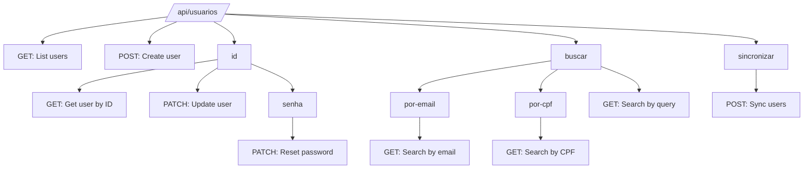

# User Management API

<cite>
**Referenced Files in This Document**   
- [route.ts](file://app/api/usuarios/route.ts)
- [route.ts](file://app/api/usuarios/[id]/route.ts)
- [route.ts](file://app/api/usuarios/[id]/senha/route.ts)
- [route.ts](file://app/api/usuarios/buscar/route.ts)
- [route.ts](file://app/api/usuarios/buscar/por-email/[email]/route.ts)
- [route.ts](file://app/api/usuarios/buscar/por-cpf/[cpf]/route.ts)
- [route.ts](file://app/api/usuarios/sincronizar/route.ts)
- [criar-usuario-completo.service.ts](file://backend/usuarios/services/usuarios/criar-usuario-completo.service.ts)
- [atualizar-usuario.service.ts](file://backend/usuarios/services/usuarios/atualizar-usuario.service.ts)
- [buscar-usuario.service.ts](file://backend/usuarios/services/usuarios/buscar-usuario.service.ts)
- [usuario-persistence.service.ts](file://backend/usuarios/services/persistence/usuario-persistence.service.ts)
- [sincronizar-usuarios-auth.service.ts](file://backend/usuarios/services/persistence/sincronizar-usuarios-auth.service.ts)
</cite>

## Table of Contents
1. [Introduction](#introduction)
2. [Core Endpoints](#core-endpoints)
3. [User Creation](#user-creation)
4. [User Retrieval](#user-retrieval)
5. [User Update](#user-update)
6. [User Deactivation](#user-deactivation)
7. [Password Management](#password-management)
8. [User Search](#user-search)
9. [Data Synchronization](#data-synchronization)
10. [Error Handling](#error-handling)
11. [Business Rules](#business-rules)
12. [Frontend Integration](#frontend-integration)
13. [Security and Permissions](#security-and-permissions)

## Introduction

The User Management API in the Sinesys system provides comprehensive CRUD operations for managing user accounts within the organization. This API serves as the central interface for creating, retrieving, updating, and deactivating user records, while maintaining synchronization between the authentication system and the application's user database.

The API endpoints are organized under the `/api/usuarios/` base path and support various operations including user creation with complete profile information, retrieval of user data by different identifiers, partial updates to user information, and secure password management. The system implements robust validation rules, permission-based access control, and data consistency mechanisms to ensure data integrity and security.

The user management system follows a dual-database approach where user authentication data is stored in Supabase's `auth.users` table while application-specific user data is maintained in the `public.usuarios` table. This separation allows for secure authentication management while providing flexibility for application-specific user attributes and relationships.

**Section sources**
- [route.ts](file://app/api/usuarios/route.ts#L1-L239)
- [usuario-persistence.service.ts](file://backend/usuarios/services/persistence/usuario-persistence.service.ts#L1-L666)

## Core Endpoints

The User Management API provides a comprehensive set of endpoints for managing user accounts. These endpoints follow RESTful conventions and are organized hierarchically based on resource relationships.



**Diagram sources **
- [route.ts](file://app/api/usuarios/route.ts#L1-L239)
- [route.ts](file://app/api/usuarios/[id]/route.ts#L1-L271)
- [route.ts](file://app/api/usuarios/[id]/senha/route.ts#L1-L159)
- [route.ts](file://app/api/usuarios/buscar/route.ts#L1-L85)

## User Creation

The user creation endpoint allows administrators to create new user accounts in the system. This operation creates records in both the authentication system (`auth.users`) and the application database (`public.usuarios`), establishing a complete user profile.

### POST /api/usuarios/

Creates a new user with complete profile information. The endpoint requires authentication and appropriate permissions.

**Request Body Schema**
```json
{
  "nomeCompleto": "string",
  "nomeExibicao": "string",
  "cpf": "string",
  "rg": "string",
  "dataNascimento": "string",
  "genero": "masculino|feminino|outro|prefiro_nao_informar",
  "oab": "string",
  "ufOab": "string",
  "emailPessoal": "string",
  "emailCorporativo": "string",
  "telefone": "string",
  "ramal": "string",
  "endereco": {
    "logradouro": "string",
    "numero": "string",
    "complemento": "string",
    "bairro": "string",
    "cidade": "string",
    "estado": "string",
    "pais": "string",
    "cep": "string"
  },
  "senha": "string",
  "cargoId": "number",
  "isSuperAdmin": "boolean",
  "ativo": "boolean"
}
```

**Required Fields**: `nomeCompleto`, `nomeExibicao`, `cpf`, `emailCorporativo`, `senha`

**Response (201 Created)**
```json
{
  "success": true,
  "data": {
    "id": 1,
    "authUserId": "uuid",
    "nomeCompleto": "string",
    "nomeExibicao": "string",
    "cpf": "string",
    "rg": "string",
    "dataNascimento": "string",
    "genero": "string",
    "oab": "string",
    "ufOab": "string",
    "emailPessoal": "string",
    "emailCorporativo": "string",
    "telefone": "string",
    "ramal": "string",
    "endereco": {},
    "cargoId": "number",
    "cargo": {
      "id": "number",
      "nome": "string",
      "descricao": "string"
    },
    "isSuperAdmin": "boolean",
    "ativo": "boolean",
    "createdAt": "string",
    "updatedAt": "string"
  }
}
```

**Section sources**
- [route.ts](file://app/api/usuarios/route.ts#L182-L237)
- [criar-usuario-completo.service.ts](file://backend/usuarios/services/usuarios/criar-usuario-completo.service.ts#L24-L108)

## User Retrieval

The user retrieval endpoints provide multiple methods to access user information based on different identifiers and search criteria.

### GET /api/usuarios/{id}

Retrieves complete user information by user ID. Requires `usuarios.visualizar` permission.

**Response (200 OK)**
```json
{
  "success": true,
  "data": {
    "id": 1,
    "authUserId": "uuid",
    "nomeCompleto": "string",
    "nomeExibicao": "string",
    "cpf": "string",
    "rg": "string",
    "dataNascimento": "string",
    "genero": "string",
    "oab": "string",
    "ufOab": "string",
    "emailPessoal": "string",
    "emailCorporativo": "string",
    "telefone": "string",
    "ramal": "string",
    "endereco": {},
    "cargoId": "number",
    "cargo": {
      "id": "number",
      "nome": "string",
      "descricao": "string"
    },
    "isSuperAdmin": "boolean",
    "ativo": "boolean",
    "createdAt": "string",
    "updatedAt": "string"
  }
}
```

### GET /api/usuarios/buscar/por-email/{email}

Retrieves user information by corporate email address.

### GET /api/usuarios/buscar/por-cpf/{cpf}

Retrieves user information by CPF (Brazilian individual taxpayer registry).

### GET /api/usuarios/

Lists users with optional filtering and pagination.

**Query Parameters**
- `pagina`: Page number (default: 1)
- `limite`: Items per page (default: 50)
- `busca`: Search term (name, display name, CPF, or corporate email)
- `ativo`: Filter by active/inactive status
- `oab`: Filter by OAB number
- `ufOab`: Filter by OAB state

**Response (200 OK)**
```json
{
  "success": true,
  "data": {
    "usuarios": [],
    "total": "number",
    "pagina": "number",
    "limite": "number",
    "totalPaginas": "number"
  }
}
```

**Section sources**
- [route.ts](file://app/api/usuarios/route.ts#L143-L179)
- [route.ts](file://app/api/usuarios/[id]/route.ts#L107-L151)
- [route.ts](file://app/api/usuarios/buscar/por-email/[email]/route.ts#L37-L86)
- [route.ts](file://app/api/usuarios/buscar/por-cpf/[cpf]/route.ts#L37-L85)

## User Update

The user update endpoint allows for partial modification of user information through PATCH requests.

### PATCH /api/usuarios/{id}

Updates specific fields of an existing user. Requires `usuarios.editar` permission.

**Request Body Schema**
```json
{
  "nomeCompleto": "string",
  "nomeExibicao": "string",
  "cpf": "string",
  "rg": "string",
  "dataNascimento": "string",
  "genero": "masculino|feminino|outro|prefiro_nao_informar",
  "oab": "string",
  "ufOab": "string",
  "emailPessoal": "string",
  "emailCorporativo": "string",
  "telefone": "string",
  "ramal": "string",
  "endereco": {},
  "ativo": "boolean",
  "isSuperAdmin": "boolean"
}
```

**Special Handling for Super Admin Status**
- Only Super Admin users can modify the `isSuperAdmin` field
- Users cannot remove their own Super Admin status
- Changes to Super Admin status are logged for audit purposes

**Response (200 OK)**
```json
{
  "success": true,
  "data": {
    "id": 1,
    "authUserId": "uuid",
    "nomeCompleto": "string",
    "nomeExibicao": "string",
    "cpf": "string",
    "rg": "string",
    "dataNascimento": "string",
    "genero": "string",
    "oab": "string",
    "ufOab": "string",
    "emailPessoal": "string",
    "emailCorporativo": "string",
    "telefone": "string",
    "ramal": "string",
    "endereco": {},
    "cargoId": "number",
    "cargo": {
      "id": "number",
      "nome": "string",
      "descricao": "string"
    },
    "isSuperAdmin": "boolean",
    "ativo": "boolean",
    "createdAt": "string",
    "updatedAt": "string"
  }
}
```

**Section sources**
- [route.ts](file://app/api/usuarios/[id]/route.ts#L153-L271)
- [atualizar-usuario.service.ts](file://backend/usuarios/services/usuarios/atualizar-usuario.service.ts#L20-L49)

## User Deactivation

The system implements a soft deletion mechanism through user deactivation rather than permanent removal.

### Deactivation Process

When a user's `ativo` field is set to `false` via the PATCH endpoint, the system triggers a specialized deactivation service that:

1. Updates the user's active status
2. Removes the user from active assignments
3. Preserves historical data and audit trails
4. Maintains referential integrity

The deactivation process ensures that:
- User data remains available for historical reference
- Audit logs maintain complete records
- Related entities retain proper references
- Business processes can track user history

**Section sources**
- [route.ts](file://app/api/usuarios/[id]/route.ts#L202-L239)
- [desativar-usuario.service.ts](file://backend/usuarios/services/usuarios/desativar-usuario.service.ts)

## Password Management

The password management endpoint allows administrators to reset user passwords securely.

### PATCH /api/usuarios/{id}/senha

Resets a user's password. Requires `usuarios.editar` permission.

**Request Body**
```json
{
  "novaSenha": "string"
}
```

**Password Requirements**
- Minimum 8 characters
- Maximum 72 characters
- No complexity requirements enforced at API level

**Process**
1. Verify administrator permissions
2. Validate password length
3. Use Supabase Admin API to update password
4. Log the password reset operation for audit purposes

**Response (200 OK)**
```json
{
  "success": true,
  "message": "Senha redefinida com sucesso"
}
```

**Section sources**
- [route.ts](file://app/api/usuarios/[id]/senha/route.ts#L61-L159)
- [service-client.ts](file://backend/utils/supabase/service-client.ts)

## User Search

The user search endpoints provide flexible methods for finding users based on various criteria.

### GET /api/usuarios/buscar

Searches for users by name or email. Used primarily for user selection interfaces.

**Query Parameters**
- `q`: Search term (minimum 2 characters)
- `limit`: Maximum number of results

**Response**
```json
{
  "success": true,
  "data": [
    {
      "id": 1,
      "nomeCompleto": "string",
      "nomeExibicao": "string",
      "emailCorporativo": "string"
    }
  ]
}
```

### Specialized Search Endpoints
- `/api/usuarios/buscar/por-email/{email}`: Exact match by corporate email
- `/api/usuarios/buscar/por-cpf/{cpf}`: Exact match by CPF

These endpoints are optimized for performance with caching mechanisms and are used in scenarios requiring precise user identification.

**Section sources**
- [route.ts](file://app/api/usuarios/buscar/route.ts#L17-L85)
- [route.ts](file://app/api/usuarios/buscar/por-email/[email]/route.ts#L37-L86)
- [route.ts](file://app/api/usuarios/buscar/por-cpf/[cpf]/route.ts#L37-L85)

## Data Synchronization

The user synchronization endpoint maintains consistency between the authentication system and application database.

### POST /api/usuarios/sincronizar

Synchronizes users from `auth.users` to `public.usuarios` table.

**Process**
1. Identifies users in `auth.users` not present in `public.usuarios`
2. Creates corresponding records in `public.usuarios`
3. Generates temporary CPFs for users without existing CPF
4. Extracts user names from email addresses or metadata
5. Returns synchronization statistics

**Response**
```json
{
  "success": true,
  "totalEncontrados": "number",
  "sincronizados": "number",
  "erros": [
    {
      "email": "string",
      "erro": "string"
    }
  ]
}
```

This endpoint is crucial during system initialization or when onboarding existing authentication users to the application.

**Section sources**
- [route.ts](file://app/api/usuarios/sincronizar/route.ts#L48-L78)
- [sincronizar-usuarios-auth.service.ts](file://backend/usuarios/services/persistence/sincronizar-usuarios-auth.service.ts#L142-L212)

## Error Handling

The API implements comprehensive error handling with appropriate HTTP status codes and descriptive error messages.

### Common Error Responses

**400 Bad Request**
- Missing required fields
- Invalid data format
- Duplicate entries (CPF, email)
- Password validation failures

**401 Unauthorized**
- Missing or invalid authentication credentials
- Session expiration

**403 Forbidden**
- Insufficient permissions for requested operation
- Attempt to modify Super Admin status without proper privileges

**404 Not Found**
- User ID, email, or CPF not found
- Resource does not exist

**500 Internal Server Error**
- Database connection issues
- Unexpected system errors

Error responses follow the standard format:
```json
{
  "error": "Descriptive error message"
}
```

**Section sources**
- [route.ts](file://app/api/usuarios/route.ts#L172-L178)
- [route.ts](file://app/api/usuarios/[id]/route.ts#L144-L149)
- [route.ts](file://app/api/usuarios/[id]/senha/route.ts#L151-L157)

## Business Rules

The User Management API enforces several business rules to maintain data integrity and security.

### Data Validation Rules
- CPF must contain exactly 11 digits
- Corporate email must be unique across the system
- Required fields must be present for user creation
- Email format validation for both personal and corporate emails

### Uniqueness Constraints
- CPF: Unique across all users
- Corporate Email: Unique across all users
- Authentication User ID: Links to exactly one application user

### Permission-Based Access Control
- `usuarios.visualizar`: Required for reading user data
- `usuarios.editar`: Required for creating, updating, and password reset operations
- Super Admin status can only be modified by existing Super Admin users

### Data Consistency Rules
- User deactivation triggers cleanup of active assignments
- Cache invalidation occurs after create, update, and delete operations
- Audit logging for sensitive operations (password reset, Super Admin changes)

**Section sources**
- [usuario-persistence.service.ts](file://backend/usuarios/services/persistence/usuario-persistence.service.ts#L234-L344)
- [require-permission.ts](file://backend/auth/require-permission.ts)

## Frontend Integration

The User Management API is designed to work seamlessly with frontend components for user management.

### Key Frontend Components
- **UsuarioCreateDialog**: Uses POST /api/usuarios/ to create new users
- **UsuarioEditDialog**: Uses PATCH /api/usuarios/{id} to update user information
- **UsuarioViewSheet**: Uses GET /api/usuarios/{id} to display user details

### Integration Patterns
- Form validation matches API validation rules
- Real-time search uses /api/usuarios/buscar endpoint
- Permission checks determine available actions
- Loading states and error handling are implemented consistently

The API's response format is designed to work directly with the frontend components without requiring significant data transformation.

**Section sources**
- [route.ts](file://app/api/usuarios/route.ts)
- [route.ts](file://app/api/usuarios/[id]/route.ts)

## Security and Permissions

The User Management API implements a robust security model with multiple layers of protection.

### Authentication Methods
- Bearer tokens (JWT)
- Session-based authentication
- Service API keys

### Authorization Model
- Role-based permissions
- Super Admin hierarchy
- Operation-specific permission requirements

### Security Features
- Input validation and sanitization
- Rate limiting (implemented at gateway level)
- Audit logging for sensitive operations
- Password reset operations are logged with IP address
- Cache protection for sensitive user data

The system follows the principle of least privilege, ensuring users can only perform operations for which they have explicit permissions.

**Section sources**
- [api-auth.ts](file://backend/auth/api-auth.ts)
- [require-permission.ts](file://backend/auth/require-permission.ts)
- [route.ts](file://app/api/usuarios/[id]/senha/route.ts#L142-L144)