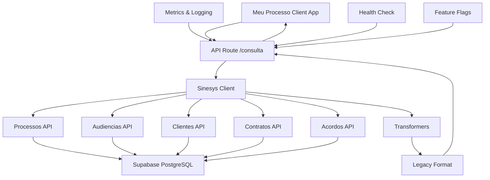
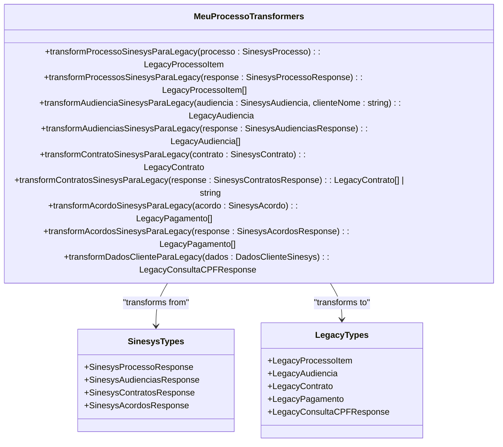
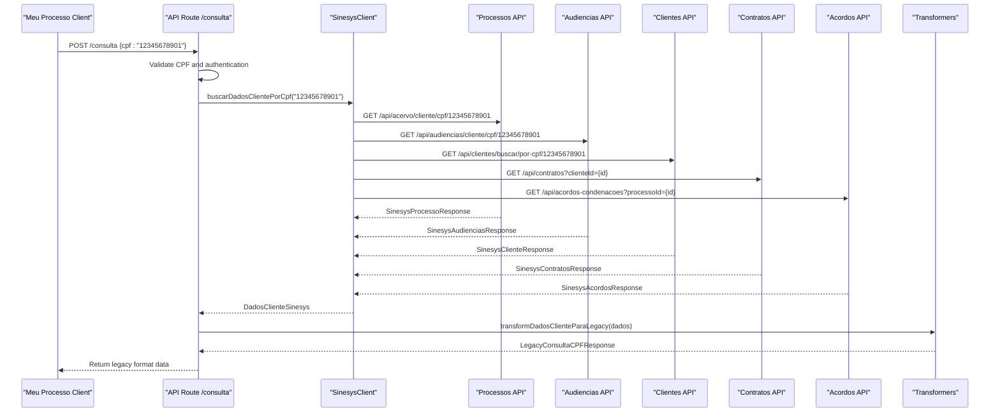
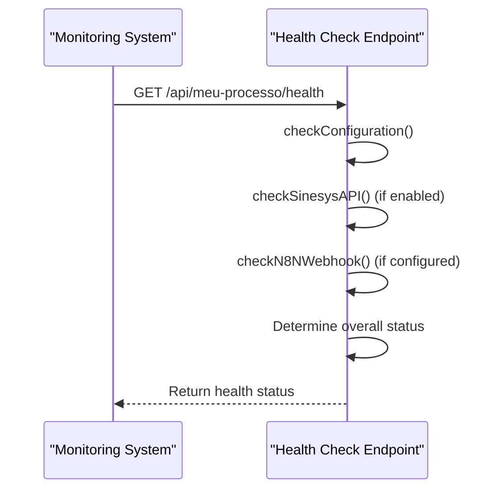
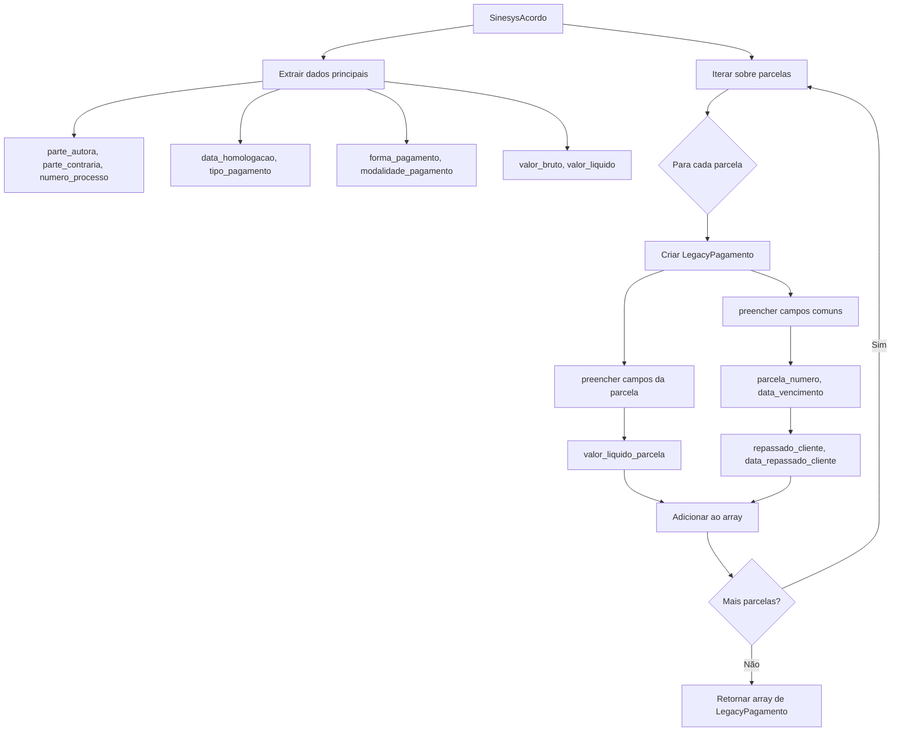
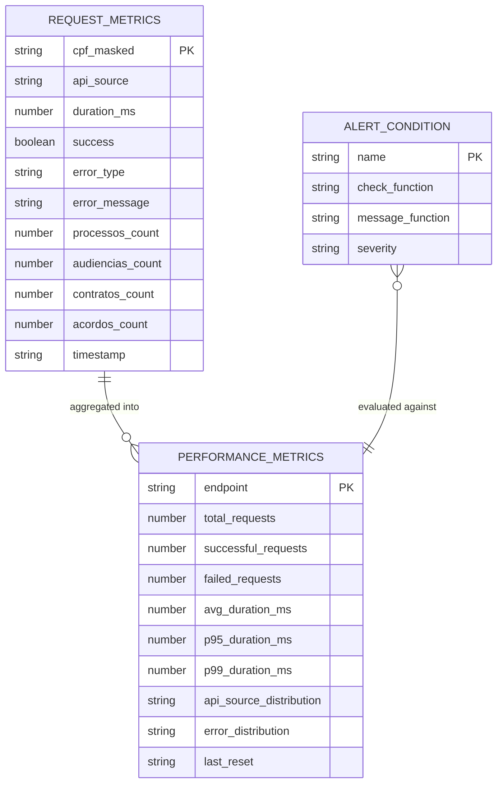
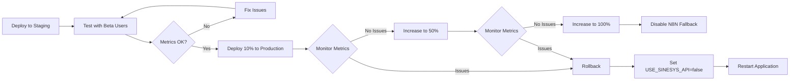
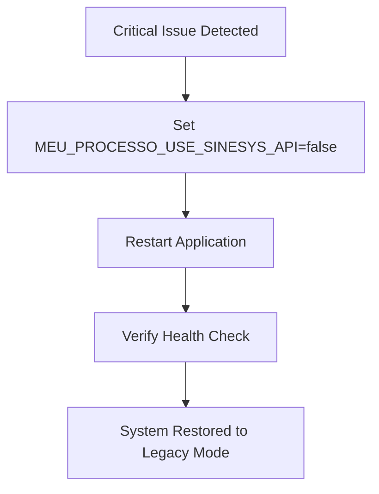

# Meu Processo API Migration

<cite>
**Referenced Files in This Document**   
- [ANALISE-MIGRACAO-MEU-PROCESSO.md](file://ANALISE-MIGRACAO-MEU-PROCESSO.md)
- [app/api/meu-processo/consulta/route.ts](file://app/api/meu-processo/consulta/route.ts)
- [app/api/meu-processo/README.md](file://app/api/meu-processo/README.md)
- [app/api/meu-processo/RESUMO.md](file://app/api/meu-processo/RESUMO.md)
- [lib/services/sinesys-client.ts](file://lib/services/sinesys-client.ts)
- [lib/transformers/meu-processo-transformers.ts](file://lib/transformers/meu-processo-transformers.ts)
- [lib/types/meu-processo-types.ts](file://lib/types/meu-processo-types.ts)
- [lib/services/meu-processo-metrics.ts](file://lib/services/meu-processo-metrics.ts)
- [app/api/meu-processo/health/route.ts](file://app/api/meu-processo/health/route.ts)
- [app/api/meu-processo/metrics/route.ts](file://app/api/meu-processo/metrics/route.ts)
- [DEPLOY.md](file://DEPLOY.md)
- [app/api/meu-processo/DEPLOY.md](file://app/api/meu-processo/DEPLOY.md)
</cite>

## Table of Contents
1. [Introduction](#introduction)
2. [Architecture Overview](#architecture-overview)
3. [Core Components](#core-components)
4. [API Endpoints](#api-endpoints)
5. [Data Transformation](#data-transformation)
6. [Monitoring and Metrics](#monitoring-and-metrics)
7. [Deployment and Rollback](#deployment-and-rollback)
8. [Conclusion](#conclusion)

## Introduction

The Meu Processo API Migration project aims to transition the client-facing "Meu Processo" application from its current dependency on an N8N webhook to direct integration with the Sinesys REST APIs. This migration ensures real-time data access, improved reliability, and eliminates the intermediary layer. The implementation maintains backward compatibility with the legacy N8N webhook format, allowing for a seamless transition without requiring changes to the client application.

The migration leverages a feature-flag system to enable a gradual rollout, with automatic fallback to the N8N webhook in case of API failures. This approach ensures zero downtime and provides a robust rollback mechanism. The system is designed with comprehensive monitoring, logging, and error handling to ensure high availability and observability.

**Section sources**
- [ANALISE-MIGRACAO-MEU-PROCESSO.md](file://ANALISE-MIGRACAO-MEU-PROCESSO.md#L1-L800)
- [app/api/meu-processo/RESUMO.md](file://app/api/meu-processo/RESUMO.md#L1-L241)

## Architecture Overview

The Meu Processo API migration implements a layered architecture that abstracts the complexity of integrating with multiple Sinesys APIs. The system is designed to be resilient, observable, and maintainable, with clear separation of concerns between components.



**Diagram sources**
- [app/api/meu-processo/README.md](file://app/api/meu-processo/README.md#L154-L171)
- [ANALISE-MIGRACAO-MEU-PROCESSO.md](file://ANALISE-MIGRACAO-MEU-PROCESSO.md#L201-L211)

## Core Components

The migration implementation consists of several core components that work together to provide a seamless integration between the Meu Processo client application and the Sinesys backend services. These components include the API route handler, the Sinesys client, data transformers, and type definitions.

### Sinesys Client

The SinesysClient class provides a centralized interface for making HTTP requests to the Sinesys APIs. It handles authentication, error handling, retries, and timeouts, abstracting the complexity of direct API calls. The client supports multiple endpoints for retrieving client data, including processes, hearings, contracts, and agreements.

```mermaid
classDiagram
class SinesysClient {
+config : SinesysClientConfig
-request~T~(endpoint : string, options? : RequestInit) : Promise~T~
-requestWithRetry~T~(endpoint : string, options? : RequestInit) : Promise~T~
+buscarProcessosPorCpf(cpf : string) : Promise~SinesysProcessoResponse~
+buscarAudienciasPorCpf(cpf : string) : Promise~SinesysAudienciasResponse~
+buscarClientePorCpf(cpf : string) : Promise~SinesysClienteResponse~
+buscarContratosPorClienteId(clienteId : number, options? : {pagina? : number; limite? : number}) : Promise~SinesysContratosResponse~
+buscarContratosPorCpf(cpf : string, options? : {pagina? : number; limite? : number}) : Promise~SinesysContratosResponse~
+buscarAcordosPorProcessoId(processoId : number, options? : {pagina? : number; limite? : number}) : Promise~SinesysAcordosResponse~
+buscarDadosClientePorCpf(cpf : string) : Promise~DadosClienteSinesys~
+buscarAcordosDoCliente(cpf : string) : Promise~SinesysAcordosResponse~
}
class SinesysClientConfig {
+baseUrl : string
+apiKey : string
+timeout? : number
+retries? : number
}
SinesysClient --> SinesysClientConfig : "uses"
```

**Diagram sources**
- [lib/services/sinesys-client.ts](file://lib/services/sinesys-client.ts#L22-L373)

### Data Transformers

The data transformers are responsible for converting the responses from the Sinesys APIs into the legacy format expected by the Meu Processo client application. This ensures backward compatibility and allows for a smooth migration without requiring changes to the client-side code.



**Diagram sources**
- [lib/transformers/meu-processo-transformers.ts](file://lib/transformers/meu-processo-transformers.ts#L8-L361)

## API Endpoints

The Meu Processo API provides several endpoints for querying client data, health status, and metrics. These endpoints are designed to be robust, secure, and easy to integrate with client applications.

### Consulta Endpoint

The primary endpoint for the Meu Processo API is the `/api/meu-processo/consulta` POST endpoint, which accepts a CPF and returns all relevant client data in the legacy format.



**Diagram sources**
- [app/api/meu-processo/consulta/route.ts](file://app/api/meu-processo/consulta/route.ts#L16-L342)

### Health Check Endpoint

The health check endpoint provides a way to monitor the status of the Meu Processo API and its dependencies. It verifies configuration, connectivity to the Sinesys APIs, and the availability of the N8N webhook fallback.



**Diagram sources**
- [app/api/meu-processo/health/route.ts](file://app/api/meu-processo/health/route.ts#L1-L266)

## Data Transformation

The data transformation layer is a critical component of the Meu Processo API migration, ensuring that the responses from the Sinesys APIs are converted into the legacy format expected by the client application. This section details the transformation process for each data type.

### Processos Transformation

The process data transformation maps fields from the Sinesys API response to the legacy format used by the Meu Processo client. This includes handling special cases such as sealed processes and unavailable timelines.

```mermaid
flowchart TD
A[SinesysProcesso] --> B{Processo sob sigilo?}
B --> |Sim| C[Retornar {result: "Processo sob sigilo"}]
B --> |Não| D{Timeline indisponível?}
D --> |Sim| E[Retornar {result: "Timeline não disponível"}]
D --> |Não| F[Transformar campos]
F --> G[parteAutora e parteRe]
F --> H[tribunal, numero, valorDaCausa]
F --> I[jurisdicaoEstado e jurisdicaoMunicipio]
F --> J[instancias]
G --> K[LegacyProcessoItem]
H --> K
I --> K
J --> K
K --> L[Retornar LegacyProcessoItem]
```

**Diagram sources**
- [lib/transformers/meu-processo-transformers.ts](file://lib/transformers/meu-processo-transformers.ts#L89-L131)

### Acordos Transformation

The agreements transformation handles the conversion of agreement data from the Sinesys API to the legacy format. Since the legacy format represents each payment installment as a separate record, the transformation flattens the agreement data structure.



**Diagram sources**
- [lib/transformers/meu-processo-transformers.ts](file://lib/transformers/meu-processo-transformers.ts#L256-L287)

## Monitoring and Metrics

The Meu Processo API includes comprehensive monitoring and metrics capabilities to ensure observability and facilitate troubleshooting. These features provide insights into system performance, error rates, and usage patterns.

### Metrics Collection

The metrics system collects detailed information about each API request, including duration, success status, data counts, and error information. This data is used to generate performance statistics and trigger alerts when predefined conditions are met.



**Diagram sources**
- [lib/services/meu-processo-metrics.ts](file://lib/services/meu-processo-metrics.ts#L15-L42)

### Alert Conditions

The system includes predefined alert conditions that monitor key performance indicators and trigger notifications when thresholds are exceeded. These alerts help identify potential issues before they impact users.

| Alert Name | Condition | Severity | Message |
|------------|---------|----------|---------|
| high_error_rate | Error rate > 10% | warning | "Taxa de erro alta: X% (Y/Z)" |
| critical_error_rate | Error rate > 50% | critical | "Taxa de erro crítica: X% (Y/Z)" |
| high_latency | P95 latency > 10s | warning | "Latência alta: P95=Xms" |
| using_fallback | Fallback usage > 10% | info | "Uso frequente de fallback: X%" |

**Section sources**
- [lib/services/meu-processo-metrics.ts](file://lib/services/meu-processo-metrics.ts#L313-L356)

## Deployment and Rollback

The deployment strategy for the Meu Processo API migration is designed to minimize risk and ensure a smooth transition. The use of feature flags and a fallback mechanism allows for gradual rollout and rapid rollback if necessary.

### Deployment Process

The deployment follows a canary release pattern, gradually increasing the percentage of traffic routed to the new Sinesys API while monitoring key metrics.



**Section sources**
- [app/api/meu-processo/RESUMO.md](file://app/api/meu-processo/RESUMO.md#L110-L138)

### Rollback Procedure

In the event of critical issues, the system can be quickly rolled back to the legacy N8N webhook by disabling the feature flag.



**Section sources**
- [app/api/meu-processo/RESUMO.md](file://app/api/meu-processo/RESUMO.md#L169-L183)

## Conclusion

The Meu Processo API migration successfully transitions the client application from a dependency on an N8N webhook to direct integration with the Sinesys REST APIs. The implementation maintains backward compatibility with the legacy format, ensuring a seamless transition for end users. Key features of the migration include:

- **Feature Flag System**: Enables gradual rollout and zero-downtime deployment
- **Automatic Fallback**: Provides resilience by falling back to the N8N webhook if the Sinesys API is unavailable
- **Comprehensive Monitoring**: Includes health checks, metrics collection, and alerting
- **Robust Error Handling**: Graceful degradation and detailed error reporting
- **Backward Compatibility**: Maintains the legacy data format expected by the client application

The system is designed to be observable, maintainable, and resilient, with clear separation of concerns between components. The deployment strategy minimizes risk through a canary release pattern, and the rollback procedure ensures rapid recovery in case of issues.

With all components implemented, tested, and documented, the Meu Processo API migration is ready for production deployment.

**Section sources**
- [app/api/meu-processo/RESUMO.md](file://app/api/meu-processo/RESUMO.md#L224-L234)