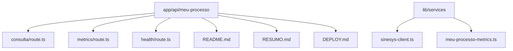
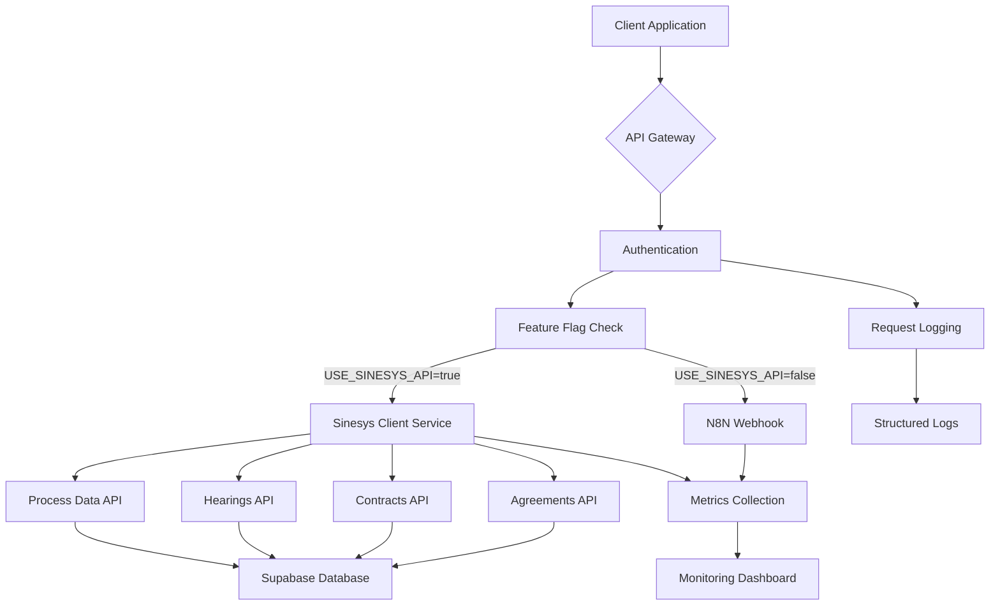
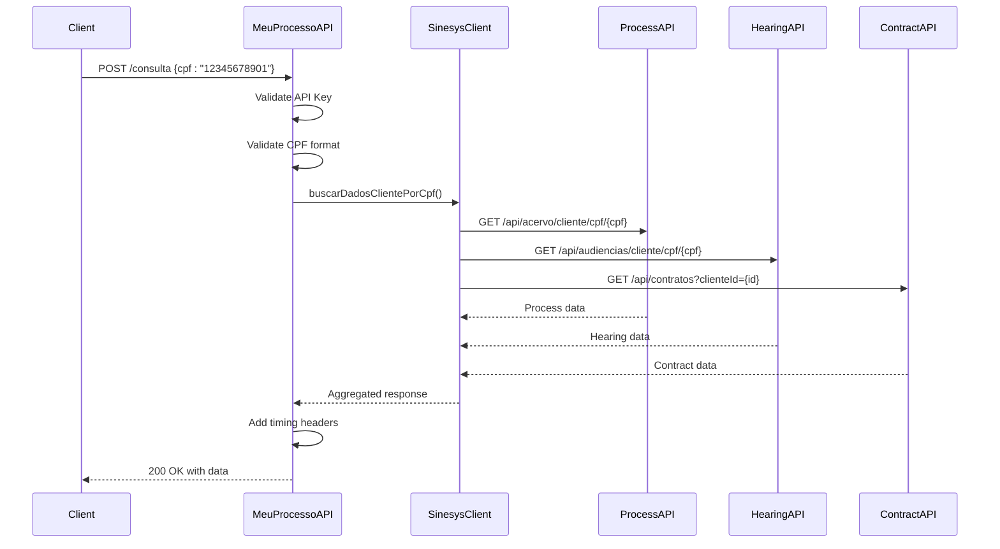
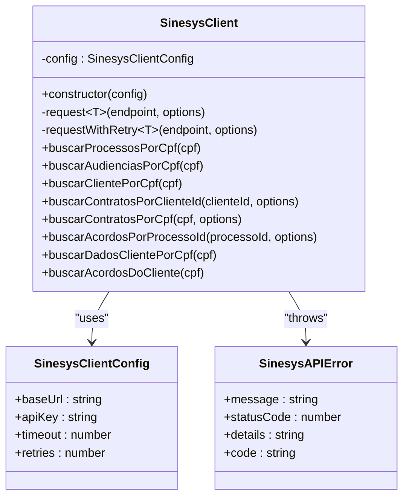
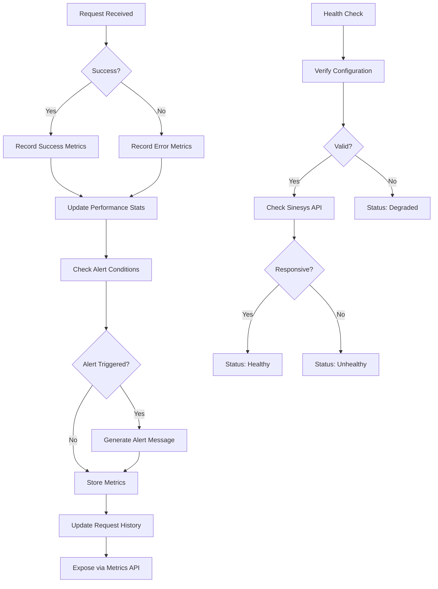
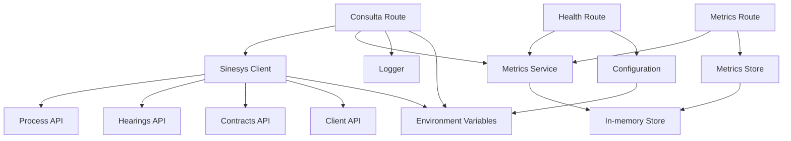

# Meu Processo API

<cite>
**Referenced Files in This Document**   
- [route.ts](file://app/api/meu-processo/consulta/route.ts)
- [sinesys-client.ts](file://lib/services/sinesys-client.ts)
- [meu-processo-metrics.ts](file://lib/services/meu-processo-metrics.ts)
- [route.ts](file://app/api/meu-processo/metrics/route.ts)
- [route.ts](file://app/api/meu-processo/health/route.ts)
- [README.md](file://app/api/meu-processo/README.md)
- [RESUMO.md](file://app/api/meu-processo/RESUMO.md)
- [DEPLOY.md](file://app/api/meu-processo/DEPLOY.md)
</cite>

## Table of Contents
1. [Introduction](#introduction)
2. [Project Structure](#project-structure)
3. [Core Components](#core-components)
4. [Architecture Overview](#architecture-overview)
5. [Detailed Component Analysis](#detailed-component-analysis)
6. [Dependency Analysis](#dependency-analysis)
7. [Performance Considerations](#performance-considerations)
8. [Troubleshooting Guide](#troubleshooting-guide)
9. [Conclusion](#conclusion)

## Introduction

The Meu Processo API is a RESTful service designed to provide client data retrieval by CPF (Cadastro de Pessoas Físicas) for the Meu Processo application. This API serves as a bridge between the frontend application and the Sinesys backend systems, aggregating data from multiple sources into a unified response. The system was migrated from an N8N webhook architecture to a native REST API implementation, maintaining backward compatibility while enhancing observability, resilience, and performance monitoring capabilities.

The API follows modern best practices with comprehensive documentation, health checks, metrics collection, and a robust deployment strategy that includes feature flags and fallback mechanisms. It provides a secure, authenticated interface for accessing sensitive client information with proper authorization controls and data protection measures.

**Section sources**
- [README.md](file://app/api/meu-processo/README.md#L1-L331)
- [RESUMO.md](file://app/api/meu-processo/RESUMO.md#L1-L241)

## Project Structure

The Meu Processo API is organized within the Next.js application structure under the `app/api/meu-processo` directory. This directory contains all the route handlers, configuration files, and documentation necessary for the API's operation. The structure follows a modular approach with clear separation between different functional components.

The API endpoints are implemented as Next.js route handlers, with each endpoint having its own file and functionality. Supporting services and utilities are located in the `lib/services` directory, which contains the Sinesys client implementation and metrics collection functionality. Comprehensive documentation is provided in multiple files including README.md (technical documentation), RESUMO.md (implementation summary), and DEPLOY.md (deployment guide).

The project structure emphasizes maintainability and operational excellence, with dedicated files for different aspects of the system's lifecycle. This organization allows for clear separation of concerns between implementation, monitoring, and operational procedures.

**Diagram sources**
- [README.md](file://app/api/meu-processo/README.md#L1-L331)
- [RESUMO.md](file://app/api/meu-processo/RESUMO.md#L1-L241)

**Section sources**
- [README.md](file://app/api/meu-processo/README.md#L1-L331)

## Core Components

The Meu Processo API consists of several core components that work together to provide a reliable and observable service. The primary component is the consultation endpoint (`/api/meu-processo/consulta`) which serves as the main interface for retrieving client data by CPF. This endpoint orchestrates requests to multiple backend services, aggregating process data, hearings, contracts, and agreements into a single response.

Supporting this main endpoint are several critical components: the Sinesys client service that handles communication with backend APIs, the metrics collection system that provides observability, and the health check endpoint that monitors system status. The architecture incorporates feature flags to enable safe deployment and fallback mechanisms to ensure service continuity during issues with the primary data source.

The system is designed with resilience in mind, incorporating timeout controls, retry mechanisms, and circuit breaker patterns to handle transient failures gracefully. Security is maintained through service API key authentication, ensuring that only authorized clients can access the sensitive data provided by the API.

**Section sources**
- [route.ts](file://app/api/meu-processo/consulta/route.ts#L1-L206)
- [sinesys-client.ts](file://lib/services/sinesys-client.ts#L1-L373)
- [meu-processo-metrics.ts](file://lib/services/meu-processo-metrics.ts#L1-L375)

## Architecture Overview

The Meu Processo API implements a layered architecture that separates concerns between routing, business logic, and external service integration. The architecture is designed to be resilient, observable, and maintainable, with clear pathways for monitoring and troubleshooting.

At the highest level, the API receives requests through Next.js route handlers, which validate authentication and input parameters before delegating to service components. The Sinesys client service acts as an abstraction layer for all external API communications, handling retries, timeouts, and error handling in a consistent manner. Data from multiple backend services is aggregated and returned to the client in a unified format.

The architecture incorporates several key patterns: feature flags for safe deployment, circuit breakers for resilience, and comprehensive metrics collection for observability. The system can operate in multiple modes, with the ability to fall back to legacy N8N webhook services if the primary Sinesys API is unavailable, ensuring high availability and zero downtime during migrations or service disruptions.

**Diagram sources**
- [DEPLOY.md](file://app/api/meu-processo/DEPLOY.md#L37-L48)
- [route.ts](file://app/api/meu-processo/consulta/route.ts#L1-L206)

**Section sources**
- [DEPLOY.md](file://app/api/meu-processo/DEPLOY.md#L1-L592)
- [README.md](file://app/api/meu-processo/README.md#L1-L331)

## Detailed Component Analysis

### Consultation Endpoint Analysis

The consultation endpoint is the primary interface of the Meu Processo API, responsible for aggregating client data from multiple sources. This endpoint implements a POST method that accepts a CPF parameter and returns comprehensive information about the client's legal processes, hearings, contracts, and agreements.

The implementation follows a structured approach with authentication validation, input validation, and error handling at each step. After successful authentication with the service API key, the endpoint validates the CPF format to ensure it contains exactly 11 numeric digits and is not a repetitive sequence. The request processing is timed using a dedicated Timer class, and all operations are logged with structured logging for observability.

Upon successful validation, the endpoint delegates to the Sinesys client service to retrieve data from multiple backend APIs in parallel, optimizing performance through concurrent requests. The response includes HTTP headers indicating processing time and data source, with cache control headers to optimize client-side performance.

#### For API/Service Components:

**Diagram sources**
- [route.ts](file://app/api/meu-processo/consulta/route.ts#L58-L206)
- [sinesys-client.ts](file://lib/services/sinesys-client.ts#L274-L298)

**Section sources**
- [route.ts](file://app/api/meu-processo/consulta/route.ts#L1-L206)

### Sinesys Client Service Analysis

The Sinesys client service provides a unified interface for communicating with various backend APIs within the Sinesys ecosystem. This service abstracts the complexities of HTTP communication, error handling, and retry logic, providing higher-level methods for data retrieval by CPF.

The service implements a configurable HTTP client with support for timeouts, retries, and automatic error handling. It uses the Fetch API with AbortController for timeout management and implements exponential backoff for retry attempts. The client handles both successful responses and various error conditions, transforming them into consistent error objects that can be properly logged and monitored.

Key methods include retrieving processes, hearings, client information, contracts, and agreements by CPF. The service also provides a method to fetch all client data in a single call, which executes multiple requests in parallel for optimal performance. For endpoints that require client IDs rather than CPFs, the service automatically performs the necessary lookup to bridge this gap.

#### For Object-Oriented Components:

**Diagram sources**
- [sinesys-client.ts](file://lib/services/sinesys-client.ts#L22-L373)

**Section sources**
- [sinesys-client.ts](file://lib/services/sinesys-client.ts#L1-L373)

### Metrics and Monitoring Analysis

The metrics and monitoring system provides comprehensive observability for the Meu Processo API, enabling performance tracking, error monitoring, and alerting. This system collects detailed metrics about each request, including duration, success status, data source, and error information, storing them for analysis and reporting.

The implementation includes a metrics store that maintains request history in memory (with potential for Redis in production), calculating performance statistics such as average response time, P95/P99 latencies, success rates, and error distributions. The system also implements structured logging with CPF masking to protect sensitive information while providing detailed operational insights.

Alerting capabilities are built into the system, with configurable conditions for high error rates, elevated latency, and excessive fallback usage. These alerts can be integrated with external monitoring systems to provide proactive notifications of potential issues. The metrics endpoint exposes this data through a dedicated API, allowing external systems to consume and visualize the performance characteristics of the service.

#### For Complex Logic Components:

**Diagram sources**
- [meu-processo-metrics.ts](file://lib/services/meu-processo-metrics.ts#L1-L375)
- [route.ts](file://app/api/meu-processo/metrics/route.ts#L1-L46)

**Section sources**
- [meu-processo-metrics.ts](file://lib/services/meu-processo-metrics.ts#L1-L375)

## Dependency Analysis

The Meu Processo API has a well-defined dependency structure that separates concerns between different layers of the application. The primary dependencies are organized into three main categories: external services, internal services, and infrastructure components.

External dependencies include the Sinesys backend APIs for process data, hearings, contracts, and client information. These services are accessed through the Sinesys client service, which abstracts the communication details and provides a consistent interface. The API also depends on Supabase for database operations, though this dependency is indirect through the backend services.

Internal dependencies within the application include the metrics and logging services, which are used across multiple components for observability. The health check and metrics endpoints depend on the same core functionality as the consultation endpoint, sharing the authentication and configuration systems. The feature flag system creates a conditional dependency on the N8N webhook service, which serves as a fallback when the primary Sinesys API is disabled or unavailable.

The dependency graph shows a clean separation between the route handlers (presentation layer), service components (business logic), and external integrations (data access). This architecture enables independent testing and deployment of components while maintaining a cohesive system overall.

**Diagram sources**
- [route.ts](file://app/api/meu-processo/consulta/route.ts#L1-L206)
- [sinesys-client.ts](file://lib/services/sinesys-client.ts#L1-L373)
- [meu-processo-metrics.ts](file://lib/services/meu-processo-metrics.ts#L1-L375)

**Section sources**
- [route.ts](file://app/api/meu-processo/consulta/route.ts#L1-L206)
- [sinesys-client.ts](file://lib/services/sinesys-client.ts#L1-L373)

## Performance Considerations

The Meu Processo API has been designed with performance as a critical requirement, implementing several strategies to ensure responsive service delivery. The expected performance targets include a P50 latency of under 1 second, P95 under 3 seconds, and P99 under 5 seconds, with a default timeout of 30 seconds to prevent hanging requests.

To achieve these performance goals, the system implements multiple optimization strategies. The primary optimization is parallel execution of backend API calls, allowing the consultation endpoint to retrieve process, hearing, and contract data simultaneously rather than sequentially. This approach significantly reduces total response time compared to serial execution.

Additional performance features include HTTP caching with a configurable TTL (default 5 minutes), reducing the load on backend systems for repeated requests. The service also implements retry logic with exponential backoff to handle transient failures without immediately returning errors to clients. Timeout controls prevent individual requests from consuming excessive resources, and the circuit breaker pattern could be implemented to temporarily bypass failing services.

The metrics system provides detailed performance monitoring, tracking P50, P95, and P99 latencies to identify performance degradation before it impacts users. Alerting is configured for high latency conditions, enabling proactive intervention when response times exceed acceptable thresholds.

**Section sources**
- [README.md](file://app/api/meu-processo/README.md#L251-L270)
- [meu-processo-metrics.ts](file://lib/services/meu-processo-metrics.ts#L85-L90)

## Troubleshooting Guide

The Meu Processo API includes comprehensive troubleshooting capabilities to assist with issue identification and resolution. Common issues are documented with their causes and solutions, and the system provides multiple diagnostic endpoints and logging mechanisms to support troubleshooting efforts.

The primary troubleshooting tools are the health check and metrics endpoints. The health check endpoint (`/api/meu-processo/health`) verifies the system's operational status, checking configuration validity and connectivity to dependent services. This endpoint returns detailed status information for each component, making it easy to identify the source of issues.

The metrics endpoint (`/api/meu-processo/metrics`) provides detailed performance and error data, including request success rates, latency percentiles, and error distributions. This information is essential for diagnosing performance issues and identifying patterns in error occurrences. Structured logging with CPF masking provides detailed operational insights while protecting sensitive information.

Common issues and their solutions include authentication failures (resolved by verifying the service API key), invalid CPF format (resolved by ensuring 11 numeric digits), and backend service errors (resolved by checking connectivity and service status). The system's fallback mechanism to the N8N webhook provides an additional layer of resilience when the primary Sinesys API is unavailable.

**Section sources**
- [README.md](file://app/api/meu-processo/README.md#L308-L325)
- [DEPLOY.md](file://app/api/meu-processo/DEPLOY.md#L471-L510)

## Conclusion

The Meu Processo API represents a significant advancement over the previous webhook-based implementation, providing a more reliable, observable, and maintainable solution for delivering client data to the Meu Processo application. The migration to a native REST API architecture has enabled enhanced performance monitoring, improved error handling, and greater operational control through feature flags and fallback mechanisms.

The system demonstrates best practices in API design, with comprehensive documentation, robust security controls, and a thoughtful approach to resilience and observability. The implementation of structured logging, detailed metrics collection, and proactive alerting provides the foundation for effective monitoring and rapid issue resolution.

The deployment strategy, including canary releases and a well-defined rollback procedure, ensures that updates can be delivered with minimal risk to production systems. The thorough documentation, including operational guides and troubleshooting procedures, empowers teams to effectively manage and maintain the system over time.

Overall, the Meu Processo API delivers on its objectives of providing reliable, secure access to client data while establishing a foundation for future enhancements and improvements.