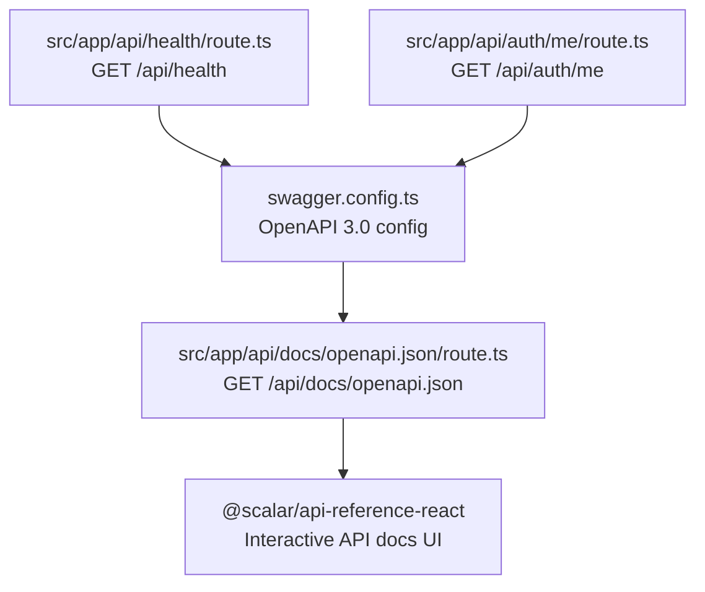
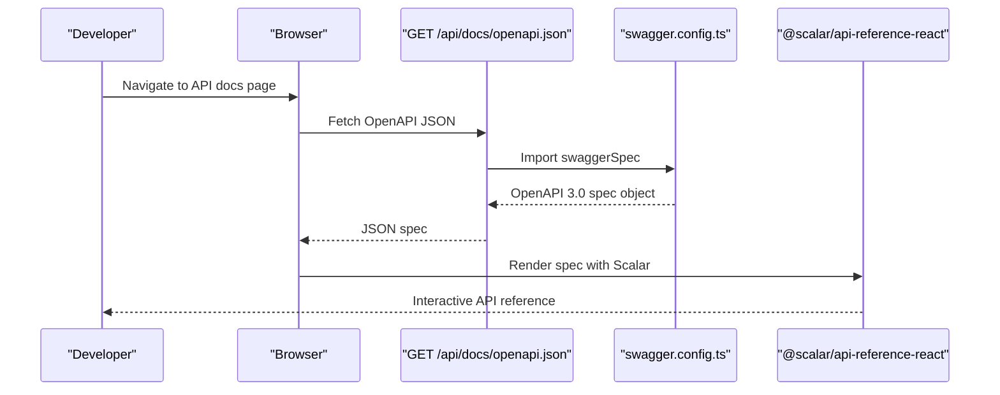
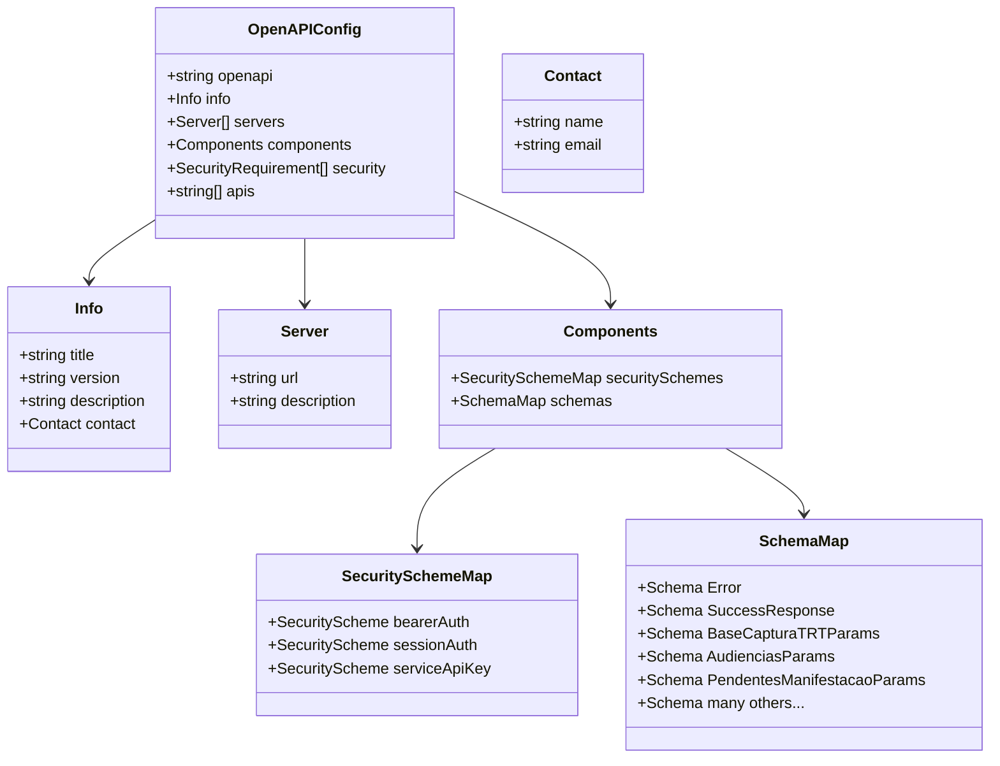
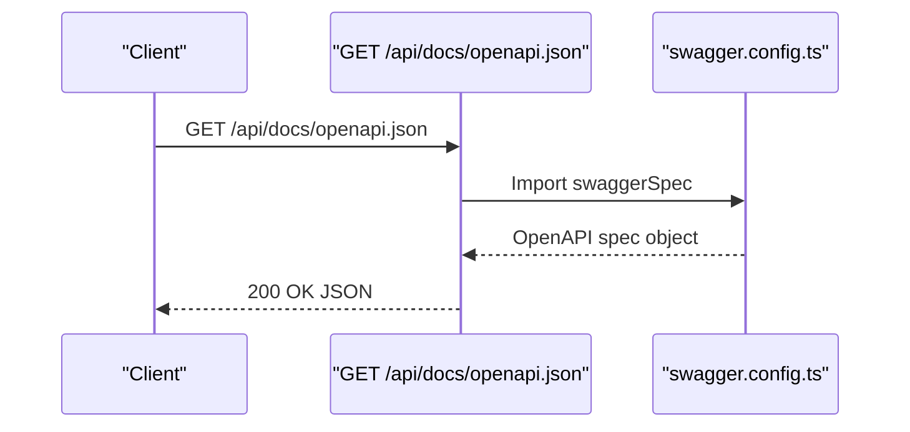
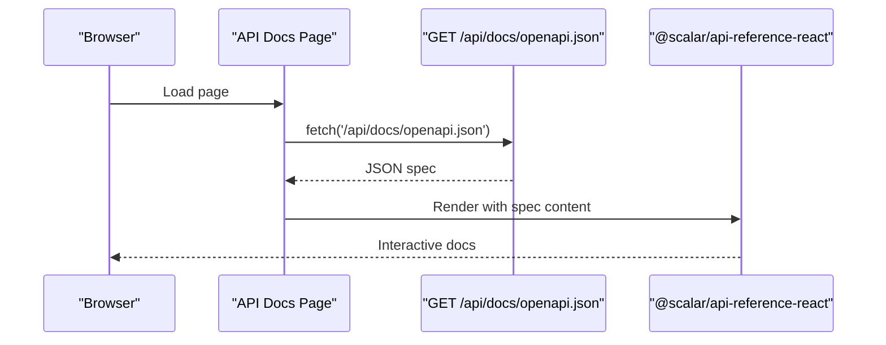
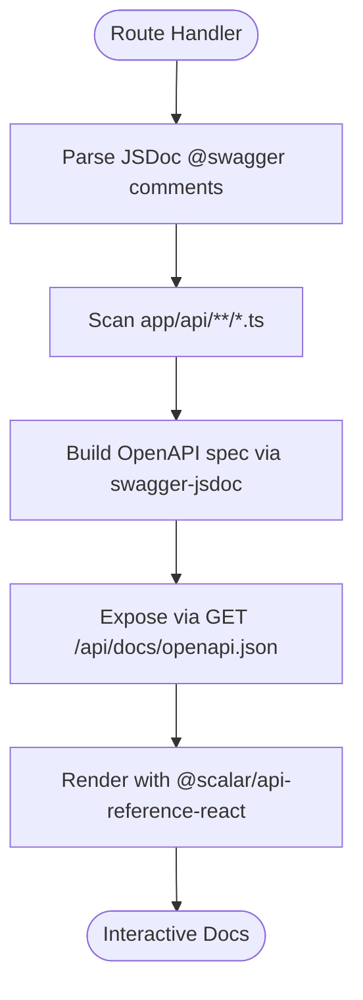
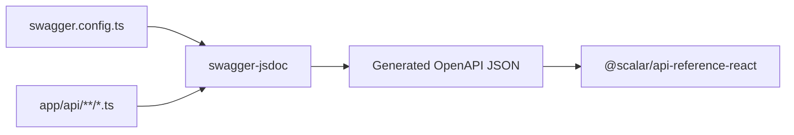

# OpenAPI Specification

<cite>
**Referenced Files in This Document**
- [swagger.config.ts](file://swagger.config.ts)
- [src/swagger.config.ts](file://src/swagger.config.ts)
- [src/app/api/docs/openapi.json/route.ts](file://src/app/api/docs/openapi.json/route.ts)
- [src/app/api/health/route.ts](file://src/app/api/health/route.ts)
- [src/app/api/auth/me/route.ts](file://src/app/api/auth/me/route.ts)
- [src/app/(ajuda)/ajuda/integracao/api/page.tsx](file://src/app/(ajuda)/ajuda/integracao/api/page.tsx)
- [src/app/(ajuda)/ajuda/desenvolvimento/api-swagger/page.tsx](file://src/app/(ajuda)/ajuda/desenvolvimento/api-swagger/page.tsx)
- [src/proxy.ts](file://src/proxy.ts)
- [package.json](file://package.json)
</cite>

## Table of Contents
1. [Introduction](#introduction)
2. [Project Structure](#project-structure)
3. [Core Components](#core-components)
4. [Architecture Overview](#architecture-overview)
5. [Detailed Component Analysis](#detailed-component-analysis)
6. [Dependency Analysis](#dependency-analysis)
7. [Performance Considerations](#performance-considerations)
8. [Troubleshooting Guide](#troubleshooting-guide)
9. [Conclusion](#conclusion)
10. [Appendices](#appendices)

## Introduction
This document describes the OpenAPI 3.0 specification and API discovery mechanism for the ZattarOS platform. It explains how the OpenAPI specification is generated, how endpoints are categorized, and how developers can explore, test, and maintain the API. It also documents authentication mechanisms, reusable schemas, and the integration of interactive documentation tools.

## Project Structure
The OpenAPI specification is centrally configured and exposed via a dedicated route. The configuration defines:
- API metadata (title, version, contact)
- Servers (development and production)
- Security schemes (Bearer JWT, Supabase session cookie, service API key)
- Reusable schemas for common responses and request parameters
- Path scanning pattern for route discovery

**Diagram sources**
- [swagger.config.ts:1-575](file://swagger.config.ts#L1-L575)
- [src/app/api/docs/openapi.json/route.ts:1-22](file://src/app/api/docs/openapi.json/route.ts#L1-L22)
- [src/app/(ajuda)/ajuda/integracao/api/page.tsx:1-116](file://src/app/(ajuda)/ajuda/integracao/api/page.tsx#L1-L116)
- [src/app/api/health/route.ts:1-45](file://src/app/api/health/route.ts#L1-L45)
- [src/app/api/auth/me/route.ts:1-87](file://src/app/api/auth/me/route.ts#L1-L87)

**Section sources**
- [swagger.config.ts:1-575](file://swagger.config.ts#L1-L575)
- [src/app/api/docs/openapi.json/route.ts:1-22](file://src/app/api/docs/openapi.json/route.ts#L1-L22)
- [src/app/(ajuda)/ajuda/integracao/api/page.tsx:1-116](file://src/app/(ajuda)/ajuda/integracao/api/page.tsx#L1-L116)

## Core Components
- OpenAPI configuration: Defines metadata, servers, security schemes, and reusable schemas.
- Spec endpoint: Returns the OpenAPI JSON for consumption by documentation tools.
- Interactive docs: Uses Scalar API Reference to render the spec in a modern UI.
- Discovery: Routes under app/api/**/*.ts are automatically included via the swagger-jsdoc configuration.

Key configuration highlights:
- OpenAPI version: 3.0.0
- Info: title, version, description, contact
- Servers: localhost (development), api.synthropic.com.br (production)
- Security: bearerAuth (JWT), sessionAuth (Supabase cookie), serviceApiKey (header)
- Paths: Scanned from ./app/api/**/*.ts

**Section sources**
- [swagger.config.ts:1-575](file://swagger.config.ts#L1-L575)
- [src/app/api/docs/openapi.json/route.ts:1-22](file://src/app/api/docs/openapi.json/route.ts#L1-L22)

## Architecture Overview
The API discovery and documentation pipeline integrates configuration, route handlers, and a UI renderer:

**Diagram sources**
- [src/app/api/docs/openapi.json/route.ts:1-22](file://src/app/api/docs/openapi.json/route.ts#L1-L22)
- [swagger.config.ts:1-575](file://swagger.config.ts#L1-L575)
- [src/app/(ajuda)/ajuda/integracao/api/page.tsx:1-116](file://src/app/(ajuda)/ajuda/integracao/api/page.tsx#L1-L116)

## Detailed Component Analysis

### OpenAPI Configuration
The central configuration defines:
- Metadata: title, version, description, contact
- Servers: development and production URLs
- Security schemes: bearerAuth, sessionAuth, serviceApiKey
- Reusable schemas: Error, SuccessResponse, BaseCapturaTRTParams, AudienciasParams, PendentesManifestacaoParams, and many domain-specific schemas
- Paths: Scanned from app/api/**/*.ts

**Diagram sources**
- [swagger.config.ts:1-575](file://swagger.config.ts#L1-L575)

**Section sources**
- [swagger.config.ts:1-575](file://swagger.config.ts#L1-L575)

### Spec Endpoint
The spec endpoint exposes the generated OpenAPI JSON for external consumption and UI rendering.

**Diagram sources**
- [src/app/api/docs/openapi.json/route.ts:1-22](file://src/app/api/docs/openapi.json/route.ts#L1-L22)
- [swagger.config.ts:1-575](file://swagger.config.ts#L1-L575)

**Section sources**
- [src/app/api/docs/openapi.json/route.ts:1-22](file://src/app/api/docs/openapi.json/route.ts#L1-L22)

### Interactive Documentation Page
The interactive documentation page loads the spec and renders it using Scalar API Reference.

**Diagram sources**
- [src/app/(ajuda)/ajuda/integracao/api/page.tsx:1-116](file://src/app/(ajuda)/ajuda/integracao/api/page.tsx#L1-L116)
- [src/app/api/docs/openapi.json/route.ts:1-22](file://src/app/api/docs/openapi.json/route.ts#L1-L22)

**Section sources**
- [src/app/(ajuda)/ajuda/integracao/api/page.tsx:1-116](file://src/app/(ajuda)/ajuda/integracao/api/page.tsx#L1-L116)

### Example Routes and Documentation Patterns
- Health check route demonstrates the documented pattern with JSDoc @swagger blocks.
- Auth/me route consolidates user profile and permissions, showcasing reusable schemas and structured responses.

**Diagram sources**
- [src/app/api/health/route.ts:1-45](file://src/app/api/health/route.ts#L1-L45)
- [src/app/api/auth/me/route.ts:1-87](file://src/app/api/auth/me/route.ts#L1-L87)
- [swagger.config.ts:1-575](file://swagger.config.ts#L1-L575)

**Section sources**
- [src/app/api/health/route.ts:1-45](file://src/app/api/health/route.ts#L1-L45)
- [src/app/api/auth/me/route.ts:1-87](file://src/app/api/auth/me/route.ts#L1-L87)

## Dependency Analysis
- swagger-jsdoc: Generates OpenAPI spec from JSDoc comments and configuration.
- @scalar/api-reference-react: Renders the OpenAPI spec in a modern, interactive UI.
- Next.js routes: Under app/api/**/*.ts are scanned and included in the spec.

**Diagram sources**
- [swagger.config.ts:1-575](file://swagger.config.ts#L1-L575)
- [package.json:311-311](file://package.json#L311-L311)
- [package.json:219-219](file://package.json#L219-L219)

**Section sources**
- [swagger.config.ts:1-575](file://swagger.config.ts#L1-L575)
- [package.json:311-311](file://package.json#L311-L311)
- [package.json:219-219](file://package.json#L219-L219)

## Performance Considerations
- Keep JSDoc blocks concise and accurate to minimize parsing overhead.
- Limit excessive schema reuse to avoid deeply nested references that complicate rendering.
- Prefer small, focused schemas for common patterns to improve readability and reduce payload sizes in documentation previews.

## Troubleshooting Guide
Common issues and resolutions:
- Documentation not appearing:
  - Verify the Next.js server is running.
  - Confirm JSDoc comments start with @swagger and match the route path.
  - Check browser console for errors.
- Routes not discovered:
  - Ensure route files are located under app/api/**/*.ts.
  - Confirm the path pattern in swagger.config.ts matches the actual file locations.
- Interactive docs failing to load:
  - Validate GET /api/docs/openapi.json returns valid JSON.
  - Check network tab for CORS or fetch errors.
- Authentication failures:
  - Ensure Authorization header uses Bearer token or session cookie is present.
  - Verify service API key is provided via x-service-api-key header when required.

**Section sources**
- [src/app/(ajuda)/ajuda/desenvolvimento/api-swagger/page.tsx:51-280](file://src/app/(ajuda)/ajuda/desenvolvimento/api-swagger/page.tsx#L51-L280)
- [src/app/(ajuda)/ajuda/integracao/api/page.tsx:58-116](file://src/app/(ajuda)/ajuda/integracao/api/page.tsx#L58-L116)

## Conclusion
ZattarOS leverages a centralized OpenAPI 3.0 configuration and swagger-jsdoc to generate a machine-readable specification that powers interactive documentation via @scalar/api-reference-react. The approach ensures discoverability, consistency, and developer-friendly exploration of the API surface. By following documented patterns and maintaining accurate JSDoc blocks, teams can keep the specification current and useful across development and integration workflows.

## Appendices

### API Versioning Strategy
- The OpenAPI info.version field is defined in the configuration. Increment this value when introducing breaking changes or significant new features.
- Maintain backward-compatible additions (new endpoints, optional fields) to preserve existing clients.

**Section sources**
- [swagger.config.ts:4-14](file://swagger.config.ts#L4-L14)

### Endpoint Categorization
- Endpoints are grouped by feature areas under app/api/. The configuration scans all TypeScript route files under this directory.
- Typical categories include: auth, captura, documentos, financeiro, integracoes, and others.

**Section sources**
- [swagger.config.ts:568-571](file://swagger.config.ts#L568-L571)
- [src/proxy.ts:144-179](file://src/proxy.ts#L144-L179)

### Documentation Generation Process
- Generate the OpenAPI JSON by accessing GET /api/docs/openapi.json.
- Use the JSON with @scalar/api-reference-react to render interactive docs.
- For programmatic consumption, import swaggerSpec from the configuration file.

**Section sources**
- [src/app/api/docs/openapi.json/route.ts:1-22](file://src/app/api/docs/openapi.json/route.ts#L1-L22)
- [src/app/(ajuda)/ajuda/integracao/api/page.tsx:104-113](file://src/app/(ajuda)/ajuda/integracao/api/page.tsx#L104-L113)
- [src/swagger.config.ts:1-4](file://src/swagger.config.ts#L1-L4)

### Examples of Client SDK Generation, Automated Testing, and API Exploration Tools
- Client SDK generation: Use the OpenAPI JSON to generate typed clients with official OpenAPI tooling (e.g., openapi-generator).
- Automated testing: Validate API behavior against the spec using tools that consume OpenAPI JSON (e.g., Postman/Newman, Insomnia, or custom Jest tests).
- API exploration tools: Browse and test endpoints via the interactive docs rendered by @scalar/api-reference-react.

**Section sources**
- [src/app/(ajuda)/ajuda/integracao/api/page.tsx:1-116](file://src/app/(ajuda)/ajuda/integracao/api/page.tsx#L1-L116)
- [package.json:311-311](file://package.json#L311-L311)
- [package.json:219-219](file://package.json#L219-L219)

### Schema Evolution, Backward Compatibility, and Deprecation Policies
- Backward compatibility: Add new fields as optional and avoid removing or renaming existing properties in-place.
- Schema evolution: Introduce new versions by incrementing the OpenAPI version and marking deprecated fields with deprecation notices in JSDoc.
- Deprecation policy: Announce deprecations with clear timelines and migration guidance; retain deprecated endpoints for a grace period while issuing warnings.

[No sources needed since this section provides general guidance]

### API Documentation Standards and Integration with Development Workflows
- Standards:
  - Use @swagger blocks with accurate paths, methods, summaries, and responses.
  - Define reusable schemas for common request/response shapes.
  - Keep descriptions concise but informative.
- Integration:
  - Run health checks (e.g., GET /api/health) during CI/CD to validate API availability.
  - Include OpenAPI JSON in release artifacts for downstream consumers.
  - Enforce JSDoc compliance in pre-commit hooks or CI linting.

**Section sources**
- [src/app/api/health/route.ts:1-45](file://src/app/api/health/route.ts#L1-L45)
- [src/app/(ajuda)/ajuda/desenvolvimento/api-swagger/page.tsx:51-280](file://src/app/(ajuda)/ajuda/desenvolvimento/api-swagger/page.tsx#L51-L280)