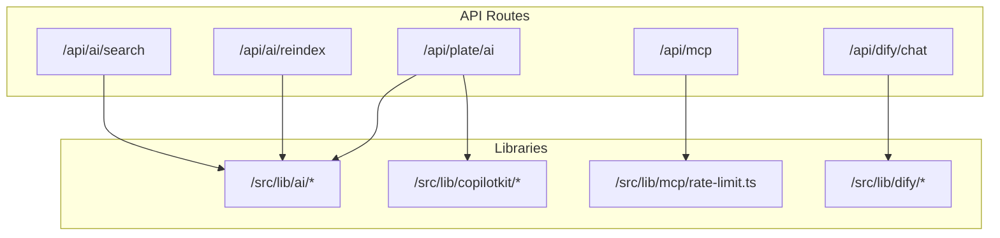
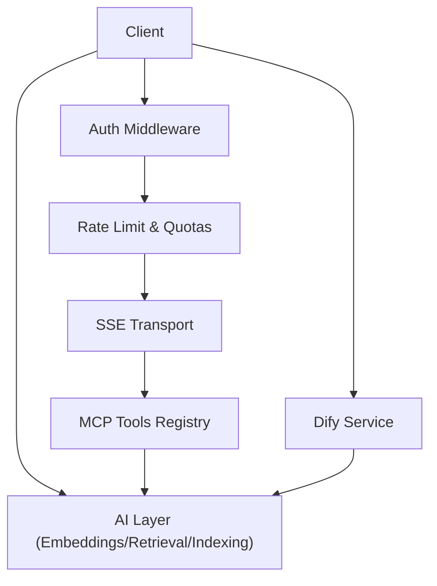
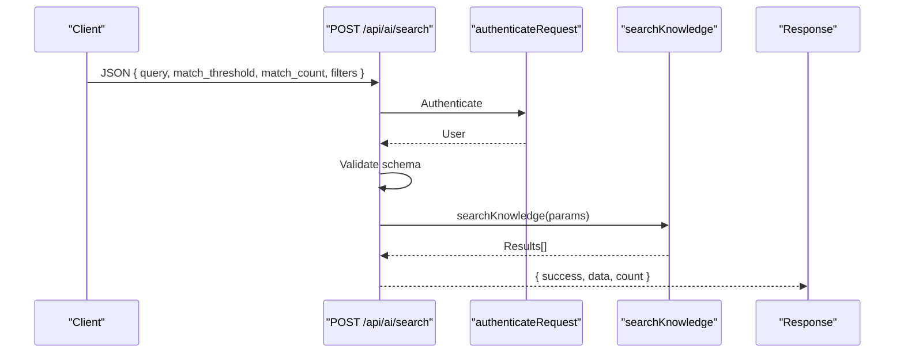
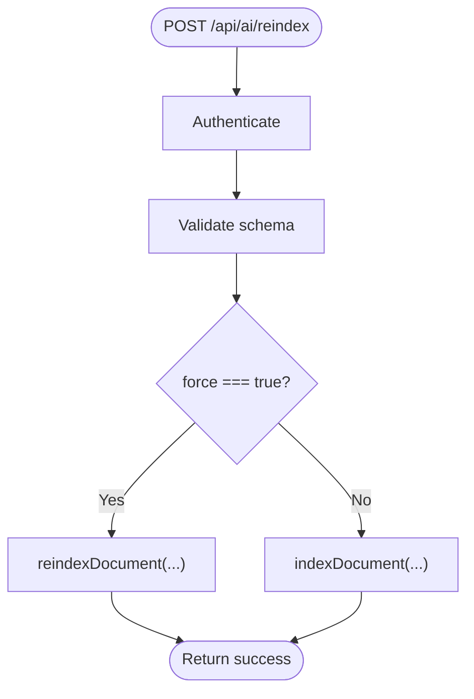
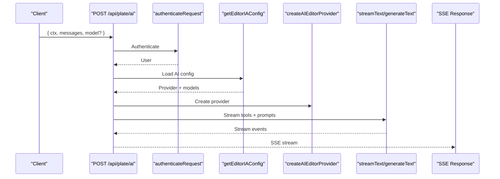
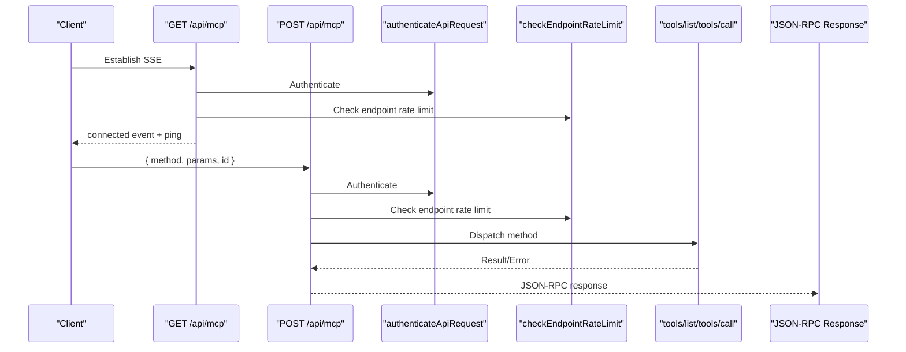
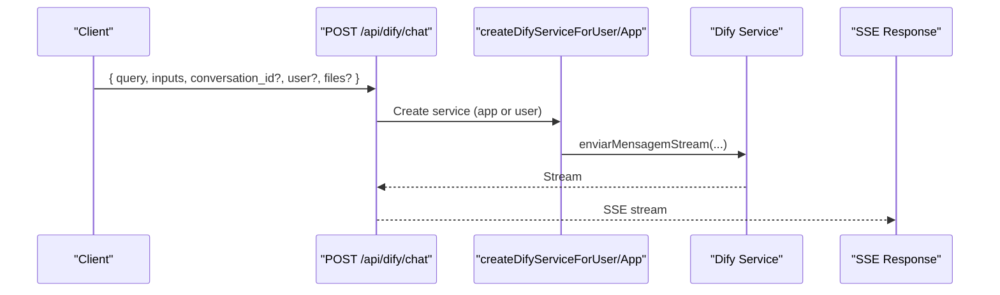
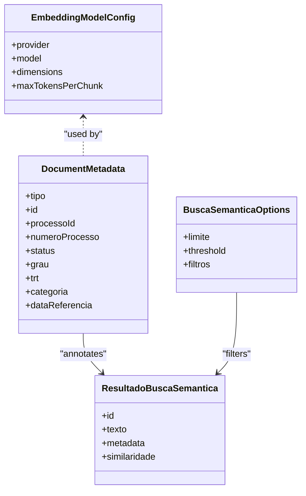
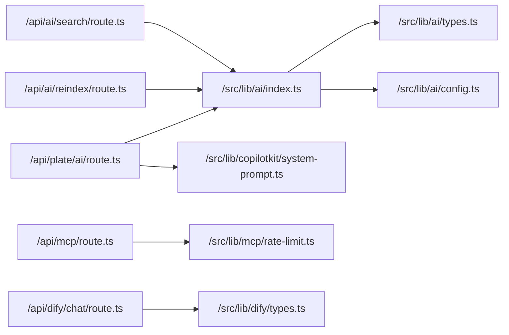

# AI Integration APIs

<cite>
**Referenced Files in This Document**
- [src/app/api/ai/search/route.ts](file://src/app/api/ai/search/route.ts)
- [src/app/api/ai/reindex/route.ts](file://src/app/api/ai/reindex/route.ts)
- [src/app/api/plate/ai/route.ts](file://src/app/api/plate/ai/route.ts)
- [src/app/api/mcp/route.ts](file://src/app/api/mcp/route.ts)
- [src/app/api/dify/chat/route.ts](file://src/app/api/dify/chat/route.ts)
- [src/lib/ai/index.ts](file://src/lib/ai/index.ts)
- [src/lib/ai/config.ts](file://src/lib/ai/config.ts)
- [src/lib/ai/types.ts](file://src/lib/ai/types.ts)
- [src/lib/dify/types.ts](file://src/lib/dify/types.ts)
- [src/lib/mcp/rate-limit.ts](file://src/lib/mcp/rate-limit.ts)
- [src/lib/copilotkit/system-prompt.ts](file://src/lib/copilotkit/system-prompt.ts)
</cite>

## Table of Contents
1. [Introduction](#introduction)
2. [Project Structure](#project-structure)
3. [Core Components](#core-components)
4. [Architecture Overview](#architecture-overview)
5. [Detailed Component Analysis](#detailed-component-analysis)
6. [Dependency Analysis](#dependency-analysis)
7. [Performance Considerations](#performance-considerations)
8. [Troubleshooting Guide](#troubleshooting-guide)
9. [Conclusion](#conclusion)

## Introduction
This document provides comprehensive API documentation for AI-powered endpoints and integrations in the system. It covers Retrieval-Augmented Generation (RAG) APIs, embedding generation, vector search, Model Context Protocol (MCP) server communication, Dify workflow integration, CopilotKit agent APIs, AI command execution, search functionality, and content generation workflows. It also documents request/response schemas, rate limiting, model selection, and performance optimization strategies for AI operations.

## Project Structure
The AI integration surface is organized around several API routes and supporting libraries:
- AI search and indexing endpoints under `/api/ai/*`
- Plate AI editor integration under `/api/plate/ai`
- MCP server under `/api/mcp`
- Dify chat/workflow integrations under `/api/dify/*`
- AI configuration, types, and services under `/src/lib/ai/*`
- Dify types and client under `/src/lib/dify/*`
- Rate limiting utilities under `/src/lib/mcp/rate-limit.ts`
- CopilotKit system prompt configuration under `/src/lib/copilotkit/*`

**Diagram sources**
- [src/app/api/ai/search/route.ts:1-87](file://src/app/api/ai/search/route.ts#L1-L87)
- [src/app/api/ai/reindex/route.ts:1-70](file://src/app/api/ai/reindex/route.ts#L1-L70)
- [src/app/api/plate/ai/route.ts:1-432](file://src/app/api/plate/ai/route.ts#L1-L432)
- [src/app/api/mcp/route.ts:1-437](file://src/app/api/mcp/route.ts#L1-L437)
- [src/app/api/dify/chat/route.ts:1-80](file://src/app/api/dify/chat/route.ts#L1-L80)
- [src/lib/ai/index.ts:1-76](file://src/lib/ai/index.ts#L1-L76)
- [src/lib/dify/types.ts:1-606](file://src/lib/dify/types.ts#L1-L606)
- [src/lib/mcp/rate-limit.ts:1-408](file://src/lib/mcp/rate-limit.ts#L1-L408)
- [src/lib/copilotkit/system-prompt.ts:1-33](file://src/lib/copilotkit/system-prompt.ts#L1-L33)

**Section sources**
- [src/app/api/ai/search/route.ts:1-87](file://src/app/api/ai/search/route.ts#L1-L87)
- [src/app/api/ai/reindex/route.ts:1-70](file://src/app/api/ai/reindex/route.ts#L1-L70)
- [src/app/api/plate/ai/route.ts:1-432](file://src/app/api/plate/ai/route.ts#L1-L432)
- [src/app/api/mcp/route.ts:1-437](file://src/app/api/mcp/route.ts#L1-L437)
- [src/app/api/dify/chat/route.ts:1-80](file://src/app/api/dify/chat/route.ts#L1-L80)
- [src/lib/ai/index.ts:1-76](file://src/lib/ai/index.ts#L1-L76)
- [src/lib/dify/types.ts:1-606](file://src/lib/dify/types.ts#L1-L606)
- [src/lib/mcp/rate-limit.ts:1-408](file://src/lib/mcp/rate-limit.ts#L1-L408)
- [src/lib/copilotkit/system-prompt.ts:1-33](file://src/lib/copilotkit/system-prompt.ts#L1-L33)

## Core Components
- AI Search and Retrieval: Semantic search, hybrid search, and RAG context retrieval with configurable thresholds and limits.
- Embedding Generation and Indexing: Chunking, embedding generation, and document indexing with caching and reindex support.
- Plate AI Editor Integration: Server-Sent streaming for AI-driven editing with tool selection and specialized prompts.
- MCP Server: SSE-based Model Context Protocol server with authentication, rate limiting, quotas, and tool execution.
- Dify Integration: Chat and workflow streaming with structured request/response types and knowledge base operations.
- CopilotKit Agent: System prompts and runtime configuration for the Pedrinho legal assistant.

**Section sources**
- [src/lib/ai/index.ts:1-76](file://src/lib/ai/index.ts#L1-L76)
- [src/lib/ai/config.ts:1-103](file://src/lib/ai/config.ts#L1-L103)
- [src/lib/ai/types.ts:1-106](file://src/lib/ai/types.ts#L1-L106)
- [src/lib/dify/types.ts:1-606](file://src/lib/dify/types.ts#L1-L606)
- [src/lib/mcp/rate-limit.ts:1-408](file://src/lib/mcp/rate-limit.ts#L1-L408)
- [src/lib/copilotkit/system-prompt.ts:1-33](file://src/lib/copilotkit/system-prompt.ts#L1-L33)

## Architecture Overview
The AI architecture integrates multiple providers and protocols:
- Embedding and retrieval powered by configurable providers (OpenAI/Cohere) with chunking and caching.
- Streaming responses via Server-Sent Events (SSE) for MCP and Dify integrations.
- Authentication and rate limiting enforced at the API gateway level.
- Dify workflows and chat complement traditional RAG pipelines.

**Diagram sources**
- [src/app/api/mcp/route.ts:1-437](file://src/app/api/mcp/route.ts#L1-L437)
- [src/lib/mcp/rate-limit.ts:1-408](file://src/lib/mcp/rate-limit.ts#L1-L408)
- [src/app/api/dify/chat/route.ts:1-80](file://src/app/api/dify/chat/route.ts#L1-L80)
- [src/lib/ai/index.ts:1-76](file://src/lib/ai/index.ts#L1-L76)

## Detailed Component Analysis

### AI Search API
- Purpose: Perform semantic search over indexed knowledge with configurable thresholds and limits.
- Authentication: Required.
- Endpoints:
  - POST /api/ai/search: Accepts JSON body with query and filters; returns results with similarity scores.
  - GET /api/ai/search: Accepts query parameters (q, threshold, limit, entity_type, parent_id); returns results.
- Validation: Uses Zod schema for input validation.
- Response: success flag, data array of results, and count.

**Diagram sources**
- [src/app/api/ai/search/route.ts:1-87](file://src/app/api/ai/search/route.ts#L1-L87)
- [src/lib/ai/index.ts:46-52](file://src/lib/ai/index.ts#L46-L52)

**Section sources**
- [src/app/api/ai/search/route.ts:1-87](file://src/app/api/ai/search/route.ts#L1-L87)
- [src/lib/ai/types.ts:44-65](file://src/lib/ai/types.ts#L44-L65)

### AI Reindex API
- Purpose: Index or force reindex a document with metadata and content type.
- Authentication: Required.
- Endpoint: POST /api/ai/reindex
- Behavior: Validates input, checks force flag, and calls indexDocument or reindexDocument with enriched metadata.
- Response: success flag and message indicating index or reindex outcome.

**Diagram sources**
- [src/app/api/ai/reindex/route.ts:1-70](file://src/app/api/ai/reindex/route.ts#L1-L70)

**Section sources**
- [src/app/api/ai/reindex/route.ts:1-70](file://src/app/api/ai/reindex/route.ts#L1-L70)
- [src/lib/ai/types.ts:34-39](file://src/lib/ai/types.ts#L34-L39)

### Plate AI Editor API
- Purpose: Stream AI-generated content for document editing with tool selection and specialized prompts.
- Authentication: Required; includes endpoint-level rate limiting.
- Endpoint: POST /api/plate/ai
- Features:
  - Tool selection: generate, edit, comment.
  - Streaming via Server-Sent Events.
  - Model selection with fallbacks from configuration.
  - Tool-specific prompts and transformations.
- Response: SSE stream of UI messages and tool outputs.

**Diagram sources**
- [src/app/api/plate/ai/route.ts:1-432](file://src/app/api/plate/ai/route.ts#L1-L432)

**Section sources**
- [src/app/api/plate/ai/route.ts:1-432](file://src/app/api/plate/ai/route.ts#L1-L432)
- [src/lib/ai/config.ts:1-103](file://src/lib/ai/config.ts#L1-L103)
- [src/lib/copilotkit/system-prompt.ts:1-33](file://src/lib/copilotkit/system-prompt.ts#L1-L33)

### MCP Server API
- Purpose: Serve Model Context Protocol over SSE with tool discovery, execution, and rate limiting.
- Endpoints:
  - GET /api/mcp: Establish SSE connection with ping and connection info.
  - POST /api/mcp: Handle JSON-RPC 2.0 requests (initialize, tools/list, tools/call).
  - OPTIONS /api/mcp: Preflight CORS.
- Authentication: Supports service API key, Bearer JWT, and cookies; tier-based rate limiting.
- Rate Limiting: Sliding window with Redis; supports endpoint-specific and tool-specific limits.
- Quotas: Optional quota enforcement with increment after successful tool execution.

**Diagram sources**
- [src/app/api/mcp/route.ts:1-437](file://src/app/api/mcp/route.ts#L1-L437)
- [src/lib/mcp/rate-limit.ts:1-408](file://src/lib/mcp/rate-limit.ts#L1-L408)

**Section sources**
- [src/app/api/mcp/route.ts:1-437](file://src/app/api/mcp/route.ts#L1-L437)
- [src/lib/mcp/rate-limit.ts:1-408](file://src/lib/mcp/rate-limit.ts#L1-L408)

### Dify Chat API
- Purpose: Stream Dify chat responses with optional conversation ID and file attachments.
- Endpoint: POST /api/dify/chat
- Authentication: Not enforced at API level; service handles user context.
- Streaming: Returns SSE stream of Dify events (message, message_end, agent_thought, etc.).
- Request Schema: Zod-based validation for inputs, query, response_mode, conversation_id, user, files.

**Diagram sources**
- [src/app/api/dify/chat/route.ts:1-80](file://src/app/api/dify/chat/route.ts#L1-L80)
- [src/lib/dify/types.ts:18-26](file://src/lib/dify/types.ts#L18-L26)

**Section sources**
- [src/app/api/dify/chat/route.ts:1-80](file://src/app/api/dify/chat/route.ts#L1-L80)
- [src/lib/dify/types.ts:1-606](file://src/lib/dify/types.ts#L1-L606)

### AI Library and Types
- AI Library Exports: Embedding generation, indexing, retrieval, summarization, and domain/service utilities.
- Configuration: Embedding provider selection, chunking parameters, retrieval thresholds, cache settings, and API key validation.
- Types: Document metadata, search options, embedding model config, text chunks, and indexation status.

**Diagram sources**
- [src/lib/ai/types.ts:1-106](file://src/lib/ai/types.ts#L1-L106)
- [src/lib/ai/config.ts:1-103](file://src/lib/ai/config.ts#L1-L103)

**Section sources**
- [src/lib/ai/index.ts:1-76](file://src/lib/ai/index.ts#L1-L76)
- [src/lib/ai/config.ts:1-103](file://src/lib/ai/config.ts#L1-L103)
- [src/lib/ai/types.ts:1-106](file://src/lib/ai/types.ts#L1-L106)

### Dify Types
- Chat, Workflow, and Completion request/response interfaces.
- Knowledge base and retrieval types, SSE event types, and extended features (annotations, audio, files).
- Batch embedding status and segment/chunk operations.

**Section sources**
- [src/lib/dify/types.ts:1-606](file://src/lib/dify/types.ts#L1-L606)

## Dependency Analysis
- API routes depend on authentication and rate limiting utilities.
- MCP server depends on tool registry, rate limiting, and logging utilities.
- Dify integration depends on typed request/response contracts and streaming.
- AI library centralizes embedding, indexing, and retrieval logic used by multiple endpoints.

**Diagram sources**
- [src/app/api/ai/search/route.ts:1-87](file://src/app/api/ai/search/route.ts#L1-L87)
- [src/app/api/ai/reindex/route.ts:1-70](file://src/app/api/ai/reindex/route.ts#L1-L70)
- [src/app/api/plate/ai/route.ts:1-432](file://src/app/api/plate/ai/route.ts#L1-L432)
- [src/app/api/mcp/route.ts:1-437](file://src/app/api/mcp/route.ts#L1-L437)
- [src/app/api/dify/chat/route.ts:1-80](file://src/app/api/dify/chat/route.ts#L1-L80)
- [src/lib/ai/index.ts:1-76](file://src/lib/ai/index.ts#L1-L76)
- [src/lib/ai/types.ts:1-106](file://src/lib/ai/types.ts#L1-L106)
- [src/lib/ai/config.ts:1-103](file://src/lib/ai/config.ts#L1-L103)
- [src/lib/mcp/rate-limit.ts:1-408](file://src/lib/mcp/rate-limit.ts#L1-L408)
- [src/lib/dify/types.ts:1-606](file://src/lib/dify/types.ts#L1-L606)
- [src/lib/copilotkit/system-prompt.ts:1-33](file://src/lib/copilotkit/system-prompt.ts#L1-L33)

**Section sources**
- [src/app/api/ai/search/route.ts:1-87](file://src/app/api/ai/search/route.ts#L1-L87)
- [src/app/api/ai/reindex/route.ts:1-70](file://src/app/api/ai/reindex/route.ts#L1-L70)
- [src/app/api/plate/ai/route.ts:1-432](file://src/app/api/plate/ai/route.ts#L1-L432)
- [src/app/api/mcp/route.ts:1-437](file://src/app/api/mcp/route.ts#L1-L437)
- [src/app/api/dify/chat/route.ts:1-80](file://src/app/api/dify/chat/route.ts#L1-L80)
- [src/lib/ai/index.ts:1-76](file://src/lib/ai/index.ts#L1-L76)
- [src/lib/ai/types.ts:1-106](file://src/lib/ai/types.ts#L1-L106)
- [src/lib/ai/config.ts:1-103](file://src/lib/ai/config.ts#L1-L103)
- [src/lib/mcp/rate-limit.ts:1-408](file://src/lib/mcp/rate-limit.ts#L1-L408)
- [src/lib/dify/types.ts:1-606](file://src/lib/dify/types.ts#L1-L606)
- [src/lib/copilotkit/system-prompt.ts:1-33](file://src/lib/copilotkit/system-prompt.ts#L1-L33)

## Performance Considerations
- Embedding Provider Selection: Choose providers and models aligned with cost/performance targets; adjust dimensions and chunk sizes accordingly.
- Chunking and Overlap: Tune chunk size and overlap to balance context retention and token costs.
- Retrieval Limits: Set appropriate default and maximum limits; consider pagination for large result sets.
- Streaming: Prefer SSE for long-running operations to reduce latency and improve UX.
- Rate Limiting: Use sliding window with Redis for predictable throughput; configure endpoint and tool-specific limits.
- Caching: Enable embedding cache with sensible TTL to reduce redundant computations.
- MCP Quotas: Implement quota enforcement to prevent abuse and ensure fair usage.

[No sources needed since this section provides general guidance]

## Troubleshooting Guide
- Authentication Failures:
  - Ensure proper headers (Bearer JWT, service API key, or cookies) are provided for authenticated endpoints.
  - Verify that the user context is present for MCP tool execution requiring authentication.
- Rate Limit Exceeded:
  - Monitor X-RateLimit-* headers; adjust client backoff and retry policies.
  - Review tier-based limits and endpoint overrides.
- Redis Unavailable:
  - Fail-open mode allows requests when Redis is down; consider enabling fail-closed mode for stricter control.
- Dify Streaming Issues:
  - Confirm SSE support and handle client disconnects gracefully.
  - Validate request schemas and user context before initiating streams.
- Plate AI Errors:
  - Check AI configuration availability and model fallbacks.
  - Inspect tool selection and prompt preparation steps.

**Section sources**
- [src/lib/mcp/rate-limit.ts:1-408](file://src/lib/mcp/rate-limit.ts#L1-L408)
- [src/app/api/mcp/route.ts:1-437](file://src/app/api/mcp/route.ts#L1-L437)
- [src/app/api/dify/chat/route.ts:1-80](file://src/app/api/dify/chat/route.ts#L1-L80)
- [src/app/api/plate/ai/route.ts:1-432](file://src/app/api/plate/ai/route.ts#L1-L432)

## Conclusion
The AI integration suite provides robust, production-grade endpoints for semantic search, embedding generation, vector search, MCP-based tooling, Dify workflows, and editor-driven AI assistance. With comprehensive authentication, rate limiting, and streaming capabilities, the system supports scalable AI operations across legal domain applications. Proper configuration of models, chunking, and retrieval parameters ensures optimal performance and cost-efficiency.