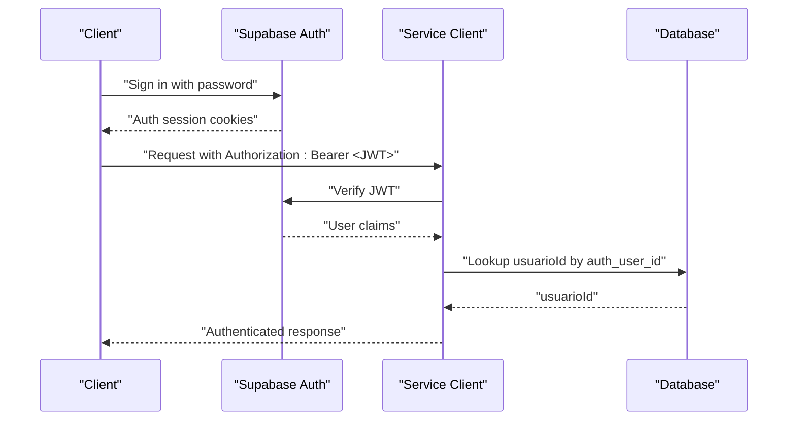
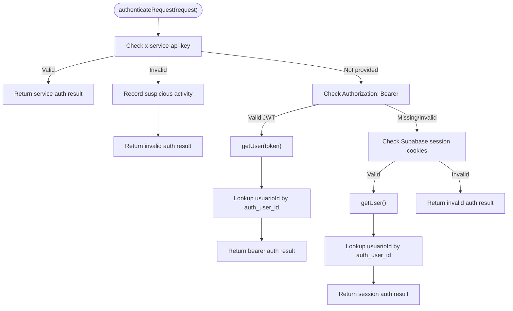
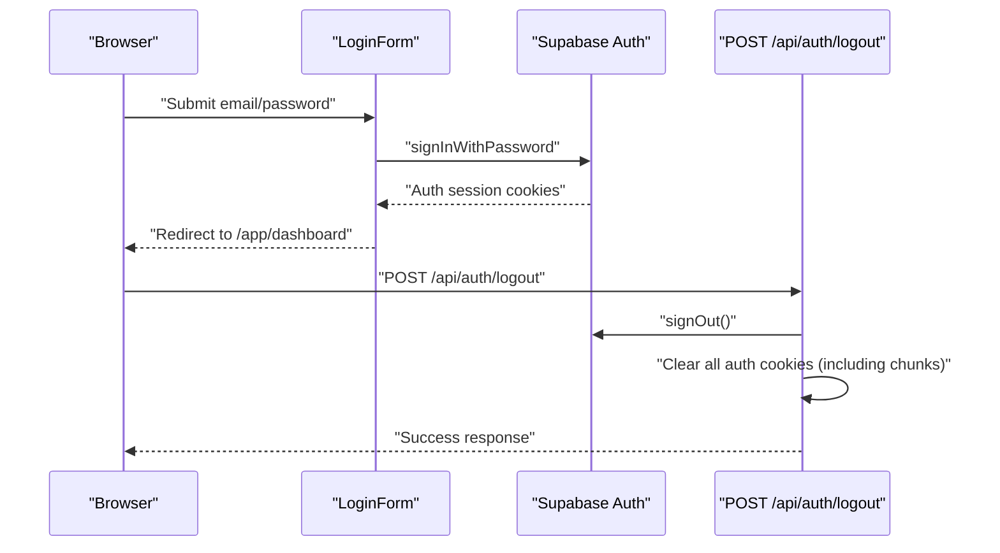
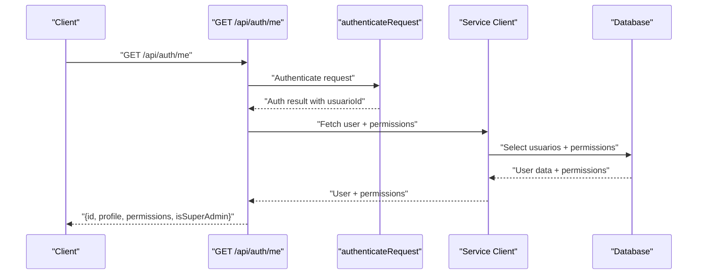
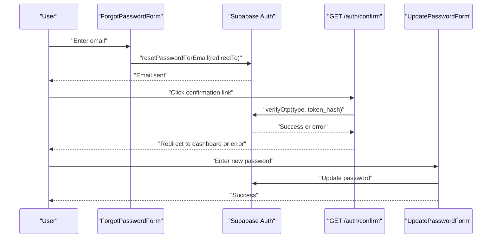
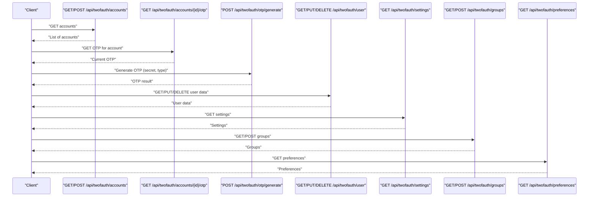
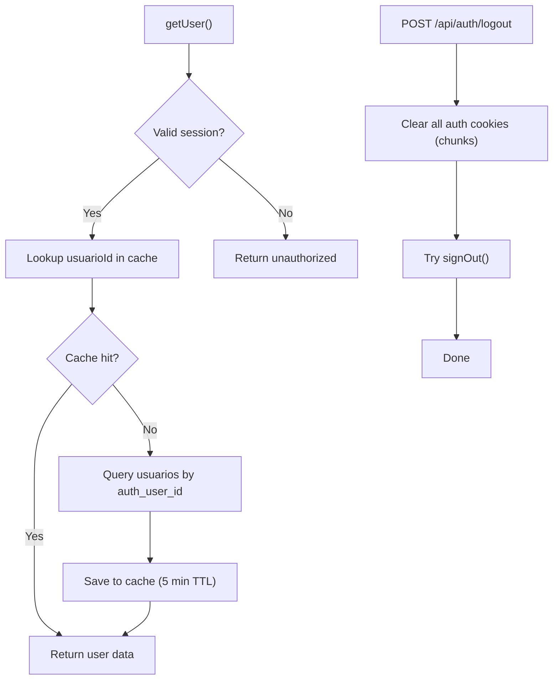
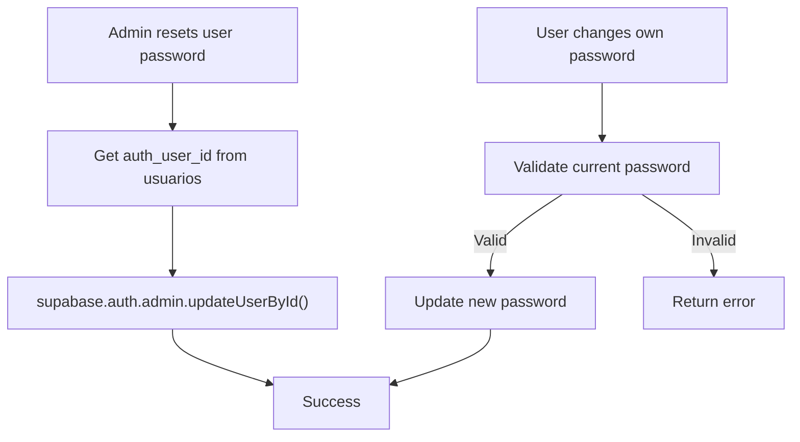
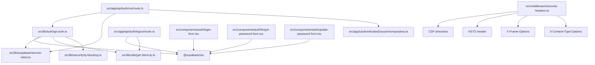

# Authentication APIs

<cite>
**Referenced Files in This Document**
- [src/lib/auth/api-auth.ts](file://src/lib/auth/api-auth.ts)
- [src/lib/auth/session.ts](file://src/lib/auth/session.ts)
- [src/app/api/auth/me/route.ts](file://src/app/api/auth/me/route.ts)
- [src/app/api/auth/logout/route.ts](file://src/app/api/auth/logout/route.ts)
- [src/app/api/me/route.ts](file://src/app/api/me/route.ts)
- [src/app/api/perfil/route.ts](file://src/app/api/perfil/route.ts)
- [src/app/api/permissoes/minhas/route.ts](file://src/app/api/permissoes/minhas/route.ts)
- [src/components/auth/login-form.tsx](file://src/components/auth/login-form.tsx)
- [src/components/auth/forgot-password-form.tsx](file://src/components/auth/forgot-password-form.tsx)
- [src/components/auth/update-password-form.tsx](file://src/components/auth/update-password-form.tsx)
- [src/app/(auth)/confirm/route.ts](file://src/app/(auth)/confirm/route.ts)
- [src/app/api/twofauth/accounts/route.ts](file://src/app/api/twofauth/accounts/route.ts)
- [src/app/api/twofauth/accounts/[id]/otp/route.ts](file://src/app/api/twofauth/accounts/[id]/otp/route.ts)
- [src/app/api/twofauth/otp/generate/route.ts](file://src/app/api/twofauth/otp/generate/route.ts)
- [src/app/api/twofauth/user/route.ts](file://src/app/api/twofauth/user/route.ts)
- [src/app/api/twofauth/settings/route.ts](file://src/app/api/twofauth/settings/route.ts)
- [src/app/api/twofauth/settings/[name]/route.ts](file://src/app/api/twofauth/settings/[name]/route.ts)
- [src/app/api/twofauth/groups/route.ts](file://src/app/api/twofauth/groups/route.ts)
- [src/app/api/twofauth/preferences/route.ts](file://src/app/api/twofauth/preferences/route.ts)
- [src/lib/twofauth/hooks/use-twofauth-accounts.ts](file://src/lib/twofauth/hooks/use-twofauth-accounts.ts)
- [src/hooks/use-twofauth.ts](file://src/hooks/use-twofauth.ts)
- [src/lib/integrations/twofauth/otp.ts](file://src/lib/integrations/twofauth/otp.ts)
- [src/app/(authenticated)/usuarios/actions/senha-actions.ts](file://src/app/(authenticated)/usuarios/actions/senha-actions.ts)
- [src/app/(authenticated)/perfil/components/alterar-senha-dialog.tsx](file://src/app/(authenticated)/perfil/components/alterar-senha-dialog.tsx)
- [src/lib/__tests__/integration/auth-session.test.ts](file://src/lib/__tests__/integration/auth-session.test.ts)
- [src/lib/__tests__/integration/auth-require-permission.test.ts](file://src/lib/__tests__/integration/auth-require-permission.test.ts)
- [src/middleware/security-headers.ts](file://src/middleware/security-headers.ts)
</cite>

## Table of Contents
1. [Introduction](#introduction)
2. [Project Structure](#project-structure)
3. [Core Components](#core-components)
4. [Architecture Overview](#architecture-overview)
5. [Detailed Component Analysis](#detailed-component-analysis)
6. [Dependency Analysis](#dependency-analysis)
7. [Performance Considerations](#performance-considerations)
8. [Troubleshooting Guide](#troubleshooting-guide)
9. [Conclusion](#conclusion)

## Introduction
This document provides comprehensive API documentation for authentication endpoints in the system. It covers login/logout mechanisms, session management, user profile retrieval, and two-factor authentication (2FA) endpoints. It also documents token-based authentication, JWT handling, session validation, password reset flows, confirmation emails, and account verification processes. Practical examples, error handling for invalid credentials, expired sessions, and rate-limiting scenarios are included to guide developers integrating with these APIs.

## Project Structure
Authentication-related functionality spans client components, server routes, and middleware:
- Client authentication UI: Login, forgot password, and update password forms
- Server authentication routes: Profile, permissions, basic user info, logout, and consolidated auth/me
- 2FA integration routes: Accounts, OTP generation, user settings, groups, preferences
- Authentication utilities: Dual-mode authentication supporting Supabase Auth sessions, Bearer tokens, and service API keys
- Middleware: Security headers for protection against common web vulnerabilities

```mermaid
graph TB
subgraph "Client"
LoginForm["Login Form<br/>src/components/auth/login-form.tsx"]
ForgotPwd["Forgot Password Form<br/>src/components/auth/forgot-password-form.tsx"]
UpdatePwd["Update Password Form<br/>src/components/auth/update-password-form.tsx"]
end
subgraph "Server Routes"
AuthMe["GET /api/auth/me<br/>src/app/api/auth/me/route.ts"]
Me["GET /api/me<br/>src/app/api/me/route.ts"]
Perfil["GET /api/perfil<br/>src/app/api/perfil/route.ts"]
Perms["GET /api/permissoes/minhas<br/>src/app/api/permissoes/minhas/route.ts"]
Logout["POST /api/auth/logout<br/>src/app/api/auth/logout/route.ts"]
Confirm["GET /auth/confirm<br/>src/app/(auth)/confirm/route.ts"]
end
subgraph "2FA Integration"
AccList["GET /api/twofauth/accounts<br/>src/app/api/twofauth/accounts/route.ts"]
AccOTP["GET /api/twofauth/accounts/{id}/otp<br/>src/app/api/twofauth/accounts/[id]/otp/route.ts"]
OTPGen["POST /api/twofauth/otp/generate<br/>src/app/api/twofauth/otp/generate/route.ts"]
TwofUser["GET/PUT/DELETE /api/twofauth/user<br/>src/app/api/twofauth/user/route.ts"]
TwofSettings["GET /api/twofauth/settings<br/>src/app/api/twofauth/settings/route.ts"]
TwofSettingName["GET /api/twofauth/settings/{name}<br/>src/app/api/twofauth/settings/[name]/route.ts"]
TwofGroups["GET/POST /api/twofauth/groups<br/>src/app/api/twofauth/groups/route.ts"]
TwofPrefs["GET /api/twofauth/preferences<br/>src/app/api/twofauth/preferences/route.ts"]
end
subgraph "Auth Utilities"
ApiAuth["authenticateRequest()<br/>src/lib/auth/api-auth.ts"]
SessionAuth["authenticateRequest()<br/>src/lib/auth/session.ts"]
end
LoginForm --> ApiAuth
ForgotPwd --> ApiAuth
UpdatePwd --> ApiAuth
AuthMe --> ApiAuth
Me --> ApiAuth
Perfil --> ApiAuth
Perms --> ApiAuth
Logout --> ApiAuth
AccList --> ApiAuth
AccOTP --> ApiAuth
OTPGen --> ApiAuth
TwofUser --> ApiAuth
TwofSettings --> ApiAuth
TwofSettingName --> ApiAuth
TwofGroups --> ApiAuth
TwofPrefs --> ApiAuth
```

**Diagram sources**
- [src/components/auth/login-form.tsx:1-196](file://src/components/auth/login-form.tsx#L1-L196)
- [src/app/api/auth/me/route.ts:1-87](file://src/app/api/auth/me/route.ts#L1-L87)
- [src/app/api/me/route.ts:1-87](file://src/app/api/me/route.ts#L1-L87)
- [src/app/api/perfil/route.ts:1-77](file://src/app/api/perfil/route.ts#L1-L77)
- [src/app/api/permissoes/minhas/route.ts:1-93](file://src/app/api/permissoes/minhas/route.ts#L1-L93)
- [src/app/api/auth/logout/route.ts:1-108](file://src/app/api/auth/logout/route.ts#L1-L108)
- [src/app/(auth)/confirm/route.ts](file://src/app/(auth)/confirm/route.ts#L1-L31)
- [src/app/api/twofauth/accounts/route.ts:1-189](file://src/app/api/twofauth/accounts/route.ts#L1-L189)
- [src/app/api/twofauth/accounts/[id]/otp/route.ts](file://src/app/api/twofauth/accounts/[id]/otp/route.ts#L49-L108)
- [src/app/api/twofauth/otp/generate/route.ts:1-147](file://src/app/api/twofauth/otp/generate/route.ts#L1-L147)
- [src/app/api/twofauth/user/route.ts:1-221](file://src/app/api/twofauth/user/route.ts#L1-L221)
- [src/app/api/twofauth/settings/route.ts:1-67](file://src/app/api/twofauth/settings/route.ts#L1-L67)
- [src/app/api/twofauth/settings/[name]/route.ts](file://src/app/api/twofauth/settings/[name]/route.ts#L17-L135)
- [src/app/api/twofauth/groups/route.ts:1-128](file://src/app/api/twofauth/groups/route.ts#L1-L128)
- [src/app/api/twofauth/preferences/route.ts:1-55](file://src/app/api/twofauth/preferences/route.ts#L1-L55)
- [src/lib/auth/api-auth.ts:1-275](file://src/lib/auth/api-auth.ts#L1-L275)
- [src/lib/auth/session.ts:1-46](file://src/lib/auth/session.ts#L1-L46)

**Section sources**
- [src/lib/auth/api-auth.ts:1-275](file://src/lib/auth/api-auth.ts#L1-L275)
- [src/lib/auth/session.ts:1-46](file://src/lib/auth/session.ts#L1-L46)
- [src/app/api/auth/me/route.ts:1-87](file://src/app/api/auth/me/route.ts#L1-L87)
- [src/app/api/auth/logout/route.ts:1-108](file://src/app/api/auth/logout/route.ts#L1-L108)
- [src/app/api/me/route.ts:1-87](file://src/app/api/me/route.ts#L1-L87)
- [src/app/api/perfil/route.ts:1-77](file://src/app/api/perfil/route.ts#L1-L77)
- [src/app/api/permissoes/minhas/route.ts:1-93](file://src/app/api/permissoes/minhas/route.ts#L1-L93)
- [src/components/auth/login-form.tsx:1-196](file://src/components/auth/login-form.tsx#L1-L196)
- [src/components/auth/forgot-password-form.tsx:1-136](file://src/components/auth/forgot-password-form.tsx#L1-L136)
- [src/components/auth/update-password-form.tsx:154-295](file://src/components/auth/update-password-form.tsx#L154-L295)
- [src/app/(auth)/confirm/route.ts](file://src/app/(auth)/confirm/route.ts#L1-L31)
- [src/app/api/twofauth/accounts/route.ts:1-189](file://src/app/api/twofauth/accounts/route.ts#L1-L189)
- [src/app/api/twofauth/accounts/[id]/otp/route.ts](file://src/app/api/twofauth/accounts/[id]/otp/route.ts#L49-L108)
- [src/app/api/twofauth/otp/generate/route.ts:1-147](file://src/app/api/twofauth/otp/generate/route.ts#L1-L147)
- [src/app/api/twofauth/user/route.ts:1-221](file://src/app/api/twofauth/user/route.ts#L1-L221)
- [src/app/api/twofauth/settings/route.ts:1-67](file://src/app/api/twofauth/settings/route.ts#L1-L67)
- [src/app/api/twofauth/settings/[name]/route.ts](file://src/app/api/twofauth/settings/[name]/route.ts#L17-L135)
- [src/app/api/twofauth/groups/route.ts:1-128](file://src/app/api/twofauth/groups/route.ts#L1-L128)
- [src/app/api/twofauth/preferences/route.ts:1-55](file://src/app/api/twofauth/preferences/route.ts#L1-L55)

## Core Components
- Dual-mode authentication utility supporting three authentication sources:
  - Service API Key (for system jobs)
  - Bearer Token (JWT from Supabase)
  - Supabase Session (cookies)
- Consolidated user info endpoint returning profile, permissions, and super admin status in a single call
- Session termination endpoint clearing all Supabase auth cookies, including chunked cookies
- Password reset flow using Supabase Auth with confirmation email handling
- 2FA integration endpoints for managing accounts, OTP generation, user settings, groups, and preferences

**Section sources**
- [src/lib/auth/api-auth.ts:95-275](file://src/lib/auth/api-auth.ts#L95-L275)
- [src/app/api/auth/me/route.ts:19-86](file://src/app/api/auth/me/route.ts#L19-L86)
- [src/app/api/auth/logout/route.ts:54-107](file://src/app/api/auth/logout/route.ts#L54-L107)
- [src/components/auth/forgot-password-form.tsx:19-36](file://src/components/auth/forgot-password-form.tsx#L19-L36)
- [src/app/(auth)/confirm/route.ts](file://src/app/(auth)/confirm/route.ts#L6-L31)
- [src/app/api/twofauth/accounts/route.ts:36-71](file://src/app/api/twofauth/accounts/route.ts#L36-L71)
- [src/app/api/twofauth/otp/generate/route.ts:94-146](file://src/app/api/twofauth/otp/generate/route.ts#L94-L146)

## Architecture Overview
The authentication architecture supports three primary authentication modes:
- Service API Key: Used for internal system jobs requiring elevated privileges
- Bearer Token: JWT-based authentication for external clients and server-to-server communication
- Supabase Session: Cookie-based session for browser clients

**Diagram sources**
- [src/lib/auth/api-auth.ts:95-275](file://src/lib/auth/api-auth.ts#L95-L275)
- [src/app/api/auth/me/route.ts:19-86](file://src/app/api/auth/me/route.ts#L19-L86)

**Section sources**
- [src/lib/auth/api-auth.ts:95-275](file://src/lib/auth/api-auth.ts#L95-L275)

## Detailed Component Analysis

### Authentication Utilities
The authentication utility supports three authentication sources with priority:
- Service API Key: Highest priority for system jobs
- Bearer Token: JWT validation against Supabase
- Supabase Session: Cookie-based session validation

**Diagram sources**
- [src/lib/auth/api-auth.ts:95-275](file://src/lib/auth/api-auth.ts#L95-L275)

**Section sources**
- [src/lib/auth/api-auth.ts:95-275](file://src/lib/auth/api-auth.ts#L95-L275)

### Login and Logout Endpoints
- Login: Client-side form submits credentials to Supabase Auth; successful login redirects to dashboard
- Logout: Server-side clears all Supabase auth cookies, including chunked cookies, and attempts sign out

**Diagram sources**
- [src/components/auth/login-form.tsx:31-76](file://src/components/auth/login-form.tsx#L31-L76)
- [src/app/api/auth/logout/route.ts:54-107](file://src/app/api/auth/logout/route.ts#L54-L107)

**Section sources**
- [src/components/auth/login-form.tsx:31-76](file://src/components/auth/login-form.tsx#L31-L76)
- [src/app/api/auth/logout/route.ts:54-107](file://src/app/api/auth/logout/route.ts#L54-L107)

### User Profile Retrieval
- GET /api/perfil: Returns profile data for the authenticated user
- GET /api/me: Returns basic user info (id, isSuperAdmin)
- GET /api/permissoes/minhas: Returns user permissions, optionally filtered by resource
- GET /api/auth/me: Consolidated endpoint returning profile, permissions, and super admin status

**Diagram sources**
- [src/app/api/auth/me/route.ts:19-86](file://src/app/api/auth/me/route.ts#L19-L86)
- [src/app/api/perfil/route.ts:21-74](file://src/app/api/perfil/route.ts#L21-L74)
- [src/app/api/permissoes/minhas/route.ts:35-92](file://src/app/api/permissoes/minhas/route.ts#L35-L92)
- [src/app/api/me/route.ts:40-86](file://src/app/api/me/route.ts#L40-L86)

**Section sources**
- [src/app/api/auth/me/route.ts:19-86](file://src/app/api/auth/me/route.ts#L19-L86)
- [src/app/api/perfil/route.ts:21-74](file://src/app/api/perfil/route.ts#L21-L74)
- [src/app/api/permissoes/minhas/route.ts:35-92](file://src/app/api/permissoes/minhas/route.ts#L35-L92)
- [src/app/api/me/route.ts:40-86](file://src/app/api/me/route.ts#L40-L86)

### Password Reset and Account Verification
- Password reset: Sends a reset email via Supabase Auth with a redirect to update-password
- Confirmation: Verifies OTP and redirects to dashboard or error page
- Update password: Validates and applies new password

**Diagram sources**
- [src/components/auth/forgot-password-form.tsx:19-36](file://src/components/auth/forgot-password-form.tsx#L19-L36)
- [src/app/(auth)/confirm/route.ts](file://src/app/(auth)/confirm/route.ts#L6-L31)
- [src/components/auth/update-password-form.tsx:154-295](file://src/components/auth/update-password-form.tsx#L154-L295)

**Section sources**
- [src/components/auth/forgot-password-form.tsx:19-36](file://src/components/auth/forgot-password-form.tsx#L19-L36)
- [src/app/(auth)/confirm/route.ts](file://src/app/(auth)/confirm/route.ts#L6-L31)
- [src/components/auth/update-password-form.tsx:154-295](file://src/components/auth/update-password-form.tsx#L154-L295)

### Two-Factor Authentication Endpoints
- Accounts: List and create 2FA accounts
- OTP: Generate OTP for a given account or on-demand
- User: Get/update/delete 2FA user data
- Settings: Get all settings or a specific setting
- Groups: List and create groups
- Preferences: Get user preferences

**Diagram sources**
- [src/app/api/twofauth/accounts/route.ts:36-71](file://src/app/api/twofauth/accounts/route.ts#L36-L71)
- [src/app/api/twofauth/accounts/[id]/otp/route.ts](file://src/app/api/twofauth/accounts/[id]/otp/route.ts#L52-L108)
- [src/app/api/twofauth/otp/generate/route.ts:94-146](file://src/app/api/twofauth/otp/generate/route.ts#L94-L146)
- [src/app/api/twofauth/user/route.ts:52-221](file://src/app/api/twofauth/user/route.ts#L52-L221)
- [src/app/api/twofauth/settings/route.ts:35-67](file://src/app/api/twofauth/settings/route.ts#L35-L67)
- [src/app/api/twofauth/groups/route.ts:28-71](file://src/app/api/twofauth/groups/route.ts#L28-L71)
- [src/app/api/twofauth/preferences/route.ts:22-54](file://src/app/api/twofauth/preferences/route.ts#L22-L54)

**Section sources**
- [src/app/api/twofauth/accounts/route.ts:36-71](file://src/app/api/twofauth/accounts/route.ts#L36-L71)
- [src/app/api/twofauth/accounts/[id]/otp/route.ts](file://src/app/api/twofauth/accounts/[id]/otp/route.ts#L52-L108)
- [src/app/api/twofauth/otp/generate/route.ts:94-146](file://src/app/api/twofauth/otp/generate/route.ts#L94-L146)
- [src/app/api/twofauth/user/route.ts:52-221](file://src/app/api/twofauth/user/route.ts#L52-L221)
- [src/app/api/twofauth/settings/route.ts:35-67](file://src/app/api/twofauth/settings/route.ts#L35-L67)
- [src/app/api/twofauth/groups/route.ts:28-71](file://src/app/api/twofauth/groups/route.ts#L28-L71)
- [src/app/api/twofauth/preferences/route.ts:22-54](file://src/app/api/twofauth/preferences/route.ts#L22-L54)

### Session Management and Validation
- Session validation uses Supabase getUser() to verify authenticity
- Cache mechanism stores usuarioId for 5 minutes to reduce database queries
- Logout clears all Supabase auth cookies, including chunked cookies (.0, .1, .2...)

**Diagram sources**
- [src/lib/auth/api-auth.ts:22-84](file://src/lib/auth/api-auth.ts#L22-L84)
- [src/app/api/auth/logout/route.ts:54-107](file://src/app/api/auth/logout/route.ts#L54-L107)

**Section sources**
- [src/lib/auth/api-auth.ts:22-84](file://src/lib/auth/api-auth.ts#L22-L84)
- [src/app/api/auth/logout/route.ts:54-107](file://src/app/api/auth/logout/route.ts#L54-L107)

### Password Management
- Admin password reset: Updates user password via Supabase Admin API
- User password change: Validates current password and updates new password

**Diagram sources**
- [src/app/(authenticated)/usuarios/actions/senha-actions.ts](file://src/app/(authenticated)/usuarios/actions/senha-actions.ts#L86-L129)

**Section sources**
- [src/app/(authenticated)/usuarios/actions/senha-actions.ts](file://src/app/(authenticated)/usuarios/actions/senha-actions.ts#L86-L129)
- [src/app/(authenticated)/perfil/components/alterar-senha-dialog.tsx](file://src/app/(authenticated)/perfil/components/alterar-senha-dialog.tsx#L59-L104)

## Dependency Analysis
Authentication relies on Supabase Auth for identity management and integrates with a local database for user metadata. The system uses middleware to enforce security headers and includes tests validating authentication behavior.

**Diagram sources**
- [src/lib/auth/api-auth.ts:1-275](file://src/lib/auth/api-auth.ts#L1-L275)
- [src/app/api/auth/me/route.ts:1-87](file://src/app/api/auth/me/route.ts#L1-L87)
- [src/app/api/auth/logout/route.ts:1-108](file://src/app/api/auth/logout/route.ts#L1-L108)
- [src/components/auth/login-form.tsx:1-196](file://src/components/auth/login-form.tsx#L1-L196)
- [src/components/auth/forgot-password-form.tsx:1-136](file://src/components/auth/forgot-password-form.tsx#L1-L136)
- [src/components/auth/update-password-form.tsx:154-295](file://src/components/auth/update-password-form.tsx#L154-L295)
- [src/middleware/security-headers.ts:1-328](file://src/middleware/security-headers.ts#L1-L328)

**Section sources**
- [src/lib/auth/api-auth.ts:1-275](file://src/lib/auth/api-auth.ts#L1-L275)
- [src/middleware/security-headers.ts:1-328](file://src/middleware/security-headers.ts#L1-L328)

## Performance Considerations
- Authentication caching: usuarioId lookup cached for 5 minutes to reduce database load
- Parallel requests: Consolidated auth/me endpoint fetches profile and permissions concurrently
- Cookie handling: Logout clears all auth cookies, including chunked cookies, ensuring complete session termination
- Security headers: CSP in report-only mode reduces risk while avoiding production breakage

[No sources needed since this section provides general guidance]

## Troubleshooting Guide
Common authentication errors and resolutions:
- Invalid credentials: Login form displays specific error messages for invalid login credentials, unconfirmed email, and database errors
- Expired sessions: authenticateRequest returns unauthorized when session is invalid; use refresh mechanisms or re-authenticate
- Rate limiting: Suspicious activity recorded for invalid service API keys and bearer tokens; monitor logs and adjust configurations
- 2FA issues: Verify account configuration and OTP generation parameters; check group and preference settings

**Section sources**
- [src/components/auth/login-form.tsx:58-72](file://src/components/auth/login-form.tsx#L58-L72)
- [src/lib/auth/api-auth.ts:115-128](file://src/lib/auth/api-auth.ts#L115-L128)
- [src/lib/__tests__/integration/auth-session.test.ts:186-228](file://src/lib/__tests__/integration/auth-session.test.ts#L186-L228)
- [src/lib/__tests__/integration/auth-require-permission.test.ts:1-38](file://src/lib/__tests__/integration/auth-require-permission.test.ts#L1-L38)

## Conclusion
The authentication system provides robust support for multiple authentication modes, comprehensive user profile and permission retrieval, secure logout procedures, and integrated 2FA capabilities. The documented endpoints and flows enable developers to implement secure authentication workflows with proper error handling and performance considerations.