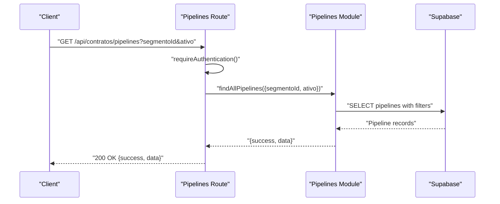
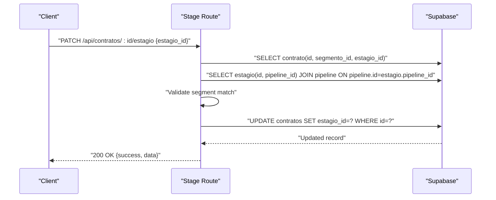
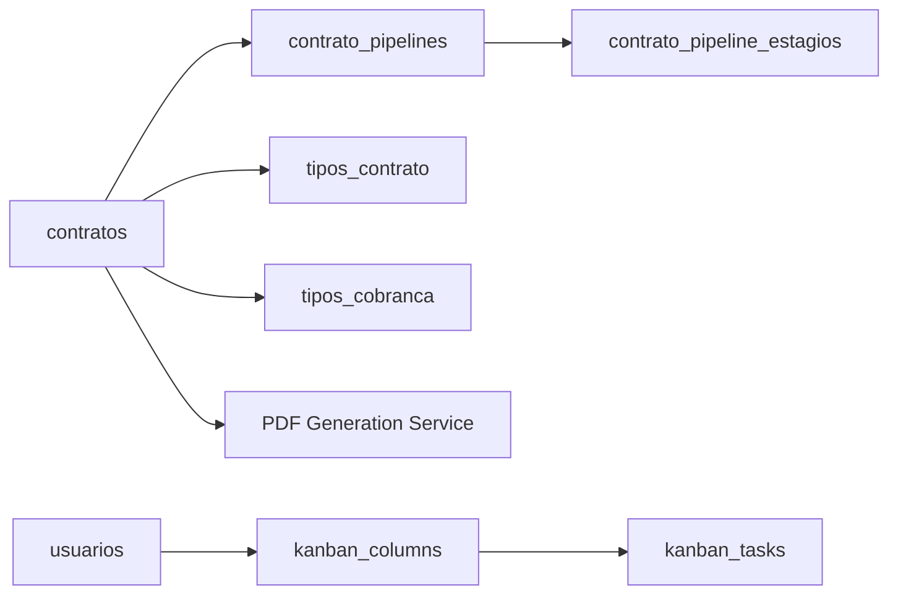
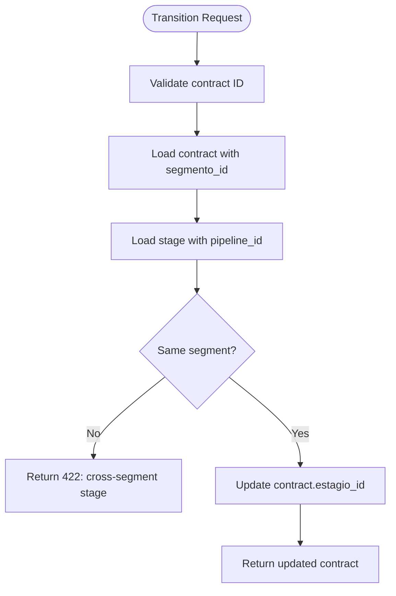

# Contract Management APIs

<cite>
**Referenced Files in This Document**
- [src/app/api/contratos/pipelines/route.ts](file://src/app/api/contratos/pipelines/route.ts)
- [src/app/api/contratos/pipelines/[id]/route.ts](file://src/app/api/contratos/pipelines/[id]/route.ts)
- [src/app/api/contratos/pipelines/[id]/estagios/route.ts](file://src/app/api/contratos/pipelines/[id]/estagios/route.ts)
- [src/app/api/contratos/[id]/estagio/route.ts](file://src/app/api/contratos/[id]/estagio/route.ts)
- [src/app/api/contratos/[id]/pdfs-contratacao/route.ts](file://src/app/api/contratos/[id]/pdfs-contratacao/route.ts)
- [src/app/api/contratos/tipos/route.ts](file://src/app/api/contratos/tipos/route.ts)
- [src/app/api/contratos/tipos-cobranca/route.ts](file://src/app/api/contratos/tipos-cobranca/route.ts)
- [supabase/schemas/11_contratos.sql](file://supabase/schemas/11_contratos.sql)
- [supabase/schemas/23_kanban.sql](file://supabase/schemas/23_kanban.sql)
</cite>

## Table of Contents
1. [Introduction](#introduction)
2. [Project Structure](#project-structure)
3. [Core Components](#core-components)
4. [Architecture Overview](#architecture-overview)
5. [Detailed Component Analysis](#detailed-component-analysis)
6. [Dependency Analysis](#dependency-analysis)
7. [Performance Considerations](#performance-considerations)
8. [Troubleshooting Guide](#troubleshooting-guide)
9. [Conclusion](#conclusion)
10. [Appendices](#appendices)

## Introduction
This document provides comprehensive API documentation for contract management endpoints. It covers contract lifecycle operations (creation, modification, deletion), pipeline and stage management, contract types and billing types, PDF generation for onboarding documents, and status tracking. It also outlines data models, pipeline transitions, and tagging systems, along with bulk operations and search/filtering capabilities.

## Project Structure
Contract management APIs are organized under the Next.js App Router at src/app/api/contratos. The key routes include:
- Pipelines: listing, creating, retrieving, updating, deleting, and managing stages
- Contract-specific: moving contracts between stages and generating onboarding PDFs
- Lookup endpoints: contract types and billing types
- Kanban board templates: columns and tasks for personal boards

```mermaid
graph TB
subgraph "API Routes"
PGet["GET /api/contratos/pipelines"]
PPost["POST /api/contratos/pipelines"]
PIdGet["GET /api/contratos/pipelines/[id]"]
PIdPut["PUT /api/contratos/pipelines/[id]"]
PIdDel["DELETE /api/contratos/pipelines/[id]"]
PStagePost["POST /api/contratos/pipelines/[id]/estagios"]
CStagePatch["PATCH /api/contratos/[id]/estagio"]
CPdfPost["POST /api/contratos/[id]/pdfs-contratacao"]
TGet["GET /api/contratos/tipos"]
TCGet["GET /api/contratos/tipos-cobranca"]
end
subgraph "Data Layer"
Contracts["Table: contratos"]
KanbanCols["Table: kanban_columns"]
KanbanTasks["Table: kanban_tasks"]
end
PGet --> Contracts
PPost --> Contracts
PIdGet --> Contracts
PIdPut --> Contracts
PIdDel --> Contracts
PStagePost --> Contracts
CStagePatch --> Contracts
CPdfPost --> Contracts
TGet --> Contracts
TCGet --> Contracts
KanbanCols --> KanbanTasks
```

**Diagram sources**
- [src/app/api/contratos/pipelines/route.ts:1-116](file://src/app/api/contratos/pipelines/route.ts#L1-L116)
- [src/app/api/contratos/pipelines/[id]/route.ts](file://src/app/api/contratos/pipelines/[id]/route.ts#L1-L217)
- [src/app/api/contratos/pipelines/[id]/estagios/route.ts](file://src/app/api/contratos/pipelines/[id]/estagios/route.ts#L1-L90)
- [src/app/api/contratos/[id]/estagio/route.ts](file://src/app/api/contratos/[id]/estagio/route.ts#L1-L101)
- [src/app/api/contratos/[id]/pdfs-contratacao/route.ts](file://src/app/api/contratos/[id]/pdfs-contratacao/route.ts#L1-L74)
- [src/app/api/contratos/tipos/route.ts:1-89](file://src/app/api/contratos/tipos/route.ts#L1-L89)
- [src/app/api/contratos/tipos-cobranca/route.ts:1-89](file://src/app/api/contratos/tipos-cobranca/route.ts#L1-L89)
- [supabase/schemas/11_contratos.sql:1-61](file://supabase/schemas/11_contratos.sql#L1-L61)
- [supabase/schemas/23_kanban.sql:1-127](file://supabase/schemas/23_kanban.sql#L1-L127)

**Section sources**
- [src/app/api/contratos/pipelines/route.ts:1-116](file://src/app/api/contratos/pipelines/route.ts#L1-L116)
- [src/app/api/contratos/pipelines/[id]/route.ts](file://src/app/api/contratos/pipelines/[id]/route.ts#L1-L217)
- [src/app/api/contratos/pipelines/[id]/estagios/route.ts](file://src/app/api/contratos/pipelines/[id]/estagios/route.ts#L1-L90)
- [src/app/api/contratos/[id]/estagio/route.ts](file://src/app/api/contratos/[id]/estagio/route.ts#L1-L101)
- [src/app/api/contratos/[id]/pdfs-contratacao/route.ts](file://src/app/api/contratos/[id]/pdfs-contratacao/route.ts#L1-L74)
- [src/app/api/contratos/tipos/route.ts:1-89](file://src/app/api/contratos/tipos/route.ts#L1-L89)
- [src/app/api/contratos/tipos-cobranca/route.ts:1-89](file://src/app/api/contratos/tipos-cobranca/route.ts#L1-L89)
- [supabase/schemas/11_contratos.sql:1-61](file://supabase/schemas/11_contratos.sql#L1-L61)
- [supabase/schemas/23_kanban.sql:1-127](file://supabase/schemas/23_kanban.sql#L1-L127)

## Core Components
- Contract entity: stores contract metadata, parties, status, ownership, and audit fields.
- Pipelines and Stages: define segmentation-specific workflows with ordered stages.
- Contract Types and Billing Types: lookup/reference data for contracts.
- PDF Generation: generates onboarding documents for a contract and returns a downloadable ZIP.
- Kanban Templates: per-user columns and tasks for personal organization.

Key permissions:
- Pipelines CRUD: requires permission "contratos.criar", "contratos.editar", "contratos.deletar", "contratos.visualizar".
- Stage transitions: requires "contratos.editar".
- PDF generation: requires authentication.

**Section sources**
- [supabase/schemas/11_contratos.sql:1-61](file://supabase/schemas/11_contratos.sql#L1-L61)
- [src/app/api/contratos/pipelines/route.ts:1-116](file://src/app/api/contratos/pipelines/route.ts#L1-L116)
- [src/app/api/contratos/[id]/estagio/route.ts](file://src/app/api/contratos/[id]/estagio/route.ts#L1-L101)
- [src/app/api/contratos/[id]/pdfs-contratacao/route.ts](file://src/app/api/contratos/[id]/pdfs-contratacao/route.ts#L1-L74)
- [src/app/api/contratos/tipos/route.ts:1-89](file://src/app/api/contratos/tipos/route.ts#L1-L89)
- [src/app/api/contratos/tipos-cobranca/route.ts:1-89](file://src/app/api/contratos/tipos-cobranca/route.ts#L1-L89)
- [supabase/schemas/23_kanban.sql:1-127](file://supabase/schemas/23_kanban.sql#L1-L127)

## Architecture Overview
The contract management API follows a layered architecture:
- Route handlers enforce authentication and permissions, then delegate to repository/service-like modules.
- Validation uses Zod schemas for request bodies.
- Database interactions use Supabase client; triggers handle audit timestamps.
- Pipelines and stages are segmented by area of practice (segmento_id) to prevent cross-segment transitions.

**Diagram sources**
- [src/app/api/contratos/pipelines/route.ts:17-66](file://src/app/api/contratos/pipelines/route.ts#L17-L66)

**Section sources**
- [src/app/api/contratos/pipelines/route.ts:1-116](file://src/app/api/contratos/pipelines/route.ts#L1-L116)

## Detailed Component Analysis

### Pipelines API
Endpoints:
- GET /api/contratos/pipelines: List pipelines with optional filters segmentoId and ativo.
- POST /api/contratos/pipelines: Create a new pipeline with segmentoId, nome, descricao.
- GET /api/contratos/pipelines/[id]: Retrieve a pipeline by ID.
- PUT /api/contratos/pipelines/[id]: Update pipeline fields (nome, descricao, ativo).
- DELETE /api/contratos/pipelines/[id]: Delete a pipeline; returns conflict if stages still have contracts referencing them.
- POST /api/contratos/pipelines/[id]/estagios: Create a stage within a pipeline.

Validation and behavior:
- Filters validated; invalid numeric parameters return 400.
- Creation/update validated with Zod schemas; invalid payloads return 400 with field errors.
- Deletion blocks removal if any contracts reference stages in the pipeline.

Responses:
- Success: 200 OK with {success: true, data}.
- Creation: 201 Created with created resource.
- Conflicts: 409 with error code and count of affected contracts.
- Not found: 404 when resource does not exist.

**Section sources**
- [src/app/api/contratos/pipelines/route.ts:1-116](file://src/app/api/contratos/pipelines/route.ts#L1-L116)
- [src/app/api/contratos/pipelines/[id]/route.ts](file://src/app/api/contratos/pipelines/[id]/route.ts#L1-L217)
- [src/app/api/contratos/pipelines/[id]/estagios/route.ts](file://src/app/api/contratos/pipelines/[id]/estagios/route.ts#L1-L90)

### Contract Stage Transition API
Endpoint:
- PATCH /api/contratos/[id]/estagio: Move a contract to a stage within the same segment.

Behavior:
- Validates contract existence and segment alignment.
- Ensures the target stage belongs to the same pipeline segment as the contract’s segment.
- Updates the contract’s estagio_id.

Responses:
- Success: 200 OK with updated contract.
- Errors: 400 for invalid ID, 404 for missing contract/stage, 422 for cross-segment stage, 500 for internal errors.

**Diagram sources**
- [src/app/api/contratos/[id]/estagio/route.ts](file://src/app/api/contratos/[id]/estagio/route.ts#L1-L101)

**Section sources**
- [src/app/api/contratos/[id]/estagio/route.ts](file://src/app/api/contratos/[id]/estagio/route.ts#L1-L101)

### Contract PDFs Generation API
Endpoint:
- POST /api/contratos/[id]/pdfs-contratacao: Generate onboarding documents ZIP for a contract.

Behavior:
- Requires authentication.
- Rate-limits requests per user key.
- Accepts optional overrides in request body for document generation.
- Returns a ZIP file with sanitized filename derived from client name.

Responses:
- Success: 200 OK with ZIP binary.
- Errors: 400 for invalid ID, 401 for unauthenticated, 429 for rate limit exceeded, 500 for generation failure.

**Section sources**
- [src/app/api/contratos/[id]/pdfs-contratacao/route.ts](file://src/app/api/contratos/[id]/pdfs-contratacao/route.ts#L1-L74)

### Contract Types and Billing Types APIs
Endpoints:
- GET /api/contratos/tipos: List contract types with optional ativo and search filters.
- POST /api/contratos/tipos: Create a new contract type.
- GET /api/contratos/tipos-cobranca: List billing types with optional ativo and search filters.
- POST /api/contratos/tipos-cobranca: Create a new billing type.

Behavior:
- GET supports ativo=true/false and search text.
- POST validates payload with Zod; returns 409 on conflict.

Responses:
- Success: 200 OK with {success: true, data, total}, or 201 Created on POST.
- Errors: 400 for invalid payload, 409 for conflicts, 500 for internal errors.

**Section sources**
- [src/app/api/contratos/tipos/route.ts:1-89](file://src/app/api/contratos/tipos/route.ts#L1-L89)
- [src/app/api/contratos/tipos-cobranca/route.ts:1-89](file://src/app/api/contratos/tipos-cobranca/route.ts#L1-L89)

### Kanban Board Management API
The system includes per-user Kanban templates with columns and tasks. These are separate from contracts but support personal organization.

Tables:
- kanban_columns: user-owned columns with ordering.
- kanban_tasks: user-owned tasks assigned to columns with priority, due date, progress, and metadata.

Security:
- RLS policies allow service_role full access and authenticated users to manage only their own rows.

**Section sources**
- [supabase/schemas/23_kanban.sql:1-127](file://supabase/schemas/23_kanban.sql#L1-L127)

## Dependency Analysis
Contract management depends on:
- Pipelines and stages for workflow progression.
- Contract types and billing types for classification.
- PDF generation service for onboarding documents.
- Kanban templates for personal task organization.

**Diagram sources**
- [supabase/schemas/11_contratos.sql:1-61](file://supabase/schemas/11_contratos.sql#L1-L61)
- [supabase/schemas/23_kanban.sql:1-127](file://supabase/schemas/23_kanban.sql#L1-L127)

**Section sources**
- [supabase/schemas/11_contratos.sql:1-61](file://supabase/schemas/11_contratos.sql#L1-L61)
- [supabase/schemas/23_kanban.sql:1-127](file://supabase/schemas/23_kanban.sql#L1-L127)

## Performance Considerations
- Indexes on contratos segmento_id, tipo_contrato, status, cliente_id, responsavel_id, created_by improve filtering and joins.
- Pipeline and stage queries leverage foreign keys and segment alignment checks; keep filters precise to avoid scans.
- PDF generation runs in Node runtime; consider caching and rate limiting to reduce load.
- Kanban tables have appropriate indexes for user and position ordering.

[No sources needed since this section provides general guidance]

## Troubleshooting Guide
Common issues and resolutions:
- Authentication failures: Ensure requests include valid authentication for endpoints requiring it.
- Permission denied: Verify roles and permissions for pipeline and stage operations.
- Invalid pipeline or stage ID: Confirm numeric ID > 0.
- Cross-segment stage move: Ensure the stage belongs to the same segment as the contract.
- Conflict on pipeline deletion: Remove contracts from stages before deleting the pipeline.
- Rate limit on PDF generation: Wait for the window to reset or reduce frequency.

**Section sources**
- [src/app/api/contratos/pipelines/[id]/route.ts](file://src/app/api/contratos/pipelines/[id]/route.ts#L138-L215)
- [src/app/api/contratos/[id]/estagio/route.ts](file://src/app/api/contratos/[id]/estagio/route.ts#L46-L69)
- [src/app/api/contratos/[id]/pdfs-contratacao/route.ts](file://src/app/api/contratos/[id]/pdfs-contratacao/route.ts#L26-L37)

## Conclusion
The contract management APIs provide a robust foundation for lifecycle operations, workflow management via pipelines and stages, classification through types and billing types, and document generation for onboarding. Security is enforced through authentication and RLS policies, while validation ensures data integrity. The system is extensible for bulk operations and advanced search/filtering as needed.

[No sources needed since this section summarizes without analyzing specific files]

## Appendices

### Data Models and Schemas

#### Contract Entity
- Fields: id, segmento_id, tipo_contrato, tipo_cobranca, cliente_id, papel_cliente_no_contrato, status, cadastrado_em, responsavel_id, created_by, observacoes, dados_anteriores, created_at, updated_at.
- Indices: segmento_id, tipo_contrato, status, cliente_id, responsavel_id, created_by.
- Triggers: update_updated_at on modify.

**Section sources**
- [supabase/schemas/11_contratos.sql:1-61](file://supabase/schemas/11_contratos.sql#L1-L61)

#### Pipeline and Stage Relationship
- Pipeline: segmento_id, nome, descricao, ativo.
- Stage: pipeline_id, nome, slug, cor, ordem, isDefault.
- Segment alignment: stages must belong to the same segment as the contract.

**Section sources**
- [src/app/api/contratos/pipelines/route.ts:1-116](file://src/app/api/contratos/pipelines/route.ts#L1-L116)
- [src/app/api/contratos/[id]/estagio/route.ts](file://src/app/api/contratos/[id]/estagio/route.ts#L46-L69)

#### Kanban Template Models
- Columns: id, usuario_id, title, position, timestamps.
- Tasks: id, usuario_id, column_id, title, description, priority, assignee, due_date, progress, attachments, comments, users, position, timestamps.
- Constraints: priority in ('low','medium','high'), progress 0..100, counts non-negative.

**Section sources**
- [supabase/schemas/23_kanban.sql:1-127](file://supabase/schemas/23_kanban.sql#L1-L127)

### Pipeline Transitions Flow

**Diagram sources**
- [src/app/api/contratos/[id]/estagio/route.ts](file://src/app/api/contratos/[id]/estagio/route.ts#L32-L86)

### Bulk Operations and Search/Filtering
- Pipelines: filter by segmentoId and ativo.
- Contract types and billing types: filter by ativo and search text.
- Contracts: filtered by tipo_contrato, status, segmento_id, cliente_id, responsavel_id via indices.

**Section sources**
- [src/app/api/contratos/pipelines/route.ts:19-46](file://src/app/api/contratos/pipelines/route.ts#L19-L46)
- [src/app/api/contratos/tipos/route.ts:23-32](file://src/app/api/contratos/tipos/route.ts#L23-L32)
- [src/app/api/contratos/tipos-cobranca/route.ts:23-32](file://src/app/api/contratos/tipos-cobranca/route.ts#L23-L32)
- [supabase/schemas/11_contratos.sql:44-50](file://supabase/schemas/11_contratos.sql#L44-L50)