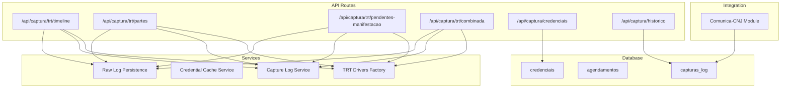
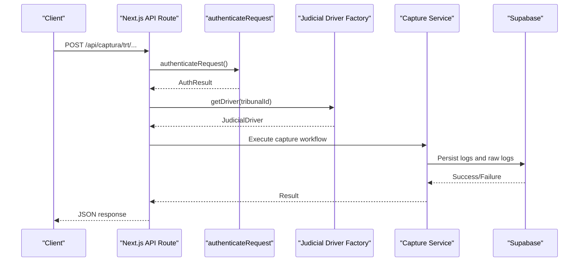
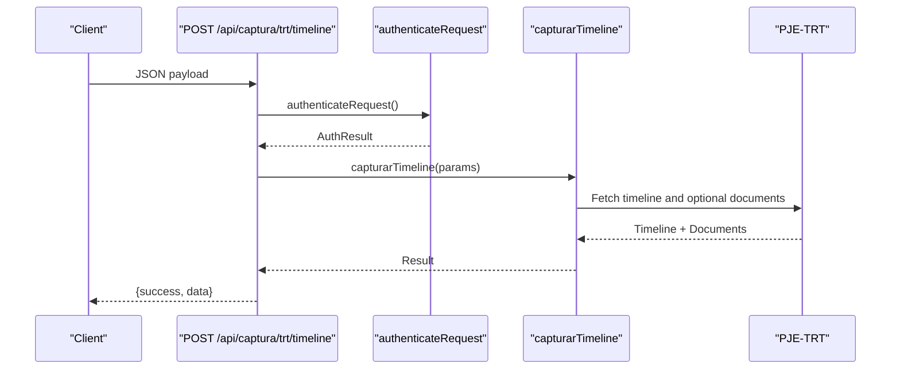
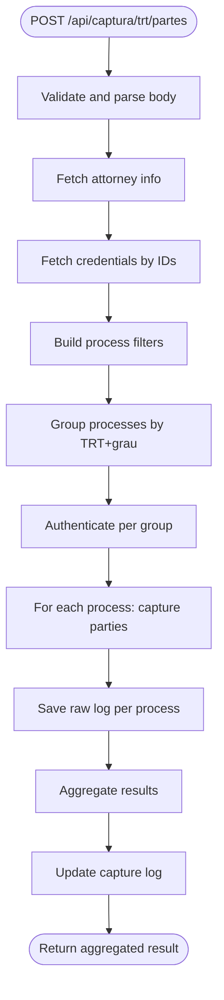
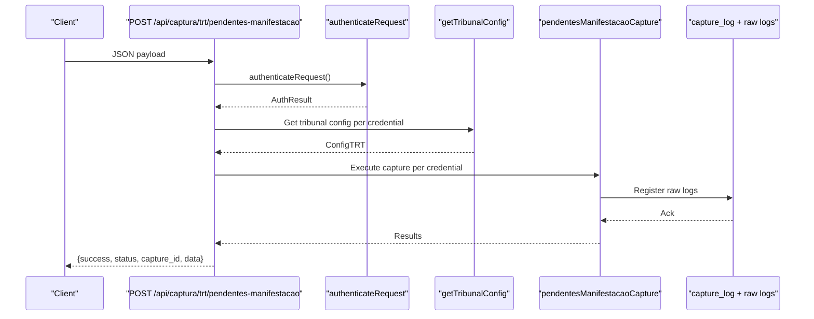
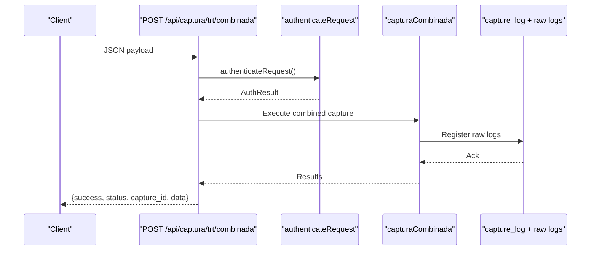
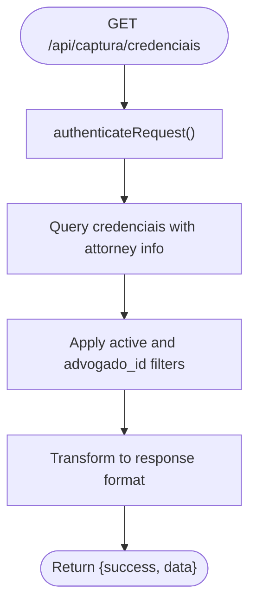
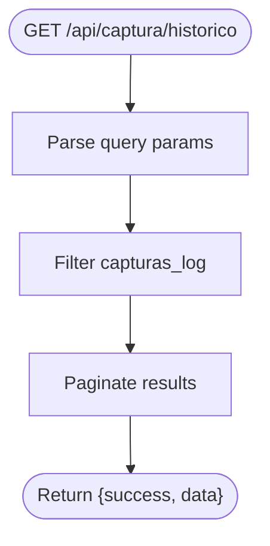
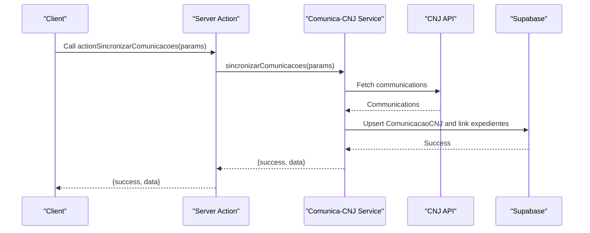
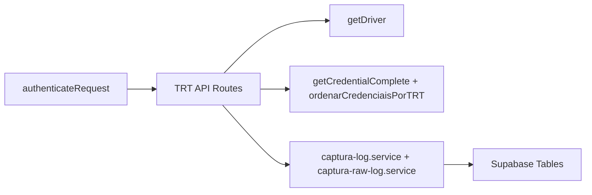

# Data Capture APIs

<cite>
**Referenced Files in This Document**
- [route.ts](file://src/app/api/captura/trt/timeline/route.ts)
- [route.ts](file://src/app/api/captura/trt/pendentes-manifestacao/route.ts)
- [route.ts](file://src/app/api/captura/trt/partes/route.ts)
- [route.ts](file://src/app/api/captura/trt/combinada/route.ts)
- [route.ts](file://src/app/api/captura/credenciais/route.ts)
- [route.ts](file://src/app/api/captura/historico/route.ts)
- [index.ts](file://src/app/(authenticated)/comunica-cnj/index.ts)
- [comunica-cnj-actions.ts](file://src/app/(authenticated)/comunica-cnj/actions/comunica-cnj-actions.ts)
- [repository.ts](file://src/app/(authenticated)/comunica-cnj/repository.ts)
- [domain.ts](file://src/app/(authenticated)/captura/domain.ts)
- [factory.ts](file://src/app/(authenticated)/captura/drivers/factory.ts)
- [credential-cache.service.ts](file://src/app/(authenticated)/captura/credentials/credential-cache.service.ts)
- [captura-log.service.ts](file://src/app/(authenticated)/captura/services/captura-log.service.ts)
- [captura-raw-log.service.ts](file://src/app/(authenticated)/captura/services/persistence/captura-raw-log.service.ts)
- [21_capturas.sql](file://supabase/schemas/21_capturas.sql)
- [03_credenciais.sql](file://supabase/schemas/03_credenciais.sql)
- [swagger.config.ts](file://swagger.config.ts)
</cite>

## Table of Contents
1. [Introduction](#introduction)
2. [Project Structure](#project-structure)
3. [Core Components](#core-components)
4. [Architecture Overview](#architecture-overview)
5. [Detailed Component Analysis](#detailed-component-analysis)
6. [Dependency Analysis](#dependency-analysis)
7. [Performance Considerations](#performance-considerations)
8. [Troubleshooting Guide](#troubleshooting-guide)
9. [Conclusion](#conclusion)
10. [Appendices](#appendices)

## Introduction
This document provides comprehensive API documentation for automated data capture and integration endpoints. It covers:
- PJE-TRT integration APIs for timeline, parties, combined captures, and pending manifests
- Comunica-CNJ synchronization and management
- Credential management and tribunal-specific endpoints
- Historical data import and status tracking
- Capture status monitoring, retry mechanisms, and error handling for external API failures
- Schemas for captured data formats, processing logs, and integration status tracking

## Project Structure
The data capture system is organized around Next.js API routes under `/src/app/api/captura/` and supporting services under `/src/app/(authenticated)/captura/`. Integration with Comunica-CNJ is implemented as a self-contained module under `/src/app/(authenticated)/comunica-cnj/`. Database schemas for logging and scheduling are defined in the Supabase migrations.

**Diagram sources**
- [route.ts:1-208](file://src/app/api/captura/trt/timeline/route.ts#L1-L208)
- [route.ts:1-921](file://src/app/api/captura/trt/partes/route.ts#L1-L921)
- [route.ts:1-467](file://src/app/api/captura/trt/pendentes-manifestacao/route.ts#L1-L467)
- [route.ts:1-304](file://src/app/api/captura/trt/combinada/route.ts#L1-L304)
- [route.ts:1-187](file://src/app/api/captura/credenciais/route.ts#L1-L187)
- [route.ts:1-160](file://src/app/api/captura/historico/route.ts#L1-L160)
- [factory.ts](file://src/app/(authenticated)/captura/drivers/factory.ts#L30-L59)
- [credential-cache.service.ts](file://src/app/(authenticated)/captura/credentials/credential-cache.service.ts#L215-L250)
- [captura-log.service.ts](file://src/app/(authenticated)/captura/services/captura-log.service.ts#L1-L85)
- [captura-raw-log.service.ts](file://src/app/(authenticated)/captura/services/persistence/captura-raw-log.service.ts#L109-L152)
- [21_capturas.sql:1-103](file://supabase/schemas/21_capturas.sql#L1-L103)
- [03_credenciais.sql:1-49](file://supabase/schemas/03_credenciais.sql#L1-L49)

**Section sources**
- [route.ts:1-208](file://src/app/api/captura/trt/timeline/route.ts#L1-L208)
- [route.ts:1-921](file://src/app/api/captura/trt/partes/route.ts#L1-L921)
- [route.ts:1-467](file://src/app/api/captura/trt/pendentes-manifestacao/route.ts#L1-L467)
- [route.ts:1-304](file://src/app/api/captura/trt/combinada/route.ts#L1-L304)
- [route.ts:1-187](file://src/app/api/captura/credenciais/route.ts#L1-L187)
- [route.ts:1-160](file://src/app/api/captura/historico/route.ts#L1-L160)
- [factory.ts](file://src/app/(authenticated)/captura/drivers/factory.ts#L30-L59)
- [credential-cache.service.ts](file://src/app/(authenticated)/captura/credentials/credential-cache.service.ts#L215-L250)
- [captura-log.service.ts](file://src/app/(authenticated)/captura/services/captura-log.service.ts#L1-L85)
- [captura-raw-log.service.ts](file://src/app/(authenticated)/captura/services/persistence/captura-raw-log.service.ts#L109-L152)
- [21_capturas.sql:1-103](file://supabase/schemas/21_capturas.sql#L1-L103)
- [03_credenciais.sql:1-49](file://supabase/schemas/03_credenciais.sql#L1-L49)

## Core Components
- TRT API Routes: Provide endpoints for timeline capture, parties capture, pending manifests capture, and combined capture workflows.
- Credential Management: Exposes endpoints to list and filter active credentials with tribunal and degree information.
- History Tracking: Provides endpoints to list capture histories with pagination and filtering.
- Comunica-CNJ Integration: Self-contained module for querying, synchronizing, and managing official legal communications.
- Logging and Recovery: Centralized services for capturing logs, raw logs, and recovery workflows.

**Section sources**
- [route.ts:1-208](file://src/app/api/captura/trt/timeline/route.ts#L1-L208)
- [route.ts:1-921](file://src/app/api/captura/trt/partes/route.ts#L1-L921)
- [route.ts:1-467](file://src/app/api/captura/trt/pendentes-manifestacao/route.ts#L1-L467)
- [route.ts:1-304](file://src/app/api/captura/trt/combinada/route.ts#L1-L304)
- [route.ts:1-187](file://src/app/api/captura/credenciais/route.ts#L1-L187)
- [route.ts:1-160](file://src/app/api/captura/historico/route.ts#L1-L160)
- [index.ts](file://src/app/(authenticated)/comunica-cnj/index.ts#L1-L109)
- [comunica-cnj-actions.ts](file://src/app/(authenticated)/comunica-cnj/actions/comunica-cnj-actions.ts#L1-L76)
- [captura-log.service.ts](file://src/app/(authenticated)/captura/services/captura-log.service.ts#L1-L85)
- [captura-raw-log.service.ts](file://src/app/(authenticated)/captura/services/persistence/captura-raw-log.service.ts#L109-L152)

## Architecture Overview
The system orchestrates authentication, tribunal configuration retrieval, driver selection, and persistence of captured data. It supports batch processing, distributed locking for concurrency control, and detailed logging for auditing and recovery.

**Diagram sources**
- [route.ts:230-921](file://src/app/api/captura/trt/partes/route.ts#L230-L921)
- [factory.ts](file://src/app/(authenticated)/captura/drivers/factory.ts#L30-L59)
- [captura-log.service.ts](file://src/app/(authenticated)/captura/services/captura-log.service.ts#L1-L85)
- [captura-raw-log.service.ts](file://src/app/(authenticated)/captura/services/persistence/captura-raw-log.service.ts#L109-L152)

## Detailed Component Analysis

### Timeline Capture API
- Endpoint: POST /api/captura/trt/timeline
- Purpose: Retrieve a process timeline from PJE-TRT, optionally downloading signed documents.
- Request Body Schema:
  - trtCodigo: string (enum TRT1–TRT24)
  - grau: string (enum primeiro_grau, segundo_grau)
  - processoId: string
  - numeroProcesso: string
  - advogadoId: number
  - baixarDocumentos: boolean (default true)
  - filtroDocumentos: object with:
    - apenasAssinados: boolean
    - apenasNaoSigilosos: boolean
    - tipos: string[]
    - dataInicial: string (ISO 8601)
    - dataFinal: string (ISO 8601)
- Response Schema:
  - success: boolean
  - data: object with timeline items, totals, and document download statistics

**Diagram sources**
- [route.ts:1-208](file://src/app/api/captura/trt/timeline/route.ts#L1-L208)

**Section sources**
- [route.ts:1-208](file://src/app/api/captura/trt/timeline/route.ts#L1-L208)

### Parties Capture API
- Endpoint: POST /api/captura/trt/partes
- Purpose: Capture parties, representatives, and process-party links for specified processes or all processes of an attorney.
- Request Body Schema:
  - advogado_id: number
  - credencial_ids: number[]
  - processo_ids: number[] (optional)
  - trts: string[] (TRT1–TRT24)
  - graus: string[] (primeiro_grau, segundo_grau)
  - numero_processo: string (single)
  - numeros_processo: string[] (multiple)
- Response Schema:
  - success: boolean
  - message: string
  - data: object with totals and error list

**Diagram sources**
- [route.ts:230-921](file://src/app/api/captura/trt/partes/route.ts#L230-L921)

**Section sources**
- [route.ts:1-921](file://src/app/api/captura/trt/partes/route.ts#L1-L921)

### Pending Manifestations Capture API
- Endpoint: POST /api/captura/trt/pendentes-manifestacao
- Purpose: Capture pending manifestation processes filtered by deadline status, with sequential processing per credential and tribunal configuration.
- Request Body Schema:
  - advogado_id: number
  - credencial_ids: number[] (non-empty)
  - filtroPrazo: string (enum no_prazo, sem_prazo) or
  - filtrosPrazo: string[] (ordered list)
- Response Schema:
  - success: boolean
  - message: string
  - status: string (in_progress)
  - capture_id: number (for history tracking)
  - data: object with processed credentials and results

**Diagram sources**
- [route.ts:1-467](file://src/app/api/captura/trt/pendentes-manifestacao/route.ts#L1-L467)
- [captura-log.service.ts](file://src/app/(authenticated)/captura/services/captura-log.service.ts#L1-L85)
- [captura-raw-log.service.ts](file://src/app/(authenticated)/captura/services/persistence/captura-raw-log.service.ts#L109-L152)

**Section sources**
- [route.ts:1-467](file://src/app/api/captura/trt/pendentes-manifestacao/route.ts#L1-L467)

### Combined Capture API
- Endpoint: POST /api/captura/trt/combinada
- Purpose: Execute multiple capture tasks (audiências, expedientes, timeline, partes) in a single authenticated session.
- Request Body Schema:
  - advogado_id: number
  - credencial_ids: number[] (non-empty)
- Response Schema:
  - success: boolean
  - message: string
  - status: string (in_progress)
  - capture_id: number
  - data: object with processed credentials and summaries

**Diagram sources**
- [route.ts:1-304](file://src/app/api/captura/trt/combinada/route.ts#L1-L304)
- [captura-log.service.ts](file://src/app/(authenticated)/captura/services/captura-log.service.ts#L1-L85)
- [captura-raw-log.service.ts](file://src/app/(authenticated)/captura/services/persistence/captura-raw-log.service.ts#L109-L152)

**Section sources**
- [route.ts:1-304](file://src/app/api/captura/trt/combinada/route.ts#L1-L304)

### Credential Management API
- Endpoint: GET /api/captura/credenciais
- Purpose: List active credentials with attorney information, tribunal, and degree. Supports filtering by active status and attorney ID.
- Response Schema:
  - success: boolean
  - data: object with:
    - credenciais: array of credential objects
    - tribunais_disponiveis: array of tribunal codes
    - graus_disponiveis: array of degrees

**Diagram sources**
- [route.ts:1-187](file://src/app/api/captura/credenciais/route.ts#L1-L187)
- [03_credenciais.sql:1-49](file://supabase/schemas/03_credenciais.sql#L1-L49)

**Section sources**
- [route.ts:1-187](file://src/app/api/captura/credenciais/route.ts#L1-L187)
- [03_credenciais.sql:1-49](file://supabase/schemas/03_credenciais.sql#L1-L49)

### History Tracking API
- Endpoint: GET /api/captura/historico
- Purpose: List capture histories with pagination and filtering by type, attorney, status, and date range.
- Query Parameters:
  - pagina: integer (default 1)
  - limite: integer (default 50, max 100)
  - tipo_captura: enum (acervo_geral, arquivados, audiencias, pendentes)
  - advogado_id: integer
  - status: enum (pending, in_progress, completed, failed)
  - data_inicio: string (date)
  - data_fim: string (date)
- Response Schema:
  - success: boolean
  - data: object with:
    - capturas: array of capture log entries
    - total: integer
    - pagina: integer
    - limite: integer
    - totalPaginas: integer

**Diagram sources**
- [route.ts:1-160](file://src/app/api/captura/historico/route.ts#L1-L160)
- [21_capturas.sql:1-103](file://supabase/schemas/21_capturas.sql#L1-L103)

**Section sources**
- [route.ts:1-160](file://src/app/api/captura/historico/route.ts#L1-L160)
- [21_capturas.sql:1-103](file://supabase/schemas/21_capturas.sql#L1-L103)

### Comunica-CNJ Integration
- Module: Self-contained under `/src/app/(authenticated)/comunica-cnj/`
- Public Barrels: Expose client components and server actions for querying, listing captured communications, synchronizing, obtaining certificates, and managing views.
- Permissions:
  - actionConsultarComunicacoes: requires permission `comunica_cnj:consultar`
  - actionListarComunicacoesCapturadas: requires permission `comunica_cnj:listar`
  - actionSincronizarComunicacoes: requires permission `comunica_cnj:capturar`
  - actionObterCertidao: requires permission `comunica_cnj:visualizar`
- Server Actions:
  - actionConsultarComunicacoes(params): Returns ConsultaResult
  - actionListarComunicacoesCapturadas(params): Returns PaginatedResponse<ComunicacaoCNJ>
  - actionSincronizarComunicacoes(params): Returns SincronizacaoResult
  - actionObterCertidao(hash): Returns base64 PDF string
  - Additional actions for views, sync logs, tribunal lists, and metrics

**Diagram sources**
- [index.ts](file://src/app/(authenticated)/comunica-cnj/index.ts#L1-L109)
- [comunica-cnj-actions.ts](file://src/app/(authenticated)/comunica-cnj/actions/comunica-cnj-actions.ts#L1-L76)
- [repository.ts](file://src/app/(authenticated)/comunica-cnj/repository.ts#L1-L35)

**Section sources**
- [index.ts](file://src/app/(authenticated)/comunica-cnj/index.ts#L1-L109)
- [comunica-cnj-actions.ts](file://src/app/(authenticated)/comunica-cnj/actions/comunica-cnj-actions.ts#L1-L76)
- [repository.ts](file://src/app/(authenticated)/comunica-cnj/repository.ts#L1-L35)

## Dependency Analysis
- Authentication: All TRT routes depend on `authenticateRequest` for bearer/session authentication.
- Driver Selection: Uses `getDriver(tribunalId)` to select appropriate tribunal system driver (PJE-TRT).
- Credential Resolution: Uses `getCredentialComplete(id)` and `ordenarCredenciaisPorTRT` to resolve credentials per tribunal and degree.
- Logging: Centralized via `captura-log.service` and `captura-raw-log.service` for auditability and recovery.
- Database: Relies on Supabase tables `capturas_log`, `agendamentos`, and `credenciais`.

**Diagram sources**
- [route.ts:1-921](file://src/app/api/captura/trt/partes/route.ts#L1-L921)
- [factory.ts](file://src/app/(authenticated)/captura/drivers/factory.ts#L30-L59)
- [credential-cache.service.ts](file://src/app/(authenticated)/captura/credentials/credential-cache.service.ts#L215-L250)
- [captura-log.service.ts](file://src/app/(authenticated)/captura/services/captura-log.service.ts#L1-L85)
- [captura-raw-log.service.ts](file://src/app/(authenticated)/captura/services/persistence/captura-raw-log.service.ts#L109-L152)
- [21_capturas.sql:1-103](file://supabase/schemas/21_capturas.sql#L1-L103)
- [03_credenciais.sql:1-49](file://supabase/schemas/03_credenciais.sql#L1-L49)

**Section sources**
- [route.ts:1-921](file://src/app/api/captura/trt/partes/route.ts#L1-L921)
- [factory.ts](file://src/app/(authenticated)/captura/drivers/factory.ts#L30-L59)
- [credential-cache.service.ts](file://src/app/(authenticated)/captura/credentials/credential-cache.service.ts#L215-L250)
- [captura-log.service.ts](file://src/app/(authenticated)/captura/services/captura-log.service.ts#L1-L85)
- [captura-raw-log.service.ts](file://src/app/(authenticated)/captura/services/persistence/captura-raw-log.service.ts#L109-L152)
- [21_capturas.sql:1-103](file://supabase/schemas/21_capturas.sql#L1-L103)
- [03_credenciais.sql:1-49](file://supabase/schemas/03_credenciais.sql#L1-L49)

## Performance Considerations
- Batch Processing: Group processes by TRT+grau to reuse authentication sessions and reduce overhead.
- Distributed Locking: Use `withDistributedLock` to prevent concurrent captures of the same process.
- Credential Caching: Cache credential lookups to minimize repeated database queries across multiple TRTs and degrees.
- Pagination and Limits: Use pagination and limits in history and communication listings to avoid large payloads.
- Indexes: Ensure proper indexing on tribunal, degree, and status fields for efficient filtering.

[No sources needed since this section provides general guidance]

## Troubleshooting Guide
- Unauthorized Access: Verify authentication via `authenticateRequest` and required permissions.
- Credential Issues: Ensure credentials exist, belong to the specified attorney, and are active. Use `/api/captura/credenciais` to validate.
- Tribunal Configuration: Confirm tribunal configuration exists and is valid for the requested degree.
- Authentication Failures: Logs are saved per group and per process; inspect raw logs for detailed error context.
- Retry Mechanisms: Implement retries with exponential backoff for transient external API failures. Use raw logs to identify failed items and reprocess selectively.
- Recovery: Use `captura-recovery.service` to fetch raw logs by capture log ID and reprocess failed items.

**Section sources**
- [route.ts:495-602](file://src/app/api/captura/trt/partes/route.ts#L495-L602)
- [captura-raw-log.service.ts](file://src/app/(authenticated)/captura/services/persistence/captura-raw-log.service.ts#L109-L152)
- [captura-log.service.ts](file://src/app/(authenticated)/captura/services/captura-log.service.ts#L1-L85)

## Conclusion
The data capture APIs provide robust, auditable, and recoverable workflows for PJE-TRT integration and Comunica-CNJ synchronization. They support credential management, tribunal-specific endpoints, historical tracking, and detailed logging for monitoring and recovery.

[No sources needed since this section summarizes without analyzing specific files]

## Appendices

### Data Models and Schemas

#### Capture Log Schema
- Table: `capturas_log`
- Fields:
  - id: bigint (primary key)
  - tipo_captura: enum (acervo_geral, arquivados, audiencias, pendentes, partes)
  - advogado_id: bigint (references advogados)
  - credencial_ids: bigint[] (array of credential IDs)
  - status: enum (pending, in_progress, completed, failed)
  - resultado: jsonb (capture result)
  - erro: text (error message)
  - iniciado_em: timestamp with timezone
  - concluido_em: timestamp with timezone
  - created_at: timestamp with timezone

**Section sources**
- [21_capturas.sql:1-103](file://supabase/schemas/21_capturas.sql#L1-L103)

#### Credential Schema
- Table: `credenciais`
- Fields:
  - id: bigint (primary key)
  - advogado_id: bigint (references advogados)
  - tribunal: string (TRT1–TRT24)
  - grau: enum (primeiro_grau, segundo_grau)
  - active: boolean
  - senha: text (stored in plaintext)
  - created_at: timestamp with timezone
  - updated_at: timestamp with timezone

**Section sources**
- [03_credenciais.sql:1-49](file://supabase/schemas/03_credenciais.sql#L1-L49)

#### Raw Capture Log Schema
- Table: `captura_logs_brutos`
- Fields:
  - raw_log_id: string (stable identifier)
  - captura_log_id: number (FK to capturas_log)
  - tipo_captura: string
  - advogado_id: number
  - credencial_id: number
  - credencial_ids: number[] (full array)
  - trt: string (TRT code)
  - grau: string (degree)
  - status: enum (success, error)
  - requisicao: object (request payload)
  - payload_bruto: any (raw PJE payload)
  - resultado_processado: any (processed result)
  - logs: LogEntry[] (structured logs)
  - erro: string (error message)
  - criado_em: Date
  - atualizado_em: Date

**Section sources**
- [captura-raw-log.service.ts](file://src/app/(authenticated)/captura/services/persistence/captura-raw-log.service.ts#L109-L152)

#### Comunica-CNJ Entities
- Table: `comunica_cnj` — captured legal communications with unique hash
- Table: `comunica_cnj_sync_log` — synchronization history
- Table: `comunica_cnj_views` — saved views with filters and columns
- Table: `comunica_cnj_resumos` — AI-generated summaries with semantic tags

**Section sources**
- [repository.ts](file://src/app/(authenticated)/comunica-cnj/repository.ts#L1-L35)

### API Security and Permissions
- TRT Routes: Require bearer/session authentication; ensure proper RBAC for tribunal access.
- Comunica-CNJ Actions: Require specific permissions:
  - `comunica_cnj:consultar`
  - `comunica_cnj:listar`
  - `comunica_cnj:capturar`
  - `comunica_cnj:visualizar`

**Section sources**
- [comunica-cnj-actions.ts](file://src/app/(authenticated)/comunica-cnj/actions/comunica-cnj-actions.ts#L1-L76)

### Swagger/OpenAPI Integration
- Swagger configuration includes reusable schemas for dashboard metrics and capture status tracking.

**Section sources**
- [swagger.config.ts:515-542](file://swagger.config.ts#L515-L542)