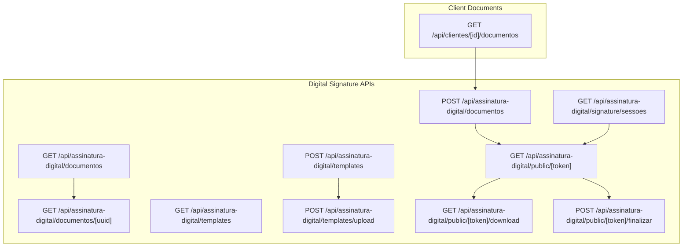
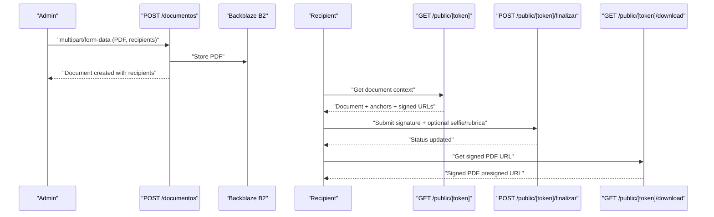
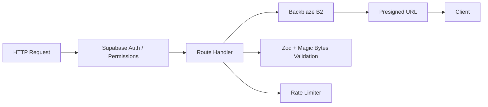

# Document Management APIs

<cite>
**Referenced Files in This Document**
- [route.ts](file://src/app/api/assinatura-digital/documentos/route.ts)
- [route.ts](file://src/app/api/assinatura-digital/documentos/[uuid]/route.ts)
- [route.ts](file://src/app/api/assinatura-digital/templates/route.ts)
- [route.ts](file://src/app/api/assinatura-digital/templates/upload/route.ts)
- [route.ts](file://src/app/api/assinatura-digital/public/[token]/route.ts)
- [route.ts](file://src/app/api/assinatura-digital/public/[token]/download/route.ts)
- [route.ts](file://src/app/api/assinatura-digital/public/[token]/finalizar/route.ts)
- [route.ts](file://src/app/api/assinatura-digital/signature/sessoes/route.ts)
- [route.ts](file://src/app/api/clientes/[id]/documentos/route.ts)
</cite>

## Table of Contents
1. [Introduction](#introduction)
2. [Project Structure](#project-structure)
3. [Core Components](#core-components)
4. [Architecture Overview](#architecture-overview)
5. [Detailed Component Analysis](#detailed-component-analysis)
6. [Dependency Analysis](#dependency-analysis)
7. [Performance Considerations](#performance-considerations)
8. [Troubleshooting Guide](#troubleshooting-guide)
9. [Conclusion](#conclusion)

## Introduction
This document provides comprehensive API documentation for document management and digital signature endpoints. It covers:
- Document upload, retrieval, and processing workflows
- AI-assisted document editing APIs
- Template management
- Signature request operations
- Document storage integration, versioning, and access control
- File format support, size limitations, and security considerations

## Project Structure
The APIs are organized under Next.js App Router conventions within the `src/app/api` directory. Key areas:
- `/assinatura-digital`: Digital signature lifecycle and templates
- `/clientes/[id]/documentos`: Client document listing via Backblaze B2
- Public endpoints for signature sessions and downloads

**Diagram sources**
- [route.ts:1-127](file://src/app/api/assinatura-digital/documentos/route.ts#L1-L127)
- [route.ts:1-36](file://src/app/api/assinatura-digital/documentos/[uuid]/route.ts#L1-L36)
- [route.ts:1-81](file://src/app/api/assinatura-digital/templates/route.ts#L1-L81)
- [route.ts:1-69](file://src/app/api/assinatura-digital/templates/upload/route.ts#L1-L69)
- [route.ts:1-145](file://src/app/api/assinatura-digital/public/[token]/route.ts#L1-L145)
- [route.ts:1-128](file://src/app/api/assinatura-digital/public/[token]/download/route.ts#L1-L128)
- [route.ts:1-205](file://src/app/api/assinatura-digital/public/[token]/finalizar/route.ts#L1-L205)
- [route.ts:1-48](file://src/app/api/assinatura-digital/signature/sessoes/route.ts#L1-L48)
- [route.ts:1-191](file://src/app/api/clientes/[id]/documentos/route.ts#L1-L191)

**Section sources**
- [route.ts:1-127](file://src/app/api/assinatura-digital/documentos/route.ts#L1-L127)
- [route.ts:1-36](file://src/app/api/assinatura-digital/documentos/[uuid]/route.ts#L1-L36)
- [route.ts:1-81](file://src/app/api/assinatura-digital/templates/route.ts#L1-L81)
- [route.ts:1-69](file://src/app/api/assinatura-digital/templates/upload/route.ts#L1-L69)
- [route.ts:1-145](file://src/app/api/assinatura-digital/public/[token]/route.ts#L1-L145)
- [route.ts:1-128](file://src/app/api/assinatura-digital/public/[token]/download/route.ts#L1-L128)
- [route.ts:1-205](file://src/app/api/assinatura-digital/public/[token]/finalizar/route.ts#L1-L205)
- [route.ts:1-48](file://src/app/api/assinatura-digital/signature/sessoes/route.ts#L1-L48)
- [route.ts:1-191](file://src/app/api/clientes/[id]/documentos/route.ts#L1-L191)

## Core Components
- Document creation from uploaded PDF with signature recipients
- Document listing and retrieval by UUID
- Template management (list/create/upload)
- Public signature session endpoints (context, download, finalize)
- Client document listing via Backblaze B2 with signed URLs
- Signature sessions listing with filtering

**Section sources**
- [route.ts:1-127](file://src/app/api/assinatura-digital/documentos/route.ts#L1-L127)
- [route.ts:1-36](file://src/app/api/assinatura-digital/documentos/[uuid]/route.ts#L1-L36)
- [route.ts:1-81](file://src/app/api/assinatura-digital/templates/route.ts#L1-L81)
- [route.ts:1-69](file://src/app/api/assinatura-digital/templates/upload/route.ts#L1-L69)
- [route.ts:1-145](file://src/app/api/assinatura-digital/public/[token]/route.ts#L1-L145)
- [route.ts:1-128](file://src/app/api/assinatura-digital/public/[token]/download/route.ts#L1-L128)
- [route.ts:1-205](file://src/app/api/assinatura-digital/public/[token]/finalizar/route.ts#L1-L205)
- [route.ts:1-48](file://src/app/api/assinatura-digital/signature/sessoes/route.ts#L1-L48)
- [route.ts:1-191](file://src/app/api/clientes/[id]/documentos/route.ts#L1-L191)

## Architecture Overview
High-level flow:
- Admin uploads a PDF and defines recipients; system persists document and creates recipient entries with opaque tokens
- Recipients access public links to review document context, sign, and optionally provide selfie and signature
- Signed documents are stored in Backblaze B2; signed URLs are generated for temporary access
- Templates are managed separately and uploaded to Backblaze B2 under a dedicated folder

**Diagram sources**
- [route.ts:57-123](file://src/app/api/assinatura-digital/documentos/route.ts#L57-L123)
- [route.ts:32-141](file://src/app/api/assinatura-digital/public/[token]/route.ts#L32-L141)
- [route.ts:57-201](file://src/app/api/assinatura-digital/public/[token]/finalizar/route.ts#L57-L201)
- [route.ts:31-127](file://src/app/api/assinatura-digital/public/[token]/download/route.ts#L31-L127)

## Detailed Component Analysis

### Document Management Endpoints
- POST /api/assinatura-digital/documentos
  - Purpose: Create a signature-ready document from an uploaded PDF
  - Authentication: Requires permission for "assinatura_digital.criar"
  - Request: multipart/form-data
    - file: PDF (validated by magic bytes; max size 50 MB)
    - titulo: optional string
    - selfie_habilitada: "true" | "false"
    - assinantes: JSON string array of recipients
  - Validation: Zod schema enforces presence and types; recipient array minimum length 2
  - Response: Created document metadata and recipients
  - Security: Rate limiting not applied at endpoint level; ensure upstream protection

- GET /api/assinatura-digital/documentos
  - Purpose: List documents with pagination
  - Authentication: Requires permission for "assinatura_digital.visualizar"
  - Query: limit (default 50)
  - Response: Array of documents

- GET /api/assinatura-digital/documentos/[uuid]
  - Purpose: Retrieve a single document by UUID
  - Authentication: Requires permission for "assinatura_digital.visualizar"
  - Response: Document details or 404 if not found

**Section sources**
- [route.ts:1-127](file://src/app/api/assinatura-digital/documentos/route.ts#L1-L127)
- [route.ts:1-36](file://src/app/api/assinatura-digital/documentos/[uuid]/route.ts#L1-L36)

### Template Management Endpoints
- GET /api/assinatura-digital/templates
  - Purpose: List templates with filters
  - Authentication: Requires permission for "assinatura_digital.listar"
  - Query: search, ativo ('true' | undefined), status (ativo | inativo | rascunho), segmento_id
  - Response: templates array and total count

- POST /api/assinatura-digital/templates
  - Purpose: Upsert template metadata
  - Authentication: Requires permission for "assinatura_digital.criar"
  - Request: JSON payload validated by Zod schema
  - Fields include: uuid, nome, descricao, arquivo_original, arquivo_nome, arquivo_tamanho, status, versao, ativo, campos, conteudo_markdown, criado_por, pdf_url
  - Response: Created/updated template

- POST /api/assinatura-digital/templates/upload
  - Purpose: Upload a PDF template to Backblaze B2
  - Authentication: Requires permission for "assinatura_digital.criar"
  - Request: multipart/form-data with file (PDF, max 10 MB)
  - Storage: Saved under "assinatura-digital/templates/{uuid}-{sanitized-name}"
  - Response: url, key, nome, tamanho

**Section sources**
- [route.ts:1-81](file://src/app/api/assinatura-digital/templates/route.ts#L1-L81)
- [route.ts:1-69](file://src/app/api/assinatura-digital/templates/upload/route.ts#L1-L69)

### Public Signature Workflow Endpoints
- GET /api/assinatura-digital/public/[token]
  - Purpose: Public context for a recipient
  - Security: Rate limiting (30/min/IP); token-based access; checks expiration
  - Response: Document metadata, recipient info, and anchor positions
  - Storage: Generates presigned URLs for original/final PDFs from Backblaze

- POST /api/assinatura-digital/public/[token]/finalizar
  - Purpose: Finalize signature submission
  - Security: Rate limiting (5/min/IP); token-based; expiration check; prevents reuse
  - Request: JSON with signature images and optional selfie/rubrica
  - Conditional validations:
    - selfie_base64 required if document selfie_habilitada=true
    - rubrica_base64 required if document has rubrica anchors
  - Response: Updated status

- GET /api/assinatura-digital/public/[token]/download
  - Purpose: Generate a presigned URL for downloading the signed PDF
  - Security: Rate limiting (20/min/IP); token-based; verifies recipient completed signing; validates final PDF availability
  - Response: presigned URL (valid for 1 hour)

**Section sources**
- [route.ts:1-145](file://src/app/api/assinatura-digital/public/[token]/route.ts#L1-L145)
- [route.ts:1-205](file://src/app/api/assinatura-digital/public/[token]/finalizar/route.ts#L1-L205)
- [route.ts:1-128](file://src/app/api/assinatura-digital/public/[token]/download/route.ts#L1-L128)

### Signature Sessions Listing
- GET /api/assinatura-digital/signature/sessoes
  - Purpose: Admin listing of signature sessions with filters
  - Authentication: Requires permission for "assinatura_digital.listar"
  - Query: segmento_id, formulario_id, status, data_inicio, data_fim, search, page, pageSize
  - Response: sessoes array, total, page, pageSize

**Section sources**
- [route.ts:1-48](file://src/app/api/assinatura-digital/signature/sessoes/route.ts#L1-L48)

### Client Document Retrieval
- GET /api/clientes/[id]/documentos
  - Purpose: List client-related documents stored in Backblaze B2
  - Authentication: Supabase auth required
  - Behavior: Lists objects under the client's configured documents path; generates signed URLs (1 hour)
  - Supported formats inferred from filename extension (PDF, JPG/JPEG, PNG, DOC, DOCX, XLS, XLSX)
  - Response: client metadata, documents array with keys, names, sizes, timestamps, content types, and signed URLs

**Section sources**
- [route.ts:1-191](file://src/app/api/clientes/[id]/documentos/route.ts#L1-L191)

### AI-Assisted Document Editing APIs
- Not present in the analyzed API routes. AI capabilities appear to be integrated elsewhere in the system (e.g., editor tools and assistants), but no dedicated API endpoints were identified in the provided files.

[No sources needed since this section does not analyze specific files]

## Dependency Analysis
- Storage: Backblaze B2 integration via presigned URL generation and direct upload
- Authentication: Supabase client for server-side operations; token-based access for public endpoints
- Validation: Zod schemas for request payloads; magic-byte PDF validation; conditional validations for selfie/rubrica
- Rate Limiting: Applied at public endpoints to prevent abuse

**Diagram sources**
- [route.ts:1-145](file://src/app/api/assinatura-digital/public/[token]/route.ts#L1-L145)
- [route.ts:1-205](file://src/app/api/assinatura-digital/public/[token]/finalizar/route.ts#L1-L205)
- [route.ts:1-128](file://src/app/api/assinatura-digital/public/[token]/download/route.ts#L1-L128)

**Section sources**
- [route.ts:1-145](file://src/app/api/assinatura-digital/public/[token]/route.ts#L1-L145)
- [route.ts:1-205](file://src/app/api/assinatura-digital/public/[token]/finalizar/route.ts#L1-L205)
- [route.ts:1-128](file://src/app/api/assinatura-digital/public/[token]/download/route.ts#L1-L128)

## Performance Considerations
- Backblaze B2 operations: Batch list and signed URL generation are asynchronous; ensure appropriate timeouts and retries
- Image validation: Base64 images are validated with size limits; consider streaming validation for very large images
- Pagination: Use limit parameters to avoid large payloads
- Rate limiting: Enforced at public endpoints; tune thresholds based on traffic patterns

[No sources needed since this section provides general guidance]

## Troubleshooting Guide
Common issues and resolutions:
- Invalid PDF: Ensure magic bytes validation passes; check file size limits (50 MB for uploads, 10 MB for templates)
- Missing or invalid recipients: Verify assinantes array length and structure
- Token errors: Confirm token validity, expiration, and completion status for finalization/download
- Storage misconfiguration: Verify Backblaze endpoint, region, keys, and bucket name
- Permission denied: Confirm user has required permissions for "assinatura_digital.*" actions

**Section sources**
- [route.ts:70-123](file://src/app/api/assinatura-digital/documentos/route.ts#L70-L123)
- [route.ts:20-68](file://src/app/api/assinatura-digital/templates/upload/route.ts#L20-L68)
- [route.ts:79-201](file://src/app/api/assinatura-digital/public/[token]/finalizar/route.ts#L79-L201)
- [route.ts:40-127](file://src/app/api/assinatura-digital/public/[token]/download/route.ts#L40-L127)
- [route.ts:18-116](file://src/app/api/clientes/[id]/documentos/route.ts#L18-L116)

## Conclusion
The document management and digital signature APIs provide a secure, scalable foundation for PDF document workflows:
- Admins can upload PDFs and define recipients with flexible validation
- Public endpoints enable secure, time-limited signature sessions with optional identity verification
- Templates are centrally managed and stored in Backblaze B2
- Client document retrieval integrates with Backblaze for signed access
- Robust validation and rate limiting protect the system while maintaining usability